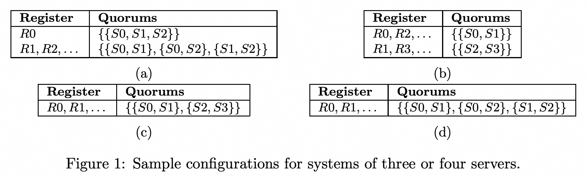
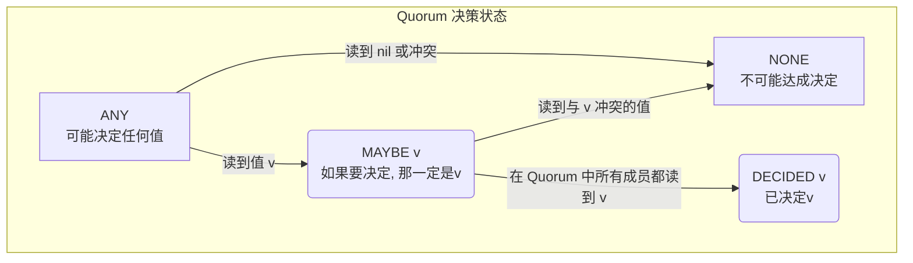
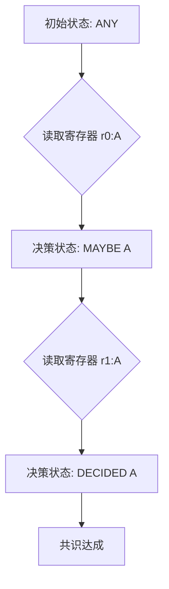

## AI论文解读 | A Generalised Solution to Distributed Consensus
        
### 作者        
digoal        
        
### 日期        
2025-09-17       
        
### 标签        
PostgreSQL , PolarDB , DuckDB , AI , 论文解读        
        
----        
        
## 背景  
      
https://arxiv.org/pdf/1902.06776        
  
提示:          
```          
读懂《A Generalised Solution to Distributed Consensus》这篇论文需要提前掌握哪些基础知识, 请使用中文通熟易懂的讲解这些基础知识, 可以引用论文中的图、表或使用Markdown支持的图形(text,mermaid等)增加解释性. 
  
使用中文通熟易懂的解读《A Generalised Solution to Distributed Consensus》这篇论文, 其中的关键内容请着重讲解, 可以引用论文中的图、表或使用Markdown支持的图形(text,mermaid等)增加解释性. 
  
提取《A Generalised Solution to Distributed Consensus》这篇论文中的重要术语, 使用中文对这些术语进行通熟易懂的讲解, 可以引用论文中的图、表或使用Markdown支持的图形(text,mermaid等)增加解释性. 
```     
  
## 1 前置知识 
  
要读懂《A Generalised Solution to Distributed Consensus》这篇论文，您需要提前掌握以下几个核心概念。这篇论文通过一个通用的解决方案，重新审视了分布式共识，并证明了其包含了Paxos算法。

### 1. 分布式共识（Distributed Consensus）

首先，您需要理解**分布式共识**是什么。简单来说，它是在一个由多台计算机组成的网络中，即使其中一些计算机或网络连接出现故障，也要让所有计算机对某个单一值达成一致的能力 。

这篇论文假设了一个“非拜占庭模型” ，即所有计算机都正确执行算法，但它们可能是不可靠或异步的 。这意味着计算机运行速度可能不同，消息也可能被任意延迟 。

该论文中，一个共识算法需要满足三个基本要求 ：
* **非平凡性（Non-triviality）**: 最终确定的值必须是某个客户端的输入值。
* **一致性（Agreement）**: 所有输出值的客户端都必须输出相同的值。
* **进展性（Progress）**: 如果系统在足够长的时间内是可靠和同步的，所有客户端最终都能得到一个输出值。

### 2. Paxos算法

这篇论文将自己的通用解决方案与**Paxos**进行比较，因此理解Paxos的基本工作原理是关键 。

* **基本概念**：Paxos是一种用于解决分布式共识问题的算法 。然而，它在实践中性能较差，并且难以理解 。这篇论文认为Paxos是一种“保守的”实现 。
* **两阶段提交**：Paxos通常被描述为一个两阶段协议 。
    * **第一阶段（Phase 1）**：客户端向服务器发送一个提案，并从多数服务器那里获得一个承诺。此阶段旨在确保不会有不同的值被决定 。
    * **第二阶段（Phase 2）**：客户端将提议的值发送给服务器，并从多数服务器那里获得确认 。

### 3. 法定人数（Quorum）

**法定人数（Quorum）** 是这篇论文和所有共识算法中的核心概念。

* **定义**：一个法定人数是服务器的一个子集 。
* **达成决定**：当一个法定人数中的所有服务器都在同一个“寄存器”中存储了相同的值时，就认为这个值已经“被决定”了 。

这篇论文的一个重要发现是，它能“实质性地削弱”这些广受研究的算法对法定人数的要求 。它引入了两种不同的法定人数配置方式 ：
* **相交法定人数（Intersecting Quorums）**：同一个寄存器集合中的所有法定人数都必须相交（即有共同的服务器） 。
* **客户端受限（Client Restricted）**：将寄存器集合分配给特定的客户端，并要求客户端只写入自己的寄存器集合 。

### 4. 不可变状态与一次性写入寄存器

这篇论文的核心思想之一是使用**不可变状态**来简化对正确性的推理 。

* **一次性写入寄存器（Write-once registers）**：论文假设每台服务器都有一系列只能写入一次的持久化寄存器 。
* **三种状态**：每个寄存器都处于以下三种状态之一：未写入、包含一个值（例如A, B, C）或包含一个特殊值“nil” 。

这种不可变性保证了如果一个寄存器包含了某个值，任何后续的读取都会得到相同的值 。

### 5. 状态表与决策表

为了实现这套规则，论文引入了**状态表**和**决策表**的概念 。

* **状态表**：客户端维护一个本地的状态表副本，通过读取服务器上的寄存器来填充 。
* **决策表**：客户端根据其本地状态表，跟踪每个法定人数是否已达成或可能达成决定 。决策有四种状态 ：
    * **ANY**：任何值都可能被决定。
    * **MAYBE v**：如果这个法定人数达成决定，那么值v将被决定。
    * **DECIDED v**：值v已被决定（最终状态）。
    * **NONE**：这个法定人数将不会决定一个值（最终状态）。

下面是一个简化的决策表示例，展示了客户端如何根据读取到的信息更新其决策状态 ：

| 寄存器 | 法定人数 | 初始状态 | 读取 R1:B | 读取 R0:A | 读取 R1:B (S2) |
|---|---|---|---|---|---|
| R0 | {S0, S1} | `ANY` | `MAYBE B` | `NONE` | `NONE` |
| R1 | {S2, S3} | `ANY` | `MAYBE B` | `MAYBE B` | `DECIDED B` |

---
希望这些基础知识能帮助您更好地理解这篇论文。如果您在阅读过程中遇到其他概念上的困惑，或者想让我对论文中的特定部分（例如某个图表）进行更详细的解释，请随时提出。
  
## 2 解读论文 
  
好的，我们来一起用通俗易懂的方式解读这篇很有影响力的论文《A Generalised Solution to Distributed Consensus》。

这篇论文的核心思想不是提出一个全新的、具体的共识算法，而是**提供了一个更通用、更抽象的“范式”或“框架”来理解和设计共识算法**。它证明了像 Paxos、Fast Paxos 这样的著名算法，其实只是这个通用框架下的特定实例，并且它们的某些设计（特别是关于 Quorum 的要求）过于保守，其实可以放宽限制以获得更好的性能和灵活性。

-----

### 核心思想：用“不可变状态”重新定义共识问题

传统的 Paxos 算法充满了各种提案编号、接受者、学习者等角色和可变的状态，这使得它非常难以理解。而这篇论文返璞归真，将共识过程建模为对一系列**只能写入一次的寄存器 (write-once registers)** 的操作。

想象一下，我们有一组服务器（Servers），比如 `S0, S1, S2`。每个服务器都有一系列无限的、编号的寄存器 `R0, R1, R2, ...`。这些寄存器一旦被写入一个值（比如 'A'），就再也不能被修改或覆盖。这就是所谓的“**不可变状态**”，它让推理过程变得非常简单。

在这个模型下，有几个关键概念：

  * **寄存器组 (Register Set)**: 所有服务器上相同编号的寄存器构成一个“寄存器组”。例如，所有服务器的 `R0` 寄存器合起来就是“寄存器组0”。
  * **Quorum (法定集合)**: 这是一个服务器的子集。论文中对它的定义非常灵活，这也是整个通用框架的关键。比如，对于一个有4个服务器 `{S0, S1, S2, S3}` 的系统，一个 Quorum 可以是任意3个服务器，也可以是 `{S0, S1}` 或者 `{S2, S3}`。
  * **决定 (Decided)**: 当一个 **Quorum** 内的所有服务器在**同一个寄存器组**（比如 R1）中都写入了**相同的非空值 `v`** 时，我们就说值 `v` 在寄存器组 R1 中被“决定”了。

下面的图表演示了 Quorum 的灵活性。在 Paxos 中，Quorum 通常是“大多数”节点（如图d），但这篇论文指出，Quorum 的配置可以是多种多样的（如图a, b, c）。

| Register     | Quorums                           |
| :----------- | :-------------------------------- |
| R0, R1, ... | {{S0, S1}, {S2, S3}}              |
|              | *(c) 适用于4个服务器的非相交Quorum* |

| Register     | Quorums                              |
| :----------- | :----------------------------------- |
| R0, R1, ... | {{S0, S1}, {S0, S2}, {S1, S2}}       |
|              | *(d) 适用于3个服务器的“大多数”Quorum* |


   

*(引用自论文 Figure 1c 和 1d)*

-----

### 关键内容：保证共识正确性的四条规则

为了确保在这个模型上达成的共识是正确的（即所有客户端最终都同意同一个值），论文提出了四条客户端必须遵守的核心规则。

#### 规则1：Quorum 同意 (Quorum agreement)

> **客户端只能输出一个值 `v`，前提是它已经从某个寄存器组的某个 Quorum 中读到了 `v`。** 

**通俗解释**：只有被一个“法定集合”一致同意的事情，才能算是最终决定。这保证了客户端不会输出一个尚未达成共识的中间值。

#### 规则2：新值的来源 (New value)

> **客户端只能向寄存器写入一个值 `v`，这个 `v` 要么是它自己的输入值，要么是它从其他寄存器里读出来的值。** 

**通俗解释**：不能无中生有。所有达成共识的值，最终源头一定是某个客户端最初提议的。这保证了共识的**非平凡性 (Non-triviality)**。

#### 规则3：当前决策的一致性 (Current decision)

> **客户端在向某个寄存器组 `r` 写入值 `v` 之前，必须确保在同一个寄存器组 `r` 中，不可能有另一个 Quorum 决定一个不同的值 `v'`。** 

**通俗解释**：“同一轮投票”不能分裂。为了实现这一点，论文提出了两种策略：

1.  **相交 Quorums (Intersecting Quorums)**: 要求同一个寄存器组 `r` 的**所有** Quorum 配置都必须至少有一个共同的服务器。这样，如果两个 Quorum 想决定不同的值，它们会在那个共同的服务器上产生冲突，从而阻止了分裂。
2.  **客户端限制 (Client Restricted)**: 将一个寄存器组（比如 `R5`）专门分配给一个客户端。只有这个客户端能往 `R5` 里写，并且只能写一次。这样自然就保证了 `R5` 这个寄存器组里不会出现冲突的值。 

#### 规则4：历史决策的一致性 (Previous decisions)

> **客户端在向寄存器组 `r` 写入值 `v` 之前，必须确保在所有更早的寄存器组（从 0 到 `r-1`）中，不可能决定一个和 `v` 不同的值。** 

**通俗解释**：“尊重历史”。在做出新决定前，必须先回顾历史，确保新决定不会与任何已经（或可能已经）达成的旧决定相矛盾。这是保证所有客户端最终只输出**一个相同值 (Agreement)** 的关键。

-----

### 如何实现规则：客户端的“决策表”

规则1和2很容易实现，但规则3和4，特别是规则4，实现起来很复杂。客户端如何知道“不可能”决定一个不同的值呢？它又看不到所有服务器的全部状态。

论文为此引入了一个非常重要的机制：**客户端本地的决策表 (Decision Table)** 。每个客户端通过读取服务器的寄存器状态，在本地维护一张表，追踪每个 Quorum 的“决策状态”。这个状态有四种：



  * **ANY**: 初始状态，任何值都可能被这个 Quorum 决定。 
  * **MAYBE v**: 客户端已经掌握了一些信息，如果这个 Quorum 最终能做决定，那么决定的值一定是 `v`。 
  * **DECIDED v**: 客户端确认这个 Quorum 已经决定了值 `v`。 
  * **NONE**: 客户端确认这个 Quorum 不可能再做出任何决定了（比如因为读到了冲突值或 `nil`）。 

客户端在写入一个新值到寄存器组 `r` 之前，会检查自己决策表中所有 `r-1` 及之前的 Quorum 状态。只有当这些历史 Quorum 的状态都是 `NONE`、`MAYBE v` 或 `DECIDED v` 时（即不会决定出与 `v` 冲突的值），写入操作才是安全的。 

-----

### Paxos 是如何被“广义化”的

这篇论文最精彩的部分，就是展示了经典的 Paxos 算法如何完美地 फिट进这个通用框架里。

  * **Paxos 的提案编号** 对应 **寄存器组编号** (`R0, R1, ...`)。
  * **Paxos 的 Quorum** 就是 **“大多数”服务器**，这只是 Quorum 配置的一种。
  * **Paxos 的算法流程** 其实就是在实现上述的四条规则：
      * **Phase 1 (Prepare/Promise)**: 本质上是客户端在**实现规则4**。客户端通过向一个 Quorum 发送 Prepare 请求，来读取更早的寄存器组（更高的提案编号）的状态，更新自己的决策表，确保自己将要写入的值不会与历史决策冲突。
      * **Phase 2 (Accept/Accepted)**: 本质上是客户端在**实现规则1和规则3**。客户端向一个 Quorum 发送 Accept 请求，尝试让它们在某个寄存器组里写入相同的值，从而“决定”这个值。

#### 重大发现：放宽 Quorum 的交集要求

传统的 Paxos/Flexible Paxos 要求非常严格的 Quorum 交集。而这篇论文通过其通用框架证明，这个要求被过分简化和加强了。实际上，我们不需要“任意两个 Quorum”都相交。

更精确（也更宽松）的要求是：

> 对于任意一个寄存器组 **r**，其 **Phase 1** 使用的 Quorum ( $Q\_r^1$ )，只需要和**所有比 r 小的**寄存器组 (r' \< r) 的 **Phase 2** 使用的 Quorum ( $Q\_{r'}^2$ ) 相交即可。 

用数学公式表达就是：  

$$\forall r\in\mathbb{N}_{0},\forall r^{\prime}\in\mathbb{N}_{<r}:I(\mathcal{Q}_{r}^{1},\mathcal{Q}_{r^{\prime}}^{2})$$
  
其中 $I$ 函数表示集合相交  

这个发现的意义重大，它意味着我们可以设计出更灵活、性能更好的 Quorum 系统，而不破坏算法的正确性。

-----

### 总结

总的来说，这篇论文的贡献可以概括为：

1.  **提出了一个通用的、基于不可变状态的共识模型**，比 Paxos 的描述更简单、更易于推理。
2.  **用四条核心规则定义了共识的安全性**，并展示了如何通过客户端决策表来实现这些规则。
3.  **证明了 Paxos 等算法是该通用模型下的特例**，从而统一了对这类算法的理解。
4.  **揭示并放宽了 Paxos 等算法中关于 Quorum 交集的保守要求**，为设计新型、高效的共识协议打开了大门，并给出了几个实例（如同地部署共识、固定大多数共识、可重配置共识等） 。

它让我们从“学习一个具体的算法”提升到了“理解一类算法的设计范式”的高度。

-----

希望这个解读对您有帮助！这篇论文确实很有深度，将复杂的问题抽象化，并从中得出了非常深刻的见解。

接下来，您是想深入了解 "决策表" 的具体更新逻辑，还是对论文中提到的那几个新的共识算法实例更感兴趣？
  
## 3 术语 
  
在《A Generalised Solution to Distributed Consensus》这篇论文中，作者提出了一套通用的分布式共识解决方案，并以此重新审视了许多经典的共识算法。要理解这篇论文，掌握以下几个核心术语至关重要：

### 1\. 分布式共识（Distributed Consensus）

这是论文的核心问题。通俗地说，**分布式共识**就是让网络中的所有参与者（通常是计算机）在面对故障（如网络延迟、服务器宕机）时，能够就一个单一的值达成一致。想象一下一个团队需要就一个重要决定进行投票，即使有些成员缺席或沟通不畅，最终也要达成一个统一的决定。这篇论文的目标就是提供一个通用的“投票”机制。

### 2\. 法定人数（Quorum）

**法定人数**是这篇论文，乃至所有分布式共识算法的基石。一个“法定人数”指的是服务器的一个子集。当一个提案得到了一个**法定人数**中的所有服务器的认可时，这个提案就被认为是最终确定的（“被决定”）。

论文提出了两种关键的法定人数配置方式：

  * **相交法定人数（Intersecting Quorums）**：这种法定人数的任意两个子集都必须有共同的服务器。这样可以保证，任何两个成功的提案都至少在一个服务器上有所交集，从而避免不一致性。Paxos算法就是使用了这种法定人数。
  * **客户端受限（Client Restricted）**：这是一种更为宽松的配置，它允许不同的法定人数集合不相交。但是，它通过将特定的“寄存器集合”（后面会讲到）分配给特定的客户端来维持一致性。

### 3\. 一次性写入寄存器（Write-once registers）

这是论文中用于简化共识逻辑的核心抽象。论文假设每台服务器都拥有大量**一次性写入寄存器**，这些寄存器一旦写入一个值，就不能再被更改。这种“不可变”的特性使得算法的正确性推理变得更简单。每个寄存器都有三种可能的状态：

  * **未写入**：尚未有任何值被写入。
  * **已写入**：包含一个值（例如 `A`, `B`, `C`）。
  * **nil**：包含一个特殊值，表示此寄存器已被“占用”但未写入有效数据。

### 4\. 状态表（State Table）与决策表（Decision Table）

论文中的客户端（Client）会维护两个核心数据结构来跟踪共识进展：

  * **状态表（State Table）**：客户端通过向服务器读取**一次性写入寄存器**的内容来填充这个表格，它记录了每个寄存器所处的状态。
  * **决策表（Decision Table）**：这是一个更高级的抽象，客户端根据**状态表**的信息，推断出每个**法定人数**是否已经或可能达成共识。决策表有四种状态：
      * **ANY**：任何值都可能被决定。
      * **MAYBE v**：如果这个法定人数达成决定，那么值 `v` 将被决定。
      * **DECIDED v**：值 `v` 已经被决定（这是最终状态）。
      * **NONE**：这个法定人数将不会决定一个值（这也是最终状态）。

下面的图示了一个简化的决策过程，展示了客户端如何根据读取到的信息更新其决策状态。



-----

希望这些术语的解释能够帮助您更好地理解这篇论文。您接下来希望我详细讲解论文中的哪一部分，例如，您可以指定一个具体的图表，或者让我解释一下论文中关于其通用方案如何“包含”Paxos算法的证明吗？
  
## 参考        
         
https://arxiv.org/pdf/1902.06776    
        
<b> 以上内容基于DeepSeek、Qwen、Gemini及诸多AI生成, 轻微人工调整, 感谢杭州深度求索人工智能、阿里云、Google等公司. </b>        
        
<b> AI 生成的内容请自行辨别正确性, 当然也多了些许踩坑的乐趣, 毕竟冒险是每个男人的天性.  </b>        
    
#### [期望 PostgreSQL|开源PolarDB 增加什么功能?](https://github.com/digoal/blog/issues/76 "269ac3d1c492e938c0191101c7238216")
  
  
#### [PolarDB 开源数据库](https://openpolardb.com/home "57258f76c37864c6e6d23383d05714ea")
  
  
#### [PolarDB 学习图谱](https://www.aliyun.com/database/openpolardb/activity "8642f60e04ed0c814bf9cb9677976bd4")
  
  
#### [PostgreSQL 解决方案集合](../201706/20170601_02.md "40cff096e9ed7122c512b35d8561d9c8")
  
  
#### [德哥 / digoal's Github - 公益是一辈子的事.](https://github.com/digoal/blog/blob/master/README.md "22709685feb7cab07d30f30387f0a9ae")
  
  
#### [About 德哥](https://github.com/digoal/blog/blob/master/me/readme.md "a37735981e7704886ffd590565582dd0")
  
  

  
