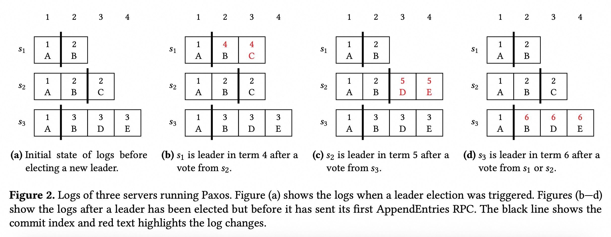
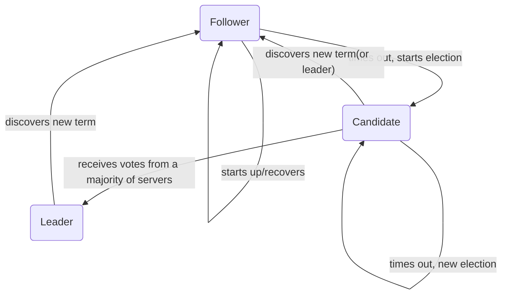
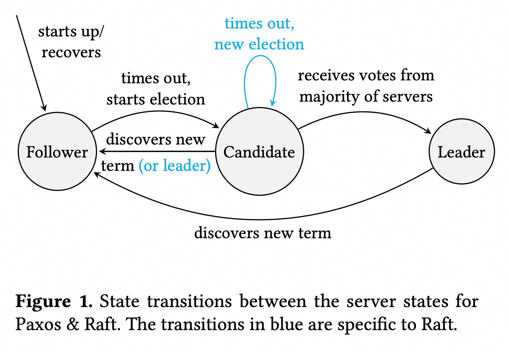
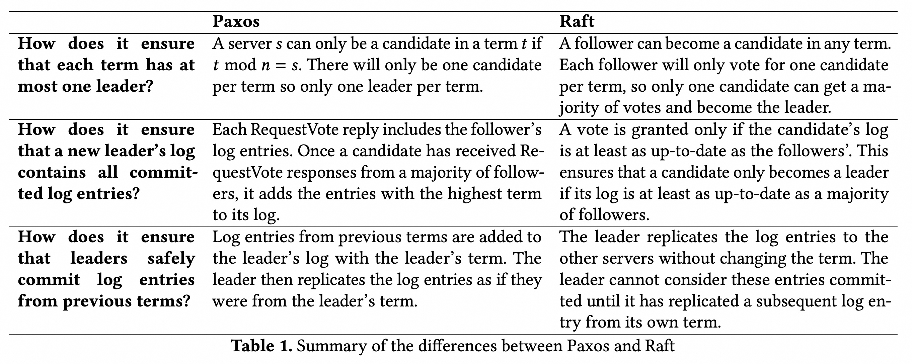

## AI论文解读 | Paxos vs Raft: Have we reached consensus on distributed consensus?
        
### 作者        
digoal        
        
### 日期        
2025-09-17       
        
### 标签        
PostgreSQL , PolarDB , DuckDB , AI , 论文解读        
        
----        
        
## 背景  
      
https://dl.acm.org/doi/pdf/10.1145/3380787.3393681        
  
提示:          
```          
读懂《Paxos vs Raft: Have we reached consensus on distributed consensus?》这篇论文需要提前掌握哪些基础知识, 请使用中文通熟易懂的讲解这些基础知识, 可以引用论文中的图、表或使用Markdown支持的图形(text,mermaid等)增加解释性. 
  
使用中文通熟易懂的解读《Paxos vs Raft: Have we reached consensus on distributed consensus?》这篇论文, 其中的关键内容请着重讲解, 可以引用论文中的图、表或使用Markdown支持的图形(text,mermaid等)增加解释性. 
  
提取《Paxos vs Raft: Have we reached consensus on distributed consensus?》这篇论文中的重要术语, 使用中文对这些术语进行通熟易懂的讲解, 可以引用论文中的图、表或使用Markdown支持的图形(text,mermaid等)增加解释性. 
```     
  
## 1 前置知识 
  
好的，为了更好地理解这篇名为《Paxos vs Raft: Have we reached consensus on distributed consensus?》的论文，你需要先掌握一些关于**分布式系统**和**分布式一致性**的基础概念。

-----

### 什么是分布式系统？

简单来说，一个分布式系统是由多台独立的计算机通过网络连接起来，共同协作完成一个任务的系统。这些计算机被称为**服务器**或**节点**。

想象一下，你有一个网站，访问量非常大。如果只用一台服务器来承载，它可能会因为负载过高而崩溃。分布式系统就是把这个网站的服务部署在多台服务器上，让它们一起工作，这样既能分摊负载，又能提高系统的可用性。如果其中一台服务器宕机了，其他服务器可以继续提供服务。

### 为什么需要分布式一致性？

在分布式系统中，由于多台服务器同时工作，一个主要挑战就是如何让它们的数据保持**一致**。

例如，一个在线商店的库存系统，如果一个商品只剩一件，当两个客户同时购买时，系统必须确保只有一个客户能购买成功。如果两台处理购买请求的服务器各自独立工作，它们可能会都认为自己成功卖出了这最后一件商品，导致数据不一致。

分布式一致性就是解决这个问题的，它要求在所有服务器上，数据都必须以相同的、可靠的方式进行更新。这篇论文讨论的 **Paxos** 和 **Raft** 就是两种用于实现分布式一致性的著名算法。

### 分布式一致性算法的核心概念

分布式一致性算法通常基于**状态机复制**（State Machine Replication）来实现 。其核心思想是：

  * **复制状态机**：在每台服务器上运行一个完全相同的确定性程序（状态机）。
  * **复制日志**：所有服务器都维护一个相同的、按顺序排列的操作日志（replication log）。
  * **一致性**：通过一致性算法，确保所有服务器上的操作日志内容和顺序都保持一致。
  * **应用操作**：当日志中的一个操作被大多数服务器确认（即达成“共识”）后，每台服务器都会按照日志顺序将该操作应用到自己的状态机上，从而保证所有状态机最终会达到相同的状态 。

论文中的图2就形象地展示了服务器日志的状态，每个框格代表一个**日志条目**（log entry），包含一个操作和一个**任期**（term）。

  

### Paxos 和 Raft 共同的运作模式

这两种算法都采用了**基于领导者**（leader-based）的方法来实现分布式一致性 。它们的运作模式如下：

1.  **选举领导者**：从多个服务器中选出一台作为**领导者**（Leader）。
2.  **日志复制**：所有对系统的操作请求都必须先发送给领导者 。
3.  **达成共识**：领导者将操作添加到自己的日志中，并发送请求给其他服务器（**追随者**，Follower），要求它们也这样做 。
4.  **提交操作**：当领导者从**大多数服务器**那里收到确认后，它就可以将这个操作标记为“已提交”，并应用到自己的状态机上 。
5.  **领导者失败**：如果领导者宕机，其他服务器会通过新一轮的选举，选出新的领导者 。

论文中的图1很好地展示了服务器的三种状态以及它们之间的转换：**追随者**（Follower）、**候选者**（Candidate）和**领导者**（Leader）。



  

（注：这个流程图是根据论文中的图1绘制的，但省略了图1中Raft特有的蓝色部分，因为它代表了两种算法的差异，而我们现在关注的是它们的共同点。）

-----

### 接下来，你可能想更深入地了解这两种算法是如何在**领导者选举**和**日志复制**上具体运作的。你对 Paxos 或 Raft 的哪个方面更感兴趣？
  
## 2 解读论文 
  
好的，我们来通俗易懂地解读这篇名为《Paxos vs Raft: 我们就分布式共识达成共识了吗？》的经典论文。

这篇论文的核心目标是深入探讨两个在工业界最主流的分布式共识算法——Paxos和Raft——究竟有何不同，以及哪个是更好的解决方案 。作者通过使用Raft的术语和风格来重新描述一个简化版的Paxos算法，从而进行了一次“公平”的对比 。

### 论文核心观点

简单来说，论文的结论是：

  * **Raft的易理解性主要归功于其出色的论文表述和清晰的抽象，而非算法本身具有根本性的优势** 。
  * **Paxos和Raft在实现分布式共识的思路上非常相似，唯一的根本性区别在于“领导者选举”（Leader Election）的策略** 。
  * **Raft的领导者选举机制虽然简单，但其效率惊人地高** 。

-----

### 1\. 两大算法的共同基础：领导者模式

首先，要理解它们的区别，我们先要看它们的共同点。Paxos和Raft都采用了“领导者-跟随者”（Leader-Follower）的模式来达成共识 。

这个模式的工作流程可以简化为：

1.  **选出一个领导者**：在一群服务器中，有且仅有一个是领导者（Leader），其余都是跟随者（Follower）。
2.  **领导者说了算**：所有的数据写入请求都发送给领导者 。
3.  **同步给小弟**：领导者将请求作为日志条目（log entry）记录下来，并发送给所有跟随者 。
4.  **多数确认即提交**：当大多数（majority）跟随者确认收到后，领导者就“提交”（commit）这个日志，意味着这个数据写入成功了 。
5.  **领导者宕机**：如果领导者失效，大家就重新选举一个新的领导者出来 。

为了管理选举过程，算法引入了一个叫“任期号”（**term**）的概念，它是一个单调递增的数字，就像朝代年号一样 。

#### 服务器的三种状态

无论是Paxos还是Raft，一个服务器在任何时候都处于以下三种状态之一 ：

  * **Follower（跟随者）**：被动接收领导者的指令，响应请求 。
  * **Candidate（候选人）**：当它认为领导者挂了，就发起选举，试图成为新领导 。
  * **Leader（领导者）**：负责处理客户端请求，管理日志复制 。

它们之间的状态转换如下图所示，其中蓝色的转换路径是Raft特有的 。

  

*图1：Paxos与Raft的服务器状态转换图 。*

-----

### 2\. 关键差异：领导者选举策略

这篇论文的精华就在于指出了两者在选举上的根本不同。

#### Paxos的选举策略：先上车，后补票

在Paxos中，选举过程更像是“能者居之，不问出身”。

1.  **成为候选人**：一个跟随者如果长时间没收到领导者的心跳，就可以自行增加任期号，成为候选人并发起投票 。
2.  **投票与日志交换**：其他服务器只要收到更高任期号的投票请求，就会同意投票。**关键在于**，在同意投票的同时，它会把自己日志中比候选人更新的内容也一并发送给候选人 。
3.  **成为领导者并“补全”日志**：候选人一旦获得大多数选票，它并不能立即工作。它必须先检查所有投票者返回的日志信息，**将自己的日志“更新”到最新、最全的状态** 。如果对于同一个日志位置收到了多个不同版本，它会选择任期号最大的那个版本作为最终版本 。

**简单说，Paxos允许任何服务器成为领导者，只要它承诺在当选后，通过向大家“学习”来补全自己的数据，确保自己拥有所有已提交的日志** 。

我们可以通过论文中的图2来理解这个复杂的过程。假设有s1, s2, s3三个服务器，初始日志状态如图(a)所示。黑色竖线代表已提交的位置。

  

*图2：Paxos服务器日志状态示例 。*

  * 如图(b)所示，如果s1在任期4成为领导者，它从s2的投票中得知了日志C的存在。它会把C和自己日志中的D、E合并，并且用新的任期号4来“重写”（re-term）这些未提交的日志 。
  * 如图(c)所示，如果s2在任期5成为领导者，它本身日志就比较全，当选后会将自己的日志D、E同步给别人 。

这个“日志合并”和“重写任期号”的过程是Paxos比较复杂和难以理解的地方 。

#### Raft的选举策略：持证上岗，一步到位

Raft的设计哲学是简化，它的选举机制也更严格，可以理解为“血统论”或“资格审查”。

1.  **成为候选人**：和Paxos类似，跟随者超时后可以成为候选人 。
2.  **投票与资格审查**：候选人向大家请求投票时，会附上自己最后一条日志的索引和任期号 。
3.  **关键限制**：跟随者在投票时有一个**严格的限制**：**它只会投票给那些日志记录“不比自己旧”的候选人** 。这个“up-to-date”的检查是Raft安全性的核心。
4.  **成为领导者**：一旦获得多数选票，这个候选人就直接成为领导者。由于选举机制的保证，**这个新领导者的日志在当选那一刻就一定包含了所有已提交的记录**，无需像Paxos那样再去做合并日志的复杂工作 。

**简单说，Raft通过限制只有拥有最新日志的服务器才能当选，从而极大地简化了领导者当选后的流程** 。

-----

### 3\. 差异总结与对比

论文作者用一个表格清晰地总结了这些差异：

| 特性 | Paxos | Raft |
| :--- | :--- | :--- |
| **如何确保每届任期只有一个领导者？** | 每个服务器被分配了固定的任期号（例如，`t mod n = s`），天然保证了每届只有一个候选人。  | 跟随者在每个任期只会投一票，因此只有一个候选人能获得多数选票。  |
| **如何确保新领导者日志的完整性？** | 投票回复中包含跟随者的日志。新领导者当选后，必须将收到的所有日志中任期号最高的条目合并到自己的日志中。  | 跟随者只会投票给日志至少和自己一样新的候选人。这保证了当选者的日志一定包含了多数节点的最新信息。  |
| **如何安全地提交旧任期的日志？** | 领导者会用自己当前的任期号“重写”旧任期的日志条目，然后像新条目一样进行复制。  | 领导者直接复制旧任期的日志条目（任期号不变）。但这些日志条目必须等到当前任期的一条新日志也被成功复制后，才能被一起提交。  |

  

*表格1：Paxos与Raft差异总结*

#### 易理解性 (Understandability)

  * **Paxos的复杂性**：一个日志条目可能在不同领导者任期内被赋予不同的任期号，这很绕 。
  * **Raft的复杂性**：Raft也有一个不容易理解的规则，即领导者不能直接提交之前任期的日志，必须等到当前任期的新日志也提交后才能间接提交它们 。
  * **结论**：作者认为，Raft确实比Paxos**稍微**容易理解，但没有达到“显著”的程度 。

#### 效率 (Efficiency)

  * **选举速度**：Raft在多个候选人同时竞选时，可能发生“选票瓜分”（split votes），导致选举失败并需要等待超时重试，这会增加延迟 。而Paxos的任期分配机制避免了这种情况 。
  * **选举开销**：Raft的选举过程非常轻量，RPC（远程过程调用）只包含元数据 。而Paxos的投票回复中需要携带日志内容，网络开销更大 。
  * **结论**：Raft的选举机制虽然简单，但因为不需要传输日志，所以**惊人地高效** 。

-----

### 最终结论

这篇论文通过一次精彩的“控制变量”对比，得出了一个非常中肯的结论：

Raft和Paxos本质上是同一类算法 。Raft最大的贡献在于用一种非常工程化、易于理解的方式**呈现**了一个共识算法，它的易懂性更多来自于论文的写作和抽象方式，而不是算法本身的颠覆性创新 。

两者最核心的区别在于领导者选举：

  * **Paxos**：允许任何人当领导，但当选后必须“补课”，更新自己的日志。
  * **Raft**：只允许“学习最好”的人当领导，当选后直接上岗。

最终，论文认为Raft在选举机制上的简化和带来的高效率是其一大亮点，但两个算法在根本的理解难度上并没有天壤之别 。
  
## 3 术语 
  
你好，我很乐意帮助你梳理这篇论文中的重要术语。理解这些核心概念是掌握论文内容的关键。下面我将为你解释这篇论文中提到的一些重要术语。

### 核心术语

* **分布式共识 (Distributed Consensus)**：这是一个计算机科学中的基本问题，指的是在一个由多个节点组成的分布式系统中，如何让所有节点就某个单一值或操作达成一致。这篇论文正是围绕这一主题，比较了两种主流的分布式共识算法：Paxos 和 Raft 。

* **状态机复制 (State Machine Replication)**：这是实现容错、强一致性分布式服务的一种方法 。其核心思想是在多个服务器上复制一个确定性的**状态机**，并使用一个分布式共识算法来确保所有服务器都以相同的顺序应用相同的操作日志，从而保证它们的状态始终保持一致 。论文中提到，许多服务（如数据库和文件系统）就是通过这种方式来构建的 。

* **领导者 (Leader)**：在基于领导者的共识算法中，某个服务器会被选为领导者，负责接收客户端的所有操作请求，并将这些操作以日志条目的形式复制到其他服务器 。

* **追随者 (Follower)**：除了领导者以外的所有服务器，它们被动地响应来自领导者的请求 。

* **候选者 (Candidate)**：当追随者发现领导者已失效时，它会进入候选者状态，试图通过选举成为新的领导者 。

* **任期 (Term)**：这是一个单调递增的整数，用于标识一个领导者周期 。论文中提到，当服务器接收到的RPC（远程过程调用）中的任期号大于自己的任期号时，它会更新自己的任期号并退回追随者状态 。

* **日志 (Log)**：每个服务器都维护一个有序的日志，其中包含了要应用到状态机上的操作序列 。日志中的每个条目都包含一个命令和一个任期号 。

* **日志条目 (Log Entry)**：日志中的一个记录单元，由一个操作（如“增加库存”）和一个任期号组成 。

* **多数 (Majority)**：在 Paxos 和 Raft 中，多数指的是超过一半的服务器。这是达成共识的关键。例如，一个领导者只有在收到多数服务器的确认后，才能将一个日志条目标记为已提交 。这个概念是确保新当选的领导者拥有所有已提交日志条目的基础 。

* **提交索引 (Commit Index)**：这是一个整数，表示一个日志条目已经被多数服务器复制，因此可以安全地应用到状态机上 。

---
### Paxos 与 Raft 的主要区别

论文在**表1**中总结了 Paxos 和 Raft 在领导者选举和安全性保障上的不同之处。   

1.  **领导者选举机制**：
    * **Paxos**：通过一种名为“阶段1”的协议进行领导者选举，确保每个任期只有一个候选者。每个服务器都有自己专属的任期号集，只有当其任期号符合特定规则时（例如：`t mod n = s`，其中 `t` 是任期号，`n` 是服务器总数，`s` 是服务器ID），才能成为候选者。这样可以避免多个候选者同时出现导致选票分散的问题 。
    * **Raft**：允许任何追随者在超时后成为候选者并增加其任期号。它通过“请求投票（RequestVote）”RPC来收集选票。为了避免选票分散，Raft 引入了随机选举超时时间，从而减少多个候选者同时出现的情况 。

2.  **日志完整性**：
    * **Paxos**：允许任何服务器成为领导者，即使其日志不是最新的。新的领导者在选举过程中会从追随者那里收集最新的日志条目来更新自己的日志 。这意味着 Paxos 领导者在选举阶段需要通过网络传输日志数据，其选举过程可能因此更“重” 。
    * **Raft**：只有日志**最新**的候选者才能被选为领导者 。Raft 的投票机制强制要求候选者的日志必须至少和投票者的日志一样新 。这使得 Raft 的领导者选举过程更轻量，因为新领导者不需要在选举阶段从其他服务器那里同步日志 。

3.  **日志条目管理**：
    * **Paxos**：一个日志条目在不同任期中可能会有不同的任期号。例如，一个领导者可能会用自己当前的任期号来重新复制一个来自旧任期的日志条目 。
    * **Raft**：日志条目一旦被创建，其任期号就不会改变 。这使得 Raft 的日志管理更直观 。

你是否想进一步了解这两种算法在**领导者选举**或**日志复制**上的具体协议细节？
  
## 参考        
         
https://dl.acm.org/doi/pdf/10.1145/3380787.3393681    
        
<b> 以上内容基于DeepSeek、Qwen、Gemini及诸多AI生成, 轻微人工调整, 感谢杭州深度求索人工智能、阿里云、Google等公司. </b>        
        
<b> AI 生成的内容请自行辨别正确性, 当然也多了些许踩坑的乐趣, 毕竟冒险是每个男人的天性.  </b>        
    
#### [期望 PostgreSQL|开源PolarDB 增加什么功能?](https://github.com/digoal/blog/issues/76 "269ac3d1c492e938c0191101c7238216")
  
  
#### [PolarDB 开源数据库](https://openpolardb.com/home "57258f76c37864c6e6d23383d05714ea")
  
  
#### [PolarDB 学习图谱](https://www.aliyun.com/database/openpolardb/activity "8642f60e04ed0c814bf9cb9677976bd4")
  
  
#### [PostgreSQL 解决方案集合](../201706/20170601_02.md "40cff096e9ed7122c512b35d8561d9c8")
  
  
#### [德哥 / digoal's Github - 公益是一辈子的事.](https://github.com/digoal/blog/blob/master/README.md "22709685feb7cab07d30f30387f0a9ae")
  
  
#### [About 德哥](https://github.com/digoal/blog/blob/master/me/readme.md "a37735981e7704886ffd590565582dd0")
  
  

  
