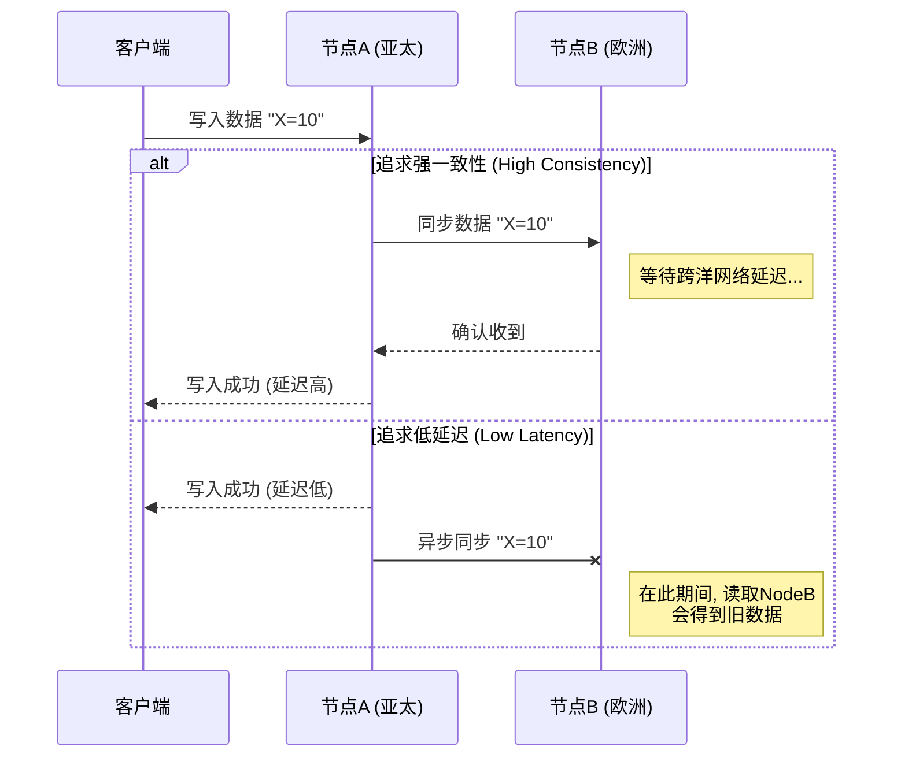
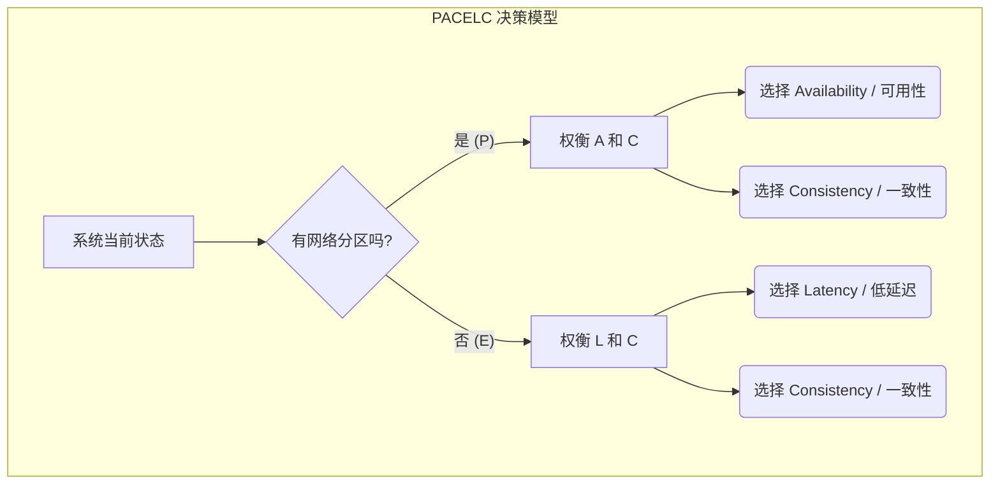

## AI论文解读 | Consistency Tradeoffs in Modern Distributed Database System Design
        
### 作者        
digoal        
        
### 日期        
2025-09-17       
        
### 标签        
PostgreSQL , PolarDB , DuckDB , AI , 论文解读        
        
----        
        
## 背景  
      
https://ieeexplore.ieee.org/stamp/stamp.jsp?tp=&arnumber=6127847        
  
提示:          
```          
读懂《Consistency Tradeoffs in Modern Distributed Database System Design》这篇论文需要提前掌握哪些基础知识, 请使用中文通熟易懂的讲解这些基础知识, 可以引用论文中的图、表或使用Markdown支持的图形(text,mermaid等)增加解释性. 
  
使用中文通熟易懂的解读《Consistency Tradeoffs in Modern Distributed Database System Design》这篇论文, 其中的关键内容请着重讲解, 可以引用论文中的图、表或使用Markdown支持的图形(text,mermaid等)增加解释性. 
  
提取《Consistency Tradeoffs in Modern Distributed Database System Design》这篇论文中的重要术语, 使用中文对这些术语进行通熟易懂的讲解, 可以引用论文中的图、表或使用Markdown支持的图形(text,mermaid等)增加解释性. 
```     
  
## 1 前置知识 
  
这篇名为《Consistency Tradeoffs in Modern Distributed Database System Design》的论文讨论了现代分布式数据库系统（DDBSs）设计中的权衡问题。为了更好地理解这篇论文，你需要掌握以下几个关键的基础知识：

### 1. 分布式数据库系统（DDBSs）
分布式数据库系统，顾名思义，就是将数据分散存储在多台通过网络连接的计算机上，这些计算机共同工作以提供一个统一的数据库服务。这种架构的出现主要是为了解决两个问题：
* **可扩展性（Scalability）：** 现代应用程序需要处理海量数据和高并发事务，单台计算机的性能很快就会达到瓶颈。通过将数据库分布在多台机器上，系统可以弹性地扩展，以应对不断增长的需求 。
* **全球化部署（Global Accessibility）：** 将数据存储在离用户地理位置更近的地方，可以显著减少访问延迟，提高用户体验 。

### 2. ACID 事务
ACID 是数据库事务的四个关键属性的首字母缩写：
* **Atomicity（原子性）：** 一个事务要么完全成功，要么完全失败。不存在部分完成的事务。
* **Consistency（一致性）：** 务必确保事务将数据库从一个有效状态转换到另一个有效状态。在分布式系统中，这通常指的是所有副本的数据都保持同步。
* **Isolation（隔离性）：** 多个并发事务的执行互不干扰，每个事务都感觉自己是唯一在执行的事务。
* **Durability（持久性）：** 一旦事务提交，其对数据库的改变就是永久的，即使发生系统故障也不会丢失。

### 3. CAP 理论（CAP Theorem）
CAP 理论是理解分布式系统设计权衡的基础。它指出，在分布式系统中，你最多只能同时满足以下三个理想属性中的两个 ：
* **Consistency（一致性）：** 指的是所有数据副本在同一时间都保持一致。论文中引用了 Seth Gilbert 和 Nancy Lynch 对“原子/可线性化一致性”（atomic/linearizable consistency）的定义：“必须存在一个所有操作的总顺序，使得每个操作看起来就像是在一个瞬间完成的。”  简单来说，系统表现得就像只有一个节点在响应操作。
* **Availability（可用性）：** 每次对数据库的读写请求都能得到一个（非错误的）响应。
* **Partition Tolerance（分区容错性）：** 即使网络出现分区，导致系统中的某些节点无法相互通信，系统依然能够继续运行。

论文强调，CAP 理论的限制只在**网络分区发生时**才适用 。在正常运行情况下，CAP 理论并不限制系统同时具备一致性和可用性 。

### 4. 一致性与延迟的权衡（Consistency/Latency Tradeoff）
这是论文的核心观点之一，也是 CAP 理论之外的另一个重要权衡。这种权衡在系统**正常运行**时就存在，与网络分区无关 。

当一个分布式数据库系统为了提高可用性而进行数据复制时，就会出现一致性和延迟之间的权衡 。例如，为了保证高可用性，数据通常会复制到多个节点上，甚至跨越广域网（WAN） 。在数据更新时，系统面临着两种选择：
* **高一致性：** 更新操作需要等待所有或大多数副本都完成同步，然后才返回成功。这确保了所有副本数据的一致性，但会因为网络通信和等待时间而增加延迟 。
* **低延迟：** 更新操作在本地副本完成或部分副本完成同步后就立即返回。这大大降低了延迟，但由于数据尚未传播到所有副本，可能导致后续的读取操作获得不一致的结果 。

论文举了几个例子来解释这种权衡，例如：
* **PNUTS：** 采用异步复制，牺牲了一致性来换取低延迟 。
* **SimpleDB：** 在一个研究中，如果一致性读取请求被路由到距离很近的主节点，其延迟增加不明显。但如果读取请求和主节点地理位置相距遥远（例如跨越不同地区），延迟会显著增加 。

### 5. PACELC 理论
为了更全面地描述分布式数据库的权衡，论文提出了 PACELC 理论，它将 CAP 理论和一致性/延迟权衡结合起来 ：
* **PA/ELC:** **P**artition: If there is a **P**artition, how do you trade off **A**vailability and **C**onsistency?
* **PAC/ELC:** **E**lse: When there is no partition, how do you trade off **L**atency and **C**onsistency?

它描述了系统在两种情况下做出的选择：
* **当出现分区（P）时**，系统如何权衡可用性（A）和一致性（C）。
* **当没有分区（E）时**，系统如何权衡延迟（L）和一致性（C）。

这能更好地解释现代 DDBS 的设计，例如：
* **Dynamo, Cassandra, Riak** 被归类为 **PA/EL** 系统：在分区时选择可用性，在正常运行时选择低延迟 。
* **VoltDB/H-Store, Megastore** 被归类为 **PC/EC** 系统：在任何情况下都坚持一致性，为此牺牲可用性和延迟 。
* **PNUTS** 被归类为 **PC/EL** 系统：在分区时选择一致性，但在正常运行时选择低延迟 。

---

如果你想更深入地了解这些基础知识，我可以为你提供一个学习路线，从理论概念到具体的系统案例。你希望我从哪方面开始？
  
## 2 解读论文 
  
好的，我们来一起用通俗易懂的方式解读这篇分布式系统领域的经典论文——《Consistency Tradeoffs in Modern Distributed Database System Design》。

这篇论文的核心观点非常清晰：广为人知的 **CAP 定理**虽然重要，但它并不能解释现代分布式数据库系统设计中的所有权衡。实际上，在系统**正常运行**时， **延迟（Latency）** 和 **一致性（Consistency）** 之间的权衡，对系统设计的影响甚至比 CAP 更大。为此，作者提出了一个更全面的模型——**PACELC**。

-----

### 第一部分：重新审视 CAP 定理 —— 它只在“出事时”才起作用

首先，我们快速回顾一下 CAP 定理。它指出，一个分布式系统最多只能同时满足以下三个特性中的两个：

  * **C (Consistency / 一致性)**: 所有节点在同一时间看到的数据是完全一致的。
  * **A (Availability / 可用性)**: 每次请求都能收到一个（非错误）的响应，但不保证响应的数据是最新版本。
  * **P (Partition Tolerance / 分区容错性)**: 系统在遇到网络分区（即节点间的网络连接中断）时，仍能继续运行。

对于现代分布式系统来说，网络分区是必然会发生的，所以 **P (分区容错性) 是一个必须满足的选项**。因此，CAP 定理的真正含义是：**当网络分区发生时**，你必须在**一致性 (C)** 和**可用性 (A)** 之间做出选择。

这篇论文首先指出了一个常见的误区：很多人认为系统设计者牺牲一致性，完全是基于 CAP 定理的考量。但作者强调，CAP 的权衡只在**网络分区发生的那一刻**才生效 。在系统正常运行时（没有网络分区），理论上完全可以同时实现高可用性和强一致性 。

> **关键点**：CAP 是一个关于“故障处理”的理论。如果一个系统在平时（正常情况）就降低了一致性，那背后一定还有别的原因，而不仅仅是 CAP。

-----

### 第二部分：被忽略的关键 —— 一致性与延迟的权衡

那么，为什么像 Amazon DynamoDB、Cassandra 这些系统在正常情况下也常常选择牺牲一致性呢？作者指出，这是因为存在另一个更普遍的权衡：**一致性 vs. 延迟 (Consistency vs. Latency)** 。

这个权衡的根源在于**数据复制 (Data Replication)**。为了实现高可用性和容灾，数据必须被复制到多个节点，甚至多个地理位置遥远的数据中心 。一旦引入了数据复制，问题就来了 ：

  * **如果要保证强一致性**：当一个写操作发生时，系统必须等待数据成功同步到所有（或大部分）副本后，才能向用户返回“写入成功”的消息。如果副本分布在全球各地，这个等待过程的延迟会非常高，用户体验会很差 。
  * **如果要保证低延迟**：当一个写操作发生时，系统可以先在本地副本完成写入，然后立即返回成功，再异步地将数据同步到其他副本。这样响应速度极快，但在这个同步窗口期内，如果用户从其他副本读取数据，就会读到旧的（不一致的）数据 。

我们可以用一个简单的流程图来说明这个矛盾：



对于像亚马逊购物车、Facebook 消息流这样的应用，用户的每次点击和刷新都要求极低的延迟。研究表明，哪怕增加100毫秒的延迟，都可能导致用户流失 。因此，这些系统在设计之初就做出了选择：在正常运行时，**为了换取更低的延迟，宁愿牺牲一定的一致性**。

-----

### 第三部分：更完整的模型 —— PACELC 框架

为了将上述两种权衡统一起来，作者提出了 **PACELC** 框架。它将系统的选择分为两种情况 ：

  * **P (Partition / 如果发生分区)**：系统如何在 **A (Availability / 可用性)** 和 **C (Consistency / 一致性)** 之间权衡？ (这部分就是 CAP)
  * **E (Else / 否则，即正常运行时)**：系统如何在 **L (Latency / 延迟)** 和 **C (Consistency / 一致性)** 之间权衡？

我们可以用一个决策树来更清晰地理解 PACELC：



这个模型告诉我们，在评估一个分布式数据库时，需要问两个问题：

1.  **当分区发生时，它会怎么做？** (放弃C保A，还是放弃A保C？)
2.  **当系统正常时，它会怎么做？** (为了低延迟放弃C，还是为了C容忍高延迟？)

-----

### 第四部分：真实世界的系统分类

使用 PACELC 框架，我们可以更好地对现实中的数据库进行分类和理解：

| 系统 | PACELC 分类 | 解读 |
| :--- | :--- | :--- |
| **Dynamo, Cassandra, Riak** | **PA / EL** | 当发生分区时，它们选择**可用性**（PA），允许不同分区继续写入，事后再修复数据冲突。在正常运行时，它们也选择**低延迟**（EL），容忍最终一致性。这是最典型的“牺牲一致性”的设计 。 |
| **PNUTS (Yahoo\!)** | **PC / EL** | 这是一个非常有趣的例子。当发生分区时，它选择**一致性**（PC），会拒绝一部分写入操作以避免数据冲突 。但在正常运行时，它为了**低延迟**（EL）而采用异步复制，牺牲了一致性 。这有力地证明了**正常时的延迟/一致性权衡**与**分区时的可用性/一致性权衡**是两个独立的设计决策。 |
| **VoltDB, Megastore, BigTable** | **PC / EC** | 这类系统始终将**一致性**放在首位。发生分区时，它们会牺牲可用性来保证数据不错乱（PC）。正常运行时，它们也会选择一致性，宁愿为此付出更高的延迟代价（EC） 。 |
| **MongoDB (早期版本)** | **PA / EC** | 在正常运行时，它保证**一致性**（EC），所有读写都发往主节点。但当主节点因分区而隔离时，系统会选举一个新主节点以保证**可用性**（PA），这可能导致旧主节点上的数据和新主节点不一致，需要手动修复 。 |

### 总结

这篇论文的核心贡献在于，它将分布式系统设计的讨论从单纯的、只在故障时才显现的 **CAP**，扩展到了一个更全面、更贴近日常运行的 **PACELC** 框架。它清晰地指出：

1.  **CAP 定理是关于“故障模式”的**，它决定了系统在网络分区时的行为。
2.  **延迟与一致性的权衡是关于“正常模式”的**，它决定了系统在日常运行中的性能表现和数据新鲜度。
3.  对于许多面向用户的现代互联网应用来说，对低延迟的追求是它们在正常情况下选择牺牲一致性的主要驱动力，而不仅仅是为了应对罕见的分区事件。

因此，PACELC 提供了一个更精准的视角，帮助我们理解和设计复杂的分布式数据库系统。

-----

我们已经深入解读了这篇论文的核心思想。接下来，您是想深入了解其中某个特定系统（如 Cassandra 或 PNUTS）在 PACELC 框架下的具体实现细节，还是想探讨一下像 Google Spanner 或 Amazon Aurora 这样的现代分布式数据库是如何试图“挑战”这个框架的？
  
## 3 术语 
  
好的，我已经阅读了这篇论文，并为你提取了其中几个重要的术语，并用通俗易懂的中文进行解释。

### 1. CAP 理论
**全称:** Consistency, Availability, and Partition Tolerance (一致性、可用性、分区容错性) 

**通俗解释:** CAP 理论是分布式系统设计中的一个基本原则。它指出，当构建一个分布式数据库系统（DDBS）时，设计者无法同时满足这三个理想的属性。在网络发生分区（P）时，系统必须在保持数据一致性（C）和提供高可用性（A）之间做出取舍 。

* **一致性（C）:** 确保所有数据副本在同一时间都保持一致。论文中引用了 Gilbert 和 Lynch 对原子/可线性化一致性的定义，要求所有操作看起来就像是在一个单节点上按顺序执行一样 。
* **可用性（A）:** 每次对数据库的读写请求都能得到一个非错误的响应 。
* **分区容错性（P）:** 即使网络出现故障，导致系统中的某些节点无法相互通信，系统依然能够继续运行 。

论文的核心观点之一是，**CAP 理论只在网络分区（P）发生时才起作用**，它不限制系统在正常运行时同时具备一致性和可用性 。

---

### 2. 一致性/延迟权衡 (Consistency/Latency Tradeoff)
**通俗解释:** 这是论文提出的另一个更具影响力的权衡，它在系统**正常运行**时就存在，与 CAP 理论描述的网络分区无关 。这个权衡源于分布式数据库为了高可用性而进行数据复制的内在需求 。

当一个系统需要在多个地点复制数据时，如果想要实现强一致性，就必须等待数据同步到所有副本，这会不可避免地增加延迟 。反之，如果系统为了降低延迟，允许在数据尚未完全同步时就返回结果，那么就可能牺牲一致性。

论文通过对数据复制的三种方式来解释这个权衡:
1.  **数据更新同时发送到所有副本:** 如果不使用协议进行协调，可能导致副本数据不一致。如果使用协议（如 Paxos）或预处理层，虽然能保证一致性，但会引入额外的延迟 。
2.  **数据更新先发送到主节点:** 主节点负责更新数据，然后同步或异步地复制到其他副本。
    * **同步复制:** 保证一致性，但跨广域网（WAN）的同步会显著增加延迟 。
    * **异步复制:** 降低延迟，但可能导致读操作获得不一致的数据 。
3.  **数据更新先发送到任意位置:** 同样面临同步和异步复制所带来的延迟或一致性问题，并可能因同时发生的更新而产生额外延迟 。

这些权衡的例子在 Dynamo, Cassandra, Riak 和 PNUTS 等系统中都有体现 。

---

### 3. PACELC 理论
**全称:** PACELC (If there is a **P**artition, how does the system trade off **A**vailability and **C**onsistency; **E**lse, when the system is running normally in the absence of partitions, how does the system trade off **L**atency and **C**onsistency?) 

**通俗解释:** PACELC 是一个更全面的框架，它将 CAP 理论和一致性/延迟权衡结合在一个公式中。

* **PA/ELC (P/A-L/C):** 在发生 **分区（P）** 时，系统如何在 **可用性（A）** 和 **一致性（C）** 之间做取舍？而在正常运行（**E**lse）时，系统如何在 **延迟（L）** 和 **一致性（C）** 之间做取舍？

PACELC 理论可以用来更好地分类和理解不同的分布式数据库系统 。论文中举了几个例子：
* **PA/EL 系统 (PA/EL):** 如果发生分区，系统牺牲一致性来保证可用性。在正常运行时，它牺牲一致性来换取低延迟。Dynamo、Cassandra 和 Riak 属于这类系统 。
* **PC/EC 系统 (PC/EC):** 无论是否发生分区，系统都优先保证一致性，为此不惜牺牲可用性和延迟。例如 VoltDB/H-Store 和 Megastore 。
* **PC/EL 系统 (PC/EL):** 在发生分区时，系统牺牲可用性来保证一致性。而在正常运行时，它牺牲一致性来换取低延迟。PNUTS 就是一个典型的例子 。

---

如果你想进一步了解这篇论文是如何通过具体系统案例来论证这些观点的，我可以深入探讨 Dynamo、Cassandra 或 PNUTS 的设计。你对哪个系统更感兴趣呢？
  
## 参考        
         
https://ieeexplore.ieee.org/stamp/stamp.jsp?tp=&arnumber=6127847    
        
<b> 以上内容基于DeepSeek、Qwen、Gemini及诸多AI生成, 轻微人工调整, 感谢杭州深度求索人工智能、阿里云、Google等公司. </b>        
        
<b> AI 生成的内容请自行辨别正确性, 当然也多了些许踩坑的乐趣, 毕竟冒险是每个男人的天性.  </b>        
    
#### [期望 PostgreSQL|开源PolarDB 增加什么功能?](https://github.com/digoal/blog/issues/76 "269ac3d1c492e938c0191101c7238216")
  
  
#### [PolarDB 开源数据库](https://openpolardb.com/home "57258f76c37864c6e6d23383d05714ea")
  
  
#### [PolarDB 学习图谱](https://www.aliyun.com/database/openpolardb/activity "8642f60e04ed0c814bf9cb9677976bd4")
  
  
#### [PostgreSQL 解决方案集合](../201706/20170601_02.md "40cff096e9ed7122c512b35d8561d9c8")
  
  
#### [德哥 / digoal's Github - 公益是一辈子的事.](https://github.com/digoal/blog/blob/master/README.md "22709685feb7cab07d30f30387f0a9ae")
  
  
#### [About 德哥](https://github.com/digoal/blog/blob/master/me/readme.md "a37735981e7704886ffd590565582dd0")
  
  

  
