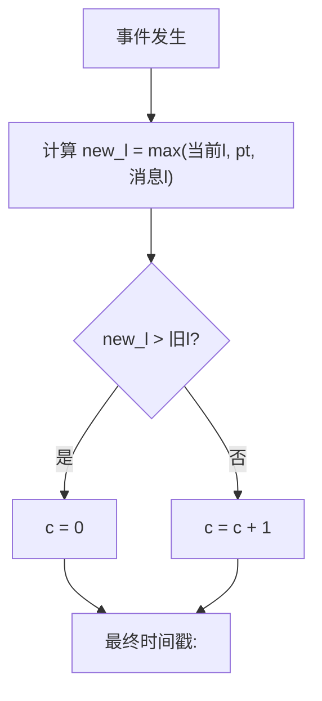
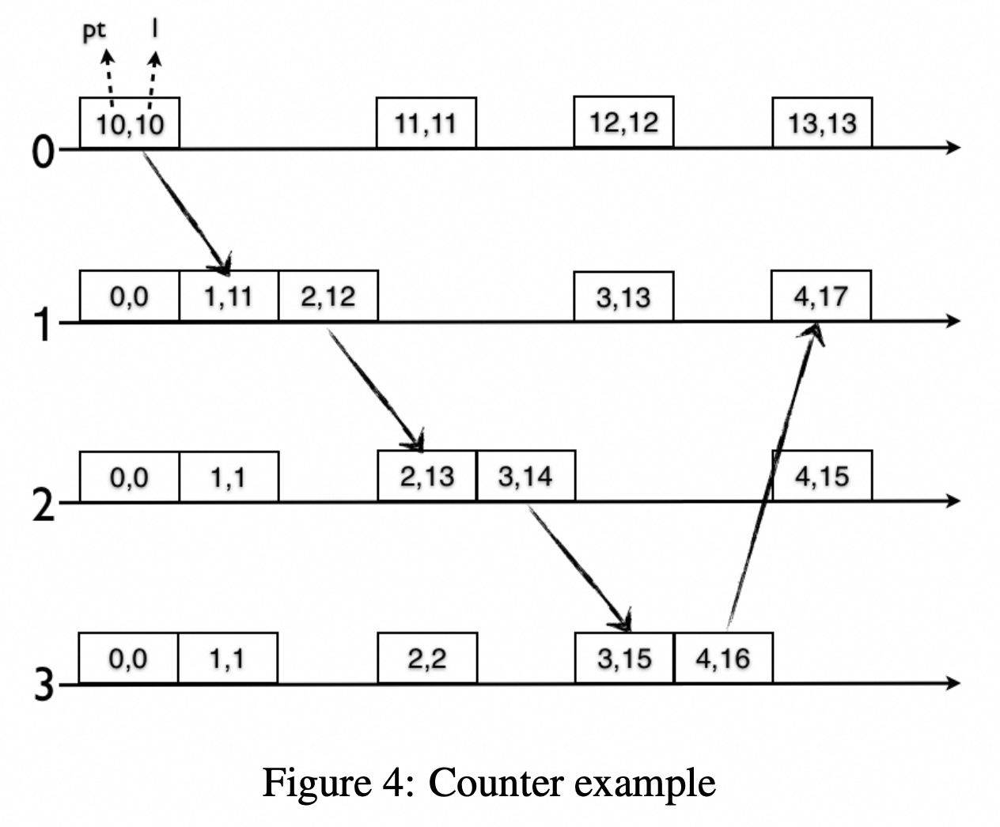
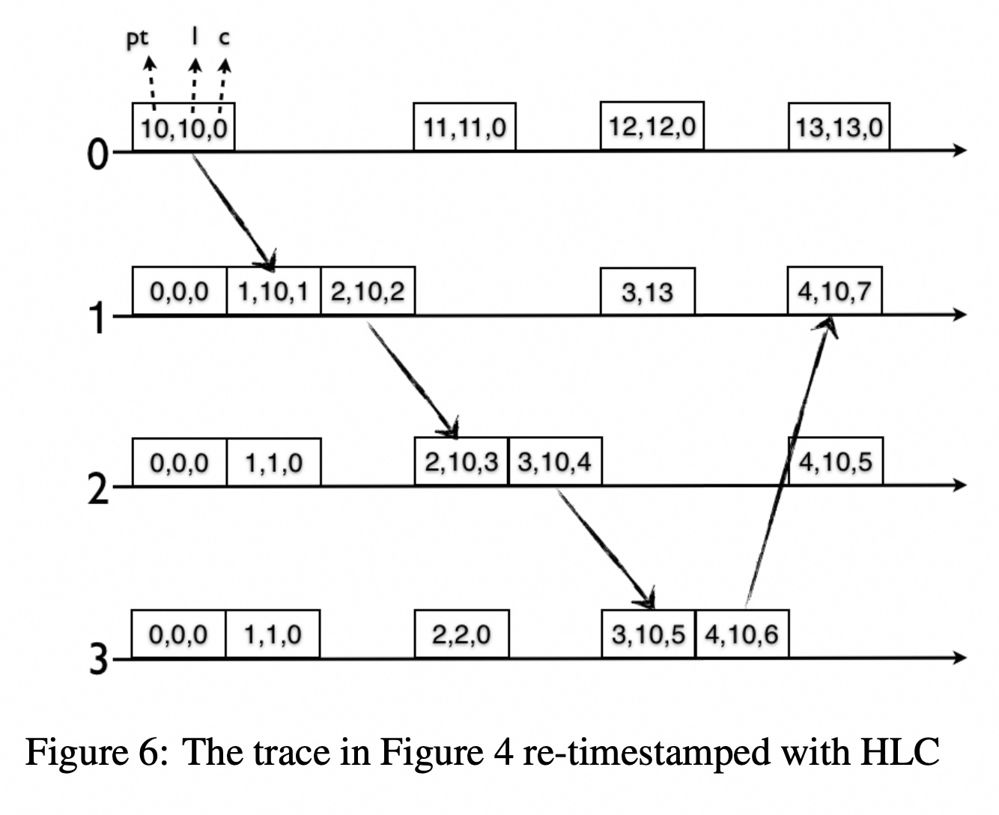
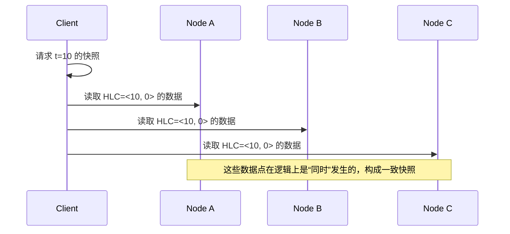

## AI论文解读 | Logical Physical Clocks and Consistent Snapshots in Globally Distributed Databases
        
### 作者        
digoal        
        
### 日期        
2025-09-17       
        
### 标签        
PostgreSQL , PolarDB , DuckDB , AI , 论文解读        
        
----        
        
## 背景  
      
https://cse.buffalo.edu/tech-reports/2014-04.pdf        
  
提示:          
```          
读懂《Logical Physical Clocks and Consistent Snapshots in Globally Distributed Databases》这篇论文需要提前掌握哪些基础知识, 请使用中文通熟易懂的讲解这些基础知识, 可以引用论文中的图、表或使用Markdown支持的图形(text,mermaid等)增加解释性. 
  
使用中文通熟易懂的解读《Logical Physical Clocks and Consistent Snapshots in Globally Distributed Databases》这篇论文, 其中的关键内容请着重讲解, 可以引用论文中的图、表或使用Markdown支持的图形(text,mermaid等)增加解释性. 
  
提取《Logical Physical Clocks and Consistent Snapshots in Globally Distributed Databases》这篇论文中的重要术语, 使用中文对这些术语进行通熟易懂的讲解, 可以引用论文中的图、表或使用Markdown支持的图形(text,mermaid等)增加解释性. 
```     
  
## 1 前置知识 
  
要读懂《Logical Physical Clocks and Consistent Snapshots in Globally Distributed Databases》这篇论文，您需要先掌握几个核心概念。这篇论文的中心思想是弥合分布式系统理论（逻辑时间）和实践（物理时间）之间的鸿沟，并提出了混合逻辑时钟（HLC）来解决问题 。

以下是阅读论文前需要了解的基础知识，我会使用中文和通俗易懂的方式为您讲解：

---

### 1. 分布式系统与事件 (Distributed Systems and Events)

首先，您需要理解什么是分布式系统。简单来说，它是由多台计算机（节点）组成的集合，这些节点可以执行三种基本操作：发送消息、接收消息和本地操作 。论文里提到的所有问题，都是在这个多节点、互相通信的环境下产生的。

### 2. 因果关系与“先发于”关系 (Causality and the "Happened-before" Relationship)

在分布式系统中，事件的顺序非常重要。由于没有一个全局统一的时钟，我们不能简单地通过时间来判断哪个事件先发生。因此，Lamport 提出了“先发于”（happened-before，简称 `hb`）这个概念来描述事件之间的因果关系 。

`e hb f` 表示事件 `e` 在事件 `f` 之前发生，并且 `e` 可能是 `f` 的原因。这种关系遵循以下规则 ：
* **同节点内**: 同一节点上的事件，按照发生的先后顺序具有 `hb` 关系。
* **跨节点间**: 一个消息的发送事件 `e`，在对应消息的接收事件 `f` 之前发生 (`e hb f`)。
* **传递性**: 如果 `e hb f` 且 `f hb g`，那么 `e hb g`。

如果两个事件不具备 `hb` 关系，那么它们是并发的（concurrent）。

### 3. 逻辑时钟 (Logical Clocks, LC)

逻辑时钟（LC）是 Lamport 在1978年提出的，用于为分布式系统中的事件打上时间戳并进行排序 。它与物理时间无关，只通过事件间的 `hb` 关系来更新时间戳。

**LC 的优点：**
* **捕获因果关系**: 如果 `e hb f`，那么 `e` 的逻辑时间戳一定小于 `f` 的时间戳 。

**LC 的局限性：**
* **与物理时间脱节**: 无法与物理时间（例如，NTP 时钟）进行关联 。
* **无法处理所有情况**: 无法查询与物理时间相关的事件，并且在当今集成的、松散耦合的系统中，它的因果捕获假设已过时 。

论文中也提到了逻辑时钟的扩展 **向量时钟（VC）**，它可以捕获所有可能的一致性快照，但其存储开销与系统中的节点数量成正比，因此难以大规模应用 。

### 4. 物理时钟 (Physical Clocks, PT)

物理时钟（PT）利用像网络时间协议（NTP）这样的服务来同步节点上的真实时钟 。

**PT 的优点：**
* **与现实时间关联**: 时间戳与实际物理时间相符 。

**PT 的局限性：**
* **无法实现完美同步**: 由于网络延迟等因素，物理时钟无法做到完美同步，总是存在不确定性区间（uncertainty intervals）。
* **无法保证因果关系**: 物理时钟无法严格保证 `e hb f` 就意味着 `pt.e < pt.f` 。这可能导致时间戳倒退等问题 。

### 5. 一致性快照 (Consistent Snapshots)

在分布式系统中，一致性快照是指对所有节点在某个逻辑时刻的状态的记录。由于物理时钟的不确定性，简单地在某个物理时间 `t` 去记录所有节点的状态，很可能得到一个不一致的快照 。

例如，一个节点的状态包含了另一个节点发送的消息，但后者却没有记录发送该消息。这就是一个不一致的快照。一致性快照要求如果快照中包含了某个接收事件，那么它也必须包含对应的发送事件。

### 6. 混合逻辑时钟 (Hybrid Logical Clocks, HLC)

论文提出的 HLC 旨在融合逻辑时钟和物理时钟的优点 。它由两部分组成：`l`（物理时钟时间）和 `c`（逻辑计数器）。

* **`l` 值**：代表了节点目前知道的**最大物理时间**。
* **`c` 值**：当 `l` 值相同时，用于区分事件的**逻辑计数器**。

通过这种设计，HLC 既能像逻辑时钟一样捕捉因果关系，又能够保持其值与物理时钟（如 NTP）接近，从而在实践中更具可用性 。论文中还通过详尽的算法和证明，展示了 HLC 如何解决简单混合算法中可能出现的时钟值无界增长问题 。

---
如果您对这些基础知识有了初步了解，并且想进一步深入，我可以为您更详细地讲解论文中是如何实现和证明混合逻辑时钟（HLC）算法的。您对这部分感兴趣吗？
  
## 2 解读论文 
  
好的，这篇论文《Logical Physical Clocks and Consistent Snapshots in Globally Distributed Databases》提出了一种名为 **混合逻辑时钟 (Hybrid Logical Clock, HLC)** 的新方案，旨在解决分布式系统中“时间”这个老大难问题。下面我用通俗易懂的方式为你解读。

想象一下，你和你的朋友分散在世界各地，想一起玩一个在线游戏或者共同编辑一个文档。为了让所有人的操作都能正确排序，不出现混乱（比如A说“我先改的”，B说“明明是我先改的”），你们需要一个统一的“时间戳”系统。这就是分布式系统时钟要解决的核心问题。

现有的方案都有各自的痛点：

1.  **物理时钟 (PT/NTP)**：就像大家看自己的手表。问题是，手表不准啊！网络延迟、服务器误差会导致大家的时间有偏差（论文里叫“不确定性区间”）。如果A的手表比B快了100毫秒，那么A在“真实”时间9:00:00.050做的操作，可能会被记录为9:00:00.150，而B在9:00:00.100做的操作被记录为9:00:00.100。这样，系统会错误地认为B的操作发生在A之前，但实际上A才是先做的。这会导致数据不一致。

2.  **逻辑时钟 (LC/VC)**：完全不管真实时间，只管“因果关系”。比如，A给B发了一条消息，那么A发消息这个动作一定“发生于”B收消息之前。逻辑时钟能完美捕捉这种因果关系，但它有个致命缺点：它的时间戳是纯数字，跟“现在几点了”完全没关系。你无法问“昨天下午3点的数据是什么样子的”。

3.  **TrueTime (TT)**：Google Spanner数据库用的方案，通过GPS和原子钟把物理时钟的误差控制得极小。但它成本极高，普通公司用不起。而且，为了保证绝对正确，它有时会让操作“等一等”，等时钟不确定性过去，这会降低系统性能。

**HLC的目标就是鱼和熊掌兼得：既要像逻辑时钟一样能捕捉因果关系，又要像物理时钟一样能跟真实时间挂钩，并且不需要昂贵的硬件。**

---

### HLC 是如何工作的？

HLC 的核心思想非常巧妙，它不是一个单一的数字，而是由两部分组成：`l` 和 `c`。

*   **`l` (logical-physical time)**：这部分主要追踪物理时间（NTP时间），但它只取物理时间的“主要部分”（比如论文建议取48位，足够精确到微秒）。
*   **`c` (causal counter)**：这部分是一个计数器，用来记录在同一个`l`值下，发生了多少个新的事件（比如本地操作、发送或接收消息）。

你可以把HLC想象成一个汽车的里程表：
*   `l` 就是公里数，它随着真实距离（物理时间）增加而缓慢增加。
*   `c` 就是米数，当公里数没变的时候，米数会不断累加。

#### HLC 的算法（简化版）

每当一个节点上发生一个事件（本地操作、发送消息、接收消息），它就按以下规则更新自己的HLC：

1.  **计算新的 `l` 值**：
    *   新的 `l` = `max(自己当前的l, 自己当前的物理时间pt, 收到消息中的l)`。
    *   这一步保证了 `l` 总是向“最大”的物理时间看齐。

2.  **计算新的 `c` 值**：
    *   **情况A**：如果新的 `l` **大于** 旧的 `l`，说明物理时间追上来了或者收到了更新的时间，那么把 `c` **重置为0**。
    *   **情况B**：如果新的 `l` **等于** 旧的 `l`，说明物理时间还没追上来，那么把 `c` **加1**。
    *   **（接收消息时更复杂，但核心思想不变）**



#### 为什么这个设计能解决问题？

1.  **保证因果关系 (Causality)**：
    论文的**定理1**证明了：如果事件A“发生于”事件B之前（A hb B），那么A的HLC时间戳 `<l.a, c.a>` 一定小于B的 `<l.b, c.b>`（按字典序比较，先比`l`，`l`相同再比`c`）。
    这是因为，A的任何操作（本地、发送）都会导致其HLC增加（要么`l`变大，要么`c`加1）。当A的消息被B接收时，B会将自己的HLC更新为 `max(自己HLC, A的HLC) + 1`，从而保证B的HLC一定大于A的。

2.  **绑定物理时间 (Bounded Drift)**：
    论文的**定理2**和**推论1**证明了：任何事件的 `l` 值都不会比其发生时的物理时间 `pt` 小，并且 `l - pt` 的差值不会超过时钟同步的最大误差 `ε`。
    这是因为`l`总是取`pt`和收到消息中`l`的最大值，而收到的消息中的`l`也必定是在某个物理时间点生成的，根据时钟同步假设，这个差值是有限的。

3.  **`c` 值不会无限增长**：
    这是HLC最精妙的地方。论文的**定理4**和**推论3**证明了，`c` 的值是有上限的，大约是 `N * (ε + 1)`，其中N是节点数，ε是时钟误差。
    **为什么？** 因为`c`只在`l`不变时才增长。而`l`不变意味着本地物理时间没有追上。但在一个有界的时间窗口 `ε` 内，一个节点上能发生的事件数量是有限的（假设物理时钟每两次事件间至少走1个单位）。更重要的是，一旦有外部消息进来或者本地物理时间追上来，`l`就会更新，`c`就会被重置为0！
    论文中的**图4**和**图6**完美地展示了这一点： 
    *   **图4 (Naive Algorithm)**：一个简单的“总是取max(自己时钟+1, 物理时间)”的算法会导致时钟无限漂移。   
    *   **图6 (HLC Algorithm)**：同样的场景，当节点的物理时间 `pt` 追上并超过 `l=10` 时，`c` 就被重置为了0，从而阻止了无限增长。   

---

### HLC 有什么用？—— 一致的快照读取

这是论文重点介绍的一个杀手级应用。在分布式数据库中，用户经常想问：“请给我昨天下午3点整，整个数据库的完整状态。”

*   **用物理时钟 (PT)**：直接去每个节点读取“下午3点”的数据？不行！因为各节点时钟不同步，你在A节点读到的“3:00:00.000”可能是真实时间的2:59:59.950，而在B节点读到的“3:00:00.000”可能是3:00:00.050。你读到的是一个“混合”了不同时刻数据的不一致快照。
*   **用TrueTime (TT)**：可以做到，但代价是写操作可能要“等一等”，性能受损。

*   **用HLC**：可以做到，而且**不需要等待**！

**方法如下（论文6.1节）**：

1.  用户指定一个物理时间 `t`（比如昨天下午3点）。
2.  系统将 `t` 转换为对应的 `l` 值（比如 `l_t`）。
3.  系统去**每一个**节点，读取其HLC时间戳为 `<l_t, 0>` 的那个数据版本。
    *   *（论文提到，其实读 `<l_t, 任意c>` 也可以，但读 `c=0` 最简单）*

**为什么这能保证一致性？**

因为HLC保证了因果关系。所有时间戳为 `<l_t, 0>` 的事件，彼此之间都没有“发生于”关系（它们是并发的），因此它们构成的全局状态是一个**一致的快照**。这个快照对应的真实物理时间窗口大约是 `[t - ε, t]`。



---

### 其他亮点

*   **向后兼容**：HLC可以被压缩成一个64位的数字（`l`占48位，`c`占16位），和标准的NTP时间戳格式兼容，方便集成到现有系统。
*   **高容错性**：
    *   **自稳定**：如果某个节点的HLC因为故障变得极大，系统可以检测到（因为 `l - pt` 超过了理论最大值 `ε`），然后将其重置为当前物理时间。
    *   **容忍时钟问题**：能很好地处理“慢节点”（straggler，时钟走得慢）和“快节点”（rusher，时钟走得快）。实验表明，慢节点只会影响自己的`c`值，不会拖累整个系统。
*   **实验结果**：论文在AWS上做了大量实验，结果显示，在实际网络环境中，`c` 的值绝大多数时候是0、1、2，非常小，远低于理论上限，证明了HLC的实用性和高效性。

### 总结

HLC是一个优雅而实用的创新。它巧妙地结合了逻辑时钟和物理时钟的优点，用一个简单的“`l` + `c`”结构，解决了分布式系统中时间戳的核心矛盾。它使得在不依赖昂贵硬件、不牺牲系统性能的前提下，实现全局一致的快照读取成为可能，对构建高性能、强一致的全球分布式数据库具有重大意义。
  
## 3 术语 
  
好的，我已经为您提取了《Logical Physical Clocks and Consistent Snapshots in Globally Distributed Databases》这篇论文中的几个重要术语，并用通俗易懂的中文进行讲解。

---

### **1. 分布式系统（Distributed Systems）**

这是论文的大背景。你可以把**分布式系统**想象成一个由多台计算机（或服务器）组成的团队，它们各自工作在不同的地方，但需要通过网络互相通信来共同完成一项任务，比如提供一个网站服务或管理一个巨大的数据库。

### **2. 因果关系与“先发于”关系（Causality and Happened-before）**

在分布式系统中，由于没有一个统一的、全局的“时间”，我们不能简单地说“事件A发生在事件B之前”。因此，我们需要用一种更抽象的方式来定义事件的先后顺序，这就是**因果关系** 和 **“先发于”关系**。

“先发于”关系（用`→`表示）是 Lamport 提出的，用来定义事件间的因果顺序。它遵循以下原则：
* **同节点内**: 同一台计算机上的事件，按照发生的先后顺序具有 `→` 关系。
* **跨节点间**: 一个消息的**发送事件**总是在对应的**接收事件**之前。
* **传递性**: 如果事件A先发于事件B，且事件B先发于事件C，那么事件A也先发于事件C。

如果两个事件不满足上述任何一个关系，那么它们就是**并发的**（concurrent），也就是说，它们之间没有因果关系。

### **3. 逻辑时钟（Logical Clocks, LC）**

**逻辑时钟**是 Lamport 为了捕捉事件间的因果关系而设计的。它是一个简单的计数器，不与现实物理时间挂钩。它的规则很简单：
* 每次本地发生一个事件，时钟就加1。
* 发送消息时，把当前时钟值附带在消息里。
* 接收消息时，接收方会将自己的时钟更新为 `max(当前时钟, 接收到的时钟值) + 1`。

**优点**：如果事件A先发于事件B，那么A的逻辑时间戳一定小于B的。
**局限**：它无法与现实世界的时间同步，这在需要处理物理时间约束（如事务过期）的系统中是个问题。

### **4. 物理时钟（Physical Clocks, PT）**

**物理时钟**就是我们通常所说的时钟，比如通过网络时间协议（NTP）同步的系统时间。

**优点**：与现实时间相符。
**局限**：由于网络延迟和硬件偏差，不同计算机上的物理时钟很难做到完美同步，总会存在一个**不确定性区间（uncertainty intervals）**。这导致了即使事件A物理上早于事件B，其物理时间戳也可能晚于B。

### **5. 混合逻辑时钟（Hybrid Logical Clocks, HLC）**

这是论文的核心创新。**混合逻辑时钟**旨在结合逻辑时钟和物理时钟的优点，同时弥补它们的缺点。

HLC 的时间戳由两部分组成：`HLC = (l, c)`
* `l`：一个物理时间戳，表示节点所知道的**最大物理时间**。
* `c`：一个逻辑计数器，当两个事件的 `l` 值相同时，`c` 值用于区分它们的先后顺序。

**工作原理**：
* **本地事件**：如果当前物理时间大于 `l`，则更新 `l` 为当前物理时间，`c` 归零。否则，只将 `c` 加1。
* **接收消息**：将本地 `l`、接收到的 `l'` 和当前物理时间 `pt` 三者取最大值作为新的 `l`，如果新 `l` 等于旧 `l`，则将本地 `c` 和接收到的 `c'` 取最大值再加1。

这个设计巧妙地保证了：
1.  **因果一致性**：如果事件A先发于事件B，那么A的HLC时间戳一定小于B的。
2.  **物理时间近似**：HLC 的时间戳会紧随物理时钟，不会出现过大的偏差。

### **6. 一致性快照（Consistent Snapshots）**

**一致性快照**是指对分布式系统在某个逻辑时刻状态的全局记录。想象一下，你想拍一个“全家福”，但你的家人分散在不同城市。如果你只是在某个物理时间 `t` 告诉所有人“现在拍照”，由于通信延迟，你收到的照片可能是不一致的——比如一个人已经把东西寄了出去，但另一个人还没收到。

**一致性快照**要求的是：如果快照中记录了一个“接收消息”的状态，那么也必须记录对应的“发送消息”的状态。HLC 的一大优势就是能够轻松地利用其时间戳来获取这样的快照。

---
这些术语是理解这篇论文的基础。如果您对论文中提出的混合逻辑时钟（HLC）的具体算法或其在分布式数据库中的应用（如事务排序和快照读取）感兴趣，我可以进一步为您详细讲解。您想了解更多关于哪一部分的内容？
  
## 参考        
         
https://cse.buffalo.edu/tech-reports/2014-04.pdf    
        
<b> 以上内容基于DeepSeek、Qwen、Gemini及诸多AI生成, 轻微人工调整, 感谢杭州深度求索人工智能、阿里云、Google等公司. </b>        
        
<b> AI 生成的内容请自行辨别正确性, 当然也多了些许踩坑的乐趣, 毕竟冒险是每个男人的天性.  </b>        
    
#### [期望 PostgreSQL|开源PolarDB 增加什么功能?](https://github.com/digoal/blog/issues/76 "269ac3d1c492e938c0191101c7238216")
  
  
#### [PolarDB 开源数据库](https://openpolardb.com/home "57258f76c37864c6e6d23383d05714ea")
  
  
#### [PolarDB 学习图谱](https://www.aliyun.com/database/openpolardb/activity "8642f60e04ed0c814bf9cb9677976bd4")
  
  
#### [PostgreSQL 解决方案集合](../201706/20170601_02.md "40cff096e9ed7122c512b35d8561d9c8")
  
  
#### [德哥 / digoal's Github - 公益是一辈子的事.](https://github.com/digoal/blog/blob/master/README.md "22709685feb7cab07d30f30387f0a9ae")
  
  
#### [About 德哥](https://github.com/digoal/blog/blob/master/me/readme.md "a37735981e7704886ffd590565582dd0")
  
  

  
