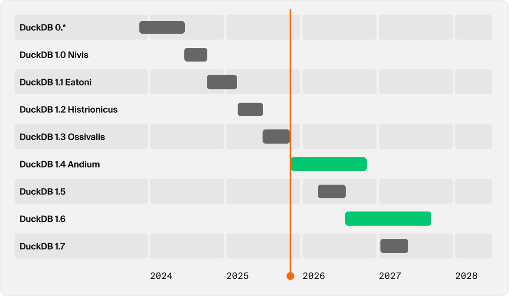

## DuckDB 1.4.0 LTS 版重磅发布, 要拿下Teradata了! 
          
### 作者          
digoal          
          
### 日期          
2025-09-17         
          
### 标签          
PostgreSQL , PolarDB , DuckDB , 新版本 , 加密 , merge , iceberg writes , 进度条剩余时间评估 , fill window function , teradata connector , materialized CTE , k-way merge sort , memory checkpoint           
          
----          
          
## 背景 

DuckDB 1.4.0 正式发布, 根据社区的介绍, 从这个版本开始, 每个偶数版将是长周期支持版(支持1年). 另外这个版本也带来了诸多重磅特性, 例如
- 数据库(包括数据文件和WAL文件甚至临时文件在内)的文件加密特性
- merge语法支持
- iceberg表的写入支持
- 进度条支持剩余时间评估
- FILL 窗口函数, 支持填充缺失值
- Teradata 连接器
- 排序性能增强
- 物化CTE, 提升性能
- 内存表模式支持压缩和检查点vacuum

下面来看看原文详细介绍
- https://duckdb.org/2025/09/16/announcing-duckdb-140.html

# 原文
简而言之：我们即将发布 DuckDB 1.4.0 版本，代号为“Andium”。这是一个 LTS 版本，提供为期一年的社区支持，并包含多项新功能，包括数据库加密、MERGE 语句和 Iceberg 写入。

我们很荣幸地发布 DuckDB v1.4.0，其名称“Andium”取自安第斯水鸭（Anas andium），这种水鸭生活在哥伦比亚、委内瑞拉和厄瓜多尔的安第斯高原。

在本篇博文中，我们将介绍此版本在支持、功能和扩展方面最重要的更新。DuckDB 的更新速度很快，我们只能介绍此版本中一小部分的变更。完整的发行说明，请参阅[GitHub 上的发行页面](https://github.com/duckdb/duckdb/releases/tag/v1.4.0) 。

> 要安装新版本，请访问安装页面。请注意，由于需要进行额外的更改和审核，某些客户端库（例如 Go、R、Java）可能还需要几天时间才能发布。

## 长期支持 (LTS) 版
我们很高兴看到 DuckDB 在生产环境中得到广泛应用，并且意识到此类部署通常需要长期维护。过去，每当新版本发布时，我们都会自动弃用旧版本的 DuckDB。但现在，我们将改变这一现状。

从此版本开始，将发布长期支持 (LTS) 版本。对于 LTS DuckDB 版本，社区支持将在发布后持续一年（目前）。 [DuckDB Labs](https://duckdblabs.com/)也将在旧 LTS 版本的社区支持到期后为其提供支持。

duckdblabs 的社区支持说明: https://duckdblabs.com/community_support_policy/

  

DuckDB 版本的终止 (EOL) 日期:

Version	| Codename	| End of community support
---|---|---
0.\*		| - | 2024-06-03
1.0.\*	|Nivis	|2024-09-09
1.1.\*	|Eatoni	|2025-02-05
1.2.\*	|Histrionicus	|2025-05-21
1.3.\*	|Ossivalis	|2025-09-16
1.4.\* |LTS	Andium	|2026-09-16


## 新功能
### 数据库加密
加密 DuckDB 数据库文件一直以来都是一个备受github用户反馈期待的功能请求。从此版本开始，DuckDB 支持对其文件进行加密。加密密钥通过`ATTACH`时的`ENCRYPTION_KEY`参数指定，如下所示：
```
ATTACH 'encrypted.db' AS enc_db (ENCRYPTION_KEY 'quack_quack');
```

DuckDB 使用行业标准的[AES 加密](https://en.wikipedia.org/wiki/Advanced_Encryption_Standard)，密钥长度为 256 位，默认使用推荐的[GCM](https://en.wikipedia.org/wiki/Galois/Counter_Mode)模式。

加密涵盖主数据库文件、预写日志 (WAL) 文件，甚至临时文件。DuckDB 可以使用内置`mbedtls`库或扩展插件`httpfs`中的 `OpenSSL` 库来加密数据。请注意，由于硬件加速，OpenSSL 版本的速度更快，因此请确保`LOAD httpfs`获得良好的加密性能。

DuckDB 中的加密支持由[Lotte Felius (@ccfelius)](https://github.com/ccfelius)实现。

### MERGE 语法
DuckDB 现在支持[MERGE INTO](https://duckdb.org/docs/stable/sql/statements/merge_into.html)作为[INSERT INTO ... ON CONFLICT](https://duckdb.org/docs/stable/sql/statements/insert.html#on-conflict-clause)的替代方案。 `MERGE INTO`不依赖主键，因为它适用于任何自定义合并条件。这在不支持主键但仍希望支持更新插入（即`UPDATE` plus `INSERT`）功能的 OLAP 系统中非常常见。

在这个例子中，我们使用一个简单的条件匹配键，并调用`RETURNING`语句来获取更新和插入的行的摘要。
```
CREATE TABLE Stock(item_id INTEGER, balance INTEGER);
INSERT INTO Stock VALUES (10, 2200), (20, 1900);

WITH new_stocks(item_id, volume) AS (VALUES (20, 2200), (30, 1900))
    MERGE INTO Stock
        USING new_stocks USING (item_id)
    WHEN MATCHED
        THEN UPDATE SET balance = balance + volume
    WHEN NOT MATCHED
        THEN INSERT VALUES (new_stocks.item_id, new_stocks.volume)
    RETURNING merge_action, *;
```

```
┌──────────────┬─────────┬─────────┐
│ merge_action │ item_id │ balance │
│   varchar    │  int32  │  int32  │
├──────────────┼─────────┼─────────┤
│ UPDATE       │      20 │    4100 │
│ INSERT       │      30 │    1900 │
└──────────────┴─────────┴─────────┘
```

`MERGE INTO`还支持更复杂的条件和 `DELETE` 语句。
```
WITH deletes(item_id, delete_threshold) AS (VALUES (10, 3000))
    MERGE INTO Stock
        USING deletes USING (item_id)
    WHEN MATCHED AND balance < delete_threshold
        THEN DELETE
    RETURNING merge_action, *;
```

```
┌──────────────┬─────────┬─────────┐
│ merge_action │ item_id │ balance │
│   varchar    │  int32  │  int32  │
├──────────────┼─────────┼─────────┤
│ DELETE       │   10    │  2200   │
└──────────────┴─────────┴─────────┘
```

### iceberg writes
[duckdb-iceberg 扩展插件](https://duckdb.org/docs/stable/core_extensions/iceberg/overview.html)现在支持写入 Iceberg。

```
-- Having setup an Iceberg REST catalog using
-- https://github.com/duckdb/duckdb-iceberg/blob/main/scripts/start-rest-catalog.sh
INSTALL iceberg;
LOAD iceberg;
ATTACH '' AS iceberg_datalake (
    TYPE iceberg,
    CLIENT_ID 'admin',
    CLIENT_SECRET 'password',
    ENDPOINT 'http://127.0.0.1:8181'
);
CREATE SECRET (
    TYPE S3,
    KEY_ID 'admin',
    SECRET 'password',
    ENDPOINT '127.0.0.1:9000',
    URL_STYLE 'path',
    USE_SSL false
);
USE iceberg_datalake.default;
ATTACH 'duckdb.db' AS duckdb_db;
CREATE TABLE duckdb_db.t AS SELECT range a FROM range(4);
CREATE TABLE t AS SELECT * FROM duckdb_db.t;
FROM iceberg_datalake.default.t;
```

这意味着现在可以将数据从 DuckDB 或 DuckLake 复制到 Iceberg。

还支持通过以下COPY语句从 Iceberg 复制到 DuckDB/DuckLake：
```
COPY FROM DATABASE iceberg_datalake TO duckdb_db;
```

从 DuckLake/DuckDB 复制到 Iceberg需要在 Iceberg 端手动创建schema ：
```
CREATE SCHEMA iceberg_datalake.main;
COPY FROM DATABASE duckdb_db TO iceberg_datalake;
```
  
最后提一下, 如果你想结合企业内部oltp数据库、流计算等组建实时湖仓, 可考虑如下架构 :  
- [《Mooncake-Labs 架构进化, 核心是 moonlink》](../202509/20250915_01.md)  
- [《DuckDB 读 iceberg 实时数据湖表 by duckdb_mooncake + moonlink》](../202509/20250915_07.md)  
  
### CLI 进度条 剩余时间评估
社区成员[Rusty Conover (@rustyconover)](https://github.com/rustyconover)为 DuckDB 命令行客户端 贡献了ETA（预计到达时间）功能。由于进度测量值会受到噪声的影响而出现很大差异，因此估算剩余时间是一个[难题](https://xkcd.com/612/)。为了解决这个问题，ETA 功能首先会收集一些初始性能数据，然后使用[卡尔曼滤波器](https://en.wikipedia.org/wiki/Kalman_filter)不断优化其估算值。以下视频是其实际工作时的效果：

  

### FILL 窗口函数
[Richard (@hawkfish)](https://github.com/hawkfish)构建了一个新的窗口函数: FILL，可用于在有序窗口中插入缺失值。以下是示例，您可以看到 1 到 42 之间的缺失值在结果中被插值成 21。
```
FROM (VALUES (1, 1), (2, NULL), (3, 42)) t(c1, c2)
SELECT fill(c2) OVER (ORDER BY c1) f;
```

结果如下：
```
f
1
21
42
```

### Teradata 连接器
DuckDB 现已支持 [Teradata 连接器](https://github.com/duckdb/duckdb-teradata) 。后续将另行发布博客文章。

这是要向 Teradata 用户招手了吗?

## 性能和优化
### sort 重写, 性能持续进步
[Laurens (@lnkuiper)](https://github.com/lnkuiper) 重写了 [DuckDB 的排序实现](https://github.com/duckdb/duckdb/pull/17584#thread-scaling-performance)（ [再次重写](https://github.com/duckdb/duckdb/pull/1561) ）。新的实现使用 `k 路合并排序` 来减少数据移动。它还能够自适应预排序数据，并使用新的 API，使得新的排序代码可以在 DuckDB 的其他部分使用，例如在窗口函数中。我们发现此实现的线程扩展性能显著提升。我们将发布一篇单独的博客文章，提供更详细的性能测量结果。

### 物化CTE
通用表表达式 (CTE) 现在默认采用物化（替代inline模式）。这既提升了性能，也解决了一些因inline模式导致的正确性错误。此功能由[Denis Hirn (kryonix)](https://github.com/kryonix) [实现](https://github.com/duckdb/duckdb/pull/17459)，他早在 2020 年就贡献了对[递归 CTE 的支持](https://github.com/duckdb/duckdb/pull/404)。

### 内存表支持checkpoint
内存表现在支持[检查点(checkpoint)](https://github.com/duckdb/duckdb/pull/18348) 。这有两个主要好处：

内存表现在支持压缩。此功能默认处于禁用状态，您可以使用以下方法启用它：
```
ATTACH ':memory:' AS memory_compressed (COMPRESS);
```

检查点触发清理已删除的行，从而允许在delete/truncate后回收空间。


## 最后的想法
以上只是一些亮点，但此版本中还有更多功能和改进。自我们发布 v1.3.2 以来，已有超过 90 位贡献者提交了超过 3,500 次提交。[完整的发行说明可在 GitHub 上找到](https://github.com/duckdb/duckdb/releases/tag/v1.4.0) 。我们要感谢社区提供的详细问题报告和反馈。我们还要特别感谢外部贡献者，他们直接促成了此版本的功能！
    
#### [期望 PostgreSQL|开源PolarDB 增加什么功能?](https://github.com/digoal/blog/issues/76 "269ac3d1c492e938c0191101c7238216")
  
  
#### [PolarDB 开源数据库](https://openpolardb.com/home "57258f76c37864c6e6d23383d05714ea")
  
  
#### [PolarDB 学习图谱](https://www.aliyun.com/database/openpolardb/activity "8642f60e04ed0c814bf9cb9677976bd4")
  
  
#### [PostgreSQL 解决方案集合](../201706/20170601_02.md "40cff096e9ed7122c512b35d8561d9c8")
  
  
#### [德哥 / digoal's Github - 公益是一辈子的事.](https://github.com/digoal/blog/blob/master/README.md "22709685feb7cab07d30f30387f0a9ae")
  
  
#### [About 德哥](https://github.com/digoal/blog/blob/master/me/readme.md "a37735981e7704886ffd590565582dd0")
  
  

  
