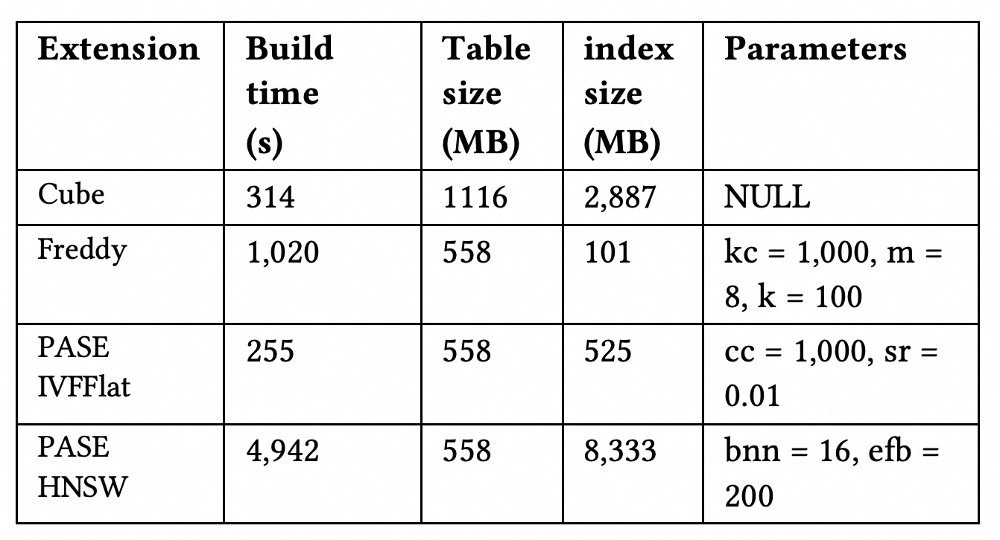

## AI论文解读 | PASE: PostgreSQL Ultra-High-Dimensional Approximate Nearest Neighbor Search Extension
        
### 作者        
digoal        
        
### 日期        
2025-09-18       
        
### 标签        
PostgreSQL , PolarDB , DuckDB , AI , 论文解读        
        
----        
        
## 背景  
      
https://dl.acm.org/doi/pdf/10.1145/3318464.3386131        
  
提示:          
```          
读懂《PASE: PostgreSQL Ultra-High-Dimensional Approximate Nearest Neighbor Search Extension》这篇论文需要提前掌握哪些基础知识, 请使用中文通熟易懂的讲解这些基础知识, 可以引用论文中的图、表或使用Markdown支持的图形(text,mermaid等)增加解释性. 
  
使用中文通熟易懂的解读《PASE: PostgreSQL Ultra-High-Dimensional Approximate Nearest Neighbor Search Extension》这篇论文, 其中的关键内容请着重讲解, 可以引用论文中的图、表或使用Markdown支持的图形(text,mermaid等)增加解释性. 
  
提取《PASE: PostgreSQL Ultra-High-Dimensional Approximate Nearest Neighbor Search Extension》这篇论文中的重要术语, 使用中文对这些术语进行通熟易懂的讲解, 可以引用论文中的图、表或使用Markdown支持的图形(text,mermaid等)增加解释性. 
```     
  
## 1 前置知识 
  
在读懂《PASE: PostgreSQL 超高维近似最近邻搜索扩展》这篇论文之前，您需要掌握以下几个方面的基础知识，才能更好地理解其核心思想和实现原理。

### 1\. 什么是相似性搜索（Similarity Search）和向量嵌入（Vector Embedding）？

相似性搜索，也叫“最近邻搜索”（Nearest Neighbor Search, NNS），是在一个数据集中寻找与给定查询数据最相似的项。传统的搜索通常基于精确匹配，而相似性搜索则侧重于“相似度”而非“完全相同”。在论文中，这个概念被广泛应用于图像搜索、人脸识别和个性化推荐等场景 。

而 **向量嵌入（Vector Embedding）** 则是实现相似性搜索的关键技术。它利用深度学习等技术将非结构化数据（如图像、文本、语音）转换成高维的数值向量 。例如，一张图像可以被转换成一个包含数百个甚至数千个浮点数的向量，这个向量就代表了图像的“特征指纹” 。相似的图像会得到相似的向量，因此通过比较向量之间的距离（例如欧氏距离、余弦距离等）就可以衡量它们之间的相似度 。

### 2\. 什么是“维数灾难”和为什么需要近似最近邻搜索（ANN）？

在低维空间中，寻找最近邻非常简单，可以直接计算每个点到查询点的距离并排序。但当维度（也就是向量的长度）变得很高时，比如数百或数千维，数据的分布会变得非常稀疏，任何两个点之间的距离都趋于相等。这种现象被称为 **“维数灾难”（Curse of Dimensionality）** 。在这样的高维空间中，精确的最近邻搜索效率会非常低，几乎等同于遍历整个数据集，这在数据量庞大时是无法接受的 。

因此， **近似最近邻搜索（Approximate Nearest Neighbor Search, ANN）** 应运而生。ANN牺牲了一部分搜索精度，来换取巨大的性能提升 。它的目标不是找到“最”近的那个，而是找到“足够近”的一组点。PASE 论文的核心就是基于 PostgreSQL (PG) 实现一个高效的 ANN 扩展 。

### 3\. PostgreSQL（PG）数据库及其索引机制

这篇论文是关于如何在 PostgreSQL 数据库中实现 ANN 索引的。因此，您需要了解 PostgreSQL 数据库的基本概念，尤其是它的 **索引（Index）** 机制 。

  * **索引（Index）**: 索引是一种数据结构，可以帮助数据库快速定位和访问数据，而无需扫描整个数据表 。
  * **页面（Page）**: PG 将数据存储在固定大小的“页面”中，默认大小为 8 KB 。页面是磁盘I/O的基本单位。
  * **可扩展性（Extensibility）**: PG 以其强大的可扩展性而闻名。论文特别提到 PG 的 **IndexAmRoutine** 接口 ，它允许开发人员自定义新的索引类型、数据类型和函数，这正是 PASE 能够实现的基础 。

PASE 论文的核心贡献之一，就是将 ANN 算法深入到 PG 数据库的内核索引层，而不是简单地通过 SQL 函数来扩展 。

### 4\. 常见的近似最近邻（ANN）算法

PASE 论文重点讨论并实现了两种主要的 ANN 算法：IVFFlat 和 HNSW。这两种算法分别代表了不同的技术路线，了解它们的工作原理至关重要。

#### IVFFlat（基于量化/聚类）

IVFFlat 算法属于 **基于量化（Quantization-based）** 的算法 。其基本思想是先对高维向量进行聚类，将整个数据集分成若干个“簇”（Cluster），每个簇有一个中心点（Centroid）。

  * **搜索过程**:
    1.  找到离查询向量最近的 `N` 个簇中心 。
    2.  只在这些选定的 `N` 个簇内进行精确搜索（遍历所有成员），以找到最接近查询向量的 `K` 个向量 。
  * **优点**: 实现简单，查询精度高，而且索引构建和存储成本较低 。
  * **缺点**: 当数据集非常大时，搜索效率会受到影响 。

以下是 IVFFlat 算法的原理图（来自论文图4）：   

-----

#### HNSW（基于图）

HNSW（Hierarchical Navigable Small World）是一种 **基于图（Graph-based）** 的算法 。它通过构建一个多层级的图结构来加速搜索。每一层图都是下一层图的“简化版”，就像高速公路一样 。

  * **搜索过程**:
    1.  从最顶层（稀疏层）的入口点开始搜索，在这一层快速移动，找到一个大致的搜索区域 。
    2.  然后下到下一层（密度更高），继续在小范围内精细搜索 。
    3.  重复此过程，直到搜索到最底层，从而快速定位到最近的邻居 。
  * **优点**: 即使在大型数据集上也能提供非常高的搜索速度和良好的性能 。
  * **缺点**: 索引构建时间相对较长，并且需要更多的内存来存储图的边信息 。

以下是 HNSW 算法的原理图（来自论文图6）：   

-----

### 5\. 高维向量存储和查询优化

除了上述算法，论文还讨论了在 PG 中如何优化高维向量的存储和查询。这包括：

  * **跨页面存储（Cross-Page Storage）**: 当一个高维向量的大小超过 PG 单个页面的存储限制（8 KB）时，PASE 能够将一个向量分割并存储在多个连续的页面上 。
  * **连续存储（Contiguous Storage）**: 为了减少磁盘随机 I/O，PASE 优化了数据页面的存储方式，使它们在物理上连续存放，从而加快访问速度 。

### 总结

总的来说，要读懂这篇论文，您需要对**高维向量**、**近似最近邻搜索**、**PG 数据库的索引机制**以及 **IVFFlat 和 HNSW** 这两种具体的 ANN 算法有扎实的理解。论文将这些看似独立的领域结合在一起，解决了在 PG 这种传统关系型数据库中高效处理向量相似性搜索的挑战。

如果您希望了解更多关于这篇论文的内容，我可以为您深入解释论文中提到的其他概念，比如 PASE 的**索引存储架构**、**查询示例**、或其与现有解决方案的**性能对比**。

在《PASE》这篇论文中，索引存储架构是其核心技术之一，它描述了PASE如何将高维向量数据高效地组织和存储在PostgreSQL数据库中。论文主要围绕以下几个关键部分来阐述其存储架构。

### 1. 向量作为索引条目（Vector as Index Entry）

* **通俗解释**: 在传统的PostgreSQL索引中，通常存储的是指向数据行的物理地址（即 TID，Tuple Identifier）。而PASE的独特之处在于，它直接将**高维向量**作为索引本身的一个重要组成部分。这意味着索引节点不再仅仅是数据指针，它也包含了向量数据。
* **技术细节**: 论文中提到，为了将高维向量存储在PostgreSQL的索引中，PASE自定义了一个新的数据类型。当向量维度很高时，一个向量的数据量可能超过PostgreSQL单个页面（通常为8 KB）的存储限制。PASE通过 **跨页面存储（Cross-Page Storage）** 技术解决了这个问题，允许一个向量的数据块分布在多个连续的页面上。这种设计确保了即便是超高维向量也能被高效地存储和访问。

### 2. 索引页面和数据页面（Index Pages and Data Pages）

* **通俗解释**: PASE的存储架构将数据分为两部分：**索引数据**和**原始数据**。索引数据（如IVFFlat的簇中心或HNSW的图节点信息）存储在专门的索引页面中，而原始的高维向量数据则存储在普通的数据页面中。
* **工作方式**: 当进行查询时，PASE首先在**索引页面**中进行快速搜索，利用IVFFlat或HNSW算法找到最有可能的候选向量。一旦找到这些候选向量，PASE会使用它们对应的TID（物理地址）去**数据页面**中获取完整的原始向量数据，进行最后的精确距离计算和排序。这种分离存储的设计，既能保证索引查询的快速性，又能有效地管理和存储庞大的原始向量数据。

### 3. 数据连续性存储（Data Contiguity）

* **通俗解释**: 传统的数据库存储在物理磁盘上可能是不连续的，这意味着读取一个完整的高维向量（特别是跨页面的）需要多次磁盘寻道，这会显著降低性能。
* **PASE的优化**: PASE通过一种**数据连续性存储**的优化手段来解决这个问题。它将一个向量的所有数据块尽可能地存储在磁盘上物理连续的页面中。这种优化减少了磁盘随机I/O，将多个离散的读操作合并为少数几个连续的读操作，从而极大地提高了数据读取效率，特别是在处理大批量的向量数据时。

### 4. Btree 索引与 PASE 索引的结合

* **通俗解释**: PASE 并非完全取代了 PostgreSQL 的现有索引，而是与其进行协同工作。PASE 创建的索引可以看作是原始数据表上的一层“近似搜索”加速器。
* **工作方式**: 在实际应用中，用户可能需要进行复合查询，例如“在某个特定用户ID下的所有向量中，找到与查询向量最相似的10个向量”。PASE 的索引可以与 PostgreSQL 内置的 **Btree 索引**协同工作。首先，Btree 索引可以快速定位到某个特定用户的所有向量数据，然后 PASE 索引再在这些数据中进行高效的近似最近邻搜索。这种结合使得 PASE 能够无缝集成到现有的业务场景中，支持更复杂的查询需求。

---

通过以上解释，您应该对PASE的索引存储架构有了更清晰的理解。如果您想更深入地了解论文的其他方面，比如具体的**查询示例**或者PASE的**性能表现**，我很乐意为您提供更多信息。
  
## 2 解读论文 
  
好的，我们来通俗易懂地解读一下这篇来自蚂蚁金服和阿里巴巴的工业界论文：《PASE: PostgreSQL Ultra-High-Dimensional Approximate Nearest Neighbor Search Extension》。

简单来说，这篇论文解决的核心问题是：**如何将高效的“向量搜索”能力，以一种原生、强大且实用的方式，深度集成到我们常用的关系型数据库 PostgreSQL (简称 PG) 中**。

-----

### 一、 问题的起源：为什么要把向量搜索“塞”进数据库？

近年来，随着深度学习的发展，文字、图片、视频、用户行为等各种信息都可以被转换成高维度的“向量”（可以理解为一长串数字）。向量之间的距离远近，就代表了原始信息之间的相似程度。比如，两张相似人脸的向量会非常接近。因此，“找最相似的N个向量”这个需求（即“近似最近邻搜索”，ANN）在人脸识别、以图搜图、个性化推荐等场景中变得至关重要 。

虽然市面上已经有 Facebook 的 FAISS  和 Microsoft 的 SPTAG  这样优秀的开源向量搜索库，但它们在工业应用中存在几个痛点：

1.  **只是个“计算库”，而非“数据库”**：它们通常作为独立的库存在，难以处理带有业务逻辑的 **复合查询** 。例如，你无法直接用 FAISS 实现“在**北京地区**，给我找和这张图片最像的**10件商品**”这样的需求。你只能先搜出1000张相似图片，再自己写代码去过滤地区，效率低下且结果数量不可控 。
2.  **数据冗余与同步成本高**：业务数据（如商品信息、图片元数据）通常存储在数据库里 。为了进行向量搜索，你需要把海量的向量数据复制一份到专门的向量搜索引擎中，这不仅浪费存储，还带来了数据一致性的难题 。
3.  **缺乏工业级保障**：这些开源库大多是研究工具，缺少分布式、高可用等企业级特性 。

因此，作者们提出了一个绝妙的想法：**别在外面搞了，直接在数据库内核里动手，把向量搜索能力变成 PG 数据库的一种原生索引类型！** 这就是 PASE (PG ANN Search Extension) 的由来 。

### 二、 PASE 的核心思想：不是嫁接，而是原生支持

PG 数据库本身就具有极强的扩展性，允许用户自定义新的数据类型、函数甚至索引类型 。已有的 PG 向量搜索插件，要么是简单的 SQL 函数扩展 (如 Freddy) ，要么是试图改造现有索引 (如 Cube) ，但它们在处理高维向量时性能都不理想 。

PASE 走了一条更彻底的路：它深入 PG 的索引核心层，创建了一种全新的索引类型 `PASE Index`，使其与 PG 内置的 B-Tree、GiST 等索引处于同一层级 。

我们可以用下图来理解 PASE 在 PG 中的位置：


  * **PASE 的优势**：通过这种深度集成，PASE 可以充分利用 PG 的成熟能力，如事务处理、并发控制、数据管理等，同时解决了复合查询和数据冗余的核心痛点 。

### 三、 两大核心算法实现：IVFFlat 与 HNSW

PASE 中实现了两种业界主流且有代表性的 ANN 算法：**IVFFlat（基于量化）** 和 **HNSW（基于图）** 。

#### 1\. IVFFlat：物以类聚的“倒排索引”法

  * **核心思想**：就像给图书分类一样，先把海量的向量数据通过聚类算法（如 K-Means）分成很多个“簇”（Cluster）。搜索时，不用遍历所有向量，而是先找到查询向量离哪几个“簇”最近，然后只在这些簇内部进行精确的暴力搜索 。

  * **PASE 中的实现**：PASE 为 IVFFlat 精心设计了页面存储结构（如下图所示），主要分为三类页面：

      * **元页面 (Meta Page)**：存储索引的整体信息，如各个簇的入口地址 。
      * **中心点页面 (Centroid Page)**：存储每个簇的中心点向量和指向该簇数据页的指针 。
      * **数据页面 (Data Page)**：存储属于同一个簇的所有原始向量，像一个倒排链表 。

      

    *图：PASE 中 IVFFlat 的页面存储结构示意图（改编自论文图5）*

  * **适用场景**：对**召回率（准确率）要求极高**的场景，比如**人脸识别支付** 。因为可以通过调整搜索的“簇”的数量来无限逼近100%的准确率 。

#### 2\. HNSW：高效的“多层高速公路”法

  * **核心思想**：将向量间的关系构建成一张复杂的邻居网络图。为了加速搜索，这张图是分层的，类似一个“多层高速公路系统” 。搜索时，先从最顶层（连接最稀疏、跨度最大）的“高速路”入口进入，快速定位到目标的大致区域，然后逐层向下，进入“省道”、“县道”，最终在最底层的“街道”网络中找到最近的邻居 。
  * **PASE 中的实现**：同样地，PASE 也为 HNSW 设计了专门的存储结构，包含元页面、数据页面和存储图连接关系的**邻居页面 (Neighbor Page)** 。
  * **适用场景**：适用于**超大规模数据集**和对**查询延迟要求极为苛刻**的场景，如**个性化推荐**和**版权图片搜索** 。它的搜索性能极高，但构建索引的时间较长，且占用空间更大 。

### 四、 关键工程挑战与解决方案

PASE 不仅仅是算法的实现，更包含了许多出色的工程设计。

#### 1\. 复合查询的完美解决：迭代式搜索 (Iterative Search)

这是 PASE 最大的亮点之一。为了解决前面提到的“在北京地区找相似商品”这类问题，PASE 利用了 PG 的 `amgettuple` 接口，实现了一套巧妙的迭代式搜索流程 。

**流程简述** (对应论文图13 )：   

1.  PASE 的向量索引先返回一批（比如100个）最相似的结果 。
2.  PG 内核拿到这100个结果，再用其他条件（如 `city = '北京'`）进行过滤 。
3.  如果过滤后剩下的结果数量不够10个，PG 就会告诉 PASE：“不够，再来点！” 。
4.  PASE 接着返回下一批相似的结果（例如第101到200个），PG 继续过滤，直到凑够10个满足所有条件的结果为止 。

这个机制确保了既能高效利用向量索引，又能精确满足所有查询条件，返回足量的结果。

#### 2\. 存储与性能优化

  * **连续页面存储 (Contiguous Storage)**：为了减少磁盘随机 I/O，PASE 在写入和整理索引时，会尽量将属于同一个数据链的页面块连续存放在一起，大幅提升读取效率 。
  * **跨页存储 (Cross Page Storage)**：当单个向量太大（例如维度超过2000），一个8KB的标准页面放不下时，PASE 会自动将这个向量切分，存放在多个连续的页面中 。

### 五、 实验效果：碾压对手

论文在 SIFT1M 和 GIST1M 两个标准数据集上，将 PASE 与其他 PG 插件 (Cube, Freddy) 进行了对比 。

| 方案 | 索引构建时间 (SIFT1M) | 索引大小 (SIFT1M) | 搜索性能 (召回率/延迟) |
| :--- | :--- | :--- | :--- |
| **PASE (HNSW)** | 较慢 (4942s)  | 较大 (8333MB)  | **极高**  |
| **PASE (IVFFlat)** | 很快 (255s)  | 较小 (525MB)  | **很高**  |
| Freddy | 慢 (1020s)  | 最小 (101MB)  | 较低且不稳定  |
| Cube | 较快 (314s)  | 大 (2887MB)  | 在高维下性能很差，不如全表扫描  |

    

*(数据来源：论文 Table 1 及 Figure 15 )*

**结论非常明确**：

  * PASE 在搜索性能（召回率和延迟）上远超 Freddy 和 Cube 。
  * 在 PASE 内部，HNSW 搜索速度更快，但构建索引慢且占空间；IVFFlat 构建速度快，且更容易通过调参达到极高的准确率 。这为不同业务场景提供了灵活的选择。

### 总结

《PASE》是一篇典型的优秀工业界论文。它没有提出全新的算法，而是聚焦于一个真实、复杂的工程问题：如何将前沿的向量搜索技术与成熟的数据库系统进行深度融合。通过创建一种原生的索引类型，PASE 成功地赋予了 PostgreSQL 数据库强大的高维向量检索能力，并以其创新的“迭代式搜索”机制优雅地解决了复合查询的业界难题 。这个工作不仅在阿里和蚂蚁内部的众多业务中取得了显著成效 ，也为其他数据库系统（如 MySQL, Oracle 等）如何集成向量搜索能力提供了一个极具价值的范本和启发 。
  
## 3 术语 
  
好的，根据《PASE: PostgreSQL 超高维近似最近邻搜索扩展》这篇论文的内容，我为您梳理并解释以下几个重要的技术术语，希望能帮助您更好地理解这篇论文的核心思想。

### 1\. 高维向量（Ultra-High-Dimensional Vector）

在传统数据库中，我们通常处理的是文本、数字、日期等类型的数据。但在这篇论文中，核心处理对象是**高维向量**。

  * **通俗解释**: 可以把高维向量想象成一个由很多个数字组成的列表，比如 `[0.12, 0.56, 0.99, ...]`，这个列表中的数字可以有几百甚至几千个。这些数字是 **向量嵌入（Vector Embedding）** 技术产生的，它们用来表示一张图片、一段文字或一个声音的“特征”。两个向量越相似（比如欧氏距离越小），它们所代表的原始数据就越相似。

### 2\. 维数灾难（Curse of Dimensionality）

这是一个在高维空间中特有的问题。

  * **通俗解释**: 想象一下，在一个二维平面上（例如一张纸），很容易找到离一个点最近的另一个点。但当维度增加到几百甚至几千维时，空间会变得极其“空旷”，所有点之间的距离会变得几乎相等。在这种情况下，传统的、精确的搜索方法（即遍历每一个点来寻找最近的）会变得非常低效，几乎等同于随机猜测，这就是**维数灾难**。

### 3\. 近似最近邻搜索（Approximate Nearest Neighbor Search, ANN）

由于维数灾难的存在，精确搜索在高维数据上变得不切实际。

  * **通俗解释**: **ANN** 是一种以牺牲一小部分精度为代价来换取巨大性能提升的搜索方法。它不保证找到“最”近的那个邻居，而是找到一个“足够近”的邻居。这在许多实际应用中是完全可以接受的，例如在图片搜索中，用户更关心的是返回结果中是否有相似的图片，而不是那张“最”相似的。

### 4\. PostgreSQL 索引扩展（PostgreSQL Index Extension）与 IndexAmRoutine

论文的核心贡献之一就是利用 PostgreSQL 的可扩展性。

  * **通俗解释**: PostgreSQL 提供了强大的扩展接口，允许开发者自定义新的数据类型、函数和索引方法。论文利用的就是 **`Index Access Method Routine (IndexAmRoutine)`** 这个接口，它允许开发者像 PASE 这样在数据库内核层实现一个全新的索引类型，从而直接在数据库内部高效地进行向量搜索，而不是在外部应用层进行计算。

### 5\. IVFFlat 算法

这是一种基于 **聚类（Clustering）** 的 ANN 算法。

  * **通俗解释**: 它的工作方式可以简单概括为“先粗后精”：
    1.  **粗略查找**: 首先，将所有向量分成若干个“簇”（就像把地图上的城市分成不同省份一样）。每个簇都有一个中心点。
    2.  **精确查找**: 当有一个新的查询向量时，只在离它最近的几个簇里进行精确搜索，找出最接近的几个向量。
  * **优点**: 这种方法大大缩小了搜索范围，避免了遍历整个数据集，从而提高了效率。

以下是论文中的 IVFFlat 算法工作示意图：

### 6\. HNSW（Hierarchical Navigable Small World）算法

这是一种基于 **图（Graph-based）** 的 ANN 算法，也是论文实现的另一种索引类型。

  * **通俗解释**: HNSW 算法通过构建一个多层的图来组织数据。您可以把它想象成一个交通网络：
      * **顶层**是“高速公路”，连接着少数几个重要节点，可以帮助我们快速到达大致的目的地。
      * **中间层**是“国道”，连接了更多节点，提供更详细的路径。
      * **最底层**是“城市小路”，连接了所有节点，用于最后的精确搜索。
  * **优点**: 这种分层结构让搜索过程能够快速定位到大致区域，然后逐层向下精细化，因此搜索速度非常快，尤其是在大型数据集上表现优异。

以下是论文中的 HNSW 算法工作示意图：

### 7\. TID (Tuple Identifier) 和 Tuple

这两个术语是 PostgreSQL 数据库中特有的，理解它们有助于理解 PASE 如何与数据库内核交互。

  * **Tuple**: 在 PostgreSQL 中，**Tuple** 就是一行数据。
  * **TID**: **Tuple Identifier**，是 PostgreSQL 用来唯一标识每一行数据在磁盘上位置的物理地址。

-----

现在您对论文中的核心术语应该有了基本的了解。如果您想进一步了解 **PASE** 在 **PostgreSQL** 中具体的**索引存储架构**或**查询方式**，我可以为您提供相关的解释或代码示例。
  
## 参考        
         
https://dl.acm.org/doi/pdf/10.1145/3318464.3386131    
        
<b> 以上内容基于DeepSeek、Qwen、Gemini及诸多AI生成, 轻微人工调整, 感谢杭州深度求索人工智能、阿里云、Google等公司. </b>        
        
<b> AI 生成的内容请自行辨别正确性, 当然也多了些许踩坑的乐趣, 毕竟冒险是每个男人的天性.  </b>        
    
#### [期望 PostgreSQL|开源PolarDB 增加什么功能?](https://github.com/digoal/blog/issues/76 "269ac3d1c492e938c0191101c7238216")
  
  
#### [PolarDB 开源数据库](https://openpolardb.com/home "57258f76c37864c6e6d23383d05714ea")
  
  
#### [PolarDB 学习图谱](https://www.aliyun.com/database/openpolardb/activity "8642f60e04ed0c814bf9cb9677976bd4")
  
  
#### [PostgreSQL 解决方案集合](../201706/20170601_02.md "40cff096e9ed7122c512b35d8561d9c8")
  
  
#### [德哥 / digoal's Github - 公益是一辈子的事.](https://github.com/digoal/blog/blob/master/README.md "22709685feb7cab07d30f30387f0a9ae")
  
  
#### [About 德哥](https://github.com/digoal/blog/blob/master/me/readme.md "a37735981e7704886ffd590565582dd0")
  
  

  
