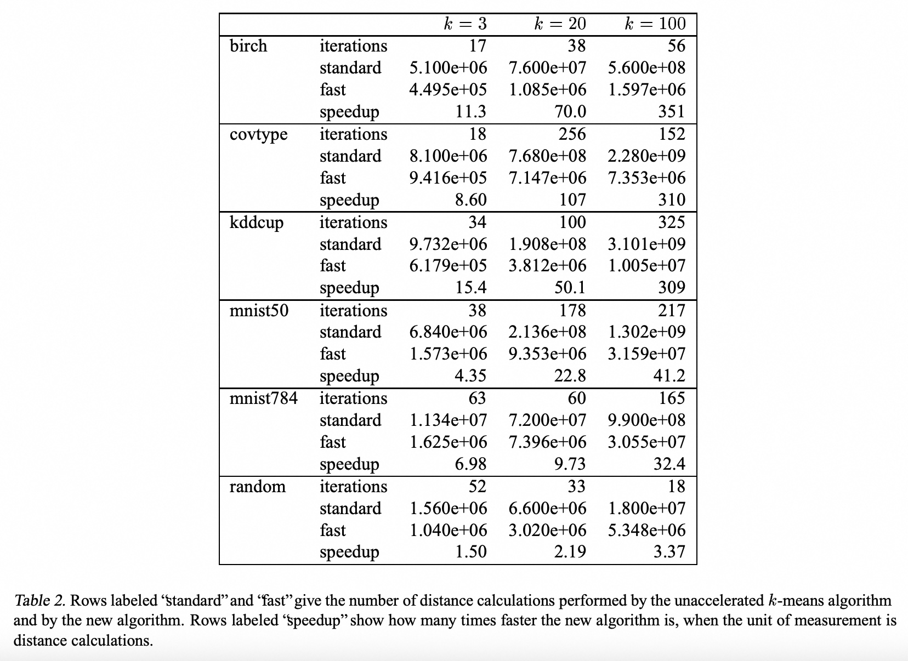

## AI论文解读 | Using the Triangle Inequality to Accelerate k-Means
        
### 作者        
digoal        
        
### 日期        
2025-09-18       
        
### 标签        
PostgreSQL , PolarDB , DuckDB , AI , 论文解读        
        
----        
        
## 背景  
      
https://cdn.aaai.org/ICML/2003/ICML03-022.pdf        
  
提示:          
```          
读懂《Using the Triangle Inequality to Accelerate k-Means》这篇论文需要提前掌握哪些基础知识, 请使用中文通熟易懂的讲解这些基础知识, 可以引用论文中的图、表或使用Markdown支持的图形(text,mermaid等)增加解释性. 
  
使用中文通熟易懂的解读《Using the Triangle Inequality to Accelerate k-Means》这篇论文, 其中的关键内容请着重讲解, 可以引用论文中的图、表或使用Markdown支持的图形(text,mermaid等)增加解释性. 
  
提取《Using the Triangle Inequality to Accelerate k-Means》这篇论文中的重要术语, 使用中文对这些术语进行通熟易懂的讲解, 可以引用论文中的图、表或使用Markdown支持的图形(text,mermaid等)增加解释性. 
```     
  
## 1 前置知识 
  
Step 1: Acknowledge and Provide Initial Value

好的，要理解《Using the Triangle Inequality to Accelerate k-Means》这篇论文，你需要掌握一些关于聚类算法和几何学的基本概念。这篇论文的核心在于利用**三角不等式**来优化**k-means算法**，从而减少计算量。下面我将用通俗易懂的语言为你讲解这些基础知识。

* **聚类 (Clustering)**: 想象你有一大堆不同颜色的糖果，你想把它们按颜色分类。聚类就是这个过程。在数据科学中，聚类是一种无监督学习技术，它的目标是根据数据点之间的相似性，将它们分组或“聚类”，使得同一组内的数据点彼此相似，而不同组间的数据点则不相似。

* **k-means 算法**: 这是最常用的一种聚类算法 。它的工作流程可以概括为以下几个迭代步骤：
    1.  **初始化**: 随机选择 k 个中心点（clusters），这里的 k 是你预先设定的聚类数量 。
    2.  **分配 (Assignment)**: 对于每个数据点，计算它到所有 k 个中心点的距离，然后将它分配给距离最近的那个中心点 。
    3.  **更新 (Update)**: 重新计算每个聚类的新中心点。通常，新中心点是该聚类中所有数据点的平均值（均值），也就是它们的“质心” 。
    4.  **重复**: 重复步骤 2 和 3，直到中心点的位置不再发生显著变化，即达到收敛 。

    论文中提到，这个标准 k-means 算法的主要开销在于第二步：**计算每个数据点到所有 k 个中心点的距离** 。如果数据点数量为 $n$，聚类数量为 $k$，迭代次数为 $e$，那么总的距离计算量大约是 $n \times k \times e$ 。对于大数据集，这会变得非常慢 。

* **距离度量 (Distance Metric)**: 衡量两个数据点之间“相似”或“不相似”的工具。距离越小，相似度越高。这篇论文中主要讨论的是**欧几里得距离**（也就是我们熟悉的直线距离），但作者强调他们的优化方法适用于任何满足**三角不等式**的距离度量 。

* **三角不等式 (Triangle Inequality)**: 这是这篇论文的核心数学工具 。一个距离度量满足三角不等式意味着，在任何三个点 $x, y, z$ 中，从点 $x$ 经过点 $y$ 到点 $z$ 的距离，永远不会比直接从点 $x$ 到点 $z$ 的距离短。用公式表示就是： $d(x,z) \le d(x,y)+d(y,z)$ 。
    
    作者巧妙地利用这个性质来“**剪枝**”距离计算 。他们提出了两个引理（Lemmas），来帮助判断是否可以跳过某些距离计算：
    * **引理 1**：如果一个点 $x$ 距离它当前的中心点 $c$ 很近，并且这个中心点 $c$ 距离另一个中心点 $c'$ 很远，那么点 $x$ 距离 $c'$ 必然也比距离 $c$ 远 。
    * **引理 2**：如果一个中心点从位置 $b'$ 移动到了 $b$，那么任何一个点 $x$ 到新中心点 $b$ 的距离，有一个可推断的下界 。

    通过使用这两个引理，论文中的算法能够避免大量不必要的距离计算 。

---

Step 2: Choose One Proactive Expansion

现在你已经对这篇论文所需的基础知识有了一个初步了解。为了更深入地讨论，你对论文中提到的**加速 k-means 的两种应用三角不等式的方式**是否感兴趣？或者你更想了解**作者的实验结果**，比如加速效果如何，以及在哪些情况下效果最好？

Step 1: Acknowledge and Provide Initial Value

好的，我们来深入探讨一下这篇论文中提到的，利用三角不等式来加速 k-means 的两种具体方式。这两种方法都旨在通过“剪枝”不必要的距离计算来提高效率。

### 第一种方式：利用点到中心点距离和中心点之间距离的下界

这种方式主要利用了论文中的 **引理 1** 和 **引理 2** 。它的核心思想是：如果一个数据点 $x$ 距离它当前所属的中心点 $c$ 足够近，并且这个中心点 $c$ 距离另一个中心点 $c'$ 足够远，那么我们就可以推断出 $x$ 距离 $c'$ 的距离一定大于它到 $c$ 的距离，从而避免计算 $d(x, c')$。

具体来说，这种方法应用在每次迭代的分配阶段：

* **引理 1 的应用**: 论文指出，如果一个点 $x$ 距离其当前中心点 $c$ 的距离 $d(x,c)$ 小于或等于**其他所有中心点中，距离 $c$ 最近的那个中心点 $c'$** 之间距离的一半，即 $d(x,c) \le \frac{1}{2} \min_{c'\neq c} d(c,c')$, 那么点 $x$ 肯定仍然属于中心点 $c$ 。在这种情况下，我们无需计算点 $x$ 到任何其他中心点的距离。
    
* **引理 2 的应用**: 论文首次提出，可以利用下界来传递信息 。如果一个点 $x$ 在上一次迭代中，它到中心点 $b$ 的距离下界是 $l'$，而中心点 $b$ 本身在本次迭代中移动到了新位置 $b$ ，那么我们可以计算出一个新的下界 $l$。这个下界 $l$ 是由 $d(x,b) \ge \max\{0, l' - d(b, b')\}$ 得到的 。
    
    作者在算法中综合使用了这两种方法。在每次迭代开始时，对于每个数据点 $x$，算法会先计算一个上界 $u(x)$（点 $x$ 到其当前中心点的距离）和一组下界 $l(x,c')$ （点 $x$ 到其他中心点的距离）。如果 $u(x) \le l(x,c')$，那么就可以跳过 $d(x,c')$ 的计算 。

### 第二种方式：利用中心点之间的距离来减少计算

这种方式基于论文中的 **引理 1**，但应用得更细致 。它不仅仅考虑点到**所有**其他中心点的距离，而是对于**每一个单独的中心点 $c'$**，都进行一次判断。

其核心在于：对于一个点 $x$ 及其当前中心点 $c(x)$，以及任何一个其他中心点 $c$ ，如果满足 $u(x) > \frac{1}{2}d(c(x), c)$，那么点 $x$ 才有**可能**被分配到中心点 $c$ 。换句话说，如果 $u(x) \le \frac{1}{2}d(c(x), c)$，则根据引理 1，我们确定 $d(x,c) \ge d(x,c(x))$，因此点 $x$ 无法被分配给 $c$ ，从而避免计算 $d(x,c)$。

这两种方法的结合，使得新算法能够大大减少距离计算量，正如论文中的实验结果所示，对于大多数数据集，其计算次数甚至接近 $n$ 而非 $nke$ 。

---

Step 2: Choose One Proactive Expansion

你对这两种方法在算法中的具体实现流程感兴趣吗？比如，论文中的 **“新算法”部分** （第三节）是如何将这些数学引理转化为可执行步骤的？

Step 1: Acknowledge and Provide Initial Value

好的，我们来详细梳理一下论文中加速 k-means 的两种三角不等式方法是如何在算法中具体实现的。论文的第三节《The new algorithm》详细描述了这一过程。

整个算法可以分为两个主要阶段：**初始化**和**迭代收敛**。

### 初始化阶段

这个阶段的目标是为每个数据点和中心点对建立初始的上界和下界，并进行第一次聚类分配。

1.  **选择初始中心点**：首先，选择 k 个初始中心点。这篇论文的实验使用了“最远优先”启发式（"furthest first" heuristic）来选择中心点，以保证可复现性 。
2.  **设置初始界限**：将每个数据点 $x$ 到所有中心点 $c$ 的下界 $l(x,c)$ 设置为 0 。
3.  **首次分配和更新界限**：对于每个数据点 $x$，计算它到所有中心点 $c$ 的距离 $d(x,c)$，然后将其分配给距离最近的中心点 $c(x) = \text{argmin}_c d(x,c)$ 。
    * **更新下界**：每当计算了 $d(x,c)$，就将 $l(x,c)$ 更新为这个精确的距离值，即 $l(x,c) = d(x,c)$ 。
    * **更新上界**：将 $x$ 到其最近中心点的距离设置为上界 $u(x)$，即 $u(x) = \min_c d(x,c)$ 。

通过这个初始化步骤，我们为所有数据点 $x$ 得到了精确的上界 $u(x)$，并且为许多 $(x,c)$ 对得到了精确的下界 $l(x,c)$ 。

### 迭代收敛阶段

这一阶段重复进行，直到中心点的位置不再变化。它主要包含两个核心部分：**界限的更新**和**点的重新分配**，其中运用了两种三角不等式方法。

---

#### 1. 计算中心点之间的距离并更新**全局界限**

在每轮迭代开始时，算法首先计算所有中心点 $c$ 和 $c'$ 之间的距离 $d(c, c')$ 。然后，对于每个中心点 $c$，计算其到所有其他中心点最近距离的一半，记为 $s(c) = \frac{1}{2} \min_{c' \neq c} d(c, c')$ 。

这一步利用了**第一种三角不等式方法**。如果一个点的上界 $u(x)$ 小于或等于它当前所属中心点 $c(x)$ 的 $s(c(x))$ 值，即 $u(x) \le s(c(x))$，那么这个点 $x$ 就可以被确定在本次迭代中无需重新分配，因为它离其他任何中心点都比离当前中心点远 。这些点可以被直接排除在后续的距离计算之外，从而节省大量计算 。

#### 2. 对其余点进行**局部界限**检查和重新分配

对于那些没有在第一步被排除的点，算法会进行更细致的检查。这一步是整个算法的核心，它结合了两种三角不等式方法来**剪枝**距离计算。

对于一个点 $x$ 和任何一个中心点 $c$：

* **检查1 (局部界限)**：首先检查是否 $u(x) > l(x,c)$ 。如果这个条件不成立（即 $u(x) \le l(x,c)$），则意味着点 $x$ 到当前中心点 $c(x)$ 的距离上界小于或等于它到中心点 $c$ 的距离下界，因此点 $x$ 不可能被重新分配给 $c$，可以跳过计算 $d(x,c)$ 。这利用了**第一种方法**中的下界信息。
* **检查2 (中心点距离)**：如果检查1通过，再检查是否 $u(x) > \frac{1}{2}d(c(x), c)$ 。如果这个条件不成立，同样可以确定点 $x$ 不可能被重新分配给 $c$，因为根据引理 1，它离 $c$ 的距离肯定比离 $c(x)$ 远 。这正是**第二种方法**的应用。

只有当这两个条件都满足时，算法才会计算 $d(x,c)$。如果计算后发现 $d(x,c) < d(x,c(x))$，那么将点 $x$ 重新分配给中心点 $c$，并相应地更新它的上界 $u(x)$ 。

#### 3. 更新中心点和界限

在所有点的分配完成后：

* **更新中心点**：计算每个聚类的新中心点（均值），记为 $m(c)$ 。
* **更新界限**：对于每个点 $x$ 和中心点 $c$，利用**引理 2** 的思想更新下界 ：
    $l(x,c) = \max\{l(x,c)-d(c,m(c)), 0\}$ 。
    这利用了上一次迭代的下界 $l(x,c)$ 和中心点移动的距离 $d(c,m(c))$，来快速估算出新的下界。
    * **更新上界**：对于每个点 $x$，它的上界 $u(x)$ 也会相应更新，因为它所属的中心点移动了 。

这个过程不断重复，直到中心点的位置不再变化，算法收敛 。

---

你对论文中提到的**加速 k-means 算法的性能**感兴趣吗？例如，它在不同数据集上的加速效果如何，以及在哪些情况下性能最好？
  
## 2 解读论文 
  
好的，我们来一起用通俗易懂的方式解读这篇经典的机器学习优化论文——《使用三角不等式加速k-Means》。

这篇论文的核心思想非常巧妙：**利用数学中的三角不等式，避免了k-Means算法中大量重复和不必要的距离计算，从而在不改变最终结果的前提下，极大地提升了算法的运行速度** 。

-----

### k-Means算法的“痛点”：为什么需要加速？

首先，我们要理解标准的k-Means算法为什么慢。它的计算量主要来自一个核心步骤：在每一轮迭代中，都需要计算**每个数据点**到**每个聚类中心**的距离，以便找到最近的中心点并重新分配归属。

这个计算量可以用公式 `n * k * e` 来大致衡量 ：

  * **n**: 数据点的总数
  * **k**: 聚类的数量
  * **e**: 算法收敛所需的总迭代次数

当数据量`n`和聚类数`k`很大时，这个乘积会变得非常巨大，导致算法运行缓慢 。论文作者的出发点就是：**这里面有大量的计算是冗余的**。比如，一个点如果离它当前的中心已经非常近，并且离其他所有中心都非常远，那么在下一轮迭代中，我们真的有必要再算一遍它到所有其他中心的距离吗？答案通常是“没必要”。

-----

### 核心思想：三角不等式的妙用

为了避免这些不必要的计算，作者引入了数学中的基本原理——**三角不等式**。对于任意三点x, y, z，它们之间的距离`d`满足：`d(x, z) ≤ d(x, y) + d(y, z)` 。这个公式本身是用来计算距离上限的，但作者通过巧妙的变换，从中推导出了两个用于计算**距离下限**的引理（Lemma），这成为了整个加速算法的理论基石。

#### 关键技术一：快速排除“不可能”的中心点 (Lemma 1)

**引理1**: 假设有一个数据点`x`，它当前属于中心点`c`。对于任何其他中心点`c'`，如果 `d(c, c') ≥ 2 * d(x, c)`，那么可以肯定 `d(x, c') ≥ d(x, c)` 。

**通俗解释**：如果两个中心点`c`和`c'`之间的距离，比“点`x`到它所属中心`c`的距离”的两倍还要大，那么点`x`就**绝不可能**离另一个中心`c'`更近 。

我们可以用一个简单的图来理解：

```text
  (点x)
     |
 d1  |
     |
  (中心c) ----------- d3 ------------ (另一个中心c')
```

如果 `d3` (两个中心的距离) 大于 `2 * d1` (点到所属中心的距离)，那么我们就根本不需要计算点`x`到`c'`的距离了，因为它肯定不会被分配给`c'`。通过这个判断，算法可以**跳过**大量的距离计算。

#### 关键技术二：利用上一轮信息，更新距离下界 (Lemma 2)

**引理2**: `d(x, c) ≥ max{0, d(x, b) - d(b, c)}` 。

**通俗解释**：这个引理主要用在迭代过程中。假设中心点在上一轮的位置是`b`，这一轮移动到了新位置`c`。我们可以利用“点`x`到旧中心`b`的距离”和“中心点移动的距离`d(b, c)`”来快速估算一个“点`x`到新中心`c`的距离”的**下界 (lower bound)** 。

**举个例子**：你知道你家离旧的公司地址是5公里，现在公司搬到了新地址，新旧地址相距1公里。那么你家到新公司的距离至少是 `5 - 1 = 4` 公里。这个“4公里”就是一个下界。

这个下界非常有用。算法为每个点`x`和每个中心`c`都维护这样一个下界`l(x, c)`。在判断是否要计算`x`和`c`的精确距离之前，可以先用这个廉价的下界信息进行一轮过滤。

-----

### 新算法的流程

结合以上两个关键技术，作者设计了一个新的k-Means算法流程，其核心在于为每个点维护了两个关键数据：

1.  `u(x)`: 点`x`到其所属中心距离的**上界 (upper bound)**。
2.  `l(x, c)`: 点`x`到中心`c`距离的**下界 (lower bound)**。

算法的每轮迭代大致如下：

1.  **快速筛选**：首先，利用引理1的变体，识别出那些离所属中心足够近、绝对不可能更换归属的点。这些点在当前迭代中可以直接“跳过”，不参与任何距离计算 。
2.  **精确计算**：对于那些“不确定”的点，算法会利用`u(x)`和`l(x, c)`进行二次判断。只有当一个点的上界`u(x)`大于它到某个其他中心`c`的下界`l(x, c)`时，才意味着这个点**有可能**会更换归属，此时才需要进行精确的距离计算 。
3.  **更新中心和边界**：在所有点都分配完毕后，像标准算法一样重新计算各个聚类的中心点。最关键的一步是，根据中心点的移动距离，利用引理2来**更新**所有点到新中心的距离下界`l(x, c)`和上界`u(x)`，为下一轮迭代做准备 。

这个流程的精髓在于，它把昂贵的距离计算 (`d(x,c)`) 替换成了廉价的边界大小比较，只在万不得已时才进行实际计算。

-----

### 实验效果：`k`越大，加速越猛

论文的实验结果非常惊人，证明了该算法的有效性。

| 数据集 (Dataset) | 聚类数 (k) | 标准算法计算次数 | 加速后计算次数 | **加速比 (Speedup)** |
| :--------------- | :--------: | :--------------: | :--------------: | :--------------------: |
| **covtype** | 3          | 8.10e+06         | 9.42e+05         | **8.6x**    |
| **covtype** | 20         | 7.68e+08         | 7.15e+06         | **107x**    |
| **covtype** | 100        | 2.28e+09         | 7.35e+06         | **310x**    |
| **birch** | 100        | 5.60e+08         | 1.60e+06         | **351x**    |

从上表（数据来自原论文Table 2）可以看出两个关键点：   

1.  **加速效果显著**：在所有数据集上，新算法都大幅减少了距离计算次数，实现了几倍到几百倍不等的加速。
2.  **随`k`值增长**：最有趣的发现是，随着聚类数量`k`的增加，算法的加速比也急剧提升 。这是因为它能更有效地利用多个中心点之间的距离关系来排除计算。这使得该算法在需要寻找大量聚类的场景（如矢量量化）中尤其有价值 。

### 总结与贡献

总的来说，这篇论文做出了以下核心贡献：

  * **保证结果精确**：与一些近似算法不同，该方法在加速的同时，能确保产出的聚类结果与标准k-Means完全一致 。
  * **通用性强**：该方法不依赖于特定的距离度量（如欧氏距离），只要满足三角不等式，任何距离度量都能适用 。
  * **迭代间信息传递**：它开创性地在k-Means的迭代之间传递和复用信息（距离的上下界），解决了以往算法每轮都“从零开始”的低效问题 。

这篇论文提出的方法后来成为了k-Means优化的一个标准参考，并启发了许多后续的研究。

我们可以进一步探讨这个算法在实现时的一些关键细节或权衡，比如它在什么样的数据集上表现最好，或者当距离计算本身非常昂贵时（例如，在文本或图像的语义距离计算中），这种优化会带来多大的实际效益。您对哪个方面更感兴趣？
  
## 3 术语 
  
Step 1: Acknowledge and Provide Initial Value

好的，我将从《Using the Triangle Inequality to Accelerate k-Means》这篇论文中提取并解释一些重要的术语。这些术语是理解这篇论文核心思想的关键。

* **k-means算法 (k-means algorithm)**: 这是一种被广泛使用的聚类方法，用于发现数据中的簇（clusters）。它的主要思想是迭代地将数据点分配给距离最近的聚类中心，然后重新计算这些中心的位置，直到收敛。论文指出，尽管 k-means 算法比计算所有数据点对之间的距离要快，但对于大型数据集来说仍然很慢，因为它的距离计算量是 $nke$，其中 $n$ 是数据点数量， $k$ 是簇的数量， $e$ 是迭代次数。

* **三角不等式 (Triangle Inequality)**: 这是这篇论文的核心数学原理。它指的是对于任何三个点 $x, y, z$，它们之间的距离满足 $d(x,z) \le d(x,y)+d(y,z)$ 。论文通过巧妙地应用这一性质，来避免在 k-means 算法中进行不必要的距离计算。

* **上界 (Upper Bound)**: 论文中用 $u(x)$ 表示，它是数据点 $x$ 到其当前所属的聚类中心 $c(x)$ 的距离的上界，即 $u(x) \ge d(x, c(x))$ 。在算法的每次迭代开始时，通过计算点到中心的实际距离来得到一个精确的上界。

* **下界 (Lower Bound)**: 论文中用 $l(x,c')$ 表示，它是数据点 $x$ 到某个聚类中心 $c'$ 的距离的下界，即 $l(x,c') \le d(x,c')$ 。作者指出，他们的算法是首个使用下界来加速 k-means 的方法，并且能够将上一次迭代的信息传递到下一次，从而提高效率。

* **距离计算 (Distance Calculations)**: 这是衡量算法性能的主要指标。论文的核心贡献在于，它通过利用三角不等式，将 k-means 的距离计算次数从接近 $nke$ 大幅减少到接近 $n$ 。论文中的表2（Table 2）展示了新算法（fast）与标准算法（standard）在不同数据集和不同 $k$ 值下的距离计算次数，并给出了惊人的加速比（speedup）。   

---

Step 2: Choose One Proactive Expansion

你对论文中提到的 **“锚点方法”（anchors method）** 感兴趣吗？这是另一种加速 k-means 的方法，论文在第五页将其与本文提出的新方法进行了比较。

Step 1: Acknowledge and Provide Initial Value

“锚点方法”（anchors method）是 A. W. Moore 在 2000 年的一篇论文中提出的一种加速 k-means 算法的方法 。与这篇《Using the Triangle Inequality to Accelerate k-Means》论文中介绍的算法不同，“锚点方法”并不使用聚类中心作为其唯一的参考点来应用三角不等式。它会选择一组固定的“锚点”，并预先计算所有数据点到这些锚点的距离。在 k-means 的迭代过程中，它利用这些预先计算的距离信息，结合三角不等式，来避免一些不必要的距离计算 。

这篇论文的作者在第五页将他们的新方法与“锚点方法”进行了比较，特别是针对 "covtype" 这个数据集。实验结果显示，对于 $k \ge 20$ 的情况，他们的新算法取得了比“锚点方法”更好的加速效果 。例如，在 $k=20$ 时，他们的算法加速比达到了 107 倍，而 Moore 的方法仅为 11.3 倍 。作者推测，之所以能取得更好的效果，部分原因在于他们的算法使用了**实际的聚类中心**作为“自适应的锚点”，而不是在预处理阶段就固定下来 。

---

Step 2: Choose One Proactive Expansion

你对这篇论文中提到的其他加速 k-means 的相关工作感兴趣吗？例如，基于 kd-trees 或 locality-sensitive hashing 的方法？

Step 1: Acknowledge and Provide Initial Value

好的，除了基于三角不等式的方法，论文中也提到了其他加速 k-means 的方法，包括基于 **kd-trees** 和 **locality-sensitive hashing (LSH)** 的方法 。这些方法采取了不同的策略来解决在大规模数据集上寻找最近邻（即找到每个数据点最近的聚类中心）的问题。

### 基于 kd-trees 的方法

**Kd-trees** 是一种用于组织多维空间中点的树形数据结构。它通过递归地将数据空间沿不同的坐标轴进行划分来构建。在 k-means 中，可以利用 kd-tree 来加速寻找每个数据点的最近中心点的过程。与对所有 $k$ 个中心点进行暴力搜索相比，kd-tree 可以快速排除那些距离较远的中心点，从而减少需要计算的距离 。

然而，论文指出，这类方法在高维数据上效果不佳 。通常，当维度 $d>10$ 时，它们的效率会大大降低 。这主要是因为在高维空间中，数据变得非常稀疏，kd-tree 的划分优势不再明显。

### 基于 locality-sensitive hashing (LSH) 的方法

**LSH** 的核心思想是，它通过哈希函数将“相邻”或“相似”的数据点映射到相同的哈希桶中，而将不相似的点映射到不同的哈希桶 。在 k-means 中，可以利用 LSH 来快速找到每个数据点可能所属的中心点，从而缩小搜索范围。

但是，这篇论文的作者提到，这类方法通常更适合于寻找**近似最近邻**，而不是**精确最近邻** 。由于 k-means 算法需要精确地将每个点分配给距离最近的中心，因此 LSH 在加速 k-means 方面可能不是最理想的选择，因为它无法保证结果与标准算法完全相同。

---

Step 2: Choose One Proactive Expansion

现在你对这几种不同的加速方法有了了解。你对论文中提到的另外一个开放问题感兴趣吗？即，如何加速**软分配**（soft assignment）的聚类方法，例如高斯期望最大化（EM）或和谐 k-means（harmonic k-means）？
  
## 参考        
         
https://cdn.aaai.org/ICML/2003/ICML03-022.pdf    
        
<b> 以上内容基于DeepSeek、Qwen、Gemini及诸多AI生成, 轻微人工调整, 感谢杭州深度求索人工智能、阿里云、Google等公司. </b>        
        
<b> AI 生成的内容请自行辨别正确性, 当然也多了些许踩坑的乐趣, 毕竟冒险是每个男人的天性.  </b>        
    
#### [期望 PostgreSQL|开源PolarDB 增加什么功能?](https://github.com/digoal/blog/issues/76 "269ac3d1c492e938c0191101c7238216")
  
  
#### [PolarDB 开源数据库](https://openpolardb.com/home "57258f76c37864c6e6d23383d05714ea")
  
  
#### [PolarDB 学习图谱](https://www.aliyun.com/database/openpolardb/activity "8642f60e04ed0c814bf9cb9677976bd4")
  
  
#### [PostgreSQL 解决方案集合](../201706/20170601_02.md "40cff096e9ed7122c512b35d8561d9c8")
  
  
#### [德哥 / digoal's Github - 公益是一辈子的事.](https://github.com/digoal/blog/blob/master/README.md "22709685feb7cab07d30f30387f0a9ae")
  
  
#### [About 德哥](https://github.com/digoal/blog/blob/master/me/readme.md "a37735981e7704886ffd590565582dd0")
  
  

  
