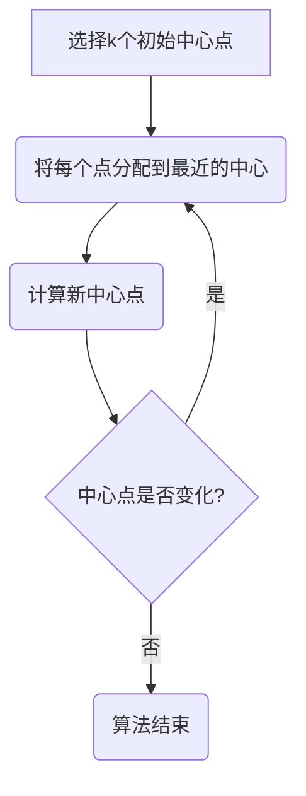
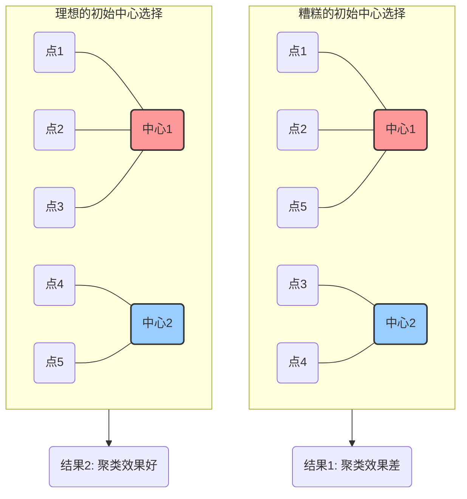
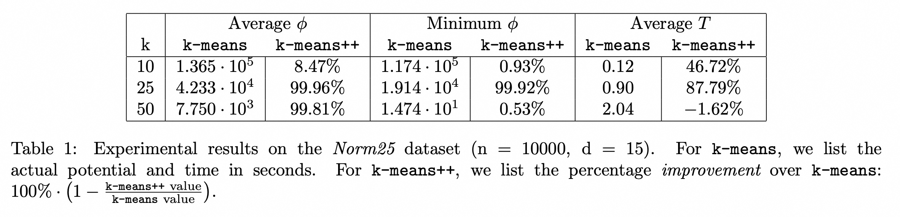
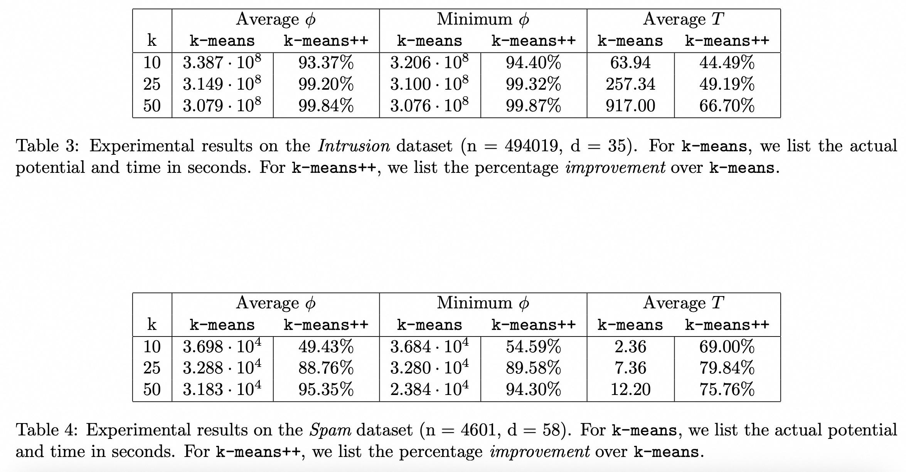

## AI论文解读 | k-means++: The Advantages of Careful Seeding
        
### 作者        
digoal        
        
### 日期        
2025-09-18       
        
### 标签        
PostgreSQL , PolarDB , DuckDB , AI , 论文解读        
        
----        
        
## 背景  
      
https://theory.stanford.edu/~sergei/papers/kMeansPP-soda.pdf        
  
提示:          
```          
读懂《k-means++: The Advantages of Careful Seeding》这篇论文需要提前掌握哪些基础知识, 请使用中文通熟易懂的讲解这些基础知识, 可以引用论文中的图、表或使用Markdown支持的图形(text,mermaid等)增加解释性. 
  
使用中文通熟易懂的解读《k-means++: The Advantages of Careful Seeding》这篇论文, 其中的关键内容请着重讲解, 可以引用论文中的图、表或使用Markdown支持的图形(text,mermaid等)增加解释性. 
  
提取《k-means++: The Advantages of Careful Seeding》这篇论文中的重要术语, 使用中文对这些术语进行通熟易懂的讲解, 可以引用论文中的图、表或使用Markdown支持的图形(text,mermaid等)增加解释性. 
```     
  
## 1 前置知识 
  
阅读《k-means++: The Advantages of Careful Seeding》这篇论文前，需要了解以下几个核心基础概念：

-----

### 1\. 什么是聚类 (Clustering)?

聚类是一种无监督学习技术，目的是将一组数据点根据相似性分组。在论文中，聚类被描述为机器学习和计算几何中的一个经典问题 。想象一下你有一堆形状、颜色各异的玩具，你想把它们分成几堆，比如把所有红色的玩具放一堆，所有蓝色的放另一堆。这就是聚类在现实生活中的一个简单例子。

### 2\. k-means 聚类算法

k-means 算法是应用最广泛的聚类方法之一 。它的目标是找到 `k` 个中心点，使得每个数据点到离它最近的中心点的平方距离之和最小 。

这个算法的运行流程非常直观：

1.  **初始化**: 随机选择 `k` 个数据点作为初始的聚类中心 。
2.  **分配**: 将每个数据点分配到离它最近的中心点，形成 `k` 个簇 。
3.  **更新**: 重新计算每个簇的中心点，通常是该簇内所有数据点的平均值（即质心）。
4.  **重复**: 重复步骤 2 和 3，直到聚类中心不再变化，算法收敛 。

这个过程可以用下面的 Mermaid 图来表示：



**k-means 算法的局限性**

尽管 k-means 简单且快速，但它有一个很大的缺点：它无法保证找到全局最优解，很可能陷入局部最优 。这意味着初始中心点的选择对最终结果影响很大。如果初始中心点选得不好，算法可能会产生非常糟糕的聚类结果 。

-----

### 3\. k-means++ 算法的核心改进

《k-means++: The Advantages of Careful Seeding》这篇论文的核心贡献就是提出了一种改进的 k-means 算法，称为 **k-means++** 。这个改进并没有改变 k-means 的核心迭代步骤（分配和更新中心），而是在算法的 **第一步——初始化** 上做了文章 。

k-means++ 的初始化过程是这样的：

1.  **第一步中心点**: 从数据集中随机选择一个点作为第一个中心点 $c\_1$ 。

2.  **后续中心点**: 对于剩下的 $k-1$ 个中心点，每次都根据一个特定的概率来选择下一个点 。这个概率与每个点到已选中心点的最短距离的平方成正比。

      * 具体来说，如果一个点 `x` 到已选中心点的最短距离是 $D(x)$，那么它被选为下一个中心点的概率是 $\\frac{D(x)^2}{\\sum\_{x \\in \\mathcal{X}} D(x)^2}$ 。

这个 "D² 加权" (D² weighting) 的策略意味着离现有中心点越远的点，被选为下一个中心点的可能性就越大。这样做的好处是，新选择的中心点会尽可能地分散，从而避免了 k-means 算法因初始中心点过于集中而陷入局部最优的问题。

**k-means++ 的优势**

这篇论文的实验结果表明，k-means++ 不仅能显著提高聚类结果的准确性（即得到更低的误差），还能提高算法的运行速度 。这是因为它能让局部搜索更快地收敛。在某些数据集上，k-means++ 的准确性甚至比标准 k-means 高出好几个数量级，运行时间也快了 2 到 3 倍 。

### 4\. 论文中的数学符号和概念

  * **潜在函数 $\\phi$ (Potential Function)**: 这是论文中用来衡量聚类好坏的一个指标，指的是所有数据点到其最近的聚类中心点的平方距离之和 。k-means 算法的根本目标就是最小化这个值。
  * **$O(log\~k)$ -competitive**: 这是一个算法理论中的概念，意味着 k-means++ 算法的预期潜在函数值，不会比最优解的潜在函数值差太多，最差情况也只是相差一个 $O(log\~k)$ 的常数因子 。这为 k-means++ 的性能提供了理论保证。

-----

希望这些通俗的解释能帮助你更好地理解这篇论文。你对 k-means++ 的哪一部分最感兴趣？比如，是它的具体实现过程，还是它在不同数据集上的表现？
  
## 2 解读论文 
  
好的，我们来通俗易懂地解读这篇经典的聚类算法论文——《k-means++: The Advantages of Careful Seeding》。

这篇论文的核心思想非常巧妙：它**没有**去改造 k-means 算法复杂的聚类过程，而是仅仅优化了其“第一步”——**初始聚类中心的选择**，但 همین 这一点小小的改进，却极大地提升了算法的最终效果和稳定性。

-----

### 一、 经典 k-means 算法的“阿喀琉斯之踵”

首先，我们得知道传统的 k-means 算法是怎么工作的，以及它有什么天生的缺陷。

传统的 k-means 算法流程很简单 ：

1.  **随机播种 (Random Seeding)**：在数据点中完全随机地选择 `k` 个点作为初始的聚类中心 。
2.  **分配 (Assignment)**：计算每个数据点到这 `k` 个中心的距离，然后将它分配给离它最近的那个中心，形成 `k` 个簇 。
3.  **更新 (Update)**：对于每个簇，重新计算其所有点的平均值（质心），并将这个质心作为新的聚类中心 。
4.  **迭代 (Iteration)**：重复第 2 步和第 3 步，直到聚类中心不再发生变化，或者变化非常小为止 。

这个算法因为简单、快速，成为了“迄今为止在科学和工业应用中最受欢迎的聚类算法” 。

**但它的致命弱点在于第一步：随机播种。**

想象一下，如果初始中心选得不好，会发生什么？

  * **陷入局部最优**：算法可能很快就收敛了，但得到的是一个很差的聚类结果，远非全局最优解 。
  * **结果不稳定**：你这次运行和下次运行，由于初始中心是随机的，最后得到的聚类结果可能完全不同。

如下图所示，同样的数据集，仅仅因为初始中心选择的运气不同，就会导致天差地别的聚类结果。



传统 k-means 算法的随机性就像是“听天由命”，而 k-means++ 的出现，就是为了解决这个“命不好”的问题。

### 二、 核心创新：k-means++ 的“智慧播种”

k-means++ 算法的核心，就是一套更聪明的选择初始中心的策略，论文中称之为 **“慎重播种” (Careful Seeding)**。它的目标是让选出来的 `k` 个初始中心彼此之间尽可能分散。

具体步骤如下 ：

1.  **选择第一个中心**：从所有数据点中，完全随机地选择一个点作为第一个聚类中心 $c\_1$ 。
2.  **选择后续中心（核心步骤）**：
      * 首先，计算数据集中**每个点** `x` 到**已选出的所有**聚类中心的最短距离，记为 $D(x)$ 。
      * 然后，计算每个点被选为下一个聚类中心的概率，这个概率与 $D(x)^2$ 成正比。具体公式是 $P(x) = \\frac{D(x)^2}{\\sum\_{x' \\in X} D(x')^2}$ 。
      * 最后，根据这个概率分布，通过“轮盘赌”的方式选出下一个聚类中心。
3.  **重复**：重复第 2 步，直到选出 `k` 个聚类中心为止 。
4.  **执行标准 k-means**：在这 `k` 个“智慧”的初始中心选出后，就按照标准的 k-means 算法（分配、更新、迭代）继续执行 。

**这个策略的直观理解是**：

  * 距离当前已有聚类中心越远的点， $D(x)$ 就越大。
  * $D(x)$ 越大，它被选为下一个中心的概率就越高。
  * 这套机制就鼓励算法去数据集的“处女地”探索，而不是在已经有中心的区域扎堆，从而让初始中心自然地分散开。

### 三、 理论支撑：为什么 k-means++ 更优越？

k-means++ 不仅仅是直觉上更好，论文从理论上给出了严格的证明。

论文最重要的一个结论是：**k-means++ 算法是 $\\Theta(\\log k)$ 竞争性的 (competitive)** 。

这是什么意思呢？我们可以简单理解为：

> k-means++ 算法经过“智慧播种”后，得到的聚类结果（用误差 $\\phi$ 来衡量）的期望值 $E[\\phi]$，最坏也不会比理论上可能存在的“完美”聚类结果的误差 $\\phi\_{OPT}$ 差太多。具体来说，它与最优解的差距被一个与 $\\log k$ 相关的因子所限制，即 $E[\\phi] \\le 8(\\ln k+2)\\phi\_{OPT}$ 。

相比之下，传统的 k-means 算法，在某些情况下，其结果可能比最优解差“任意多倍” (arbitrarily bad) ，没有任何理论上的保证。

所以，k-means++ 给出了一个**有下限保证**的聚类质量，这是它相比于传统 k-means 最大的理论优势。

### 四、 实证效果：眼见为实的性能提升

理论是坚实的，那么在真实世界的数据上表现如何呢？论文通过在 4 个数据集上的实验，给出了令人信服的答案。

实验对比了标准 k-means 和 k-means++ 在**聚类精度**（平均误差，值越小越好）和**计算速度**（平均耗时）上的表现。

以下是论文中核心实验结果的摘要表格（数值代表 k-means++ 相对于 k-means 的**提升百分比**，越高越好）：

**数据集1：Norm25 (人造数据集)**
*这个数据集有很清晰的簇结构，用来测试算法能否发现“显而易见”的答案。*

| k (聚类数) | 平均精度提升 | 平均速度提升 |
| :--- | :---: | :---: |
| 10 | 8.47% | 46.72% |
| 25 | **99.96%** | **87.79%** |
| 50 | **99.81%** | -1.62% (速度稍慢) |

  

*来源: Table 1*

**结论**：在结构清晰的数据上，k-means++ 的精度提升是**碾压性**的。传统 k-means 很容易因为初始点选择失误而把本该分开的簇合并掉，而 k-means++ 几乎总能找到最优解 。

**数据集2 & 3：Intrusion (入侵检测) 和 Spam (垃圾邮件)**
*这两个是维度高、规模大的真实世界数据集，更能体现算法的实用性。*

| 数据集 | k (聚类数) | 平均精度提升 | 平均速度提升 |
| :--- | :---: | :---: | :---: |
| **Intrusion** | 25 | **99.20%** | **49.19%** |
| | 50 | **99.84%** | **66.70%** |
| **Spam** | 25 | **88.76%** | **79.84%** |
| | 50 | **95.35%** | **75.76%** |

  

*来源: Table 3 & 4*

**结论**：在复杂的真实数据上，k-means++ 的优势依然巨大。精度提升了**几十倍甚至上千倍** (99% 的提升意味着误差缩小到原来的百分之一) 。

**一个有趣的点：为什么 k-means++ 会更快？**
你可能会觉得 k-means++ 的第一步（选择中心）计算更复杂，总时间应该更慢才对。但论文指出，虽然“播种”阶段稍慢，但由于初始中心质量非常高，后续的 k-means 迭代过程**能以更少的步数快速收敛**，从而使得总体耗时反而显著减少 。

### 五、 总结

《k-means++: The Advantages of Careful Seeding》这篇论文的贡献可以概括为：

1.  **指出了核心问题**：明确了标准 k-means 算法性能瓶颈在于其完全随机的初始化方式。
2.  **提出了一个简单而有效的解决方案**：设计了一套名为 k-means++ 的“智慧播种”策略，通过概率选择，让初始聚类中心尽可能相互远离。
3.  **提供了理论保证**：从数学上证明了 k-means++ 的结果是有质量下限的，即 $\\Theta(\\log k)$-竞争性，解决了标准 k-means 缺乏准确性保证的问题。
4.  **验证了实际效果**：通过大量实验证明，k-means++ 不仅在聚类精度上远超标准 k-means，在运行速度上也常常更快。

由于其出色的表现和易于实现的特点，k-means++ 已经成为当今业界和学术界使用 k-means 算法时的**默认和标准初始化方法**。
  
## 3 术语 
  
在《k-means++: The Advantages of Careful Seeding》这篇论文中，有几个非常重要的术语，理解它们是掌握这篇论文核心思想的关键。下面我用通俗易懂的方式为您讲解：

---

### **1. k-means 算法**

**解释：** 这是一种被广泛使用的聚类技术，用于将数据点分组。它的目标是找到 k 个“中心点”，使得每个数据点到它所属中心点的**平均平方距离**最小。这个过程通常从随机选择 k 个中心点开始，然后反复进行两个步骤：分配点到最近的中心，并重新计算每个簇的中心，直到位置不再变化 。

**核心挑战：** 论文指出，尽管 k-means 算法速度快、实现简单 ，但它最大的问题是**准确性**。它很容易陷入局部最优解，这意味着如果初始中心点选择得不好，最终的聚类结果可能会非常差 。

---

### **2. 潜在函数 $\phi$ (Potential Function)**

**解释：** 这是一个用于衡量聚类质量的指标。它指的是所有数据点到其最近的聚类中心的平方距离之和 。用数学公式表示就是 $\phi=\sum_{x\in\mathcal{X}}min_{c\in\mathcal{C}}||x-c||^{2}$ 。k-means 算法正是通过不断迭代来尝试最小化这个值，从而找到更好的聚类结果。

**核心意义：** 在论文中， $\phi_{OPT}$ 代表的是最优聚类所对应的最小潜在函数值 。论文的主要贡献就是证明，通过 k-means++ 的初始化方法，得到的聚类结果的潜在函数值 $E[\phi]$ 能够接近最优值，即 $E[\phi]\le 8(ln~k+2)\phi_{OPT}$ 。

---

### **3. k-means++ 算法**

**解释：** k-means++ 是对标准 k-means 算法的**初始化步骤**的改进。它的目标是选择更好的初始中心点，从而避免陷入局部最优解。这个过程不是随机选择所有中心点，而是通过一个精心设计的概率分布来选择 。

**核心步骤：**
1.  **第一个中心点**：从数据集中随机均匀地选择一个点作为第一个中心 $c_1$ 。
2.  **后续中心点**：对于剩下的 k-1 个中心点，每次都根据一个特定的概率来选择下一个点。这个概率与每个数据点到已选择中心点的**最短距离的平方**成正比 。用论文中的术语来说，这被称为“D² 加权” (D² weighting) 。

**优点：** 论文通过实验证明，这种初始化方法可以显著提高 k-means 算法的**准确性**和**速度**，有时效果非常显著 。这是因为 D² 加权倾向于选择那些远离现有中心点的点作为新的中心，使得初始中心点分布更广，为后续的迭代提供了一个更好的起点。

---

### **4. 竞争比 (Competitive Ratio)**

**解释：** 这是一个在算法分析中用来衡量近似算法性能的指标。它比较了算法得到的解与最优解之间的差距。

**论文中的应用：** 论文证明了 k-means++ 算法是 $\Theta(log~k)$ 竞争的 。这表示 k-means++ 算法得到的聚类质量在期望上不会比最优聚类差太多，其潜在函数值 $E[\phi]$ 最多是**最优值 $\phi_{OPT}$ 的 $O(log~k)$ 倍**。这是一个非常重要的理论保证 。论文还通过构造一个例子来证明这个界限是紧的，也就是说，在某些情况下，k-means++ 的性能确实会达到这个级别的差距 。

你对论文中提到的理论保证部分，比如 $O(log~k)$ 竞争性，想了解更多吗？
  
## 参考        
         
https://theory.stanford.edu/~sergei/papers/kMeansPP-soda.pdf    
        
<b> 以上内容基于DeepSeek、Qwen、Gemini及诸多AI生成, 轻微人工调整, 感谢杭州深度求索人工智能、阿里云、Google等公司. </b>        
        
<b> AI 生成的内容请自行辨别正确性, 当然也多了些许踩坑的乐趣, 毕竟冒险是每个男人的天性.  </b>        
    
#### [期望 PostgreSQL|开源PolarDB 增加什么功能?](https://github.com/digoal/blog/issues/76 "269ac3d1c492e938c0191101c7238216")
  
  
#### [PolarDB 开源数据库](https://openpolardb.com/home "57258f76c37864c6e6d23383d05714ea")
  
  
#### [PolarDB 学习图谱](https://www.aliyun.com/database/openpolardb/activity "8642f60e04ed0c814bf9cb9677976bd4")
  
  
#### [PostgreSQL 解决方案集合](../201706/20170601_02.md "40cff096e9ed7122c512b35d8561d9c8")
  
  
#### [德哥 / digoal's Github - 公益是一辈子的事.](https://github.com/digoal/blog/blob/master/README.md "22709685feb7cab07d30f30387f0a9ae")
  
  
#### [About 德哥](https://github.com/digoal/blog/blob/master/me/readme.md "a37735981e7704886ffd590565582dd0")
  
  

  
