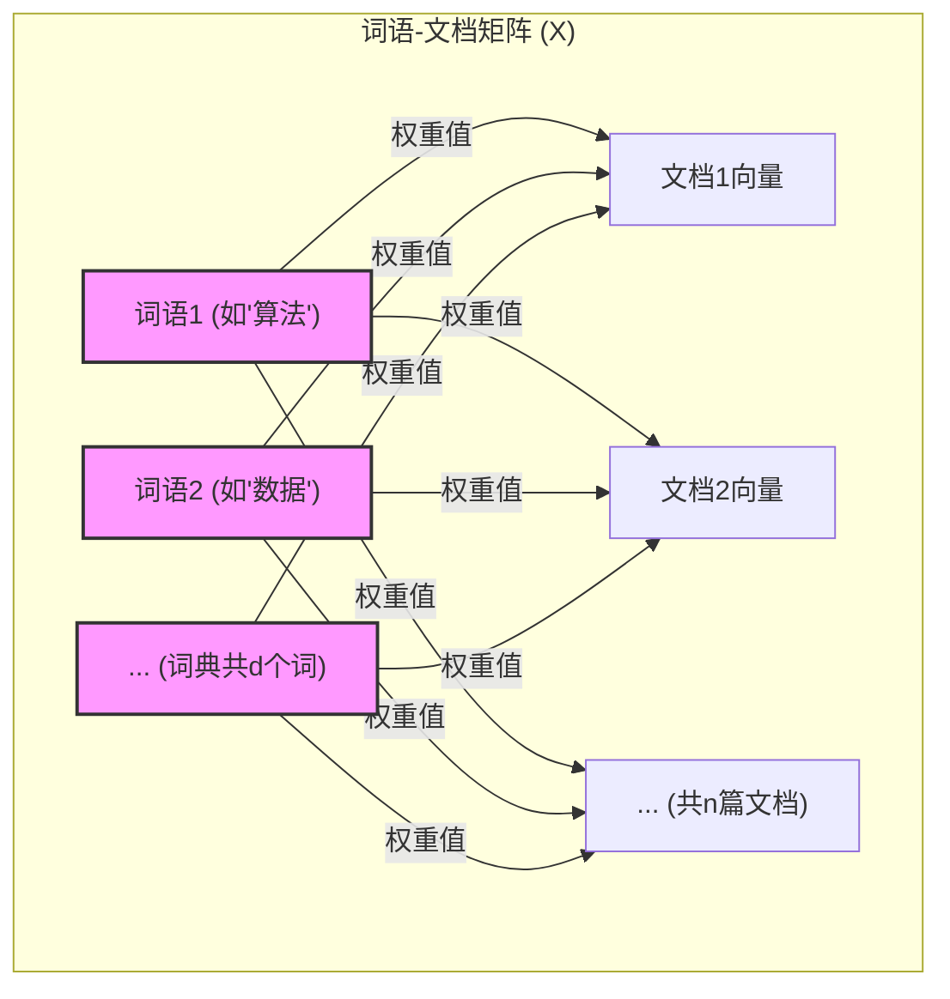
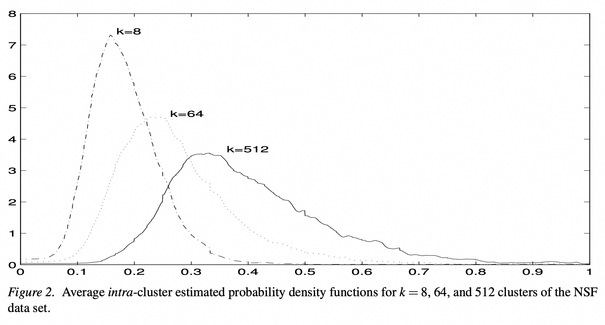
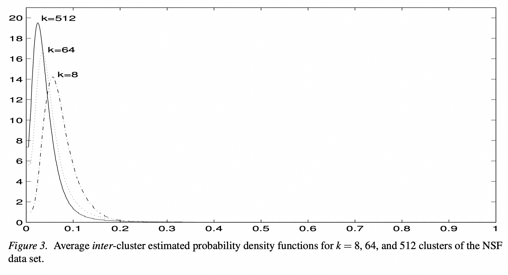
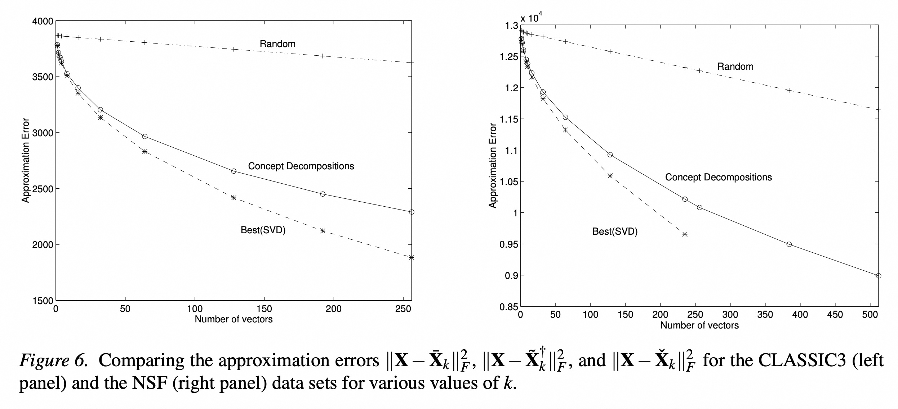
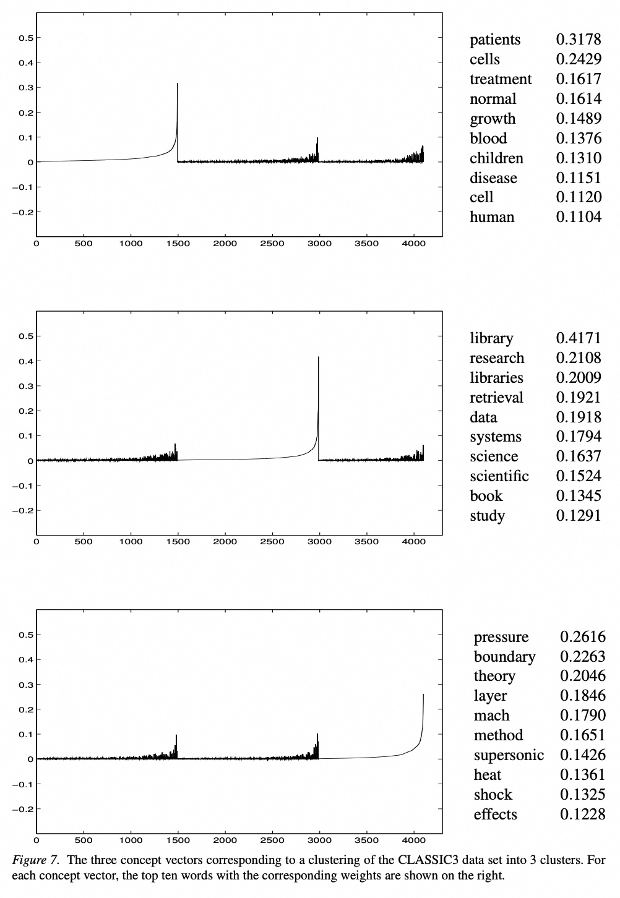
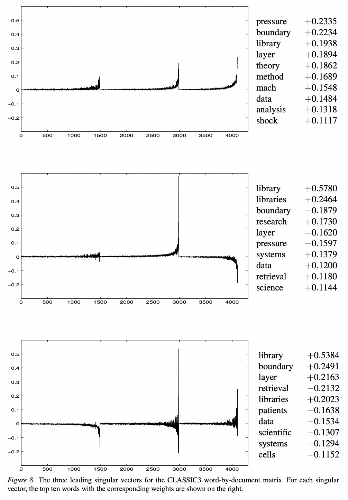
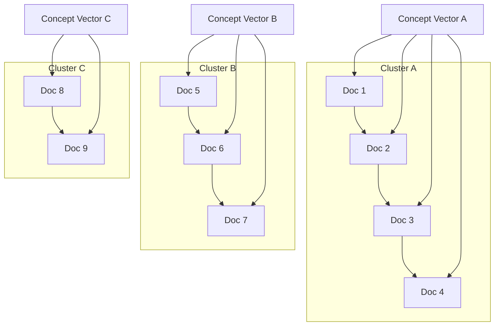

## AI论文解读 | Concept Decompositionsfor Large Sparse Text Data using Clustering
        
### 作者        
digoal        
        
### 日期        
2025-09-18       
        
### 标签        
PostgreSQL , PolarDB , DuckDB , AI , 论文解读        
        
----        
        
## 背景  
      
https://www.cs.utexas.edu/~inderjit/public_papers/concept_mlj.pdf        
  
提示:          
```          
读懂《Concept Decompositionsfor Large Sparse Text Data using Clustering》这篇论文需要提前掌握哪些基础知识, 请使用中文通熟易懂的讲解这些基础知识, 可以引用论文中的图、表或使用Markdown支持的图形(text,mermaid等)增加解释性. 
  
使用中文通熟易懂的解读《Concept Decompositionsfor Large Sparse Text Data using Clustering》这篇论文, 其中的关键内容请着重讲解, 可以引用论文中的图、表或使用Markdown支持的图形(text,mermaid等)增加解释性. 
  
提取《Concept Decompositionsfor Large Sparse Text Data using Clustering》这篇论文中的重要术语, 使用中文对这些术语进行通熟易懂的讲解, 可以引用论文中的图、表或使用Markdown支持的图形(text,mermaid等)增加解释性. 
```     
  
## 1 前置知识 
  
您好，要读懂《Concept Decompositions for Large Sparse Text Data using Clustering》这篇论文，您需要提前了解以下几个核心概念。该论文在摘要、引言和关键章节中对这些概念进行了详细阐述。

### 1. 向量空间模型 (Vector Space Model)
在处理文本数据时，第一步是将非结构化的文本转换为计算机可以处理的格式。向量空间模型是其中一种方法。它将每个文档表示为一个**高维稀疏向量** 。

* **高维（High-dimensional）**: 文档中独特的词汇数量可以非常庞大（通常有数千个） 。每个词汇都被视为一个维度，因此文档向量的维度非常高 。
* **稀疏（Sparse）**: 尽管维度很高，但单个文档只包含整个词汇表中一小部分词汇（通常只有1-5%甚至更少） 。这意味着向量中的大部分分量都是零，因此被称为“稀疏” 。

> 例如，假设有三篇文档，词汇表包含 "apple", "banana", "cat", "dog", "elephant"。
> * 文档1: "apple, banana, apple"
> * 文档2: "cat, dog"
> * 文档3: "elephant, cat, dog, cat"
>
> 我们可以构建一个词-文档矩阵（word-by-document matrix），其中行是词汇，列是文档。
>
> | | **文档1** | **文档2** | **文档3** |
> |---|---|---|---|
> | **apple** | 2 | 0 | 0 |
> | **banana** | 1 | 0 | 0 |
> | **cat** | 0 | 1 | 2 |
> | **dog** | 0 | 1 | 1 |
> | **elephant** | 0 | 0 | 1 |

---

### 2. 余弦相似度 (Cosine Similarity)
由于文档向量已经被标准化为单位L2范数，可以被视为高维单位球面上的点 。在这种情况下，衡量向量之间“相似度”的一个自然方法是它们的**内积（inner product）**，也称为**余弦相似度** 。余弦相似度计算的是两个向量夹角的余弦值，值越接近1，表示夹角越小，两个向量方向越接近，文档主题也越相似。

### 3. 球面k-均值算法 (Spherical k-means Algorithm)
这是论文中研究的核心算法。它是我们熟悉的“欧几里得”k-均值算法的变体 。传统k-均值使用欧几里得距离来划分簇，而球面k-均值算法则使用**余弦相似度**来衡量文档向量与 **概念向量（Concept Vector）** 之间的距离 。

### 4. 概念向量 (Concept Vectors)
概念向量是该算法的输出之一 。它是一个聚类中所有文档向量的**归一化质心（normalized centroid）** 。这些概念向量包含了聚类中所有文档的宝贵语义信息，可以看作是对文档簇的紧凑概括或“模型” 。

### 5. 概念分解 (Concept Decompositions)
这是论文提出的矩阵分解新方法 。它通过对文档矩阵进行**最小二乘逼近（least-squares approximation）**，将其投影到所有概念向量所跨越的线性子空间上 。该论文的一个主要贡献是，这种概念分解方法的近似误差与 **截断奇异值分解（Truncated Singular Value Decomposition，简称SVD）** 的近似误差非常接近 。

* **截断SVD (Truncated SVD)**：这是一种广泛应用于信息检索的矩阵分解方法 。它被认为是给定秩（rank）下对矩阵进行最佳近似的方案 。
* **概念向量与奇异向量的比较**: 论文指出，**奇异向量**是“全局性的”和“密集的”（不稀疏），而**概念向量**则在词汇空间中是“局部的”和“稀疏的” 。尽管如此，论文发现概念向量和主导奇异向量所跨越的线性子空间非常接近 。由于概念向量的稀疏性，球面k-均值算法在计算上更高效，并且需要更少的内存 。

---

希望以上解释对您有所帮助。如果您想深入了解其中的任何一个概念，或者想让我总结论文中的其他部分，比如实验部分，请随时告诉我。
  
## 2 解读论文 
  
好的，这篇由 Inderjit S. Dhillon 和 Dharmendra S. Modha 在 2000 年发表的论文是文本挖掘领域的经典之作。它巧妙地将聚类算法与矩阵分解联系起来，提出了一种既高效又直观的文本数据分析方法。

我将为您深入浅出地解读其核心思想与关键发现。

-----

### **一、 论文解决的核心问题**

在2000年前后，互联网数据爆炸式增长，如何从海量的、非结构化的文本文档（如网页、专利、新闻）中自动发现主题、进行归类和检索，是一个巨大的挑战 。

这篇论文的核心目标就是解决这个问题。当时的主流方法通常面临两大难题：

1.  **高维度 (High-Dimensionality)**：一篇文档可能包含成千上万个不同的词语，每个词语都是一个维度 。
2.  **稀疏性 (Sparsity)**：任何一篇文档只会用到词汇表里极小一部分的词语，导致代表文档的向量绝大部分元素都是零，稀疏度通常高达99% 。

如何在这种“高维稀疏”的数据中高效、准确地“挖掘概念”是本文着力解决的难题。

-----

### **二、 核心方法与概念**

为了应对上述挑战，论文提出并分析了一套组合方法，其中包含几个关键概念：

#### **1. 文本向量化 (Vector Space Model)**

这是处理文本数据的第一步。论文将每篇文档转换成一个数学向量，具体步骤如下 ：

  * **提取词语**：从所有文档中抽取出所有不重复的词语，构成一个巨大的词典。
  * **移除停用词**：去掉无实际意义的词，如 "的"、"是"、"a"、"the" 等 。
  * **计算权重**：使用 `tf-idf` (词频-逆文档频率)  或类似方法，计算每个词在每篇文档中的重要性得分。
  * **向量归一化**：将每个文档向量的长度调整为1 (即单位向量)，这样可以消除文档长短带来的影响，只关注内容方向 。

我们可以用一个矩阵来表示整个文档集，称为“词语-文档矩阵 (word-by-document matrix)” 。



#### **2. 球面 k-means 聚类 (Spherical k-means Algorithm)**

这是论文使用的核心算法。传统的 k-means 算法使用“欧氏距离”来衡量数据点之间的远近。但对于归一化后的文本向量，它们都分布在一个高维球体的表面上 ，此时用向量间的“夹角余弦 (cosine similarity)”来衡量相似度更为自然 。

**球面 k-means 的目标**：将所有文档向量分成 k 个簇 (cluster)，使得同一个簇内的文档尽可能相似（夹角尽可能小），其优化的目标函数是最大化所有簇的“凝聚度”之和 。

#### **3. 概念向量 (Concept Vectors)**

算法为每个生成的簇计算一个“中心点”，这个中心点也是一个单位向量，论文称之为**概念向量 (Concept Vector)** 。

**直观理解**：概念向量可以看作是该簇所有文档的“平均主题”或“核心概念”的数学表达。它的方向代表了这个簇的整体语义方向 。例如，一个簇如果都是关于计算机科学的论文，它的概念向量中，“算法”、“数据”、“系统”这些词的权重就会非常高。

-----

### **三、 论文的三大关键贡献与发现**

这篇论文的真正价值在于它围绕“概念向量”提出并验证了三个深刻的洞见。

#### **贡献1：高维稀疏文本数据的“分形”与“自相似”特性**

这是一个非常反直觉的发现。我们通常认为，一个簇里的数据点应该紧紧围绕在中心点周围。但论文通过实验发现：

  * **簇内距离其实很远**：在一个簇中，大部分文档向量与它所属的“概念向量”之间的相似度其实很低（即夹角很大）。概念向量周围其实是一片“真空地带” 。
  * **簇间距离更远**：虽然簇内距离远，但一个文档向量与**其他簇**的“概念向量”之间的距离**更远** 。聚类之所以能成功，是基于这种“相对距离”的差异，而非绝对的紧密 。

**正如论文图2和图3所示**，图2（簇内相似度）的概率密度函数虽然离1很远，但其峰值明显比图3（簇间相似度）更靠右。

    

最奇特的是，无论把数据分成8个簇、64个簇还是512个簇，这种“内部稀疏，但相对可分”的结构模式始终存在，仅仅是整体的相似度数值发生了平移 。作者将这种在不同尺度下表现出相似结构的现象，类比为**分形 (fractal-like)** 或 **自相似 (self-similar)** 。

#### **贡献2：概念分解 (Concept Decompositions) - 一种媲美SVD的矩阵近似方法**

这是论文提出的核心技术。在文本分析中，一个重要任务是“降噪”和“特征提取”，这通常通过矩阵近似来实现。当时最精确的矩阵近似方法是**奇异值分解 (Singular Value Decomposition, SVD)** ，但SVD计算量巨大，尤其对于大型矩阵 。

论文提出，可以用k个“概念向量”张成一个k维的“概念子空间”，然后将原始的“词语-文档矩阵”投影到这个子空间上，得到一个近似矩阵。这个过程就叫做**概念分解 (Concept Decomposition)** 。

**惊人的发现**：**论文的图6**给出了最有力的证据。图中比较了三种方法的矩阵近似误差：   

  * **Best(SVD)**：SVD方法，理论上的最优解，作为黄金标准。
  * **Concept Decompositions**：论文提出的概念分解方法。
  * **Random**：使用随机向量进行投影。

结果显示，**概念分解的误差曲线与SVD的曲线惊人地接近** ，远优于随机方法。这意味着，通过球面k-means聚类得到的概念向量，构成了一个质量极高的基底，其表达能力几乎与通过复杂计算得到的SVD奇异向量一样好。这为处理大规模文本数据提供了一个**计算上更高效**的替代方案 。

#### **贡献3：概念向量 vs. 奇异向量 (深刻的对比)**

虽然概念向量和SVD的奇异向量在矩阵近似上效果相当，但它们的性质却截然不同，这揭示了两者在“解释性”上的巨大差异。

| 特性 | **概念向量 (Concept Vectors)** | **奇异向量 (Singular Vectors from SVD)** |
| :--- | :--- | :--- |
| **局部性 (Locality)** | **局部化的 (Localized)** 。每个概念向量只在少数相关的词语维度上有高权重，清晰地对应一个主题。 | **全局化的 (Global)** 。每个奇异向量的权重会分散在大量词语上，混合了多个主题，难以直观解释。 |
| **稀疏性 (Sparsity)** | **稀疏的 (Sparse)** 。向量中大部分元素为零，这使得存储和计算更高效。 | **稠密的 (Dense)** 。向量中几乎所有元素都是非零值。 |
| **非负性** | **非负的 (Non-negative)** 。权重值都是正数，符合词频的直观感觉。 | **有正有负 (Positive and negative values)** 。负权重难以解释其物理意义。 |
| **正交性** | **趋向于正交 (Tend towards orthonormality)** 。随着簇数量k的增加，向量之间越来越接近正交。 | **严格正交 (Orthonormal)** 。这是SVD的数学定义。 |

**论文中的图7和图8**直观地展示了这种区别。      

  * **图7**中的三个概念向量，第一个明显关于“医学(patients, cells)”，第二个关于“信息科学(library, retrieval)”，第三个关于“航空(pressure, boundary)”，主题边界清晰。
  * **图8**中的三个奇异向量，每个向量的关键词都混杂了上述三个领域，无法清晰地標定其代表的单一概念。

**最后的惊喜**：尽管单个向量性质迥异，但论文通过**主夹角 (principal angles)** 分析发现，由k个概念向量张成的子空间，与由k个奇异向量张成的子空间**非常接近** 。这从数学上解释了为何概念分解的近似效果如此之好。

-----

### **四、 总结与启示**

这篇论文的核心价值在于：

1.  **揭示了高维稀疏数据的一种内在结构**：即“分形”或“自相似”的特性。
2.  **提出了一种高效且高质量的矩阵分解方法**：概念分解，其性能媲美SVD，但计算成本更低，更适合大规模数据。
3.  **提供了一种可解释性强的文本主题发现模型**：生成的概念向量是稀疏、局部的，可以直接作为“主题标签”来理解每个簇的含义，这是SVD难以做到的 。

它证明了简单的聚类算法不仅可以用于分类，其产生的“概念向量”本身就是一套强大、高效且易于理解的文本数据“基底”，为后来的主题模型（如LDA）和表示学习（如词嵌入）等研究方向提供了重要的思想启示。

这篇论文的研究非常扎实，不知道您是否对其中某个特定的贡献（例如，分形特性或与SVD的比较）特别感兴趣，或者想了解这些思想在今天是如何演进的？
  
## 3 术语 
  
好的，根据您上传的《Concept Decompositions for Large Sparse Text Data using Clustering》这篇论文，我为您提取并整理了几个重要的核心术语，并用通俗易懂的方式进行了解释。

-----

### 1\. 高维稀疏文本数据 (High-dimensional Sparse Text Data)

这是一个基础概念，描述了计算机如何看待文本。

  * **高维 (High-dimensional)**: 文本数据被表示成向量。每个词语，比如“算法”、“数据”、“矩阵”，都被看作一个独立的维度。一篇论文可能有数千个不同的词，因此它对应的向量维度就高达数千维。
  * **稀疏 (Sparse)**: 虽然维度很高，但任何一篇文档通常只使用了词汇表里一小部分词。这意味着在表示文档的向量中，绝大部分位置的值都是零，只有很少一部分是非零值。论文中提到，稀疏度通常在95%到99%之间，也就是说，向量中95%以上的分量是0。

### 2\. 向量空间模型 (Vector Space Model)

这是一种将文本转化为上面提到的“高维稀疏向量”的方法。它将词语的出现频率（如TF-IDF值）作为向量分量的值。举个例子：

**词-文档矩阵**

| | 文档A | 文档B | 文档C |
|---|---|---|---|
| **算法** | 3 | 0 | 1 |
| **数据** | 2 | 1 | 0 |
| **矩阵** | 0 | 2 | 2 |
| **学习** | 1 | 0 | 3 |

-----

### 3\. 球面k-均值算法 (Spherical k-means)

这是论文使用的核心聚类算法，它是我们常见的k-均值算法的变体。

  * **传统k-均值**：使用欧几里得距离来衡量向量之间的距离，它适用于“欧几里得空间”，也就是我们熟悉的二维、三维空间。
  * **球面k-均值**：考虑到文本向量通常被归一化到单位长度，它们可以被看作是高维球体上的点。因此，**余弦相似度**（两个向量夹角的余弦值）是更合适的相似度衡量标准。球面k-均值算法就是用余弦相似度来对这些文档向量进行聚类。

### 4\. 概念向量 (Concept Vectors)

在球面k-均值算法中，每个聚类（cluster）会产生一个**概念向量**。

  * **定义**: 概念向量是聚类中所有文档向量的“归一化质心”（normalized centroid）。可以理解为，它是这个聚类所有文档的“平均向量”，代表了这个聚类的核心主题或概念。
  * **特性**: 论文指出，由于文本数据的稀疏性，概念向量也继承了这种**稀疏性**，并且具有**局部性**。这使得它们比传统方法产生的向量更易于解释和计算。

下面是一个简单的示意图，展示了概念向量作为聚类中心的思想：



  * **J、K、L**代表三个概念向量，它们分别是各自聚类的中心点。

### 5\. 概念分解 (Concept Decompositions)

这是论文提出的主要贡献，一种新的矩阵分解方法。

  * **核心思想**: 论文提出，可以使用上面提到的**概念向量**来对原始的文档矩阵进行近似分解。
  * **与截断SVD的对比**: 论文将这种分解方法与信息检索领域最经典的 **截断奇异值分解（Truncated SVD）** 进行比较。尽管SVD被认为是理论上的最佳近似，但论文通过实验证明，使用概念向量进行分解的近似误差与SVD非常接近，甚至在某些情况下表现更好。同时，由于概念向量是稀疏和局部的，这种分解方法在计算上更高效，也更易于理解。

-----

您是否希望我继续为您总结这篇论文的其他部分，例如实验结果或作者的结论？
  
## 参考        
         
https://www.cs.utexas.edu/~inderjit/public_papers/concept_mlj.pdf    
        
<b> 以上内容基于DeepSeek、Qwen、Gemini及诸多AI生成, 轻微人工调整, 感谢杭州深度求索人工智能、阿里云、Google等公司. </b>        
        
<b> AI 生成的内容请自行辨别正确性, 当然也多了些许踩坑的乐趣, 毕竟冒险是每个男人的天性.  </b>        
    
#### [期望 PostgreSQL|开源PolarDB 增加什么功能?](https://github.com/digoal/blog/issues/76 "269ac3d1c492e938c0191101c7238216")
  
  
#### [PolarDB 开源数据库](https://openpolardb.com/home "57258f76c37864c6e6d23383d05714ea")
  
  
#### [PolarDB 学习图谱](https://www.aliyun.com/database/openpolardb/activity "8642f60e04ed0c814bf9cb9677976bd4")
  
  
#### [PostgreSQL 解决方案集合](../201706/20170601_02.md "40cff096e9ed7122c512b35d8561d9c8")
  
  
#### [德哥 / digoal's Github - 公益是一辈子的事.](https://github.com/digoal/blog/blob/master/README.md "22709685feb7cab07d30f30387f0a9ae")
  
  
#### [About 德哥](https://github.com/digoal/blog/blob/master/me/readme.md "a37735981e7704886ffd590565582dd0")
  
  

  
