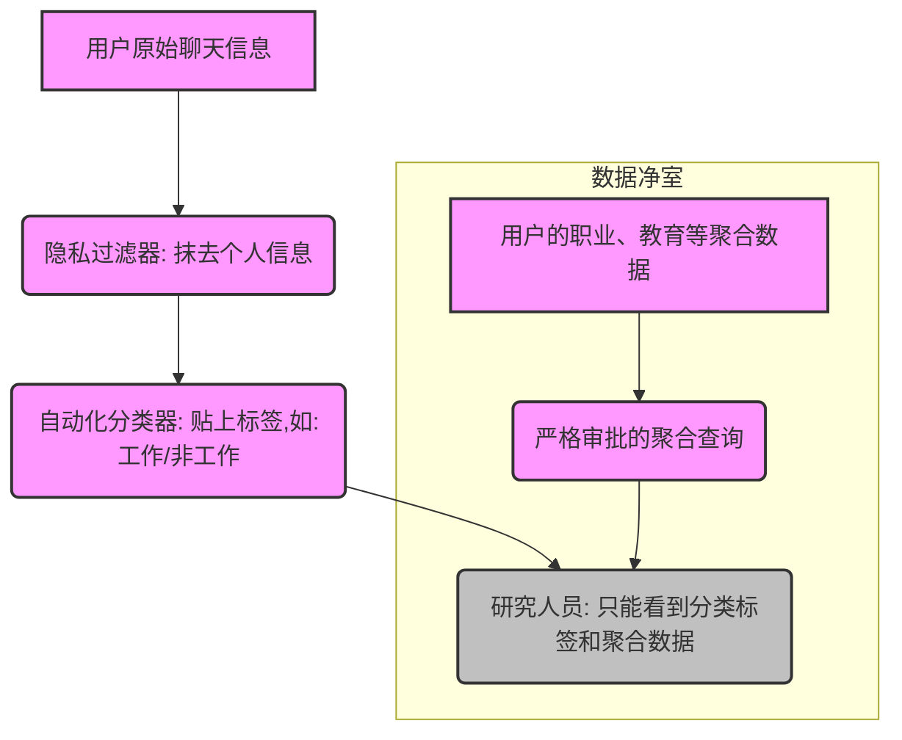
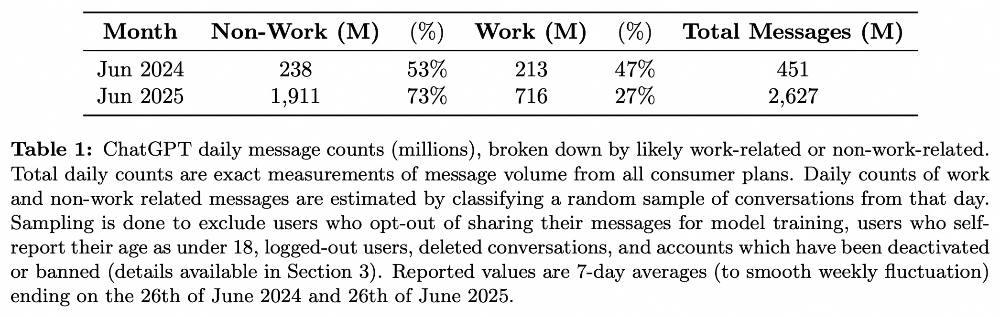
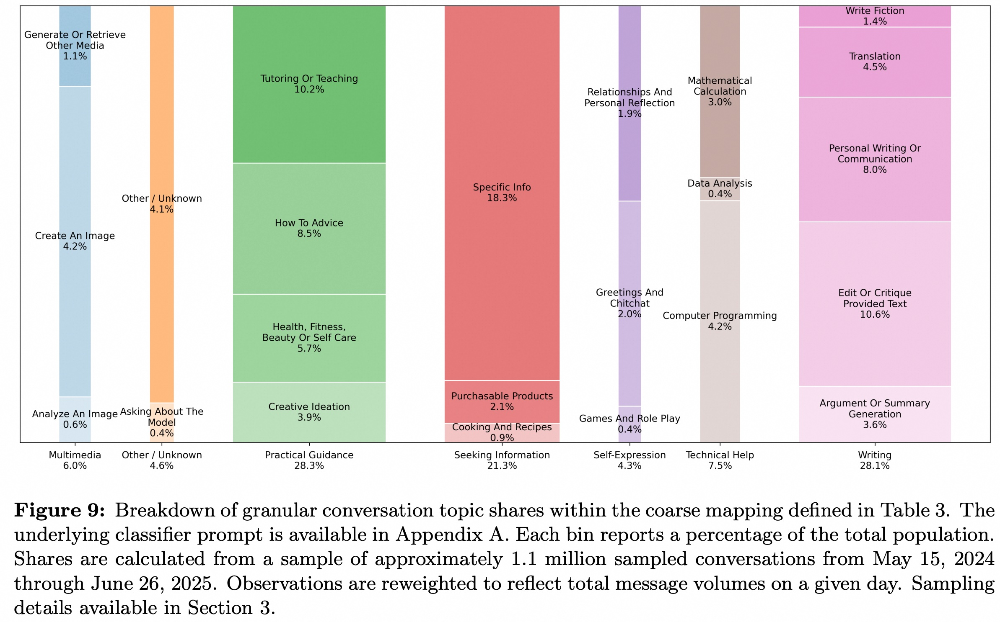
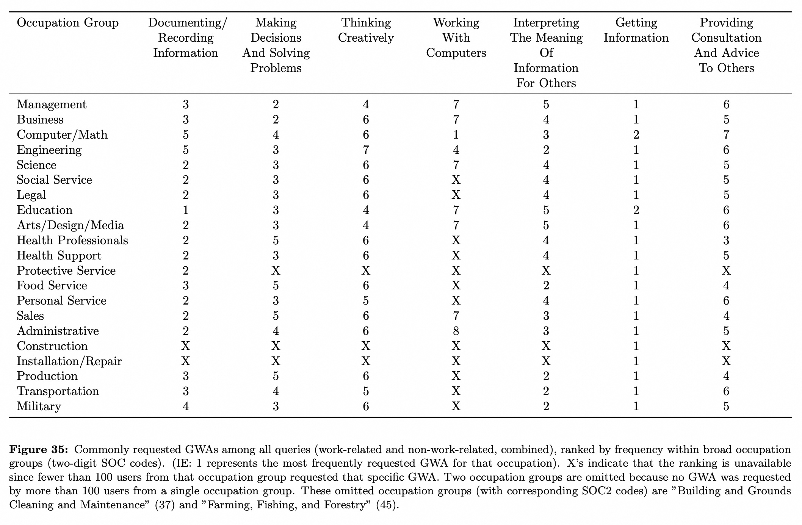
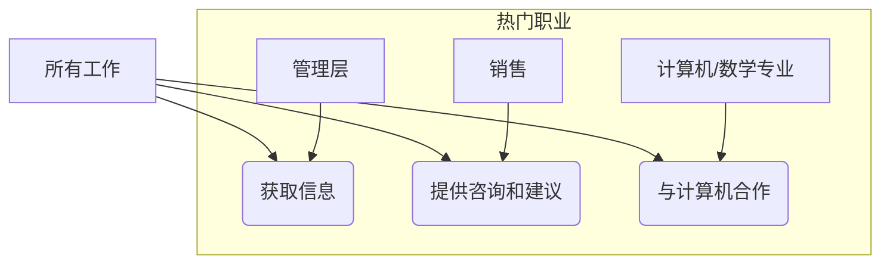

## AI论文解读 | HOW PEOPLE USE CHATGPT
        
### 作者        
digoal        
        
### 日期        
2025-09-18       
        
### 标签        
PostgreSQL , PolarDB , DuckDB , AI , 论文解读        
        
----        
        
## 背景  
      
https://www.nber.org/system/files/working_papers/w34255/w34255.pdf        
  
提示:          
```          
读懂《HOW PEOPLE USE CHATGPT》这篇论文需要提前掌握哪些基础知识, 请使用中文通熟易懂的讲解这些基础知识, 可以引用论文中的图、表或使用Markdown支持的图形(text,mermaid等)增加解释性. 
  
使用中文通熟易懂的解读《HOW PEOPLE USE CHATGPT》这篇论文, 其中的关键内容请着重讲解, 可以引用论文中的图、表或使用Markdown支持的图形(text,mermaid等)增加解释性. 
  
提取《HOW PEOPLE USE CHATGPT》这篇论文中的重要术语, 使用中文对这些术语进行通熟易懂的讲解, 可以引用论文中的图、表或使用Markdown支持的图形(text,mermaid等)增加解释性. 
```     
  
## 1 前置知识 
  
您好，我已经阅读了您上传的《HOW PEOPLE USE CHATGPT》这篇论文。为了帮助您更好地理解它，我将论文中涉及的基础知识分为以下几个部分进行通俗易懂的讲解。

### 1\. 技术基础：ChatGPT是什么？

这篇论文的核心研究对象是ChatGPT，因此理解它的技术原理是基础。您可以将ChatGPT想象成一个“超级预测器”，它有两个主要阶段的学习过程 ：

  * **预训练（Pre-training）**：在这个阶段，模型被喂食海量的文本数据，学习如何根据前面的词来预测下一个词 。这让它对语言的结构和世界的知识形成了“潜层表征” 。
  * **后训练（Post-training）**：在这个阶段，模型被“调教”成一个好的聊天机器人。它通过学习如何给出对用户有用的、高质量的回答，来更好地执行任务，比如回答问题、写文章等 。这个阶段也包含了“安全约束”，以避免生成有害内容 。

论文中还提到了 **"tokens"（令牌）** ，您可以将其理解为构成文本的最小单位，它们可能是一个完整的词，也可能是一个词的一部分。

### 2\. 研究方法：如何收集和分析数据？

这篇论文的独特之处在于其强大的数据来源和严谨的隐私保护方法。研究人员没有直接查看用户聊天内容 ，而是使用了两种核心技术来保护隐私并进行分析：

  * **自动化分类器（Automated Classifiers）**：论文使用了一种基于LLM的自动化工具，它能直接对用户消息进行分类，比如判断消息是与工作相关还是非工作相关，或者属于什么主题 。这样，研究人员只能看到分类结果，而看不到具体的聊天内容 。
  * **数据净室（Data Clean Room）**：为了分析用户的职业和教育背景等聚合数据，研究人员使用了“数据净室” 。这个环境确保了研究人员只能运行预先批准的聚合查询，并且每个查询的结果都必须包含超过100个用户的数据，从而无法识别任何个人信息 。

您可以将这个过程想象为：



通过这种方式，研究人员在保护用户隐私的同时，能够分析大量数据并得出结论。

### 3\. 核心概念：用户意图与使用类型

论文提出了多种对用户使用意图的分类，这些是理解其主要发现的关键：

  * **工作与非工作（Work vs. Non-Work）**：论文将用户消息分为与工作相关和与非工作相关两大类 。数据显示，非工作用途增长速度更快，目前占总消息量的70%以上 。
  * **对话主题（Conversation Topics）**：论文将对话主题分为七个大类，其中最常见的三类是：
      * **实用指导 (Practical Guidance)**：例如寻求如何做某事的建议、创意构思或辅导教学 。
      * **寻求信息 (Seeking Information)**：类似于传统搜索引擎，用于查询事实信息 。
      * **写作 (Writing)**：包括撰写、编辑、总结和翻译文本 。
  * **用户意图（User Intent）**：论文还定义了一个更抽象的分类体系：
      * **Asking (求助)**：用户寻求信息或建议，以帮助他们做出更好的决策 。
      * **Doing (执行)**：用户要求ChatGPT帮助完成某项任务，比如起草邮件或编写代码 。
      * **Expressing (表达)**：用户仅仅表达观点或情感，不寻求信息或行动 。

总而言之，理解这些概念可以帮助您深入分析论文的结论，例如不同人群使用ChatGPT的动机，以及这种技术如何创造经济价值。

-----

如果想进一步了解，您希望我深入探讨一下论文的哪一部分？例如，您可以告诉我您对某个特定的图表或结论感兴趣。
  
## 2 解读论文 
  
好的，這就為您通俗易懂地解讀這篇名為《人們如何使用ChatGPT》(How People Use ChatGPT) 的重要論文。

這篇論文由杜克大學、哈佛大學和OpenAI的研究人員共同撰寫，並由美國國家經濟研究局（NBER）在2025年9月發布。它的獨特之處在於，研究團隊**首次利用ChatGPT內部的大規模、匿名化數據**，深入分析了全球上億用戶的真實使用行為，同時採用了創新的隱私保護技術，確保在不查看任何用戶聊天原文的情況下完成研究。

-----

### **核心觀點速覽**

這篇論文揭示了關於ChatGPT使用的八個核心事實，顛覆了許多人對於AI助手的傳統認知：

1.  **娛樂和生活遠超工作**：截至2025年7月，約70%的用戶查詢與工作無關，且非工作用途的增長速度遠超工作用途。
2.  **三大主流用法**：用戶最常做的三件事是尋求**實用指導**、**信息查詢**和**寫作輔助**，這三者佔據了近80%的使用量。
3.  **工作場景下，「寫作」為王**：在所有工作相關的查詢中，「寫作」佔比最高（約40%），尤其是幫助修改、潤色用戶已有的文本。
4.  **「提問」比「動手」更受歡迎**：研究者將用戶意圖分為「提問（Asking）」、「動手（Doing）」和「表達（Expressing）」。結果發現，「提問」（尋求建議和信息以輔助決策）佔比最高（約49%），增長最快，用戶滿意度也最高。
5.  **性別差距已基本消失**：ChatGPT發布初期，男性用戶佔絕大多數，但到2025年中，女性用戶的比例已超過男性。
6.  **年輕人是絕對主力**：在成年用戶中，近一半的消息量由26歲以下的年輕人貢獻。
7.  **發展中國家增長迅猛**：過去一年，ChatGPT在中低收入國家的用戶增長速度尤其快。
8.  **高知和專業人士更偏愛用AI「輔助決策」**：學歷更高、從事專業性工作的用戶，更傾向於在工作中使用ChatGPT進行「提問」，以輔助其高質量的決策。

接下來，我們將圍繞幾個關鍵問題，結合論文中的圖表進行詳細解讀。

-----

### **關鍵解讀一：ChatGPT的爆炸性增長與用戶畫像**

#### **用戶規模：已成全球現象**

論文指出，從2022年11月發布到2025年7月，ChatGPT的**週活躍用戶數（WAU）已超過7億**，相當於全球成年人口的近10% 。其信息處理量也達到了驚人的**每天25億條消息**，約每秒29,000條 。這種增長速度在科技史上是前所未有的 。

#### **用戶畫像：更年輕、更多元、更全球化**

  * **性別**：與發布初期約80%為男性用戶的情況截然不同，性別差距迅速縮小。到2025年6月，擁有典型女性名字的活躍用戶比例達到了52.4%，首次超過男性 。這表明ChatGPT已成功「破圈」，成為一種大眾化的工具。

    ```mermaid
    graph TD
        A[<b>性別比例演變</b>] --> B(早期: 男性用戶主導);
        A --> C(2025年6月: 女性用戶反超);
    ```

  * **年齡**：年輕用戶是絕對主力，**18-25歲的用戶貢獻了約46%的消息量** 。

  * **地域**：儘管高收入國家起步早，但在過去一年裡，中低收入國家（人均GDP在1萬至4萬美元之間）的用戶滲透率增長最為迅猛 。這意味著生成式AI正在成為一項普惠性的全球技術。

-----

### **關鍵解讀二：人們到底用ChatGPT做什麼？**

這是本篇論文最核心的部分。研究者從「工作 vs 非工作」、「具體話題」和「用戶意圖」三個維度進行了剖析。

#### **1. 工作 vs. 非工作：生活應用才是主流**

許多人認為ChatGPT是「生產力工具」，但數據顯示，它的價值更多體現在日常生活中。

論文中的 **表1** 清晰地展示了這一趨勢：

| 日期 | 非工作消息 (百萬) | 比例 | 工作消息 (百萬) | 比例 | 總消息 (百萬) |
| :--- | :--- | :--- | :--- | :--- | :--- |
| **2024年6月** | 238 | 53%  | 213 | 47%  | 451 |
| **2025年6月** | 1,911 | **73%**  | 716 | 27%  | 2,627 |

  

*數據來源: 論文 Table 1*

從上表可見，在一年時間裡，非工作相關消息的比例從53%飆升至73% 。這意味著ChatGPT不僅僅是辦公室的助手，更是人們生活中的顧問、老師和創意夥伴。

#### **2. 對話話題：三大支柱與意外的「冷門」**

論文將用戶的對話分為7大類，其中最核心的是三大類，佔比近80%：

  * **實用指導 (Practical Guidance)** - 28.3% ：這是最大的一類，包括生活中的「怎麼辦」問題（如修理、烹飪、健身計劃）、扮演輔導老師解釋概念（佔所有消息的10.2%）、以及創意構思等。
  * **寫作 (Writing)** - 28.1% ：包括撰寫、修改、總結、翻譯郵件和文檔等 。有趣的是，其中**約三分之二的需求是修改用戶提供的文本**，而不是從零開始創作 。
  * **信息查詢 (Seeking Information)** - 21.3% ：類似於傳統的搜索引擎，用來查找事實、人物、事件等信息 。

**兩個令人意外的發現**：

  * **編程 (Computer Programming)** 的佔比遠低於預期，僅佔總消息量的**4.2%** 。這可能因為專業開發者更傾向於使用API或專門的編程AI工具。
  * **情感陪伴與角色扮演 (Relationships and Personal Reflection / Games and Role Play)** 的佔比也很小，合計僅約**2.3%** 。這與媒體上關於「AI伴侶」的熱議形成了對比。

下图直觀展示了各類話題的佔比情況：

  

*數據來源: 論文 Figure 9*

```text
                  ChatGPT 用途佔比圖

|---------------------------------------------------------|
|  實用指導 (28.3%)                                       |
|  [ 輔導教學(10.2%) | How-to建議(8.5%) | 其他... ]      |
|---------------------------------------------------------|
|  寫作 (28.1%)                                           |
|  [ 修改/潤色(10.6%) | 個人寫作(8.0%) | 其他... ]       |
|---------------------------------------------------------|
|  信息查詢 (21.3%)                                       |
|  [ 查找具體信息(18.3%) | ... ]                          |
|---------------------------------------------------------|
|  技術幫助 (7.5%) [ 編程(4.2%) | ... ]                  |
|---------------------------------------------------------|
|  多媒體 (6.0%)                                          |
|---------------------------------------------------------|
|  自我表達 (4.3%) [ 情感反思(1.9%) | ... ]               |
|---------------------------------------------------------|
```

#### **3. 用戶意圖：「Asking」正在崛起**

為了更深入地理解用戶行為，論文創造了一個全新的分類框架：**Asking (提問), Doing (動手), Expressing (表達)**。

  * **Asking (提問)**：尋求信息或建議，以幫助用戶做出更好的決策。**好比一個「顧問」**。
      * *例子：「A和B兩個健康保險計劃有什麼區別？我該怎麼選？」* 
  * **Doing (動手)**：要求ChatGPT直接執行一項任務，生成具體的產出（如代碼、郵件、表格）。**好比一個「實習生」**。
      * *例子：「幫我把這封郵件寫得更正式一些。」* 
  * **Expressing (表達)**：單純地表達情感或進行閒聊。

**核心發現**：

  * 整體來看，**「Asking」(49%) \> 「Doing」(40%) \> 「Expressing」(11%)** 。
  * 在過去一年裡，**「Asking」的增長速度超過了「Doing」** 。
  * 無論是模型自動評估還是用戶的直接反饋（點讚/點踩），**「Asking」類對話的滿意度都顯著更高** 。

這表明，用戶越來越多地將ChatGPT視為一個**決策輔助工具 (decision support tool)**，而不僅僅是一個任務執行器 。

-----

### **關鍵解讀三：不同人群的使用模式有何差異？**

論文通過一個安全的「數據淨室（Data Clean Room）」技術，將匿名用戶的使用行為與其公開的職業和教育背景進行了關聯分析，得出了非常有價值的結論。

#### **教育程度的影響**

  * **學歷越高，越傾向於將ChatGPT用於工作** 。擁有研究生學歷的用戶，其工作相關消息佔比（48%）明顯高於本科以下學歷的用戶（37%）。
  * 在調整了職業等其他變量後，**研究生學歷的用戶更偏愛「Asking」**，而本科學歷以下的用戶相對更偏愛「Doing」。

#### **職業的影響**

  * **專業技術人士（如IT、管理、商業、科研人員）更常用ChatGPT輔助工作** 。例如，計算機從業者的工作消息佔比高達57%，而非專業性崗位用戶僅為40% 。
  * **不同職業的使用重點不同**：
      * **管理和商業人士**：最常用於「寫作」（佔工作消息的52%）。
      * **計算機從業人士**：最常用於「技術幫助」（佔工作消息的37%），並且在工作中進行「Asking」的比例是所有職業中最高的（47%）。

這表明，對於知識密集型工作，ChatGPT的核心價值在於**提供高質量的建議和信息，輔助人類專家進行複雜決策**，從而提高生產力 。這與其作為「副駕駛（co-pilot）」而非簡單「同事（co-worker）」的定位相符 。

-----

### **總結與啟示**

這篇論文首次為我們描繪了一幅基於海量真實數據的ChatGPT全球用戶圖景，其結論深刻且具有啟發性：

1.  **AI的價值遠超生產力工具**：ChatGPT在改善民生福祉、提供教育資源、激發個人創意等非工作領域的巨大潛力（70%的用量）可能被低估了 。其創造的消費者剩餘（consumer surplus）是巨大的。
2.  **AI的核心經濟價值在於「輔助決策」**：與其讓AI直接完成任務（Doing），高技能的知識工作者更看重其作為「思考夥伴」和「顧問」的角色（Asking）。這意味著AI的未來發展方向可能是增強人類的判斷力，而非簡單地替代人類的工作。
3.  **AI正在成為普惠性技術**：性別差距的彌合和在發展中國家的快速普及，表明生成式AI有潛力成為跨越數字鴻溝、促進全球知識平權的強大工具。

總之，這項研究告訴我們，人們正在以一種比我們想像中更廣泛、更多元、也更深入的方式擁抱生成式AI。它不僅在重塑工作，更在深刻地融入和豐富我們的日常生活。
  
## 3 术语 
  
好的，我已经为您整理并提取了《HOW PEOPLE USE CHATGPT》这篇论文中的重要术语，并用通俗易懂的中文进行讲解。这些术语是理解论文核心发现的关键。

### 1\. 技术术语

  * **Generative AI (生成式AI)**: 这是一种人工智能技术，可以根据训练数据生成全新的内容，例如文本、图像、音乐等。ChatGPT就是一种生成式AI。
  * **LLM (Large Language Model, 大型语言模型)**: 这种模型通过学习海量文本数据，能够理解、生成和处理人类语言。ChatGPT的核心技术就是LLM。
  * **Token (令牌)**: 您可以将其理解为文本的最小单位。一个词可能是一个令牌，也可能由多个令牌组成，例如“ChatGPT”这个词在处理时，可能会被拆分为“Chat”、“G”和“PT”等令牌。

### 2\. 研究方法与数据分析术语

  * **Data Clean Room (数据净室)**: 这是一种保护用户隐私的数据分析技术。它像一个“隔离的房间”，研究人员只能在其中运行预先批准的查询，并且所有结果都是聚合的，确保无法识别任何个体。论文中用它来分析用户的职业和人口统计数据。
  * **Automated Classifiers (自动化分类器)**: 论文使用了一种基于LLM的工具，它能自动给用户与ChatGPT的对话贴上标签，比如“工作相关”或“非工作相关”，而无需人工阅读对话内容。这在保护隐私的同时，实现了大规模的数据分析。
  * **Heuristics (启发式方法)**: 这是一种在没有足够信息的情况下，通过经验法则或直觉来快速做出判断的方法。论文使用了一些启发式方法来初步分类用户消息，例如根据某些关键词来猜测意图。

### 3\. 用户行为与使用意图术语

  * **User Intent (用户意图)**: 指用户与ChatGPT互动时的目的。论文将用户意图分为三类：

      * **Asking (求助)**: 提问，寻求信息或建议。
      * **Doing (执行)**: 要求ChatGPT完成任务，比如写作或编程。
      * **Expressing (表达)**: 仅仅是发表观点、抒发情感或进行闲聊。

  * **Conversation Topics (对话主题)**: 论文将对话内容归类为七个主题，例如：

      * **Practical Guidance (实用指导)**: 如寻求做饭食谱或如何修理家具的建议。
      * **Seeking Information (寻求信息)**: 如询问历史事件或科学事实。
      * **Writing (写作)**: 如起草邮件或写诗。

  * **Generalized Work Activities (GWAs, 通用工作活动)**: 论文引用了美国劳工部（O\*NET）对工作活动的分类，并用它来分析不同职业的人如何使用ChatGPT。这是一种宏观的、跨行业的职业活动描述，例如“获取信息”、“决策与问题解决”和“与计算机合作”。这部分在论文的图表（例如Figure 35）中得到了详细展示，下图简要概括了部分职业最常请求的GWAs：   




这些术语构成了论文的语言和分析框架，掌握它们能帮助您更透彻地理解论文的研究方法和核心结论。

如果您想更深入了解这些术语中的任何一个，或者想知道它们在论文中是如何应用的，请随时告诉我。
  
## 参考        
         
https://www.nber.org/system/files/working_papers/w34255/w34255.pdf    
        
<b> 以上内容基于DeepSeek、Qwen、Gemini及诸多AI生成, 轻微人工调整, 感谢杭州深度求索人工智能、阿里云、Google等公司. </b>        
        
<b> AI 生成的内容请自行辨别正确性, 当然也多了些许踩坑的乐趣, 毕竟冒险是每个男人的天性.  </b>        
    
#### [期望 PostgreSQL|开源PolarDB 增加什么功能?](https://github.com/digoal/blog/issues/76 "269ac3d1c492e938c0191101c7238216")
  
  
#### [PolarDB 开源数据库](https://openpolardb.com/home "57258f76c37864c6e6d23383d05714ea")
  
  
#### [PolarDB 学习图谱](https://www.aliyun.com/database/openpolardb/activity "8642f60e04ed0c814bf9cb9677976bd4")
  
  
#### [PostgreSQL 解决方案集合](../201706/20170601_02.md "40cff096e9ed7122c512b35d8561d9c8")
  
  
#### [德哥 / digoal's Github - 公益是一辈子的事.](https://github.com/digoal/blog/blob/master/README.md "22709685feb7cab07d30f30387f0a9ae")
  
  
#### [About 德哥](https://github.com/digoal/blog/blob/master/me/readme.md "a37735981e7704886ffd590565582dd0")
  
  

  
