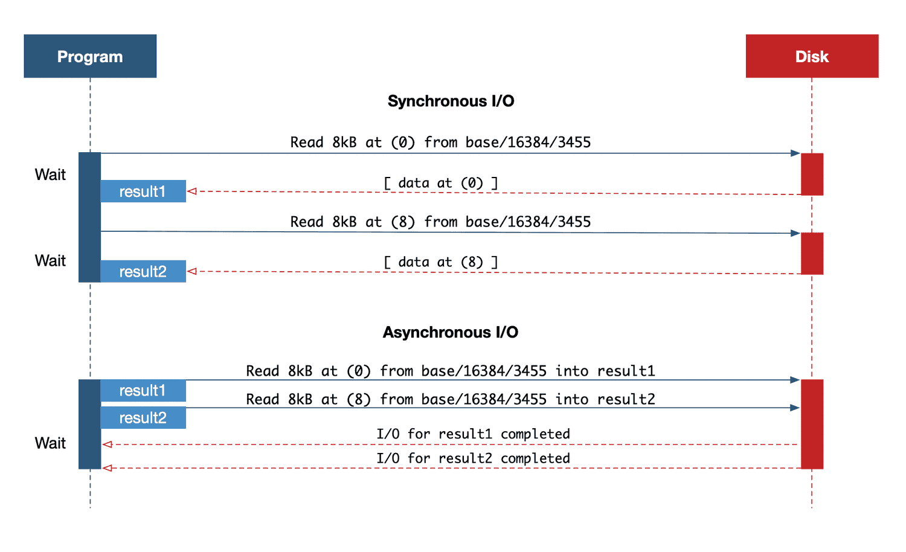
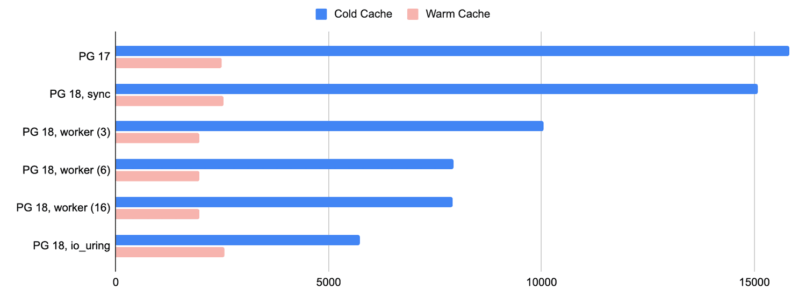
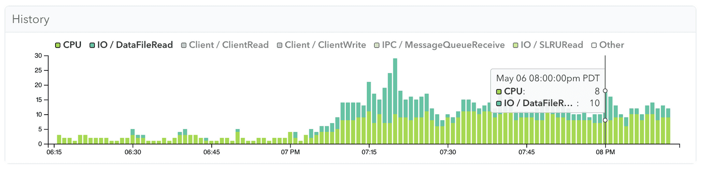

## PG 18 AIO 性能改进详细评测      
                                                            
### 作者                                                            
digoal                                                            
                                                            
### 日期                                                            
2025-09-20                                                          
                                                            
### 标签                                                            
PostgreSQL , PolarDB , DuckDB , io_method , AIO , io_uring , effective_io_conurrency                  
                                                            
----                                                            
                                                            
## 背景     
PostgreSQL 18 的最重磅更新之一: 引入异步IO, 高富帅用户(特指使用nvme盘)可能无法体会异步IO带来的革命性提升, 但是屌丝用户(特指使用云存储自己部署PG数据库的用户)简直要乐疯了.  
  
为什么?  
  
同步IO和异步IO最大的差别是IO等待模式的差别, 在某些不必等待IO结果返回就可以继续进行下一步操作的场景中, 简直千差万别.  
  
用NVme盘的高富帅用户对这个等待的感知较小, 因为一次IO很快就结束了(高端产品通常在30微秒以内). 但用云存储的屌丝用户就完全不一样了, 一次IO中网络的延迟是致命性的, 通常都在毫秒以上(相差了近2个数量级, 1毫秒=1000微秒).    
  
异步IO给PG 屌丝用户带来的好处, 在云环境中部署的PG, 在重IO负载的请求中(例如 OLAP型查询)性能将飙升. (高富帅用户肯定有疑问, 那使用nvme盘有提升吗? 这个答案请自行测试, 因为我不是高富帅, 测试方法文章中已给出! 测完可以在留言区反馈(凡尔赛)一下!)    
  
下面是一篇详细的测试报告, 翻译自: https://pganalyze.com/blog/postgres-18-async-io    
  
# 等待 Postgres 18：使用异步 I/O 加速磁盘读取  
  
随着Postgres 18 Beta 1 的发布，Postgres 多年来的一项重大架构变革——异步 I/O (AIO)——正在逐渐成型。这些功能仍在积极开发中，但它们代表了 Postgres 处理 I/O 方式的根本性变革，有望带来显著的性能提升，尤其是在延迟往往成为瓶颈的云环境中。  
  
虽然在正式发布前的 Beta 测试阶段，某些功能可能仍会被调整或删除(不可能,绝对不可能,现在已经是rc1了)，但现在是测试和验证 Postgres 18 实际性能的最佳时机。在 Postgres 18 中，AIO 仅限于读取操作；写入操作保持同步，但未来版本可能会扩展对 AIO 的支持。  
  
在这篇文章中，我们解释了什么是异步 I/O，它在 Postgres 18 中是如何工作的，以及它对性能优化意味着什么。  
  
## 为什么异步 I/O 很重要  
Postgres 一直以来都采用同步 I/O 模型，这意味着每个读取请求都是一个阻塞式的系统调用。数据库必须暂停并等待操作系统返回数据才能继续执行。这种设计会导致不必要的 I/O 等待，尤其是在云环境中，因为存储通常是网络连接的（例如 Amazon EBS），并且 I/O 延迟可能超过 1 毫秒。  
  
在简化的模型中，我们可以这样说明差异，忽略 Linux 内核可能执行的任何预取/批处理：  
  
     
  
*显示具有并发请求的同步与异步 I/O 模型的图表*  
  
您可以将同步 I/O 想象成一个图书管理员，他每次取一本书，然后返回再取下一本。随着逻辑操作的物理读取次数增加，这种低效率会加剧。  
  
异步 I/O 允许程序并发发出多个读取请求，而无需等待之前的读取返回，从而消除了这一瓶颈。在异步程序流程中，I/O 请求会被安排读入内存位置，然后程序会等待这些读取完成，而不是单独发出每个读取请求。  
  
## Postgres 17 的读取流功能如何铺平AIO的道路  
在 Postgres 中实现异步 I/O 的工作已经进行了多年。Postgres 17 引入了一个重要的内部抽象，即[读取流 API](https://pganalyze.com/blog/5mins-postgres-17-streaming-io) 。这些内部更改标准化了跨不同子系统发出读取操作的方式，并简化了`posix_fadvise()`请求操作系统提前预取数据的使用。  
  
然而，`posix_fadvise()`接口的这种建议机制仅提示内核将数据加载到操作系统页面缓存中，而不是 Postgres 自己的共享缓冲区中。Postgres 仍然需要为每次读取发出系统调用，并且操作系统的预读行为并不总是一致的。  
  
即将发布的 Postgres 18 版本将消除这种间接性。通过真正的异步读取，数据将由数据库本身直接提取到共享缓冲区中，从而绕过对内核级启发式算法的依赖，并实现更可预测、更高吞吐量的 I/O 行为。  
  
  
## Postgres 18 中的新 `io_method` 设置  
为了控制用于异步 I/O 的机制，Postgres 18 引入了一个新的配置参数：`io_method`。此设置确定如何在后台调度读取操作，以及是否同步处理它们、卸载到 I/O worker，或通过`io_uring`直接提交给内核。  
  
`io_method` 必须在 postgresql.conf 中设置，并且必须重启才能更改。它控制 Postgres 将使用的 I/O 实现，在 Postgres 18 中调整 I/O 性能时，了解它至关重要。`io_method` 有三种可能的设置，当前默认值（截至 Beta 1）为` worker`。  
  
### io_method = sync  
Postgres 18 中的`sync`设置反映了 Postgres 17 中实现的同步I/O行为。读取仍然是同步和阻塞的，在 Linux 内核中用`posix_fadvise()`实现预读。  
  
### io_method = worker  
`worker`设置利用在后台运行的专用`I/O 工作进程`，这些进程独立于query执行来检索数据。主后端进程将读取请求加入队列，这些工作进程与 Linux 内核交互以获取数据，然后将数据传递到共享缓冲区，而不会阻塞主进程。  
  
可以通过`io_workers`设置配置 I/O 工作进程的数量，默认值为`3`。这些工作进程始终处于运行状态，并在所有连接和数据库之间共享。  
  
### io_method = io_uring  
`io_uring` 是 Linux 特有的方法，这是内核 5.1 版本中引入的高性能 I/O 接口。异步 I/O 自内核 2.5 版本以来就已在 Linux 中可用，但它在很大程度上被认为效率低下且难以使用。`io_uring` 在 Postgres 和内核之间建立了一个共享的环形缓冲区，从而最大限度地减少了系统调用开销。这是最高效的选项，完全消除了对 I/O 工作进程的需求，但仅适用于较新的 Linux 内核，并且需要与支持兼容的文件系统和`io_uring`配置。  
  
重要提示：从 Postgres 18 Beta 1 开始，顺序扫描、位图堆扫描和维护操作（如`VACUUM`）都支持异步 I/O 。  
  
## 异步 I/O 实操  
异步 I/O 在存储通过网络连接的云环境中（例如 Amazon EBS 卷）带来最显著的提升。在这些设置中，单个磁盘读取通常需要数毫秒，与本地 SSD 相比，这会带来相当大的延迟。  
  
使用传统的同步 I/O，每次读取都会阻塞查询执行，直到数据到达，从而导致 `CPU 时间闲置`并降低吞吐量。相比之下，异步 I/O 允许 Postgres 并行发出多个读取请求，并在等待结果的同时继续处理。这降低了查询延迟，并能够更有效地利用可用的 I/O 带宽和 CPU 周期。  
  
### AWS 基准测试：io_uring 读取性能翻倍  
为了评估异步 I/O 对性能的影响，我们在 AWS 上对一个代表性工作负载进行了基准测试，并使用不同的`io_method`设置比较了 Postgres 17 和 Postgres 18。不同版本的工作负载保持一致，这使我们能够区分新 I/O 基础设施的影响。  
  
我们在 `AWS c7i.8xlarge` 实例（32 个 vCPU，64 GB RAM）上进行了测试，该实例为 Postgres 提供了 100GB 的专用 io2 EBS 卷，预置 IOPS 为 20,000。测试表大小为 3.5GB：  
```  
CREATE TABLE test(id int);  
INSERT INTO test SELECT * FROM generate_series(0, 100000000);  
test=# \dt+  
                                   List of relations  
 Schema | Name | Type  |  Owner   | Persistence | Access method |  Size   | Description   
--------+------+-------+----------+-------------+---------------+---------+-------------  
 public | test | table | postgres | permanent   | heap          | 3458 MB |   
(1 row)  
```  
  
在测试运行之间，我们清除了操作系统页面缓存（`sync; echo 3 > /proc/sys/vm/drop_caches`），并重启了 Postgres，以收集冷缓存结果。热缓存结果表示查询已再次运行。我们对每种配置重复了多次完整的测试，最终保留了三次中的最佳结果。  
  
虽然我们也使用并行查询进行了测试，但为了使结果更容易理解，以下所有结果都是在并行查询关闭的情况下进行的（`max_parallel_workers_per_gather = 0`）。    
  
冷缓存结果：  
```  
Postgres 17 使用同步 I/O，建立了基准。它表现出一致的读取延迟，但由于需要先完成每个 I/O 请求，然后再发出下一个请求，因此吞吐量受到限制：  
  
test=# SELECT COUNT(*) FROM test;  
   count     
-----------  
 100000001  
(1 row)  
  
Time: 15830.880 ms (00:15.831)  
```  
  
Postgres 18 在配置`io_method = sync`时执行的性能几乎相同，证实在不启用异步 I/O 的情况下行为保持不变：  
```  
test=# SELECT COUNT(*) FROM test;  
   count     
-----------  
 100000001  
(1 row)  
  
Time: 15071.089 ms (00:15.071)  
```  
  
然而，当我们切换到使用`worker`方法时，使用 3 个 I/O 工作者（默认），就会出现明显的改进：  
```  
test=# SELECT COUNT(*) FROM test;  
   count     
-----------  
 100000001  
(1 row)  
  
Time: 10051.975 ms (00:10.052)  
```  
  
我们观察到通过增加 I/O 工作进程的数量可以获得一些收益，但最大的改进来自于`io_uring`配置：  
```  
test=# SELECT COUNT(*) FROM test;  
   count     
-----------  
 100000001  
(1 row)  
  
Time: 5723.423 ms (00:05.723)  
```  
  
当我们绘制此图时（以毫秒为单位测量运行时间，越低越好），很明显 Postgres 18 在冷缓存情况下的表现明显更好：  
  
  
  
*Postgres 17 和 18 在不同的 io_method 设置下的读取性能比较*  
  
对于冷缓存测试，与传统`sync`方法相比，`worker`和`io_uring`的读取性能均提高了 2-3 倍。  
  
虽然由于`worker`的并行性而为热缓存测试提供了轻微的优势，但在冷缓存测试中`io_uring`始终表现更好，并且`io_uring`较低的系统调用开销和减少的进程协调将成为最大化 Postgres 18 中 I/O 性能的推荐设置。  
  
磁盘读取性能的提升对基础设施规划具有重要意义，尤其是在云环境中。通过减少 I/O 等待时间，异步读取可以显著提升查询吞吐量，降低延迟和 CPU 开销。对于读取密集型工作负载，这可能意味着实例规模更小或现有资源利用率更高。  
  
### `effective_io_concurrency` 发生重大变化  
在 Postgres 18 中，`effective_io_concurrency`变得更加有趣，但仅当与`io_method = worker`或`io_uring`等异步函数一起使用时才有效。以前，`effective_io_concurrency`设置仅建议操作系统使用 `posix_fadvise` 预取数据。现在，它直接控制 Postgres 内部发出的异步预读请求数量。  
  
提前读取的block数受`effective_io_concurrency`和`io_combine_limit`的影响，遵循一般公式：  
```  
maximum read-ahead = effective_io_concurrency × io_combine_limit  
```  
  
这使得 DBA 和工程师能够更好地控制 I/O 行为。最佳值需要进行基准测试，因为它取决于您硬件环境中的 I/O 子系统。例如，较高的值可能有利于具有高延迟且支持高并发性的云环境，例如具有高预置 IOPS 的 AWS EBS。(例如阿里云essd pl3, 提供最高100万IOPS和4GB/s带宽, 可以通过这些配置发挥出最大iops或吞吐.)  
  
在进行基准测试时，我们也测试了更高的`effective_io_concurrency`值（16 到 128 之间），但没有发现明显的差异。不过，这可能是由于使用的测试查询过于简单造成的。  
  
值得注意的是，根据 Postgres 社区所做的基准测试，在 Postgres 17 中，`effective_io_concurrency` 的默认值先前为 1，现在已提升至 16。  
  
### 使用 pg_aios 监控运行中的 I/O  
如上所述，以前版本的 Postgres 采用同步 I/O，因此很容易发现读取延迟：后端进程会在等待磁盘访问时阻塞，而像 pganalyze 这样的监控工具可以`IO / DataFileRead`在这些停顿可靠地显示为等待事件。  
  
例如，这里我们可以清楚地看到 Postgres 17 同步 I/O 中的等待事件。  
  
     
  
*pganalyze 的屏幕截图显示了 Postgres 17 中的等待事件*  
  
Postgres 18 中的异步 I/O 改变了后端等待行为。使用 `io_method = worker` 时，后端进程会将读取委托给单独的 I/O 工作进程。因此，后端进程(用户会话进程)可能显示空闲或显示新的`IO / AioIoCompletion`等待事件，而 I/O 工作进程则会显示实际的 I/O 等待事件：  
```  
SELECT backend_type, query, state, wait_event_type, wait_event  
  FROM pg_stat_activity  
 WHERE backend_type = 'client backend' OR backend_type = 'io worker';  
  backend_type  | state  | wait_event_type |   wait_event      
----------------+--------+-----------------+-----------------  
 client backend | active | IO              | AioIoCompletion  
 io worker      |        | IO              | DataFileRead  
 io worker      |        | IO              | DataFileRead  
 io worker      |        | IO              | DataFileRead  
(4 rows)  
```  
  
使用`io_method = io_uring`，读取操作直接提交给内核并异步完成。后端不会阻塞传统的 I/O 系统调用，因此即使 I/O 正在进行，Postgres 端也无法看到此活动。  
  
为了帮助调试正在进行的 I/O 请求，新`pg_aios`视图可以显示 Postgres 内部状态，即使在使用`io_uring`时也是如此：  
```  
SELECT * FROM pg_aios;  
  pid  | io_id | io_generation |    state     | operation |    off    | length | target | handle_data_len | raw_result | result  |                   target_desc                    | f_sync | f_localmem | f_buffered   
-------+-------+---------------+--------------+-----------+-----------+--------+--------+-----------------+------------+---------+--------------------------------------------------+--------+------------+------------  
 91452 |     1 |          4781 | SUBMITTED    | read      | 996278272 | 131072 | smgr   |              16 |            | UNKNOWN | blocks 383760..383775 in file "base/16384/16389" | f      | f          | t  
 91452 |     2 |          4785 | SUBMITTED    | read      | 996147200 | 131072 | smgr   |              16 |            | UNKNOWN | blocks 383744..383759 in file "base/16384/16389" | f      | f          | t  
 91452 |     3 |          4796 | SUBMITTED    | read      | 996409344 | 131072 | smgr   |              16 |            | UNKNOWN | blocks 383776..383791 in file "base/16384/16389" | f      | f          | t  
 91452 |     4 |          4802 | SUBMITTED    | read      | 996016128 | 131072 | smgr   |              16 |            | UNKNOWN | blocks 383728..383743 in file "base/16384/16389" | f      | f          | t  
 91452 |     5 |          3175 | COMPLETED_IO | read      | 995885056 | 131072 | smgr   |              16 |     131072 | UNKNOWN | blocks 383712..383727 in file "base/16384/16389" | f      | f          | t  
(5 rows)  
```  
  
在 Postgres 18 中优化 I/O 性能时，了解这些行为变化并了解异步执行的影响至关重要。  
  
## 注意：异步 I/O 使得 EXPLAIN 的 I/O timing 信息难以理解  
异步 I/O 改变了执行时间的报告方式。当后端不再直接阻塞磁盘读取时（例如`worker` 或 `io_uring`的情况），执行 I/O 所花费的完整时间可能不会反映在`EXPLAIN ANALYZE`输出中。这会使 I/O 密集型查询看起来所需的 I/O 工作量比以前更少。  
  
首先，让我们在 Postgres 17 中的冷缓存上运行前面的查询：  
```  
test=# EXPLAIN (ANALYZE, BUFFERS, TIMING OFF) SELECT COUNT(*) FROM test;  
                                               QUERY PLAN                                                 
--------------------------------------------------------------------------------------------------------  
 Aggregate  (cost=1692478.40..1692478.41 rows=1 width=8) (actual rows=1 loops=1)  
   Buffers: shared read=442478  
   I/O Timings: shared read=14779.316  
   ->  Seq Scan on test  (cost=0.00..1442478.32 rows=100000032 width=0) (actual rows=100000001 loops=1)  
         Buffers: shared read=442478  
         I/O Timings: shared read=14779.316  
 Planning:  
   Buffers: shared hit=13 read=6  
   I/O Timings: shared read=3.182  
 Planning Time: 8.136 ms  
 Execution Time: 18006.405 ms  
(11 rows)  
```  
  
我们在 14.8 秒内读取了 442,478 个缓冲区块。  
  
现在，我们使用默认设置（`io_method = worker`）在 Postgres 18 上重复测试：  
```  
test=# EXPLAIN (ANALYZE, BUFFERS, TIMING OFF) SELECT COUNT(*) FROM test;  
                                                QUERY PLAN                                                   
-----------------------------------------------------------------------------------------------------------  
 Aggregate  (cost=1692478.40..1692478.41 rows=1 width=8) (actual rows=1.00 loops=1)  
   Buffers: shared read=442478  
   I/O Timings: shared read=7218.835  
   ->  Seq Scan on test  (cost=0.00..1442478.32 rows=100000032 width=0) (actual rows=100000001.00 loops=1)  
         Buffers: shared read=442478  
         I/O Timings: shared read=7218.835  
 Planning:  
   Buffers: shared hit=13 read=6  
   I/O Timings: shared read=2.709  
 Planning Time: 2.925 ms  
 Execution Time: 10480.827 ms  
(11 rows)  
```  
  
我们在 7.2 秒内读取了 442,478 个缓冲区块。  
  
虽然并行查询可以汇总所有并行工作进程的所有 I/O 时间，但 I/O 工作进程却没有这样的汇总。我们看到的是等待 I/O 完成的时间，忽略了后台可能发生的任何并行操作。  
  
从技术上讲，这不是一种行为改变，因为即使在 Postgres 17 中，报告的时间也是等待 I/O 所花费的时间，而不是执行 I/O 所花费的时间，例如，从未考虑过预读的内核 I/O 时间。  
  
过去，为了与操作系统页面缓存命中进行区分，I/O timing 通常等同于 I/O 工作量，而不是仅仅关注共享缓冲区读取次数。现在，在 Postgres 18 中，解释 I/O timing 需要更加谨慎：异步 I/O 可能会在查询计划中隐藏 I/O 开销。  
  
## 结论  
总而言之，即将发布的 Postgres 18 标志着 I/O 处理方式重大变革的开始。虽然异步 I/O 目前仅限于读取，但它已经为高延迟云环境中的显著性能提升打开了大门。  
  
但这些好处也伴随着一些权衡。工程团队需要调整他们的可观察性实践，学习新的timing和等待事件语义，或许还需要重新审视之前影响有限的调优参数，例如`effective_io_conurrency` ……   
  
总之  
- Postgres 18 中的异步 I/O 支持, 引入`io_method`新GUC设置下的`worker`（作为默认）和`io_uring`选项。  
- 基准测试显示，云环境中读取密集型工作负载的吞吐量提高了 2-3 倍。  
- 可观察性实践需要发展：`EXPLAIN ANALYZE`可能会低估 I/O 工作量，而新的`pg_aios`视图将有助于提供更多有用IO信息。  
- pganalyze 等工具将适应这些变化，以继续提供相关的性能见解。  
- 随着 Postgres 的不断发展，未来版本（1	9 及更高版本）可能会带来异步写入支持，进一步减少现代工作负载中的 I/O 瓶颈，并实现直接 I/O 的生产使用。  
  
## 参考  
- [《PostgreSQL 18 preview - 异步IO(AIO)应用到缓冲区管理器层面》](../202503/20250331_01.md)    
- [《PostgreSQL 18 preview - 异步IO支持io_uring, IO性能大幅提升》](../202503/20250327_03.md)    
- [《PostgreSQL 18 preview - 打开文件数限制max_files_per_process更新, 为异步IO io_uring做准备》](../202503/20250325_01.md)    
- [《PostgreSQL 18 preview - 重磅, 刚刚支持异步IO框架》](../202503/20250319_02.md)    
- [《PostgreSQL 18 preview - read_stream 启发式预读量优化, 异步IO准备》](../202503/20250317_05.md)    
- [《PostgreSQL 19 preview - 合理合并 AIO io_uring 的内存映射》](../202507/20250714_09.md)    
- [《PostgreSQL 18 preview - bitmap Heap Scan支持AIO批量读》](../202504/20250405_02.md)    
- [《PostgreSQL 18 preview - AIO增强 : 增加监控工具、增强测试能力、清理代码、改进错误诊断》](../202504/20250403_03.md)    
- https://pganalyze.com/blog/postgres-18-async-io  
- https://www.postgresql.org/docs/devel/runtime-config-resource.html#GUC-IO-METHOD  
- https://www.postgresql.org/docs/current/runtime-config-resource.html#GUC-EFFECTIVE-IO-CONCURRENCY  
- https://www.postgresql.org/docs/current/storage-buffer.html  
- https://www.postgresql.org/docs/current/monitoring-stats.html#PG-STAT-ACTIVITY-VIEW  
- https://www.postgresql.org/docs/devel/monitoring-stats.html#PG-STAT-IO-VIEW  
- https://www.postgresql.org/docs/devel/monitoring-stats.html#PG-AIOS-VIEW  
- https://man7.org/linux/man-pages/man2/posix_fadvise.2.html  
- https://www.google.com/url?q=https://www.man7.org/linux/man-pages/man7/io_uring.7.html&sa=D&source=docs&ust=1746206271490972&usg=AOvVaw1B_RmjsiRaB-HDroNJCv6b  
- https://pganalyze.com/blog/5mins-postgres-17-streaming-io  
  
  
#### [期望 PostgreSQL|开源PolarDB 增加什么功能?](https://github.com/digoal/blog/issues/76 "269ac3d1c492e938c0191101c7238216")
  
  
#### [PolarDB 开源数据库](https://openpolardb.com/home "57258f76c37864c6e6d23383d05714ea")
  
  
#### [PolarDB 学习图谱](https://www.aliyun.com/database/openpolardb/activity "8642f60e04ed0c814bf9cb9677976bd4")
  
  
#### [PostgreSQL 解决方案集合](../201706/20170601_02.md "40cff096e9ed7122c512b35d8561d9c8")
  
  
#### [德哥 / digoal's Github - 公益是一辈子的事.](https://github.com/digoal/blog/blob/master/README.md "22709685feb7cab07d30f30387f0a9ae")
  
  
#### [About 德哥](https://github.com/digoal/blog/blob/master/me/readme.md "a37735981e7704886ffd590565582dd0")
  
  

  
