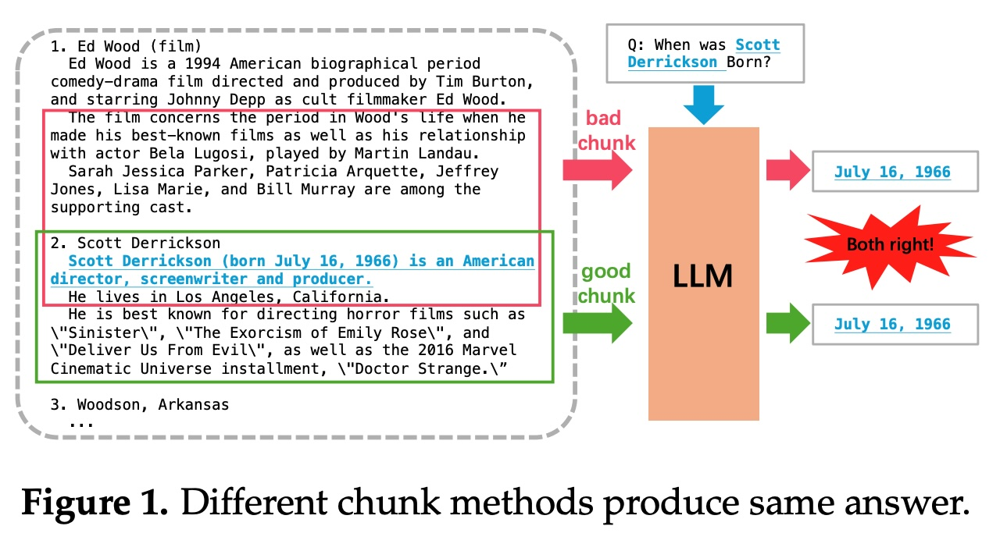
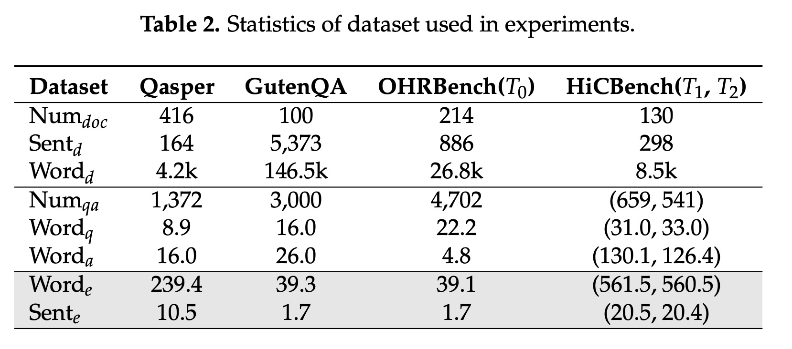
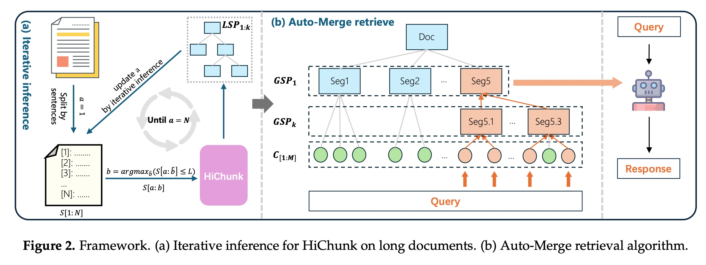

## AI论文解读 | HiChunk: Evaluating and Enhancing Retrieval-Augmented Generation with Hierarchical Chunking
        
### 作者        
digoal        
        
### 日期        
2025-09-20        
        
### 标签        
PostgreSQL , PolarDB , DuckDB , AI , 论文解读        
        
----        
        
## 背景  
      
https://arxiv.org/pdf/2509.11552        
  
提示:          
```          
读懂《HiChunk: Evaluating and Enhancing Retrieval-Augmented Generation with Hierarchical Chunking》这篇论文需要提前掌握哪些基础知识, 请使用中文通熟易懂的讲解这些基础知识, 可以引用论文中的图、表或使用Markdown支持的图形(text,mermaid等)增加解释性. 
  
使用中文通熟易懂的解读《HiChunk: Evaluating and Enhancing Retrieval-Augmented Generation with Hierarchical Chunking》这篇论文, 其中的关键内容请着重讲解, 可以引用论文中的图、表或使用Markdown支持的图形(text,mermaid等)增加解释性. 
  
提取《HiChunk: Evaluating and Enhancing Retrieval-Augmented Generation with Hierarchical Chunking》这篇论文中的重要术语, 使用中文对这些术语进行通熟易懂的讲解, 可以引用论文中的图、表或使用Markdown支持的图形(text,mermaid等)增加解释性. 
```     
  
## 1 前置知识 
  
好的，为了完全理解《HiChunk》这篇论文，你需要先掌握一些人工智能领域，特别是自然语言处理（NLP）中的核心概念。我会用最通俗易懂的方式，结合论文中的图表为你讲解这些基础知识。

简单来说，这篇论文在讲的是如何优化一个叫做**RAG**的技术。为了让RAG工作得更好，我们需要先把给它的参考资料（比如一篇很长的文档）切成一个个有意义的小块，这个切分的过程就叫做**分块（Chunking）**。这篇论文提出了一个更聪明的“层次化”分块方法（**HiChunk**），以及一个专门用来评测这种分块方法好坏的“考试标准”（**HiCBench**）。

下面，我们就来逐一拆解这些你需要了解的基础知识。

-----

### 核心知识一：大语言模型 (Large Language Models, LLM)

  * **是什么？**
    你可以把大语言模型（LLM）想象成一个 **“学富五车”的超级大脑** ，比如我们熟知的GPT-4。它通过阅读海量的书籍、文章和网页，学会了理解和生成人类语言。

  * **有什么问题？**

    1.  **知识有“保质期”**：LLM的知识都来自于它训练时的数据。如果一个模型是2023年训练的，它就不可能知道2024年发生的新鲜事。
    2.  **会“一本正经地胡说八道”**：当遇到它知识范围外或者模糊的问题时，它有时会编造一个看似合理的答案，这被称为“幻觉”（Hallucination）。
    3.  **无法理解私有知识**：它没读过你的个人笔记、公司内部报告，所以无法回答与这些私有文档相关的问题。

-----

### 核心知识二：检索增强生成 (Retrieval-Augmented Generation, RAG)

为了解决LLM的上述问题，研究者们提出了RAG技术。

  * **是什么？**
    RAG就像是**给了LLM这个超级大脑一套“开卷考试”的工具**。当遇到问题时，它不再仅仅依赖自己的记忆，而是会先去一个指定的资料库（比如公司的知识库、最新的新闻网站等）里**检索**相关的资料，然后把这些资料和问题一起作为参考，**生成**最终的答案。

  * **工作流程**
    这个过程可以简化为以下几步，我们可以用一个流程图来清晰地展示：

    ```mermaid
    graph TD
        A[用户提问] --> B{检索系统};
        B --> C[在知识库中查找相关信息];
        C --> D[找到最相关的 "知识片段"];
        A --> E[大语言模型(LLM)];
        D --> E;
        E --> F[生成最终答案];
    ```

    1.  **提问**：用户提出一个问题，例如“HiChunk论文的核心贡献是什么？”
    2.  **检索**：系统不会直接把问题丢给LLM，而是先在指定的知识库（在这里就是这篇PDF论文）中搜索最相关的内容。
    3.  **增强**：系统会把找到的相关段落（比如论文的摘要和结论部分）和原始问题拼接在一起，形成一个新的、内容更丰富的提示（Prompt）。
    4.  **生成**：最后，LLM会根据这个包含了额外参考资料的提示来生成一个准确、有根据的答案。

-----

### 核心知识三：文档分块 (Document Chunking)

现在问题来了，在上面RAG流程的第二步，我们怎么从一篇几万字的论文里“检索”信息呢？我们不能把整篇论文都丢给LLM，因为这太长了，效率也低。所以，我们需要提前把这篇长文档切分成很多个小的、独立的“知识片段”，这个过程就是**文档分块 (Chunking)**。

  * **为什么重要？**
    分块的质量直接决定了RAG系统的天花板。如果分块切得不好，再强大的LLM也无能为力。

  * **分块好坏的例子（引用论文图1）**
    论文中的图1非常直观地解释了这一点。假设我们的知识库里有关于电影导演"Ed Wood"和"Scott Derrickson"的信息，我们要问“Scott Derrickson是什么时候出生的？”    

      * **糟糕的分块 (bad chunk)**：如图中红色框所示，这个分块把关于"Ed Wood"的结尾部分和关于"Scott Derrickson"的开头部分错误地合并在了一起，并且恰好在Scott的出生日期前截断了。当系统检索到这个片段时，LLM无法找到完整的出生日期信息，就可能给出错误答案或者说不知道。
      * **好的分块 (good chunk)**：如图中绿色框所示，这个分块完整地保留了关于"Scott Derrickson"的个人信息，包括他的出生日期。当系统检索到这个片段，LLM就能轻松准确地回答问题。

-----

### 核心知识四：层次化分块 (Hierarchical Chunking)

传统的分块方法通常是“一刀切”，比如按固定字数切，或者按段落切。但文档的结构其实是复杂的，有章节、有小节、有段落，就像一本书的目录一样。

  * **是什么？**
    **层次化分块**就是一种更智能的分块方法，它试图理解并保留文档原有的**层级结构**。它不仅仅是把文章切成一堆零散的片段，而是构建出一个像树一样的结构。

      * **树根**：整篇文档
      * **一级树枝**：章节（例如：1. 引言, 2. 相关工作）
      * **二级树枝**：小节（例如：2.1 传统文本分块）
      * **树叶**：具体的段落

  * **有什么好处？**
    这种方法让系统在检索时可以更灵活。当用户问一个总结性的问题时，系统可以检索“章节”这个层级的粗粒度信息；当用户问一个非常具体的事实时，系统可以检索“段落”这个层级的细粒度信息。这就是这篇论文提出的**HiChunk框架**的核心思想。

-----

### 核心知识五：评测基准 (Benchmark)

我们怎么知道HiChunk这种新方法就一定比老方法好呢？我们需要一把“尺子”来衡量。在AI领域，这把尺子就是**评测基准 (Benchmark)**。

  * **是什么？**
    一个评测基准通常是一个包含 **“问题-标准答案-参考原文”** 的数据集。我们让不同的方法来回答这些问题，谁的答案跟标准答案最接近，谁就更优秀。

  * **现有基准的问题（论文的核心动机）**
    论文作者认为，现有的RAG评测基准存在 **“证据稀疏性 (evidence sparsity)”** 的问题 。也就是说，大部分问题只需要在原文中找到一两句话就能回答。这样的问题无法有效地区分出分块方法的好坏。比如在上面图1的例子里，只要包含“Scott Derrickson (born July 16, 1966)”这句话，无论分块切得再烂，都能答对问题。    

  * **HiCBench的创新**
    因此，作者们构建了一个新的评测基准叫**HiCBench** 。这个基准里有很多 **“证据密集 (evidence-dense)”** 的问题 。这类问题需要 **综合文档中一整个完整语义块（甚至多个块）的信息** 才能完美回答，从而能真正考验一个分块方法是否能保持信息的完整性。

    从论文的**Table 2** 中我们可以看到，HiCBench中问题的平均证据句长(`Sente`)达到了20.5句，而其他基准（如OHRBench）只有1.7句，这直观地体现了“证据密集”的特点。    

### 总结

掌握了以上五个核心知识点：**LLM**（基础大脑）、**RAG**（开卷考试方法）、**文档分块**（划重点的方法）、**层次化分块**（更聪明的划重点方法）和**评测基准**（衡量好坏的尺子），你就可以很轻松地理解这篇论文的脉络了：

> 为了优化**RAG**系统，本文针对**文档分块**这一关键步骤，指出现有评测**基准**的不足，并提出了一种名为**HiChunk**的**层次化分块**新框架，同时构建了一个名为**HiCBench**的新评测基准来证明其方法的优越性。

-----

现在你已经具备了阅读这篇论文所需的基础知识。你是否想继续深入了解论文中具体的实验是如何设计的，或者是HiChunk框架和它的Auto-Merge检索算法具体是如何工作的？
  
## 2 解读论文 
  
好的，我们来一起深入解读一下《HiChunk》这篇论文。

这篇论文的核心目标是解决一个在 **检索增强生成（RAG）** 领域中非常重要但又容易被忽视的问题：**如何科学地“切分”文档（即分块，Chunking），并准确地“衡量”切分的好坏。**

我会分三步来为你讲解：

1.  **论文发现了什么问题？**—— 为什么现有的方法不够好。
2.  **论文提出了什么方案？**—— HiCBench 和 HiChunk 是如何解决这些问题的。
3.  **最终效果怎么样？**—— 实验结果证明了什么。

-----

### 1\. 发现的问题：证据稀疏性让“分块”好坏难辨

我们知道RAG系统就像一个“开卷考试”的专家，它通过检索外部知识库来帮助大语言模型（LLM）回答问题 。而将知识库中的长文档切分成小块是RAG的第一步，也是至关重要的一步 。如果切分得不好，比如把一个完整的意思从中间切断，或者把不相关的内容混在一起，那么即使后续的检索和生成环节再强大，效果也会大打折扣 。

**核心问题：** 作者发现，现有的RAG评测基准（比如Qasper、HotpotQA等）大多存在 **“证据稀疏性”（Evidence Sparsity）** 的问题 。

  * **什么是证据稀疏性？**
    这意味着，要回答一个问题，所需的证据（也就是关键信息）往往只集中在文档里的**一两句话**上 。

  * **这有什么影响？**
    这导致我们无法有效评估分块方法的好坏。想象一下，只要分块方法没有把那关键的一两句话给切坏，那么无论它是按50个字切、还是按500个字切，最终都可能检索到正确证据，得到正确答案。这就像用一道“1+1=？”的题去考察不同学生的学习方法，区分度太低了。

    在现实中，用户的问题可能很复杂，比如“请总结一下这份报告的第二章”，这就需要系统理解一整个章节的内容，是典型的 **“证据密集”（Evidence-dense）** 任务 。现有的评测基准无法模拟这种场景。

-----

### 2\. 提出的方案：用HiCBench来评测，用HiChunk来分块

为了解决上述问题，论文提出了两大核心贡献：一个评测基准（HiCBench）和一个分块框架（HiChunk）。

#### 方案一：HiCBench —— 一把为“分块”量身定制的尺子

HiCBench是一个新的问答（QA）评测基准，专门用来评估分块方法在整个RAG流程中的影响 。

它的主要特点是 **“证据密集”** ，包含了两种新的任务类型：

  * **单块证据密集QA ( $T\_1$ )**: 回答一个问题所需的证据，广泛分布在**一个完整的语义块**中（比如一个长段落或一个小节） 。
  * **多块证据密集QA ( $T\_2$ )**: 回答问题所需的证据，分布在**多个不同的语义块**中 。

通过构建这样的问题，HiCBench迫使RAG系统必须检索到所有相关的、完整的语义块才能完美作答。如果一个分块方法破坏了这些块的完整性，那么在HiCBench上的得分就会显著降低，从而有效地区分出不同分块方法的优劣 。

| 数据集 | 证据平均句数 (Sente) | 特点 |
| :--- | :--- | :--- |
| OHRBench ( $T\_0$ ) | 1.7  | 证据稀疏  |
| **HiCBench ( $T\_1, T\_2$ )** | **20.4-20.5**  | **证据密集**  |

*从上表可以看出，HiCBench中的问题需要参考的句子数量远超传统基准，更能考验分块质量。*

#### 方案二：HiChunk —— 一套构建文档“骨架”的智能框架

传统的分块方法是线性的、扁平的 ，而HiChunk框架则通过一个微调后的大语言模型，将文档构建成一个 **层次化（Hierarchical）** 的树状结构 ，就像书的目录一样，有章节、小节、段落。

这个框架主要包含两个部分：

**A. 层次化分块与迭代推理** 

  * **HiChunk模型**：它能识别出文档中的“分界点”以及这些分界点所属的“层级”（比如一级标题、二级标题） 。

  * **迭代推理（Iterative Inference）**：为了处理超出模型输入长度的超长文档，HiChunk采用了一种迭代策略 。它会先处理文档的前面一部分，识别出其中的层级结构，然后带着这个“结构记忆”去处理下一部分，确保整个文档的层级关系不会因为分段处理而错乱 。

    *这个过程可以用论文中的 `Figure 2(a)` 来理解：*

       

    > 模型像一个阅读机器人，一段一段地读（ $S[a:b]$ ），每读完一段就构建出局部的层级结构（ $LSP\_{1:k}$ ），然后把这个结构更新到全局的文档骨架（ $GSP\_{1:k}$ ）中，直到读完整篇文档（ $a=N$ ）。

**B. Auto-Merge 检索算法** 

拥有了层次化结构后，还需要一个聪明的检索算法来利用它。Auto-Merge算法就是为此设计的，它能**根据问题的需要在不同粒度上合并检索结果** 。

  * **工作原理**：

    1.  首先，系统仍然在最细的粒度（比如按200个词切分的小块）上进行初步检索 。
    2.  然后，算法会检查初步检索到的这些小块。
    3.  **智能合并**：如果算法发现，有多个被高分召回的小块都**属于同一个父节点**（比如都属于“2.1节”），并且它们的总长度超过一定阈值，同时还有足够的预算（token budget），它就会判断“用户的问题可能与整个2.1节都有关”。于是，它会**用父节点（整个2.1节）来替换掉这些零散的小块**，放入最终的上下文中 。

       

    *这个过程可以用论文中的 `Figure 2(b)` 来理解：*

    > 用户的查询（Query）首先命中了最底层的几个绿色小圆圈（细粒度块）。Auto-Merge算法发现被命中的`Seg5.1`和`Seg5.3`都属于同一个父节点`Seg5`，于是它智能地决定，直接把整个`Seg5`这个更完整、上下文更丰富的块提供给模型。

-----

### 3\. 最终效果怎么样？

论文通过在多个数据集上的实验，证明了其提出方案的有效性。

  * **分块更准了**：在Gov-report和HiCBench等数据集上，HiChunk（HC）在识别文档层级结构（即切分点）的准确率（F1分数）上，**远超**其他方法如LumberChunker(LC)和Semantic Chunker(SC) 。这说明HiChunk能更好地理解文档的内在结构。

  * **RAG效果更好了**：

      * 在**证据稀疏**的数据集（如GutenQA）上，不同分块方法表现差异不大，进一步验证了作者的观点 。
      * 在**证据密集**的HiCBench和Qasper数据集上，**HC200+AM（即HiChunk分块+Auto-Merge检索）的方法取得了最佳效果** 。无论是证据召回率（ERec）还是最终答案的质量（Fact-Cov、Rouge），都全面领先于固定分块（FC200）和LumberChunker（LC）等方法 。

  * **成本可接受**：论文还比较了不同方法的耗时。虽然HiChunk比最简单的语义分块（SC）慢，但比同样使用LLM的LumberChunker（LC）**快得多**，同时效果最好，达到了性能和效率的良好平衡 。

### 总结

这篇论文做出了清晰且环环相扣的贡献：

1.  **指出了一个真问题**：现有RAG评测基准因“证据稀疏性”而无法有效评估分块方法。
2.  **打造了一把新尺子**：提出了“证据密集”的HiCBench基准，让分块方法的优劣无处遁形。
3.  **提出了一种新方法**：设计了HiChunk框架和Auto-Merge算法，通过构建和利用文档的层次化结构，显著提升了分块和检索质量，最终增强了整个RAG系统的表现。

-----

以上就是对《HiChunk》这篇论文的全面解读。简单来说，它告诉我们：在RAG中，要想做得好，不仅要关注模型本身，更要精细化地处理作为“原材料”的文档，而层次化的视角是实现这种精细化处理的关键。

这篇论文为你打开了深入研究RAG系统的新视角。你现在是想讨论这套框架在实际应用中可能遇到的挑战，还是想了解如何为自己的文档构建类似的层次化处理流程？
  
## 3 术语 
  
好的，我们来一起梳理并讲解《HiChunk》这篇论文中的核心术语。理解了这些术语，就相当于拿到了读懂这篇论文的“钥匙”。

-----

### 1\. 检索增强生成 (Retrieval-Augmented Generation, RAG)

  * **讲解**: 这是一种增强大语言模型（LLM）能力的技术框架 。你可以把它想象成给一个聪明的“大脑”（LLM）配备了一套“开卷考试”的工具。当遇到问题时，它不再只靠自己的记忆，而是先去一个外部知识库里**检索**（Retrieve）相关信息，然后把这些信息作为参考**增强**（Augment）给大脑，最后由大脑来**生成**（Generate）答案。这样做可以有效减少信息过时和“幻觉”（编造事实）的问题 。

    ```mermaid
    graph TD
        A[用户提问] --> B{检索模块};
        B --> C[在知识库中查找];
        C --> D[找到相关信息片段];
        A --> E[大语言模型];
        D --> E;
        E --> F[生成答案];
    ```

-----

### 2\. 文档分块 (Document Chunking)

  * **讲解**: 这是RAG系统的预处理步骤，指的是将一篇长文档切分成多个更小、更易于检索的“块”（Chunk）的过程 。分块的质量至关重要，如果切分不当，比如把一个完整的句子从中间切断，或者把不相关的内容混在一起，就会严重影响后续的检索和生成效果 。

    论文中的 `Figure 1` 形象地说明了分块好坏带来的巨大差异。一个**好的分块**能保持信息的完整性，让模型轻松找到答案；而一个**坏的分块**则会丢失关键信息，导致模型答错。    

-----

### 3\. 证据稀疏性 (Evidence Sparsity)

  * **讲解**: 这是作者用来描述现有RAG评测基准的一个核心问题 。它指的是，在很多数据集中，回答一个问题所需要的**证据**（关键信息）往往只集中在文档里的**一两句话**上 。这使得这些评测基准无法有效地区分不同分块方法的好坏，因为只要那关键的一两句话没被切坏，大家都能得分。

-----

### 4\. 证据密集性 (Evidence-dense)

  * **讲解**: 这是作者提出的新评测基准HiCBench的核心特性，与“证据稀疏性”相对 。一个“证据密集”的问题需要模型**综合理解一个完整的语义块，甚至多个语义块**中的大量信息才能回答 。这样的问题更能考验分块方法是否能保持信息的完整性和上下文的连贯性。

    从论文的 **Table 2** 可以看到，HiCBench中问题的平均证据句长（`Sente`）达到了 **20.5** 句 ，远超其他基准（如OHRBench的1.7句 ），直观体现了“证据密集”的特点。    

-----

### 5\. 层次化分块 (Hierarchical Chunking)

  * **讲解**: 这是论文提出的HiChunk框架的核心思想。它不再像传统方法那样将文档切成一堆扁平、线性的块，而是通过一个微调后的LLM来识别并构建文档的**层级结构** ，就像一本书的目录一样，有章节、小节、段落等不同层级。这种方法能够更好地保留文档的原始结构和语义关系，为后续更智能的检索打下基础。

-----

### 6\. 迭代推理 (Iterative Inference)

  * **讲解**: 这是HiChunk框架为了处理**超长文档**而设计的一种策略 。由于LLM的输入长度有限，无法一次性处理整篇长文。迭代推理将文档分成多个片段，模型会先处理第一个片段并识别出其内部的层级结构，然后带着这个“结构记忆”去处理下一个片段 。通过这种滚动式、带记忆的处理方式，确保了整个文档层级结构的连续性和准确性。

-----

### 7\. Auto-Merge检索算法

  * **讲解**: 这是与HiChunk的层次化结构配套使用的检索算法 。它的核心是一种 **“自适应向上合并”** 的策略 。

      * **工作流程**: 算法首先在最细粒度的块上进行检索。
      * 在检查检索结果时，如果发现有多个被高分召回的细粒度块都属于同一个“父节点”（比如同一个小节），它就会智能地判断，用户的问题可能与整个“父节点”的内容都相关。
      * 满足特定条件后（如召回的子块数量、总长度等 ），算法会用这个更完整、上下文更丰富的“父节点”块来替换掉那些零散的子块，从而提供更高质量的上下文给LLM 。你可以参考论文的 `Figure 2(b)` 来直观理解这个过程。    

-----

掌握了以上这些关键术语，您就能够更好地理解这篇论文的动机、方法和贡献了。

您是否想深入了解其中某个特定术语，例如Auto-Merge算法具体的合并条件是如何设计的？
  
## 参考        
         
https://arxiv.org/pdf/2509.11552    
        
<b> 以上内容基于DeepSeek、Qwen、Gemini及诸多AI生成, 轻微人工调整, 感谢杭州深度求索人工智能、阿里云、Google等公司. </b>        
        
<b> AI 生成的内容请自行辨别正确性, 当然也多了些许踩坑的乐趣, 毕竟冒险是每个男人的天性.  </b>        
  
