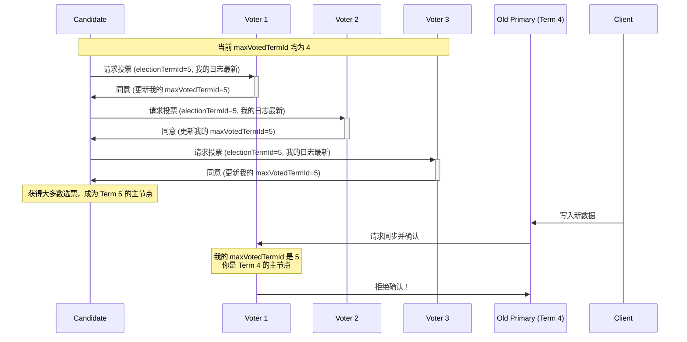

## AI论文解读 | Ark: A Real-World Consensus Implementation
        
### 作者        
digoal        
        
### 日期        
2025-09-22       
        
### 标签        
PostgreSQL , PolarDB , DuckDB , AI , 论文解读        
        
----        
        
## 背景  
      
https://arxiv.org/pdf/1407.4765        
  
提示:          
```          
读懂《Ark: A Real-World Consensus Implementation》这篇论文需要提前掌握哪些基础知识, 请使用中文通熟易懂的讲解这些基础知识, 可以引用论文中的图、表或使用Markdown支持的图形(text,mermaid等)增加解释性. 
  
使用中文通熟易懂的解读《Ark: A Real-World Consensus Implementation》这篇论文, 其中的关键内容请着重讲解, 可以引用论文中的图、表或使用Markdown支持的图形(text,mermaid等)增加解释性. 
  
提取《Ark: A Real-World Consensus Implementation》这篇论文中的重要术语, 使用中文对这些术语进行通熟易懂的讲解, 可以引用论文中的图、表或使用Markdown支持的图形(text,mermaid等)增加解释性. 
```     
  
## 1 前置知识 
  
为了读懂《Ark: A Real-World Consensus Implementation》这篇论文，你需要了解一些关于分布式系统、数据库复制和共识算法的基础知识。下面我将用通俗易懂的中文为你讲解这些核心概念。

### 1. 分布式系统与复制 (Replication)

这篇论文的核心是解决数据库在分布式环境下的数据一致性问题。想象一下，你有一个数据库，但为了提高可用性和容错能力，你在多台机器上保存了它的多个副本（replicas）。这就是**数据复制**。论文里提到，MongoDB就是一种内置了复制功能的数据库 。

数据复制有两种常见的模式:

* **主/从复制 (Leader/Follower Replication)**：这是Ark和MongoDB采用的模式 。在这种模式下，一个副本被指定为**主节点（primary 或 leader）**，它是唯一接受客户端写操作的节点 。其他副本都是**从节点（secondary 或 follower）**，它们的工作就是从主节点同步数据，以保持与主节点的数据一致 。
* **多主复制 (Multi-Master Replication)**：在这种模式下，多个节点都可以接受写操作，但处理起来更复杂，因为需要解决不同节点同时写入相同数据时的冲突。这篇论文没有详细讨论这种模式。

### 2. 共识算法 (Consensus Algorithm)

共识算法是让分布式系统中的多个节点对某个值（例如，哪个节点是主节点，或者某个写操作是否成功）达成一致的协议。

论文中提到了两个著名的共识算法：

* **Paxos**：由Leslie Lamport提出的一个非常著名的共识算法 。它以其严谨和复杂性著称，被认为是很难理解和实现的 。
* **Raft**：为了解决Paxos的复杂性而设计，Raft的目标是“可理解的共识算法” 。Ark的设计深受Raft的影响，并与其有许多相似之处 。

### 3. CAP 定理 (CAP Theorem)

CAP 定理是分布式系统领域一个非常重要的理论。它指出一个分布式系统最多只能同时满足以下三个特性中的两个:

* **一致性（Consistency）**：所有节点在同一时间看到相同的数据。在论文中，"majority" Write Concern就是为了提供这种一致性 。
* **可用性（Availability）**：即使有部分节点失效，系统仍然能够响应请求。
* **分区容错性（Partition Tolerance）**：即使网络发生故障，导致系统被分割成多个不相连的部分（网络分区），系统仍然能够继续运行。

MongoDB 在某些情况下会因为网络分区而导致数据丢失，这说明它在分区容错和一致性之间做出了妥协 。Ark通过改进选举协议，旨在确保在发生网络分区时，使用 "majority" Write Concern 的客户端仍能获得一致性保障，使其成为一个更强的“CP”系统（即满足一致性和分区容错性） 。

### 4. MongoDB 的核心概念

论文详细描述了MongoDB的复制机制，你需要理解以下几个关键术语：

* **oplog (操作日志)**：主节点（primary）将所有客户端的写操作都记录在一个名为 "oplog" 的日志中 。这是一个严格有序的操作序列，类似于其他数据库的二进制日志（binary log） 。从节点（secondary）就是通过复制主节点的oplog来同步数据的 。
* **心跳 (Heartbeats)**：副本集中的所有节点会定期（论文中提到是每两秒）互相发送心跳信息 。这些心跳会携带节点当前的状态，例如它最新的oplog位置，以及它是否存活 。如果一个节点长时间没有收到主节点的心跳，它就会认为主节点可能已经离线，并触发**故障转移**（failover） 。
* **Write Concern (写入关注)**：这是一个客户端API，允许用户指定一个写操作需要多少个副本确认后才算成功 。
    * **"unacknowledged"**：最不安全的选项，主节点收到写操作后立即返回，不等待任何副本的确认 。
    * **"majority"**：一个写操作必须被副本集中的大多数（超过一半）成员确认后才算成功 。论文指出，这是Ark论文中最关心的用例，因为它是保证数据一致性的关键 。

### 5. MongoDB/TokuMX 的问题

论文在第三节详细列举了MongoDB复制算法的三个主要问题，理解这些问题是理解Ark改进方案的基础:

1.  **数据丢失 (Data Loss)**：这是最严重的问题 。即使一个写操作被“大多数”副本确认，也可能在故障转移后被回滚，导致数据丢失 。这违背了 "majority" Write Concern 的承诺 。
2.  **多主节点问题 (Multiple Primaries)**：当网络分区发生时，可能会同时出现两个或更多的合法主节点 。当前的协议不能以一种可预测的方式解决这个问题，可能会导致不确定的行为 。
3.  **选举耗时 (Long Failover Times)**：MongoDB的协议中有一个30秒的限制，即一个副本在30秒内只能投票支持一个权威性选举 。如果一个选举失败，系统可能需要等待很长时间才能尝试下一次选举，导致服务长时间不可用 。

通过理解这些基础概念和现有问题，你将能更好地理解Ark如何引入新的机制（例如 `electionTermId` 和 `maxVotedTermId`）来解决这些挑战，并提供一个更健壮、更可预测的共识实现。

---

我希望这些信息能帮助你更好地理解这篇论文。为了更深入地讨论，你最感兴趣的是哪个部分？是Ark如何解决“数据丢失”的问题，还是它与Raft算法的异同，或者你对某个具体术语还有疑问？
  
## 2 解读论文 
  
好的，我们来通俗易懂地解读一下《Ark: A Real-World Consensus Implementation》这篇论文。

简单来说，这篇论文介绍了一种名为 **Ark** 的新共识算法。它的诞生是为了修复老版本 MongoDB 复制功能中一个可能导致**数据丢失**的严重缺陷，并提升系统故障切换的效率和确定性。Ark 的设计很大程度上受到了当时较新的 **Raft** 算法的启发，并巧妙地将其核心思想融入了 MongoDB 现有的复制架构中。

-----

### 背景：MongoDB曾经的“数据安全”危机

要理解 Ark 为何如此重要，我们必须先了解它要解决的问题。在老版本的 MongoDB 中，数据的复制和选举（当主节点挂了，需要选个新主节点）是两个相对独立的过程，这种设计上的解耦导致了几个严重问题 ：

#### 1. 核心问题：收到“大多数节点确认”的数据，居然还会丢失！ 

这是最致命的问题。想象一个场景：

1.  一个集群有5个节点（A, B, C, D, E），A 是主节点 (Primary)。
2.  突然发生网络分区，A 被单独隔离，但它自己还不知道，仍然认为自己是主节点。
3.  另外四个节点 B, C, D, E 互相通信，发现联系不上 A，于是它们发起选举，投票选出了 B 作为新的主节点。
4.  此时，客户端向 A 写入了一条**非常重要**的数据。A 把数据同步给了 C 和 D（它们可能还没来得及完全切换到从 B 同步数据），加上 A 自己，凑够了3个节点（即“大多数”），于是客户端收到了“写入成功”的确认。
5.  不久后，网络恢复。A 发现集群里已经有了新主节点 B，于是 A “下台”，并开始从 B 同步数据。
6.  **灾难发生**：因为新的主节点 B 根本没有那条“非常重要”的数据，所以当 A 从 B 同步时，它会**撤销（Rollback）** 掉那条刚刚写入的数据 。

这意味着，即使应用程序收到了“数据已在大多数节点上安然无恙”的保证，这条数据最终还是消失了。这对于数据库来说是不可接受的。

#### 2. “双主”冲突：脑裂后谁说了算？一笔糊涂账 

在上面的场景中，网络恢复后，集群中会短暂出现 A 和 B 两个主节点。当它们通过心跳发现彼此时，旧的机制是让它们都“下台”，然后重新选举 。这种处理方式有两个毛病：

  * **不确定性**：到底谁的数据应该保留？这个决策是任意的，使得系统的未来状态不可预测 。
  * **依赖网络**：如果网络分区很诡异，两个主节点可能很长时间都发现不了对方，导致问题持续存在 。

#### 3. 故障恢复慢：一个“30秒冷静期” 

MongoDB 的旧选举协议规定，一个节点在30秒内只能投一次赞成票 。这个设计的初衷可能是为了防止因时钟不同步导致选举过于频繁，从而引发日志顺序错乱 。但副作用是，如果一次选举因为网络等原因失败了，所有投过票的节点必须等30秒才能参与下一次选举，这大大延长了集群的不可服务时间 。

-----

### Ark 的核心设计：引入“任期”概念，统一行动纲领

Ark 的解决方案可以总结为一句话：**用一个严格递增的“任期号”(Term) 来统一选举和数据写入，确保所有节点对“谁是当前合法的领导者”达成共识。**

#### 1\. GTID：给每一条操作日志打上“任期”烙印

Ark 改进了 TokuMX（一个 MongoDB 的分支）中的日志ID，即 GTID (Global Transaction ID)。它不再是简单的时间戳，而是一个包含两个部分的组合：`(term, opid)` 。

  * **`term` (任期号)**：每当一次新的选举成功，这个 `term` 就会加一。新当选的主节点在任期内产生的所有操作日志，都会带上这个新的、更大的 `term` 号 。
  * **`opid` (操作号)**：在一个任期内，每产生一个操作，`opid` 就递增 。

这样一来，任何一条操作日志都能清楚地表明它是在“第几届领导班子”的任期内产生的。

#### 2\. `maxVotedTermId`：每个节点的“投票记忆”

Ark 为每个节点引入了一个至关重要的本地持久化状态：`maxVotedTermId` 。它记录了该节点**投过赞成票的最高任期号**。这个值只会增加，不会减少。

#### 3\. 新的选举与确认规则

基于 `term` 和 `maxVotedTermId`，Ark 制定了新的铁律：

  * **投票规则**：

    1.  **拒绝旧的选举**：当一个节点（投票者）收到一个选举请求，如果请求中的 `electionTermId` 小于或等于它自己的 `maxVotedTermId`，它会直接投反对票 。这保证了每个节点在同一个任期内只会支持一个候选人。
    2.  **数据最新者优先**：如果候选人的数据日志比投票者的还要旧，投票者会投**否决票 (veto)** 。这确保了拥有最新数据的节点更有可能当选，这是避免数据丢失的关键（Raft 中称为 Leader Completeness）。

  * **数据确认规则**：

      * **拒绝承认过时主节点的数据**：一旦一个节点为 `term = 5` 的选举投了赞成票（并更新了 `maxVotedTermId = 5`），它就**绝对不会**再向客户端确认任何来自 `term = 4` 的老主节点的数据 。

下面用一个 Mermaid 图来展示 Ark 的选举流程：



-----

### Ark 如何解决老问题？

现在我们回头看，Ark 是如何用这些新设计解决之前的危机的：

1.  **数据不丢失了**：

      * 因为有了“数据最新者优先”的投票规则，任何一个成功当选的新主节点，都必然包含了所有之前被“大多数”节点确认过的数据 。
      * 因为有了“拒绝承认过时主节点”的确认规则，即使老主节点在被隔离后仍在工作，它也无法再获得“大多数”节点的写入确认，从而从根本上阻止了客户端收到错误的成功保证 。

2.  **“双主”冲突解决了**：

      * 冲突不再是任意的。当两个主节点相遇，`term` 号大的那个是合法主节点，`term` 号小的必须下台 。所有节点都会通过心跳传播已知的最高 `term` 号，确保过时的主节点能尽快意识到自己需要“退位” 。

3.  **故障恢复更快了**：

      * 因为 `term` 机制能够清晰、确定性地处理并发选举和冲突，那个“30秒冷静期”就不再需要了，可以直接移除，从而大大缩短了故障切换时间 。

-----

### Ark 与 Raft 的关系

论文明确指出，Ark 的设计深受 Raft 算法的启发 ，并实现了 Raft 的核心安全属性，如“选举安全”（一个任期最多一个领导者）和“领导者完整性”（新领导者必须包含所有已提交的日志） 。

但 Ark 并非 Raft 的简单复制，它根据 MongoDB 的实际情况做了重要调整：

  * **Raft 是推模式 (Push-based)**：领导者主动将日志推送给跟随者。
  * **Ark 是拉模式 (Pull-based)**：跟随者（Secondaries）主动从一个源头（可以是主节点，也可以是其他更新的从节点）拉取数据 。

这种“拉模式”的异步架构使得 Ark（以及 MongoDB）能够更灵活地支持不同的复制拓扑（如链式复制）和多样化的写入安全级别（从最快但不安全的“不确认写入”到最安全的“大多数确认写入”），让开发者可以根据业务需求在安全性和延迟之间做权衡 。

总而言之，Ark 是一次非常成功的工程实践，它将 Raft 算法的理论精髓与一个成熟的、现实世界中的数据库系统（MongoDB）的架构特点相结合，解决了真实存在的数据安全隐患，体现了理论指导实践的巨大价值。

-----

Ark 的设计和实现对后续许多分布式数据库和系统的共识协议都产生了积极的影响。希望这个解读能帮助你更好地理解这篇重要的论文。

对于论文中提到的选举冲突、日志匹配等更具体的细节，你最感兴趣的是哪一部分呢？我们可以继续深入探讨。
  
## 3 术语 
  
您好，我已为您提取了《Ark: A Real-World Consensus Implementation》这篇论文中的重要术语，并用通俗易懂的中文进行了讲解。

### 核心术语

* **副本集 (Replica Set)**：由多台机器组成的集群，它们共同存储相同的数据，以实现数据复制和高可用性。一个副本集包含一个主节点和若干从节点 。

* **主节点（Primary / Leader）**：副本集中唯一能接受客户端写操作的节点 。主节点负责将所有写操作写入其操作日志 (oplog)。

* **从节点（Secondary / Follower）**：副本集中除了主节点以外的所有节点。它们的工作是从主节点（或任何其他位置超前的副本）拉取操作日志，并将其应用到自己的数据副本上，以保持数据同步 。

* **操作日志 (Oplog)**：这是一个严格有序的操作序列，记录了主节点上发生的所有客户端更新。从节点通过复制和应用这些日志条目来同步数据 。论文指出，在 TokuMX 中，oplog 条目使用 GTID 进行排序，而在 MongoDB 中则使用 OpTime 。

* **GTID (Global Transaction ID)**：用于标识和排序 oplog 条目的数据类型。它由一个**term**（任期）和一个**opid**（操作 ID）组成，格式为 `(term, opid)` 。当选出新主节点时，term 会递增，opid 会重置为0 。GTID 的引入是 Ark 改进 MongoDB 选举协议的关键。

* **Write Concern (写入关注)**：MongoDB 提供的一种 API，允许客户端控制一个写操作需要多少个副本确认后才算成功 。论文中重点关注的是 **"majority" (多数)** 写入关注，它要求一个写操作必须被超过半数的副本确认后才能成功返回 。Ark 的主要目标就是确保使用“多数”写入关注的更新不会被回滚 。

* **选举 (Election)**：当主节点失效或无法访问时，从节点通过一个过程来选择一个新的主节点 。选举需要获得多数副本的“是”投票才能成功 。

* **回滚 (Rollback)**：当一个节点重新连接到副本集时，如果它发现自己的 oplog 中包含了其他节点未曾见过的操作，它会“回滚”这些操作，使其 oplog 与主节点的 oplog 保持一致 。论文指出，MongoDB 可能会错误地回滚那些已经获得“多数”写入关注的更新，这是其主要缺陷之一 。

### Ark 新引入的术语

* **electionTermId (选举任期 ID)**：每个权威性选举都有一个唯一的、严格单调递增的 ID 。当一个候选人发起权威性选举时，它会基于所有副本已知任期 ID 的最大值来确定一个新的 `electionTermId` 。

* **maxVotedTermId (最大投票任期 ID)**：每个副本都维护一个本地值，记录它曾投票“是”的最高 `electionTermId` 。这个值被持久化到磁盘，即使副本崩溃或重启也能保留 。它被用来决定副本可以确认哪些更新，以及可以参与哪些选举 。

* **maxKnownTermId (最大已知任期 ID)**：副本所知的最高 `electionTermId` 。这个值通过心跳在副本间传播，旨在加速新选举任期信息的同步，从而更快地使旧主节点下台 。

---

您对这些术语的解释清楚吗？如果您想深入了解 Ark 的特定改进点，比如它如何利用这些新术语来解决 MongoDB 的数据丢失问题，我很乐意为您进一步解释。
  
## 参考        
         
https://arxiv.org/pdf/1407.4765    
        
<b> 以上内容基于DeepSeek、Qwen、Gemini及诸多AI生成, 轻微人工调整, 感谢杭州深度求索人工智能、阿里云、Google等公司. </b>        
        
<b> AI 生成的内容请自行辨别正确性, 当然也多了些许踩坑的乐趣, 毕竟冒险是每个男人的天性.  </b>        
    
#### [期望 PostgreSQL|开源PolarDB 增加什么功能?](https://github.com/digoal/blog/issues/76 "269ac3d1c492e938c0191101c7238216")
  
  
#### [PolarDB 开源数据库](https://openpolardb.com/home "57258f76c37864c6e6d23383d05714ea")
  
  
#### [PolarDB 学习图谱](https://www.aliyun.com/database/openpolardb/activity "8642f60e04ed0c814bf9cb9677976bd4")
  
  
#### [PostgreSQL 解决方案集合](../201706/20170601_02.md "40cff096e9ed7122c512b35d8561d9c8")
  
  
#### [德哥 / digoal's Github - 公益是一辈子的事.](https://github.com/digoal/blog/blob/master/README.md "22709685feb7cab07d30f30387f0a9ae")
  
  
#### [About 德哥](https://github.com/digoal/blog/blob/master/me/readme.md "a37735981e7704886ffd590565582dd0")
  
  

  
