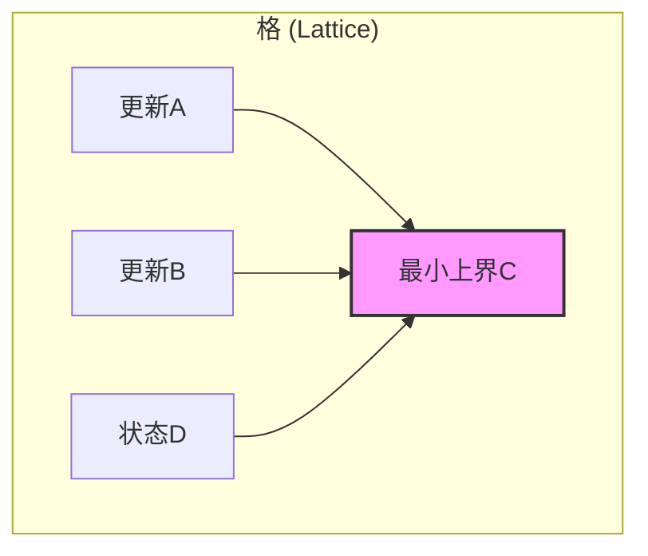
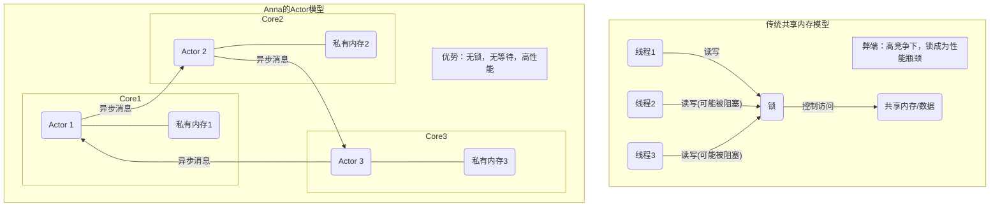
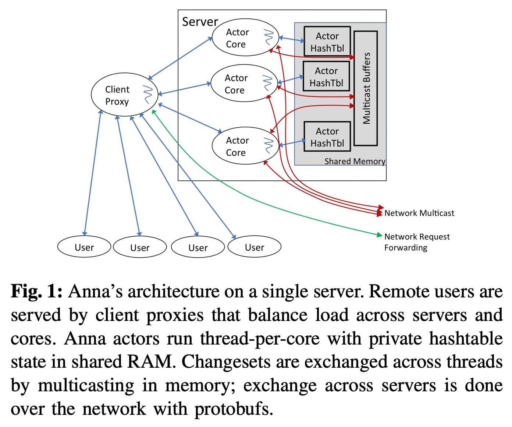
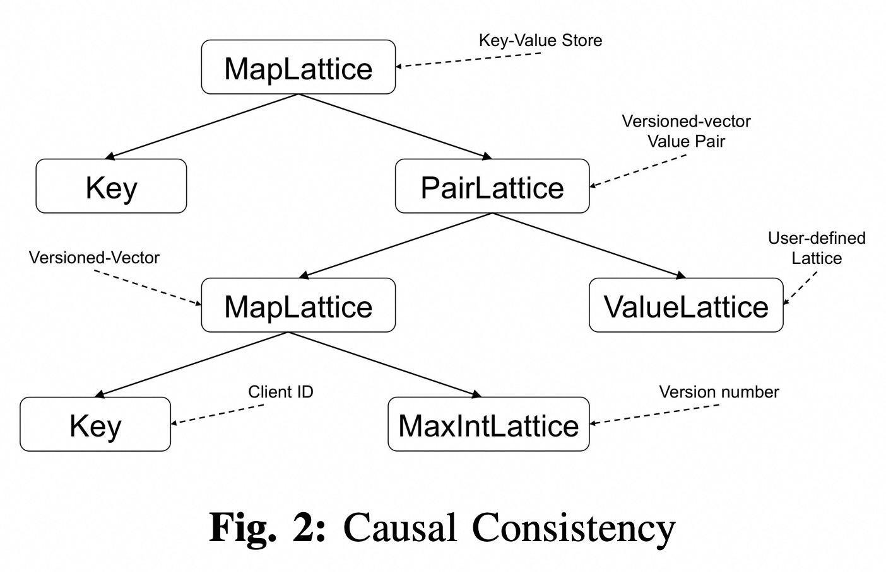
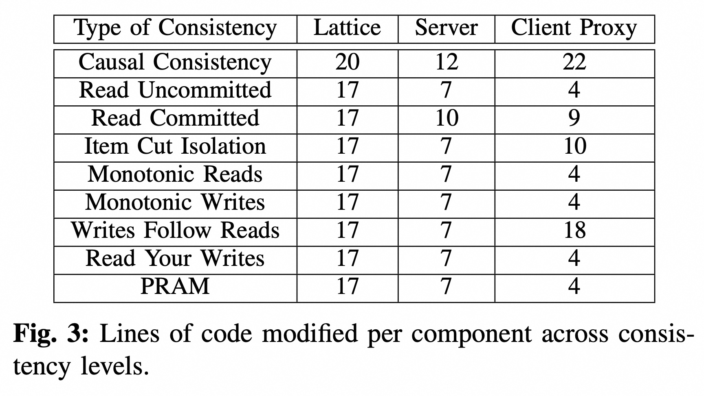
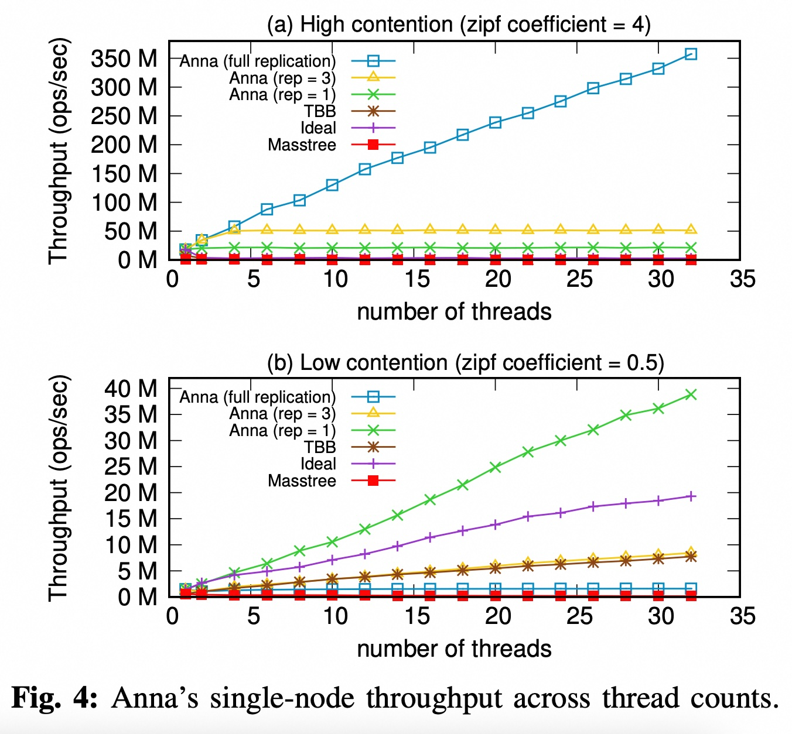
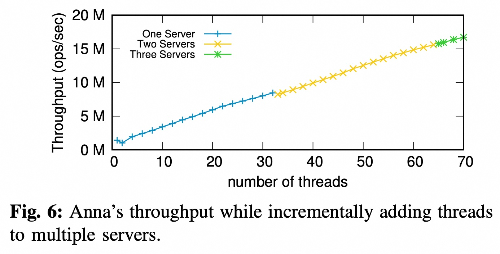
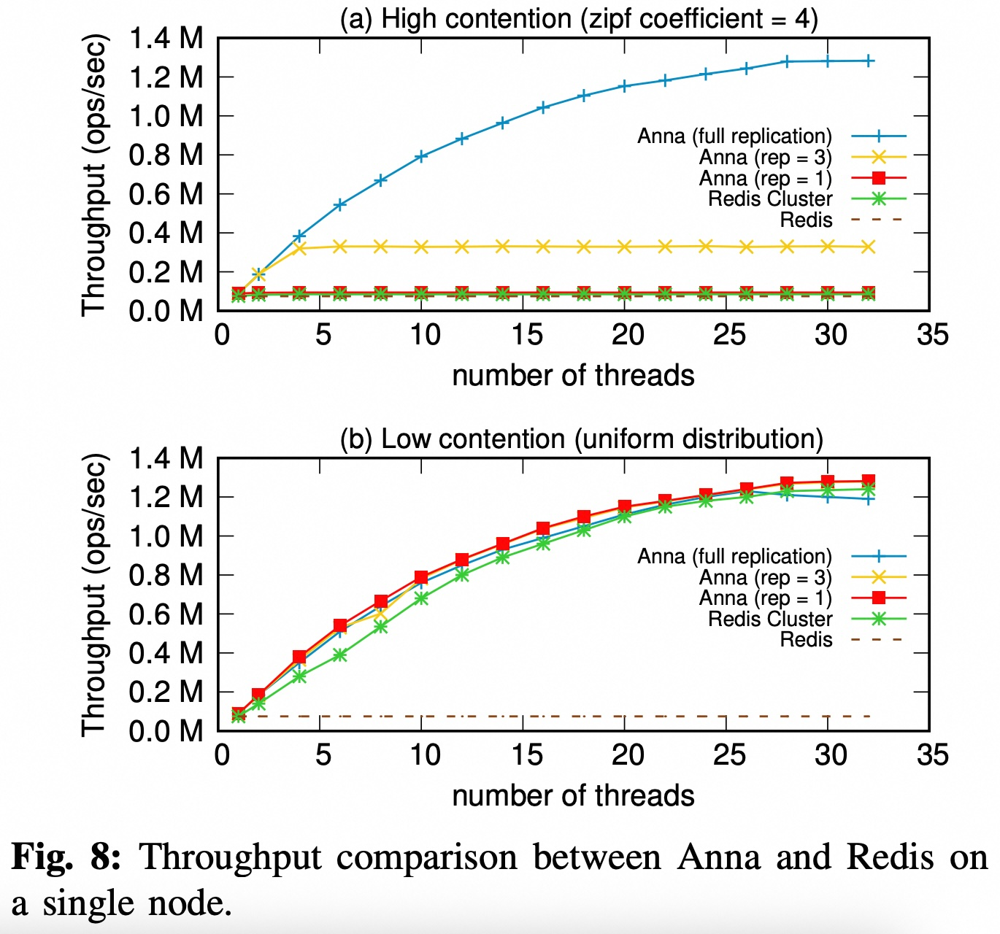
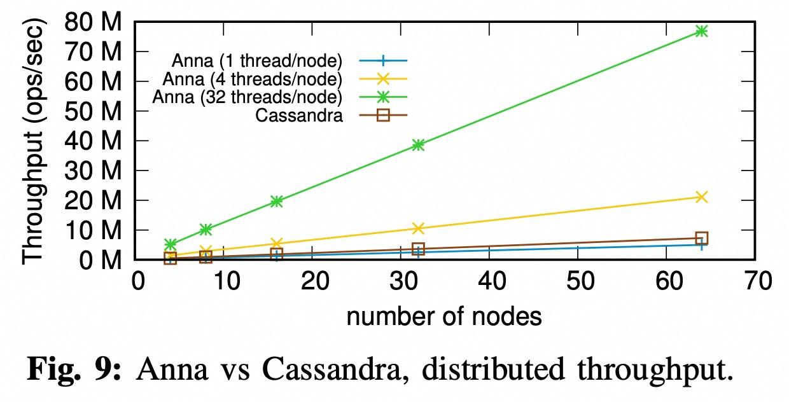
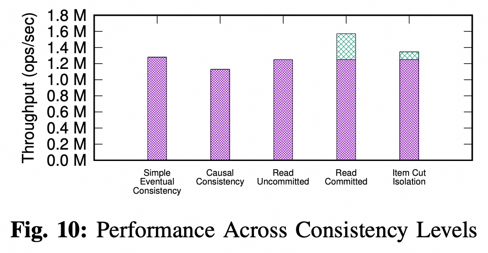

## AI论文解读 | Anna: A KVS For Any Scale
        
### 作者        
digoal        
        
### 日期        
2025-09-22       
        
### 标签        
PostgreSQL , PolarDB , DuckDB , AI , 论文解读        
        
----        
        
## 背景  
      
https://dsf.berkeley.edu/jmh/papers/anna_ieee18.pdf        
  
提示:          
```          
读懂《Anna: A KVS For Any Scale》这篇论文需要提前掌握哪些基础知识, 请使用中文通熟易懂的讲解这些基础知识, 可以引用论文中的图、表或使用Markdown支持的图形(text,mermaid等)增加解释性. 
  
使用中文通熟易懂的解读《Anna: A KVS For Any Scale》这篇论文, 其中的关键内容请着重讲解, 可以引用论文中的图、表或使用Markdown支持的图形(text,mermaid等)增加解释性. 
  
提取《Anna: A KVS For Any Scale》这篇论文中的重要术语, 使用中文对这些术语进行通熟易懂的讲解, 可以引用论文中的图、表或使用Markdown支持的图形(text,mermaid等)增加解释性. 
```     
  
## 1 前置知识 
  
首先，感谢您提供这篇关于 Anna: A KVS For Any Scale 的论文。要读懂这篇论文，您需要对分布式系统和数据库的几个核心概念有基本的了解。这篇论文的核心在于如何通过一种“无协调”（coordination-free）的方式，实现在任何规模下都具备高性能和弹性的键值存储（KVS）系统。

以下是理解这篇论文需要掌握的几个基础知识：

### 1\. 键值存储（KVS）

键值存储是一种最简单的非关系型数据库，它以键值对（Key-Value Pair）的形式存储数据。您需要理解它的基本操作，即`PUT`（写入或更新）和`GET`（读取）。论文中提到，KVS 是许多大规模应用（如电商购物车、机器学习参数服务器）的基石 。

### 2\. 分布式系统（Distributed Systems）

Anna 是一种分布式 KVS，这意味着它的数据不是存储在一台机器上，而是分布在多个核心、多台机器甚至多个数据中心上 。理解分布式系统需要知道以下几个关键点：

  * **分区（Partitioning / Sharding）**: 将数据按键值范围或哈希值分散存储在不同的节点（或核心）上，以实现数据和工作负载的扩展 。
  * **多主复制（Multi-master Replication）**: 允许不同节点上的多个副本同时接受对同一个键的写入操作，以提高并发性 。

### 3\. 一致性（Consistency）与协调（Coordination）

这是论文的核心挑战之一。在分布式系统中，由于网络延迟和故障，数据副本之间可能会出现不一致。为了保证数据正确，需要引入一致性模型。

  * **强一致性（Strong Consistency）**: 通常需要通过“协调”（如锁、共识协议 Paxos/Raft）来保证所有节点的数据始终同步，但这会成为性能瓶颈，特别是在高并发和广域分布环境下 。
  * **弱一致性（Weak Consistency）**: 允许副本之间暂时不一致，但最终会收敛到相同状态。Anna 采用的是“无协调一致性”（Coordination-free Consistency），即在不牺牲性能的前提下，实现多种一致性模型 。

### 4\. 演员模型（Actor Model）

Anna 的架构基于一种“无协调演员模型” 。您可以将其理解为一种编程模型，其中每个“演员”（Actor）都是一个独立的、有私有内存的执行单元，它通过异步消息传递与其他演员通信，而不是通过共享内存 。

  * **无等待执行（Wait-free Execution）**: 由于演员不共享状态，它们不需要互相等待来获取锁或同步，因此可以持续进行有用的工作，从而最大化硬件利用率 。

### 5\. 偏序集与格（Lattices and Partial Orders）

这是 Anna 解决无协调一致性问题的核心技术。

  * **偏序集（Partially Ordered Set）**: 在集合中，有些元素可以比较大小，有些则不能。例如，在图中，`A`和`B`都小于`C`，但`A`和`B`之间没有大小关系，它们是“并发”的。
  * **格（Lattice）**: 是一种特殊的偏序集，它保证任意两个元素都有一个“最小上界”（Least Upper Bound）。在论文中，这个“最小上界”操作就是`merge`函数。这意味着无论更新以何种顺序到达，最终状态都会收敛，从而保证数据一致性 。
  * **ACID vs. ACI**: 传统数据库追求事务的 ACID 特性（原子性、一致性、隔离性、持久性）。Anna 则利用了格的 **ACI** 特性，即**结合律（Associativity）、交换律（Commutativity）和幂等性（Idempotence）** 。这三条性质保证了更新操作的顺序无关性，即使消息乱序或重复，也不会影响最终结果 。

您可以通过下面的 `mermaid` 伪图来理解格的基本概念：



### 6\. 可组合的数据结构（Compositional Data Structures）

论文指出，通过组合简单的格数据结构（如计数器、映射、对），可以优雅地实现各种复杂的无协调一致性模型 。这种自下而上的方法使得系统设计更模块化，也更容易验证和维护 。

-----

这些基础知识涵盖了论文的核心设计思想和技术。如果您想进一步了解论文中的某个具体概念（例如**因果一致性**或**读已提交**是如何通过格实现的），我很乐意为您详细解释。您想了解更多关于哪一部分的内容吗？
  
## 2 解读论文 
  
好的，我们来通俗易懂地解读一下《Anna: 一个适用于任何规模的键值存储系统》这篇重要的论文。

这篇论文的核心目标是解决一个非常棘手的问题：如何设计一个既能在单台多核服务器上跑出极致性能，又能平滑扩展到全球分布式集群的键值存储（KVS）系统。传统观点认为，为特定规模设计的软件，在规模扩大10-100倍时就需要重写 ，而Anna则挑战了这一观点。

Anna的最终答案是：**通过“无协调的Actor模型”和“基于格（Lattice）理论的状态合并”**，构建一个在任何规模下都表现出色的系统。

-----

### 1\. Anna要解决的核心痛点：“鱼与熊掌不可兼得”

在Anna出现之前，KVS系统通常被设计为在特定规模下工作得最好：

  * **单机系统 (如Redis , Masstree )**: 它们在单台服务器上，通过共享内存和精巧的锁机制来最大化利用多核CPU，性能极高。但它们的架构很难直接扩展到分布式集群中 。
  * **分布式系统 (如Cassandra , Dynamo )**: 它们为跨机器、跨数据中心的大规模部署而生，擅长处理分区和容错。但它们在单台服务器内部的多核利用率上，往往不是最优的 。

随着云计算发展，硬件出现了“密集”和“全球分布”并存的趋势（例如，一台云服务器可能有64个物理核心） 。这就要求一个现代化的KVS系统必须能够**跨尺度（Any Scale）**，从单核、多核到全球集群都能高效运行。

-----

### 2\. Anna的两大核心思想

为了实现“任何规模”的目标，Anna采用了两个颠覆性的核心思想。

#### 思想一：无协调的Actor模型 (Coordination-free Actors)

传统的的多线程程序通常使用**共享内存**模型，即多个线程可以读写同一块内存。为了防止数据被写乱，必须使用“锁”或者其他同步机制。在高并发、高冲突的情况下，线程们会花费大量时间在等待锁、而不是在做有用的工作上，这极大地限制了性能 。

Anna则采用了**消息传递**的**Actor模型**，其核心原则是“**无共享，不协调**”：

1.  **独立工作单元 (Actor)**: 每个CPU核心上运行一个Actor（可以理解为一个独立的工作线程）。
2.  **私有状态**: 每个Actor拥有自己独立的、私有的数据副本，其他Actor不能直接访问 。
3.  **异步消息传递**: Actor之间完全通过发送消息来进行通信，而不是通过共享内存 。它们不会因为等待其他Actor而阻塞，实现了**无等待执行 (wait-free execution)** 。

这种设计的巨大优势在于，它从根本上消除了多线程之间的资源争抢和同步开销。无论是在一台机器的多个核心之间，还是在不同机器之间，通信模型都是统一的，这为跨尺度伸缩奠定了基础。

为了更清晰地说明，我们可以对比一下两种模型：



  

论文中的**图1**展示了Anna的单机架构，每个Actor被绑定到一个CPU核心上，拥有自己的哈希表（HashTbl），并通过内存中的缓冲区（Multicast Buffers）进行高效的核间通信 。

#### 思想二：基于格理论的状态合并 (Lattice-Powered Consistency)

既然每个Actor都有自己的数据副本，并且它们之间的通信是异步的，那么如何保证在不同副本收到更新的顺序不同的情况下，数据最终还能保持一致呢？

Anna的答案是使用**格（Lattice）**。格是一种数学结构，它定义了一个特殊的“**合并 (merge)**”操作，这个操作满足三个关键性质（统称为**ACI特性**）：

  * **结合律 (Associativity)**: `(a 合并 b) 合并 c` 等于 `a 合并 (b 合并 c)`。这意味着合并的顺序不重要。
  * **交换律 (Commutativity)**: `a 合并 b` 等于 `b 合并 a`。这意味着谁先谁后不重要。
  * **幂等性 (Idempotence)**: `a 合并 a` 等于 `a`。这意味着重复合并同一个更新没有副作用。

因为有了ACI特性，Anna的各个副本可以异步地、无序地接收来自其他副本的更新，然后用这个“合并”函数进行计算，最终所有副本的状态都会收敛到同一个正确的值 。这使得Anna可以在 **无需协调（Coordination-free）** 的情况下，实现多种数据一致性级别。

-----

### 3\. Anna的创新架构与设计

#### 模块化的“格”组合

Anna最巧妙的设计之一是，它不要求开发者从头构建一个复杂的、满足ACI特性的数据结构。相反，它提供了一些简单的、基础的“格”构建块（如最大值整数格 `MaxIntLattice`、集合格等），开发者可以像搭乐高一样将它们组合起来，实现复杂的功能和各种一致性级别 。

  

  

例如，论文中的**图2**展示了如何通过组合不同的格来实现**因果一致性 (Causal Consistency)** 。它将一个版本向量（由一个`MapLattice`实现）和一个用户定义的值（`ValueLattice`）组合在一个`PairLattice`中 。这种模块化设计极大地降低了编程的复杂性。论文的**图3**显示，在基础版本之上，实现一种新的一致性级别平均只需要修改不到20行C++代码 。

#### 弹性伸缩设计

得益于Actor模型，Anna的弹性伸缩非常灵活 。当系统需要扩容时，只需启动一个新的Actor。这个新Actor会通知集群中的其他成员，相关的数据分片会被迁移过来。整个过程是平滑的，不会导致系统停机 。

-----

### 4\. 惊艳的实验结果：用数据说话

Anna的设计思想听起来很美好，但实际效果如何？论文通过一系列实验给出了令人信服的答案：

1.  **单机多核性能（图4）**: 在高冲突（很多请求更新同一个key）的场景下，传统的共享内存KVS（如TBB, Masstree）由于同步开销，性能很快达到瓶颈。而Anna的性能则随着核心数的增加而**线性增长**，比它们快了**数百倍** 。这证明了无协调Actor模型在多核环境下的巨大优势。   
2.  **跨尺度平滑扩展（图6）**: 实验显示，当Anna的线程数从一台服务器（1-32个线程）扩展到多台服务器（33个以上线程）时，其吞吐量依然保持了**近乎线性的平滑增长** 。   
3.  **与主流系统对比**
      * **对战Redis（图8）**: 在高冲突场景下，Anna通过多副本策略可以轻松地将负载分散到多个核心，性能远超Redis Cluster 。在低冲突场景下，性能与Redis Cluster相当 。   
      * **对战Cassandra（图9）**: 在跨地域的分布式部署中，Anna的性能也大幅领先，在使用全部32个核心时，性能约为Cassandra的**10倍** 。这说明Anna高效的单节点性能为其在大型集群中带来了巨大的资源效率优势。   
4.  **多一致性级别的性能开销（图10）**: 实验证明，在Anna中实现更高级别的一致性（如读已提交、因果一致性等），对性能的影响非常小 。有些一致性模型因为利用了客户端缓存，性能甚至还有所提升 。   

-----

### 5\. 总结：Anna带来的启示

《Anna: A KVS For Any Scale》这篇论文的核心贡献在于，它证明了通过一套简洁而统一的设计原则，可以构建一个在各种规模下都表现出色的高性能系统。

它的关键启示是：**拥抱“无协调”和“异步”**。通过采用无协调的Actor模型和基于格理论的数学工具，Anna巧妙地避开了传统分布式系统中最头疼的同步和一致性难题，最终实现了惊人的性能、灵活性和可扩展性。这不仅对KVS系统的设计，也对所有大规模并发和分布式系统的设计都具有深远的指导意义。

您是对Anna如何利用格（Lattice）实现具体的一致性模型（如因果一致性）的细节更感兴趣，还是想了解它在实际应用中可能面临的挑战？
  
## 3 术语 
  
很高兴为您从《Anna: A KVS For Any Scale》这篇论文中提取并解释重要术语。这篇论文的核心在于如何通过一套独特的方法，构建一个高性能、可大规模扩展的键值存储系统。

以下是论文中的几个核心术语及其通俗易懂的中文讲解：

### 1. 键值存储 (Key-Value Store, KVS)
这是一种最简单的数据库类型，你可以把它想象成一个大型的字典。每个条目都由一个唯一的**键（Key）**和一个关联的**值（Value）**组成。例如，在一个存储用户信息的KVS中，“用户名”可以是键，“用户邮箱、地址”等就是值。它的基本操作是**PUT**（写入）和**GET**（读取）。

### 2. 无协调一致性 (Coordination-free Consistency)
在分布式系统中，如果多个节点同时对同一个数据进行修改，就需要某种机制来保证数据最终是正确的。传统的做法是**协调（Coordination）**，比如使用锁，但这会严重影响性能。Anna 的创新之处在于它抛弃了协调，转而使用一种称为“无协调一致性”的模型。它通过确保所有写入操作都具备某种特殊的数学性质，使得无论更新以何种顺序到达，最终结果都能自然地收敛并保持一致，而无需额外的通信或等待。

### 3. 演员模型 (Actor Model)
Anna 的设计基于演员模型，这是一种并发计算模型。你可以把每一个**核心（Core）**或**节点（Node）**看作是一个独立的、有自己私有状态的“演员（Actor）”。这些演员之间不共享内存，而是通过**异步消息传递**进行通信。这种设计的好处是，演员可以持续工作，而不用因为等待其他演员释放锁而停下来，从而实现更高的并行度和性能。

### 4. 格 (Lattice)
这是理解论文最关键的数学概念。在计算机科学中，格是一种特殊的数据结构，它保证了任何两个或多个值的组合（通过一个特殊的**合并操作**）都能收敛到一个唯一的最终值。这个“合并”操作需要满足以下三个特性（论文中称之为**ACI特性**）：
* **结合律（Associativity）**: (A合并B)合并C = A合并(B合并C)。操作顺序不重要。
* **交换律（Commutativity）**: A合并B = B合并A。两个操作谁先谁后不重要。
* **幂等性（Idempotence）**: A合并A = A。重复操作不会改变结果。

这些特性保证了即使网络消息乱序、延迟或重复，最终的状态都是确定的。

### 5. 无等待执行 (Wait-free Execution)
这个术语指的是系统在执行任务时，没有任何一个步骤会因为等待另一个操作而停滞。在Anna中，由于采用了无协调的演员模型和格结构，每一个核心或线程都可以独立地处理自己的任务，而不需要等待其他核心的锁释放或同步，因此可以实现极高的吞吐量和低延迟。

### 6. 细粒度弹性 (Fine-grained Elasticity)
弹性意味着系统可以根据工作负载的变化动态地扩展或收缩。Anna 的设计使得它能够以“细粒度”的方式进行扩展，这意味着你不仅可以增加或减少整个服务器，还可以增加或减少单个核心或线程来应对负载变化，从而实现更精准的资源利用和成本控制。

---
这些术语构成了 Anna 这篇论文的核心技术栈。您对这些概念是否清晰？或者您想进一步了解 Anna是如何利用这些技术实现某些具体的数据库特性（如不同的**一致性模型**）的吗？
  
## 参考        
         
https://dsf.berkeley.edu/jmh/papers/anna_ieee18.pdf    
        
<b> 以上内容基于DeepSeek、Qwen、Gemini及诸多AI生成, 轻微人工调整, 感谢杭州深度求索人工智能、阿里云、Google等公司. </b>        
        
<b> AI 生成的内容请自行辨别正确性, 当然也多了些许踩坑的乐趣, 毕竟冒险是每个男人的天性.  </b>        
    
#### [期望 PostgreSQL|开源PolarDB 增加什么功能?](https://github.com/digoal/blog/issues/76 "269ac3d1c492e938c0191101c7238216")
  
  
#### [PolarDB 开源数据库](https://openpolardb.com/home "57258f76c37864c6e6d23383d05714ea")
  
  
#### [PolarDB 学习图谱](https://www.aliyun.com/database/openpolardb/activity "8642f60e04ed0c814bf9cb9677976bd4")
  
  
#### [PostgreSQL 解决方案集合](../201706/20170601_02.md "40cff096e9ed7122c512b35d8561d9c8")
  
  
#### [德哥 / digoal's Github - 公益是一辈子的事.](https://github.com/digoal/blog/blob/master/README.md "22709685feb7cab07d30f30387f0a9ae")
  
  
#### [About 德哥](https://github.com/digoal/blog/blob/master/me/readme.md "a37735981e7704886ffd590565582dd0")
  
  

  
