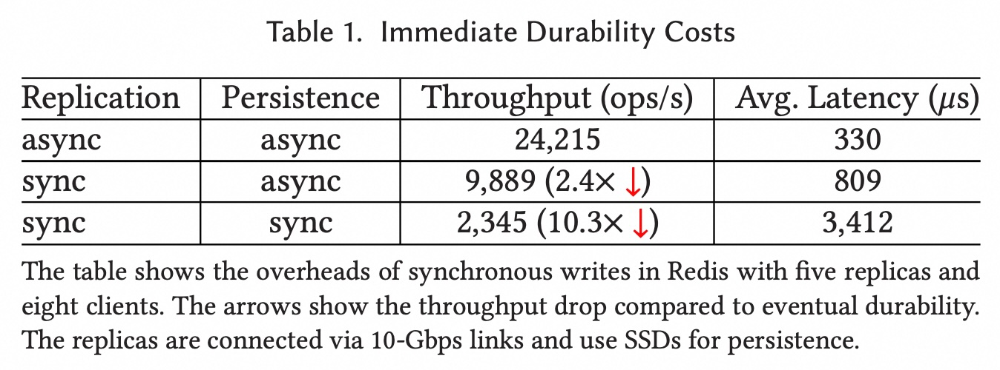
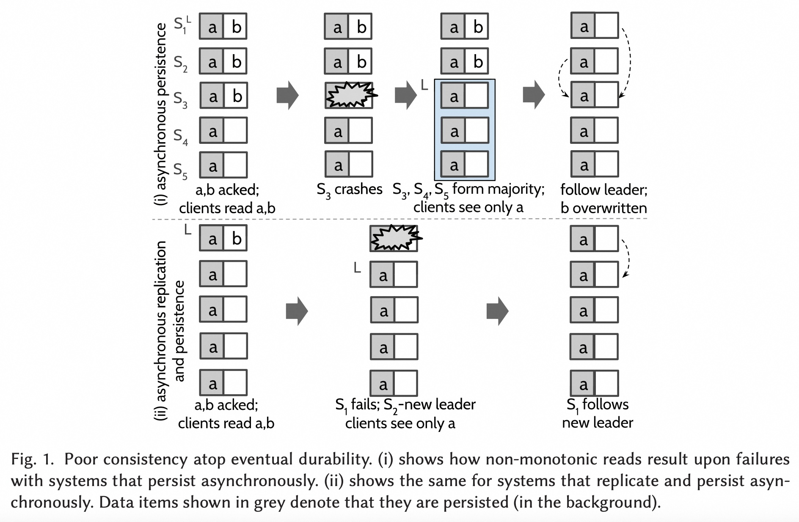
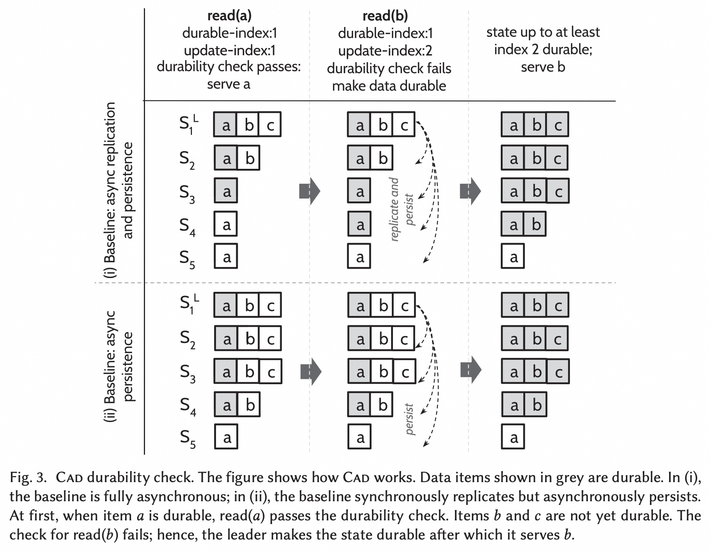
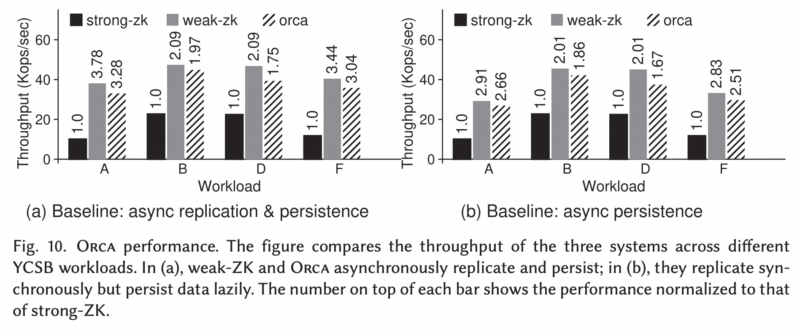
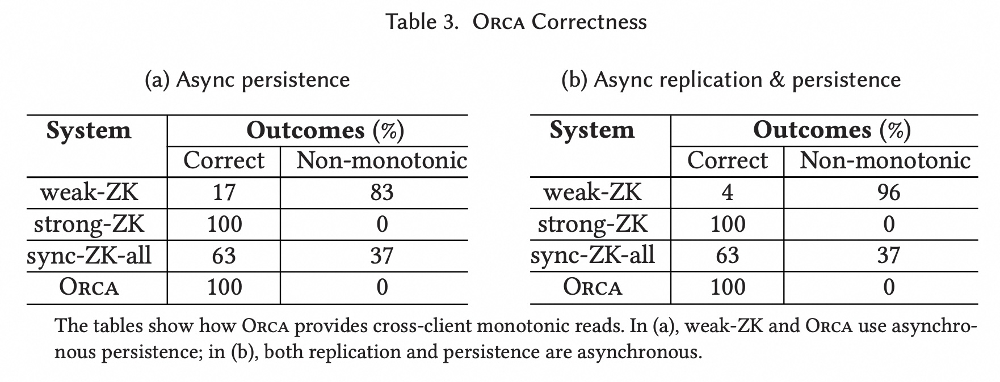

## AI论文解读 | Strong and Efficient Consistency with Consistency-aware Durability
        
### 作者        
digoal        
        
### 日期        
2025-09-22       
        
### 标签        
PostgreSQL , PolarDB , DuckDB , AI , 论文解读        
        
----        
        
## 背景  
      
https://dl.acm.org/doi/pdf/10.1145/3423138        
  
提示:          
```          
读懂《Strong and Efficient Consistency with Consistency-aware Durability》这篇论文需要提前掌握哪些基础知识, 请使用中文通熟易懂的讲解这些基础知识, 可以引用论文中的图、表或使用Markdown支持的图形(text,mermaid等)增加解释性. 
  
使用中文通熟易懂的解读《Strong and Efficient Consistency with Consistency-aware Durability》这篇论文, 其中的关键内容请着重讲解, 可以引用论文中的图、表或使用Markdown支持的图形(text,mermaid等)增加解释性. 
  
提取《Strong and Efficient Consistency with Consistency-aware Durability》这篇论文中的重要术语, 使用中文对这些术语进行通熟易懂的讲解, 可以引用论文中的图、表或使用Markdown支持的图形(text,mermaid等)增加解释性. 
```     
  
## 1 前置知识 
  
首先，很高兴能帮助您理解这篇关于“Strong and Efficient Consistency with Consistency-aware Durability”的论文。要读懂这篇论文，您需要对 **分布式系统中的数据一致性（Consistency）和持久性（Durability）** 这两个核心概念有扎实的基础理解。这篇论文的创新点就在于提出了一种新的持久性方法，旨在同时实现高性能和强一致性，解决了传统方法在这两个目标之间的矛盾。

-----

### 1\. 核心基础知识：一致性与持久性

#### **一致性（Consistency）**

在分布式系统中，一致性模型定义了客户端如何看待数据。论文中主要对比了两种极端的一致性模型：

  * **强一致性（Strong Consistency）：** 确保所有客户端在任何时间都能看到相同且最新的数据。这意味着每一次读操作都会返回最新的写操作结果。论文中提到了 **可线性化（Linearizability）**，这是最强的保证之一。它不仅要求数据最新，还要求操作的顺序符合全局时钟，仿佛所有操作都在一个节点上顺序执行。
  * **最终一致性（Eventual Consistency）：** 允许系统在更新后的一段时间内数据处于不一致状态。最终，所有副本都会收敛到一致的状态。这种模型通常能提供更高的性能和可用性，但可能会导致客户端读取到旧数据。

论文强调了强一致性的一个重要子集：**跨客户端单调读（Cross-client monotonic reads）**  。这是一种强保证，它确保一个客户端的读取结果，总是至少与任何其他客户端之前的读取结果一样新，无论服务器或客户端故障，也无论会话如何变化 。这对于例如视频浏览量计数器或位置共享服务等场景至关重要，因为您不希望看到计数器或位置“倒退”的情况 。

#### **持久性（Durability）**

持久性是指数据在系统发生故障（例如电源故障或服务器崩溃）后仍然能够保持不变。论文同样探讨了两种极端模式：

  * **即时持久性（Immediate Durability）：** 这是一种确保数据持久化的最严格方式。它要求在确认写操作成功之前，数据必须被**同步地**复制并持久化到足够多的节点上（例如，写入磁盘） 。这种方式通常用于实现强一致性，但会因为同步操作的开销而导致性能显著下降 。下表1（Table 1）展示了即时持久性带来的巨大性能开销 。   

    | Replication | Persistence | Throughput (ops/s) | Avg. Latency (us) |
    | :--- | :--- | :--- | :--- |
    | async | async | 24,215 | 330 |
    | sync | async | 9,889 (2.4x↓) | 809 |
    | **sync** | **sync** | **2,345 (10.3×↓)** | **3,412** |
    
    *引自论文 Table 1*

  * **最终持久性（Eventual Durability）：** 这种模式允许数据被“懒惰地”复制和持久化，通常在写操作完成后立即向客户端确认成功，但数据可能只暂存在单个节点的内存中 。这种方式能实现高吞吐量和低延迟，但由于数据可能会在故障时丢失，因此只能实现弱一致性 。论文图1（Figure 1）清晰地展示了在最终持久性下，系统如何因故障而丢失数据并导致非单调读（non-monotonic reads）。   

    *引自论文 Figure 1*

### 2\. 论文核心思想：一致性感知持久性（CAD）

《Strong and Efficient Consistency with Consistency-aware Durability》这篇论文的核心在于提出了 **一致性感知持久性（Consistency-aware Durability，简称CAD）** 。CAD 旨在打破上述即时持久性（强一致性，低性能）和最终持久性（弱一致性，高性能）之间的矛盾 。

CAD 的核心思想是：**允许写操作异步完成，但在读操作时强制进行持久化** 。

  * **写操作（Writes）：** CAD 借鉴了最终持久性的方式，允许写操作在数据未完全复制和持久化时就向客户端返回成功确认，从而获得高吞吐量 。
  * **读操作（Reads）：** 当客户端尝试读取数据时，CAD 会确保该数据以及其之前的所有状态都已被复制并持久化到足够多的节点上，之后才会返回读取结果 。

这种“读时持久化”的机制确保了即使在发生故障时，客户端也不会读到“倒退”的数据，从而实现了**跨客户端单调读**这一强一致性保证 。

-----

### **接下来，您想深入了解论文中的哪一部分？**

例如，我们可以进一步探讨：

  * 论文中提到的 **ORCA 系统**是如何在ZooKeeper中实现CAD的？
  * **CAD**如何通过“耐久性检查机制”和“基于租约的活跃集”来实现其读时持久化策略？
  * **跨客户端单调读**与其他一致性模型（如可线性化或因果一致性）有什么区别？
  
## 2 解读论文 
  
好的，我们来深入解读一下《Strong and Efficient Consistency with Consistency-aware Durability》这篇论文。简单来说，这篇论文的核心思想是提出了一种名为**一致性感知持久化（Consistency-aware Durability, 简称 CAD）** 的新方法，旨在解决分布式存储系统中一个长期存在的难题：如何在实现**强一致性**的同时，又能获得**高性能**。

-----

### 核心问题：鱼与熊掌不可兼得？

在分布式存储领域，系统设计者通常面临一个两难的选择：

1.  **强一致性 + 立即持久化 (Immediate Durability)**

      * **做法**：每一次写入操作，都必须同步地复制到多个节点，并且确认已经写入磁盘后，才向客户端返回成功信号。
      * **优点**：数据安全性极高，能保证线性一致性（Linearizability）这种最强的模型，用户永远不会读到旧数据（stale data），也不会看到状态“倒退”（non-monotonic reads）。
      * **缺点**：**性能极差**。因为每次写入都要等待网络复制和磁盘I/O，延迟非常高，吞吐量也上不去。如论文中的表格1所示，在Redis中，同步复制和持久化的性能比完全异步的方式慢了整整10倍 。

2.  **弱一致性 + 最终持久化 (Eventual Durability)**

      * **做法**：写入操作只需在主节点（leader）的内存中完成，就可以立刻返回成功，数据的复制和磁盘写入则在后台异步进行。
      * **优点**：**性能极高**，写入延迟极低，吞吐量巨大。这是很多流行系统（如Redis, MongoDB）的默认配置 。
      * **缺点**：**一致性很弱**。如果主节点在将数据复制出去之前宕机，那么已经向客户端确认成功的数据就会丢失。这会导致用户读到旧数据，甚至出现状态“时光倒流”的现象。

论文中的**图1**生动地展示了“最终持久化”的风险：   

```text
          ┌───────────────────────────────────┐      ┌───────────────────────────────────┐
          │      (i) 异步持久化 (Asynchronous Persistence)      │      │     (ii) 异步复制与持久化 (Asynchronous Replication & Persistence)  │
          └───────────────────────────────────┘      └───────────────────────────────────┘
                初始状态: a,b 已提交                  写入b后, Leader立即宕机
                  S1 [a,b]                          S1 (Leader) [a,b]
                  S2 [a,b]                             ↓ (crash)
                  S3 [a,b] → (crash) → S3 [] (丢失b)   S2, S3, S4, S5 (只有 a)
                  S4 [ a ]                             ↓
                  S5 [ a ]                       选出新Leader (e.g., S2)
                       ↓                         系统状态回退到只有 a
             S3, S4, S5 形成新的大多数, 只有 a
             系统状态回退, 之前读到b的用户会看到b消失了
```

  * **左图(i)** 显示，即使数据已在多个节点的内存中，只要没持久化到磁盘，一个节点的崩溃和恢复就可能导致已提交的数据丢失 。
  * **右图(ii)** 显示，如果主节点在内存中确认写入后、复制数据前就崩溃，数据会直接丢失 。

**这篇论文要解决的，就是打破这种“要么慢但安全，要么快但不一致”的困局。**

-----

### 核心思想：一致性感知持久化 (CAD)

CAD的思路非常巧妙，它颠覆了传统的持久化时机：

> **核心理念：不在“写入时”强制持久化，而是在“读取时”确保持久化。** (Shifts the point of durability from writes to reads.) 

具体来说：

  * **写入 (Write) 路径**：和最终持久化一样**快**。写入请求只需在主节点内存中完成即可立即响应客户端，后台再异步进行复制和持久化 。
  * **读取 (Read) 路径**：变得“智能”和**安全**。当一个读请求到达时，系统会先做一个**持久化检查（Durability Check）** 。
      * 如果要读取的数据**已经**在后台被持久化到了大多数节点上，那么直接返回数据，这个过程非常快。
      * 如果数据**尚未**被持久化，系统会**触发一次同步**操作，强制将该数据及其之前的所有相关数据持久化到大多数节点，**然后再**返回给用户 。

**图3**清晰地解释了这个过程：   

  * **读 a (read(a))**: 假设数据 a 之前已经被写入，并且后台任务已经将其持久化了。此时持久化检查通过，系统直接从内存返回 a，速度很快 。
  * **读 b (read(b))**: 假设数据 b 是刚刚写入的，还没来得及持久化。此时持久化检查失败，系统会暂停这个读请求，立即启动一个同步的复制和持久化流程，确保包含 b 的状态在大多数节点上落盘。完成后，再把 b 返回给客户端 。

这种设计的精妙之处在于：

1.  **实现了高性能**：对于很多应用场景（比如“写多读少”或“写后隔一段时间再读”），数据在被读取之前，很有可能已经被后台任务持久化了。因此，大部分读写操作的性能接近于最终持久化系统 。
2.  **保证了强一致性**：CAD确保了**任何被客户端读取过的数据，都不会因后续的故障而丢失** 。因为它在数据被“看到”之前，就已将其“固化”了。

-----

### 实现的新一致性模型：跨客户端单调读

基于CAD，论文实现了一种新颖且强大的保证，叫做**跨客户端单调读 (Cross-client Monotonic Reads)** 。

它的含义是：**任何一个客户端的任何一次读取，返回的状态都必须至少和系统中任何一个客户端之前读到的状态一样新，无论发生服务器故障、客户端重连或会话中断** 。

举个例子：

  * **视频观看数**：你看到一个视频有100个赞，刷新一下，不能变成99个。
  * **位置共享**：你看到朋友在地图上的A点，过了一会儿，不应该看到他又“瞬移”回了A点之前的位置 。

传统的弱一致性系统在服务器故障或客户端切换连接节点时，很容易破坏这种单调性。而CAD通过“读时持久化”的机制，完美地保证了这一点。

-----

### ORCA系统设计与评估

为了验证CAD的有效性，作者基于ZooKeeper修改实现了一个名为**ORCA**的系统 。ORCA不仅实现了CAD，还通过一个 **活动集（Active Set）** 和 **租约（Lease）** 机制，允许多个副本节点（followers）安全地处理读请求，从而极大地提升了读取的吞吐量和可扩展性 。

#### 性能评估亮点

论文通过大量实验证明了ORCA的优越性：

  * **吞吐量远超强一致性系统**：与传统的强一致性ZooKeeper（strong-ZK）相比，ORCA的吞吐量提升了**1.8到3.3倍** 。
  * **性能接近弱一致性系统**：与高性能但弱一致性的ZooKeeper（weak-ZK）相比，ORCA的性能非常接近，仅有微小的开销（在最坏情况下也只有8%的性能损失）。
  * **地理分布式优势巨大**：在跨数据中心的地理分布式场景下，ORCA允许客户端从就近的副本读取数据，使得读取延迟比strong-ZK（所有读写都必须发往主节点）**降低了14倍之多** 。

**图10**直观地展示了吞吐量的对比：   
*可以看到，ORCA（橙色条）的高度远远超过了strong-ZK（蓝色条），同时非常接近weak-ZK（灰色条）* 。

#### 一致性验证

作者还通过一个故障注入框架，在数百个随机的故障场景下进行了测试。结果如**表3**所示，**ORCA在100%的情况下都保证了跨客户端单调读，而weak-ZK在超过80%的情况下都出现了不一致的状态** 。

  

-----

### 结论与意义

这篇论文的贡献是显著的。它并没有发明一个全新的、复杂的一致性模型，而是通过一个简单而深刻的洞察——**改变持久化的时机**——为分布式系统设计者提供了一个非常有价值的“中间地带”。

通过**一致性感知持久化（CAD）**，系统可以在不牺牲太多性能的前提下，从最终一致性升级到更强的**跨客户端单调读**保证。这对于许多需要更好用户体验但又无法承受强一致性系统高昂成本的现代应用（如社交网络、物联网、边缘计算等）来说，是一个极具吸引力的解决方案 。
  
## 3 术语 
  
好的，很高兴能帮助您进一步理解这篇论文。这篇论文的核心贡献在于提出了一套新的概念和机制来解决分布式系统中的一致性与性能问题。下面我将为您梳理并解释其中的几个重要术语。

---

### 1. 一致性感知持久性（Consistency-aware Durability, CAD）

**是什么？** CAD是这篇论文提出的核心思想，它是一种创新的持久化方法，旨在平衡传统持久化模式的优缺点。简单来说，它不像传统方法那样在写入时就强制持久化所有数据（即时持久性），而是将持久化操作推迟到数据被**读取**时才强制执行。

**为什么重要？** 传统的即时持久性（同步持久化）虽然能提供最强的一致性保证，但会因为写入操作需要等待数据在多个节点上持久化完成而导致性能（吞吐量和延迟）显著下降。CAD通过将这部分开销转移到读取阶段，成功实现了**高吞吐量**，同时还能提供强一致性。

### 2. 跨客户端单调读（Cross-client Monotonic Reads）

**是什么？** 这是一个由论文定义并证明实现的新型强一致性保证。单调读（monotonic reads）通常指**单个客户端**在同一个会话中，不会读到比自己之前读到的更旧的数据。而“**跨客户端**单调读”则更进一步：它保证在系统故障或会话切换后，任何客户端都不会读到比系统全局任何一个已确认的、历史数据点更旧的版本。

**为什么重要？** 这种保证对于许多应用场景至关重要，例如：
* **社交媒体点赞数：** 您不希望看到一个帖子的点赞数先是1000，刷新一下变成999。
* **银行账户余额：** 您在转账后，不希望看到余额又变回转账前的旧数据。

论文强调，这是比一般“最终一致性”强得多的保证，因为它能防止数据在故障后“倒退”，而这在依赖异步复制的系统中是很难做到的。

### 3. ORCA

**是什么？** ORCA 是这篇论文的作者们基于一个流行的分布式协调服务 **Apache ZooKeeper** 的修改版本。他们通过在ZooKeeper中实现CAD机制，来验证CAD的有效性。

**为什么重要？** 通过在真实且广泛使用的系统上进行原型开发和实验，作者们证明了CAD不仅仅是一个理论概念。他们的实验结果表明，ORCA在提供强一致性保证的同时，其性能（吞吐量和延迟）与那些只提供弱一致性的ZooKeeper版本非常接近，并且比提供强一致性的ZooKeeper版本性能高出许多。

### 4. 活跃集与耐久性检查（Active Set & Durability Check）

**是什么？** 这是实现CAD机制的两个关键技术。
* **活跃集（Active Set）：** 这是指一个能够响应客户端请求的、具有最新状态的服务器子集。论文中，这个活跃集是通过**租约（Lease）**机制来维护的，确保所有活跃集中的服务器都具有相同的数据。
* **耐久性检查（Durability Check）：** 当客户端发起读请求时，系统会执行一个耐久性检查。如果客户端请求的数据还没有被持久化到足够多的服务器上，它会触发持久化过程。只有在持久化完成后，读请求才会被响应。

**为什么重要？** 这两个机制是CAD“读时持久化”思想的具体实现。它们保证了即便写操作是异步的，任何读操作都能够看到一个稳定的、已持久化的最新状态，从而避免了数据“倒退”的问题。

---

希望这些解释能帮助您更好地理解论文中的核心概念。接下来，您想深入了解论文中关于ORCA的具体实现细节，还是想看看实验部分的数据，了解CAD的性能优势有多大呢？
  
## 参考        
         
https://dl.acm.org/doi/pdf/10.1145/3423138    
        
<b> 以上内容基于DeepSeek、Qwen、Gemini及诸多AI生成, 轻微人工调整, 感谢杭州深度求索人工智能、阿里云、Google等公司. </b>        
        
<b> AI 生成的内容请自行辨别正确性, 当然也多了些许踩坑的乐趣, 毕竟冒险是每个男人的天性.  </b>        
    
#### [期望 PostgreSQL|开源PolarDB 增加什么功能?](https://github.com/digoal/blog/issues/76 "269ac3d1c492e938c0191101c7238216")
  
  
#### [PolarDB 开源数据库](https://openpolardb.com/home "57258f76c37864c6e6d23383d05714ea")
  
  
#### [PolarDB 学习图谱](https://www.aliyun.com/database/openpolardb/activity "8642f60e04ed0c814bf9cb9677976bd4")
  
  
#### [PostgreSQL 解决方案集合](../201706/20170601_02.md "40cff096e9ed7122c512b35d8561d9c8")
  
  
#### [德哥 / digoal's Github - 公益是一辈子的事.](https://github.com/digoal/blog/blob/master/README.md "22709685feb7cab07d30f30387f0a9ae")
  
  
#### [About 德哥](https://github.com/digoal/blog/blob/master/me/readme.md "a37735981e7704886ffd590565582dd0")
  
  

  
