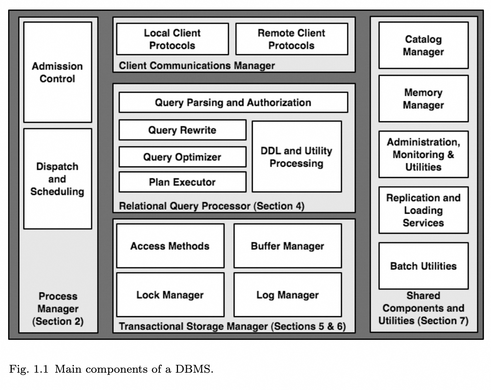

## AI论文解读 | Architecture of a Database System
        
### 作者        
digoal        
        
### 日期        
2025-09-22       
        
### 标签        
PostgreSQL , PolarDB , DuckDB , AI , 论文解读        
        
----        
        
## 背景  
      
https://dsf.berkeley.edu/papers/fntdb07-architecture.pdf        
  
提示:          
```          
读懂《Architecture of a Database System》这篇论文需要提前掌握哪些基础知识, 请使用中文通熟易懂的讲解这些基础知识, 可以引用论文中的图、表或使用Markdown支持的图形(text,mermaid等)增加解释性. 
  
使用中文通熟易懂的解读《Architecture of a Database System》这篇论文, 其中的关键内容请着重讲解, 可以引用论文中的图、表或使用Markdown支持的图形(text,mermaid等)增加解释性. 
  
提取《Architecture of a Database System》这篇论文中的重要术语, 使用中文对这些术语进行通熟易懂的讲解, 可以引用论文中的图、表或使用Markdown支持的图形(text,mermaid等)增加解释性. 
```     
  
## 1 前置知识 
  
您好！根据您提供的《Architecture of a Database System》这篇论文，为了更好地理解其内容，您需要提前掌握两个核心的基础知识领域：

  * **数据库系统教科书级别的材料**：这包括了数据库系统的基本概念、算法和理论。
  * **现代操作系统的基础知识**：例如UNIX、Linux或Windows等操作系统提供的基本功能。

论文作者在引言部分明确指出，该文主要关注通常在教科书中被忽略的系统设计问题，因此假定读者已熟悉这些基础知识 。

下面，我将结合论文中的图表，用通俗易懂的方式为您详细讲解这两个基础领域的核心知识。

### 1\. 数据库系统基础知识

这篇论文主要围绕关系型数据库管理系统（RDBMS）的架构展开 。要理解其架构，您需要先了解一个查询（Query）在数据库系统中的“生命周期”，这涵盖了论文中的**查询处理器**和**事务存储管理器**两个关键部分。

**查询处理器的核心组件**

当用户提交一个查询（例如一条SQL语句）时，数据库系统会启动一系列处理流程，这个过程由 **查询处理器（Relational Query Processor）** 负责。其内部主要包含以下步骤和组件：

  * **查询解析与授权（Query Parsing and Authorization）**：首先，系统会解析SQL语句的语法，并检查用户是否有执行该查询的权限 。
  * **查询重写（Query Rewrite）**：这一步会对查询进行初步优化，例如将视图（View）展开或改写一些不必要的子查询。
  * **查询优化器（Query Optimizer）**：这是数据库系统最复杂和核心的组件之一。它会为一条SQL语句生成多种可能的执行方案（也叫**查询计划**），然后通过成本估算（Cost Estimation）选择一个最优的计划 。这个过程需要了解基本的 **关系代数（Relational Algebra）** 操作，如联接（Join）、选择（Selection）、投影（Projection）等，因为查询计划就是由这些操作组成的 。
  * **计划执行器（Plan Executor）**：执行器负责按照优化器生成的计划去执行查询 。

**事务存储管理器的核心概念**

查询计划的执行最终会落到对数据的存取上，这部分由 **事务存储管理器（Transactional Storage Manager）** 负责。要理解这部分内容，需要掌握以下概念：

  * **数据访问方法（Access Methods）**：这是指数据在磁盘上的组织方式和访问机制，例如常用的索引结构如**B+树（B+-tree）** 。
  * **缓冲管理器（Buffer Manager）**：由于磁盘I/O非常耗时，数据库系统会使用内存中的 **缓冲池（Buffer Pool）** 来缓存从磁盘读取的数据页 。缓冲管理器负责管理这些内存页，决定何时将数据从磁盘读入内存，以及何时将脏页写回磁盘。
  * **事务（Transactions）与ACID属性**：数据库事务需要满足四个关键属性：原子性（**A**tomicity）、一致性（**C**onsistency）、隔离性（**I**solation）和持久性（**D**urability） 。要理解这些，您需要了解 **锁管理器（Lock Manager）** 和 **日志管理器（Log Manager）** 的作用 。
      * **锁管理器**：通过加锁来保证并发执行的事务之间互不干扰，以实现**隔离性** 。
      * **日志管理器**：通过记录所有修改操作的日志（log），来确保在系统崩溃时能够恢复到一致状态，从而实现**持久性**和**原子性** 。

为了更直观地理解这些组件的关系，论文中提供了如下的架构图（图1.1）：   

### 2\. 操作系统基础知识

论文的第二部分详细讨论了数据库系统的**进程模型（Process Models）** 。要理解这部分，您需要区分几个基本的操作系统概念：

  * **操作系统进程（OS Process）**：它是一个独立的执行单元，拥有自己的私有地址空间和资源 。进程间通信和数据共享需要特殊机制（如共享内存）。
  * **操作系统线程（OS Thread）**：与进程不同，线程是进程内的执行单元，共享同一个地址空间 。线程间的切换比进程切换开销更小。
  * **轻量级线程（Lightweight Thread）**：这是一种在应用程序级别实现的线程，由应用自己的调度器而非操作系统内核调度 。它的切换速度更快，但编程模型通常更复杂 。

这些知识是理解论文中讨论的各种进程模型（如“每DBMS工作者一个进程”或“每DBMS工作者一个线程”）及其性能、可扩展性和移植性优缺点的基础 。

-----

现在您已经了解了阅读这篇论文所需的基础知识。这篇论文对您有什么特别感兴趣的部分吗？例如，您想深入了解查询优化器的工作原理，或者并行架构如何影响数据库系统性能？
  
## 2 解读论文 
  
好的，我们来一起通俗易懂地解读这篇数据库领域的经典论文——《Architecture of a Database System》（数据库系统架构）。

这篇论文由三位数据库领域的大牛 Joseph M. Hellerstein, Michael Stonebraker 和 James Hamilton 撰写，它不像教科书那样专注于零散的算法，而是从一个整体的、系统设计的视角，描绘了一个现代关系型数据库管理系统（DBMS）是如何构建和运作的。读懂它，你就能明白当你敲下一行SQL查询后，数据库内部到底发生了怎样一番波澜壮阔的“旅行”。

-----

### **核心思想：一个SQL查询的生命之旅**

理解数据库架构最好的方式，就是跟随一个查询（Query）的脚步，看看它从客户端出发，到返回结果，都经历了哪些部门，办理了哪些手续。论文的核心正是围绕这张架构全景图展开的。

  

*图 1.1: 数据库管理系统（DBMS）主要组件*

这幅图就是数据库的“五脏六腑”，我们可以把它分为四个主要部分：

1.  **客户端通信管理器 (Client Communications Manager)**：数据库的“前台接待”。
2.  **进程管理器 (Process Manager)**：整个系统的“调度中心”。
3.  **关系查询处理器 (Relational Query Processor)**：处理查询的“大脑”。
4.  **事务性存储管理器 (Transactional Storage Manager)**：负责数据存储和安全的“仓库管理员”。
5.  **共享组件和工具 (Shared Components and Utilities)**：提供公共服务的“后勤部门”。

现在，让我们以一个机场地勤人员点击按钮查询航班旅客名单的例子，来走完整个流程 。

1.  **连接建立**：地勤的电脑（客户端）通过网络连接到数据库服务器，首先接待它的是 **客户端通信管理器** 。这个管理器负责验证身份、建立连接，并准备好接收SQL命令 。这就像是进入一个大公司，前台先帮你登记、发访客证。

2.  **任务分配**：收到SQL命令后，**进程管理器** 介入 。它会为这个查询分配一个工作线程（可以理解为一个专属的“办事员”），并进行 **准入控制 (Admission Control)** ——如果系统现在太忙了，就得让这个查询排队等一会儿，避免系统被拖垮。这就像调度中心看当前人手够不够，决定是立刻处理你的请求还是让你稍等。

3.  **查询处理**：请求被接收后，就交给了核心的 **关系查询处理器** 。这里面发生的事情最为关键和复杂，分为几步：

      * **查询解析与授权 (Parsing and Authorization)**：检查你的SQL语法对不对，你有没有权限查询这些数据 。
      * **查询重写 (Query Rewrite)**：对你的SQL进行“化妆”，把它变成一种更规范、更容易优化的形式。比如，它会把视图（View）展开成实际的表查询 。
      * **查询优化 (Query Optimizer)**：这是数据库的“最强大脑”。同一条SQL查询，可以有成千上万种执行方法。比如先连接A、B表再过滤，还是先过滤A、B表再连接，效率可能天差地别。优化器会根据表的统计信息（比如表有多大、数据分布情况等）估算各种执行方式的成本，最终选择一个它认为最快的 **执行计划 (Execution Plan)** 。
      * **计划执行 (Plan Executor)**：拿着优化器生成的“施工图纸”（执行计划），开始真正地干活 。执行器会调用一系列操作符（如排序、连接、扫描等）来处理数据 。

4.  **数据存取**：执行计划的底层操作，就是去 **事务性存储管理器** 中拿数据或修改数据 。

      * **访问方法 (Access Methods)**：决定是直接一行一行地扫描整个表，还是通过索引（Index，就像书的目录）来快速定位数据 。
      * **缓冲管理器 (Buffer Manager)**：数据库并不会每次都从慢速的磁盘读取数据，而是把常用的数据页缓存在内存（Buffer Pool）中，极大提高性能 。
      * **锁管理器 (Lock Manager)** 和 **日志管理器 (Log Manager)**：为了保证事务的ACID特性（后面会详述），在修改数据时，需要用 **锁** 来防止多个用户同时修改造成混乱 ，并用 **日志** 来记录所有修改操作，确保即使系统崩溃，数据也能恢复 。

5.  **返回结果**：数据被取出并处理后，沿着执行计划的路径层层返回，最终通过通信管理器传回给地勤人员的电脑上，显示出旅客列表 。

-----

### **关键内容 1：如何同时服务成千上万的用户？(进程模型)**

数据库是多用户系统，必须能同时处理大量并发请求。论文介绍了三种主流的 **进程模型 (Process Models)** 。

1.  **每个工作者一个进程 (Process per Worker)** 

      * **模型**：每当一个新用户连接进来，数据库就启动一个全新的操作系统进程来为他服务。
      * **优点**：实现简单，进程间天然隔离，一个进程崩溃不会影响其他进程 。
      * **缺点**：非常消耗资源！每个进程都有自己独立的内存空间，创建和切换进程的开销很大 。想象一下，公司每来一个客户就专门为他成立一个部门，成本太高了。
      * **使用者**：PostgreSQL、早期版本的Oracle采用这种模式 。

    *图 2.1: 每个工作者一个进程模型*    

2.  **每个工作者一个线程 (Thread per Worker)** 

      * **模型**：所有用户共享同一个数据库进程，但为每个用户连接分配一个独立的线程。
      * **优点**：线程比进程轻量得多，它们共享进程的内存空间，创建和切换开销小，可以支持非常高的并发连接数 。这就像一个大部门里的所有员工（线程）共享办公室（内存），服务不同客户。
      * **缺点**：编程复杂，因为所有线程共享内存，需要小心处理数据同步问题，一个线程的错误可能导致整个进程崩溃 。
      * **使用者**：Microsoft SQL Server, MySQL, DB2 等广泛使用 。

    *图 2.2: 每个工作者一个线程模型*    

3.  **进程/线程池 (Process/Thread Pool)** 

      * **模型**：预先创建好一个固定数量的进程或线程池。当有新请求进来时，从池中取出一个空闲的工作者为其服务；服务完成后，工作者并不销毁，而是返回池中等待下一个任务 。
      * **优点**：这是对前两种模型的折中和优化。它避免了为每个连接都创建和销毁工作者的开销，同时控制了系统总的资源消耗 。
      * **使用者**：这是现代高性能服务器的常用模式，很多数据库系统都支持这种或类似的变体 。

-----

### **关键内容 2：如何利用多核与集群？(并行架构)**

单个计算机的性能是有限的，为了处理海量数据，数据库必须具备并行处理能力。论文总结了三种经典的并行架构 。

1.  **无共享架构 (Shared Nothing)**

      * **架构**：由多个独立的节点（计算机）组成集群，每个节点都有自己的CPU、内存和磁盘。节点之间通过高速网络通信，数据被分散存储在各个节点上 。
      * **优点**：拥有近乎无限的扩展能力（Scalability），是构建超大规模数据仓库的首选 。
      * **挑战**：需要精心地对数据进行 **分区 (Partitioning)**，否则容易出现数据倾斜，导致部分节点成为瓶颈 。

    *图 3.2: 无共享架构*    

2.  **共享内存架构 (Shared Memory)**

      * **架构**：一台服务器内的多个CPU核心共享同一块物理内存和磁盘 。我们今天使用的多核电脑就是这种架构。
      * **优点**：因为共享内存，CPU之间通信非常快，编程模型也相对简单 。
      * **缺点**：扩展能力有限。当CPU数量增加到一定程度时，对内存和总线的争用会成为瓶颈 。

    *图 3.1: 共享内存架构*    

3.  **共享磁盘架构 (Shared Disk)**

      * **架构**：集群中的每个节点有自己的CPU和内存，但它们共享同一个磁盘系统（通常是SAN网络存储） 。
      * **优点**：高可用性。一个计算节点宕机，其他节点仍然可以访问所有数据 。管理上比Shared Nothing简单，因为不需要考虑数据分区 。
      * **挑战**：需要一个高效的 **分布式锁管理器 (Distributed Lock Manager)** 来协调各个节点对数据的并发访问，这本身就是一个复杂且可能成为瓶颈的组件 。
      * **使用者**：Oracle RAC 是此架构的典型代表 。

    *图 3.3: 共享磁盘架构*    

-----

### **关键内容 3：事务是如何保证的？(ACID、并发与恢复)**

事务是数据库的灵魂，它通过著名的 **ACID** 四大特性，保证了即使在并发操作和系统故障的情况下，数据依然是可靠和一致的。

  * **原子性 (Atomicity)**：事务是不可分割的最小工作单元，要么全部成功，要么全部失败回滚 。
  * **一致性 (Consistency)**：事务的执行不能破坏数据库的完整性约束 。
  * **隔离性 (Isolation)**：多个并发事务之间互不干扰，一个事务的中间状态对其他事务是不可见的 。
  * **持久性 (Durability)**：一旦事务提交，其结果就是永久性的，即使系统崩溃也不会丢失 。

数据库通过两大核心技术来实现ACID：

1.  **并发控制 (Concurrency Control)**

      * **核心技术**：**锁 (Locking)**。最常见的模式是 **严格两阶段封锁 (Strict Two-Phase Locking)** 。简单来说就是：
          * 读数据前，加 **共享锁 (Shared Lock)**。
          * 写数据前，加 **排他锁 (Exclusive Lock)**。
          * 所有锁都必须持有到事务结束才能释放 。
      * **替代方案**：**多版本并发控制 (MVCC)** 。写操作不覆盖旧数据，而是创建新版本。读操作去读取事务开始前的那个旧版本。这样一来，**读写不冲突**，大大提高了并发性能。PostgreSQL和Oracle都广泛使用MVCC 。

2.  **恢复 (Recovery)**

      * **核心技术**：**预写日志 (Write-Ahead Logging, WAL)** 。这是一个极其简单的黄金法则，包含三点 ：
        1.  在修改数据页并将其写入磁盘 **之前**，必须 **先** 将记录该修改的日志写入磁盘。
        2.  日志必须按顺序写入。
        3.  事务提交必须等到“提交日志”成功写入磁盘后，才能算成功。
      * 有了这份日志，当系统崩溃重启后，数据库就可以通过读取日志，**撤销 (Undo)** 那些未完成事务的修改，**重做 (Redo)** 那些已提交但可能还未写入数据文件的修改，从而将数据库恢复到一致状态 。

-----

### **总结**

《Architecture of a Database System》为我们提供了一个高屋建瓴的视角来理解数据库这个复杂系统的内部构造。它告诉我们：

  * 一个数据库系统是 **模块化** 的，由通信、进程管理、查询处理、存储等多个核心组件协同工作。
  * 系统的设计充满了 **权衡 (Trade-offs)**。无论是进程模型还是并行架构，都没有“银弹”，不同的选择适用于不同的场景和负载。
  * **查询优化器** 是关系数据库性能的 **关键**，它将声明式的SQL语言转换成高效的执行计划。
  * **事务的ACID特性** 是数据库可靠性的基石，通过精巧的 **锁和日志机制** 得以实现。

这些在几十年前被奠定的设计原则，至今仍然是现代数据库乃至许多分布式大数据系统的核心思想。理解了这些，也就掌握了数据密集型应用架构的精髓。
  
## 3 术语 
  
您好！根据《Architecture of a Database System》这篇论文的内容，我为您整理并通俗讲解了几个最重要的核心术语。这些术语涵盖了数据库系统的基本架构和关键组件，是理解整篇论文的基础。

---

### 1. 查询处理器 (Query Processor)

**定义：** 数据库系统的“大脑”，负责接收用户的查询请求（例如SQL语句），并将其转化为数据库能够理解和执行的指令。

**通俗解释：** 想象您去餐厅点了一份“宫保鸡丁”。**查询处理器**就像是餐厅的厨师长，他不会直接把您的菜名拿去炒，而是会：

1.  **解析（Parsing）**：听懂您的点餐（SQL语法），确认您说的菜名是对的。
2.  **优化（Optimizing）**：根据厨房现有食材（数据库里的数据）、厨师能力（各种执行算法），以及“怎么炒最快”（成本模型），设计出最快做好这道菜的“菜谱”（**查询计划**）。例如，是先切鸡肉还是先切黄瓜？是先炒熟鸡肉还是先炒熟花生米？
3.  **执行（Executing）**：按照选定的“菜谱”开始烹饪，最终把菜送到您面前。

这个过程在论文的 **图 1.1** 中有详细体现，查询解析、重写、优化和执行都是查询处理器的一部分。   

### 2. 事务存储管理器 (Transactional Storage Manager)

**定义：** 数据库系统的“仓库管理员”，负责管理所有数据的存储、访问以及确保数据的一致性和可靠性。

**通俗解释：** 如果说查询处理器是厨师长，那么**事务存储管理器**就是管理餐厅仓库的管理员。它要确保：

* **库存有条不紊**：数据存储在磁盘上，它决定如何组织这些数据，比如用什么样的方式快速找到某个食材（数据访问方法，如索引）。
* **出入库有记录**：所有对数据的修改操作，它都会记在小本本上，也就是**日志（Log）**。就算餐厅突然停电（系统崩溃），也能根据这个小本本把所有没完成的订单处理好。
* **确保数据不乱**：当多个厨师同时从仓库拿东西时，它会用**锁（Lock）**来管理，确保大家互不干扰，不至于把库存搞乱。

### 3. 并行架构 (Parallel Architecture)

**定义：** 数据库系统为了处理海量数据和高并发请求，采用多台计算机（或多个处理器）协同工作的设计模式。

**通俗解释：** 想象您开了一家连锁餐厅，为了处理大量订单，您可以有三种不同的协作模式：

* **无共享 (Shared-nothing)**：每个分店（节点）有自己的独立厨房（CPU）和仓库（磁盘）。所有订单都分配给特定的分店。这种模式的优点是扩展性强，一台机器坏了不影响其他机器。
* **共享磁盘 (Shared-disk)**：所有分店共享一个中央大仓库（磁盘），但每个分店有自己的厨房（CPU）。大家都可以去同一个仓库拿食材，但要小心冲突。
* **共享内存 (Shared-memory)**：只有一个大厨房，所有的厨师（CPU核心）都在里面工作，共享同一个巨大的冰箱（内存）。
  
### 4. 缓冲管理器 (Buffer Manager)

**定义：** 数据库系统中的“缓存区”，专门负责在内存中存储最近使用过或即将使用的数据块，以减少昂贵的磁盘I/O操作。

**通俗解释：** 缓冲管理器就像厨师工作台旁边的备菜区。从冷藏库（磁盘）里拿一次食材很麻烦，所以厨师会把常用的食材（数据页）提前放到工作台（内存中的**缓冲池**）上，需要用时随手就能拿到，这样能大大加快做菜（数据查询）的速度。

---

希望这些解释能帮助您更好地理解论文中的核心概念。您对上述的哪个术语最感兴趣？或者，您想了解论文中提到的具体哪种**并行架构**是如何工作的吗？
  
## 参考        
         
https://dsf.berkeley.edu/papers/fntdb07-architecture.pdf    
        
<b> 以上内容基于DeepSeek、Qwen、Gemini及诸多AI生成, 轻微人工调整, 感谢杭州深度求索人工智能、阿里云、Google等公司. </b>        
        
<b> AI 生成的内容请自行辨别正确性, 当然也多了些许踩坑的乐趣, 毕竟冒险是每个男人的天性.  </b>        
    
#### [期望 PostgreSQL|开源PolarDB 增加什么功能?](https://github.com/digoal/blog/issues/76 "269ac3d1c492e938c0191101c7238216")
  
  
#### [PolarDB 开源数据库](https://openpolardb.com/home "57258f76c37864c6e6d23383d05714ea")
  
  
#### [PolarDB 学习图谱](https://www.aliyun.com/database/openpolardb/activity "8642f60e04ed0c814bf9cb9677976bd4")
  
  
#### [PostgreSQL 解决方案集合](../201706/20170601_02.md "40cff096e9ed7122c512b35d8561d9c8")
  
  
#### [德哥 / digoal's Github - 公益是一辈子的事.](https://github.com/digoal/blog/blob/master/README.md "22709685feb7cab07d30f30387f0a9ae")
  
  
#### [About 德哥](https://github.com/digoal/blog/blob/master/me/readme.md "a37735981e7704886ffd590565582dd0")
  
  

  
