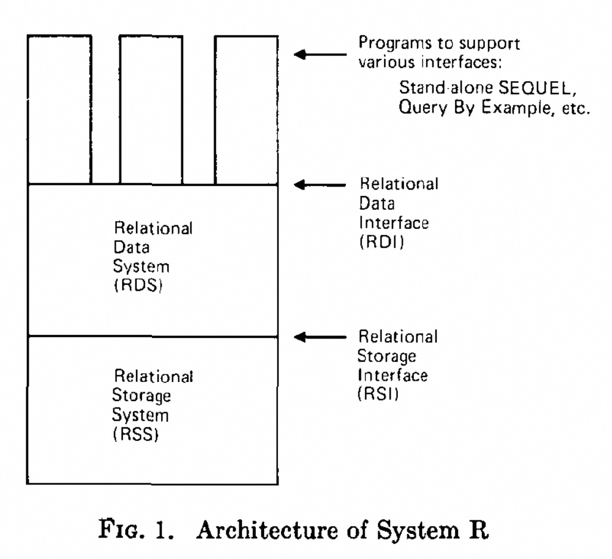
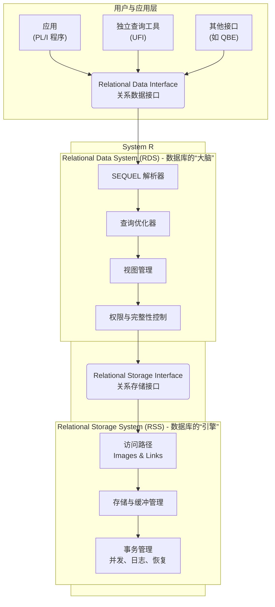
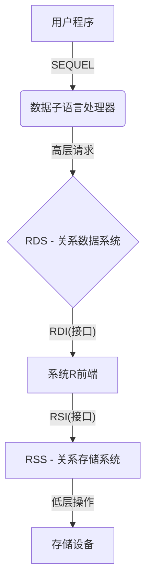

## AI论文解读 | System R: Relational Approach to Database Management
        
### 作者        
digoal        
        
### 日期        
2025-09-22       
        
### 标签        
PostgreSQL , PolarDB , DuckDB , AI , 论文解读        
        
----        
        
## 背景  
      
https://www.seas.upenn.edu/~zives/cis650/papers/System-R.PDF        
  
提示:          
```          
读懂《System R: Relational Approach to Database Management》这篇论文需要提前掌握哪些基础知识, 请使用中文通熟易懂的讲解这些基础知识, 可以引用论文中的图、表或使用Markdown支持的图形(text,mermaid等)增加解释性. 
  
使用中文通熟易懂的解读《System R: Relational Approach to Database Management》这篇论文, 其中的关键内容请着重讲解, 可以引用论文中的图、表或使用Markdown支持的图形(text,mermaid等)增加解释性. 
  
提取《System R: Relational Approach to Database Management》这篇论文中的重要术语, 使用中文对这些术语进行通熟易懂的讲解, 可以引用论文中的图、表或使用Markdown支持的图形(text,mermaid等)增加解释性. 
```     
  
## 1 前置知识 
  
首先，理解这篇名为《System R: Relational Approach to Database Management》的论文，需要掌握一些核心的数据库基础知识。这篇论文发表于1976年，是关系型数据库领域的一篇奠基性文献，它描述了第一个完整实现关系模型的数据库管理系统——System R的设计与架构 。

### 论文阅读基础知识要点

1.  **关系模型（Relational Model）**
    这是最核心的基础。你需要理解E.F. Codd在1970年提出的关系模型，它将数据组织成表格（即关系）的形式。关系模型的核心概念包括：

      * **关系（Relation）**：对应于表。
      * **元组（Tuple）**：对应于表中的行。
      * **属性（Attribute）**：对应于表中的列。
      * **关系代数（Relational Algebra）**：这是一组操作，用于对关系进行查询和操作，例如选择（SELECT）、投影（PROJECT）、连接（JOIN）等 。论文中提到了 **JOIN** 操作 ，并给出了一个示例，这正是关系代数中的核心概念。

2.  **非过程化语言（Nonprocedural Language）**
    这篇论文的一个关键目标是提供一种高级、非过程化的数据子语言（Data Sublanguage）来访问数据 。这意味着用户只需要描述“想要什么”数据，而不是“如何”获取这些数据。你需要了解：

      * **SEQUEL**：System R使用的语言，它是 **SQL**（Structured Query Language）的前身 。论文附录中给出了SEQUEL的语法 ，并用大量示例来展示其数据操作、定义和控制功能 。例如，论文展示了如何用 `SELECT`、`FROM`、`WHERE`、`GROUP BY` 和 `HAVING` 子句进行复杂查询 。

3.  **数据库系统架构**
    论文详细介绍了System R的整体架构，这对于理解现代数据库系统至关重要 。架构被分为两个主要组成部分：

      * **关系数据系统（Relational Data System, RDS）**：这是上层系统，处理用户的查询和数据定义。它包含查询优化器（Optimizer），负责将用户的高级SEQUEL查询转换为高效的执行计划 。
      * **关系存储系统（Relational Storage System, RSS）**：这是底层系统，负责数据的物理存储和管理，包括设备管理、空间分配、缓冲区管理、事务一致性、并发控制和恢复机制 。
        论文中引用了下图来解释其架构 。
      * **Relational Data Interface (RDI)**: 连接RDS与上层用户程序或接口的API 。
      * **Relational Storage Interface (RSI)**: 连接RDS和RSS的内部接口，提供元组级的操作 。

4.  **查询优化器（Optimizer）**
    这是System R的核心创新之一 。优化器的任务是为每个查询选择最佳的执行路径 。你需要了解优化器的基本原理，例如：

      * **访问路径（Access Path）**：获取数据的不同方法，例如全表扫描或通过索引 。
      * **图像（Images）和链接（Links）**：System R为优化查询而设计的特殊访问路径，前者是基于索引的有序访问 ，后者是基于指针链的连接访问 。

5.  **并发控制与恢复（Concurrency Control and Recovery）**
    这篇论文也是最早完整讨论多用户并发访问和系统恢复的文献之一 。你需要理解：

      * **事务（Transaction）**：被视为一个原子操作序列，要么全部成功，要么全部失败 。
      * **锁（Locking）**：System R使用动态锁层次协议（Dynamic Lock Hierarchy Protocol）来管理并发访问，可以在不同粒度（如段、关系、元组）上设置锁 。
      * **日志（Logging）**：用于记录数据修改，以支持事务恢复（回滚）和系统恢复 。

-----

如果你想更深入地了解这篇论文，我们可以重点探讨它的某个部分，比如System R如何实现查询优化，或者它是如何处理多用户并发访问的？
  
## 2 解读论文 
  
好的，我们来一起深入解读这篇数据库领域的里程碑式论文——《System R: Relational Approach to Database Management》。这篇论文描述了 IBM 研究院在 20 世纪 70 年代构建的一个实验性数据库系统，它的许多设计思想和技术创新，如 SQL 语言、基于成本的查询优化、事务处理等，都直接奠定了现代关系型数据库的技术基础。

简单来说，**System R 的目标就是证明 E.F. Codd 提出的关系数据库模型不仅在理论上是优越的，在实践中也能构建出功能完备、性能强大的真实系统** 。

-----

### **核心架构：优雅的双层设计**

System R 最经典的设计就是其清晰的分层架构，它将复杂的数据库系统拆分为两个主要的、功能内聚的子系统：**关系数据系统 (RDS)** 和 **关系存储系统 (RSS)**。这种分层解耦的思想极大地影响了后来的数据库设计 。

我们可以用下图来直观地理解这个结构，它改编自论文中的图1 ：   



  * **关系数据系统 (Relational Data System - RDS)**：这是系统的高层，相当于数据库的“**大脑**”。它面向用户和应用程序，负责理解用户的意图（比如处理 SQL 查询），并制定出最高效的执行策略 。
  * **关系存储系统 (Relational Storage System - RSS)**：这是系统的底层，是数据库的“**引擎室**”和“**仓库**”。它不关心复杂的查询逻辑，只专注于如何高效、可靠地管理和存取数据，并为上层 RDS 提供底层的操作支持 。

这两个子系统之间通过定义良好的内部接口进行通信：

  * **RDI (Relational Data Interface)**：RDS 暴露给外部应用的高级接口 。
  * **RSI (Relational Storage Interface)**：RSS 提供给 RDS 的底层接口，操作单位是单个元组（即表中的一行）。

-----

### **关键内容详解**

接下来，我们着重讲解 System R 中几个最具开创性的关键内容。

#### **1. RDS 的核心：查询优化器与 SEQUEL 语言**

##### **SEQUEL (SQL 的前身)**

System R 孕育了 **SEQUEL** (Structured English Query Language)，这是一种高级的、声明式的查询语言 。用户只需要“声明”他们想要什么数据，而无需关心如何从磁盘上一步步地获取这些数据。这极大地提升了数据访问的易用性和数据独立性。

为了让应用程序（如 PL/I 程序）能够处理查询返回的多行结果，System R 引入了至关重要的 **游标 (Cursor)** 概念 。游标就像一个指针，指向查询结果集中的当前行，应用程序可以通过 `FETCH` 命令来逐行读取数据，从而将面向集合的关系操作与面向记录的程序设计语言无缝衔接起来 。

##### **基于成本的查询优化器 (Cost-Based Optimizer)**

这是 System R 对数据库领域**最核心、最深远的贡献**。在此之前，查询的执行路径需要由程序员手动指定，非常低效且容易出错。System R 的优化器首次实现了**基于成本的自动化查询优化** 。

它的工作原理如下：

1.  **生成候选计划**：当收到一条 SEQUEL 查询后，优化器会根据可用的访问路径（如索引）生成多种可能的执行方案 。
2.  **成本估算**：优化器会查询系统目录（System Catalogs）中的统计信息（例如表有多大，某列有多少个唯一值等），然后为每一种执行方案估算一个执行“成本”。这个成本主要量化为**预估的磁盘页面访问次数**（Page Fetches），因为磁盘 I/O 是数据库操作最主要的性能瓶颈 。
3.  **选择最优计划**：最后，优化器会选择那个估算成本最低的计划来执行查询 。

这个机制是革命性的，它将性能优化的重任从程序员身上转移给了数据库系统，使得开发者可以专注于业务逻辑，是数据库智能化的开端。

#### **2. RSS 的基石：存储、事务与并发**

##### **访问路径 (Access Paths)**

为了支持上层优化器选择高效的查询路径，RSS 提供了两种主要的底层数据访问结构：

  * **Images (映像)**：这其实就是我们今天所熟知的**索引 (Index)** 。System R 使用了当时非常先进的 **B-Tree** 结构来维护索引，可以高效地支持精确值查找、范围查找和有序扫描 。一个表可以创建多个 Images。
  * **Links (链接)**：这是一种通过**指针链**直接连接不同表中相关元组的物理结构 。它非常适合实现**关系连接 (Join)** 操作，尤其是在需要频繁导航的场景下（例如，从一个部门找到其下所有员工）。通过链接，系统可以从一个“父”元组快速跳转到所有“子”元组，避免了额外的索引查找或全表扫描。

##### **事务管理与恢复**

System R 实现了一套非常完整的事务管理机制，确保了数据的可靠性和一致性。

  * **日志 (Logging)**：系统会记录下所有对数据的修改操作，并将这些日志条目写入一个专门的日志段中 。日志是实现事务回滚和系统崩溃后恢复的基础。
  * **多点恢复 (Multi-point Recovery)**：一个事务内部可以设置多个**保存点 (Save Point)** 。如果后续操作出错，事务可以选择回滚到任意一个保存点，而不需要撤销整个事务，这对于长事务应用非常有用 。
  * **影子分页 (Shadow Paging)**：这是一种非常巧妙的系统恢复技术。对于需要恢复的数据段，RSS 维护两套页地址映射表：`current` 和 `backup` 。当修改一个数据页时，RSS **不会在原位置修改**，而是会分配一个新磁盘块写入修改后的数据，并只更新 `current` 映射 。
      * **检查点 (Checkpoint)**：系统定期将所有内存中的修改刷回磁盘，然后将 `backup` 映射更新得和 `current` 一致 。
      * **系统恢复**：如果系统崩溃，恢复过程非常快。只需丢弃 `current` 映射，直接启用 `backup` 映射，数据库就瞬间回到了上一个一致的状态 。之后再利用日志来重做（Redo）已提交的事务和撤销（Undo）未完成的事务 。

##### **并发控制与多级一致性**

为了让多个用户能同时安全地访问数据库，System R 实现了一套**自动的、基于锁的并发控制机制** 。其中一个重大创新是提出了**三种一致性级别 (Consistency Levels)**，允许用户在性能开销和数据隔离性之间做出权衡 ：

  * **Level 1 (读未提交)**：隔离性最弱，可能读到其他事务未提交的“脏数据”，但并发性能最好 。
  * **Level 2 (读已提交)**：保证只能读到已经提交的数据，避免了“脏读”，但可能发生“不可重复读”（同一事务内两次读取同一行数据，结果可能不同）。
  * **Level 3 (可重复读)**：隔离性最强。确保在一个事务内，所有读取操作看到的数据就像一个快照，不会被其他并发事务所干扰 。这提供了逻辑上单用户系统的体验，避免了“不可重复读”和“幻读”问题。

这种对一致性级别的划分，以及锁层次（Lock Hierarchy，即可以对整个表、也可以对单个元组加锁）的设计思想，已成为所有现代数据库的标准配置 。

-----

### **总结与影响**

System R 项目是一次伟大的工程实践，它不仅仅是一篇论文，更是一个坚实的系统原型。它的成功向世界证明了关系模型的巨大潜力，并用一系列开创性的技术（SQL、查询优化、事务处理）定义了现代关系型数据库的核心形态。可以说，没有 System R，就没有今天繁荣的数据库产业。

这篇论文的价值在于它详细阐述了如何将精妙的理论转化为一个复杂的、可用的、高性能的工程系统，其中的设计权衡与解决方案，至今读来仍能给人深刻的启发。

您是想深入了解 System R 的某一个特定方面，比如它的查询优化算法细节、锁机制的具体实现，还是想了解它与后来的商业数据库（如 IBM DB2 或 Oracle）之间的技术传承关系？
  
## 3 术语 
  
好的，我将根据《System R: Relational Approach to Database Management》这篇论文的内容，为您提取并解释其中的重要术语。这些术语是理解整个System R系统设计和架构的关键。

### 论文核心术语解析

#### 1\. **关系模型（Relational Model）**

这是论文的基础。它是一种将数据组织成二维表格（**关系**）的逻辑模型。

  - **关系（Relation）**: 在论文中，这对应于一个**表**。例如，一个“员工”关系可以是一个员工信息表。
  - **元组（Tuple）**: 对应于表中的**行**，代表一条记录。比如，员工表中的一行数据就是一个元组。
  - **属性（Attribute）**: 对应于表中的**列**，代表数据的某个字段。例如，员工表中的“姓名”、“工号”等都是属性。

关系模型的目标是实现数据的**逻辑独立性**，即用户可以不关心数据在物理上是如何存储的。

-----

#### 2\. **SEQUEL**

  - **非过程化语言（Nonprocedural Language）**: 这是System R使用的一种高级数据语言。它的核心思想是用户只需要告诉系统“**想要什么**”数据（What），而不用指定“**如何**”获取（How）。
  - **SEQUEL**: 它是Structured English Query Language的简称，也是现代SQL语言的直接前身。论文的附录详细介绍了它的语法，例如使用 `SELECT`、`FROM`、`WHERE` 等子句来查询数据。这种声明式语言极大地简化了数据库操作。

-----

#### 3\. **系统架构（System Architecture）**

System R的架构是一个非常重要的概念，它将整个系统分为清晰的两层。

  - **关系数据系统（Relational Data System, RDS）**: 位于上层，是整个系统的“大脑”。它负责处理用户的SEQUEL查询，进行**权限管理、完整性检查、视图定义**，以及最重要的——**查询优化**。
  - **关系存储系统（Relational Storage System, RSS）**: 位于下层，是整个系统的“存储引擎”。它负责管理数据的物理存储，包括**设备管理、空间分配、缓冲区管理、事务管理、并发控制和恢复**。它通过一个被称为 **RSI (Relational Storage Interface)** 的低级接口与RDS通信。

论文中描述的系统架构可以用如下简化图来表示，它展示了各组件之间的分层关系：



-----

#### 4\. **查询优化器（Optimizer）**

这是System R的标志性创新。当RDS收到一个查询时，**查询优化器**会生成多种可能的执行计划，并选择一个最有效的来执行。

  - **访问路径（Access Path）**: 指的是获取数据的不同方法，例如：
      - **全表扫描（Table Scan）**: 遍历整个表来查找数据。
      - **索引访问（Index Access）**: 使用索引来快速定位数据，这通常更高效。
  - **Images 和 Links**: 论文中提到的两种特殊的物理访问路径，`Images` 类似于现代的**聚集索引**，能够按特定顺序快速访问数据；`Links` 则是用于加速**连接**操作的内部指针链。

-----

#### 5\. **并发控制与恢复（Concurrency Control and Recovery）**

这是确保多用户环境下数据正确性和系统可靠性的重要机制。

  - **事务（Transaction）**: 一个逻辑上的原子工作单元。一个事务要么完全执行成功，要么完全失败，不会留下中间状态。
  - **锁（Locking）**: System R使用动态锁协议来管理并发访问，防止数据不一致。锁可以应用于不同粒度的数据，例如整个表、某个元组或索引条目。
  - **日志（Logging）**: 系统使用日志来记录所有数据修改，这使得当系统发生故障时，可以回滚未完成的事务，或者恢复到故障发生前的状态。

-----

这些术语构成了 System R 作为一个完整数据库管理系统的核心框架。您想进一步了解System R是如何通过**查询优化**来显著提高性能的吗？
  
## 参考        
         
https://www.seas.upenn.edu/~zives/cis650/papers/System-R.PDF    
        
<b> 以上内容基于DeepSeek、Qwen、Gemini及诸多AI生成, 轻微人工调整, 感谢杭州深度求索人工智能、阿里云、Google等公司. </b>        
        
<b> AI 生成的内容请自行辨别正确性, 当然也多了些许踩坑的乐趣, 毕竟冒险是每个男人的天性.  </b>        
    
#### [期望 PostgreSQL|开源PolarDB 增加什么功能?](https://github.com/digoal/blog/issues/76 "269ac3d1c492e938c0191101c7238216")
  
  
#### [PolarDB 开源数据库](https://openpolardb.com/home "57258f76c37864c6e6d23383d05714ea")
  
  
#### [PolarDB 学习图谱](https://www.aliyun.com/database/openpolardb/activity "8642f60e04ed0c814bf9cb9677976bd4")
  
  
#### [PostgreSQL 解决方案集合](../201706/20170601_02.md "40cff096e9ed7122c512b35d8561d9c8")
  
  
#### [德哥 / digoal's Github - 公益是一辈子的事.](https://github.com/digoal/blog/blob/master/README.md "22709685feb7cab07d30f30387f0a9ae")
  
  
#### [About 德哥](https://github.com/digoal/blog/blob/master/me/readme.md "a37735981e7704886ffd590565582dd0")
  
  

  
