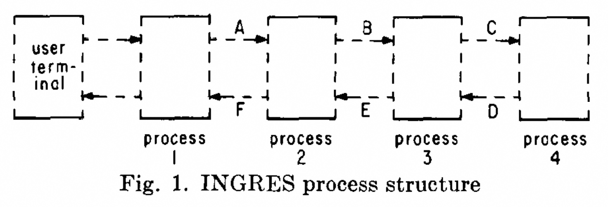
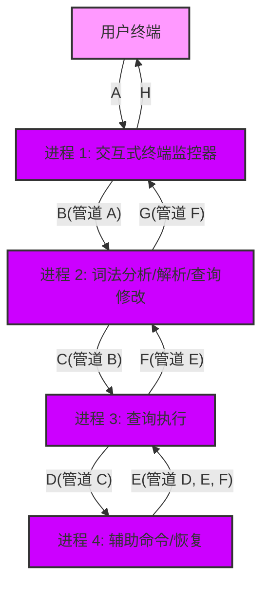
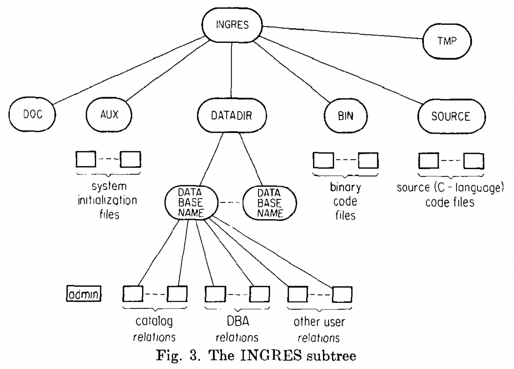

## AI论文解读 | The Design and Implementation of INGRES
        
### 作者        
digoal        
        
### 日期        
2025-09-25       
        
### 标签        
PostgreSQL , PolarDB , DuckDB , AI , 论文解读        
        
----        
        
## 背景  
      
https://dl.acm.org/doi/pdf/10.1145/320473.320476        
  
提示:          
```          
读懂《The Design and Implementation of INGRES》这篇论文需要提前掌握哪些基础知识, 请使用中文通熟易懂的讲解这些基础知识, 可以引用论文中的图、表或使用Markdown支持的图形(text,mermaid等)增加解释性. 
  
使用中文通熟易懂的解读《The Design and Implementation of INGRES》这篇论文, 其中的关键内容请着重讲解, 可以引用论文中的图、表或使用Markdown支持的图形(text,mermaid等)增加解释性. 
  
提取《The Design and Implementation of INGRES》这篇论文中的重要术语, 使用中文对这些术语进行通熟易懂的讲解, 可以引用论文中的图、表或使用Markdown支持的图形(text,mermaid等)增加解释性. 
```     
  
## 1 前置知识 
  
阅读《The Design and Implementation of INGRES》这篇论文需要提前掌握以下几类基础知识，这些知识构成了理解该数据库系统设计与实现的核心。

### 1\. 关系数据库模型 (Relational Database Model)

论文的核心是INGRES作为一个关系型数据库管理系统。因此，你需要了解关系模型的基本概念，这是所有后续讨论的基石。

  * **关系 (Relations)** : 关系可以理解为**表 (tables)** 。每个表都有一个唯一的名称，并由行和列组成。例如，论文中用 `EMPLOYEE` 和 `DEPT` 表来举例 。
  * **元组 (Tuples)** : 元组可以理解为**行 (rows)** 。每个元组代表表中的一条记录。
  * **域 (Domains)** : 域可以理解为**列 (columns)** 。每个域都有一个唯一的名称和数据类型（如整数、浮点数、字符串等）。例如，`EMPLOYEE` 表的域包括 `NAME`, `DEPT`, `SALARY`, `MANAGER`, `AGE` 。

### 2\. UNIX操作系统基础 (UNIX Operating System Fundamentals)

INGRES系统是基于1976年的UNIX操作系统实现的，其设计大量依赖于UNIX的特性。

  * **文件系统 (File System)** : UNIX的文件系统采用树形结构。INGRES的数据库文件、系统目录（如 `catalog`）和用户关系（`relations`）都以UNIX文件的形式存在 。
  * **进程与进程间通信 (Process & Interprocess Communication)** : UNIX的进程是工作的基本单位。INGRES被设计成一个由多个进程构成的系统，这些进程之间通过 **管道 (pipes)** 进行单向通信 。

你可以使用 Mermaid 图表来直观地理解INGRES的进程结构，如图1所示。   



  * **进程 1**: 负责与用户交互，接收、编辑和执行INGRES命令 。
  * **进程 2**: 进行词法分析和解析，并处理完整性控制、视图和保护等查询修改功能 。
  * **进程 3**: 执行 `RETRIEVE`、`REPLACE`、`DELETE`、`APPEND` 等命令，并负责查询分解 。
  * **进程 4**: 运行各种辅助命令，如 `CREATE`、`DESTROY`、`INDEX`，并进行恢复操作 。

### 3\. 查询语言 (Query Languages)

论文详细描述了INGRES的两种非过程式数据子语言。

  * **QUEL (QUEry Language)** : QUEL是一种非过程式查询语言，与SQL的前身SEQUEL等语言类似。它的特点是使用`RANGE`语句定义元组变量，然后通过`RETRIEVE`、`APPEND`、`REPLACE`或`DELETE`等命令对数据进行操作 。

  * **EQUEL (Embedded QUEL)** : EQUEL是将QUEL嵌入到通用编程语言C中的一种新语言。它允许你在C程序中使用QUEL语句来访问和处理数据库中的数据 。

### 4\. 数据库系统内部机制 (Database Internal Mechanisms)

  * **访问方法 (Access Methods)** : INGRES支持多种存储结构，包括 **`hashed` (哈希)** 、 **`ISAM` (索引顺序访问方法)** 和 **`heap` (堆)** 等。理解这些方法如何影响数据的存储和检索性能，对理解论文中关于性能和权衡的讨论非常重要 。
  * **查询处理 (Query Processing)** : 论文详细介绍了INGRES如何处理复杂的查询，特别是 **查询分解 (query decomposition)** 技术。这个过程会将多变量的查询分解成一系列更简单的单变量查询来执行 。
  * **并发控制和恢复 (Concurrency Control & Recovery)** : 论文讨论了在多用户系统中如何处理并发更新。INGRES采用了 **“原子性 (atomic)”事务** 和 **“延迟更新 (deferred update)”** 机制来确保数据的一致性 。

-----

这些基础知识覆盖了论文中的关键概念。如果你想深入了解其中某个方面，比如INGRES如何具体执行查询分解，或者它的访问方法如何工作，我可以提供更详细的解释。

《The Design and Implementation of INGRES》论文中对 **查询分解 (Query Decomposition)** 的描述是系统最核心的部分之一。查询分解的目的是将复杂的多变量查询（如一个包含多个表连接的查询）转化为一系列更简单、可以独立执行的单变量查询。这个过程主要分为以下几个步骤：

-----

### 查询分解的执行步骤

INGRES的查询分解算法，如论文中图3所示，主要包括四个阶段：   

#### 1\. 变量替换 (Variable Substitution)

这个阶段将复杂的、包含多个变量的查询，通过**变量替换**和**元组变量的替换**等方式进行简化。

#### 2\. 联接图生成 (Joint Graph Generation)

INGRES将查询中的所有**变量**（或**关系**）视为图的**节点**，将查询中的所有**连接**（或**限制条件**）视为图的**边**。通过分析这些关系，系统会生成一个**联接图**。这个图直观地表示了查询中各部分之间的依赖关系。

#### 3\. 联接图遍历 (Joint Graph Traversal)

在生成联接图后，系统会遍历这个图。遍历的目的是找到最佳的执行顺序，即**确定哪些联接可以最先进行，以减少中间结果集的大小**。

#### 4\. 元组变量替换 (Tuple Substitution)

这是查询分解的核心。在这个阶段，系统会选择一个联接图中的节点（一个关系），并用一个**单变量查询**来替换它。这个单变量查询的结果集会用于后续的查询执行。这个过程会不断重复，直到所有变量都被替换掉，最初的复杂查询被转化为一个或多个单变量查询。

-----

### 举例说明：如何分解一个查询

假设我们有一个查询，要找出**在“Toys”部门工作，并且工资高于其部门经理的员工**。用QUEL语言可能类似这样：

```quel
RANGE OF E IS EMPLOYEE
RANGE OF D IS DEPT
RETRIEVE (E.all)
WHERE E.dept = D.dept
  AND E.salary > D.manager.salary
  AND D.dname = "Toys"
```

这是一个典型的**多变量查询**，涉及到 `EMPLOYEE` 和 `DEPT` 两个关系。

INGRES会这样分解它：

1.  **处理限制条件**：首先，处理最简单的限制条件，即 `D.dname = "Toys"`。这会生成一个简单的单变量查询，找出 `DEPT` 表中部门名为“Toys”的元组。
2.  **替换变量**：将上一步查询的结果，即部门名为“Toys”的部门元组，替换掉 `D` 变量。
3.  **简化查询**：现在，查询变成了一个只涉及 `EMPLOYEE` 表的单变量查询。
4.  **最终执行**：最后，系统执行这个简化的查询，找出符合条件的员工。

通过这种分解，复杂的、多变量的查询被逐步简化，最终变成了更容易处理的单变量操作，从而提高了查询效率。

-----

这个过程是INGRES在当时非常新颖和重要的贡献。它展示了如何通过系统化的算法来优化查询，而不是简单地按原样执行。

你对INGRES的查询分解还有其他疑问吗？比如，想了解更多关于联接图的具体工作方式，或者它如何选择最佳的执行顺序？

《The Design and Implementation of INGRES》论文中对并发控制的描述是：INGRES通过**“延迟更新 (deferred update)”** 机制和**“原子性 (atomic)”事务** 来实现多用户环境下的并发控制。

### 1. 延迟更新 (Deferred Update)
* **核心思想**：INGRES不会在事务执行期间立即将修改写入数据库的原始文件中，而是将所有修改都写到一个**日志文件 (log file)** 或**工作区 (workspace)** 中。只有当事务成功提交时，系统才会将这些修改从日志文件应用到原始数据库文件中。
* **好处**：
    * **简化恢复**：如果一个事务在完成之前失败了（比如系统崩溃），因为原始数据库文件没有被修改，所以恢复非常简单，只需忽略日志文件中的未完成记录即可。
    * **减少死锁**：由于锁定的粒度可以更粗，减少了不同事务之间对同一资源的竞争，从而降低了死锁的可能性。

### 2. 锁机制 (Locking)
* **锁的粒度**：INGRES通过对**整个关系**（即整个表）进行加锁来控制并发。当一个事务需要修改某个关系时，它会请求对该关系加一个**独占锁 (exclusive lock)** 。
* **锁的类型**：
    * **读锁 (Shared Lock)** ：多个事务可以同时持有读锁，允许它们读取同一个关系。
    * **写锁 (Exclusive Lock)** ：只有一个事务可以持有写锁，以防止其他事务在它修改数据时进行读取或写入。
* **锁的实现**：
    * **用户级锁 (User-level Locking)** ：锁的请求和释放由用户进程自己管理。
    * **锁表 (Lock Table)** ：INGRES维护了一个锁表来记录每个关系上的锁状态，当有新的锁请求时，系统会检查这个锁表以决定是否授予锁。

### 3. 原子性事务 (Atomic Transactions)
* **核心思想**：原子性保证了事务中的所有操作要么**全部完成**，要么**全部不执行**。 INGRES使用前面提到的**延迟更新**和**日志文件**来实现这个特性。
* **实现过程**：
    * **事务开始**：事务开始时，INGRES在日志文件中记录“事务开始”的标记。
    * **数据修改**：事务中的所有修改操作都只写入日志文件。
    * **事务提交**：如果所有操作都成功完成，INGRES在日志文件中写入“事务提交”的标记，然后将日志中的修改应用到原始数据库。
    * **事务回滚**：如果事务在任何时候失败，INGRES只需丢弃日志文件中的未完成记录，原始数据库不受影响，实现了事务的原子性回滚。

总的来说，INGRES的并发控制策略相对简单，通过**延迟更新**和**粗粒度的全表锁定**来实现。这种设计在当时是出于对性能和实现复杂度的权衡，但在如今的高并发系统中已经不太适用，现代数据库通常会采用更细粒度的锁（如行级锁）。

你对INGRES的并发控制还有其他疑问吗？比如想知道它在处理死锁时有什么特别的方法吗？

根据《The Design and Implementation of INGRES》这篇论文，INGRES处理死锁的方法相对简单，主要依赖于**超时 (timeout)** 机制和**事务终止 (abort)** 。

### INGRES的死锁处理机制

INGRES的死锁处理不像现代数据库那样复杂，它不进行死锁检测，而是采用一种更直接的、基于“**先到先得**”的策略。

1.  **超时机制**: INGRES为每个事务的锁请求设置了**超时时间**。当一个事务请求一个锁（例如对某个关系表的独占锁），如果这个锁已经被另一个事务持有，该请求就会进入等待状态。如果等待时间超过了预设的**超时时间**，系统就会认为可能发生了死锁。

2.  **事务终止**: 一旦锁请求超时，INGRES会立即**终止 (abort)** 正在等待的事务。这意味着该事务的所有操作都将被撤销，并且**回滚**到它开始之前的状态。被终止的事务会向用户返回一个错误信息，用户需要重新提交这个事务。

### 为什么选择这种方法？

这种简单的方法是当时设计上的一个权衡：

* **实现简单**: 相比于复杂的死锁检测算法（比如构建等待图），超时机制实现起来要简单得多，减少了系统的开销和复杂性。
* **性能考量**: 当时计算机的性能有限，运行一个复杂的死锁检测程序会占用宝贵的系统资源。通过简单地终止事务，可以迅速释放被占用的资源，避免系统陷入停滞。

总的来说，INGRES并没有一个专门的死锁检测或预防机制，它依赖于 **“超时-终止-重试”** 的模式来处理死锁。如果一个事务因为死锁而无法继续，它会被强制回滚，然后可以由用户重新执行。

---

关于这篇论文，你还想了解哪些方面？例如，INGRES是如何进行数据恢复的，或者它的数据结构是如何设计的？
  
## 2 解读论文 
  
好的，我们来一起解读这篇数据库领域的经典论文——《The Design and Implementation of INGRES》。这篇论文发表于1976年，介绍了INGRES这个开创性的关系型数据库管理系统。可以把它看作是现代很多数据库系统的“老前辈”。

为了让你能更轻松地理解，我会将论文的核心内容拆解成几个关键部分，并用通俗的语言和图示来解释。

### **核心思想：在UNIX上构建的多进程关系型数据库**

INGRES的全称是“交互式图形与检索系统”（Interactive Graphics and Retrieval System）。它最大的特点是完全构建在UNIX操作系统之上，并巧妙地利用了UNIX的特性 。与今天我们常见的单一、庞大的数据库服务进程不同，INGRES被设计成一组协同工作的独立进程，通过UNIX的“管道”（pipes）进行通信 。

这种设计的初衷很大程度上是受限于当时PDP-11计算机的内存限制（例如，64KB的地址空间）。把不同功能的模块拆分成独立的进程，可以有效解决单个进程无法装载所有功能代码的问题。

-----

### **INGRES的架构：四进程流水线**

当用户执行一个查询时，INGRES会启动一个由四个进程组成的“流水线”来处理这个请求。你可以把这个过程想象成一个工厂的流水线，每个工位（进程）负责一道特定的工序。

论文中的图1（Figure 1）清晰地展示了这个结构 ，我们可以用一个简单的文本图来复现它：    

```text
               (A)           (B)           (C)
[用户终端] <---> [进程1] -----> [进程2] -----> [进程3] -----> [进程4]
   ^              |             |             |             |
   |______________|_____________|_____________|_____________|
       (F, E, D)  错误和数据回传
```

  * **进程1：交互式终端监视器 (Interactive Terminal Monitor)** 

      * **作用**：这是用户的直接交互界面。你可以在这里输入、编辑和执行查询命令 。当命令准备好后，它会作为一个字符串通过管道A发送给下一个进程 。

  * **进程2：解析与查询修改 (Parser & Query Modification)** 

      * **作用**：这个进程接收来自进程1的命令字符串。它首先进行**词法分析和语法解析**，将文本命令转换成计算机能理解的内部数据结构（查询树）。
      * **关键点：查询修改 (Query Modification)** 。这是INGRES的一个核心创新。在正式执行查询前，这个进程会自动修改用户的查询树，以强制执行**完整性约束**、**权限控制**和**视图（Views）** 。例如，如果存在一个“员工工资必须大于0”的完整性规则，那么在执行一个修改工资的命令时，进程2会自动在这个命令里追加上 `AND new_salary > 0` 的条件 。

  * **进程3：查询分解与执行 (Decomposition & Execution)** 

      * **作用**：这是查询处理的核心。它接收进程2处理过的查询树。
      * **关键点：查询分解 (Decomposition)** 。如果一个查询涉及到多个数据表（在论文中称为“关系”），这个进程会把它分解成一系列只涉及单个表的简单查询 。这个过程采用了“**元组替换**”（Tuple Substitution）等技术 ，我们稍后会详细讲。
      * **单变量查询处理器 (OVQP)** ：分解后的单表查询会由这个模块处理，它负责调用底层的存取方法来获取数据。

  * **进程4：实用工具集 (Utilities)** 

      * **作用**：这个进程包含了各种数据库管理工具，比如创建/销毁数据库和数据表（`CREATEDB`, `CREATE`）、数据导入导出（`COPY`）、修改存储结构（`MODIFY`）以及数据恢复（`RESTORE`）等功能 。它还负责执行**延迟更新**（Deferred Update），确保数据修改的原子性和一致性。

-----

### **查询语言：QUEL 和 EQUEL**

INGRES使用一种名为**QUEL**（QUEry Language）的查询语言 。它和我们今天熟知的SQL在理念上很相似，都是非过程化的语言，用户只需声明“想要什么”，而无需关心“如何获取”。

一个典型的QUEL查询包含两个部分：

1.  **RANGE**：定义一个“元组变量”，让它代表某个关系（表）中的一行数据 。
2.  **命令 (RETRIEVE, APPEND, REPLACE, DELETE)** ：指定要做的操作，并用 `WHERE` 子句来过滤数据 。

**举个例子**：查找在一楼工作且名叫 "Jones" 的员工，并给他加薪10%。

```quel
-- 定义两个变量，E 代表员工表的一行，D 代表部门表的一行
RANGE OF E IS EMPLOYEE
RANGE OF D IS DEPT

-- 更新E所代表的员工元组
REPLACE E(SALARY = 1.1 * E.SALARY)
WHERE E.NAME = "Jones" 
  AND E.DEPT = D.DEPT 
  AND D.FLOOR = 1
```


为了让数据库能与通用编程语言（当时主要是C语言）结合，INGRES还提供了**EQUEL**（Embedded QUEL）。它允许开发者将QUEL语句直接嵌入到C语言程序中，只需在语句前加上 `##` 前缀即可 。这极大地增强了应用程序的开发能力。

-----

### **核心技术：查询分解 (Decomposition)**

这是论文的精华之一。处理多表查询（例如上面那个加薪的例子）的效率至关重要。INGRES的策略不是直接计算所有表的笛卡尔积（这会产生海量数据），而是通过分解来逐步缩小范围。

主要使用两种技术：

1.  **单变量分离 (One-variable Detachment)** 

      * 如果查询中有一个条件只涉及单个表（例如 `D.FLOOR = 1` 和 `E.AGE > 40`），系统会先执行这个单表查询，并将结果存到一个临时表中 。
      * 在后续的查询中，就用这个更小的临时表来替代原来的大表，从而大大减少了需要处理的数据量 。

2.  **元组替换 (Tuple Substitution)** 

      * 当无法再进行单变量分离时，系统会选择一个变量（通常是数据量最小的那个表所对应的变量）。
      * 然后，它会遍历这个表中的每一行（元组），将每一行的具体值代入到原始查询中，从而将查询的变量数量减少一个 。这个过程会递归进行，直到查询变成只有一个变量的简单查询，然后交由OVQP处理 。

这个分解算法虽然不是在所有情况下都是最优的，但它非常巧妙地将一个复杂的多表查询问题，转化成了一系列可以高效执行的单表查询 。

-----

### **存储与存取方法**

INGRES为数据表提供了五种不同的物理存储结构，用户可以通过 `MODIFY` 命令来更改，以适应不同的查询场景 。

| 存储结构 | 描述 | 适用场景 |
| :--- | :--- | :--- |
| **Heap (堆)** | 无序存放，新数据直接追加到文件末尾 。 | 适合需要全表扫描的小表或临时表 。 |
| **Hashed (哈希)** | 根据主键的哈希值决定存储位置 。 | 适合基于主键的精确等值查询（例如 `WHERE id = 123`）。 |
| **ISAM** | 类似IBM的索引顺序存取方法，数据按主键排序存储 。 | 适合范围查询（例如 `WHERE age > 30 AND age < 40`）。 |
| **Compressed Hash** | 带有数据压缩的哈希存储 。 | 存储利用率更高，但存取时有额外的编解码开销 。 |
| **Compressed ISAM** | 带有数据压缩的ISAM存储 。 | 同上。 |

-----

### **并发控制与恢复**

  * **事务单元**：在INGRES中，一个**单独的QUEL语句**被定义为一个原子性的“事务”。这意味着系统会保证每条命令要么完全成功，要么完全失败，不会出现中间状态。
  * **并发控制**：它采用的是基于**锁**的机制。在执行更新操作前，系统会锁定相关的资源（在当时的实现中，锁的粒度较粗，通常是整个关系）。为了避免死锁，它采用了一种预防策略：一个操作必须在获得所有需要的锁之后才能开始执行 。
  * **恢复机制**：INGRES使用**延迟更新**（Deferred Update）来实现恢复 。所有的更新操作（增、删、改）首先被写入一个临时文件 。当整个QUEL命令成功完成后，进程4才会将这些变更应用到实际的数据文件中 。如果在此过程中系统崩溃，`RESTORE`命令可以检查这个临时文件：如果更新尚未开始，就丢弃它；如果已经开始，就重新完整地执行一遍，从而保证数据的一致性 。

这篇论文全面地介绍了一个具有里程碑意义的数据库系统的设计与实现，其中的许多思想，如查询修改、多样的存储引擎以及基于管道的模块化设计，都对后来的数据库技术发展产生了深远的影响。

-----

你是否想了解一下，这篇论文中描述的某些设计（比如多进程架构、查询语言QUEL）与我们今天广泛使用的数据库系统（如MySQL或PostgreSQL）相比，有哪些具体的演进和差异？
  
## 3 术语 
  
根据《The Design and Implementation of INGRES》这篇论文，以下是几个重要的核心术语及其通俗易懂的中文讲解：

-----

### 1\. INGRES

  * **术语**: **INGRES**
  * **中文讲解**: INGRES (Interactive Graphics and Retrieval System) 是论文作者在20世纪70年代开发的一个数据库管理系统。你可以把它理解为**一个早期版本的、用关系模型来管理数据的软件系统**。它不是今天我们常用的MySQL或PostgreSQL，但它在当时的研究和设计对后来的关系型数据库产生了深远的影响。论文正是描述了这个系统的具体实现方法。

### 2\. QUEL 与 EQUEL

  * **术语**: **QUEL (QUEry Language)**

  * **中文讲解**: QUEL是INGRES数据库使用的主要**查询语言**。与我们现在常见的SQL语言类似，QUEL是一种“非过程式”语言，意味着你只需要告诉数据库 **“我想要什么数据”** ，而 **不需要告诉它“如何一步步地获取这些数据”** 。例如，如果你想找到所有工资高于某个数字的员工，你只需要用QUEL写一条简单的语句，而不用关心数据库底层是如何扫描和查找数据的。

  * **术语**: **EQUEL (Embedded QUEL)**

  * **中文讲解**: EQUEL是QUEL的“嵌入式”版本。想象一下，如果你想在一个C语言程序里操作数据库，你需要一种方法把数据库命令写进C代码里。EQUEL就是为此设计的，它允许你**把QUEL语句直接嵌入到宿主编程语言（如C语言）中**，从而让程序员可以方便地在应用程序中访问和处理数据库中的数据。

### 3\. 查询分解 (Query Decomposition)

  * **术语**: **查询分解 (Query Decomposition)**
  * **中文讲解**: 这是INGRES处理复杂查询的一个核心技术。当用户提交一个包含多个变量的复杂查询时，数据库系统并不能直接执行。**查询分解**的作用就是**把一个复杂的多变量查询，分解成一系列更简单、更易于处理的单变量查询**。这个过程极大地简化了查询的执行，是INGRES查询处理器最重要的算法之一。

### 4\. 访问方法 (Access Methods)

  * **术语**: **访问方法 (Access Methods)**
  * **中文讲解**: **访问方法**指的是数据库中**数据是如何被存储和检索**的。论文中提到了几种方法，比如 **`hashing` (哈希)** 、 **`ISAM` (Indexed Sequential Access Method，索引顺序访问方法)** 和 **`heap` (堆)** 。你可以把它们想象成不同的书架整理方式：
      * **哈希**：像一本字典，通过哈希函数直接计算出数据的位置，查找速度非常快。
      * **ISAM**：像一本带索引的书，你可以先查目录（索引），然后直接翻到那一页（数据位置），适合按顺序查找。
      * **堆**：像一个杂乱无章的箱子，数据被随意地放进去，查找时需要把所有东西都翻一遍，效率最低。

### 5\. 进程结构 (Process Structure)

  * **术语**: **进程结构 (Process Structure)**
  * **中文讲解**: INGRES不是一个单一的巨大程序，而是由多个独立的**UNIX进程**协同工作来完成任务的。这些进程各司其职，并通过 **管道 (pipes)** 进行通信。这种设计的好处是，当一个进程崩溃时，通常不会影响整个系统。论文中的图1（下图）清晰地展示了这种多进程协作的工作方式：

  


  * **每个进程负责不同的任务**：例如，进程1负责与用户交互，进程2负责解析查询，进程3负责执行查询等等。它们通过管道传递数据，就像一条流水线。

-----

希望这些解释能帮助你更好地理解这篇论文。如果你想深入了解其中某个术语，比如INGRES是如何具体执行**查询分解**的，或者**并发控制**是如何实现的，请告诉我。
  
## 参考        
         
https://dl.acm.org/doi/pdf/10.1145/320473.320476    
        
<b> 以上内容基于DeepSeek、Qwen、Gemini及诸多AI生成, 轻微人工调整, 感谢杭州深度求索人工智能、阿里云、Google等公司. </b>        
        
<b> AI 生成的内容请自行辨别正确性, 当然也多了些许踩坑的乐趣, 毕竟冒险是每个男人的天性.  </b>        
    
#### [期望 PostgreSQL|开源PolarDB 增加什么功能?](https://github.com/digoal/blog/issues/76 "269ac3d1c492e938c0191101c7238216")
  
  
#### [PolarDB 开源数据库](https://openpolardb.com/home "57258f76c37864c6e6d23383d05714ea")
  
  
#### [PolarDB 学习图谱](https://www.aliyun.com/database/openpolardb/activity "8642f60e04ed0c814bf9cb9677976bd4")
  
  
#### [PostgreSQL 解决方案集合](../201706/20170601_02.md "40cff096e9ed7122c512b35d8561d9c8")
  
  
#### [德哥 / digoal's Github - 公益是一辈子的事.](https://github.com/digoal/blog/blob/master/README.md "22709685feb7cab07d30f30387f0a9ae")
  
  
#### [About 德哥](https://github.com/digoal/blog/blob/master/me/readme.md "a37735981e7704886ffd590565582dd0")
  
  

  
