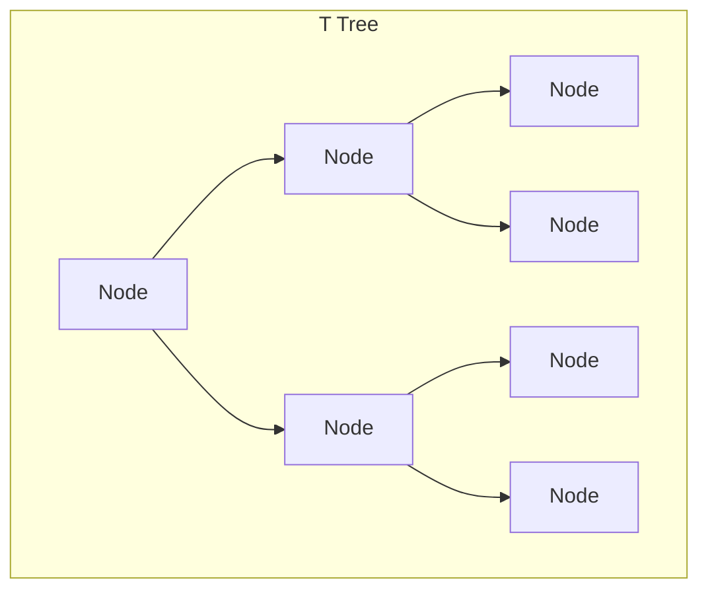
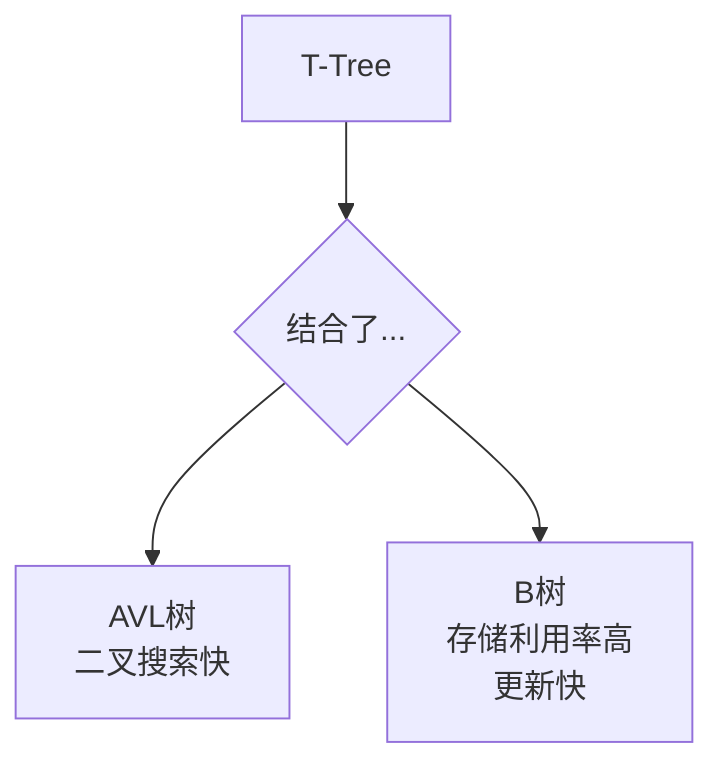

## AI论文解读 | Query Processing in Main Memory Database Management Systems
        
### 作者        
digoal        
        
### 日期        
2025-09-25       
        
### 标签        
PostgreSQL , PolarDB , DuckDB , AI , 论文解读        
        
----        
        
## 背景  
      
https://dl.acm.org/doi/pdf/10.1145/16894.16878        
  
提示:          
```          
读懂《Query Processing in Main Memory Database Management Systems》这篇论文需要提前掌握哪些基础知识, 请使用中文通熟易懂的讲解这些基础知识, 可以引用论文中的图、表或使用Markdown支持的图形(text,mermaid等)增加解释性. 
  
使用中文通熟易懂的解读《Query Processing in Main Memory Database Management Systems》这篇论文, 其中的关键内容请着重讲解, 可以引用论文中的图、表或使用Markdown支持的图形(text,mermaid等)增加解释性. 
  
提取《Query Processing in Main Memory Database Management Systems》这篇论文中的重要术语, 使用中文对这些术语进行通熟易懂的讲解, 可以引用论文中的图、表或使用Markdown支持的图形(text,mermaid等)增加解释性. 
```     
  
## 1 前置知识 
  
这篇名为《内存数据库管理系统中的查询处理》的论文，主要探讨了如何在内存数据库（Main Memory Database）环境下高效地处理查询。这与传统的基于磁盘的数据库系统有很大不同，因为成本和优先级发生了变化。要读懂这篇论文，你需要提前掌握以下几个方面的基础知识：

### 1\. 传统数据库系统基础

在论文的引言部分，作者首先强调了内存数据库与 **基于磁盘的数据库（Disk-based Database）** 之间的区别。为了理解这些区别，你需要了解传统数据库是如何工作的。

  * **数据存储：** 传统数据库将数据存储在磁盘上。
  * **查询处理目标：** 传统数据库查询处理的核心目标是**最小化磁盘I/O（Input/Output）** ，因为磁盘访问是整个系统中**最慢**的操作。

### 2\. 内存数据库的特点

论文的核心就是探讨内存数据库的查询处理问题，因此，你需要理解内存数据库与传统数据库相比有哪些独特之处：

  * **数据存储：** 整个数据库都存储在 **主内存（Main Memory）** 中 。
  * **查询处理目标：** 由于没有磁盘I/O的瓶颈，查询处理的成本因素发生了变化。主要成本不再是磁盘I/O，而是**CPU周期（CPU cycles）和数据移动（data movement）** 。
  * **数据结构：** 论文中提到了内存数据库中可以采用 **指针（pointers）** 来引用数据，而不是像传统数据库那样需要复制数据 。这使得**预计算连接（precomputed joins）** 成为可能，例如，在论文的“Employee Relation”和“Department Relation”的例子中，员工关系可以直接通过指针指向其所属部门的关系，从而避免了传统的连接操作 。

### 3\. 数据结构和索引

论文详细讨论了多种在内存环境中表现优异的数据结构和索引机制 。为了理解它们的优缺点和性能，你需要对以下几种数据结构有基本的了解：

  * **哈希（Hashing）：** 论文中提到了多种哈希方法，例如**线性哈希（Linear Hashing）** 、**可扩展哈希（Extendible Hashing）和改良线性哈希（Modified Linear Hashing）** 。哈希的主要优势是**快速查找** 。
  * **平衡树（Balanced Trees）：** 论文对比了多种树形结构，包括**AVL树（AVL Tree）和B树（B Tree）** 。这些树结构的主要特点是能够保持平衡，以确保查找、插入和删除操作的性能 。
  * **T树（T Tree）：** 这是论文中重点介绍的一种新型平衡树结构，它结合了AVL树和B树的优点 。为了理解T树的工作原理，你需要理解其**内部节点（internal node）** 、 **半叶节点（half-leaf node）** 和**叶节点（leaf node）** 的概念，以及**旋转（rotation）** 和**数据移动（data movement）** 如何实现节点的平衡 。

下面是T树的示意图，展示了其典型的多元素节点结构：



  * **T树节点（T Node）** ：每个T节点内部都包含多个数据项，并且这些数据项是排序好的。搜索时，首先通过二叉树搜索找到包含目标值的节点，然后对节点内部进行二分查找 。这使得它既有**快速的二叉搜索**特性，又有**良好的存储利用率** 。

### 4\. 查询处理操作

论文的核心是分析在内存环境中如何执行基本的查询操作 。理解这些操作需要对关系代数有基本概念，并了解它们的传统实现方式：

  * **选择（Selection）：** 从关系中筛选出符合条件的元组。
  * **投影（Projection）：** 从关系中选择指定的列，并可能需要**去重（duplicate elimination）** 。
  * **连接（Join）：** 将两个或多个关系中的元组连接起来。论文重点对比了多种连接算法，例如**哈希连接（Hash Join）** 、**排序-合并连接（Sort-Merge Join）** 以及基于索引的连接方法 。
  * **嵌套循环连接（Nested Loops Join）：** 论文中明确指出，在内存数据库中，嵌套循环连接的性能通常比其他连接方法**差几个数量级**，不应被视为一个实用的连接方法 。

读懂这篇论文后，你将对内存数据库的架构和查询处理有更深入的理解。你还想了解论文中具体哪一个部分的内容呢？例如，T树的性能测试结果，或者不同连接算法的对比？
  
## 2 解读论文 
  
好的，我们来深入解读《内存数据库管理系统中的查询处理》（Query Processing in Main Memory Database Management Systems）这篇经典的论文。

这篇论文探讨了当整个数据库都存储在主内存（RAM）中时，应如何高效地处理查询。这与传统的基于磁盘的数据库系统有着根本的不同，后者的性能瓶颈主要在于磁盘I/O，而内存数据库的瓶颈则转向了CPU计算和内存访问效率。

-----

### **核心思想：内存环境下的新挑战与新机遇**

传统数据库算法的设计核心是**最小化磁盘访问次数**。但在内存数据库（MM-DBMS）中，数据访问速度极快，磁盘I/O不再是主要矛盾。新的成本因素变为了**CPU周期**（例如，数据比较次数）和**数据移动量**。因此，我们需要重新审视和设计查询处理的算法。 

这篇论文提出的核心架构（MM-DBMS）正是基于这一理念，并在**选择（Selection）** 、**连接（Join）** 和 **投影（Projection）** 这三个核心关系操作上，对多种算法进行了全面的性能评测。

-----

### **MM-DBMS 架构设计**

论文设计了一个专为内存环境优化的数据库管理系统架构，其关键特点如下：

1.  **数据结构与存储**

      * **关系（Relations）** ：数据不再通过磁盘页面来组织，而是被划分为"分区"（Partition）。所有对关系的访问都必须通过索引进行，这简化了数据管理。  元组（Tuple）的地址在存入后就不会改变，这使得可以直接使用内存指针来引用数据。 
      * **预计算连接（Precomputed Joins）** ：对于外键关系，系统可以直接用一个指向另一张表元组的**指针**来代替外键字段。  这样做不仅节省空间，更极大提升了连接查询的效率，因为连接操作在数据加载时就已经“预计算”好了。 
      * **索引（Indices）** ：由于数据常驻内存，索引无需存储实际的属性值，只需存储指向元组的**指针**即可。  这大大减小了索引的大小，并简化了对变长字段和多字段索引的处理。 
      * **临时列表（Temporary Lists）** ：查询的中间结果以“临时列表”的形式存储，它只包含指向源表元组的指针和一个描述结果结构的“结果描述符”。  这样做避免了在查询过程中复制和移动大量数据，投影（列裁剪）操作也因此被推迟到最后一步。 

2.  **索引结构的选择**

      * **T-Tree**：作为一种为内存使用而设计的新型平衡树索引，它被用作有序数据的通用索引。 
      * **改进的线性哈希（Modified Linear Hashing）** ：用于无序数据的索引。 

-----

### **关键操作的算法性能评测**

论文的核心贡献在于对选择、连接和投影操作的算法进行了详细的实验和对比。

#### **一、 选择（Selection）操作：索引结构是关键**

选择操作的效率直接取决于索引的性能。论文对比了多种索引结构，包括AVL树、B树、数组、哈希以及新提出的**T-Tree**。

**T-Tree 简介**：
T-Tree 是一种结合了 AVL 树（二叉搜索快）和 B 树（存储效率高）优点的混合结构。  它是一个每个节点可以存储多个数据项的二叉树。



**性能对比结论**：
通过对搜索、更新和存储成本的综合测试，论文得出了以下结论，我们可以用下面的表格来概括：

| 数据结构 | 搜索性能 | 更新性能 | 存储成本 | 综合评价 |
| :--- | :--- | :--- | :--- | :--- |
| T-Tree | **优秀 (good)** | **优秀 (good)** | **优秀 (good)** | **有序数据场景下的最佳选择**  |
| 改进的线性哈希 | 极佳 (great) | 极佳 (great) | 良好 (fair/good) | **无序数据场景下的最佳选择**  |
| AVL 树 | 优秀 (good) | 一般 (fair) | 差 (poor) | 存储开销太大  |
| B 树 | 一般 (fair) | 优秀 (good) | 优秀 (good) | 搜索性能不如T-Tree  |
| Chained Bucket Hash | 极佳 (great) | 极佳 (great) | 一般 (fair) | 静态结构，不适合动态数据  |

从上表可以看出，**T-Tree** 在各个方面表现均衡且优秀，是内存数据库中**有序数据**索引的理想选择。对于哈希索引，**改进的线性哈希**提供了最好的综合性能。

#### **二、 连接（Join）操作：算法选择取决于数据特性**

论文测试了五种连接算法：

  * **嵌套循环 (Nested Loops)** ：最基础的算法，性能极差，基本不予考虑。 
  * **哈希连接 (Hash Join)** ：为内层关系建立一个哈希索引。 
  * **树连接 (Tree Join)** ：利用内层关系上一个已存在的T-Tree索引。 
  * **排序合并连接 (Sort Merge Join)** ：对两个关系按连接键排序，然后合并。 
  * **树合并连接 (Tree Merge Join)** ：利用两个关系上已存在的T-Tree索引进行合并。 

**性能对比结论**：
连接算法的选择非常依赖于具体场景，论文通过多组实验得出了清晰的指引：

1.  **最优情况：Tree Merge Join**

      * 如果连接的**两个列上都已经存在T-Tree索引**，**树合并连接（Tree Merge Join）** 的性能几乎在所有情况下都是最好的。  这是因为它无需任何预处理，直接利用有序索引进行高效合并。

2.  **次优和通用情况：Hash Join**

      * 如果索引不齐全（比如只有一个或没有索引），**哈希连接（Hash Join）** 是最佳选择。  即使算上临时构建哈希表的开销，其查找效率也远高于其他需要排序或全表扫描的方法。从下图（Join Test 1）可以看出，在关系规模扩大时，Hash Join 和 Tree Join 性能远超 Sort Merge。

    *引用论文中的 "JOIN TEST 1" 图表数据趋势*
    *上图显示，当关系大小相等且无重复时，Tree Merge性能最佳。Hash Join和Tree Join性能相近，且显著优于Sort Merge。*

3.  **特殊情况 1：Sort Merge Join**

      * 当连接产生的结果集非常大时，特别是**连接键的重复度非常高**（high duplicate percentage）且分布倾斜（skewed）时，**排序合并连接（Sort Merge Join）** 会反超成为最优算法。  这是因为其顺序扫描的效率在处理大量匹配元组时优势明显。

4.  **特殊情况 2：Tree Join**

      * 如果**大关系上有索引**，而**小关系非常小**（例如小于大关系的一半），那么使用**树连接（Tree Join）** 会比构建哈希表更快。 

#### **三、 投影（Projection）操作：Hashing 是不二之选**

在MM-DBMS架构中，投影操作的主要工作是**消除重复元组**。论文对比了两种去重算法：**排序扫描（Sort Scan）** 和 **哈希（Hashing）**。

**性能对比结论**：
实验结果非常明确：**哈希法在所有测试场景中都显著优于排序扫描法**。 

  * **Hashing**：一边扫描元组，一边将其插入哈希表。如果插入时发现已存在，则说明是重复元组，直接丢弃。其成本与关系大小成线性关系（ $O(N)$ ）。 
  * **Sort Scan**：需要先对所有元组进行排序，这是一个成本较高的操作（ $O(N \\log N)$ ），然后再扫描一遍来剔除相邻的重复项。 

从下图（Project Test 1）可以看出，随着元组数量增加，Sort Scan的成本急剧上升，而Hash法则保持线性增长。

*引用论文中的 "PROJECT TEST 1" 图表数据趋势*
*上图显示，在去重操作中，随着元组数量的增加，Hashing 算法的性能远超 Sort Scan 算法。*

-----

### **总结与启示**

这篇论文系统性地证明了，在内存数据库环境中，查询处理的算法选择与传统磁盘数据库有很大不同：

  * **索引**：**T-Tree** 和**改进的线性哈希**是适用于内存环境的高效索引结构。
  * **连接**：**哈希连接**是普适且高效的选择，但在索引已存在时应优先考虑**树合并连接**，在结果集巨大时则应考虑**排序合并连接**。
  * **投影**：**哈希法**是去重的最佳选择。

这些结论深刻影响了后续内存数据库系统的设计，并且对于今天我们理解和优化基于内存的分析系统（如Spark、Flink等）中的数据处理逻辑，依然具有重要的指导意义。

-----

希望这份详细的解读能帮助你理解这篇论文的核心内容。接下来，你希望更深入地了解哪个具体部分，例如T-Tree的内部工作原理，还是不同连接算法在特定数据分布下的详细性能差异？
  
## 3 术语 
  
这篇论文主要探讨了 **内存数据库（Main Memory Database）** 的查询处理，与传统的 **磁盘数据库（Disk-based Database）** 相比，其核心成本和处理策略都发生了根本性变化。以下是论文中几个重要术语的通俗解释：

---
### 1. 内存数据库 (Main Memory Database, MMDB)

* **通俗解释**：你可以把传统的数据库想象成一个图书馆，书（数据）都放在书架（磁盘）上。而内存数据库则像一个巨大的办公室，所有文件（数据）都直接摊在办公桌（内存）上，随手可取。
* **论文核心**：论文的引言部分就指出，MMDB与传统数据库最大的区别在于**成本和优先级**。在磁盘数据库中，最耗时的操作是**磁盘I/O（输入/输出）**，即从磁盘上读取或写入数据。但在MMDB中，由于数据都在内存里，磁盘I/O的瓶颈消失了。新的性能瓶颈变成了**CPU周期**和**数据移动**，因此需要重新设计查询处理算法。

### 2. T树 (T Tree)

* **通俗解释**：T树是一种专为内存数据库设计的**索引数据结构**，你可以把它看作是 **二叉树（Binary Tree）** 和 **B树（B Tree）** 的结合体。
* **优点**：
    * **像B树**：每个节点可以容纳多个数据项，这使得它比传统的二叉树节点更“胖”，能减少树的高度，从而减少指针追随的次数。
    * **像二叉树**：它又保留了二叉树的自平衡特性，确保了查找、插入、删除操作的高效性。
* **论文核心**：论文的第3.3节详细讨论了T树。T树的独特之处在于它通过**旋转**和**数据移动**来维护平衡，而不是像传统B树那样进行复杂的节点分裂和合并。这使得T树在内存中表现出色。

### 3. 基于哈希（Hashing）的方法

* **通俗解释**：哈希是一种通过函数将任意大小的数据映射到固定大小值的技术。你可以把哈希想象成一个电话簿，但不是按字母排序，而是根据姓氏的笔画数（哈希函数）把人分到不同的抽屉里。你想找一个叫“李明”的人，只需要计算“李”字的笔画数，直接去那个抽屉里找就行，非常快。
* **论文核心**：论文中提到了哈希在内存数据库中的应用，特别是在**连接（Join）**和**投影（Projection）**操作中。论文指出，对于没有索引的连接操作，基于哈希的算法通常是**最快**的。这再次证明了在没有磁盘I/O瓶颈后，CPU的计算能力成为了关键。

### 4. 预计算连接（Precomputed Joins）

* **通俗解释**：在传统数据库中，如果你想把“员工”表和“部门”表连接起来，你需要在查询时执行一个复杂的连接操作。在内存数据库中，由于数据都在内存里，可以提前进行一些优化。**预计算连接**就是利用数据在内存中可以用**指针**引用的特性，在数据加载时，就让“员工”表中的每一条记录直接通过指针指向它所属的“部门”表记录。这样，在查询时，根本不需要执行连接操作，直接通过指针就可以拿到相关数据。
* **论文核心**：论文的第1节就提到了这个思想。例如，在传统磁盘数据库中，你可能需要通过“部门ID”来查找“部门名称”，但在内存数据库中，员工记录可以直接指向部门记录，大大提高了效率。

---

希望这些解释能帮助你更好地理解这篇论文。如果你想深入了解某个特定的概念，例如T树的具体工作原理或不同连接算法的性能对比，我可以提供更多细节。
  
## 参考        
         
https://dl.acm.org/doi/pdf/10.1145/16894.16878    
        
<b> 以上内容基于DeepSeek、Qwen、Gemini及诸多AI生成, 轻微人工调整, 感谢杭州深度求索人工智能、阿里云、Google等公司. </b>        
        
<b> AI 生成的内容请自行辨别正确性, 当然也多了些许踩坑的乐趣, 毕竟冒险是每个男人的天性.  </b>        
    
#### [期望 PostgreSQL|开源PolarDB 增加什么功能?](https://github.com/digoal/blog/issues/76 "269ac3d1c492e938c0191101c7238216")
  
  
#### [PolarDB 开源数据库](https://openpolardb.com/home "57258f76c37864c6e6d23383d05714ea")
  
  
#### [PolarDB 学习图谱](https://www.aliyun.com/database/openpolardb/activity "8642f60e04ed0c814bf9cb9677976bd4")
  
  
#### [PostgreSQL 解决方案集合](../201706/20170601_02.md "40cff096e9ed7122c512b35d8561d9c8")
  
  
#### [德哥 / digoal's Github - 公益是一辈子的事.](https://github.com/digoal/blog/blob/master/README.md "22709685feb7cab07d30f30387f0a9ae")
  
  
#### [About 德哥](https://github.com/digoal/blog/blob/master/me/readme.md "a37735981e7704886ffd590565582dd0")
  
  

  
