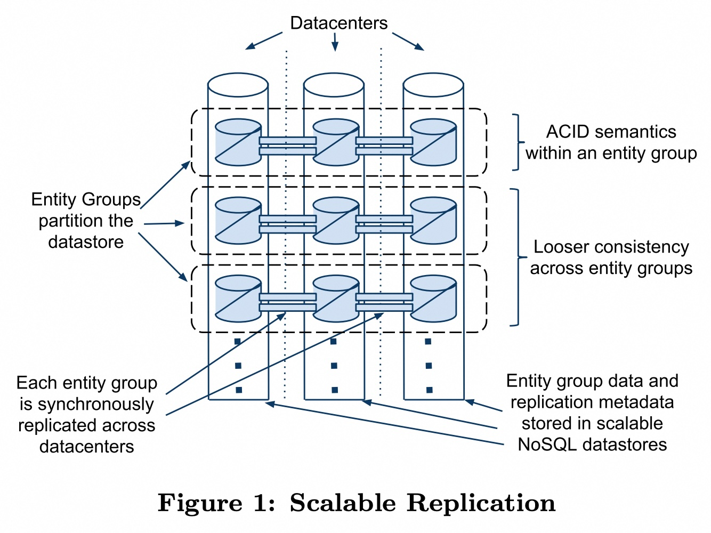

## AI论文解读 | Megastore: Providing Scalable, Highly Available Storage for Interactive Services
        
### 作者        
digoal        
        
### 日期        
2025-09-25       
        
### 标签        
PostgreSQL , PolarDB , DuckDB , AI , 论文解读        
        
----        
        
## 背景  
      
https://www.cidrdb.org/cidr2011/Papers/CIDR11_Paper32.pdf        
  
提示:          
```          
读懂《Megastore: Providing Scalable, Highly Available Storage for Interactive Services》这篇论文需要提前掌握哪些基础知识, 请使用中文通熟易懂的讲解这些基础知识, 可以引用论文中的图、表或使用Markdown支持的图形(text,mermaid等)增加解释性. 
  
使用中文通熟易懂的解读《Megastore: Providing Scalable, Highly Available Storage for Interactive Services》这篇论文, 其中的关键内容请着重讲解, 可以引用论文中的图、表或使用Markdown支持的图形(text,mermaid等)增加解释性. 
  
提取《Megastore: Providing Scalable, Highly Available Storage for Interactive Services》这篇论文中的重要术语, 使用中文对这些术语进行通熟易懂的讲解, 可以引用论文中的图、表或使用Markdown支持的图形(text,mermaid等)增加解释性. 
```     
  
## 1 前置知识 
  
Megastore这篇论文结合了传统关系型数据库（RDBMS）和NoSQL数据库的优点，在理解它之前，您需要掌握以下几个关键的基础知识。

-----

### 1\. 数据库基础概念

#### 关系型数据库 (RDBMS) 与 NoSQL

  * **关系型数据库（RDBMS）**：例如 MySQL，它以表格的形式存储数据，使用 SQL 语言进行操作。RDBMS 的优点是提供了一套丰富的特性，可以方便地构建应用 。但它的缺点是难以扩展到数百万甚至数亿用户 。
  * **NoSQL 数据库**：例如 Google 的 **Bigtable**，Hadoop 的 HBase，或 Facebook 的 Cassandra 。NoSQL 数据库是为大规模可扩展性而设计的，但它们的 API 通常有限，且一致性模型较为宽松，这会使应用程序开发变得复杂 。

Megastore 的核心思想就是取这两种数据库的“中间路线”：它像 NoSQL 一样具备可扩展性，同时又提供了传统 RDBMS 的便利性 。

### 2\. 事务与一致性

#### ACID 特性

ACID 代表数据库事务的四个基本属性：

  * **Atomicity（原子性）**：一个事务中的所有操作要么全部完成，要么全部不完成。
  * **Consistency（一致性）**：事务将数据库从一个有效状态带到另一个有效状态。
  * **Isolation（隔离性）**：并发执行的事务之间互不影响。
  * **Durability（持久性）**：事务一旦提交，其所做的改变就会永久保存在数据库中。

这篇论文中提到，Megastore 在“实体组（Entity Group）”内提供了**完全可串行化（fully serializable）的 ACID 语义** 。

#### 强一致性与最终一致性

  * **强一致性（Strong Consistency）**：一旦数据被写入，所有后续的读取操作都将返回最新的数据。Megastore 在其分区（即实体组）内提供了这种强一致性 。
  * **最终一致性（Eventual Consistency）**：如果不再有新的写入操作，所有副本最终会达到一致状态。虽然这种模型在操作上具有优势，但会使得应用程序的开发变得困难 。Megastore 放弃了最终一致性，因为它认为在快速应用开发中很难放弃“读-修改-写（read-modify-write）”的模式 。

### 3\. 分布式系统

#### 复制与分区（Replication & Partitioning）

  * **复制（Replication）**：为了提高可用性和数据持久性，系统会在不同的地理位置复制数据。Megastore 采用了**同步复制（Synchronous Replication）**，确保写入操作在被确认之前，必须被镜像到多个从节点 。这种方式可以避免故障转移时的数据丢失 。
  * **分区（Partitioning）**：将数据分成多个独立的小块。Megastore 将数据分成多个“**实体组**”，每个组都是独立同步复制的 。这允许系统在扩展吞吐量的同时，将故障影响限制在单个分区内 。

#### Paxos 算法

Paxos 是一种用于分布式系统中的**一致性算法**，它允许多个节点在一个值上达成共识 。这篇论文认为 Megastore 是最大的、将 Paxos 应用于在每次写入时跨数据中心复制主要用户数据的系统 。

在论文中，作者通过以下图示解释了 Megastore 如何通过分区实现可扩展复制：

Megastore 将数据存储分为多个**实体组**，每个实体组都在多个数据中心之间进行同步复制 。在同一个实体组内部，数据操作遵循 **ACID 语义**，但在实体组之间，一致性要求则相对宽松 。

-----

您想更深入了解这些基础概念中的哪一个，例如：

  * **ACID 特性**如何通过 Megastore 的事务机制实现？
  * **Paxos 算法**在论文中的具体实现细节和优化方法？
  * Megastore 如何通过 **实体组（Entity Group）** 进行数据分区？


在 Megastore 论文中，ACID 特性是通过其核心设计 —— **实体组（Entity Group）** 和 **同步复制（Synchronous Replication）** 实现的。

---

### **Megastore 如何实现 ACID**

#### **1. 原子性 (Atomicity)**
在 Megastore 中，原子性是基本操作的保证。一个事务中的所有操作，例如一个“读-修改-写”序列，要么全部成功并提交，要么全部失败并回滚。Megastore 通过以下方式确保这一点：
* **事务日志**：每个事务的修改都被记录在事务日志中。只有当整个事务的所有操作都成功完成并持久化后，事务才会被提交。
* **回滚机制**：如果事务在执行过程中失败（例如，由于网络问题或冲突），所有已做的修改都会被撤销，使系统回到事务开始前的状态。

#### **2. 一致性 (Consistency)**
Megastore 在一个**实体组**内部提供了**强一致性**。这意味着，在同一个实体组内的所有数据修改，都必须遵循预定义的规则和约束。
* **数据约束**：例如，如果一个实体组包含一个用户账户和其关联的购物车，那么对这两个数据结构的所有操作都必须保持一致。
* **可串行化**：论文指出，Megastore 在实体组内提供了**完全可串行化**的 ACID 语义。这意味着并发事务的执行结果与它们按某种顺序串行执行的结果完全一致。这防止了数据不一致，即使多个用户同时修改同一个实体组的数据。

#### **3. 隔离性 (Isolation)**
Megastore 采用了**可串行化隔离**级别，这被认为是最高的隔离级别。它是通过以下机制实现的：
* **乐观并发控制 (Optimistic Concurrency Control)** ：
  1. **读取**：事务首先读取数据副本。
  2. **修改**：事务在本地进行修改，但不立即写入数据库。
  3. **验证**：在提交之前，Megastore 会验证这个事务在读取数据之后，是否被其他并发事务修改过。
  4. **提交/回滚**：如果数据没有被修改，事务就可以安全提交。如果数据已经被其他事务修改，那么当前事务将失败并需要重试。
这个过程确保了并发事务不会互相干扰。

#### **4. 持久性 (Durability)**
持久性是 Megastore 跨数据中心同步复制的核心优势。
* **同步复制**：每个写入操作（Write）在被确认成功之前，必须先同步复制到**所有**副本（Replicas）。
* **Paxos 协议**：为了在分布式环境中可靠地实现同步复制，Megastore 使用了 **Paxos 算法**。Paxos 保证即使在网络分区或节点故障的情况下，所有副本最终都能就一个写入操作达成共识。只有当大多数副本都成功记录了该写入时，事务才会被视为已提交。

以下是论文中描述的一个典型写入操作过程，它体现了持久性的实现：
1. **主节点接收写入请求**。
2. **主节点将请求发送给所有从节点**。
3. **从节点将请求写入其日志**。
4. **从节点向主节点发送确认**。
5. **主节点收到大多数从节点的确认**，此时写入被视为已提交。
6. **主节点向客户端返回成功**。

这个过程确保了数据在提交后不会丢失，即使某个数据中心发生故障，也能通过其他同步的副本恢复。

---

您想进一步了解 Megastore 在其他方面的设计吗，比如它如何通过 **实体组（Entity Group）** 进行数据分区，从而在提供 ACID 特性的同时，实现高可扩展性？

“实体组”（Entity Group）是 Megastore 在提供 ACID 事务和高可用性的同时，实现数据分区和可扩展性的核心概念。

---

### 什么是实体组？
您可以将实体组理解为一个**独立的数据单元**，它包含一组相关联的数据。例如，在一个电子商务应用中：
* 一个**用户**可以是一个实体组。
* 一个用户的**购物车**也可以是另一个实体组。
* 但是，一个用户和他的**订单历史**可以被放在**同一个实体组**中，因为对订单的操作总是与用户相关联。

**关键点：**
* **ACID 事务的边界**：Megastore **只**在实体组内部提供完整的 ACID 事务。这意味着一个事务不能跨越多个实体组。如果您需要同时更新用户账户和购物车，Megastore 的事务模型无法保证这两个操作的原子性。
* **复制的单元**：每个实体组都是独立同步复制的。当您对一个实体组进行写入操作时，Megastore 会确保这个写入被同步复制到所有数据中心的副本上。

### 实体组如何实现数据分区？

通过将数据拆分为实体组，Megastore 实现了水平分区，从而达到可扩展性。

#### **1. 垂直分区与水平分区**
* **传统数据库**：通常是**垂直分区**（Vertical Partitioning），例如将用户数据和产品数据放在不同的表中。这种方式难以应对海量数据。
* **Megastore**：通过实体组实现了**水平分区**（Horizontal Partitioning），将大量用户数据分散到不同的实体组中。每个实体组可以被独立地存储在不同的服务器上。

#### **2. 提高吞吐量**
由于每个实体组都是独立的，对不同实体组的事务可以**并行**执行。
* **高并发**：对实体组 A 的写入操作（例如，更新用户A的购物车）与对实体组 B 的写入操作（例如，更新用户B的订单）可以同时进行，互不影响。
* **限制故障范围**：如果某个实体组因故无法访问，只会影响该实体组上的操作，而不会影响整个系统。

#### **3. 跨数据中心复制**
每个实体组都可以被独立地复制到不同的数据中心，以实现高可用性和低延迟。
* **同步复制**：每个实体组的主节点（Primary Replica）会将其写入操作同步复制到其他数据中心的从节点（Secondary Replicas），确保数据不丢失。
* **故障转移**：如果一个数据中心发生故障，另一个数据中心可以立即接管该实体组的服务，提供无缝的故障转移。

通过实体组，Megastore 巧妙地在提供 ACID 语义和实现可扩展性之间取得了平衡，使得开发人员可以像使用关系型数据库一样构建应用，同时享受分布式系统的优点。

---

您是否想了解更多关于 Megastore 论文中的其他主题，比如它如何使用 Paxos 算法来实现同步复制，或者如何处理故障转移？

在 Megastore 论文中，**Paxos 算法**被用作其 **同步复制（Synchronous Replication）** 的核心，以确保数据的 **持久性（Durability）** 和 **高可用性（High Availability）** 。尽管论文没有详细展开 Paxos 的所有技术细节，但它描述了 Megastore 如何利用该算法实现跨数据中心的一致性写入。

---

### Paxos 在 Megastore 中的作用

Megastore 使用 Paxos 来管理每个 **实体组（Entity Group）** 的复制。每个实体组都有一个主副本（Primary Replica）和多个从副本（Secondary Replicas），它们分布在不同的数据中心。Paxos 算法确保了即使在网络延迟或节点故障的情况下，所有副本上的数据都能保持一致。

简单来说，Megastore 使用 Paxos 的方式如下：
* **达成共识**：当客户端向主副本发送写入请求时，主副本会扮演 **Paxos Proposer** 的角色。它会向所有从副本（**Acceptors**）发送一个提案（Proposal），该提案包含了要写入的数据。
* **多数派写入**：只有当 **多数派（Quorum）** 的从副本都成功地将数据写入其持久存储后，主副本才会认为该写入是成功的。这个“多数派”的原则是 Paxos 算法的核心，它保证了即使部分副本失败，系统仍能继续运行并保持一致性。
* **提交确认**：一旦主副本收到了多数派的确认，它就会向客户端返回写入成功，并向所有副本发送提交指令，让它们正式应用该变更。

这个过程确保了：
1.  **持久性**：数据在被确认为已提交之前，至少被写入了大多数副本。因此，即使主副本或部分从副本立即宕机，数据也不会丢失。
2.  **故障转移**：如果主副本失败，剩余的副本可以通过 Paxos 协议选出一个新的主副本，从而实现自动、无缝的故障转移。

### 论文中提到的 Paxos 实现优化

论文中虽然没有专门用一节来详细描述 Paxos 的优化，但从其设计描述中可以推断出一些关键的实现策略：

* **垂直 Paxos（Vertical Paxos）**：论文提到了使用一种被称为“垂直 Paxos”的变体。这种优化允许 Megastore 将多个小的写入操作合并成一个大的 Paxos 提案。通过这种方式，可以减少网络往返次数和 Paxos 实例的数量，从而提高吞吐量并降低延迟。这对于处理频繁但小型的事务（例如单个键值对的更新）特别有效。
* **Primary-Backup（主从备份）模型**：Megastore 的设计是围绕着一个主副本和多个从副本构建的，这是一种 Paxos 的优化应用。与经典的 Paxos 算法需要多个节点通过多轮投票来达成共识不同，这种主从模型简化了流程。在正常操作下，主副本负责所有的写入，而从副本被动地接收和应用这些变更，这大大提高了效率。只有当主副本失败时，Paxos 的完整选主过程才会被触发。

这种主从模式的 Paxos 实现，结合了主从架构的简单高效和 Paxos 算法的稳健可靠，是 Megastore 能够在大规模、高并发环境下提供强一致性的关键。

---

希望这个解释能帮助您理解 Megastore 如何利用 Paxos 算法。如果您对论文中的其他部分感兴趣，例如它如何支持生产服务或具体的性能数据，我可以继续为您解读。

  
## 2 解读论文 
  
好的，我们来一起深入解读这篇分布式存储领域的经典论文——《Megastore: Providing Scalable, Highly Available Storage for Interactive Services》。

这篇论文介绍了谷歌为了满足现代在线互动服务（如Gmail、Google Docs等）的需求而设计的存储系统 **Megastore**。它的核心贡献在于，巧妙地**融合了传统关系型数据库（RDBMS）的便捷性和NoSQL数据库的可扩展性** ，并首次大规模地使用Paxos算法实现跨数据中心的同步复制，从而同时提供了强一致性、高可用性和高可扩展性。

-----

### 1\. Megastore要解决的核心矛盾

在Megastore诞生之前，开发者通常面临一个两难选择：

  * **传统关系型数据库 (RDBMS)** : 如MySQL，提供了强大的事务（ACID）、丰富的数据模型和查询语言，让应用开发变得简单。但它们的扩展性很差，难以支撑数百万用户的服务 。
  * **NoSQL数据库**: 如Bigtable或Cassandra，拥有极佳的可扩展性，能轻松应对海量数据和请求。但它们通常牺牲了强一致性和事务，数据模型也更简单，这给应用开发带来了巨大的复杂性 。

在线服务既需要快速开发和数据一致性（用户不希望刚发的邮件或编辑的文档“消失”），也需要高可用和高扩展性来服务全球用户 。Megastore的目标就是打破这个僵局，提供一个两全其美的方案。

-----

### 2\. 核心思想：实体组 (Entity Group) - 化整为零

Megastore最核心的设计思想是 **分区 (Partitioning)** 。它没有将整个数据库视为一个整体，而是将其切分成无数个独立的、微小的“迷你数据库”，这个单位被称为 **实体组 (Entity Group)** 。

您可以将整个Megastore想象成一个巨大的公寓楼，而每个“实体组”就是其中的一套独立的公寓。

  * **公寓内部 (Within an Entity Group)** ：拥有所有现代化设施，安全可靠。在这里，Megastore提供**完全可串行化的ACID事务** 。所有发生在这套公寓里的操作（比如在一个用户的邮箱内移动邮件、打标签）都享有严格的事务保证，数据绝对一致。
  * **公寓之间 (Across Entity Groups)** ：公寓与公寓之间有墙隔开，直接互动比较“昂贵”。Megastore在实体组之间只提供较弱的一致性保证 。跨实体组的操作通常通过**异步消息队列 (Queues)**  或在必要时使用开销更高的**两阶段提交 (Two-Phase Commit)**  来完成。

下图（论文图1）直观地展示了这种架构：   

  * **分区**：整个数据存储被划分为多个实体组（Entity Groups）。
  * **复制**：每个实体组都独立地、同步地复制到全球多个数据中心，以实现高可用性 。
  * **一致性模型**：在单个实体组内部，提供ACID语义 ；而在实体组之间，则是一致性较弱的模型 。
  * **底层存储**：每个数据中心内部的实际数据和元数据都存储在一个可扩展的NoSQL数据存储（即Bigtable）中 。

#### 如何划分实体组？

实体组的边界划分对应用性能至关重要。一个好的划分能让绝大多数操作都在单个实体组内完成。

  * **邮件应用**：每个用户的邮箱可以是一个实体组。用户在自己邮箱里的所有操作（发送、接收、加标签）都在一个事务内完成，体验流畅 。用户之间的邮件发送则通过外部邮件路由（类似异步消息）完成 。
  * **博客应用**：每个用户的个人资料是一个实体组，而每篇博客（可能有多人协作）是另一个独立的实体组。当用户发布博客时，可能同时影响“博客”和“用户资料”这两个实体组，这时就可以使用异步消息来更新 。

通过这种“化整为零”的设计，Megastore巧妙地将对强一致性的需求限制在了一个可控的、小范围的“实体组”内，而在更广阔的、需要扩展性的“实体组之间”则采用更灵活的策略。

-----

### 3\. 关键机制一：基于Paxos的同步复制与优化

为了实现高可用性（即数据中心级别的故障也能幸免），Megastore必须将数据复制到多个地理上分散的数据中心。与当时普遍采用的异步复制不同，Megastore选择了**同步复制**，因为它能保证在发生故障切换时不会丢失任何数据 。

实现跨地域同步复制的核心是 **Paxos算法**。Paxos是一个强大的共识算法，能确保在一组可能发生故障的副本中，对一个值达成唯一的、不可变的共识 。

#### Paxos的挑战与Megastore的优化

标准的Paxos算法需要多轮网络通信，在跨越上百毫秒延迟的广域网（WAN）上，性能会非常糟糕 。Megastore是第一个大规模在生产中将Paxos用于在广域网上同步复制每一笔写入数据的系统 ，为此它做了关键的优化：

1.  **快速读取 (Fast Reads)** ：为了让读取操作尽可能快，Megastore设计了一个名为 **协调者 (Coordinator)** 的服务 。每个数据中心的协调者会跟踪本地副本哪些实体组的数据是完全最新的。如果数据是新的，**读取请求就可以直接在本地完成，无需任何跨数据中心的网络通信** 。这极大地降低了大多数读取操作的延迟。

2.  **快速写入 (Fast Writes)** ：Megastore通过为每个日志条目的写入选举一个临时的 **领导者 (Leader)** 来优化写入流程。写入请求首先会发给这个领导者，如果成功，就可以省去标准Paxos算法中的“准备”阶段，**将写入操作从两轮往返减少到一轮往返** ，显著降低了写入延迟。

-----

### 4\. 关键机制二：兼顾性能与功能的数据模型

Megastore不仅在架构上创新，在提供给开发者的功能上，也试图找到RDBMS和NoSQL之间的平衡点。

#### Schema和数据布局

  * **半结构化Schema**：开发者需要像RDBMS一样定义表（Table）、属性（Property）和类型，提供了数据的完整性 。
  * **物理布局控制**：开发者可以通过设计主键（Primary Key）和使用`IN TABLE`等指令，来控制数据在底层Bigtable中的物理存储位置 。这使得经常一起访问的数据可以被存储在一起，从而将复杂的数据库Join操作，变成了高效的范围扫描 。

#### 本地索引 vs. 全局索引

这是一个体现其设计取舍的绝佳例子：

  * **本地索引 (Local Index)** ：索引只在实体组内部建立。例如，为一个用户的照片按时间排序。这种索引的更新和主数据一样，是**完全ACID的**，保证强一致性 。
  * **全局索引 (Global Index)** ：索引横跨所有的实体组。例如，为所有用户的照片按“标签”建立索引。这种索引的更新是异步的，**一致性较弱**，可能无法立即看到最新的写入 。

这种设计让开发者可以根据业务需求，清晰地在“一致性”和“查询范围”之间做出选择。

-----

### 5\. 性能与实践成果

论文中的数据显示，Megastore在真实生产环境中的表现非常出色：

  * **高可用性**：超过80%的应用写操作成功率和近60%的读操作成功率都达到了 **99.999%** （五个九）以上，这证明了其架构在应对日常故障时的鲁棒性 。
  * **低延迟**：
      * **读取**：大多数应用的平均读取延迟在 **几十毫秒** 范围内，证明了“快速读取”优化非常有效，大部分读取都是本地的 。
      * **写入**：平均写入延迟根据数据中心距离不同，在 **100-400毫秒** 之间，这对于一个跨地域同步复制的系统来说是相当快的 。

### 总结

Megastore是一项里程碑式的工作，它成功地证明了在分布式存储系统中，**强一致性、高可用性和高可扩展性并非不可兼得**。其核心思想——以“实体组”为单位进行分区和强一致性保证，同时在全局范围提供可扩展性——深刻影响了后来的分布式数据库设计，包括其直接继承者Google Spanner。它为如何在构建大规模、全球化的互动服务时，平衡开发者便利性和系统性能提供了宝贵的经验和范例。

-----

您是否想进一步了解 Megastore 的后续发展，例如谷歌是如何在后来的 Spanner 系统中解决 Megastore 的一些局限性，比如实现全局一致性的事务处理的？
  
## 3 术语 
  
当然，很高兴为您梳理这篇论文中的核心术语。理解这些概念是读懂 Megastore 架构的关键。

---

### Megastore: Providing Scalable, Highly Available Storage for Interactive Services 论文核心术语

#### **1. Megastore (系统本身)**
* **通俗讲解**：Megastore 是一种创新的数据库系统，它结合了两种截然不同数据库的优点：**关系型数据库（RDBMS）**的丰富功能和**NoSQL 数据库**的超大规模扩展能力。您可以把它想象成一个“混血儿”，既能像传统数据库那样处理复杂的事务，又能像大数据系统那样轻松应对海量用户和数据。

#### **2. 实体组 (Entity Group)**
* **通俗讲解**：这是 Megastore 中最核心、最独特的概念。实体组是**数据分区的基本单位**。可以将它看作一个“数据容器”，里面存放着一组逻辑上强相关的数据。
* **作用**：
    * **事务边界**：Megastore 的 **ACID 事务**仅限于一个实体组内部。也就是说，对同一个实体组内的多个数据进行读写操作，可以保证其原子性、一致性、隔离性和持久性。但事务无法跨越多个实体组。
    * **可扩展性**：每个实体组都可以独立地进行读写操作和复制。如果您的应用程序有数百万用户，可以将每个用户的数据存放在一个独立的实体组中，这样对不同用户的操作就可以完全并行执行，从而实现海量吞吐量。

* **举例说明**: 假设您在设计一个在线书店，您可以将一个客户的所有信息（个人资料、订单历史、购物车）都放在一个**实体组**里。而另一个客户的数据则放在另一个实体组里。这两个实体组在数据库中是独立的，对它们的任何操作都不会相互干扰。

#### **3. ACID 语义**
* **通俗讲解**：ACID 代表数据库事务的四个基本属性，是衡量数据可靠性的黄金标准。
    * **A (Atomicity, 原子性)** ：一个事务中的所有操作要么全部成功，要么全部失败。
    * **C (Consistency, 一致性)** ：事务将数据库从一个有效状态带到另一个有效状态。
    * **I (Isolation, 隔离性)** ：多个并发执行的事务之间互不干扰。
    * **D (Durability, 持久性)** ：事务一旦提交，其结果就永久保存在数据库中。
* **在 Megastore 中的实现**：
    * Megastore 通过乐观并发控制（Optimistic Concurrency Control）在实体组内部实现了 **可串行化（Serializable）** 的隔离级别，确保并发事务的正确性。
    * **持久性**是通过**同步复制**和 **Paxos 算法**实现的，这保证了数据提交后不会丢失。

#### **4. 同步复制 (Synchronous Replication)**
* **通俗讲解**：这是 Megastore 确保数据不丢失的关键技术。不同于最终一致性（Eventually Consistent）系统（例如某些 NoSQL 数据库），同步复制要求一个写入操作在被确认成功之前，必须被同步写入到**所有**或**大多数**数据副本上。
* **作用**：它确保了即使某个数据中心发生故障，您的数据也已经在其他数据中心有了完整的副本，从而保障了极高的数据持久性和可用性。

#### **5. Paxos 算法**
* **通俗讲解**：Paxos 是分布式系统中的一个**一致性算法**。它的目标是让分布在不同服务器上的多个节点，即使在网络不稳定或部分节点宕机的情况下，也能就某个值（例如，一个写入操作）达成共识。
* **在 Megastore 中的作用**：
    * Paxos 是**同步复制**的底层引擎。当一个写入操作到达时，Megastore 的主节点会使用 Paxos 算法，向所有副本节点发起“投票”。
    * 只有当大多数副本都确认收到了这个写入操作后，Paxos 算法才会“通过”，此时主节点才会向客户端返回成功。
    * 这个过程确保了数据的强一致性，并且在主节点宕机时，能够可靠地选举出新的主节点，实现无缝故障转移。

---

希望以上解释能帮助您更好地理解这篇论文。您对以上哪个术语最感兴趣？或者，您想了解论文中关于 Megastore 的性能数据和实际应用场景吗？
  
## 参考        
         
https://www.cidrdb.org/cidr2011/Papers/CIDR11_Paper32.pdf    
        
<b> 以上内容基于DeepSeek、Qwen、Gemini及诸多AI生成, 轻微人工调整, 感谢杭州深度求索人工智能、阿里云、Google等公司. </b>        
        
<b> AI 生成的内容请自行辨别正确性, 当然也多了些许踩坑的乐趣, 毕竟冒险是每个男人的天性.  </b>        
    
#### [期望 PostgreSQL|开源PolarDB 增加什么功能?](https://github.com/digoal/blog/issues/76 "269ac3d1c492e938c0191101c7238216")
  
  
#### [PolarDB 开源数据库](https://openpolardb.com/home "57258f76c37864c6e6d23383d05714ea")
  
  
#### [PolarDB 学习图谱](https://www.aliyun.com/database/openpolardb/activity "8642f60e04ed0c814bf9cb9677976bd4")
  
  
#### [PostgreSQL 解决方案集合](../201706/20170601_02.md "40cff096e9ed7122c512b35d8561d9c8")
  
  
#### [德哥 / digoal's Github - 公益是一辈子的事.](https://github.com/digoal/blog/blob/master/README.md "22709685feb7cab07d30f30387f0a9ae")
  
  
#### [About 德哥](https://github.com/digoal/blog/blob/master/me/readme.md "a37735981e7704886ffd590565582dd0")
  
  

  
