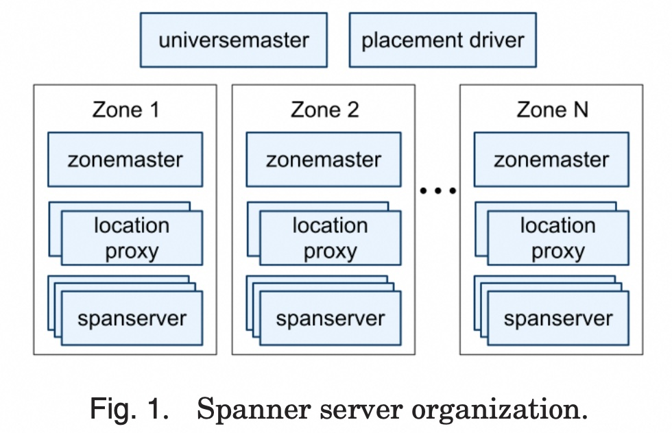
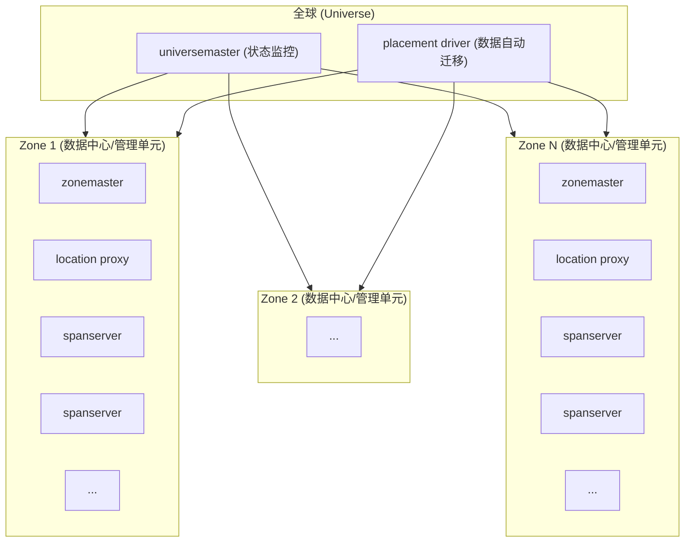
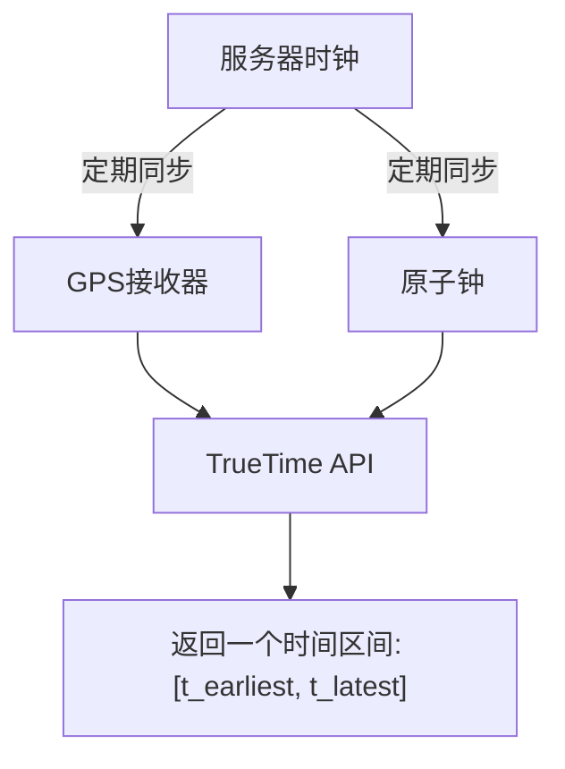
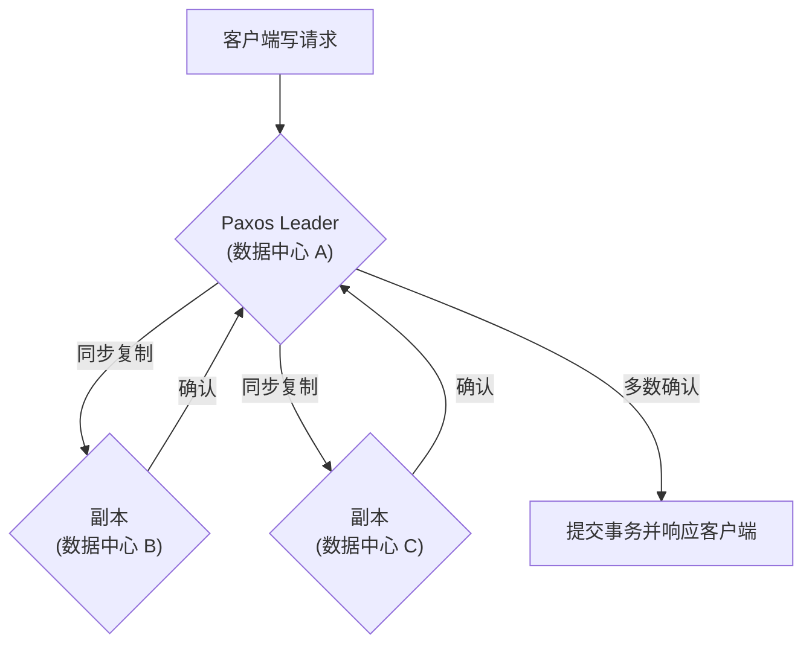

## AI论文解读 | Spanner: Google’s Globally Distributed Database
        
### 作者        
digoal        
        
### 日期        
2025-09-25       
        
### 标签        
PostgreSQL , PolarDB , DuckDB , AI , 论文解读        
        
----        
        
## 背景  
      
https://dl.acm.org/doi/pdf/10.1145/2491245        
  
提示:          
```          
读懂《Spanner: Google’s Globally Distributed Database》这篇论文需要提前掌握哪些基础知识, 请使用中文通熟易懂的讲解这些基础知识, 可以引用论文中的图、表或使用Markdown支持的图形(text,mermaid等)增加解释性. 
  
使用中文通熟易懂的解读《Spanner: Google’s Globally Distributed Database》这篇论文, 其中的关键内容请着重讲解, 可以引用论文中的图、表或使用Markdown支持的图形(text,mermaid等)增加解释性. 
  
提取《Spanner: Google’s Globally Distributed Database》这篇论文中的重要术语, 使用中文对这些术语进行通熟易懂的讲解, 可以引用论文中的图、表或使用Markdown支持的图形(text,mermaid等)增加解释性. 
```     
  
## 1 前置知识 
  
首先，要读懂《Spanner: Google’s Globally Distributed Database》这篇论文，需要掌握一些核心的分布式系统和数据库基础知识。这篇论文的重点在于如何在**全球范围**内构建一个既具备高可用性、又提供**强一致性**的数据库系统，这正是它与传统分布式系统最大的不同之处。以下是理解这篇论文所需掌握的关键基础知识：

### 1. 分布式系统与一致性模型
Spanner 是一篇关于分布式数据库的论文，所以理解基本的分布式系统概念至关重要。

* **分布式系统（Distributed System）**：一个由多台计算机组成，通过网络进行通信和协作的系统。在 Spanner 中，这些计算机分布在全球不同的数据中心。
* **分片（Sharding/Partitioning）**：将数据分散到多个节点或机器上，以实现水平扩展。在 Spanner 中，数据被分片（sharded）到全球各地的 Paxos 状态机组中 。
* **数据复制（Replication）**：在多个位置存储相同的数据副本，以提高可用性和容错能力。Spanner 使用同步复制（synchronously replicated）来确保副本之间的一致性 。
* **一致性（Consistency）**：在分布式系统中，数据在所有副本之间保持同步的程度。Spanner 引入了“外部一致性”（External Consistency） 和“线性一致性”（Linearizability），这是一种比大多数分布式数据库（如最终一致性系统）所提供的更强的一致性模型。

### 2. Paxos 协议
这篇论文多次提到 **Paxos 协议**，它是 Spanner 实现强一致性的核心基础。

* **Paxos 协议**：一种分布式共识算法，用于在多台计算机之间就某个值达成一致。在 Spanner 中，每个数据分片（directory）都由一个 Paxos 组管理，该组由 3-5 个副本组成，其中一个担任 Paxos 领导者 (leader) 。
* **角色**：理解 Paxos 中的三个主要角色：
    * **Proposer（提议者）**：提出一个值。
    * **Acceptor（接受者）**：对提议进行投票。
    * **Learner（学习者）**：学习被选定的值。
* **作用**：在 Spanner 中，Paxos 用于复制数据的写操作。一个写请求必须由 Paxos 领导者发起，并获得大多数副本（法定人数，quorum）的投票才能被提交 。这保证了即使部分副本失败，数据仍然可用，且能保持一致。

### 3. 分布式事务与并发控制
Spanner 是第一个支持**跨数据中心、外部一致性分布式事务**的系统 。因此，理解事务和并发控制是关键。

* **事务（Transaction）**：一组数据库操作，它们要么全部成功，要么全部失败。
* **ACID 特性**：
    * **原子性（Atomicity）**：事务中的所有操作要么都发生，要么都不发生。
    * **一致性（Consistency）**：事务将数据库从一个有效状态带到另一个有效状态。
    * **隔离性（Isolation）**：并发执行的事务互不影响。Spanner 的外部一致性（External Consistency）是其隔离性的一种强大形式，它保证了事务的串行化顺序与真实世界中事件发生的先后顺序保持一致 。
    * **持久性（Durability）**：一旦事务提交，其结果就是永久性的。
* **两阶段提交（Two-Phase Commit, 2PC）**：一种分布式事务协议，用于确保所有参与者要么全部提交事务，要么全部中止事务。Spanner 使用 2PC 来协调跨多个 Paxos 组的分布式事务 。
* **悲观并发控制（Pessimistic Concurrency Control）**：通过在事务执行前获取锁来防止冲突。Spanner 的读写事务使用严格的两阶段锁定（two-phase locking）来控制并发 。

### 4. TrueTime API
**TrueTime** 是 Spanner 论文中最重要的创新点，也是实现外部一致性的基石。

* **时钟同步问题**：在分布式系统中，由于网络延迟和物理时钟的漂移，让所有机器的时钟保持完全同步是一个难题。
* **TrueTime API**：一个特殊的 API，它返回一个时间区间 `[earliest, latest]`，该区间保证包含真实世界的绝对时间 。
    * `TT.now()`：返回一个包含当前时间的区间 `[earliest, latest]` 。
    * **时钟不确定性（Clock Uncertainty）**：`latest - earliest` 的值，代表了时间同步的误差。Spanner 通过 GPS 和原子钟来减小这个不确定性，通常小于 10 毫秒 。
* **TrueTime 的作用**：Spanner 使用 TrueTime 来为每个事务分配一个全局唯一的、有意义的时间戳。这个时间戳不仅反映了事务的提交顺序，还满足外部一致性，即如果事务 T1 在真实世界中先于 T2 发生，那么 T1 的时间戳一定小于 T2 的 。为了确保这一点，Spanner 可能会让事务在提交时“等待”一段时间，直到其提交时间戳大于任何可能影响它的先前事务的完成时间。

理解了这些基础知识后，您就可以更好地理解 Spanner 论文中的设计决策，例如它如何利用 TrueTime 来实现无锁快照读（lock-free snapshot reads）和跨数据库的全局一致性快照读（globally consistent reads）。

---
如果您对这些基础概念中的任何一个（例如 Paxos 或分布式事务）感兴趣，我可以提供更详细的解释或绘制相应的图表。
  
## 2 解读论文 
  
好的，我们来一起深入浅出地解读《Spanner: Google's Globally Distributed Database》这篇里程碑式的论文。

Spanner 是谷歌设计和构建的一个可扩展、多版本、全球分布式且同步复制的数据库。简单来说，它就像一个**覆盖全球的巨型数据库**，既有传统关系型数据库的强大功能（如事务、SQL查询），又具备现代分布式系统的优点（如高可用性、自动扩展和容灾）。

这篇论文的核心贡献在于证明了，我们**不必为了获得全球范围的扩展性和可用性而牺牲数据的一致性**。Spanner 是第一个在全球尺度上实现“外部一致性”（Externally-Consistent）分布式事务的系统。

-----

### 核心架构：Spanner 是如何组织的？

为了管理全球数据，Spanner 引入了一套层级式的架构。我们可以通过论文中的图1来理解：   



  * **Universe**: 一个 Spanner 的部署实例被称为一个 Universe。全球通常只有少数几个 Universe（例如，一个用于生产，一个用于测试） 。
  * **Zone**: Zone 是数据可以被复制和部署的基本管理单元，大致相当于一个或多个数据中心 。它提供了物理隔离，你可以把数据复制到全球不同地区的多个 Zone 中，以实现容灾和低延迟访问 。
  * **Zonemaster**: 管理该 Zone 内的数据分配 。
  * **Spanserver**: 这是真正干活的单元，负责存储和向客户端提供数据 。每个 Spanserver 管理着成百上千个被称为 "Tablet" 的数据分片 。
  * **Placement Driver**: 负责在 Zone 之间自动迁移数据，以平衡负载或满足新的复制需求 。

-----

### 关键技术：TrueTime API

这是 Spanner 的“魔法”所在，也是整篇论文最核心的创新点。

在分布式系统中，**时间**是一个大难题。因为网络延迟和时钟漂移，不同机器上的时钟几乎不可能完全同步。传统系统要么依赖不那么精确的网络时间协议（NTP），要么干脆放弃对时间的强依赖。

Spanner 另辟蹊径，设计了 **TrueTime API**。它不返回一个精确的时间点，而是返回一个**时间区间 `[earliest, latest]`**。这个 API 保证，真实的绝对时间一定落在这个区间内 。

| 方法 | 返回值 | 解释 |
| :--- | :--- | :--- |
| `TT.now()` | `TTinterval: [earliest, latest]` | 返回一个保证包含当前绝对时间的区间 。 |
| `TT.after(t)` | `true` | 当 `t` 这个时间点确认已经过去时，返回 `true` 。 |
| `TT.before(t)` | `true` | 当 `t` 这个时间点确认还未到来时，返回 `true` 。 |

**它是如何实现的？**
谷歌的每个数据中心都部署了多个时间主节点（time master），一部分配备了 **GPS 接收器**，另一部分（被称为“末日主节点”）配备了**原子钟** 。这两种设备有不同的故障模式，可以互为备份 。每台服务器上的 timeslave 守护进程会综合多个主节点的信息，计算出当前真实时间的不确定性区间 `ε` 。这个 `ε` 通常非常小，一般在 1 到 7 毫秒之间 。

有了 TrueTime，Spanner 就拥有了在全球范围内比较不同事件发生顺序的可靠依据。

-----

### 核心功能：TrueTime 如何实现外部一致性？

Spanner 最强大的特性之一是提供了**外部一致性**（External Consistency），也叫**线性一致性**（Linearizability）。这意味着：**如果事务 T1 在事务 T2 开始之前就已经提交，那么 T1 的提交时间戳一定小于 T2 的提交时间戳** 。这完全符合我们对单机数据库的直觉，但在全球分布式系统中实现起来极其困难。

Spanner 通过两条简单的规则，并借助 TrueTime 实现了这一点：

1.  **Start 规则**：当为一个事务分配提交时间戳 $s\_i$ 时，这个时间戳必须大于等于 `TT.now().latest` 。这意味着，时间戳被设定在了“未来”的某个时刻。
2.  **Commit Wait 规则**：在事务的协调者（coordinator）通知客户端事务已提交之前，**它必须等待，直到 `TT.after(s_i)` 为 `true`** 。这意味着，协调者必须等到时钟确认时间戳 $s\_i$ 已经成为过去式，才能让这次提交的结果对外可见。

> **举个例子**：
>
> 1.  你在美国发起了一个转账事务 T1，Spanner 协调者根据 `TT.now()` = `[10:00:00.004, 10:00:00.008]`，为 T1 分配了提交时间戳 $s\_1$ = `10:00:00.008`。
> 2.  协调者必须**等待**，直到 TrueTime 确认 `10:00:00.008` 这个时刻已经过去。假设在绝对时间 `10:00:00.010` 才确认，此时才允许 T1 的结果被其他事务看到。
> 3.  随后，你的朋友在亚洲发起了查询余额的事务 T2。T2 开始的绝对时间是 `10:00:00.012`。
> 4.  Spanner 为 T2 分配的时间戳 $s\_2$ 必然会晚于 T2 的开始时间，因此 $s\_1 \< s\_2$。

这个 "Commit Wait" 的等待时间通常就是 TrueTime 的不确定性 `ε`，大约几个毫秒，这个微小的代价换来了全球一致的强有力保证。

-----

### 数据模型与应用

虽然底层技术复杂，但 Spanner 提供给应用开发者的接口却很友好。它不是一个简单的键值存储（like Bigtable），而是一个支持模式（schema）、半关系型表、通用事务和 SQL 查询语言的数据库 。

一个非常巧妙的设计是**表交错（Interleaving）**。开发者可以通过 `INTERLEAVE IN PARENT` 语法来声明表之间的父子关系 。

```sql
CREATE TABLE Users {
  uid INT64 NOT NULL, email STRING
} PRIMARY KEY (uid), DIRECTORY;

CREATE TABLE Albums {
  uid INT64 NOT NULL, aid INT64 NOT NULL, name STRING
} PRIMARY KEY (uid, aid),
  INTERLEAVE IN PARENT Users ON DELETE CASCADE;
```

  * `Users` 是父表，`Albums` 是子表。
  * Spanner 会在物理存储上将一个用户（如 `Users(1)`）和他所有的相册（`Albums(1,1)`, `Albums(1,2)` 等）的数据**放在一起** 。
  * 这样做的好处是极大地提升了**数据局部性**（locality）。当查询某个用户和他的所有相册时，Spanner 只需要访问一个数据分片，性能会非常好 。

### 总结

Spanner 是一项开创性的工作，它成功地将数据库和分布式系统的理念结合起来 。它告诉我们，通过巧妙的设计（尤其是 TrueTime），构建一个既能全球扩展、容错，又能提供严格一致性保证的数据库是完全可行的。它深刻影响了后续许多分布式数据库的设计，如 CockroachDB、TiDB 等。

-----

看完了这篇论文的整体解读，您是想深入了解 Spanner 中用于实现同步复制的 Paxos 算法，还是想探讨一下 Spanner 的强一致性与其它系统（如亚马逊的 DynamoDB）的最终一致性之间的区别和适用场景呢？
  
## 3 术语 
  
理解《Spanner: Google’s Globally Distributed Database》这篇论文，核心在于掌握它如何在一个全球化的分布式环境中实现强一致性。以下是论文中的几个重要术语及其通俗易懂的中文讲解：

### 1\. External Consistency (外部一致性)

**是什么？**
“外部一致性”是 Spanner 论文中提出的一个关键概念，它是一种比“线性一致性”（Linearizability）更强的**隔离性**。简单来说，它不仅保证了并发事务的结果与按某种串行顺序执行的结果相同，还额外要求这个串行顺序与真实世界中事件发生的先后顺序完全一致。

**举个例子：**
假设你在纽约的银行账户（A）向北京的银行账户（B）转账。外部一致性保证，如果转账成功，那么当 B 账户的持有者在任何地方（比如上海）查询账户余额时，他看到的新余额一定是在纽约转账操作之后发生的，并且这个时间顺序是全局可观测的，不会出现因为网络延迟或时钟不同步而导致“看到旧数据”的现象。

### 2\. TrueTime API

**是什么？**
`TrueTime` 是 Spanner 团队为了解决全球分布式系统的时钟同步问题而设计的核心技术。它是一个特殊的 API，返回的不是一个精确的“点”时间，而是一个包含真实时间的**时间区间** `[t_earliest, t_latest]`。

**为什么需要它？**
在分布式系统中，由于每台机器都有自己的物理时钟，且时钟会漂移，通过网络同步又存在延迟，因此要保证所有机器的时间完全同步几乎是不可能的。`TrueTime` 通过使用多个 GPS 接收器和原子钟来同步服务器时钟，并暴露一个很小的不确定性区间，而不是一个单点值。

-----

**TrueTime API 的工作原理**



这个时间区间是 Spanner 实现外部一致性的关键。它保证了如果一个事务 T1 在真实世界中先于事务 T2 发生，那么 T1 的提交时间戳一定小于 T2 的提交时间戳。

### 3\. Directory (目录)

**是什么？**
`Directory` 是 Spanner 数据存储和管理的逻辑单元。它代表一个表或表的一部分（分片），通常包含一组连续的行。Spanner 将数据分片，每个分片称为一个 `Tablet`，一个 `Directory` 可以包含多个 `Tablet`。

**它的作用？**
`Directory` 是数据复制和移动的单位。当数据量增长时，Spanner 会将一个 `Directory` 拆分为多个，并自动将它们移动到不同的服务器或数据中心，以实现负载均衡和容错。这使得 Spanner 能够轻松地在全球范围内进行水平扩展。

-----

**目录与分片的关系**

  * **Directory (目录)** ：一个逻辑上的数据集合，如一个完整的表或表的一段。
  * **Tablet (分片)** ：数据存储的物理单位，是 Paxos 组的复制对象。

简单来说，一个**目录**可以看作是一本书，而这本书的每一页（或连续的几页）就是一个**分片**。Spanner 可以将这些分片在全球范围内进行复制和迁移。

### 4\. Paxos (帕克索斯协议)

**是什么？**
`Paxos` 是一种分布式共识算法，用于在网络中多个节点之间就某个值达成一致。Spanner 使用它来保证数据副本之间的一致性。

**它的作用？**
在 Spanner 中，每个 `Tablet`（数据分片）都由一个 Paxos 状态机组管理，通常由 3 到 5 个副本组成。

  * **写操作（Writes）**：所有的写请求都必须由 Paxos 组中的领导者（leader）发起。只有当大多数副本都确认了该写操作后，它才被认为是提交成功的。这保证了即使领导者失败，其他副本也能通过选举新的领导者继续提供服务，且数据不会丢失或不一致。
  * **读取操作（Reads）**：在领导者上进行。

Spanner 利用 `Paxos` 确保了数据的高可用性和强一致性。

-----

我还可以为您详细解释 Spanner 的 **两阶段提交（2PC）** 如何与 `TrueTime` 结合，以实现跨数据中心的分布式事务。您对此感兴趣吗？

Spanner 的两阶段提交（2PC）与 `TrueTime` 的结合是其实现**外部一致性**的关键，也是论文中最具创新性的部分。传统的 2PC 协议无法解决全球分布式环境下的时钟漂移和网络延迟问题，而 `TrueTime` 提供了解决方案。

以下是 Spanner 如何将 2PC 与 `TrueTime` 巧妙结合的步骤：

---

### **准备阶段（Phase 1: Prepare）**

1.  **发起事务**：一个读写事务在协调者（coordinator）节点发起。该事务可能涉及多个 Paxos 组（即多个数据分片），这些 Paxos 组的领导者（leaders）是事务的参与者（participants）。
2.  **锁定数据**：协调者向所有参与者发送准备（prepare）请求。每个参与者在其 Paxos 组内，对事务将要修改的数据上锁。
3.  **准备完成**：每个参与者在本地记录事务的准备状态，并向协调者回复“准备就绪”（ready）。

### **提交阶段（Phase 2: Commit）**

这一阶段是 `TrueTime` 发挥核心作用的地方。

1.  **协调者获取提交时间戳**：当协调者收到所有参与者“准备就绪”的回复后，它会调用 `TrueTime` API 获取一个提交时间戳 `t_commit`。这个时间戳是一个区间 `[t_earliest, t_latest]`。
2.  **协调者分配时间戳**：协调者从这个 `TrueTime` 区间中选择一个时间戳 `s`，并将它作为最终提交时间戳。
3.  **等待和提交**：协调者向所有参与者发送提交请求，请求中包含了时间戳 `s`。
    * **关键步骤**：在每个参与者收到提交请求后，它不会立即提交。它会**等待**，直到本地的 `TrueTime.now()` 的最早时间（`t_earliest`）大于或等于协调者分配的时间戳 `s`。
    * 这个“等待”被称为**提交等待（commit wait）**。这个步骤至关重要，它保证了在事务提交前，真实世界中的时间已经超过了提交时间戳。
4.  **最终提交**：一旦等待完成，所有参与者将事务提交，并使用时间戳 `s` 标记提交的数据。

---

### **为什么“提交等待”如此重要？**

`TrueTime` 保证了当协调者在时间 `T` 获取到提交时间戳 `s` 时，真实世界的时间一定在这个时间戳的不确定性区间 `[t_earliest, t_latest]` 内。但如果协调者和参与者之间的网络延迟较大，参与者可能会在真实世界的时间 `T + 延迟` 时才收到提交请求。

如果没有“提交等待”，参与者可能会使用早于 `T` 的本地时钟时间来处理事务，这就会破坏外部一致性。**“提交等待”解决了这个问题，它强制所有参与者在提交前，确保其本地时钟已经“追上”了由 `TrueTime` 分配的全局时间戳。**

通过这种机制，Spanner 成功地将分布式事务的提交顺序与 `TrueTime` API 的全局时间戳联系起来，从而实现了跨越全球数据中心的外部一致性，即使是在机器时钟不完全同步的环境下。

---

你对 Spanner 的其他特性，例如它的**多版本并发控制（MVCC）**，或者**无锁快照读**如何工作感兴趣吗？

多版本并发控制（MVCC）是 Spanner 实现**无锁读取**和**全局一致性快照**的关键技术，它与传统的数据库锁机制有很大不同。

### 什么是多版本并发控制（MVCC）？

MVCC 是一种并发控制机制，它允许数据库保留同一份数据的多个版本。每个版本都与一个特定的时间戳或版本号相关联。当一个事务需要读取数据时，它会读取与自己的时间戳相对应的版本，而不是最新的版本。这样一来，读操作就不会被写操作的锁所阻塞，从而大大提高了系统的并发性能。

### Spanner 如何实现 MVCC？

Spanner 将 MVCC 与 `TrueTime` API 巧妙地结合起来。在 Spanner 中，每个数据版本都与一个**全局唯一的、外部一致性**的时间戳相关联。

**1. 写操作（Writes）**

* 每当一个事务写入数据时，它不会直接覆盖旧数据，而是创建一个新的数据版本。
* 这个新版本会被赋予一个由 `TrueTime` 分配的提交时间戳 `s`。这个时间戳是全局唯一的，并且满足外部一致性，因为它是由 **两阶段提交（2PC）** 的 `commit wait` 机制保证的。
* 旧版本的数据仍然保留在系统中，只不过它的时间戳比新版本小。

**2. 读操作（Reads）**

Spanner 主要支持两种类型的读操作，都依赖于 MVCC：

#### **a. 快照读（Snapshot Reads）**

* 快照读是一种**无锁**的读操作，它在执行时会指定一个时间戳 `t`。
* 系统会返回在时间戳 `t` 时刻的数据库状态，即所有时间戳小于或等于 `t` 的最新数据版本。
* 因为快照读不获取任何锁，它不会与正在进行的写事务产生冲突，因此可以实现**非阻塞**的读操作。这对于需要长时间运行的报表查询或数据分析任务非常有益。
* **全局一致性**：由于 Spanner 的时间戳是由 `TrueTime` 保证的，这个快照读的时间点 `t` 是在全球范围内都有效的。这意味着你可以在一个数据中心发起快照读，并获得一个与其他数据中心在同一时刻的快照，保证了数据的全局一致性。

#### **b. 读写事务中的读操作**

* 在读写事务中，读操作通常会先获取锁。但 Spanner 仍然利用了 MVCC 的多版本特性。
* 当一个读写事务在时间戳 `t_start` 开始时，它会读取 `t_start` 之前的最新版本数据。如果它需要修改数据，它会像上面提到的，创建一个新版本并赋予一个提交时间戳 `t_commit`。

---

总而言之，Spanner 的 MVCC 是一种强大的并发控制手段，它将**数据多版本**与 **`TrueTime` 时间戳**结合起来，实现了**无锁快照读**和**全局一致性**，从而在保证强一致性的同时，也提供了出色的读性能。

Spanner 的核心设计还包括其架构和数据复制策略。您想了解更多关于 Spanner 的 Paxos 状态机、目录（Directory）和它们的复制机制吗？

Spanner 的**无锁快照读**（Lock-free Snapshot Reads）是其多版本并发控制（MVCC）机制的核心应用，它允许事务在不阻塞其他读写操作的情况下，获取一个全局一致性的数据库快照。

### 无锁快照读的工作原理

其工作流程可以分为以下几个步骤：

1.  **获取时间戳：** 当一个读事务开始时，它会向 Spanner 的 `TrueTime` API 请求一个最新的时间戳 `t`。这个时间戳是全局唯一的，并且满足外部一致性。
2.  **选择数据版本：** 读事务使用这个时间戳 `t` 作为自己的**快照时间戳**。在读取数据时，它会访问数据库中所有**时间戳小于或等于 `t` 的最新数据版本**。
3.  **无锁读取：** 因为快照读只关心历史数据，它不会修改任何数据。因此，它不需要对数据进行加锁，也不会与正在进行的写事务产生任何冲突。写事务可以继续正常地获取锁、修改数据，并提交新的版本。
4.  **提供一致性视图：** 无论这个读事务持续多长时间，它所看到的数据视图都是在时间戳 `t` 时刻的数据库快照。这意味着它不会看到在它开始后才提交的任何新数据，从而保证了**读操作的隔离性**。

### 为什么它能实现“无锁”？

传统的数据库读操作通常需要获取共享锁，以防止在读取数据时，有其他事务修改了相同的数据，导致读到不一致的数据。而 Spanner 的无锁快照读之所以能做到“无锁”，正是因为它根本不关心数据是否被修改。它只专注于读取**特定历史时间点的数据版本**。

**关键在于 `TrueTime` 和 MVCC 的结合：**

* `TrueTime` 提供了**全局一致性的时间戳**，让 Spanner 能够为每个数据版本赋予一个唯一且有意义的时间戳。
* **MVCC 机制**保留了数据的多个版本，使得历史数据可以在不影响当前数据的情况下被访问。

当一个快照读事务在时间戳 `t` 开始时，它实际上是在说：“给我所有在 `t` 时刻已经存在的最新数据。” 由于所有写操作都是基于 `TrueTime` 提交的，Spanner 能够精确地找到在 `t` 时刻的正确数据版本集合，并将其提供给读事务，而无需担心并发问题。

---
您对 Spanner 的数据模型，例如它如何使用 `schemata` 来管理数据，或者它的全局数据复制策略，感兴趣吗？

Spanner 的全局数据复制策略是其实现高可用性、低延迟和强一致性的核心。它通过**同步复制**（synchronous replication）和**多数据中心部署**来实现这一目标。

-----

### **1. 复制的基本单位：Paxos 组**

Spanner 的数据复制不是以整个数据库为单位，而是以**数据分片**（称为 **Tablet**）为单位。每个 Tablet 都有一个由 3 到 5 个副本组成的 **Paxos 组**来管理。这些副本可能分布在不同的机架、数据中心或甚至不同的地理区域。

### **2. 复制策略的类型**

Spanner 允许用户根据不同的需求配置不同的复制策略：

  * **高可用性（High Availability）：**

      * **目标：** 确保即使在某个数据中心发生故障时，系统仍然可用。
      * **策略：** 将数据的 3 到 5 个副本分布在同一地理区域内的不同数据中心。例如，在美国东部将数据复制到 `us-east1-a`、`us-east1-b` 和 `us-east1-c` 等不同的数据中心。
      * **优点：** 实现了在本地范围内的容错，同时保持较低的读写延迟。

  * **广域复制（Wide-Area Replication）：**

      * **目标：** 实现跨地理区域的容错，抵抗整个区域级别的灾难。
      * **策略：** 将数据的副本分布在多个地理区域，例如美国东部、欧洲和亚洲。
      * **优点：** 即使一个区域完全离线，系统仍然可以在其他区域继续提供服务。
      * **代价：** 由于跨大洲的网络延迟，写操作的延迟会增加。

### **3. 复制的执行机制**

Spanner 的复制是通过 **Paxos 协议**实现的：

  * **领导者（Leader）选举：** 每个 Paxos 组都会选举一个领导者。所有对该分片的写操作都必须首先发送给领导者。
  * **同步复制（Synchronous Replication）：** 领导者会将写操作同步复制到其他副本。只有当大多数副本都确认了该写操作后，领导者才会提交事务。这个过程保证了即使领导者失败，其他副本也拥有最新的数据，并且可以选举出新的领导者继续提供服务，从而确保**强一致性**。




### **4. 容错与负载均衡**

  * **自动故障转移：** 如果一个 Paxos 领导者失败，其他副本会在短时间内选举出一个新的领导者，确保服务的连续性。
  * **自动数据迁移：** Spanner 会自动监控每个数据分片（Tablet）的负载。如果某个分片过载，Spanner 会将它分裂成更小的分片，并自动将这些分片移动到负载较轻的服务器上，以实现负载均衡。

总而言之，Spanner 的全局数据复制策略通过将数据分片、使用 Paxos 协议进行同步复制以及跨数据中心部署相结合，实现了在全球范围内的高可用性、容错和强一致性。

-----

您对 Spanner 在全球范围内管理数据的方式，例如其**数据模型**和**schema**设计，感兴趣吗？
  
## 参考        
         
https://dl.acm.org/doi/pdf/10.1145/2491245    
        
<b> 以上内容基于DeepSeek、Qwen、Gemini及诸多AI生成, 轻微人工调整, 感谢杭州深度求索人工智能、阿里云、Google等公司. </b>        
        
<b> AI 生成的内容请自行辨别正确性, 当然也多了些许踩坑的乐趣, 毕竟冒险是每个男人的天性.  </b>        
    
#### [期望 PostgreSQL|开源PolarDB 增加什么功能?](https://github.com/digoal/blog/issues/76 "269ac3d1c492e938c0191101c7238216")
  
  
#### [PolarDB 开源数据库](https://openpolardb.com/home "57258f76c37864c6e6d23383d05714ea")
  
  
#### [PolarDB 学习图谱](https://www.aliyun.com/database/openpolardb/activity "8642f60e04ed0c814bf9cb9677976bd4")
  
  
#### [PostgreSQL 解决方案集合](../201706/20170601_02.md "40cff096e9ed7122c512b35d8561d9c8")
  
  
#### [德哥 / digoal's Github - 公益是一辈子的事.](https://github.com/digoal/blog/blob/master/README.md "22709685feb7cab07d30f30387f0a9ae")
  
  
#### [About 德哥](https://github.com/digoal/blog/blob/master/me/readme.md "a37735981e7704886ffd590565582dd0")
  
  

  
