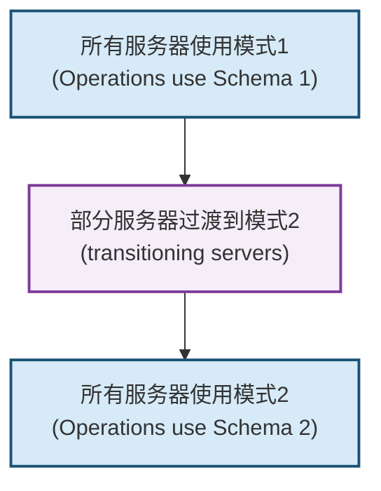
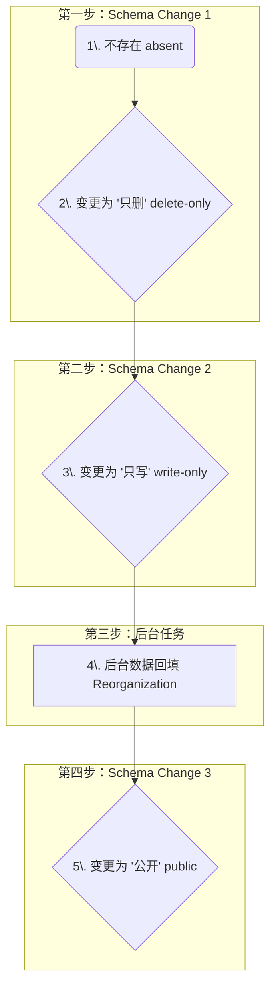
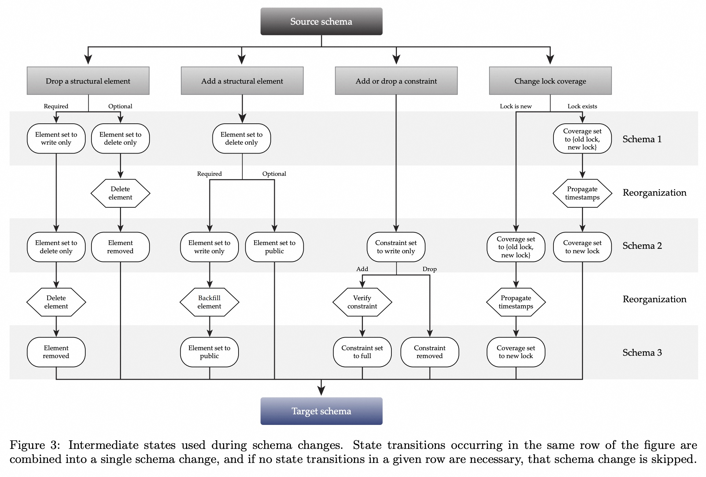
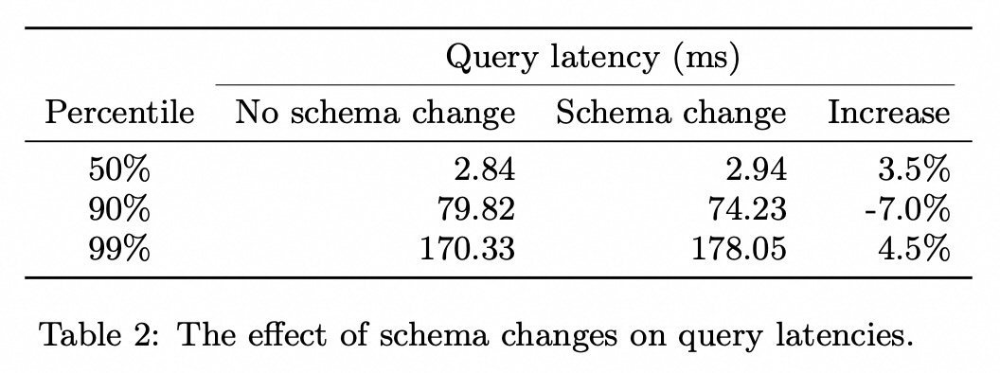
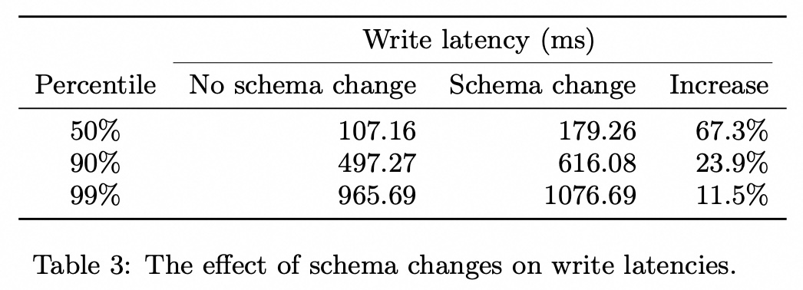
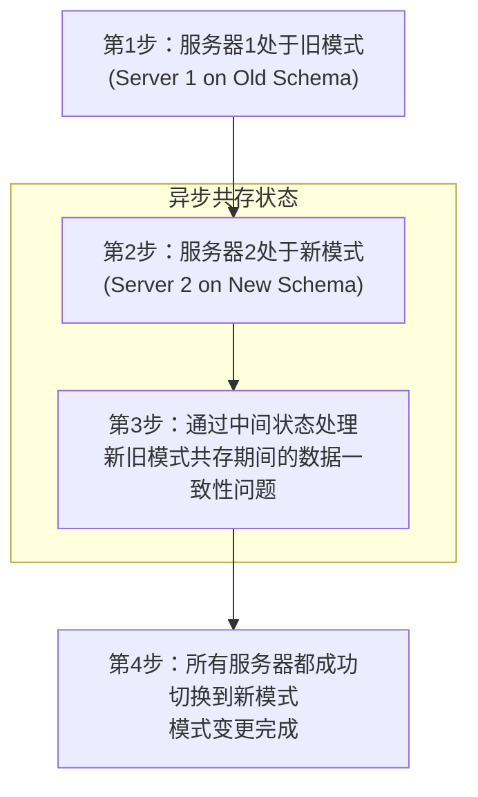

## AI论文解读 | Online, Asynchronous Schema Change in F1
        
### 作者        
digoal        
        
### 日期        
2025-09-25       
        
### 标签        
PostgreSQL , PolarDB , DuckDB , AI , 论文解读        
        
----        
        
## 背景  
      
https://dl.acm.org/doi/pdf/10.14778/2536222.2536230        
  
提示:          
```          
读懂《Online, Asynchronous Schema Change in F1》这篇论文需要提前掌握哪些基础知识, 请使用中文通熟易懂的讲解这些基础知识, 可以引用论文中的图、表或使用Markdown支持的图形(text,mermaid等)增加解释性. 
  
使用中文通熟易懂的解读《Online, Asynchronous Schema Change in F1》这篇论文, 其中的关键内容请着重讲解, 可以引用论文中的图、表或使用Markdown支持的图形(text,mermaid等)增加解释性. 
  
提取《Online, Asynchronous Schema Change in F1》这篇论文中的重要术语, 使用中文对这些术语进行通熟易懂的讲解, 可以引用论文中的图、表或使用Markdown支持的图形(text,mermaid等)增加解释性. 
```     
  
## 1 前置知识 
  
读懂《Online, Asynchronous Schema Change in F1》这篇论文，需要提前掌握以下几个核心领域的基础知识。这篇论文的精妙之处在于，它将这些基础概念在高度分布式、异步的环境下进行重新组合，以解决实际生产系统中的复杂问题。

### 1\. 分布式系统基础 (Distributed Systems Fundamentals)

该论文是关于一个名为 F1 的“全球分布式数据库管理系统”的。因此，了解分布式系统的基本挑战至关重要。

  * **分布式数据库 (Distributed Databases):** 了解与单一服务器数据库相比，数据存储在多台服务器上所带来的挑战，例如数据一致性、高可用性和容错性。F1 通过共享数据存储和无状态服务器来应对这些挑战 。
  * **异步操作与无全局成员身份 (Asynchronous Operations & No Global Membership):** 这是论文协议的核心前提。由于 F1 服务器数量庞大且无状态，无法进行显式的全局同步 。这意味着不同的服务器可能会在不同时间加载新的数据库模式（Schema），即所谓的**异步模式变更** 。
  * **键值存储 (Key-Value Store):** F1 构建在 Spanner 之上，而论文将 Spanner 视为一个分布式键值存储系统 。理解键值存储的基本读写操作 (`put`, `del`, `get`) 以及如何在其之上构建复杂的数据结构（如关系型数据库中的行和索引）是理解论文工作方式的关键 。

-----

### 2\. 关系型数据库原理 (Relational Database Principles)

虽然底层是键值存储，但 F1 向上提供了关系型数据库的抽象。

  * **数据库模式 (Database Schema):** 数据库模式定义了表、列、索引和约束等数据结构 。论文讨论的**模式演变 (Schema Evolution)** 就是指在不丢失数据的情况下修改这些定义的能力 。
  * **索引与约束 (Indexes and Constraints):** 论文中一个核心的腐败案例就是，当一个使用新模式的服务器添加了新索引，而一个使用旧模式的服务器删除了数据，却因不知新索引的存在而未删除对应的索引条目，导致数据库数据不一致 。

-----

### 3\. 并发控制 (Concurrency Control)

F1 使用了一种乐观并发控制机制，这与传统的悲观锁（如行锁）有所不同 。

  * **乐观并发控制 (Optimistic Concurrency Control):** 这种机制假设事务冲突很少发生。它允许事务在不加锁的情况下执行，然后在提交时验证是否有冲突。F1 使用时间戳来管理乐观锁，以确保事务的序列化 。
  * **事务的原子性、一致性、隔离性和持久性 (ACID):** 尽管论文没有直接深入讨论所有 ACID 特性，但对事务一致性的理解是核心。论文定义了“ **一致性保持的模式变更 (consistency-preserving schema change)** ” ，这是一种确保在模式变更过程中，无论使用旧模式还是新模式，对数据库的操作都不会导致数据不一致（即**孤儿数据异常**或**完整性异常**）的变更方式 。

-----

### 4\. 模式变更协议与中间状态 (Schema Change Protocol & Intermediate States)

这部分是论文的核心创新点。为了解决异步模式变更中可能导致的数据损坏问题，论文提出了一个利用**中间状态**的协议 。

下图直观地展示了在模式变更过程中，服务器是如何从模式1过渡到模式2的。



该协议将一次“危险”的模式变更分解为一系列“安全”的小步，每一步都涉及到将模式元素（如列、索引）设置为特定的中间状态，例如：

  * **Delete-only (仅删除):** 这种状态的元素无法被用户事务读取，且只能被删除操作修改 。例如，在删除一个列时，可以先将其设置为 `delete-only`，这样旧模式的服务器可以继续删除相关数据，而新模式的服务器不会再创建这些数据，从而逐步清理数据库 。
  * **Write-only (仅写入):** 这种状态的元素可以被插入、删除和更新操作修改，但不能被用户事务读取 。这对于添加新元素（如索引）非常有用，它允许新模式的服务器在不影响旧模式服务器读取的情况下，先在后台写入数据 。

这些中间状态的巧妙使用，是这篇论文能够实现在线、异步模式变更并保证数据一致性的关键。

-----

  * **总结：** 论文的核心在于，它在无全局同步的分布式环境下，通过设计巧妙的模式元素中间状态和多阶段模式变更协议，解决了在线模式变更所带来的数据一致性问题。

您对论文中的哪个部分最感兴趣？我们可以更深入地讨论。
  
## 2 解读论文 
  
好的，我们来通俗易懂地解读这篇关于谷歌F1数据库如何实现“在线异步架构变更”的经典论文。

简单来说，这篇论文解决了一个世界级难题：**如何给一架正在高速飞行的飞机更换引擎，而且还不能让乘客感觉到任何颠簸？**

在这里，“飞机”就是谷歌广告业务（Google AdWords）背后庞大的F1数据库，“引擎”就是数据库的架构（Schema），而“乘客”则是全球无数的用户和广告商。F1数据库必须7x24小时不间断服务，任何停机都会直接造成巨大的收入损失 。因此，传统的“停机维护、升级架构”的方法是完全不可行的。

-----

### 核心挑战：在线、异步环境下的数据一致性

F1数据库有几个关键特点，使得架构变更异常困难：

1.  **大规模分布式**：系统由遍布全球的数百台服务器组成 。
2.  **数据共享**：所有服务器都访问同一个底层分布式键值存储（Spanner），数据没有分区 。
3.  **无全局同步**：由于服务器是无状态的，没有一种机制可以瞬间通知所有服务器“我们现在统一使用新架构了” 。

这就导致了**异步变更 (Asynchronous Change)** ：在发布新架构后的一段时间内，系统中的服务器会陆续更新。这意味着，**新、旧两个版本的架构会同时存在于系统中**，如下图所示。

  

*图解：这张图（源自论文中的Figure 1）清晰地展示了问题的核心。客户端的请求可能会被路由到运行旧架构（S1）或新架构（S2）的F1服务器上，但它们操作的都是同一个底层数据存储。*

这种“新旧共存”的状态是极其危险的，非常容易导致数据损坏。论文中举了一个经典的例子 ：

> 假设我们要从架构 S1 升级到 S2，其中 S2 在一张表 `R` 上增加了一个新的索引 `I`。
>
> 1.  一台已升级到 S2 的服务器 `M2` 插入了一行新数据 `r`。根据 S2 的定义，它不仅写入了行数据，还在索引 `I` 中增加了对应的条目。
> 2.  随后，一台仍在使用旧架构 S1 的服务器 `M1` 删除了这行数据 `r`。由于 S1 的定义里根本没有索引 `I`，`M1` 只会删除行数据，而不会去删除索引 `I` 中的条目。
> 3.  **灾难发生**：数据行 `r` 已经不存在了，但它的索引条目还留在数据库里。这时如果执行一个只扫描索引的查询，就会读到这条“幽灵数据”，导致查询结果错误，数据库被“污染”了。

这种问题被论文归纳为两类核心异常：

  * **数据孤岛异常 (Orphan data anomaly)** ：数据库里存在一些架构定义之外的“幽灵”数据，比如上面例子里多出来的索引条目 。
  * **完整性异常 (Integrity anomaly)** ：数据库里缺少了架构要求必须存在的某些数据，或者数据违反了新的约束 。

-----

### 解决方案：精巧的“三态”变更协议

为了解决这个难题，F1的设计者们没有尝试去创造一个“瞬间同步”的魔法，而是接受“新旧共存”的现实，并设计了一套协议来确保即使在这种混合状态下，任何操作都不会破坏数据的一致性。

其核心思想是：**任何大的、危险的架构变更，都不能一步到位。必须将其分解为一系列小的、绝对安全的、可逆的步骤。**

为了实现这一点，他们为数据库中的各种元素（如表、列、索引）引入了**中间状态 (intermediate states)** 。除了大家熟知的 `absent` (不存在) 和 `public` (公开可用) 这两个最终状态外，还定义了两个关键的中间状态：

  * **`delete-only` (只删状态)** ：在此状态下，服务器**可以删除**与该元素相关的数据（比如旧索引条目），但**不能读取，也不能创建**新的数据 。这个状态主要用于元素的平稳“退役”。
  * **`write-only` (只写状态)** ：在此状态下，服务器对数据的增、删、改操作都会**维护**该元素（比如为新数据行创建索引），但用户**不能通过这个元素读取**数据（比如查询不能使用这个新索引）。这个状态是为新元素的“预热”和数据回填准备的。

通过组合这些状态，原本一次性的危险操作被分解成了一个安全流程。下面我们用添加一个“必填列”为例，展示这个过程：



1.  **不存在 → `delete-only`**：先在schema中“声明”这个列的存在，但设为`delete-only`。这对现有系统没有任何影响，因为不会有任何操作会写入或读取它。这一步是绝对安全的。
2.  **`delete-only` → `write-only`**：将列的状态变更为`write-only`。从这一刻起，所有新写入或更新的数据都会包含这个新列的值 。但老的历史数据里还没有这个列，并且查询也读不到它，所以系统依然是稳定的。
3.  **后台数据回填 (Database Reorganization)** ：当所有服务器都切换到`write-only`状态后，启动一个后台任务（如MapReduce ）扫描全表，为所有历史数据填充上这个新列的默认值。这个过程是异步的，对在线业务影响极小 。
4.  **`write-only` → `public`**：在确认所有数据（包括历史数据）都已经包含了这个新列后，进行最后一次架构变更，将该列状态设为`public` 。至此，这个新列对所有用户和查询都完全可见了。整个添加过程完成，全程没有停机，也没有数据不一致的风险。

  

删除元素的过程则是上述步骤的逆序。论文中的 **Figure 3**  详细描绘了所有类型（添加/删除、可选/必填、约束、锁覆盖）的变更所需要的状态流转路径，是整个协议的核心蓝图。

-----

### 实现细节与保障

理论虽好，实践起来还有很多工程挑战。F1通过以下机制确保协议能顺利执行：

  * **Schema租约 (Schema Leases)** ：这是确保“最多只有两个版本共存”的关键机制 。每台F1服务器在加载一个版本的schema时，都会获得一个有时限的“租约”（比如几分钟）。服务器必须在租约到期前重新加载最新的schema来续约 。系统管理员在发布新schema时，必须等待至少一个租约周期，再发布下一个 。这就从机制上保证了任何时刻系统中运行的schema版本不会超过两个（当前最新版和上一个版本）。
  * **写围栏 (Write Fencing)** ：Spanner底层提供的一种能力，可以给写操作设置一个截止时间。这可以防止一个基于非常旧的、租约已过期的schema的写操作，在延迟了很久之后才提交，从而污染数据库 。
  * **可恢复的数据重组**：对于需要全表扫描的后台任务（如数据回填），实现时考虑了幂等性和可恢复性，确保任务即使中途失败，重启后也能从断点继续，而不会重复工作或产生错误 。

-----

### 性能影响：真的如丝般顺滑吗？

论文最后给出了在谷歌广告生产环境中的实测数据，结果令人印象深刻。

| 操作类型 | 百分位 | 无架构变更时延迟(ms) | 架构变更期间延迟(ms) | 增幅 |
| :--- | :--- | :--- | :--- | :--- |
| **查询 (Query)** | 50% | 2.84 | 2.94 | +3.5% |
| | 99% | 170.33 | 178.05 | +4.5% |
| **写入 (Write)** | 50% | 107.16 | 179.26 | +67.3% |
| | 99% | 965.69 | 1076.69 | +11.5% |


    

*数据来源：论文中的 Table 2 和 Table 3*

从数据可以看出：

  * **查询操作几乎未受影响**，延迟增长非常小。
  * **写入操作的延迟有所增加**，尤其是中位数延迟。这是因为在变更期间，写操作可能需要维护新旧两种结构，逻辑更复杂。但即使是P99（99%的请求）的延迟增长也控制在了一个合理的范围内。

这证明了该方案在实践中是完全可行的，它成功地在保证数据零损坏、系统零停机的前提下，以极小的性能代价完成了复杂的数据库架构演进。

### 总结

《Online, Asynchronous Schema Change in F1》这篇论文的核心贡献在于，它为大规模分布式数据库的在线架构变更问题，提供了一套经过理论证明和生产环境严苛考验的、切实可行的解决方案。其“**化整为零、分步执行**”的核心思想，以及精巧的“**中间状态**”设计，对于所有需要进行不停机服务升级的复杂系统，都具有非常重要的借鉴意义。
  
## 3 术语 
  
为了帮助您更好地理解《Online, Asynchronous Schema Change in F1》这篇论文，我从文中提取并整理了几个重要的核心术语，并用通俗易懂的方式进行解释。

-----

### 重要术语解析

#### 1\. F1

  * **通俗解释:** F1 是谷歌内部开发的一个**全球分布式数据库管理系统**。您可以把它想象成一个超大型的、分布在世界各地的数据库，它既具有传统关系型数据库（比如 MySQL）的表、索引、约束等特性，又能像一个键值存储系统（Key-Value Store）那样进行大规模扩展。论文中提到，F1 是建立在另一个分布式系统 **Spanner** 之上的。

#### 2\. 在线模式变更 (Online Schema Change)

  * **通俗解释:** “在线”意味着**在不停机或不中断服务的情况下**进行数据库模式（Schema）的修改。比如，当您正在使用一个网站时，网站的数据库管理员可以在不影响您正常浏览和操作的情况下，悄悄地给某个数据表添加一个新列或新索引。这对于高可用性（High Availability）要求极高的系统至关重要。

#### 3\. 异步模式变更 (Asynchronous Schema Change)

  * **通俗解释:** “异步”是这篇论文最核心的挑战之一。在 F1 这样一个大规模分布式系统中，有数千个数据库服务器。当进行模式变更时，**不可能让所有服务器在同一时刻（即同步）切换到新模式**。相反，每个服务器会根据自己的情况，在不同的时间点加载并应用新模式。这种不同步的转换过程就是“异步模式变更”。

#### 4\. 中间模式状态 (Intermediate Schema States)

  * **通俗解释:** 这是论文协议的核心创新点。为了处理“异步”带来的数据不一致问题，作者们没有一步到位地进行模式变更，而是将一个大的变更分解为一系列小的、安全的**中间步骤**。每个步骤都涉及到一个特殊的“中间模式状态”。这些状态决定了数据库元素（如列、索引）的行为，以确保即使新旧模式共存，数据也不会被破坏。

以下是几个论文中提到的关键中间状态及其作用：

  * **WRITE-ONLY (仅写入):** 顾名思义，这种状态下的元素（比如一个新添加的索引）只能被写入和修改，但不能被读取。这允许新模式的服务器在后台填充数据，同时不影响旧模式的服务器正常读取数据。
  * **DELETE-ONLY (仅删除):** 这种状态的元素只能被删除操作影响。当您想删除一个旧的列时，可以先把它设置为 `DELETE-ONLY`，这样新模式的服务器不会再写入这个列，而所有服务器都可以继续删除它，最终使其数据被完全清理。

这几个状态的巧妙组合和切换，是 F1 保证数据一致性的关键。

-----

### F1 的模式变更协议图解

论文中的模式变更协议（Protocol）可以概括为以下步骤，展示了如何通过一系列中间状态安全地完成一个模式变更。



这个图示表明，模式变更并不是一个简单的“从旧到新”的跳跃，而是一个包含“新旧模式共存”的复杂中间阶段。论文的核心贡献正是设计了安全通过这个中间阶段的协议。

-----

希望这些解释能帮助您更好地理解这篇论文。您对这些术语中的哪一个最感兴趣？我们可以更详细地讨论。
  
## 参考        
         
https://dl.acm.org/doi/pdf/10.14778/2536222.2536230    
        
<b> 以上内容基于DeepSeek、Qwen、Gemini及诸多AI生成, 轻微人工调整, 感谢杭州深度求索人工智能、阿里云、Google等公司. </b>        
        
<b> AI 生成的内容请自行辨别正确性, 当然也多了些许踩坑的乐趣, 毕竟冒险是每个男人的天性.  </b>        
    
#### [期望 PostgreSQL|开源PolarDB 增加什么功能?](https://github.com/digoal/blog/issues/76 "269ac3d1c492e938c0191101c7238216")
  
  
#### [PolarDB 开源数据库](https://openpolardb.com/home "57258f76c37864c6e6d23383d05714ea")
  
  
#### [PolarDB 学习图谱](https://www.aliyun.com/database/openpolardb/activity "8642f60e04ed0c814bf9cb9677976bd4")
  
  
#### [PostgreSQL 解决方案集合](../201706/20170601_02.md "40cff096e9ed7122c512b35d8561d9c8")
  
  
#### [德哥 / digoal's Github - 公益是一辈子的事.](https://github.com/digoal/blog/blob/master/README.md "22709685feb7cab07d30f30387f0a9ae")
  
  
#### [About 德哥](https://github.com/digoal/blog/blob/master/me/readme.md "a37735981e7704886ffd590565582dd0")
  
  

  
