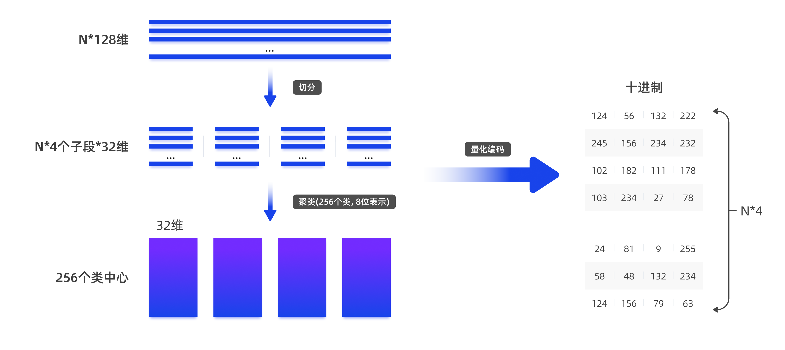
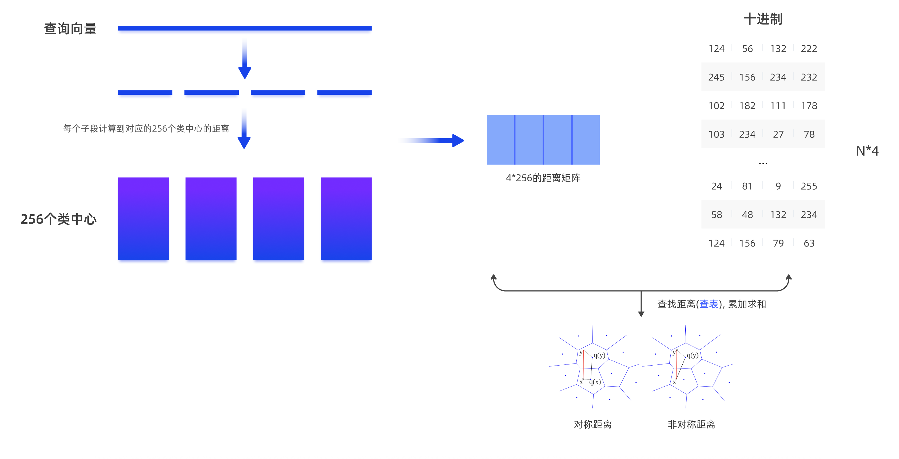
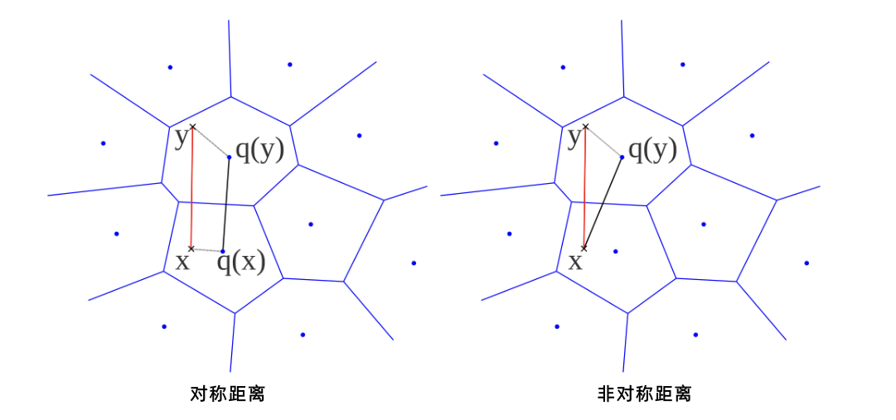

## 谁说国产只会套壳, 这个国产向量数据库就不是pgvector套壳   
            
### 作者            
digoal            
            
### 日期            
2025-09-24            
            
### 标签            
PostgreSQL , PolarDB , DuckDB , openGauss , vexDB , vector , ivfflat , ivfpq , Product Quantization , graph index , hnsw , diskann  
            
----            
            
## 背景    
提起国产数据库, 总有人会跳出来说, 肯定是开源套壳!    
  
今天就打脸, 谁说国产只会套壳, 这个国产向量数据库就不是pgvector套壳.   
  
随着AI的火爆, AI数据库的需求也被引爆, 最初爆火的是向量数据库, 如今PG生态中已经有非常非常多的向量插件, 从最初的pgvector(现已16k star), 到现在遍地开花的插件: 阿里云pase, vectorchord, pgvectorscale, pg_vectorize等.  这些插件以及索引搜索算法等在我的github中有过大量的介绍, 有兴趣可查阅我的github: https://github.com/digoal/blog    
  
向量索引的构造基本上也分为2派:  
- 纯内存  
- 可落盘  
  
搜索算法派系则比较多:   
- ivfflat  
- hnsw  
- diskann  
- 还有经过大量业务实践后衍生出来的改良版本: scale组合 / pre filter的、内置量化的等等  
  
向量类型也很多派系:  
- 稀疏向量  
- 稠密向量  
- 量化向量  
- 多向量(向量数组) 等  
  
要感谢开源社区和各位商业产品供应商, 让向量数据库得到了飞速的发展.    
  
今天要分享的这个向量数据库vexdb不是开源的, 但提供了免费下载和使用. 文档也相对完整, 背后的团队也太牛了, 清华大学李国良教授带队开发.   
  
slogen: 为AI而生的向量数据库 , VexDB，源于清华, VexDB是一款融合关系数据能力、多路语义检索能力的向量数据库.  
  
话不多说, 为什么我说这个国产向量数据库就不是pgvector套壳呢! 文档中就有证据.  
  
例如它支持的向量索引搜索算法超越了pgvector支持的ivfflat和hnsw, 同时也支持了混合索引(带标量类型条件)、全文索引. 支持如下:   
- IVFFlat 索引  
- IVFPQ 索引  
- Graph_Index 索引  
- DiskANN 索引  
- HybridANN 混合索引
- 全文检索索引
  
以ivfpq索引为例, 这个索引是ivf的改进版本, 内置了量化技术, 降低了在检索过程中的运算量、索引的内存消耗. 同样硬件在不过分牺牲召回率表现的情况下, 性能大幅度提升.  
  
这就是创新!  
  
下面是ivfpq的文档, 一起学习一下吧. graph_index和diskann各位可继续阅读其文档  
- https://vexdb.com/docs/user-guide/ivfpq  
  
# IVFPQ 索引  
IVFPQ（Product Quantization, 乘积量化）索引是对 IVFFlat 索引的变形， 在 IVFFlat 的基础上增加了乘积量化算法，牺牲了一定的查询精度来换取构建和查询性能的优化。  
  
## 原理介绍  
### IVFPQ 算法  
  
IVF算法的目的是减少需要计算距离的目标向量的个数，只计算部分向量与查询向量间的距离。为了继续提高查询效率，采用乘积量化（PQ）的算法，优化计算距离的过程。即：先通过IVF算法将全部向量分成若干个簇，在每个簇中，使用PQ算法进行降维。  
  
当采用PQ算法处理一个向量时，高维向量经过降维被分成若干个子向量，这些子向量经过K-means聚类处理后被分配给距离它们最近的（子）簇，我们用这个（子）簇心的ID来代表这个子向量。占用大量内存的高维向量被转化为ID向量后，显著降低了向量数据占用的内存空间，这也是乘积量化的意义。  
  
由这些子向量组成的ID集合被称为“码本”。假设一个原始向量被分为K个类，每个类中包含M段子向量，那么这个码本所能表示的样本空间容量为 `K^M`，即M个码本的笛卡尔积，这也是乘积量化中“乘积”的由来。  
  
以下图为例，在索引构建过程中，先将一个128维的向量分成4段，每段32维，每段通过聚类量化为8位（256个聚类中心，`2^8`），即一个128维的向量可以量化成4维（每维8位）表示。经过K-means聚类处理后，得到了256个类，每个类都有一个码本。通过这样的方式，最终得以用较短的编码来表示样本，从而达到量化的目的。  
  
    
  
  
那么乘积量化是如何优化距离计算过程的呢？由于PQ算法假定了处于同一个簇中的向量段离查询向量的距离相同。因此，对于一个被分为m段子向量的查询向量，计算此查询向量与每个向量间的距离时，只需要查m次表。  
  
例如在检索时，以同样的方法把128维的查询向量分成4段的3 维向量，计算每一段向量与当前段聚类中心的距离得到一个`4*256`的表，将查询向量量化为m1,m2,m3,m4，然后从前面计算的表中查询计算查询向量与库里面向量的距离 `d=d1+d2+d3+d4`（d1为查询向量第一段子向量与其ID为m1 的簇心的距离，d2、d3和d4同理）。  
  
    
  
PQ乘积量化方法在计算距离的时候，有两种距离计算方式：对称距离和非对称距离。对称距离速度更快，而非对称距离的损失更小，也就是更接近真实的距离。  
- 对称距离：查询向量所属的聚类中心与所有样本所属聚类中心的距离；  
- 非对称距离：查询向量与所有样本所属聚类中心的距离。  
  
如下图所示，假设有查询向量x和数据库中的向量y，那么：  
  
对称距离：向量x和向量y都由其聚类中心`q(x)`、`q(y)`表示，距离`d(x,y)`可通过距离`d(q(x),q(y))`来估算；  
  
非对称距离：查询向量x不经过量化，距离`d(x,y)`可通过距离`d(x,q(y))`来估算。  
  
    
  
由于计算过程中采用的是近似距离，因而造成了一定的误差。由此可知PQ算法加快了速度但是会损失一定的精度。  
  
## 索引参数  
### 索引构建参数  
参数名称	| 取值说明	| 参数描述  
---|---|---  
ivf_nlist	| 取值范围：1~65535 默认值：100	| 索引中倒排列表的数量，即划分的“簇”的个数。  
num_subquantizers	| 取值范围：1~65535 默认值：8	| 指定将一个原始向量维度(d)量化成多少个段，num_subquantizers 一般小于原始向量的维数（d），且 d 必须是 num_subquantizers 的整数倍。  
nbits	| 取值范围：1~16 默认值：8	| 指定原始向量分段后每段子向量编码的 bit 数。  
by_residual	| 取值范围：true/false 默认值：true	| 是否用残差进行量化。  
parallel_workers	| 取值范围：0~64 默认值：0	| 并行构建参数，构建索引并行计算线程数。  
  
### GUC 构建参数  
参数名称	| 取值说明	| 参数描述  
---|---|---  
ivf_extend_file_block_batch_count	| 取值范围：1~1024 默认值：64	| 该实例级参数指定了索引文件写满后，扩展时批量分配的 8K 数据页的个数。通过批量分配 ivf_extend_file_block_batch_count 个页，可以在读写时更高效地利用操作系统缓存。  
  
### GUC查询参数  
参数名称	| 取值说明	| 参数描述  
---|---|---  
ivf_probes	| 取值范围：1~65535 默认值：1	| 会话级参数，指定查询范围包含的倒排列表数，即查询的“簇”的个数。ivf_probes 的上限为 ivf_nlist，如果设置为超过 ivf_nlists 的值， 系统会自动设置ivf_probes = ivf_nlist。  
ivfpq_refine_k_factor	| 取值范围：1.0~10000.0 默认值：2.0	| 会话级参数，控制初步筛选的候选向量的多寡。  
max_vector_indexer_query_threads	| 取值范围：整型，0,256 默认值：0，表示关闭向量并行检索。	| 同时进行向量检索的最大并行线程数。  
  
  
### 索引构建操作符  
索引操作符	| 操作符描述  
---|---  
floatvector_cosine_ops	| 计算向量的余弦距离。  
floatvector_l2_ops	| 计算向量的欧几里得距离。  
floatvector_ip_ops	| 计算向量的内积。  
  
> 说明  
> 上述参数在索引构建阶段和向量查询阶段的具体使用方式，可参考使用示例。  
  
## 使用建议  
- 建立 IVFPQ 索引时， 表中数据不宜过少，建议不少于 104 条数据。  
- 建议将所有需要查询的数据提前插入表中，最后再建立索引；如果决定先建立索引再导入数据，在数据导入完成后需要重建索引。  
- 建立索引后如果数据变化（含插入、删除、更新）超过 20% 会产生数据分布漂移，导致查询精度下降与查询时间不稳定，建议每更新 40%~60% 数据重建一次索引。  
- 当需要提升索引构建速度， 可以适当增大 parallel_workers， 建议设置为机器 CPU 核数的 75%，最大值 64。  
- 当需要提升查询召回率时， 可考虑以下措施：  
- 适当增大 ivf_probes，ivf_probes 越大，召回率越高，查询越慢，当 ivf_probes = ivf_nlist 时，索引查询等同于全表扫描。  
- 增大 ivfpq_refine_k_factor，一定范围内 ivfpq_refine_k_factor 越大越有利于提高召回率，查询越慢。  
- 增大 nbits，nbits 越大，召回率越高但相应的查询延时会变高。  
- 增大 num_subquantizers，num_subquantizers 越大，召回率越高但相应的查询延时会变高。  
- nbits 推荐值一般为 8 的倍数。  
- 通常建议 ivf_lists 的值至少为 10。较高的 ivf_nlist 值可通过缩小查询的搜索空间来加快查询速度。然而，缩小查询搜索空间可能会导致召回率降低。  
- 对于少于一百万行的数据集，建议设置 ivf_nlist =  rows / 1000；对于超过一百万行的数据集，建议设置 ivf_nlist = sqrt(rows)。  
- 如果向量检索时，查询未按照预期走索引，请参考向量查询不走索引中介绍的内容进行排查，确认查询是否满足走索引的条件。  
  
## 使用示例  
  
看完示例不要奇怪, 是不是很像PostgreSQL? 也可能是openGauss呢? 有兴趣可申请免费试用玩一下.    
  
文档写得这么仔细的国产数据库不多见, 会PG的话, 上手也简单!     
  
1、数据准备：创建生成随机向量的函数。  
```  
CREATE OR REPLACE FUNCTION random_array(dim integer,min_value int, max_value int)  
RETURNS text  
AS $$  
SELECT REGEXP_REPLACE(REGEXP_REPLACE(array_agg(round(random()* (max_value - min_value + 1) + min_value,3))::text,'{','['),'}',']')  
FROM generate_series(1, dim);  
$$  
LANGUAGE SQL  
VOLATILE  
COST 1;  
```  
  
2、创建含向量类型字段的测试表，并调用上一步创建的函数插入向量数据。  
```  
drop table t_1194690;  
CREATE TABLE t_1194690(id BIGINT, v floatVECTOR(15));  
INSERT INTO t_1194690 SELECT i, random_array(15,1,3)::floatvector(15) FROM generate_series(1, 10000) AS i;  
```  
  
3、创建IVFPQ索引。  
  
按余弦距离构建索引：  
```  
CREATE INDEX idx_1194690a ON t_1194690 USING ivfpq(v floatvector_cosine_ops)WITH(ivf_nlist= 100, num_subquantizers=3,nbits=4,parallel_workers=1);  
```  
  
按欧几里得距离构建索引：  
```  
CREATE INDEX idx_1194690b ON t_1194690 USING ivfpq(v floatvector_l2_ops)WITH(ivf_nlist= 100, num_subquantizers=3,nbits=4,parallel_workers=1);  
```  
  
按内积构建索引：  
```  
CREATE INDEX idx_1194690c ON t_1194690 USING ivfpq(v floatvector_ip_ops)WITH(ivf_nlist= 100, num_subquantizers=3,nbits=4,parallel_workers=1);  
```  
  
索引构建参数也可省略，此时参数设置为默认值：  
```  
CREATE INDEX idx_1194690d ON t_1194690 USING ivfpq(v floatvector_ip_ops)WITH(num_subquantizers=3);  
```  
  
4、进行向量相似性搜索：  
  
设置查询参数：  
```  
set ivf_probes = 10;  
```  
  
按余弦距离排序：  
```  
SELECT * FROM t_1194690   
ORDER BY v <=> '[1.0,1.0,1.0,1.0,1.0,1.0,1.0,1.0,1.0,1.0,1.0,1.0,1.0,1.0,1.0]'::floatvector  
LIMIT 10;  
```  
  
按欧几里得距离排序：  
```  
SELECT * FROM t_1194690   
ORDER BY v <-> '[1.0,1.0,1.0,1.0,1.0,1.0,1.0,1.0,1.0,1.0,1.0,1.0,1.0,1.0,1.0]'::floatvector  
LIMIT 10;  
```  
  
按内积排序：  
```  
SELECT * FROM t_1194690   
ORDER BY v <#> '[1.0,1.0,1.0,1.0,1.0,1.0,1.0,1.0,1.0,1.0,1.0,1.0,1.0,1.0,1.0]'::floatvector  
LIMIT 10;  
```  
    
#### [期望 PostgreSQL|开源PolarDB 增加什么功能?](https://github.com/digoal/blog/issues/76 "269ac3d1c492e938c0191101c7238216")
  
  
#### [PolarDB 开源数据库](https://openpolardb.com/home "57258f76c37864c6e6d23383d05714ea")
  
  
#### [PolarDB 学习图谱](https://www.aliyun.com/database/openpolardb/activity "8642f60e04ed0c814bf9cb9677976bd4")
  
  
#### [PostgreSQL 解决方案集合](../201706/20170601_02.md "40cff096e9ed7122c512b35d8561d9c8")
  
  
#### [德哥 / digoal's Github - 公益是一辈子的事.](https://github.com/digoal/blog/blob/master/README.md "22709685feb7cab07d30f30387f0a9ae")
  
  
#### [About 德哥](https://github.com/digoal/blog/blob/master/me/readme.md "a37735981e7704886ffd590565582dd0")
  
  

  
