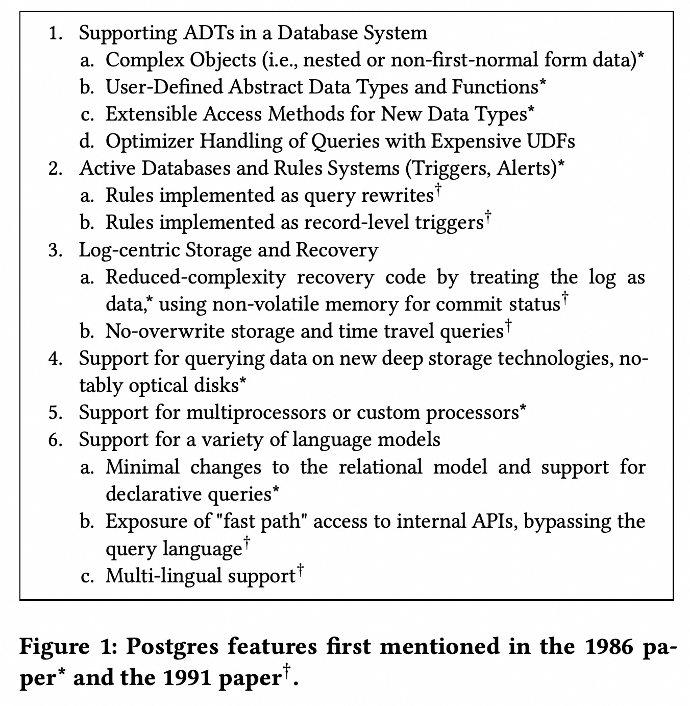

## AI论文解读 | Looking Back at Postgres
        
### 作者        
digoal        
        
### 日期        
2025-09-25       
        
### 标签        
PostgreSQL , PolarDB , DuckDB , AI , 论文解读        
        
----        
        
## 背景  
      
https://arxiv.org/pdf/1901.01973        
  
提示:          
```          
读懂《Looking Back at Postgres》这篇论文需要提前掌握哪些基础知识, 请使用中文通熟易懂的讲解这些基础知识, 可以引用论文中的图、表或使用Markdown支持的图形(text,mermaid等)增加解释性. 
  
使用中文通熟易懂的解读《Looking Back at Postgres》这篇论文, 其中的关键内容请着重讲解, 可以引用论文中的图、表或使用Markdown支持的图形(text,mermaid等)增加解释性. 
  
提取《Looking Back at Postgres》这篇论文中的重要术语, 使用中文对这些术语进行通熟易懂的讲解, 可以引用论文中的图、表或使用Markdown支持的图形(text,mermaid等)增加解释性. 
```     
  
## 1 前置知识 
  
阅读《Looking Back at Postgres》这篇论文，为了更好地理解其内容，你需要掌握以下几个方面的基础知识：

### 1. 关系型数据库 (Relational Databases)
这篇论文的核心是围绕 Postgres 数据库系统展开的，而 Postgres 是一个关系型数据库管理系统（DBMS）。因此，了解关系型数据库的基本概念至关重要。

* **数据模型 (Data Model):** 关系型数据库以表格的形式组织数据，每个表格包含行和列。Codd 的关系模型是其基础理论，它定义了数据如何被存储、管理和操作。
* **Ingres:** 在 Postgres 之前，Michael Stonebraker 团队在伯克利成功地进行了 Ingres 研究项目，并创建了相应的公司 Relational Technology, Inc. (RTI) 。理解 Ingres 的成功为 Postgres 的诞生奠定了基础，因为 Postgres 的名字 "Post-Ingres" 就意味着它是在 Ingres 之后，旨在超越 Ingres 。
* **SQL:** 结构化查询语言（Structured Query Language）是用于管理和操作关系型数据库的标准语言。论文中提到，Postgres 最初使用的是一种叫做 Postquel 的语言，后来为了与行业标准接轨，转而支持 SQL 。

### 2. 数据库扩展与新趋势 (Database Extensions and New Trends)
Postgres 论文的主要贡献在于它对传统关系模型的扩展，因此你需要了解这些扩展所针对的问题和背景。

* **抽象数据类型 (Abstract Data Types, ADTs):** 论文中多次提到 ADTs 。在传统的数据库中，数据类型（如整数、字符串）是固定的。ADTs 允许用户自定义复杂的数据类型和相应的操作，例如，为了支持 CAD（计算机辅助设计）工具，需要处理“多边形、矩形、文本串”等新的数据类型 。
* **对象关系型数据库 (Object-Relational Databases):** 这是 Postgres 的一个标志性主题 。它旨在将面向对象编程的思想融入到关系型数据库中，允许数据库不仅能存储传统的行和列，还能处理“复杂对象”（nested objects）和用户自定义的函数 。
* **用户自定义函数 (User-Defined Functions, UDFs):** UDFs 允许用户编写自己的代码并在数据库内部执行，从而实现复杂的数据操作 。论文提到，这在当时是一个超前的想法，因为存在“推送代码到数据”（pushing code to data）的性能优势，但同时也带来了安全隐患，这在后来 Oracle 的负面营销中被利用 。
* **可扩展的访问方法 (Extensible Access Methods):** 关系型数据库通常使用 B-树（B-trees）来索引数据，但这种方法只适用于一维查询 。为了支持 CAD 和地图应用中常见的二维范围查询，Postgres 引入了可扩展的访问方法，最著名的例子就是 R-树（R-tree） 。

### 3. 存储与并发控制 (Storage and Concurrency Control)
论文中讨论了 Postgres 在存储和恢复方面的独特设计，这需要你对数据库的底层机制有所了解。

* **写前日志 (Write-Ahead Logging, WAL):** 这是大多数商业数据库系统用于实现数据恢复的标准技术 。然而，Stonebraker 认为 WAL 方案过于复杂，因此 Postgres 尝试了一种不同的方法 。
* **版本化数据 (Versioned Data) 与时间旅行查询 (Time-Travel Queries):** Postgres 独特的存储系统将主存储和历史日志统一起来，将每条记录存储为一个包含事务 ID 的版本链 。这简化了恢复过程，并使得“时间旅行查询”成为可能，即查询某个特定时间点的数据状态 。尽管这个设计最终因性能问题被 PostgreSQL 社区放弃，但它在当时是一个非常新颖的理念 。

### 4. 并行数据库与分布式系统 (Parallel Databases and Distributed Systems)
了解多处理器和分布式系统有助于理解 Postgres 在扩展性方面的尝试。

* **共享-无架构 (Shared-Nothing Architecture):** 论文中提到了 Stonebraker 的一篇重要论文《The Case for Shared Nothing》，这是一种并行数据库架构，每个节点都有自己的处理器、内存和磁盘，节点之间只通过网络通信 。这种架构在后来的“大数据”浪潮中被重新发现并广泛应用。
* **XPRS 项目:** 这是一个将 Postgres 与 Sprite 分布式操作系统和 RAID 存储架构结合的“共享内存”（shared-memory）项目 。该项目最主要的贡献是其并行查询优化器，由 Wei Hong 提出，它将单节点查询优化与并行化分离开来，简化了问题 。

---
这些基础知识为理解 Postgres 论文中提出的各种创新理念提供了必要的背景。

我想知道你对论文的哪个部分最感兴趣？例如，是它对数据库未来发展的影响，还是它在商业化方面的成功故事？这可以帮助我更好地为你提供下一步的信息。
  
## 2 解读论文 
  
好的，我们来一起深入解读这篇回顾Postgres发展历程的精彩论文——《Looking Back at Postgres》。

这篇论文由Joseph M. Hellerstein撰写，他是Postgres项目后期的一名学生成员。文章以亲历者的视角，回顾了由图灵奖得主Michael Stonebraker在20世纪80年代中期至90年代中期领导的Postgres项目。这不仅是一次技术巡礼，更充满了对项目背后设计哲学、团队文化以及深远影响的洞见。

一句话概括：**Postgres是一个极具野心的“后浪”项目，它不仅成功超越了其前身Ingres，还开创了许多至今仍在影响数据库领域的核心技术，并最终通过开源社区的努力演变成为了世界上最受欢迎的开源数据库之一——PostgreSQL。**

-----

### **Postgres的核心技术贡献：远见卓识的设计**

Postgres项目的目标是打造一个“一刀切”(one-size-fits-all)的数据库系统，为此，它在多个技术方向上进行了大胆的探索。论文中的图1（如下所示）清晰地列出了其主要特性，这些特性在当时都极具前瞻性。

  

```text
1. 支持数据库系统中的抽象数据类型 (ADT)
   a. 复杂对象 (例如，嵌套或非第一范式数据)
   b. 用户定义的抽象数据类型和函数
   c. 针对新数据类型的可扩展访问方法
   d. 对包含昂贵用户定义函数的查询进行优化器处理
2. 主动数据库和规则系统 (触发器, 警报)
   a. 实现为查询重写的规则
   b. 实现为记录级别触发器的规则
3. 以日志为中心的存储和恢复
   a. 将日志视为数据，从而降低恢复代码的复杂性；使用非易失性内存记录提交状态
   b. 无覆盖存储和时间旅行查询
4. 支持查询存储在新兴海量存储技术（特别是光盘）上的数据
5. 支持多处理器或定制处理器
6. 支持多种语言模型
   a. 对关系模型的最小改动，并支持声明式查询
   b. 暴露“快速路径”访问内部API，绕过查询语言
   c. 多语言支持
```

*图1：论文中总结的Postgres项目核心技术特性。*

下面我们重点解读其中几个关键内容：

#### **1. 对象-关系数据库的奠基者**

这是Postgres最核心的贡献。在它之前，关系型数据库只能处理像数字、字符串这样的简单数据。但现实世界的数据往往是复杂的，比如一个包含多个商品项的“采购订单”，或是一个由各种多边形组成的“CAD设计图” 。

  * **复杂对象与用户定义类型 (ADT/UDF)**: Postgres允许用户在数据库中定义自己的复杂数据类型（比如“点”、“线”、“多边形”）以及操作这些类型的函数 。这意味着你可以把处理特定领域逻辑的代码（比如计算两个地理位置的距离）直接“推到”数据库里执行，而不是把大量数据“拉到”应用程序里再处理，从而极大地提升了性能 。这个“代码推向数据”的思想，甚至在几十年后的大数据处理框架（如MapReduce）中得到了再次体现 。

  * **可扩展的索引**: 传统数据库的B-tree索引只擅长处理一维数据的精确查找和范围查询 。对于地理信息系统（GIS）中的二维空间查询（例如“查找我附近5公里内的所有餐馆”），B-tree就无能为力了。Postgres项目组为此开发了R-tree等创新的索引结构 ，并设计了一套可扩展的访问方法（Access Methods）架构 。这使得开发者可以像插件一样为Postgres添加新的索引类型，以支持各种新数据的高效查询。如今PostgreSQL中强大的PostGIS地理信息系统就是这一思想的直接受益者 。

#### **2. 规则系统与主动数据库**

Postgres引入了强大的规则系统，允许用户定义“如果发生某事，就自动做另一件事”的逻辑，也就是我们今天所熟知的**触发器 (Triggers)** 。例如，你可以创建一个规则：“每当员工的工资记录被更新时，自动在审计日志表中插入一条记录”。

Postgres的独特之处在于它尝试了两种实现方式 ：

  * **查询重写 (Query Rewrite)**: 将用户的操作（如UPDATE）在执行前改写成一个更复杂的查询，把规则的逻辑包含进去 。
  * **行级触发 (Row-level Triggers)**: 在数据行被修改时，通过类似锁的机制来触发相应的动作 。

尽管这些规则系统因为逻辑复杂可能导致性能问题和维护困难，但它们奠定了现代数据库中触发器和物化视图等功能的基础 。

#### **3. 颠覆性的存储与恢复机制**

Stonebraker对当时主流数据库使用的“预写日志”（Write-Ahead Log, WAL）技术感到不满，认为它过于复杂，尤其是在系统崩溃后进行恢复时风险很高 。

为此，Postgres设计了一套以日志为中心的存储系统 ：

  * **不覆盖数据 (No-overwrite)**: 当你更新一条记录时，它不会直接在原来的位置上修改，而是将旧版本保留，并创建一个新版本。所有版本的记录通过一个链表连接起来 。
  * **时间旅行查询 (Time Travel)**: 这种设计带来一个神奇的副作用——你可以查询数据库在过去任意一个时间点的状态 。这对于数据审计、错误恢复等场景非常有用。

虽然为了追求更高的事务处理性能，后来的PostgreSQL最终还是回归到了WAL机制 ，但Postgres的这种版本化存储思想，在今天许多追求简单、可靠的NoSQL系统和内存数据库中得到了回响和重生 。

-----

### **从学术原型到商业巨擘：Postgres的软件影响力**

#### **开源的奇迹：PostgreSQL的诞生**

Postgres项目本身是一个开源的学术研究项目 。在研究项目接近尾声时，两位学生Andrew Yu和Jolly Chen将其查询语言从Postquel修改为更通用的SQL，并发布了Postgres95，这便是PostgreSQL的前身 。

之后，一个完全由志愿者组成的“接力团队”接管了代码的维护和开发 。他们展现了开源社区最强大的力量：持续几十年的投入，将一个学术原型打磨成了一个极其稳定、功能丰富的生产级数据库系统 。如今，PostgreSQL是世界上最受欢迎的独立开源数据库，在整体数据库流行度排名中也高居第四 。

#### **商业化的巨大成功**

Postgres宽松的开源许可证和强大的功能，使其成为众多商业数据库公司的理想起点。论文作者统计，基于Postgres的商业公司产生的收购总额已经**超过了26亿美元** 。

  * **Illustra**: Stonebraker自己创办的公司，旨在将Postgres商业化，后被Informix以4亿美元收购 。
  * **Netezza**: 基于PostgreSQL开发的高性能并行数据仓库一体机，最终被IBM以17亿美元收购 。
  * **Greenplum**: 首个将PostgreSQL改造为大规模并行处理（MPP）架构的公司，被EMC以约3亿美元收购 。
  * **Aster Data**: 由斯坦福学生创立，基于PostgreSQL开发分析引擎，被Teradata以2.63亿美元收购 。
  * **ParAccel**: 其技术被亚马逊采用，成为了云数据仓库巨头 **AWS Redshift** 的基础，可以说Postgres在云时代实现了终极的统治 。

-----

### **这篇论文带给我们的启示**

作者最后总结了从Postgres的成功中可以学到的几个重要经验：

1.  **好的架构可以战胜“第二系统效应”**: 很多成功的项目在开发第二个版本时，会因为贪多求全而失败。Postgres虽然也是一个功能庞杂的“第二系统”，但它成功的核心在于其**为可扩展性而生的设计** 。有了良好的扩展性，你就可以大胆尝试各种新功能，让优秀的设计自然胜出。
2.  **“通用”依然强大**: 虽然Stonebraker后期也提倡“一种尺寸并不适合所有场景”，但Postgres这个“伯克利时期的Stonebraker”的杰作证明了，一个优秀的通用架构可以解决绝大多数数据库问题 。
3.  **开源的力量无可估量**: Stonebraker本人也谦虚地表示，PostgreSQL的巨大成功很大程度上要归功于他甚至不认识的开源社区志愿者 。这给所有研究者的启示是：“**做一些重要的事情，然后将它释放出去**” (do something important and set it free) 。

总而言之，Postgres项目不仅是一次技术上的巨大飞跃，它的设计哲学、开源模式和深远的商业影响，使其成为了计算机科学史上一个教科书般的成功案例。

-----

希望这份详细的解读能帮助您更好地理解这篇论文。接下来，我们是不是可以聊聊您对Postgres的哪个特定技术特性最感兴趣，或者想了解一下它与当今其他数据库（比如MySQL或NoSQL）相比有何不同？
  
## 3 术语 
  
从《Looking Back at Postgres》这篇论文中，可以提取出以下几个重要的技术术语，并用通俗易懂的方式进行解释：

### 1\. Postgres

**Postgres** 是一个起源于加州大学伯克利分校的研究项目，由 Michael Stonebraker 领导，旨在开发一个“一站式”的数据库系统 。它的名字意为“后 Ingres”（Post-Ingres），因为它是继 Stonebraker 团队的 Ingres 项目之后的又一个雄心勃勃的努力 。Postgres 是 PostgreSQL 的前身，后者是目前世界上最受欢迎的独立开源数据库系统之一 。

### 2\. 对象关系型数据库 (Object-Relational Database)

这是 Postgres 的核心思想之一。它结合了两种主要的数据处理模型：

  * **关系型 (Relational):** 以表格的形式组织数据，使用 SQL 等声明式查询语言进行操作。
  * **面向对象 (Object-Oriented):** 允许用户创建“对象”，这些对象可以包含复杂的数据结构（如嵌套的元组或表），并定义对这些数据进行操作的函数 。

论文中提到，这种模式能让数据库处理更复杂的数据类型，比如 CAD（计算机辅助设计）工具中的多边形和矩形 。

### 3\. 抽象数据类型 (Abstract Data Types, ADTs)

ADTs 是 Postgres 能够实现对象关系型特性的关键技术 。简单来说，ADTs 允许开发者自定义新的数据类型，并定义对这些数据类型进行操作的函数 。这些新类型对数据库系统本身是“不透明”的（opaque），即数据库核心不需要知道如何解释它们，而只需要知道如何存储和调用用户提供的函数来处理它们 。例如，一个图像处理应用程序可以在数据库中定义一个“图像”ADT，并为其创建“旋转”或“裁剪”等函数。

### 4\. 可扩展访问方法 (Extensible Access Methods)

传统的数据库通常只支持像 B-树这样的索引结构，它们最适合于处理简单的相等或一维范围查询 。但对于像地理信息系统（GIS）或 CAD 工具中的二维空间查询，这就不够用了 。

Postgres 通过引入可扩展访问方法解决了这个问题。它允许用户向数据库中添加新的索引结构（如 R-树），并让查询优化器知道如何利用这些新索引来高效地执行查询 。这使得数据库能够灵活地适应各种新型应用的需求。

### 5\. 时间旅行查询 (Time-Travel Queries)

这是 Postgres 存储系统的一个独特功能。论文指出，Postgres 的设计初衷是简化恢复代码，因此它将数据本身和历史日志统一起来 。每一条数据记录都带有一个版本戳，并以版本链的形式存储 。这个设计使得用户可以查询“某个特定时间点”的数据状态 。虽然这个功能最终在 PostgreSQL 中被更传统的写前日志（WAL）所取代，但其理念在今天仍然很有价值 。

-----

你提到可以引用图或表，论文中有一张图清楚地列出了 Postgres 的各项特性：

  

这张图概括了 Postgres 在不同时期所关注的各项技术，其中带有星号（\*）的特性在 1986 年的论文中就已提及，带有匕首（†）的特性则在 1991 年的论文中首次出现 。

希望这些解释能帮助你更好地理解论文内容。你最想进一步了解哪一个术语，或者想知道它们与现代数据库技术有何关联？
  
## 参考        
         
https://arxiv.org/pdf/1901.01973    
        
<b> 以上内容基于DeepSeek、Qwen、Gemini及诸多AI生成, 轻微人工调整, 感谢杭州深度求索人工智能、阿里云、Google等公司. </b>        
        
<b> AI 生成的内容请自行辨别正确性, 当然也多了些许踩坑的乐趣, 毕竟冒险是每个男人的天性.  </b>        
    
#### [期望 PostgreSQL|开源PolarDB 增加什么功能?](https://github.com/digoal/blog/issues/76 "269ac3d1c492e938c0191101c7238216")
  
  
#### [PolarDB 开源数据库](https://openpolardb.com/home "57258f76c37864c6e6d23383d05714ea")
  
  
#### [PolarDB 学习图谱](https://www.aliyun.com/database/openpolardb/activity "8642f60e04ed0c814bf9cb9677976bd4")
  
  
#### [PostgreSQL 解决方案集合](../201706/20170601_02.md "40cff096e9ed7122c512b35d8561d9c8")
  
  
#### [德哥 / digoal's Github - 公益是一辈子的事.](https://github.com/digoal/blog/blob/master/README.md "22709685feb7cab07d30f30387f0a9ae")
  
  
#### [About 德哥](https://github.com/digoal/blog/blob/master/me/readme.md "a37735981e7704886ffd590565582dd0")
  
  

  
