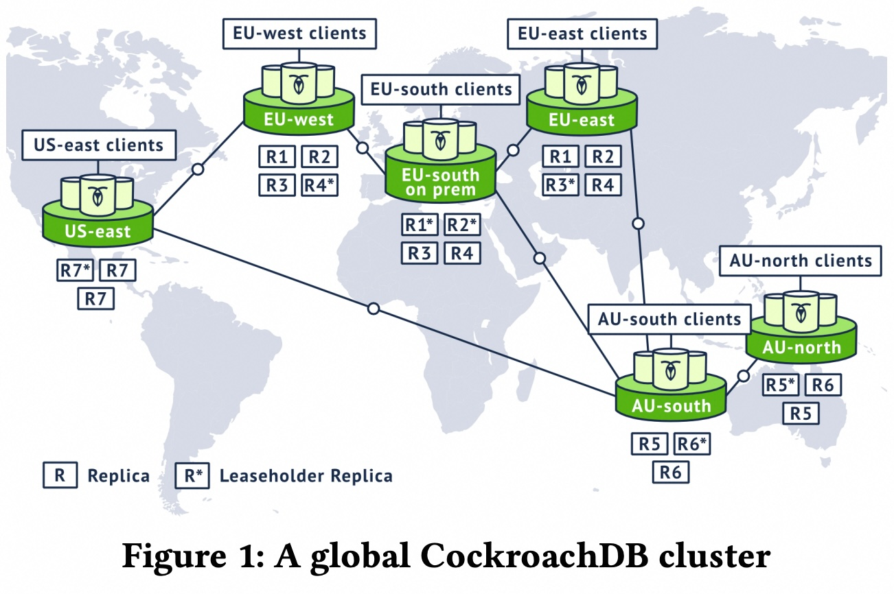
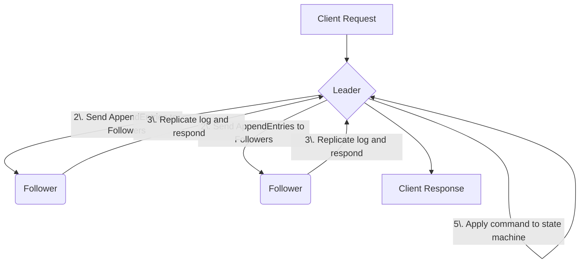
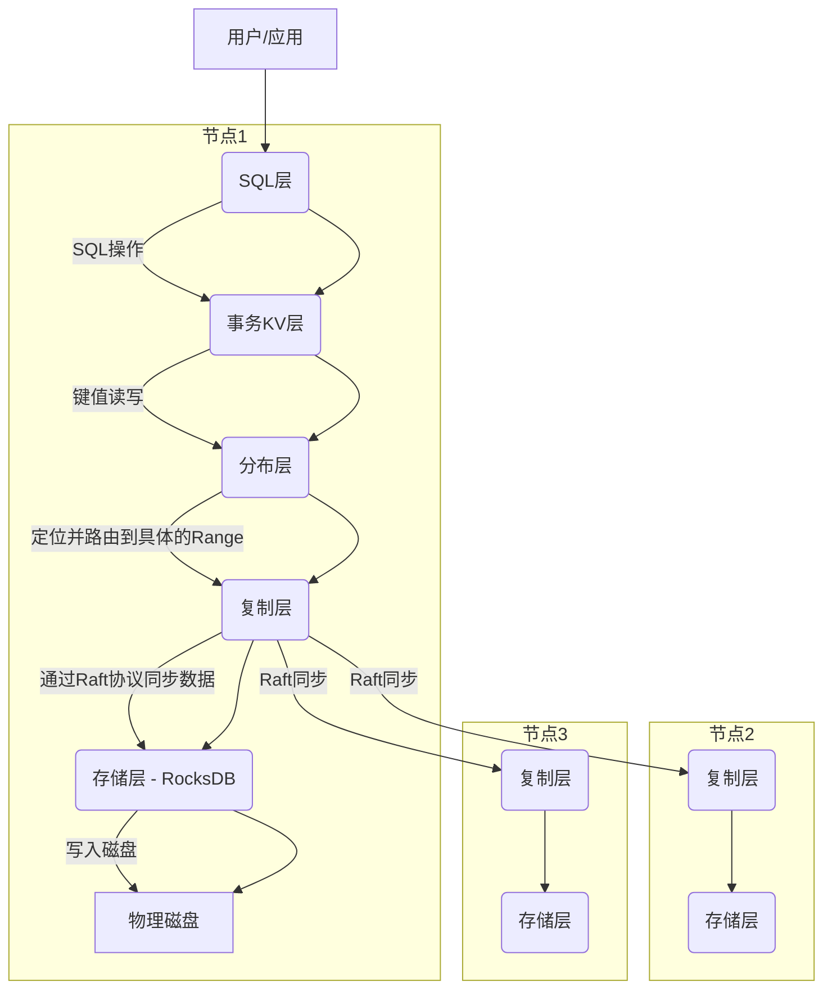
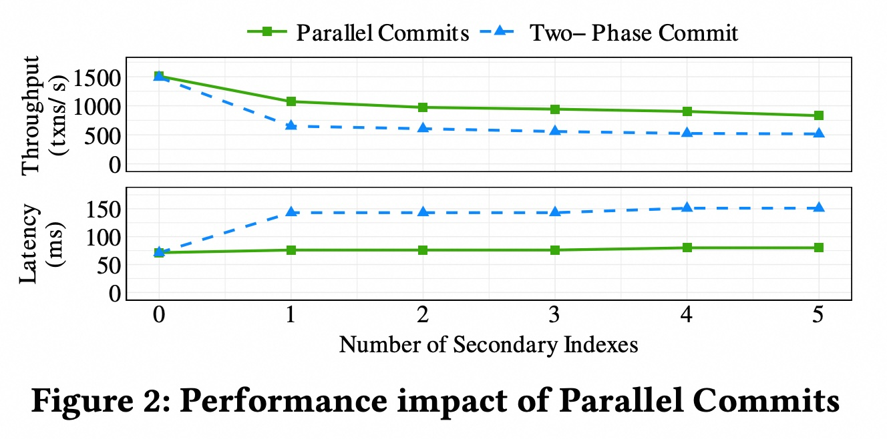
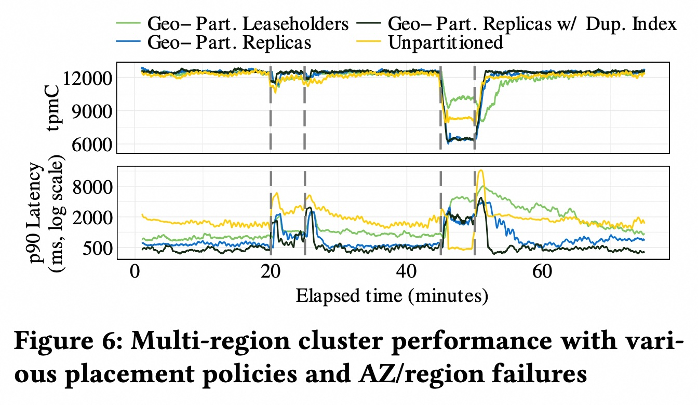

## AI论文解读 | CockroachDB: The Resilient Geo-Distributed SQL Database
        
### 作者        
digoal        
        
### 日期        
2025-09-25       
        
### 标签        
PostgreSQL , PolarDB , DuckDB , AI , 论文解读        
        
----        
        
## 背景  
      
https://dl.acm.org/doi/pdf/10.1145/3318464.3386134        
  
提示:          
```          
读懂《CockroachDB: The Resilient Geo-Distributed SQL Database》这篇论文需要提前掌握哪些基础知识, 请使用中文通熟易懂的讲解这些基础知识, 可以引用论文中的图、表或使用Markdown支持的图形(text,mermaid等)增加解释性. 
  
使用中文通熟易懂的解读《CockroachDB: The Resilient Geo-Distributed SQL Database》这篇论文, 其中的关键内容请着重讲解, 可以引用论文中的图、表或使用Markdown支持的图形(text,mermaid等)增加解释性. 
  
提取《CockroachDB: The Resilient Geo-Distributed SQL Database》这篇论文中的重要术语, 使用中文对这些术语进行通熟易懂的讲解, 可以引用论文中的图、表或使用Markdown支持的图形(text,mermaid等)增加解释性. 
```     
  
## 1 前置知识 
  
您好，要读懂《CockroachDB: The Resilient Geo-Distributed SQL Database》这篇论文，您需要提前掌握一些关键的计算机科学和数据库基础知识。这篇论文的核心在于解决**全球范围内的分布式数据库**问题，因此它的设计建立在以下几个核心技术基石之上：

### 1. 分布式系统基础 (Distributed Systems)

这篇论文的核心就是解决分布式环境下的数据库问题。您需要理解分布式系统的基本挑战，比如：
* **节点故障 (Node Failure)**：单个服务器宕机了怎么办？
* **网络分区 (Network Partition)**：网络断开导致部分服务器无法通信怎么办？
* **延迟 (Latency)**：数据在全球多个地点分布，如何处理跨洋通信带来的高延迟？

论文中展示的图1就是一个典型的全球分布式集群，它将节点部署在不同大洲的多个区域，以应对这些挑战 。

  

### 2. 数据库事务理论 (Database Transaction Theory)

这篇论文围绕着如何在一个分布式系统中提供完整的SQL功能和事务支持。您需要了解以下概念：
* **OLTP (Online Transaction Processing)**：这是一种高并发、高吞吐量的联机事务处理工作负载 。
* **ACID (Atomicity, Consistency, Isolation, Durability)**：这是数据库事务的四大特性，是确保数据可靠性的基础。
* **MVCC (Multi-Version Concurrency Control)**：多版本并发控制。这是一种并发控制机制，允许多个事务同时访问同一份数据而互不干扰。CockroachDB 使用了 MVCC 来实现可串行化隔离 (Serializable Isolation) 。
* **可串行化隔离 (Serializable Isolation)**：这是最高的事务隔离级别，保证并发执行的事务结果与串行执行的结果完全一致 。

### 3. 一致性协议 (Consensus Algorithms)

在分布式系统中，确保数据在所有副本上保持一致非常重要。
* **Raft 协议**：这篇论文明确指出，CockroachDB 使用了 Raft 协议来保证数据的副本一致性。它将每个数据分片（Range）的副本组成一个 Raft 组，通过选举领导者（Leader）来协调所有写入操作，确保数据安全和高可用性 。

### 4. 键值存储 (Key-Value Store) 和数据分片 (Data Partitioning)

CockroachDB 的底层是一个键值存储（KV Store）。
* **键值存储**：这是一种简单的数据存储模型，数据以键值对的形式存储。
* **数据分片 (Ranges)**：CockroachDB 将数据按照键值范围（Range）进行分片，每个分片大约 64 MiB，并将其分布在集群中的不同节点上。这使得数据可以自动移动和重新平衡 。

### 5. 分布式时钟 (Distributed Clocks)

由于全球各地的服务器时钟不可能完全同步，论文介绍了一种混合逻辑时钟（Hybrid-Logical Clocks, HLC）来解决这一问题 。
* **物理时钟**：即服务器的系统时钟，它可能存在偏差。
* **逻辑时钟 (Lamport Clocks)**：一种用于捕捉事件因果关系的逻辑时间。
* **混合逻辑时钟 (HLC)**：结合了物理时钟和逻辑时钟，它提供了一个全局的、单调递增的时间戳，用于实现分布式事务的可串行化隔离 。

---

为了更好地理解这些概念在论文中的应用，您可以重点关注论文中的以下几部分：
* **Section 2.2** 介绍了如何使用 Raft 协议和数据分片实现容错和高可用性 。
* **Section 3** 详细阐述了它的事务模型，包括写管道（Write Pipelining）和并行提交（Parallel Commits）等优化，以及如何处理事务冲突 。
* **Section 4** 解释了混合逻辑时钟（HLC）是如何在没有硬件同步时钟的情况下保证强一致性的 。

希望这些基础知识能帮助您更好地理解这篇论文。

如果对上述任何一个基础知识点您想进一步了解，例如 Raft 协议是如何工作的，我可以为您提供更详细的解释。

好的，很高兴为您详细解释 **Raft 协议**。

Raft 是一种分布式系统中的 **一致性协议 (Consensus Algorithm)**，它的目标是让一个分布式集群中的所有节点就某个值（比如日志条目）达成一致，即使部分节点出现故障也能正常工作。Raft 的设计理念是“易于理解”，它通过以下三个核心角色和阶段来实现这一目标：

### Raft 的核心概念

#### 1\. 三种角色 (States)

一个 Raft 集群中的每个节点在任意时刻都处于以下三种状态之一：

  * **Follower（跟随者）** : 这是节点的初始状态。它被动地接收来自领导者（Leader）的请求，如果接收不到心跳信号，它会转变为候选者。
  * **Candidate（候选者）** : 当跟随者在指定时间内没有收到领导者的心跳时，它会自己变为候选者，并发起一次选举。
  * **Leader（领导者）** : 选举成功后，候选者会成为领导者。领导者负责处理所有客户端的请求，并向所有跟随者复制日志条目，同时定期发送心跳信息以维持自己的领导地位。

#### 2\. 三个阶段 (Phases)

Raft 协议的运行可以分为三个主要阶段：

  * **领导者选举 (Leader Election)**:
      * 当一个集群启动时，所有节点都是跟随者。
      * 如果跟随者在 `election timeout` 时间内没有收到领导者的心跳，它会增加自己的任期号（`term`），并转变为候选者。
      * 候选者向其他所有节点发送 `RequestVote` 请求。
      * 如果一个节点收到来自候选者的投票请求，并且它还没有为这个任期投过票，它就会投票给这个候选者。
      * 如果一个候选者获得了集群中超过半数的投票，它就成功当选为领导者。
      * 如果一个候选者在选举期间收到了来自新领导者的 `AppendEntries`（心跳）请求，它会退回到跟随者状态。

-----

  * **日志复制 (Log Replication)**:
      * 一旦选出领导者，所有客户端的请求（例如数据库写入操作）都只会发送给领导者。
      * 领导者将这些操作作为日志条目（log entries）追加到自己的本地日志中。
      * 然后，领导者并行地向所有跟随者发送 `AppendEntries` 请求，要求它们复制这些日志条目。
      * 只有当领导者收到超过半数跟随者的成功响应后，它才会将这个日志条目标记为“已提交 (committed)”，并执行相应的操作（例如将数据写入数据库）。
      * **这种“超过半数”的机制是 Raft 保证数据一致性的关键**。即使有节点故障，只要大多数节点正常工作，数据就不会丢失。

-----

  * **安全性 (Safety)**:
      * Raft 通过几个规则来保证安全性，确保数据不会不一致。例如：领导者只会提交自己任期内的日志条目；选举时，候选者的日志必须比其他任何节点都“新”或“完整”（通过比较任期号和日志索引）。这些规则保证了**所有已提交的日志条目在所有成功的领导者上都存在**。

### Raft 的工作流程图示

下面是 Raft 协议在正常日志复制情况下的一个简化工作流程图，您可以使用 Mermaid 来绘制：



  * **解释**: 客户端的请求首先到达领导者（Leader）。领导者将操作记录到本地日志中（步骤1），然后将这个日志条目发送给所有跟随者（步骤2）。当大多数跟随者确认复制成功后（步骤3），领导者将这个条目标记为已提交（步骤4），然后执行该命令并返回结果给客户端（步骤5）。

-----

希望这个通俗易懂的解释能帮助您理解 Raft 协议。关于这篇论文，您还想了解哪个部分呢？例如，您是否想知道 CockroachDB 是如何利用 Raft 协议实现事务一致性的？
  
## 2 解读论文 
  
好的，我们来一起深入解读《CockroachDB: The Resilient Geo-Distributed SQL Database》这篇经典的数据库论文。

CockroachDB（简称CRDB），正如其名“小强数据库”，其核心设计理念就是构建一个像小强一样 **生命力顽强（高可用、容错）、无处不在（地理分布式）** 的SQL数据库。这篇论文系统地介绍了CRDB如何在一个由普通商用硬件组成的全球网络中，实现可扩展、强一致性且高度容错的在线事务处理（OLTP）系统。

-----

### 核心理念：兼顾SQL的便利与分布式系统的强大

在云计算和全球化业务的推动下，现代应用需要一个既能像传统SQL数据库一样方便使用（支持ACID事务和标准SQL），又能像NoSQL数据库一样轻松扩展到全球范围的数据库。CRDB正是为了满足这一需求而生。

它解决了几个核心的矛盾点：

  * **地理分布 vs. 低延迟**：用户遍布全球，数据需要离用户近以降低访问延迟。
  * **数据一致性 vs. 系统性能**：在分布式系统中保证所有数据副本的一致性（尤其是最高级别的“可串行化”）通常会牺牲性能。
  * **容错性 vs. 成本**：系统需要能在节点、机房甚至整个区域发生故障时依然可用，但不能依赖昂贵的专用硬件。

-----

### CockroachDB 的分层架构

CRDB采用的是一种典型的“无共享”（Shared-Nothing）架构，集群中的每个节点功能对等，既负责存储数据也负责计算。其内部结构可以清晰地分为五个层次，自上而下分别是：

1.  **SQL层**：这是用户与数据库交互的入口。它负责解析SQL语句，通过一个先进的查询优化器生成执行计划，然后执行。这一层让开发者感觉像在使用一个单机的PostgreSQL数据库，屏蔽了底层的分布式复杂性。
2.  **事务KV层 (Transactional KV)**：这是CRDB实现ACID事务保证的核心。它将上层的SQL操作转换为对键值（Key-Value）对的读写请求，并确保跨越多个数据分片的事务的原子性和隔离性。
3.  **分布层 (Distribution)**：这一层是CRDB的“大管家”。它将整个数据库看作一个单一的、有序的键值空间，并将这个空间切分成一个个约64MB大小的数据块，称为 **“Range”** 。每个Range都是数据复制和负载均衡的基本单位。分布层知道每个Range存储在哪个节点上，并将请求路由到正确的位置。
4.  **复制层 (Replication)**：为了实现容错和高可用，每个Range都会被复制多份（默认为3份），存储在不同的节点、机架甚至地理区域。这一层使用**Raft共识算法**来保证所有副本之间的数据一致性。在一个Raft组中，总有一个副本是“领导者”（Leaseholder），负责处理所有读写请求，从而保证操作的顺序和一致性。
5.  **存储层 (Storage)**：这是最底层，负责将数据实际写入节点的本地磁盘。CRDB使用了一个成熟的嵌入式键值存储引擎——RocksDB来完成这项工作。

下面是一个简化的架构示意图，帮助你理解这几层的关系：



-----

### 关键技术深度解析

#### 1\. 容错与高可用的基石：Raft与Leaseholder

CRDB的“不死之身”源于其复制机制。每个Range和它的副本构成一个Raft组。

  * **Raft共识算法**：确保了当数据写入时，必须得到大多数副本的确认后才算成功。这意味着即使有一个副本（节点）挂了，只要大多数副本还活着，数据就不会丢失，服务也能继续。
  * **Leaseholder机制**：在Raft组中，CRDB引入了一个“租约持有者”（Leaseholder）的角色，通常由Raft的领导者担任。**只有Leaseholder有权处理读请求和发起写请求** 。这样做的好处是，读请求可以直接由Leaseholder提供服务，无需经过Raft协议的多数派投票，大大降低了读延迟，同时又不牺牲数据一致性 。租约是短期的，如果Leaseholder节点宕机，其他副本会通过Raft协议选举出新的Leaseholder来接管服务，整个过程是自动的。

论文中的 **图1** 展示了一个全球部署的CRDB集群，你可以看到数据（R1-R7代表不同的Range）被复制并分布在世界各地（如美国、欧洲、澳洲），每个Range都有多个副本，其中一个带有星号的R\*就是Leaseholder。

  

*图1：一个全球CockroachDB集群部署示例* 

#### 2\. 高性能分布式事务：并行提交 (Parallel Commits)

传统分布式事务提交通常需要两阶段提交（Two-Phase Commit），这会带来至少两轮网络通信的延迟，性能较差。CRDB设计了一种名为 **“并行提交”（Parallel Commits）** 的优化协议，显著提升了性能。

简单来说，当一个事务准备提交时，协调器节点**不需要等待**所有写入操作都完成复制，而是可以**并行地**发起“提交状态”的复制和“未完成写入”的复制 。它引入一个临时的“Staging”（暂存）状态，该状态的最终结果（是提交还是中止）取决于所有关联的写入是否都成功复制。

通过这种方式，许多跨多个Range的复杂事务，其总延迟可以降低到**仅需一轮**复制的延迟，极大地提升了吞吐量和响应速度 。

**图2** 直观地展示了并行提交带来的巨大优势。在涉及多个二级索引（即需要跨多个Range写入）的场景下，并行提交的吞吐量（Throughput）远高于传统的两阶段提交，并且延迟（Latency）几乎不随索引数量增加而上升。

  

*图2：并行提交的性能影响*

#### 3\. 摆脱专用硬件：混合逻辑时钟 (HLC)

像Google Spanner这样的全球分布式数据库依赖原子钟和GPS等专用硬件来精确同步各节点的时间，以此保证事务的顺序。CRDB的目标是能在任何云环境或普通服务器上运行，因此它采用了一种软件方案——**混合逻辑时钟（Hybrid-Logical Clock, HLC）** 。

HLC结合了物理时钟（节点的系统时间，允许有一定误差）和逻辑时钟（一个计数器，用于捕捉事件的因果顺序）。每个事务都会被赋予一个HLC时间戳。CRDB通过设置一个“最大时钟偏移量”（max\_offset，默认为500毫秒）来定义一个 **“不确定性窗口”** 。

当一个事务读写数据时，如果遇到另一个时间戳落在其“不确定性窗口”内的事务，系统会认为它们的真实顺序无法确定，可能会强制推迟当前事务的时间戳以保证正确的顺序，这种机制确保了即使在时钟有偏差的情况下也能实现**可串行化**隔离级别 。

#### 4\. 灵活的数据放置策略

CRDB允许用户精细地控制数据的地理位置，这对于满足数据主权法规（如GDPR）和优化性能至关重要。论文介绍了多种放置策略，例如：

  * **地理分区副本 (Geo-Partitioned Replicas)**：将一个表按地理位置（如用户所在国家）分区，并将每个分区的所有副本都固定在对应的地理区域内。这使得区域内的读写速度非常快，但如果整个区域发生故障，这部分数据将不可用 。
  * **地理分区Leaseholder (Geo-Partitioned Leaseholders)**：同样按地理位置分区，但只将Leaseholder（负责读写）固定在对应区域，其他副本则分散到其他区域。这保证了区域内的读操作依然很快，并且即使整个区域故障，系统也能从其他区域的副本中选举出新的Leaseholder来恢复服务，容错性更强，但代价是写操作需要跨区域复制，延迟会更高 。

  

**图6** 的实验结果清晰地展示了这些策略在不同故障场景（可用区AZ故障、区域Region故障）下的性能表现，帮助用户根据自己的业务需求在性能和容灾能力之间做出权衡。

-----

### 总结与启示

这篇论文不仅详细介绍了CockroachDB的技术实现，还分享了团队在过去五年开发过程中的宝贵经验教训，例如：

  * **Raft虽好，实践不易**：在生产环境中大规模使用Raft会遇到心跳风暴等问题，需要进行优化 。
  * **坚持最高隔离级别**：团队最终决定只支持可串行化隔离级别，因为他们认为让应用开发者去处理更低隔离级别下可能出现的各种数据异常是不可靠的 。
  * **兼容生态的利弊**：兼容PostgreSQL协议虽然能快速吸引用户，但也带来了用户需要处理CRDB特有行为（如事务重试）的摩擦 。

总而言之，CockroachDB通过一系列巧妙的设计（分层架构、Raft、Leaseholder、并行提交、HLC等），成功地将传统SQL数据库的易用性和ACID保证与现代分布式系统的弹性、可扩展性和容错能力结合在一起，为构建全球化的、“永远在线”的应用提供了一个坚实的数据底座。

-----

希望这份深入的解读能帮助你更好地理解这篇优秀的论文。如果你对某个特定的技术点感兴趣，我们可以继续探讨！
  
## 3 术语 
  
要读懂《CockroachDB: The Resilient Geo-Distributed SQL Database》这篇论文，您需要理解几个关键的分布式系统和数据库概念。以下是对论文中重要术语的中文讲解，旨在帮助您更好地掌握这些基础知识：

### 核心术语与概念

#### **1. OLTP (联机事务处理)**
* **解释**: OLTP 指的是一种高并发、高吞吐量的数据库工作负载类型 。这篇论文的核心目标就是设计一个能够高效处理这种全球性 OLTP 工作负载的数据库 。简单来说，OLTP 场景通常涉及大量的、短小的事务，比如在线购物、金融交易等，对数据库的响应速度和并发能力要求极高。
* **论文中的相关信息**: 论文摘要中提到，CockroachDB 是为了支持数百万用户的全球 OLTP 工作负载而设计的 。

#### **2. Geo-Distributed（地理分布式）**
* **解释**: 指数据库的节点和数据副本被部署在不同的地理位置（如不同的国家或大陆） 。这样做的好处是可以将数据存储在离用户更近的地方，从而减少网络延迟，同时也能满足数据合规性（如 GDPR）的要求 。
* **论文中的图示**: 论文中的 **图1**  很好地展示了一个地理分布式集群的架构，其中节点部署在“US-east”（美国东部）、“EU-west”（欧洲西部）、“AU-south”（澳大利亚南部）等多个区域，以服务各自区域的客户端。   

#### **3. Range（数据分片）**
* **解释**: 这是 CockroachDB 内部数据的基本存储和复制单位 。数据库中的所有数据，包括用户表和索引，都被切分成连续的、有序的键值对块，这些块就是 Range 。每个 Range 默认大小约为 64 MiB 。当一个 Range 的数据量过大时，它会自动分裂成两个新的 Range；反之，当数据量过小时，它们会合并 。
* **作用**: 这种分片机制使得数据可以自动在集群中移动和重新平衡，从而实现水平扩展和负载均衡 。

#### **4. Replica（副本）与 Raft 协议**
* **解释**: 为了保证数据的高可用性和容错性，每个 Range 都有多个副本（Replica），通常为三个 。这些副本组成一个 Raft 组，并通过 Raft 协议来保证数据的一致性 。
* **Raft 协议**: 在每个 Raft 组中，副本会选举出一个 **领导者（Leader）** 。所有对该 Range 的写入操作都必须经过这个领导者，由它将写入操作记录到日志中，并复制到其他跟随者（Follower） 。只有当大多数副本确认收到日志后，该操作才会被正式提交，从而确保了数据在节点故障时的安全。

#### **5. Leaseholder（租约持有者）**
* **解释**: 每个 Raft 组的领导者副本通常也是**租约持有者** 。这个角色至关重要，因为只有租约持有者才能处理对该 Range 的**读操作**或提议**写操作** 。
* **作用**: 通过将读操作集中到租约持有者，CockroachDB 避免了 Raft 协议的额外网络往返，显著降低了读取延迟 。在地理分布式环境中，可以将租约持有者放在离用户最近的节点上，实现“本地读”的高性能 。

#### **6. Hybrid-Logical Clocks (HLCs)（混合逻辑时钟）**
* **解释**: 在没有昂贵硬件同步时钟的情况下，CockroachDB 使用了一种混合逻辑时钟方案 。HLC 结合了物理时钟（服务器时钟）和逻辑时钟（Lamport 时钟） 。它能确保生成的时戳是单调递增的，并且能够捕捉事件的因果关系 。
* **作用**: HLC 提供了全局一致的、单调递增的时间戳，这是实现分布式事务**可串行化隔离**的关键 。

#### **7. Multi-Version Concurrency Control (MVCC)（多版本并发控制）**
* **解释**: MVCC 是一种数据库并发控制技术 。它允许数据库为每个写入操作创建一个新的数据版本，而不是直接在原地更新 。
* **作用**: 在 CockroachDB 中，每个事务都会在一个特定的时间戳下执行读写操作 。MVCC 机制使得一个事务可以在不影响其他正在进行的事务的情况下读取旧版本的数据，从而提高了并发性能，同时保证了可串行化隔离 。

---

希望这些重要术语的解释能够帮助您更好地理解这篇论文。如果您对其中任何一个概念，例如 MVCC 是如何工作的，或者想了解论文中提到的其他概念，比如 **并发提交（Parallel Commits）** ，可以告诉我。

在分布式事务中， **并发提交（Parallel Commits）** 是一种优化技术，旨在减少事务的提交延迟，尤其是在涉及多个节点（或者说多个 Range）的事务中。

### 为什么需要并发提交？

在传统的分布式事务模型中，一个事务可能需要分阶段进行提交，例如经典的二阶段提交（Two-Phase Commit, 2PC）。这个过程通常是串行的，需要等待所有参与者都准备好提交后，协调者才能发送最终的提交指令。如果事务涉及的节点分布在全球各地，这种串行化的过程会受到网络延迟的严重影响，导致整个事务提交时间过长。

### CockroachDB 的并发提交机制

为了解决这个问题，CockroachDB 采用了**乐观锁**和一种名为“Parallel Commits”的优化技术，其核心思想是在不等待所有写入操作完成的情况下，提前开始提交过程。

具体来说，当一个事务准备提交时，它会：
1.  **发送提交意图**: 事务协调器会向所有参与了事务的 Range（数据分片）的租约持有者（Leaseholder）发送一个“提交意图”（commit intent）。
2.  **验证并提交**: 租约持有者在收到提交意图后，会检查是否存在任何冲突，例如其他事务是否已经修改了相同的数据。如果没有冲突，它就会在本地标记这个提交意图。
3.  **最终提交**: 当所有参与的 Range 都标记了提交意图后，事务协调器会向这些 Range 发送一个最终的提交命令，并清理掉临时写入的数据。

这个过程的关键在于，事务协调器在**发送完提交意图后，就认为事务已经成功提交了**。它不需要等待所有 Range 的租约持有者都完成最终的清理操作。这种并行化的处理极大地缩短了提交路径中的关键延迟。

### 优势

* **减少延迟**: 并发提交是实现低延迟的关键，尤其是在全球地理分布的数据库环境中。通过并行化提交过程，它减少了事务完成所需的时间。
* **提高性能**: 较低的延迟意味着更高的吞吐量，因为系统可以更快地处理和完成事务，从而接受更多的并发请求。

这是一种非常高效的乐观并发控制策略，它假设冲突很少发生，并且通过在后台异步地清理和完成提交，将延迟降低到最低。

---

如果对这个概念有更深入的疑问，比如它与二阶段提交有什么区别，或者它如何处理提交过程中出现的失败，我很乐意继续为您解答。

**二阶段提交（Two-Phase Commit, 2PC）** 和 **CockroachDB 的并发提交（Parallel Commits）** 都是用于确保分布式事务原子性（Atomicity）的协议，但它们在设计理念、执行流程和性能表现上有显著区别。

### 二阶段提交 (2PC)

2PC 是一种经典的、悲观的分布式事务协议，它的核心思想是“在做任何事情之前，先征得所有人的同意”。这个协议分为两个阶段：

* **准备阶段 (Phase 1: Prepare)**：
    * **协调者 (Coordinator)** 向所有**参与者 (Participant)** 发送 `prepare` 消息，询问它们是否可以提交事务。
    * **参与者** 收到消息后，会执行所有事务操作，并将所有修改锁定（加锁），然后记录在持久化存储中（例如日志），以备随时提交或回滚。
    * **参与者** 向协调者回复 `yes` 或 `no`。
* **提交阶段 (Phase 2: Commit)**：
    * 如果**协调者**收到了所有参与者的 `yes` 响应，它会发送 `commit` 消息。参与者接收到 `commit` 消息后，将本地事务正式提交，并释放锁。
    * 如果任何一个参与者回复了 `no`，或者协调者超时没有收到所有响应，它会发送 `abort` 消息。所有参与者接收到 `abort` 消息后，回滚本地事务，并释放锁。

**2PC 的最大缺点在于其性能开销**：
* **高延迟**：整个过程是串行的，协调者必须等待所有参与者的响应才能进入下一个阶段。在高延迟的网络环境中，这会显著拖慢事务提交速度。
* **资源锁定**：在准备阶段，所有参与者都会锁定相关资源。如果协调者或某个参与者在提交阶段失败，这些资源可能长时间被锁定，影响系统的可用性和并发性。

---

### CockroachDB 的并发提交 (Parallel Commits)

与 2PC 不同，CockroachDB 的并发提交是一种**乐观**的协议。它假设事务冲突很少发生，并且通过并行化和异步化来优化提交过程。

**核心流程**:

1.  **并发写入意图**: 事务的写操作会以“意图”（intent）的形式并发地发送给所有相关的 Range（数据分片）。
2.  **提前提交**: 事务协调者在所有意图写入完成**之后**，就立即认为事务已经成功提交了，并返回给客户端。这个过程不需要等待所有 Range 都确认写入。
3.  **异步清理**: 在后台，系统会异步地将这些“意图”转换为正式的提交记录，并清理掉临时状态。

**与 2PC 的关键区别**:

| 特性 | 二阶段提交 (2PC) | CockroachDB 的并发提交 (Parallel Commits) |
| :--- | :--- | :--- |
| **设计理念** | **悲观**：假设冲突可能发生，因此通过加锁和两阶段确认来保证原子性。 | **乐观**：假设冲突很少发生，通过并行化来提高性能，冲突时再回滚。 |
| **提交流程** | **串行**：必须等待所有参与者在“准备”阶段返回确认后，才能进入“提交”阶段。 | **并行**：所有写入意图并发进行，系统在写入完成后立即返回提交成功。 |
| **性能** | **高延迟**，特别是网络延迟高时。 | **低延迟**，提交过程中的关键路径被显著缩短。 |
| **资源锁定** | 事务在整个提交过程中都会锁定资源。 | 事务仅在非常短的时间内锁定资源，大部分工作在后台异步完成。 |
| **容错性** | 如果协调者在提交阶段失败，可能导致分布式死锁。 | 依赖于 Raft 协议和 MVCC，即使节点失败也能恢复和清理。 |

总的来说，2PC 是一种经典的、保守的协议，它以牺牲性能为代价来确保原子性。而 CockroachDB 的并发提交则是一种现代的、**针对高延迟网络环境**优化的协议，它通过乐观的、并行化的设计，极大地提高了分布式事务的性能和吞吐量。

---

希望这个对比能帮助您更好地理解这两个协议的区别。

您对这篇论文中提到的 **MVCC（多版本并发控制）** 如何与这些协议协同工作感兴趣吗？

多版本并发控制（MVCC）是 CockroachDB 实现高并发和可串行化隔离的关键。它与并发提交（Parallel Commits）和 Raft 协议协同工作，共同构建了一个高效且强大的分布式事务模型。

### MVCC 与事务协议的协同工作

简单来说，**MVCC 的作用是为每一个数据写入操作创建一个新的版本**，并用时间戳进行标记。当一个事务读取数据时，它只会看到它自身时间戳之前已提交的、最新的数据版本。这解决了“读写冲突”的问题，因为读取操作不需要等待写入操作释放锁，反之亦然。

以下是 MVCC 如何与并发提交和 Raft 协议协同工作的详细步骤：

1.  **客户端请求与时间戳**:
    * 当一个事务（例如一个 `INSERT` 或 `UPDATE` 语句）发起时，它会从混合逻辑时钟（HLC）中获取一个唯一的、单调递增的**时间戳**。这个时间戳成为了该事务的“版本号”。
    * 这个时间戳是全局唯一的，因此即使事务分布在不同的节点上，它们的时间戳也能正确地排序，确保一致性。

2.  **并发写入与意图**:
    * 事务的写入操作会以 **意图（intent）** 的形式发送到相关的数据分片（Range）上。
    * 在写入时，这些意图会携带事务的时间戳，但不会立即覆盖旧数据。相反，系统会创建一个带有新时间戳的**新版本**，并将旧版本保留下来。
    * **MVCC 使得这个过程是非阻塞的**。正在进行的读取事务可以继续读取旧版本的数据，而不会被新的写入所阻塞。

3.  **并发提交（Parallel Commits）** :
    * 事务的协调器在所有写入意图都发送到对应的 Raft 组后，就会将事务标记为已提交。
    * 这时，事务协调器会发送一个“最终提交意图”给所有相关的 Raft 组的领导者（Leaseholder）。
    * 这个过程是**并行的**，因为事务协调器不需要等待所有写入都完成 Raft 复制和持久化。

4.  **Raft 协议的日志复制**:
    * 每个 Raft 组的领导者（Leaseholder）负责将写入意图作为一个日志条目复制到其 Raft 组内的所有副本上。
    * 只有当大多数副本确认收到日志后，该日志条目才会被提交。这确保了事务的写入意图是**持久化**和**高可用**的。
    * **MVCC 和 Raft 结合的关键点在于**：Raft 协议负责保证**数据副本的一致性**，而 MVCC 负责在这些副本上管理**数据的版本和并发访问**。

5.  **读取操作**:
    * 当一个读取事务发起时，它也会获得一个时间戳。
    * 它只会读取时间戳小于等于自身时间戳的**最新版本数据**。
    * 如果它需要读取的数据上存在另一个未提交的“写入意图”（即时间戳大于它自己的意图），它就会等待该意图的事务提交或回滚。如果该意图已提交，读取事务会看到新数据；如果回滚，则读取旧版本数据。

### 总结

可以将它们之间的关系概括为：

* **MVCC** 提供了**非阻塞的多版本数据访问**，允许读写操作并发进行。
* **并发提交** 是一种**乐观的事务提交协议**，它通过并行化提交过程来降低延迟。
* **Raft 协议** 是一种**强一致性协议**，它确保了 MVCC 管理的每个数据副本都能够正确、可靠地复制和同步。

这三者的协同工作，使得 CockroachDB 能够在全球分布式环境中提供高性能、强一致的事务处理能力。

---
关于这篇论文，您还想了解哪个部分，或者想深入探讨哪个概念？我还可以为您解释如何处理事务冲突，或者如何实现地理分布的数据放置策略。

CockroachDB 通过其**地理分布的数据放置策略**，旨在将数据副本存储在离用户最近的物理位置，从而最小化读写操作的延迟。这个策略的核心思想是利用 CockroachDB 的数据分片（Range）和 Raft 协议，并结合用户定义的数据放置规则来实现。

以下是实现这一策略的几个关键机制：

### 1\. 数据分片 (Ranges) 和 Raft 副本

  * **数据分片**: 如前所述，CockroachDB 的所有数据都被切分成小的、有序的 Range。
  * **Raft 副本**: 每个 Range 都有多个副本（通常为3或5个），这些副本通过 Raft 协议保持一致。这些副本可以分布在集群中的不同节点上，而这些节点又位于不同的地理区域。

### 2\. 租约持有者 (Leaseholder)

  * **租约持有者**是每个 Raft 组的领导者副本，负责处理读操作和提议写操作。
  * **核心策略**: 默认情况下，CockroachDB 会将租约持有者自动移动到处理大部分读写请求的节点上。例如，如果一个 Range 的大部分读请求来自美国东部地区，系统会自动将该 Range 的租约持有者迁移到美国东部的节点，从而实现“本地读”，显著降低读取延迟。

### 3\. 用户定义的数据放置策略

虽然 CockroachDB 提供了自动的负载均衡和租约持有者迁移机制，但为了更精细地控制数据的地理分布，用户可以通过 SQL 命令来定义 **数据放置策略（Data Placement Policies）** 。

这些策略通常通过以下方式实现：

  * **区域指定**: 用户可以为表、行或索引指定一个或多个“区域”（`region`），确保这些数据副本只存储在指定区域内的节点上。例如，为了满足欧洲 GDPR 合规性要求，用户可以将所有欧洲用户的数据限制在欧洲区域的节点上。
  * **多区域副本**: 用户可以定义每个数据分片应该有多少个副本，以及这些副本应该分布在哪些区域。例如，一个重要的表可以有5个副本，分别分布在美国东部、美国西部、欧洲、亚洲和澳大利亚，以提供最大的容错性和可用性。
  * **Raft 投票者**: 用户还可以指定哪些副本是 Raft 协议中的 **投票者（voters）** ，哪些只是 **非投票者（non-voters）** 。通常，为了保证一致性，大多数投票者副本需要位于低延迟的网络环境中。

### 4\. 示例

假设我们有一个名为 `users` 的表，我们希望将美国用户的数据存储在美国东部的节点上，将欧洲用户的数据存储在欧洲的节点上。

我们可以使用类似以下 SQL 语句来实现这个策略：

```sql
ALTER TABLE users ADD COLUMN region_id VARCHAR AS (
    CASE
        WHEN country = 'US' THEN 'us-east'
        WHEN country = 'DE' THEN 'eu-west'
        ELSE 'global'
    END
) STORED;

ALTER TABLE users CONFIGURE ZONE USING CONSTRAINTS = '[+region_id]';
```

  * **解释**: 这段 SQL 语句定义了一个 `region_id` 列，根据用户的国家（`country`）来自动分配区域。`CONFIGURE ZONE` 命令告诉 CockroachDB，将该表的数据分片（Range）放置在与 `region_id` 匹配的区域中。

通过这些机制的结合，CockroachDB 能够自动且灵活地管理数据在地理上的分布，从而在保证强一致性的同时，最大化地利用物理位置的优势来降低延迟并提高性能。

您对这个数据放置策略的实现有什么具体疑问吗？或者，您想了解论文中提到的**二阶段提交**与**并发提交**的更多细节吗？

在 CockroachDB 的分布式事务模型中，处理 **事务冲突（Transaction Conflicts）** 是确保数据一致性和可串行化隔离（Serializable Isolation）的关键环节。由于 CockroachDB 采用乐观并发控制（Optimistic Concurrency Control），它假设冲突很少发生，但一旦发生，它会有一套高效的机制来检测并解决这些冲突。

### 事务冲突的类型

CockroachDB 主要处理两种类型的事务冲突：

1.  **写-写冲突 (Write-Write Conflict)**：
    * **定义**: 当两个或多个并发事务尝试写入同一个键（Key）时，就会发生写-写冲突。
    * **处理**: CockroachDB 利用其 MVCC 模型和时间戳来解决。当一个事务（Transaction A）尝试写入一个键时，它会检查该键上是否存在其他未提交的、且时间戳更高（更晚）的写入意图（Write Intent）。如果存在，意味着另一个事务（Transaction B）可能比它更早开始提交。在这种情况下，Transaction A 会暂停，并尝试解决这个冲突。

2.  **写-读冲突 (Write-Read Conflict)**：
    * **定义**: 当一个事务（Transaction A）尝试读取一个键，而该键上存在另一个未提交的写入意图（来自 Transaction B）时，就会发生写-读冲突。
    * **处理**: 同样，系统会利用时间戳。如果 Transaction A 的时间戳晚于 Transaction B 的写入意图时间戳，那么为了保证可串行化隔离，Transaction A 需要等待 Transaction B 提交或回滚。如果 Transaction B 提交，Transaction A 就可以读取新数据；如果回滚，Transaction A 则读取旧数据。

### 如何解决冲突

CockroachDB 解决冲突的核心机制是 **“推”（pushing）** ：

* **事务协调器（Transaction Coordinator）** : 当一个事务在提交过程中发现冲突时，它的协调器会向另一个有冲突的事务发送一个“推”请求。
* **推请求**: 这个请求本质上是要求对方事务尽快做出决定：提交还是回滚。
* **优先级**: 事务有一个优先级，通常基于它的时间戳。时间戳越早的事务通常优先级越高。当两个事务发生冲突时，优先级高的事务会“推”优先级低的事务，迫使它 **回滚（rollback）** 。

### 冲突解决流程（以写-写冲突为例）

1.  **事务 A** 开始，并获得一个时间戳。
2.  **事务 B** 几乎同时开始，并获得一个时间戳，假设 **B 的时间戳早于 A**。
3.  **事务 A** 完成其所有操作，并开始提交。
4.  当 **事务 A** 尝试在某个键上写入意图时，它发现 **事务 B** 已经在这个键上留下了未提交的写入意图。
5.  **事务 A** 的协调器发现冲突，并检查 **事务 B** 的时间戳。由于 B 的时间戳早于 A，**B 的优先级更高**。
6.  **事务 A** 无法继续，它会向 **事务 B** 的协调器发送一个“推”请求。
7.  **事务 B** 的协调器会响应请求，并最终将自己的事务标记为已提交（如果它已经完成了所有操作）。
8.  **事务 A** 收到 B 已提交的通知后，会发现自己的时间戳已经失效，因为它的写入基于一个旧的状态。因此，**事务 A 必须回滚**并从头再来。

这个过程确保了**只有最高优先级的事务才能成功提交**，而其他有冲突的事务则被迫回滚。通过这种机制，CockroachDB 实现了**可串行化隔离**，保证了并发执行的事务结果与串行执行的结果完全一致。

---

希望这个解释能帮助您理解 CockroachDB 是如何处理事务冲突的。

您对这篇论文中提到的其他概念，比如**并发提交**的更多细节，或者想了解 CockroachDB 如何处理事务失败的情况吗？
  
## 参考        
         
https://dl.acm.org/doi/pdf/10.1145/3318464.3386134    
        
<b> 以上内容基于DeepSeek、Qwen、Gemini及诸多AI生成, 轻微人工调整, 感谢杭州深度求索人工智能、阿里云、Google等公司. </b>        
        
<b> AI 生成的内容请自行辨别正确性, 当然也多了些许踩坑的乐趣, 毕竟冒险是每个男人的天性.  </b>        
    
#### [期望 PostgreSQL|开源PolarDB 增加什么功能?](https://github.com/digoal/blog/issues/76 "269ac3d1c492e938c0191101c7238216")
  
  
#### [PolarDB 开源数据库](https://openpolardb.com/home "57258f76c37864c6e6d23383d05714ea")
  
  
#### [PolarDB 学习图谱](https://www.aliyun.com/database/openpolardb/activity "8642f60e04ed0c814bf9cb9677976bd4")
  
  
#### [PostgreSQL 解决方案集合](../201706/20170601_02.md "40cff096e9ed7122c512b35d8561d9c8")
  
  
#### [德哥 / digoal's Github - 公益是一辈子的事.](https://github.com/digoal/blog/blob/master/README.md "22709685feb7cab07d30f30387f0a9ae")
  
  
#### [About 德哥](https://github.com/digoal/blog/blob/master/me/readme.md "a37735981e7704886ffd590565582dd0")
  
  

  
