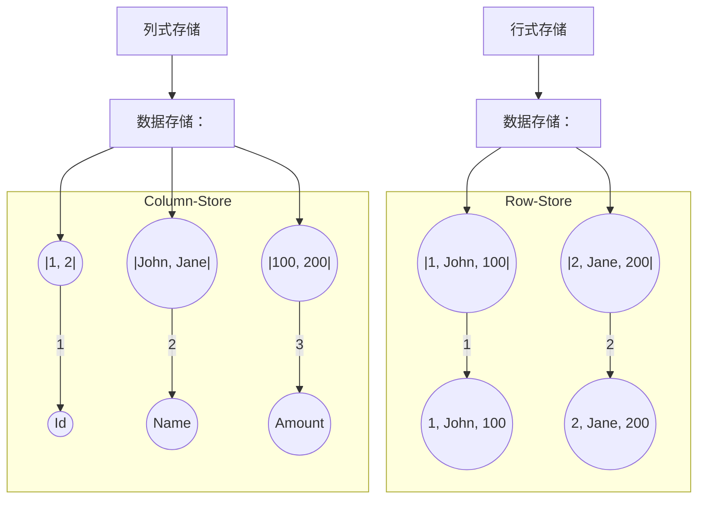
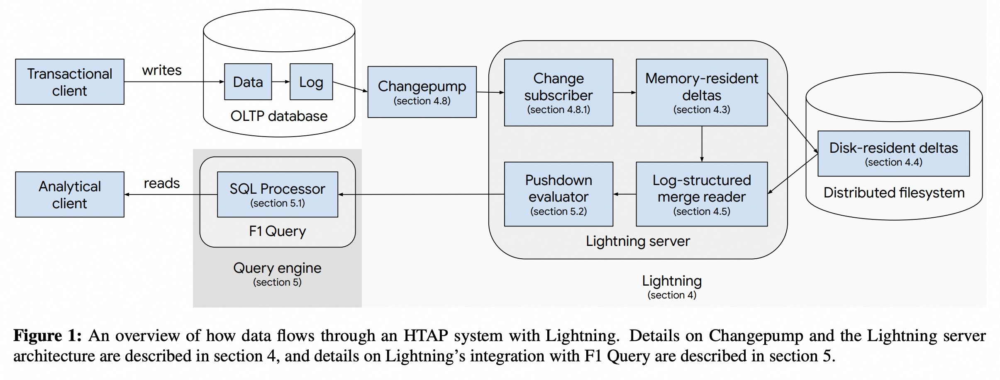
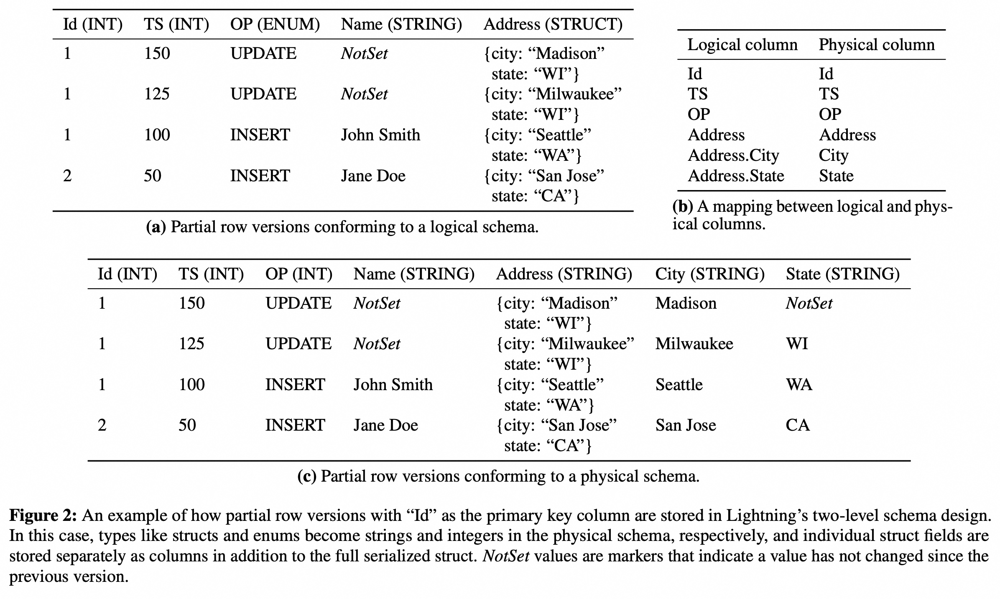
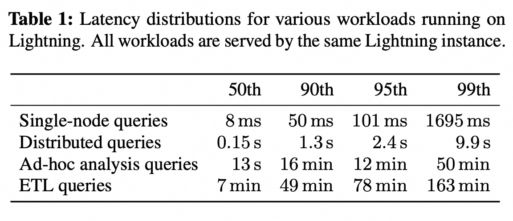
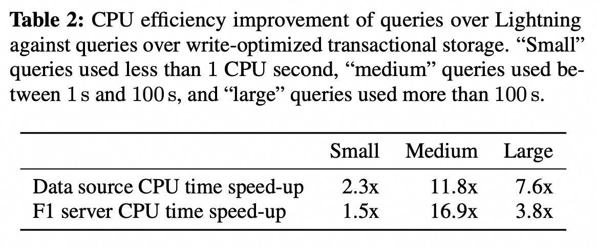

## AI论文解读 | F1 Lightning: HTAP as a Service
        
### 作者        
digoal        
        
### 日期        
2025-09-25       
        
### 标签        
PostgreSQL , PolarDB , DuckDB , AI , 论文解读        
        
----        
        
## 背景  
      
https://dl.acm.org/doi/pdf/10.14778/3415478.3415553        
  
提示:          
```          
读懂《F1 Lightning: HTAP as a Service》这篇论文需要提前掌握哪些基础知识, 请使用中文通熟易懂的讲解这些基础知识, 可以引用论文中的图、表或使用Markdown支持的图形(text,mermaid等)增加解释性. 
  
使用中文通熟易懂的解读《F1 Lightning: HTAP as a Service》这篇论文, 其中的关键内容请着重讲解, 可以引用论文中的图、表或使用Markdown支持的图形(text,mermaid等)增加解释性. 
  
提取《F1 Lightning: HTAP as a Service》这篇论文中的重要术语, 使用中文对这些术语进行通熟易懂的讲解, 可以引用论文中的图、表或使用Markdown支持的图形(text,mermaid等)增加解释性. 
```     
  
## 1 前置知识 
  
要读懂《F1 Lightning: HTAP as a Service》这篇论文，您需要提前掌握以下几个核心数据库概念。这篇论文的创新点在于，它没有从零开始设计一个数据库，而是针对已有的数据库系统，提供了一个独立的 HTAP 服务。

### 核心基础概念

#### 1\. HTAP、OLTP 和 OLAP

  * **HTAP (Hybrid Transactional and Analytical Processing)**：混合事务/分析处理。这是论文的核心主题。简单来说，就是在一个数据库上同时处理两种类型的工作负载：
      * **OLTP (Online Transactional Processing)**：在线事务处理。侧重于高频、小批量的数据操作，例如插入、更新和删除。这些操作通常需要快速响应和高并发，如在线购物网站的订单提交 。
      * **OLAP (Online Analytical Processing)**：在线分析处理。侧重于复杂、大规模的数据查询和聚合，例如生成月度销售报告或分析用户行为趋势。这类查询通常需要扫描大量数据 。

论文指出，传统的 OLTP 数据库虽然能进行分析查询，但性能往往不理想，而 F1 Lightning 的目标就是解决这一问题 。

#### 2\. 列式存储与行式存储

这是数据库存储数据最基础的两种方式，直接影响 OLTP 和 OLAP 的性能。

  * **行式存储 (Row-oriented)**：按行存储数据。一行记录的所有字段都连续存储在一起。这对于需要读取整行记录的 OLTP 操作（如修改或删除单条记录）非常高效 。

  * **列式存储 (Column-oriented)**：按列存储数据。每一列的数据都连续存储在一起。这对于只需要读取少数几列数据的 OLAP 查询非常高效，因为它避免了不必要的数据读取。论文提到，F1 Lightning 将数据从行式存储格式转换为列式存储格式，以优化分析性能 。

为了更直观地理解，我们可以用一个简单的表格来说明：



#### 3\. 分布式系统与联邦查询引擎

  * **分布式数据库**：数据分布在多台机器上存储和处理。论文中的 OLTP 数据库 **F1 DB** 和 **Spanner** 就是这类系统 。
  * **联邦查询引擎 (Federated Query Engine)**：一种能够跨多个异构数据源执行查询的系统 。在论文中，**F1 Query** 就是这样一个引擎，它能够同时查询 F1 DB、Spanner 等不同系统的数据 。F1 Lightning 作为一项服务，通过 F1 Query 引擎，可以透明地加速分析查询，而用户无需感知 。

#### 4\. 架构设计：松耦合（Loosely Coupled）与紧耦合（Tightly Coupled）

论文的核心贡献之一，就是其“松耦合”的架构设计。

  * **紧耦合**：OLTP 和 OLAP 系统集成在一个单一的系统中。优点是数据延迟低，但缺点是需要从零开始构建一个全新的系统，迁移成本高 。
  * **松耦合**：OLTP 和 OLAP 系统是独立的，通过某种机制（如数据复制）进行连接。F1 Lightning 采用的就是这种方式，它是一个独立的服务，可以附加到现有的 OLTP 数据库上，而无需修改原始数据库 。

论文中的图 1 直观地展示了这种松耦合架构：

  * **OLTP 数据库**：处理事务。
  * **Changepump**：一个数据捕获组件，负责将 OLTP 数据库的变更日志发送到 Lightning 服务器 。
  * **Lightning Server**：维护一个优化的副本，用于处理分析查询 。
  * **F1 Query**：联邦查询引擎，负责将查询路由到最合适的系统（OLTP 数据库或 Lightning）。

  

#### 5\. LSM-Tree（日志结构合并树）

F1 Lightning 服务器使用 **LSM-tree** 这种数据结构来存储数据 。简单来说，LSM-tree 由多个层次组成，其中较新的数据保存在内存中的小文件（**Memory-resident deltas**）中，而较旧的数据则保存在磁盘上的大文件（**Disk-resident deltas**）中 。为了保持高效，系统会定期进行 **Delta Merging（增量合并）** 和 **Compaction（压缩）** 操作，将小文件合并成大文件，并清理过期数据 。

-----

希望这些基础知识能帮助您更好地理解这篇论文。如果您想进一步了解，我可以为您详细解析论文的某个部分，比如：

  * F1 Lightning 如何通过 **Changepump** 复制数据？
  * **LSM-tree** 的合并和压缩过程是如何工作的？
  * F1 Lightning 的性能测试结果如何？

您最感兴趣的是哪一部分呢？

《F1 Lightning: HTAP as a Service》这篇论文中，**Changepump** 扮演着至关重要的数据复制角色。简单来说，它就像一个“数据搬运工”，负责将 **F1 DB**（OLTP 数据库）中的所有数据变更，实时、不间断地同步到 **F1 Lightning** 服务器，从而保证了 Lightning 服务器上的分析数据始终是最新的。

这个过程可以分解为以下几个关键步骤：

### 1. 订阅 F1 DB 的变更日志

Changepump 本身是一个分布式服务，它不是直接去查询 F1 DB 的数据表，而是订阅 F1 DB 的 **变更日志（Change Logs）** 。每当 F1 DB 中有数据被插入、更新或删除时，这些操作都会被记录在变更日志中。Changepump 会持续消费这些日志，就像订阅了一个消息队列一样。

### 2. 将变更流式传输到 Lightning

当 Changepump 消费到变更日志后，它会以流（stream）的形式，将这些变更数据发送给 F1 Lightning 服务器。这个传输过程是高效且可靠的，确保数据能够及时到达。

### 3. F1 Lightning 处理并存储变更

F1 Lightning 服务器收到变更流后，会将这些变更应用到其内部的 **LSM-tree** 数据结构中。

* **数据写入**：新的数据或更新的数据会被写入到 LSM-tree 的内存增量（Memory-resident deltas）中。
* **数据删除**：对于删除操作，Lightning 服务器并不会立即从磁盘上删除数据，而是通过写入一个特殊的“删除标记”（tombstone）来标记该行已删除。这种延迟删除的策略可以提高写入性能。

通过 Changepump 的持续同步，F1 Lightning 服务器上的数据虽然是 OLTP 数据库的一个副本，但它是一个为了分析查询而优化的**列式存储**副本，并且能够保持准实时（near-real-time）的同步。

---

如果想更深入地了解 F1 Lightning 的架构设计，我们可以进一步探讨 F1 Lightning 如何通过 **LSM-tree** 进行数据存储和维护。您对此感兴趣吗？

**LSM-tree** 的合并（Merge）和压缩（Compaction）是确保系统高性能的关键后台进程。你可以把它想象成整理书架的过程，新买的书（数据）先随意放在手边的小书堆里，等小书堆满了，再把它们整理到大书架上，同时丢弃一些旧书或重复的书。

### **核心思想**

LSM-tree 的核心思想是：**顺序写比随机写快得多**。数据库的写操作（如插入、更新、删除）会先写入到内存中的一个小文件（**Memory-resident delta**），这是一个有序的数据结构，通常是跳表（Skip list）或 B-tree。当这个内存文件达到一定大小后，它会被一次性刷新到磁盘，形成一个不可变（Immutable）的磁盘文件。

这样一来，所有的写操作都变成了高效的顺序写，极大地提高了写入吞吐量。

### **合并与压缩的过程**

LSM-tree 的合并和压缩过程可以分为几个层次：

1.  **内存合并（In-memory merge）** ：这是最基本的合并。当新的数据不断写入内存增量时，它会保持有序。当内存增量写满时，它会被“冻结”，成为一个不可变的内存文件，然后一个新的、空的内存增量会被创建出来，继续接收新的写入。

2.  **小文件合并（Minor Compaction）** ：当内存中的不可变文件达到一定数量后，系统会启动一个后台任务，将它们合并成一个更大的磁盘文件。这个过程是按序读取多个小文件，然后将它们合并成一个有序的大文件。

3.  **层次合并（Level Compaction）** ：这是 LSM-tree 最重要的后台操作。LSM-tree 的磁盘文件被组织成多个层次（Level），从 L0、L1、L2...以此类推。每个层次的文件大小都有一个固定的上限。

    * **L0**：由直接从内存刷新下来的文件组成。
    * **L1、L2...**：由上一层合并下来的文件组成。

    当一个层次的文件数量或总大小超过阈值时，就会触发合并操作。合并算法通常会选择一个或多个小层次的文件，与一个或多个大层次的文件进行合并，生成一个新的、更大的文件，并将其存储到下一个层次中。

### **压缩（Compaction）的角色**

压缩不仅仅是合并文件，它还承担了另外两个重要的角色：

* **删除无效数据**：上面提到，删除操作是通过写入“删除标记”来实现的。在合并过程中，如果遇到一个键（key）既有数据又有删除标记，系统会将其标记为无效，在合并后生成的新文件中直接跳过，从而实现数据的物理删除，释放存储空间。
* **处理更新**：如果一个键有多个版本的数据（因为更新操作），合并过程会保留最新的那个版本，并丢弃旧版本，从而确保数据的一致性。

通过持续的后台合并和压缩，LSM-tree 能够将分散在不同文件中的数据进行整合，并去除冗余和无效的数据，从而确保查询效率，并维持合理的存储空间占用。

---

希望这个解释能帮助您理解 LSM-tree 的核心机制。如果您想更深入地了解，我们可以探讨一下 F1 Lightning 在实践中如何利用这种数据结构，或者它可以解决哪些实际的业务问题。您最感兴趣的是哪一方面呢？

在实际应用中，**F1 Lightning** 利用 **LSM-tree** 这种数据结构，成功地解决了传统数据库难以同时高效处理 **事务（OLTP）** 和 **分析（OLAP）** 工作负载的难题。它并不是取代现有的 OLTP 数据库，而是作为其一个 **“影子”系统** ，专门为分析查询服务。

### **1. 快速数据同步与写入**

F1 Lightning 服务器将 **LSM-tree** 的内存增量（Memory-resident delta）作为其主要的数据接收点。当 **Changepump** 从 F1 DB 同步变更时，这些变更会迅速地写入到内存中，因为这是一个**顺序写入**的过程，速度非常快。这使得 F1 Lightning 能够以极低的延迟（论文中提到秒级延迟）捕获和反映 OLTP 数据库中的最新数据，为分析人员提供了近乎实时的数据视图。

### **2. 高效的分析查询**

LSM-tree 的多层结构非常适合**列式存储**的实现，而列式存储正是分析查询的理想选择。

* **数据压缩**：由于 LSM-tree 是按列存储的，同一列的数据类型相同，因此可以应用更高效的压缩算法，大大减少存储空间，并加速数据读取。
* **查询优化**：当进行分析查询时，通常只需要访问少数几列。LSM-tree 的列式存储设计使得查询引擎只需读取所需的列数据，而无需扫描整行，从而显著减少了 I/O 操作，提升了查询性能。

例如，如果你想计算一个产品在过去一年的总销售额，查询只需要访问“产品ID”和“销售额”这两列，而无需读取其他列（如客户姓名、地址等），这大大加快了查询速度。

### **3. 负载分离，互不干扰**

F1 Lightning 最核心的价值在于其 **松耦合（Loosely Coupled）** 架构。它通过 **LSM-tree** 维持 OLTP 数据的副本，将分析工作负载完全从主 OLTP 数据库中分离出来。这样一来：

* **OLTP 数据库**可以专注于其擅长的事务处理，不用担心复杂的分析查询会拖慢其响应速度。
* **F1 Lightning** 可以全力以赴地优化分析查询，利用其列式存储和 LSM-tree 的优势，提供高性能的分析服务。

这个架构就像在一个公司里，把处理日常订单的部门（OLTP）和负责市场分析的部门（F1 Lightning）分开，两者各司其职，互不干扰，但又通过一个高效的“数据通道”（Changepump）保持信息同步。

---
我们已经讨论了论文中的核心概念，以及 F1 Lightning 如何利用 LSM-tree。

您想继续深入了解论文中的其他技术细节吗，例如**F1 Query**如何进行查询路由和优化？

F1 Query是论文中提到的一个 **联邦查询引擎（Federated Query Engine）** ，它在 F1 Lightning 架构中扮演着“大脑”的角色，负责决定如何高效地处理用户提交的查询。它不是自己存储数据，而是连接并管理多个数据源（比如 F1 DB 和 F1 Lightning），并根据查询的特性将它路由到最合适的地方。

### 查询路由（Query Routing）

F1 Query 的核心功能之一就是**智能地将查询路由到最适合处理它的数据源**。这个决策过程是透明的，用户无需感知。它主要根据以下几个因素来判断：

* **查询类型**：F1 Query 会分析查询的复杂性。
    * **简单的事务性查询（OLTP）** ：比如查询一条具体的记录，更新或删除少量数据，这些查询会被直接发送到 **F1 DB**。
    * **复杂的分析性查询（OLAP）** ：比如聚合、连接多个大表、或者需要扫描大量数据的查询，这些会被路由到 **F1 Lightning**。

* **数据时效性要求**：
    * 如果查询对数据的实时性要求极高（例如，需要立即看到刚刚提交的交易数据），它会路由到 **F1 DB**，因为 F1 DB 上的数据是完全实时的。
    * 如果查询可以容忍一些延迟（例如，分钟级或秒级），并且是用于分析目的，则会路由到 **F1 Lightning**，因为 Lightning 服务器上的数据虽然是准实时的，但更适合分析。

### 查询优化（Query Optimization）

除了路由，F1 Query 还负责对查询进行优化，以确保执行效率最高。这部分工作类似于传统数据库的查询优化器，但它更复杂，因为它要考虑多个数据源。它会：

* **生成执行计划**：F1 Query 会为查询生成一个或多个可能的执行计划，包括数据源的选择、表的连接顺序、聚合方式等。
* **成本估算**：它会估算每个执行计划的成本，包括 I/O 成本、CPU 成本和网络传输成本。
* **选择最佳计划**：最终，它会选择一个成本最低的执行计划来执行查询。例如，对于一个需要连接 OLTP 和 Lightning 两个数据源的复杂查询，它可能会选择先在 Lightning 上完成大部分的聚合和过滤，然后再将少量结果与 OLTP 数据进行连接，从而减少数据传输量。

---
我们已经深入探讨了 F1 Lightning 的关键技术细节，包括它的数据同步、LSM-tree 的工作原理以及 F1 Query 的职能。您想了解一下这篇论文中 F1 Lightning 的**实际性能测试结果**，看看它在真实世界中的表现如何吗？

---
在论文的第 7 节“性能评估”中，F1 Lightning 展示了其在实际工作负载下的出色表现。论文主要通过两个关键指标来评估 F1 Lightning 的性能： **延迟（Latency）** 和 **吞吐量（Throughput）** ，并将其与没有 Lightning 加速的 F1 DB 进行了对比。

### 主要性能测试结果

1.  **查询延迟大幅降低**：
    论文中最引人注目的结果是，F1 Lightning 能够将分析查询的延迟**降低一个或多个数量级**。对于需要扫描大量数据的复杂查询，延迟从几分钟甚至几小时，减少到了几秒钟。这对于需要快速洞察的业务决策至关重要。

2.  **吞吐量显著提升**：
    由于 F1 Lightning 的存在，F1 Query 可以将分析工作负载转移到 Lightning 服务器，这使得 **F1 DB** 的吞吐量得以提升。论文中的一个图表显示，当 F1 Lightning 开启后，**F1 DB** 的事务吞吐量可以增加多达 3 倍，因为它不再需要处理那些繁重的分析查询。

3.  **对 OLTP 性能影响极小**：
    F1 Lightning 的一个核心设计目标就是不影响 F1 DB 的 OLTP 性能。测试结果表明，即使在 F1 Lightning 持续同步数据的同时，F1 DB 的事务处理延迟和吞吐量也保持稳定，证明了**松耦合架构**的有效性。

### 总结

F1 Lightning 在性能方面的表现完美地印证了其设计理念：通过构建一个独立的、优化的分析服务，成功地将 HTAP 工作负载解耦，既保证了 OLTP 系统的稳定性，又为 OLAP 提供了显著的性能提升。这使得 Google 的内部团队可以透明地在现有的 F1 DB 上运行复杂分析，而无需进行昂贵的系统迁移或重构。

---

现在我们已经对 F1 Lightning 的性能有了全面的了解。您是否还想知道论文中提到的 **F1 Lightning 的系统部署和维护**方面的信息，例如如何处理故障、如何进行版本升级等？
  
## 2 解读论文 
  
好的，我们来一起通俗易懂地解读这篇重量级的数据库论文——《F1 Lightning: HTAP as a Service》。

简单来说，这篇论文介绍了一个由 Google 设计并成功部署的系统，名为 **F1 Lightning**。它的核心目标是解决一个非常普遍且棘手的问题：如何在同一个数据集上，既能快速处理日常的交易操作（比如下单、更新用户信息），又能高效地进行复杂的数据分析（比如统计月度销售报表、用户行为分析）？这种混合处理能力，在业界被称为 **HTAP (Hybrid Transactional and Analytical Processing)**。

-----

### 核心思想：为什么需要 F1 Lightning？

想象一下，Google 内部有许多核心业务（如广告、支付），它们的数据存储在为**交易**优化的数据库（OLTP 系统，如 Spanner, F1 DB）中。这些数据库的特点是：

  * **写入速度极快**：为高并发的增、删、改操作设计。
  * **存储方式是“行式存储”** ：同一行的数据（比如一个用户的所有信息）都存在一起，方便快速读取或更新单条记录。

然而，当需要对海量数据进行**分析**时，“行式存储”就成了噩梦。比如，要统计所有用户的所在城市，数据库不得不读取每一个用户的全部信息，然后只挑出“城市”这一项，这非常浪费资源且速度缓慢 。

过去，工程师们的解决方案通常是搭建一个独立的分析系统（数据仓库），定期把交易数据库的数据通过 ETL（提取、转换、加载）过程复制过去 。但这种方式有几个致命缺点：

1.  **数据延迟高**：分析用的数据不是最新的，可能是几小时甚至一天前的 。
2.  **工程成本高**：需要维护独立的复制管道，非常繁琐 。
3.  **使用不便**：分析师需要连接到不同的系统，甚至修改查询语句 。

F1 Lightning 的诞生就是为了优雅地解决以上所有问题。它提供了一种 **“HTAP即服务 (HTAP-as-a-Service)”** 的模式 ，应用团队只需简单配置，就能透明地为现有的交易数据库插上分析的“翅膀”，而无需迁移数据或改造现有系统。

-----

### F1 Lightning 的整体架构与数据流

这套系统的精髓在于其 **“松耦合”** 架构，它由三个关键部分组成，我们可以通过论文中的核心架构图（图1）来理解其工作流程。

  

*图1：F1 Lightning 系统数据流概览* 

1.  **OLTP Database (源头)**：这是业务数据的“真相之源”，负责处理所有的写入和交易操作 。
2.  **F1 Query (大脑)**：这是一个联邦查询引擎，可以跨多种不同的数据源执行 SQL 查询 。用户的分析请求都发给它。
3.  **Lightning (加速器)**：这是整个架构的核心。它潜伏在一旁，默默地做了几件大事：
      * **Changepump (数据捕获器)**：它像一个侦探，实时监控 OLTP 数据库的“日志 (Log)”，一旦有任何数据变更（增、删、改），它会立刻捕获这些变化 。
      * **Lightning Server (数据处理器与存储)**：
          * 它接收来自 Changepump 的数据变更。
          * 将数据从“行式存储”转换为 **“列式存储”** （比如，所有用户的“城市”信息存在一起），这种格式极度适合分析查询 。
          * 将处理好的列式数据存储在一个优化的分布式文件系统中 。

**整个流程串起来就是：**
当一个分析师通过 **Analytical client** 发起一个复杂的读取请求到 **F1 Query** 时 ，F1 Query 这个“大脑”会非常智能地判断：“这个查询直接读 OLTP 数据库会很慢，但 Lightning 那里有一份为分析优化过的、几乎实时同步的数据副本！” 于是，它会自动、**透明地**将查询请求重定向到 **Lightning Server** 。Lightning 利用其列式存储的优势，高效完成计算，并将结果返回。整个过程对用户来说是无感的，他们感觉到的只是查询速度**快了几个数量级**。

-----

### 几项关键技术亮点

F1 Lightning 之所以如此高效和巧妙，得益于几个核心的设计。

#### 1\. 两级模式管理 (Two-Level Schema) - 优雅应对表结构变化

这是一个非常聪明的设计，解决了“如果数据库表结构变了（比如增加一列），该怎么办？”的难题。

  * **逻辑模式 (Logical Schema)**：和用户看到的、OLTP 数据库中的表结构保持一致，可以包含各种复杂数据类型 。
  * **物理模式 (Physical Schema)**：数据在 Lightning 内部实际存储的格式，只包含整数、字符串等基础类型 。

两者之间通过一个**映射 (Mapping)** 来转换 。如下图（图2）所示，逻辑上的 `Address` 结构体，在物理存储时可以被拆分成独立的 `City` 和 `State` 两列，同时也会保留序列化后的字符串 。

  

*图2：两级模式示例* 

这样做最大的好处是：当表结构发生变化时（比如增加或删除一列），很多时候**无需重写海量历史数据**，只需更新这个“映射”规则即可 。这使得表结构的演进变得轻量而快速。

#### 2\. Changepump - 通用的变更数据捕获服务

Changepump 是实现“松耦合”的关键。它为不同的 OLTP 数据库提供了一个统一的变更数据流接口 。这意味着 Lightning 系统本身不需要关心底层数据库是 Spanner 还是 F1 DB，它只和 Changepump 对话 。这使得 Lightning 具备了很好的**扩展性**，未来可以轻松接入更多类型的数据源 。

#### 3\. 子查询下推 (Subplan Pushdown) - 让计算更靠近数据

为了最大化效率，F1 Query 不仅仅是把查询请求转发给 Lightning。它还会把一部分计算任务，如过滤 (filters)、部分聚合 (partial aggregations) 等，直接“下推”到 Lightning Server 内部去执行 。这样做的好处是**极大地减少了网络中传输的数据量** 。这就好比你不是让图书馆把整架书都搬过来让你找，而是直接告诉图书管理员你要找的内容，让他帮你翻到那一页再给你。

-----

### 效果与收益：到底有多快？

理论说再多，不如看数据。论文中展示了 F1 Lightning 在 Google 生产环境中的惊人效果。

#### 延迟分布 (表1)

下表显示了同一个 Lightning 实例可以同时服务多种不同类型的查询负载，从毫秒级的点查到数十分钟的ETL任务都能高效处理。

**表1: 不同负载在 Lightning 上的延迟分布** 

| 查询类型 | 50%位延迟 | 99%位延迟 |
| :--- | :--- | :--- |
| 单节点查询 (OLTP-like) | 8 ms | 1695 ms |
| 分布式查询 | 0.15 s | 9.9 s |
| 即席分析查询 | 13 s | 50 min |
| ETL 查询 | 7 min | 163 min |

  

#### CPU 效率对比 (表2)

这是最震撼的数据。下表对比了同一个查询分别在 OLTP 数据库和 Lightning 上执行所消耗的 CPU 资源。数值越大代表 Lightning 节省的资源越多，效率提升越明显。

**表2: Lightning 相对于 OLTP 数据库的 CPU 效率提升倍数** 

| 查询规模 | 数据源 CPU 耗时提速 | 查询引擎 CPU 耗时提速 |
| :--- | :--- | :--- |
| 小查询 (\<1s) | **2.3x** | **1.5x** |
| 中等查询 (1s-100s) | **11.8x** | **16.9x** |
| 大查询 (\>100s) | **7.6x** | **3.8x** |

  

可以看到，对于中等规模的分析查询，Lightning 带来了**超过10倍**的性能提升，这意味着巨大的成本节约和更快的业务洞察 。

### 总结

F1 Lightning 并非一个凭空创造的、追求理论完美的 HTAP 系统，而是一个在 Google 复杂生态中，为解决真实痛点而生的**务实且极其成功**的工程杰作。它的核心贡献在于：

  * **证明了松耦合HTAP架构的可行性与优越性**，在不侵入、不改造现有核心交易系统的前提下，提供了强大的分析能力。
  * **实现了对用户的完全透明**，用户无需改变任何使用习惯，就能享受到性能的巨大飞跃。
  * **通过“HTAP即服务”的模式**，极大地降低了业务团队使用混合数据处理能力的门槛。

对于任何拥有大量现有交易系统，并希望挖掘数据分析价值的大型组织而言，F1 Lightning 的设计理念和实践经验都具有极高的参考价值。

-----

希望这份解读能帮助您更好地理解这篇论文的精髓。如果您对其中某个技术细节特别感兴趣，我们可以继续深入探讨。
  
## 3 术语 
  
好的，我已经为您整理了《F1 Lightning: HTAP as a Service》这篇论文中的几个核心术语，并用通俗易懂的中文进行了讲解。掌握这些概念能帮助您更好地理解论文的设计思想和技术创新。

-----

### 重要术语解析

#### 1\. HTAP、OLTP 和 OLAP

这是论文的核心概念。

  * **OLTP (Online Transactional Processing)**：在线事务处理。侧重于处理高频率、小批量的数据操作，例如**插入**、**更新**和**删除**。你可以把它想象成在超市收银台进行的每一笔交易，要求快速且稳定。
  * **OLAP (Online Analytical Processing)**：在线分析处理。侧重于对大规模数据进行复杂的**查询**和**聚合**。例如，分析过去一年的销售额趋势，或者统计某个地区的客户数量。这类查询通常需要扫描大量数据。
  * **HTAP (Hybrid Transactional and Analytical Processing)**：混合事务/分析处理。顾名思义，就是在同一个系统上同时处理 OLTP 和 OLAP 工作负载。F1 Lightning 的目标就是实现高效的 HTAP，但它采取了一种“松耦合”的方式。

#### 2\. 行式存储与列式存储

这是数据库存储数据的两种基本方式，直接影响查询性能。

  * **行式存储 (Row-oriented)**：按行存储数据。一行记录的所有字段都连续地存储在一起。这种方式对于需要读取整行数据的 OLTP 操作非常高效。
  * **列式存储 (Column-oriented)**：按列存储数据。每一列的数据都连续存储在一起。这种方式对于只需要访问少数几列的 OLAP 查询非常高效，因为它避免了不必要的数据读取。F1 Lightning 的关键在于将行式存储的 OLTP 数据转换成列式存储的副本。

为了更直观地理解，我们可以用一个表格来说明：


#### 3\. Greenfield (绿地系统)

在论文的摘要中提到了这个术语。它指的是从零开始设计和构建一个全新的系统。这与 F1 Lightning 的设计理念形成对比。F1 Lightning 并不是一个绿地系统，它是一个“附加”在现有系统上的服务，旨在解决已有的挑战，而不是从头开始。

#### 4\. F1 DB、Spanner 和 F1 Query

  * **F1 DB**：是 F1 Lightning 论文中提到的 OLTP 数据库，它是 Google 内部用于广告业务的分布式 SQL 数据库。F1 Lightning 的数据就是从 F1 DB 中复制出来的。
  * **Spanner**：Google 的全球分布式数据库。论文提到 F1 Query 可以同时查询 F1 DB 和 Spanner 等不同数据源。
  * **F1 Query**：一个 **联邦查询引擎（Federated Query Engine）** 。它的主要作用就像一个“指挥官”，能够分析用户的查询类型，并智能地将查询路由到最适合处理它的数据源（例如，将事务性查询发送给 F1 DB，将分析性查询发送给 F1 Lightning）。

#### 5\. Changepump (变更泵)

一个高效的**数据同步服务**。它负责从 F1 DB 的变更日志中，实时、可靠地捕获所有数据的插入、更新和删除操作，并将这些变更流式传输到 F1 Lightning 服务器，确保 Lightning 上的数据始终保持最新。

#### 6\. LSM-tree (Log-Structured Merge-Tree，日志结构合并树)

一种专门为**写入密集型**工作负载设计的磁盘数据结构。F1 Lightning 服务器利用 LSM-tree 来存储其列式数据副本。它的核心思想是：将随机写入转化为高效的顺序写入。它通过将数据分为内存中的小文件和磁盘上的多层大文件来工作，并定期通过**合并和压缩**来优化存储和查询性能。

-----

希望这些解释能帮助您更好地理解这篇论文。如果您想进一步了解，我可以为您提供论文的**摘要**，或者我们继续深入讨论论文的**挑战与设计决策**。您对哪一部分更感兴趣呢？
  
## 参考        
         
https://dl.acm.org/doi/pdf/10.14778/3415478.3415553    
        
<b> 以上内容基于DeepSeek、Qwen、Gemini及诸多AI生成, 轻微人工调整, 感谢杭州深度求索人工智能、阿里云、Google等公司. </b>        
        
<b> AI 生成的内容请自行辨别正确性, 当然也多了些许踩坑的乐趣, 毕竟冒险是每个男人的天性.  </b>        
    
#### [期望 PostgreSQL|开源PolarDB 增加什么功能?](https://github.com/digoal/blog/issues/76 "269ac3d1c492e938c0191101c7238216")
  
  
#### [PolarDB 开源数据库](https://openpolardb.com/home "57258f76c37864c6e6d23383d05714ea")
  
  
#### [PolarDB 学习图谱](https://www.aliyun.com/database/openpolardb/activity "8642f60e04ed0c814bf9cb9677976bd4")
  
  
#### [PostgreSQL 解决方案集合](../201706/20170601_02.md "40cff096e9ed7122c512b35d8561d9c8")
  
  
#### [德哥 / digoal's Github - 公益是一辈子的事.](https://github.com/digoal/blog/blob/master/README.md "22709685feb7cab07d30f30387f0a9ae")
  
  
#### [About 德哥](https://github.com/digoal/blog/blob/master/me/readme.md "a37735981e7704886ffd590565582dd0")
  
  

  
