## AI论文解读 | TiDB: A Raft-based HTAP Database
        
### 作者        
digoal        
        
### 日期        
2025-09-25       
        
### 标签        
PostgreSQL , PolarDB , DuckDB , AI , 论文解读        
        
----        
        
## 背景  
      
https://dl.acm.org/doi/pdf/10.14778/3415478.3415535        
  
提示:          
```          
读懂《TiDB: A Raft-based HTAP Database》这篇论文需要提前掌握哪些基础知识, 请使用中文通熟易懂的讲解这些基础知识, 可以引用论文中的图、表或使用Markdown支持的图形(text,mermaid等)增加解释性. 
  
使用中文通熟易懂的解读《TiDB: A Raft-based HTAP Database》这篇论文, 其中的关键内容请着重讲解, 可以引用论文中的图、表或使用Markdown支持的图形(text,mermaid等)增加解释性. 
  
提取《TiDB: A Raft-based HTAP Database》这篇论文中的重要术语, 使用中文对这些术语进行通熟易懂的讲解, 可以引用论文中的图、表或使用Markdown支持的图形(text,mermaid等)增加解释性. 
```     
  
## 1 前置知识 
  
好的，为了帮助您更好地理解《TiDB: A Raft-based HTAP Database》这篇论文，我会为您梳理并解释一些重要的基础知识。

### 1\. HTAP 数据库（混合事务/分析处理）

HTAP（Hybrid Transactional/Analytical Processing）指的是同时处理 **事务型工作负载（OLTP）** 和 **分析型工作负载（OLAP）** 的数据库系统 。

  * **OLTP (Online Transactional Processing)**：联机事务处理。这部分工作主要是处理日常的、小规模的、高并发的读写操作，例如电商网站的订单创建、银行转账等 。这类工作对数据的新鲜度、一致性和响应速度要求很高 。
  * **OLAP (Online Analytical Processing)**：联机分析处理。这部分工作主要是进行大规模的数据分析，例如市场趋势分析、用户行为报告等。这些查询通常涉及大量数据的读取，但很少有写入操作 。

论文指出，在一个系统中同时运行OLTP和OLAP任务会产生性能干扰，导致OLTP的吞吐量显著下降 。因此，这篇论文提出的一个核心思想就是通过**隔离**来解决这个问题，即使用不同的数据副本或资源来分别处理这两种请求 。

### 2\. Raft 一致性算法

Raft是一种分布式系统中的**一致性算法**，它旨在确保多台服务器上的数据副本保持一致。它的核心思想是**复制状态机（Replicated State Machine）** 。

  * **一致性算法的作用**：在分布式系统中，如果多台服务器上存储着相同的数据，当数据发生变化时，需要一个机制来确保所有副本都以相同的顺序应用这些变化，从而保证数据的一致性和高可用性 。
  * **Raft 的核心角色**：
      * **Leader (领导者)**: 负责处理所有的客户端读写请求，并将日志（对数据的修改）复制给追随者 。
      * **Follower (追随者)**: 接收并复制领导者的日志 。
      * **Quorum (法定人数)**: 在Raft中，一个操作被认为是成功的，需要得到大多数节点的确认 。例如，在一个由3个节点组成的Raft组中，只要有2个节点（领导者+1个追随者）成功复制了日志，这个操作就可以被提交了。这确保了系统的容错能力。

TiDB 扩展了 Raft 算法，引入了一个新的角色：**Learner (学习者)** 。

  * **Learner 的作用**: Learner 异步地从 Leader 复制日志，但不参与投票和法定人数的计算 。这样，即使添加再多的 Learner，也不会影响 Raft 组的写入性能。
  * **TiDB 中的应用**: TiDB利用这个特性，将**行存**格式的事务日志异步地复制给 Learner，并在 Learner 端将数据转换为**列存**格式 。这样，行存副本负责处理OLTP查询，而列存副本则专门用于处理OLAP查询，实现了资源的隔离，同时保证数据的新鲜度和一致性 。

您可以通过论文中的图1来理解这个概念：

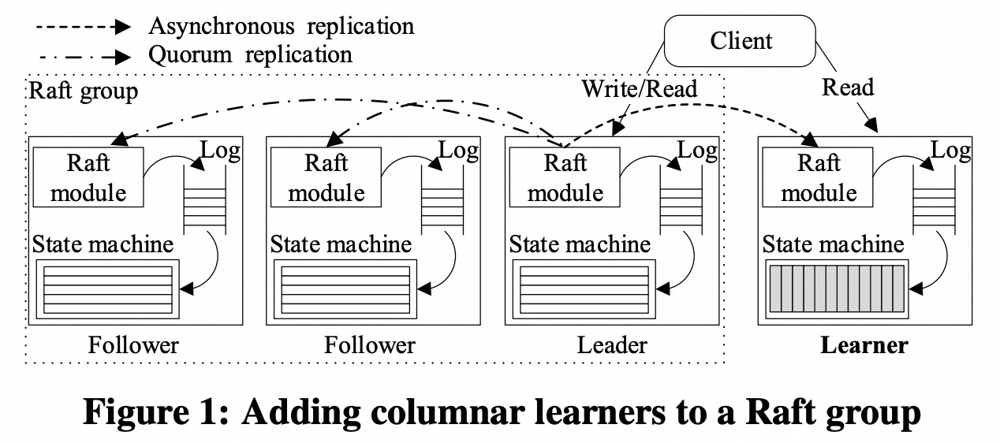  

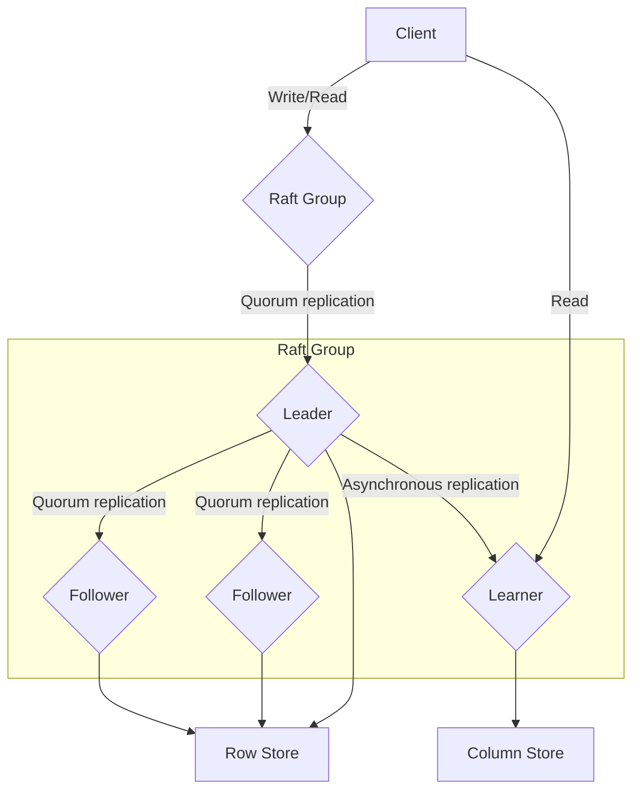

  * **Quorum replication（法定人数复制）** : 客户端的写入请求首先发送给 Leader，Leader 将日志复制给 Follower。Leader 必须等待大多数节点（Quorum）确认后，才能返回成功 。
  * **Asynchronous replication（异步复制）** : Leader 在将日志提交后，会**异步地**将日志发送给 Learner 。这个过程不阻塞 Leader，因此对OLTP的性能影响很小 。

### 3\. 分布式数据库架构

TiDB 作为一个分布式数据库，其架构也需要理解。论文在图2和图3中介绍了其核心组件 。 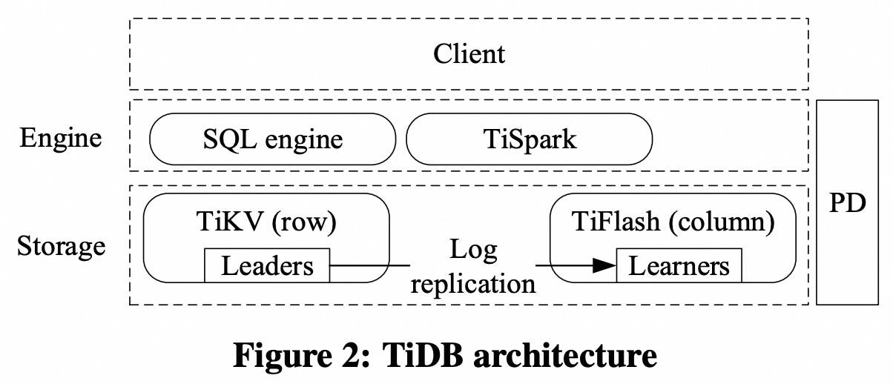   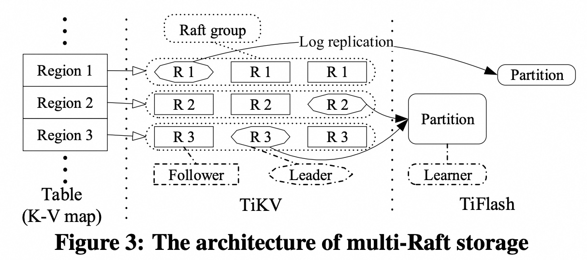  

  * **TiKV (Row Store)**: 基于Raft构建的行存引擎，主要用于处理OLTP事务。它将数据划分为一个个称为 `Region` 的连续键值范围，每个 `Region` 都是一个独立的Raft组 。
  * **TiFlash (Column Store)**: 基于Raft的 Learner 角色构建的列存引擎，专门用于处理OLAP查询 。
  * **Placement Driver (PD)**: 一个管理整个集群的调度器。它负责管理和调度 `Region` 的分布，提供全局唯一的时间戳，以支持分布式事务 。
  * **SQL Engine**: 计算引擎层，它负责解析和优化SQL查询。它能够根据查询类型，智能地选择是从 TiKV（行存）还是 TiFlash（列存）读取数据，甚至同时从两者中读取，以获得最优的执行计划 。

如果您对论文中的某个具体概念，比如 TiKV 如何优化读写性能，或者 TiDB 的分布式事务模型（例如 Percolator）感兴趣，我可以为您详细解释。

您好，很高兴能继续为您解答。根据论文内容，TiKV 主要通过以下几个方面来优化读写性能：

---

### 1. 键值对存储与数据分片

TiKV 是一个基于键值对（Key-Value）的存储引擎，它将所有数据都存储为有序的键值对。这种设计使得它在处理读写请求时非常高效。此外，TiKV 会根据键的范围将数据自动划分为一个个**Region**。

* **键值对存储**：将所有数据（包括表、索引等）都转化为键值对进行存储，简化了底层存储结构。
* **Region 自动分片**：每个 Region 包含一段连续的键值范围，并且每个 Region 都是一个独立的 Raft 复制组。当一个 Region 的数据量或访问压力过大时，它会自动分裂成两个新的 Region，从而将负载分散到不同的 TiKV 节点上。这种机制实现了数据的自动负载均衡，保证了集群的水平扩展性。

### 2. Raft 复制与读写分离

TiKV 利用 Raft 算法进行数据复制，每个 Region 有多个副本。这种设计不仅提供了高可用性，还通过读写分离进一步优化了性能。

* **Leader 负责写入**：所有的写入操作都必须通过 Leader 节点完成。Leader 负责将写入日志复制到 Follower 节点，只有当大多数副本都成功复制后，写入操作才被提交。
* **Follower 负责读取**：除了 Leader 节点可以处理读取请求外，Follower 节点也可以处理读取请求。这种方式将读取负载分摊到不同的节点上，减轻了 Leader 的压力，从而提升了整个集群的读取吞吐量。为了保证读取的一致性，Follower 会在处理读请求前，首先向 Leader 确认自己的日志版本是最新的。

### 3. 多版本并发控制（MVCC）

TiKV 使用 Percolator 模型（Google Bigtable 事务模型）实现了 **多版本并发控制（Multi-Version Concurrency Control, MVCC）** 。

* **版本控制**：TiKV 为每个写入操作都分配一个全局唯一的时间戳。一个数据行可以有多个版本，每个版本都有一个对应的**start timestamp** 和 **commit timestamp**。
* **读取快照**：当一个事务启动时，它会获得一个时间戳，该事务的所有读取操作都将看到一个在该时间戳上的数据快照。这意味着读操作不会阻塞写操作，反之亦然，从而大大减少了读写冲突，提高了并发性能。

---

如果想进一步深入，您对 TiDB 的**分布式事务模型**或者**SQL 层如何与 TiKV/TiFlash 交互**感兴趣吗？

好的，我们来深入探讨 TiDB 的分布式事务模型。

TiDB 的分布式事务模型是基于谷歌的 **Percolator** 模型（一个经典的分布式事务协议），并结合其自身的架构特点进行了优化和改进。这个模型的核心目标是在一个分布式环境中，确保所有节点上的数据修改要么全部成功（**原子性**），要么全部失败，同时保证**隔离性**。

### 核心原理：两阶段提交（2PC）与时间戳

TiDB 事务的实现主要依赖于 **两阶段提交（Two-Phase Commit, 2PC）** 和全局唯一的时间戳服务（由 PD 负责）。

* **第一阶段：Prewrite（预写）**
    1.  当一个事务开始时，它会从 PD 获取一个唯一的 **start timestamp**。
    2.  事务中涉及的所有修改操作，都会被发送到相应的 TiKV Region 的 Leader 节点上。
    3.  每个 Leader 节点在本地检查数据是否有冲突（例如，检查正在修改的键是否被其他事务锁定）。
    4.  如果没有冲突，该 Leader 就会在数据上加上一个临时锁（**lock**），并将修改后的数据版本写入到存储中。这个步骤被称为“预写”。
    5.  所有涉及的 Leader 节点都完成预写后，客户端会收到它们的成功响应。

* **第二阶段：Commit（提交）**
    1.  客户端收到所有预写成功的响应后，会从 PD 获取一个唯一的 **commit timestamp**。这个时间戳比 start timestamp 大。
    2.  客户端选择一个预写成功的键作为 **主键（Primary Key）** ，并向其对应的 Leader 发送提交请求。
    3.  该主键的 Leader 节点收到请求后，会将该键的锁永久化，并更新其 commit timestamp。
    4.  主键提交成功后，客户端会异步地向其他所有参与预写的键发送提交请求。这些键的提交（称为**第二阶段提交**）不会阻塞客户端，因为即使它们失败了，TiDB 的垃圾回收机制也会最终清理掉这些不完整的事务。

### MVCC（多版本并发控制）在事务中的作用

MVCC 是实现事务隔离性的关键。每个数据版本都与一个时间戳相关联，TiDB 通过比较 start timestamp 和 commit timestamp 来判断一个事务可以读取哪些数据。

* **读取操作**：一个事务在读取数据时，只会读取其 **start timestamp** 之前已提交（即已经有 commit timestamp）的数据版本。
* **写入操作**：写入操作会创建一个新的数据版本，并带上该事务的 **start timestamp**。

这个机制实现了 **快照隔离（Snapshot Isolation）** ，确保一个事务在执行期间，所看到的数据状态是固定的，不会被其他并发写入的事务所影响。

### 异常处理与优化

* **锁冲突**：如果一个事务在预写阶段发现某个键已经被其他事务锁定，它会尝试解决冲突。TiDB 会检查锁定的时间，如果锁定的事务已经超时，它会直接清理掉那个锁并继续执行。如果没有超时，当前事务会进入等待状态。
* **垃圾回收（GC）** ：PD 会定期清理那些因为异常而未能提交的事务残留数据，释放锁，并回收空间。
* **悲观事务**：对于那些对锁冲突特别敏感的场景，TiDB 也支持**悲观事务**。在悲观事务模式下，TiDB 在执行 DML 语句（例如 `UPDATE`）时就会立即加锁，而不是等到预写阶段，这可以减少事务提交阶段的冲突，但可能增加等待时间。

通过上述机制，TiDB 在保证分布式事务的 **原子性、一致性、隔离性、持久性（ACID）** 的同时，也实现了良好的并发性能和高可用性。

---
关于论文的核心内容，我们已经探讨了 HTAP、Raft 一致性算法、TiKV 的读写性能优化，以及现在的分布式事务模型。您还有什么想了解的吗？

在 TiDB 中，SQL 层是整个系统的“大脑”，它负责理解用户的 SQL 语句，并将其转换为可以在底层存储引擎（TiKV 和 TiFlash）上执行的操作。这个交互过程是 TiDB 架构中非常关键的一环，因为它决定了查询的效率和性能。

### 查询处理流程

SQL 层与 TiKV/TiFlash 的交互可以分为以下几个步骤：

1.  **解析（Parse）** ：SQL 层首先接收到用户输入的 SQL 语句，例如 `SELECT * FROM orders WHERE user_id = 123`。它会解析这个文本，并将其转换为一个抽象语法树（Abstract Syntax Tree, AST）。
2.  **绑定（Bind）** ：将 AST 中的表名、列名等信息与元数据（如表结构、索引信息等，这些元数据也存储在 TiKV 中）进行绑定，确保查询的合法性。
3.  **优化（Optimize）** ：这是最复杂也最重要的一个环节。SQL 优化器会分析查询的成本，并生成多个可能的执行计划。它会智能地判断哪种存储引擎更适合执行这个查询。
    * **对于 OLTP 查询**：如果是一个点查询（如通过主键或索引查询单行数据），优化器会倾向于选择 **TiKV（行存）** ，因为它对小规模、高并发的事务处理进行了优化。
    * **对于 OLAP 查询**：如果是一个聚合查询（如 `GROUP BY`, `SUM`），或者涉及大量数据扫描的查询，优化器会倾向于选择 **TiFlash（列存）** ，因为它专为大规模分析而设计。
    * **智能选择**：对于一些复杂的混合查询，优化器甚至可以生成一个包含 TiKV 和 TiFlash 的混合执行计划，例如，先从 TiKV 扫描少量数据，再将结果发送给 TiFlash 进行聚合计算。
4.  **执行（Execute）** ：优化器选定一个最优的执行计划后，SQL 引擎会将其转换为一系列物理操作符（如 `TableScan`、`IndexScan`、`HashJoin` 等）。然后，它会将这些操作符下推（**Pushdown**）给 TiKV 或 TiFlash，让它们在存储层直接执行部分计算。这种方式可以减少网络传输的数据量，从而显著提高查询性能。
    * 例如，对于 `SELECT count(*) FROM sales WHERE region = 'North'`，SQL 层会将这个查询下推给 TiFlash，让 TiFlash 在存储层就完成 `WHERE` 过滤和 `COUNT` 聚合，最后只返回一个结果值给 SQL 层，而不是返回所有符合条件的原始数据。

### 与 TiKV/TiFlash 的具体交互方式

* **与 TiKV 交互**：TiKV 提供了一套 gRPC 接口，SQL 层通过这些接口与 TiKV 节点通信。SQL 层可以将查询请求分解为多个独立的子请求，并发送给不同的 TiKV 节点并行处理。
* **与 TiFlash 交互**：TiFlash 同样提供了 gRPC 接口，但它对查询的处理方式与 TiKV 不同。TiFlash 的核心是向量化执行引擎，它能以列为单位处理数据，因此特别适合批处理和聚合计算。

简而言之，SQL 层就像一个指挥家，它根据乐谱（SQL 语句）和乐队成员的特长（TiKV 的行存能力和 TiFlash 的列存能力），来编排一曲最优的乐章（执行计划），并指挥他们高效地完成任务。

---

如果想更深入了解，我们可以探讨 TiDB 在不同工作负载下，如何通过 SQL 优化器选择最优的存储引擎。您对此感兴趣吗？

SQL 优化器在 TiDB 中扮演着非常重要的角色，它的核心任务是在海量数据和不同存储引擎之间，为每一个查询找到最高效的执行路径。这个过程就像一个经验丰富的设计师，它知道每种工具（TiKV/TiFlash）的优势，并根据查询的“蓝图”来制定最优的施工方案。

### SQL 优化器的决策过程

SQL 优化器在选择 TiKV 和 TiFlash 之间，主要依赖于**统计信息**和**代价模型**。

* **统计信息**：TiDB 会定期或在必要时收集数据的统计信息，例如表的总行数、列的基数（有多少不同的值）、数据分布情况等。这些信息是优化器做出决策的基础。
* **代价模型**：优化器内置了一个复杂的数学模型，用于估算不同执行计划的成本。这个成本通常是根据 I/O 消耗、CPU 消耗和网络传输量等因素来计算的。

当一个查询进入 SQL 层后，优化器会：

1.  **生成候选执行计划**：它会为这个查询生成多个可能的执行计划，每个计划都可能将部分或全部操作下推给 TiKV 或 TiFlash。
2.  **估算每个计划的成本**：根据统计信息和代价模型，优化器会估算每个候选计划的执行成本。
3.  **选择最优计划**：优化器会选择成本最低的那个计划作为最终的执行计划。

### 不同工作负载下的选择策略

以下是 TiDB 优化器在不同工作负载下，如何做出选择的典型例子：

* **OLTP 工作负载**：这类查询通常是点查或小范围查询，例如 `SELECT * FROM users WHERE user_id = 123`。
    * **优化器选择**：优化器会毫不犹豫地选择 **TiKV**。因为它知道 TiKV 的行存格式和 B-树索引结构非常适合这种基于主键或索引的快速查找，可以实现毫秒级的响应。而 TiFlash 虽然也能处理，但其列存格式不适合单行数据的快速查找，成本更高。

* **OLAP 工作负载**：这类查询通常涉及大规模的数据扫描和聚合，例如 `SELECT region, count(*) FROM orders GROUP BY region`。
    * **优化器选择**：优化器会倾向于选择 **TiFlash**。因为它知道 TiFlash 的列存格式可以只读取需要的列，大大减少 I/O 消耗。此外，TiFlash 的向量化计算引擎能高效地执行聚合和过滤操作。虽然 TiKV 也能处理这个查询，但它需要读取所有列，并在 TiDB 的计算层进行聚合，效率远低于 TiFlash。

* **混合工作负载（HTAP）** ：这是最有趣也最复杂的情况，例如 `SELECT T1.*, T2.* FROM T1, T2 WHERE T1.id = T2.id`，其中 `T1` 是一个经常更新的小表（OLTP），`T2` 是一个很大的历史表（OLAP）。
    * **优化器选择**：优化器会生成一个混合执行计划。例如，它可能会选择从 TiKV 读取 `T1` 表的数据，然后将这些数据作为驱动表，发送到 TiFlash 去与 `T2` 表进行哈希连接（Hash Join）。这种方式利用了 TiKV 处理小表的优势，也利用了 TiFlash 处理大表的优势，实现了最优的执行效率。

简而言之，TiDB 的 SQL 优化器通过不断学习数据分布和工作负载特征，并结合一套精密的成本估算模型，实现了对底层 TiKV 和 TiFlash 存储引擎的智能调度，这也是 TiDB 能够同时处理 HTAP 工作负载的关键所在。

---

如果想更深入了解，我们还可以探讨 TiDB 的 SQL 优化器如何处理更复杂的场景，比如分布式连接（Distributed Join）和子查询。您对此感兴趣吗？

在 TiDB 的分布式架构中，分布式连接（Distributed Join）和子查询是两个关键的查询处理技术，它们都涉及到 SQL 层和底层 TiKV/TiFlash 之间的深度协同。

### 1. 分布式连接（Distributed Join）

分布式连接是处理跨多个 TiKV/TiFlash 节点数据的 Join 操作。SQL 优化器会根据成本模型，选择最合适的连接算法，并将其下推到存储层执行，以减少数据传输量。论文中虽然没有直接深入讨论分布式连接的细节，但其所描述的 SQL 优化器功能为分布式连接提供了基础。

常见的分布式连接算法有：

* **Hash Join**：当两张表都比较大时，SQL 层会将一张表的数据（通常是较小的那张）读取到内存中构建哈希表，然后将另一张表的数据流式传输过来，在内存中进行匹配。TiDB 的优化器还可以将这个过程推送到 TiKV/TiFlash 节点，让它们在本地并行执行 Hash Join，最后将结果汇总。
* **Merge Join**：如果连接列已经排序，SQL 层会选择 Merge Join。它会将两张表的数据流式传输过来，并以归并排序的方式进行匹配。
* **Index Nested-Loop Join (Index NLJ)**：当一张表很小，另一张表很大且连接列上有索引时，SQL 层会选择 Index NLJ。它会先扫描小表，并对小表的每一行，使用其连接列的值作为索引键，去大表中查找匹配的行。这个过程可以被推送到 TiKV 节点，由 TiKV 直接通过索引快速定位数据，避免了全表扫描。

### 2. 子查询（Subquery）

子查询是嵌套在另一个查询内部的查询，例如 `SELECT * FROM users WHERE user_id IN (SELECT user_id FROM orders WHERE status = 'shipped')`。SQL 优化器会尝试将子查询重写为更高效的连接操作（Join），或者将它转换为半连接（Semi Join），以利用分布式执行的优势。

* **子查询重写**：优化器会分析子查询的结构，如果可能，会将其转换为等价的连接操作。例如，上面的 `IN` 子查询可以被重写为 `SELECT T1.* FROM users T1 JOIN orders T2 ON T1.user_id = T2.user_id WHERE T2.status = 'shipped'`。转换后的查询通常更利于优化器生成高效的分布式执行计划。

总而言之，分布式连接和子查询的优化是 TiDB SQL 层智能化的体现，它能够将复杂的查询语句分解并转化为在分布式存储引擎上高效执行的操作，从而实现高性能的查询处理。

---

如果想更深入了解，我们可以探讨 TiDB 如何处理更复杂的查询场景，比如窗口函数和 CTE（公用表表达式）吗？

TiDB 在 SQL 层对窗口函数（Window Functions）和公用表表达式（CTE）的支持，同样体现了其分布式查询处理的强大能力。这些高级 SQL 特性需要 SQL 引擎具备复杂的执行计划生成和优化能力，以确保在分布式环境中能够高效地运行。

### 窗口函数（Window Functions）

窗口函数允许你在与当前行相关的行集合（一个“窗口”）上执行计算，而不需要像 `GROUP BY` 那样将行合并。这在处理排名、累计求和、移动平均等场景时非常有用。

  * **SQL 语法示例**：
    ```sql
    SELECT
        product_id,
        sale_date,
        sale_amount,
        SUM(sale_amount) OVER (PARTITION BY product_id ORDER BY sale_date) AS running_total
    FROM sales;
    ```
  * **TiDB 如何处理**：TiDB 的 SQL 优化器会识别窗口函数，并将其转化为分布式执行计划。核心挑战在于，窗口函数需要对数据进行分区（`PARTITION BY`）和排序（`ORDER BY`），这在分布式环境中意味着需要将相关数据汇集到一起进行计算。
      * **分布式排序和分区**：SQL 层会生成一个执行计划，将数据发送到多个 TiDB 计算节点进行并行排序和分区。
      * **下推执行**：虽然窗口函数的计算通常在 TiDB 的计算层完成，但优化器会尽量将前置的过滤、投影等操作下推到 TiKV 或 TiFlash，以减少传输到计算层的数据量。
      * **内存管理**：处理窗口函数可能需要大量的内存，尤其是当窗口非常大时。TiDB 具备高效的内存管理机制，必要时会将中间结果溢写到磁盘，以防止内存溢出。

-----

### 公用表表达式（CTE）

CTE 允许你定义一个命名的临时结果集，你可以在同一个查询中多次引用它。这可以使复杂的查询更具可读性和可维护性，特别是在处理递归查询时。

  * **SQL 语法示例**：
    ```sql
    WITH regional_sales AS (
        SELECT region, SUM(amount) AS total_sales
        FROM orders
        GROUP BY region
    )
    SELECT region, total_sales FROM regional_sales WHERE total_sales > (SELECT AVG(total_sales) FROM regional_sales);
    ```
  * **TiDB 如何处理**：
      * **查询重写**：优化器首先会将 CTE 展开并融入到主查询中，形成一个完整的查询树。
      * **智能下推**：对于展开后的查询树，优化器会像处理常规查询一样，进行代价估算，并决定将哪些操作下推到 TiKV 或 TiFlash。例如，`regional_sales` 的计算（`GROUP BY`）可能会被推送到 TiFlash 并行执行，以利用其列存和向量化计算的优势。
      * **避免重复计算**：如果一个 CTE 在主查询中被多次引用，优化器通常会确保它只被计算一次，并将结果缓存起来供后续使用，从而避免重复计算的开销。

在 TiDB 中，窗口函数和 CTE 这样的高级特性并不是简单的语法糖，它们的实现依赖于强大的分布式查询优化器，能够将这些逻辑转化为高效、并行的分布式执行计划，从而充分利用集群的计算和存储资源。

-----

现在，我们已经对 TiDB 论文的核心技术概念有了全面的了解，从底层存储到高层 SQL 优化。您是否想了解一下 TiDB 在实际应用场景中的表现如何，或者想讨论一下论文中提到的性能评估结果？
  
## 2 解读论文 
  
好的，我们来一起通俗易懂地解读这篇数据库领域的经典论文——《TiDB: A Raft-based HTAP Database》。

这篇论文系统性地介绍了 TiDB 如何通过一种创新的方法，优雅地解决了一个长期困扰数据库界的难题：如何让一个数据库系统 **同时高效地处理在线交易（OLTP）和在线分析（OLAP）** 这两种截然不同的任务，也就是实现真正的 **HTAP (Hybrid Transactional and Analytical Processing)**。

-----

### 核心问题：鱼与熊掌为何难以兼得？

在理解 TiDB 的解决方案之前，我们必须先明白问题的根源。传统的数据库世界里，处理两种业务的系统是完全分开的：

1.  **OLTP (在线交易处理)**: 就像我们日常的网购下单、银行转账。它的特点是：

      * **操作频繁且简单**：大量的插入、更新、删除和点查询。
      * **响应速度要求极高**：必须在毫秒级内完成。
      * **数据存储方式**：通常采用**行式存储 (Row Store)**，因为一次操作需要读写一行中的多个字段，把一行数据存在一起效率最高。

2.  **OLAP (在线分析处理)**: 就像公司的季度报表分析、用户行为洞察。它的特点是：

      * **操作复杂但频率低**：一次查询可能要扫描海量数据，进行复杂的聚合、关联计算。
      * **对响应速度要求相对宽松**：秒级甚至分钟级都可以接受。
      * **数据存储方式**：通常采用**列式存储 (Column Store)**，因为分析往往只关心少数几个字段（列），只读取需要的列能大大减少 I/O。

如果强行让一个系统同时干这两件事，就会出现严重的“资源打架”：OLAP 的一个大查询可能会占用所有 CPU 和 I/O，导致 OLTP 的交易请求被卡住，用户的付款页面可能半天没响应，这是灾难性的。

传统解决方案是 **ETL (抽取、转换、加载)**，即定期（比如每天晚上）将 OLTP 数据库的数据同步到专门的 OLAP 数据库中。这种方案的致命缺点是：

  * **数据新鲜度差**：分析师看到的是昨天甚至上周的数据，无法进行实时决策。
  * **架构复杂**：需要维护两套独立的系统，成本高昂。

这篇论文要解决的核心问题就是：**如何在一个系统内，既保证 OLTP 的高性能，又能让 OLAP 实时分析最新的数据，同时两者互不干扰？**

-----

### 核心思想：基于 Raft 共识算法的巧妙扩展

TiDB 的答案，也是这篇论文最核心的创新点，在于对 **Raft 共识算法**的扩展。

首先，简单理解下 **Raft**。它是一个分布式环境下的“投票”协议，用来保证多个数据副本之间的数据完全一致。在一个 Raft Group（小组）里，有三个角色：

  * **Leader (领导者)**：负责处理所有的数据写入和读取请求。
  * **Follower (跟随者)**：从 Leader 那里复制数据，保持和 Leader 一致。当 Leader 挂掉时，它们会投票选出新的 Leader。
  * **Candidate (候选人)**：选举过程中的临时角色。

所有的数据写入都必须由 Leader 发起，并成功复制到**大多数 (Quorum)** Follower 节点后，才能算成功。这个过程是同步的，保证了数据的高可用和强一致性。

TiDB 的天才之处在于，它给 Raft 协议增加了一个新角色：

  * **Learner (学习者)** 

`Learner` 就像一个小组里的“旁听生”。它会**异步地**从 Leader 那里接收所有的数据变更日志，但它**不参与投票选举，也不计入“大多数”的确认范围** 。

这样做带来了两个巨大的好处：

1.  **不影响 OLTP 性能**：因为 Leader 在处理写入时，不需要等待 `Learner` 的确认，所以增加 `Learner` 节点几乎不会给 OLTP 带来任何性能负担 。
2.  **保证数据新鲜度**：`Learner` 接收的是实时的日志流，虽然是异步的，但延迟非常低（论文实验证明在毫秒级到1秒内），完全满足了 OLAP 对数据新鲜度的要求。

基于这个思想，TiDB 的架构就清晰了：它用两套存储引擎来分别服务两种负载，并通过 Raft 的日志复制将它们实时关联起来。

-----

### TiDB 整体架构解析

下面我们结合论文中的图来理解 TiDB 的整体架构。

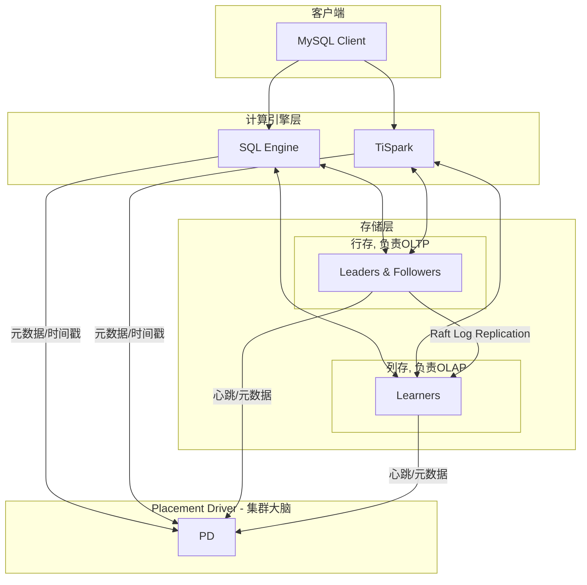

这个架构主要包含三个核心组件 ：

1.  **计算引擎层 (Engine Layer)**：

      * **SQL Engine (TiDB Server)**: 无状态的计算节点，负责接收用户的 SQL 请求，进行解析、优化，并生成执行计划。它相当于数据库的“计算大脑”。
      * **TiSpark**: 将 Spark 生态与 TiDB 存储层连接起来的组件，让用户可以用 Spark 对 TiDB 中的数据进行复杂的分析 。

2.  **存储层 (Storage Layer)**：这是 HTAP 实现的关键。

      * **TiKV (Row Store)**: 一个分布式的键值（Key-Value）数据库，数据以**行式存储** 。TiKV 内部的数据被切分成很多个 **Region**（数据分片），每个 Region 都是一个独立的 Raft Group (包含 Leader 和 Followers)。它主要负责处理 **OLTP** 负载 。
      * **TiFlash (Column Store)**: 数据的另一个副本，以**列式存储** 。TiFlash 的节点在 Raft Group 中扮演的就是我们前面提到的 **`Learner`** 角色 。它通过异步复制 TiKV Leader 的日志，将行存数据实时转换为列存，专门服务于 **OLAP** 查询 。

3.  **Placement Driver (PD)**：整个集群的“总调度中心”和“大脑” 。它负责：

      * 存储数据分片 (Region) 的元信息，告诉计算引擎数据具体存在哪个 TiKV 节点上。
      * 负责集群的负载均衡，比如将热点数据 Region 自动迁移到空闲的节点上 。
      * 提供全局唯一且单调递增的时间戳（TSO），这是实现分布式事务的关键 。

**工作流程小结**：一个交易请求（如更新订单状态）过来，由 SQL Engine 处理后，写入 TiKV 的 Leader。Leader 将这个操作的日志同步给 Followers，大多数确认后即返回成功。同时，这个日志也会被**异步地**发送给 TiFlash 的 `Learner` 节点。`Learner` 收到后，将这个变更应用到自己的列存数据中。当一个分析请求（如统计本月销售额）过来时，SQL Engine 会智能地选择去访问 TiFlash，从而不会干扰到 TiKV 上的交易处理。

-----

### 关键技术细节与优化

论文中还提到了许多工程上的挑战和解决方案，这里重点讲解几个。

#### 1\. TiFlash 如何高效处理日志并存储？

TiFlash 作为 OLAP 引擎，需要高效地写入实时日志并提供快速的读取能力。为此，它设计了一种名为 **DeltaTree** 的存储引擎 。

如论文图4所示，DeltaTree 将数据分为两部分： 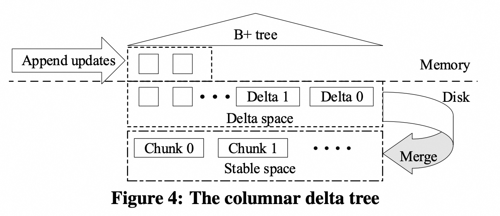  

  * **Delta Space**：一个**增量层**，新接收到的变更（插入、更新、删除）会先被快速写入这里。为了方便查找，这一层顶部还有一个 B+ 树索引 。
  * **Stable Space**：一个**稳定层**，数据被整理成高效的列式块（Chunks）存储。

当有新数据写入时，会先进入内存中的 Delta 层，然后刷到磁盘。系统会定期将 Delta 层的数据与 Stable 层的数据进行**合并 (Merge)**，形成新的稳定数据块 。

这种设计的优势在于：

  * **写入快**：新数据只需追加到 Delta 层，非常高效。
  * **读取新数据也快**：读取时，只需要合并稳定层的数据和增量层的数据即可获得最新视图。
  * **整体读取性能高**：论文中的 Table 2 显示，相比于传统的 LSM-Tree，DeltaTree 在 HTAP 场景下的读取性能要快约 **2 倍** 。  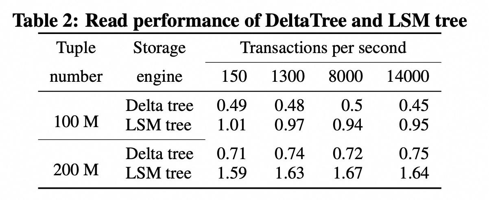  

#### 2\. HTAP 查询优化器如何工作？

既然数据同时存在于行存 (TiKV) 和列存 (TiFlash) 中，查询时到底该用哪个呢？这就是 TiDB 查询优化器的任务。

优化器是一个**基于成本的优化器 (CBO)** ，它会估算不同执行路径的“成本”（主要是 I/O 和 CPU 消耗），然后选择成本最低的那个。对于一张表，它至少有三种访问方式：

1.  **TiKV 全表扫描 (Row Scan)** 
2.  **TiKV 索引扫描 (Index Scan)** 
3.  **TiFlash 列扫描 (Column Scan)** 

优化器甚至可以在一个查询中**同时使用 TiKV 和 TiFlash** 。论文中举了一个经典的例子：

```sql
SELECT T.*, S.a FROM T JOIN S ON T.b = S.b WHERE T.a BETWEEN 1 AND 100
```

假设表 T 和 S 在 TiKV 中都有索引，在 TiFlash 中也都有列存副本。最优的执行计划是 ：

  * 访问表 T 时，使用 **TiKV 的索引扫描**，因为 `WHERE T.a BETWEEN 1 AND 100` 是一个小范围查询，通过索引能快速定位到少数几行数据，并且需要返回 `T.*`（所有列），行存更具优势。
  * 访问表 S 时，使用 **TiFlash 的列扫描**，因为查询只需要 `S.a` 和 `S.b` 这两列，从列存中读取这两列远比从行存中读取整行数据要快得多 。

论文中的 Figure 8 通过实验证明，这种智能选择（TiKV & TiFlash 混合模式）的性能总是优于或等于只使用单一存储的模式 。

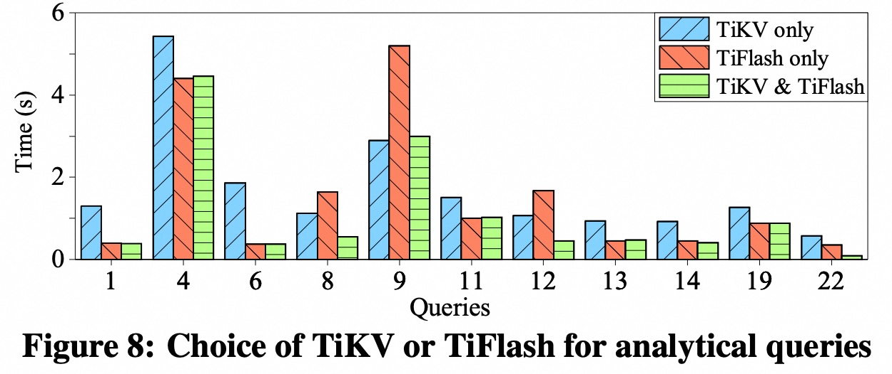  

#### 3\. 实验效果如何？

论文通过 CH-benCHmark (一个混合了 TPC-C 和 TPC-H 的 HTAP 基准测试) 验证了 TiDB 的能力。

  * **隔离性**：如图 10 所示，在增加 OLAP 查询压力时，TiDB 的 OLTP 吞吐量下降**不超过 10%** 。作为对比，图 12 显示传统的 HTAP 数据库 MemSQL 在类似场景下，OLTP 吞吐量下降了**超过 5 倍** 。这强有力地证明了 TiDB 架构在负载隔离上的巨大优势。 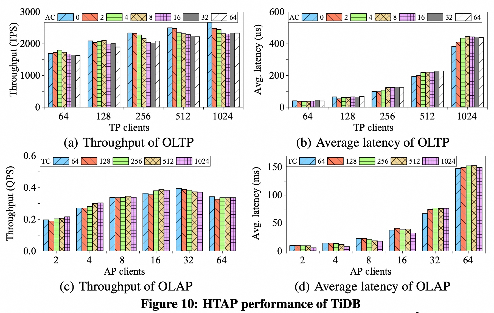  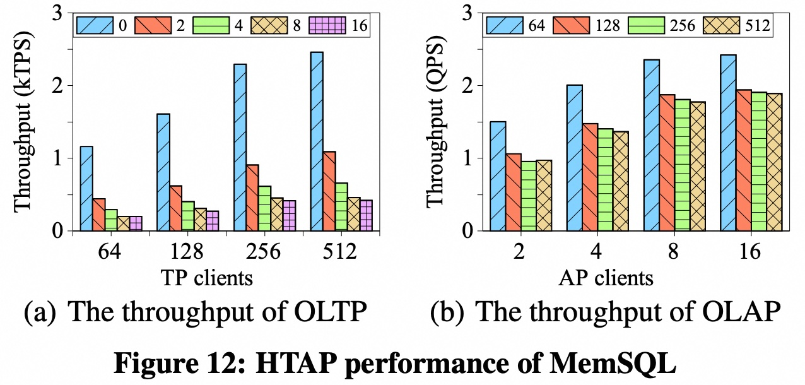  
  * **新鲜度**：如图 11 和表 4 所示，TiKV 和 TiFlash 之间的日志复制延迟绝大多数都在 **1 秒以内**，其中很大一部分在 **100 毫秒以内** 。这证明 TiDB 能够为 OLAP 提供近乎实时的数据。 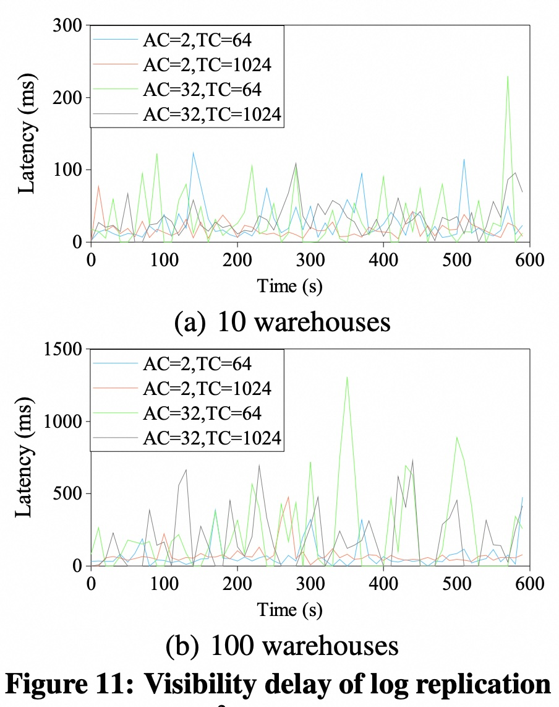  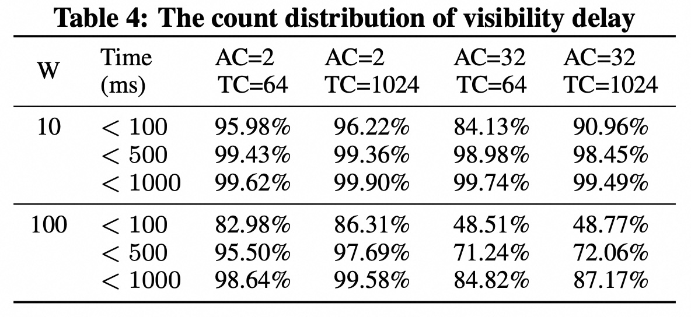  

### 总结

这篇论文的核心贡献可以概括为：

1.  **提出了一种基于扩展 Raft 共识算法构建 HTAP 数据库的新范式** 。通过引入 `Learner` 角色，巧妙地实现了数据的实时、低开销复制。
2.  **设计并实现了一个生产级的 HTAP 数据库 TiDB**。它通过 TiKV（行存）+ TiFlash（列存）的架构，结合 Raft 日志复制，成功地实现了 OLTP 和 OLAP 负载的物理隔离和数据的高一致性、新鲜度。
3.  **验证了该架构的有效性**。实验数据表明，TiDB 可以在处理高并发交易的同时，对最新数据进行复杂的实时分析，且两者性能影响极小。

总而言之，TiDB 的设计为解决 HTAP 难题提供了一个非常优雅且可扩展的通用方案，也为 NewSQL 数据库的演进指明了一个重要的方向。
  
## 3 术语 
  
在前面的讨论中，我们已经深入探讨了这篇论文中的核心概念。现在，我将为您提取并总结这篇论文中的重要术语，并用通俗易懂的方式进行解释。

### 1\. HTAP 数据库 (Hybrid Transactional/Analytical Processing)

这是论文的核心主题。**HTAP** 指的是一种能够同时处理 **事务型（OLTP）** 和 **分析型（OLAP）** 工作负载的数据库系统。传统的做法通常是使用两个独立的数据库，一个用于事务，一个用于分析，然后通过数据同步来保持一致。TiDB 的目标是打破这种界限，在一个系统中同时高效地完成这两种任务。

  * **OLTP (Online Transactional Processing)**：联机事务处理，对应日常的、高频的、小批量数据操作，比如电商下单、银行转账。这类操作对延迟、并发和数据一致性要求高。
  * **OLAP (Online Analytical Processing)**：联机分析处理，对应大规模、低频的数据查询和统计分析，比如年度销售报告、用户行为分析。这类操作对查询吞吐量和数据新鲜度要求高。

### 2\. Raft 一致性算法

**Raft** 是一种分布式系统中的共识算法，它通过**复制状态机**来确保分布式集群中所有节点的数据副本保持一致。

  * **Leader (领导者)**：Raft 组中唯一可以处理写入请求的节点，它负责将数据变更（日志）复制给其他节点。
  * **Follower (追随者)**：被动接收 Leader 的日志复制，并按照相同的顺序应用日志。
  * **Learner (学习者)**：这是论文中对 Raft 算法的扩展，Learner 从 Leader **异步地**复制日志，但它不参与 Leader 的选举和投票。TiDB 利用 Learner 将数据从行存格式转换为列存格式，实现了行存（OLTP）和列存（OLAP）的数据隔离。

您可以通过论文中的图1来理解 TiDB 如何利用 Raft 的这些角色：   

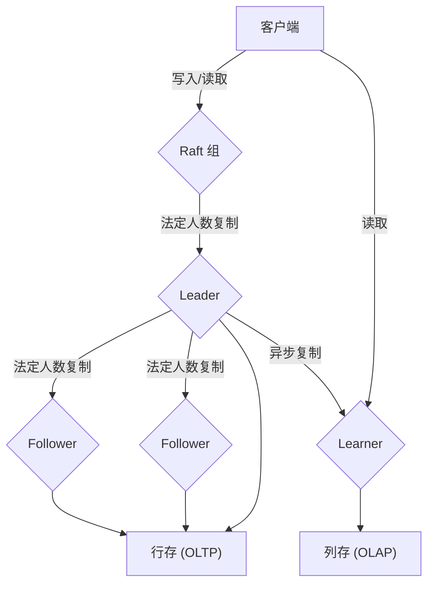

### 3\. 多版本并发控制 (MVCC)

**MVCC** 是一种数据库并发控制技术，它允许多个事务在不同时间点看到数据库的“快照”，从而避免读写冲突。TiDB 的 MVCC 是基于 **Percolator** 模型实现的。

  * **Start Timestamp (开始时间戳)**：事务开始时从 PD（Placement Driver）获取的唯一时间戳。该事务的读取操作只能看到在这个时间戳之前已经提交的数据。
  * **Commit Timestamp (提交时间戳)**：事务提交时从 PD 获取的唯一时间戳，这个时间戳大于 Start Timestamp。数据只有拥有 Commit Timestamp 后，才对其他事务可见。

### 4\. 分布式数据库组件

TiDB 的架构由三个主要组件构成：

  * **TiDB Server (SQL Engine)**：SQL 引擎层，负责解析 SQL 语句，生成执行计划，并将其下推到 TiKV 和 TiFlash。它就像整个系统的“大脑”。
  * **TiKV (Row Store)**：分布式键值对存储引擎，采用**行存**格式，主要负责处理 OLTP 事务。它将数据划分为一个个 **Region**，每个 Region 都是一个独立的 Raft 组。
  * **TiFlash (Column Store)**：分布式列式存储引擎，基于 Raft 的 **Learner** 角色构建，主要负责处理 OLAP 查询。

-----

如果想更深入，我们还可以探讨 TiDB 是如何利用这些组件实现**智能查询路由**，以便自动选择 TiKV 或 TiFlash 来执行不同的查询。您对此感兴趣吗？
  
## 参考        
         
https://dl.acm.org/doi/pdf/10.14778/3415478.3415535    
        
<b> 以上内容基于DeepSeek、Qwen、Gemini及诸多AI生成, 轻微人工调整, 感谢杭州深度求索人工智能、阿里云、Google等公司. </b>        
        
<b> AI 生成的内容请自行辨别正确性, 当然也多了些许踩坑的乐趣, 毕竟冒险是每个男人的天性.  </b>        
    
#### [期望 PostgreSQL|开源PolarDB 增加什么功能?](https://github.com/digoal/blog/issues/76 "269ac3d1c492e938c0191101c7238216")
  
  
#### [PolarDB 开源数据库](https://openpolardb.com/home "57258f76c37864c6e6d23383d05714ea")
  
  
#### [PolarDB 学习图谱](https://www.aliyun.com/database/openpolardb/activity "8642f60e04ed0c814bf9cb9677976bd4")
  
  
#### [PostgreSQL 解决方案集合](../201706/20170601_02.md "40cff096e9ed7122c512b35d8561d9c8")
  
  
#### [德哥 / digoal's Github - 公益是一辈子的事.](https://github.com/digoal/blog/blob/master/README.md "22709685feb7cab07d30f30387f0a9ae")
  
  
#### [About 德哥](https://github.com/digoal/blog/blob/master/me/readme.md "a37735981e7704886ffd590565582dd0")
  
  

  
