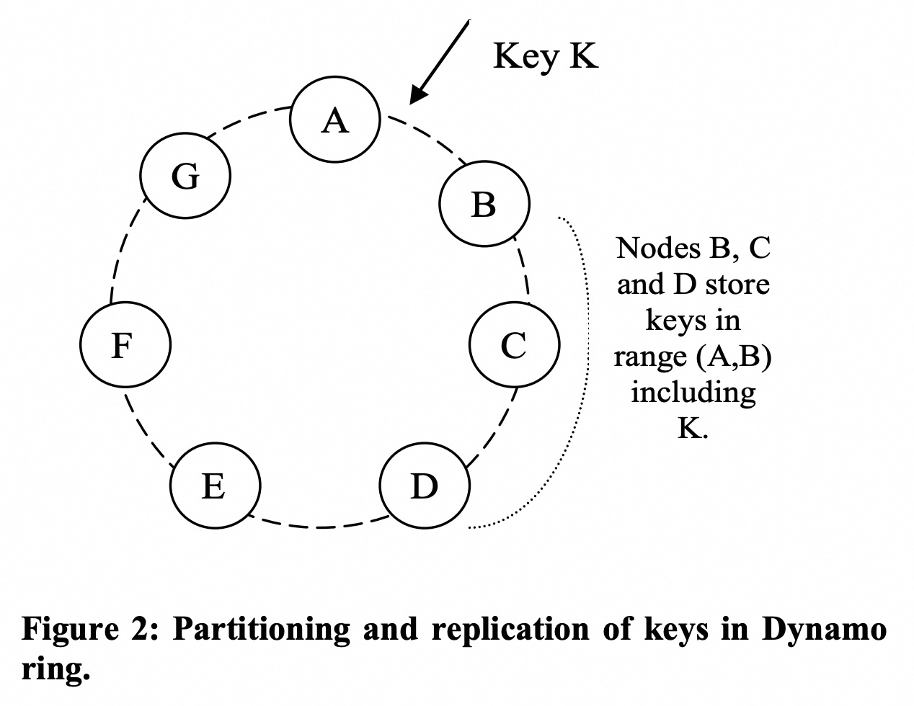
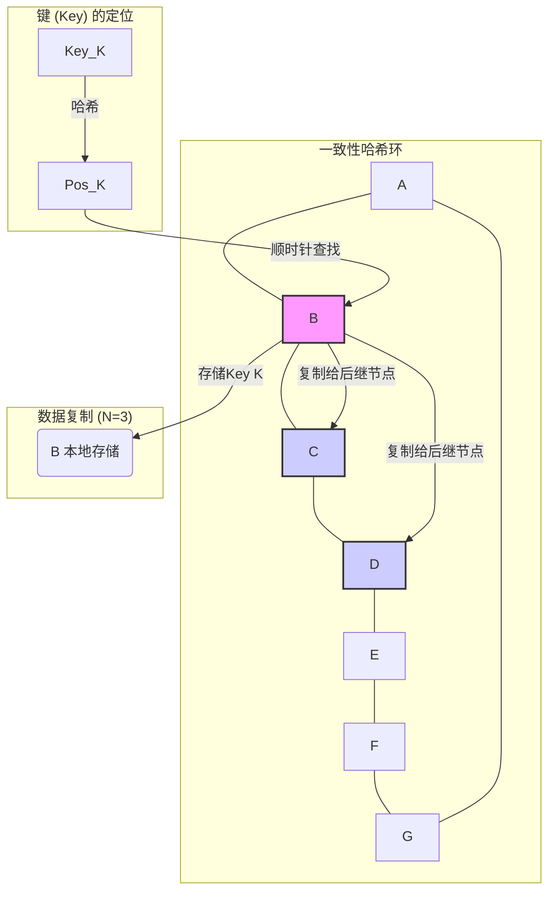
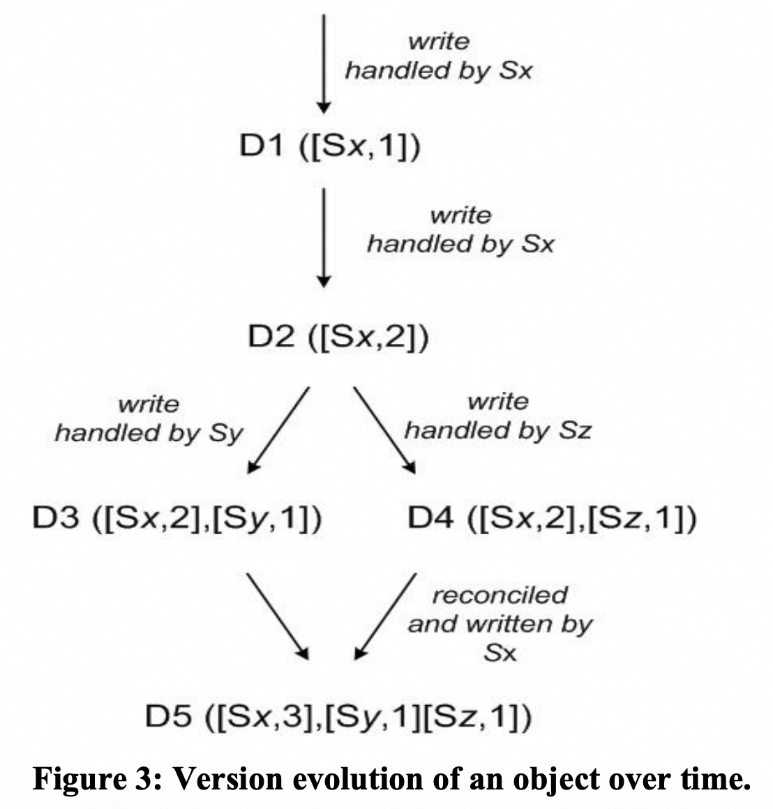
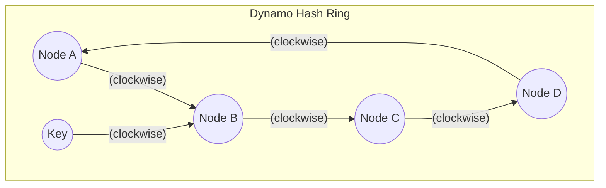

## AI论文解读 | Dynamo: Amazon’s Highly Available Key-value Store
        
### 作者        
digoal        
        
### 日期        
2025-09-25       
        
### 标签        
PostgreSQL , PolarDB , DuckDB , AI , 论文解读        
        
----        
        
## 背景  
      
https://dl.acm.org/doi/pdf/10.1145/1323293.1294281        
  
提示:          
```          
读懂《Dynamo: Amazon’s Highly Available Key-value Store》这篇论文需要提前掌握哪些基础知识, 请使用中文通熟易懂的讲解这些基础知识, 可以引用论文中的图、表或使用Markdown支持的图形(text,mermaid等)增加解释性. 
  
使用中文通熟易懂的解读《Dynamo: Amazon’s Highly Available Key-value Store》这篇论文, 其中的关键内容请着重讲解, 可以引用论文中的图、表或使用Markdown支持的图形(text,mermaid等)增加解释性. 
  
提取《Dynamo: Amazon’s Highly Available Key-value Store》这篇论文中的重要术语, 使用中文对这些术语进行通熟易懂的讲解, 可以引用论文中的图、表或使用Markdown支持的图形(text,mermaid等)增加解释性. 
```     
  
## 1 前置知识 
  
读懂《Dynamo: Amazon’s Highly Available Key-value Store》这篇论文需要掌握一些分布式系统和数据库的基础知识。这篇论文的核心在于**权衡**，它为了实现高可用性（High Availability）而牺牲了强一致性（Strong Consistency）。理解这一点，是读懂整篇论文的关键。

以下是理解这篇论文需要提前掌握的几个核心基础知识点，我会用通俗易懂的方式为您逐一讲解。

---

### 1. CAP理论（CAP Theorem）

这是理解Dynamo设计哲学的基石。CAP理论指出，在一个分布式系统中，你无法同时满足以下三个特性：
* **一致性（Consistency）** : 所有节点在同一时间看到的数据是相同的。
* **可用性（Availability）** : 每次请求都能得到一个响应，无论成功或失败，但系统总能正常服务。
* **分区容错性（Partition Tolerance）** : 即使网络出现分区，即节点间无法通信，系统仍然能正常运行。

Dynamo为了实现“永远在线”（Always-on）的用户体验，选择了 **可用性（A）** 和 **分区容错性（P）** ，并牺牲了**强一致性（C）** 。这意味着在某些网络故障或节点失败的情况下，Dynamo仍然能接受写请求，但可能会返回旧数据，产生“不一致”的状态，需要后续处理。

### 2. 分布式数据存储核心技术

论文中大量使用了成熟的分布式技术，并将其巧妙结合。您需要理解以下几个关键概念：

#### 2.1. 一致性哈希（Consistent Hashing）
这是Dynamo实现**数据分区和增量扩展**的核心算法 。

* **基本原理**: 想象一个圆环（哈希环），哈希函数的输出范围被映射到这个环上。系统中的每个节点（例如服务器）和每个数据键（Key）都会被哈希到环上的一个位置 。
* **如何查找数据**: 要找到一个键对应的数据，从它的位置开始，沿着哈希环顺时针方向找到第一个节点，这个节点就是负责存储该键的“协调者” 。
* **为什么使用它**: 它的最大优势在于，当一个节点加入或离开时，只会影响它在环上的邻居节点，而不会引起整个系统中所有数据的重新分布，从而实现了**增量扩展** 。

论文通过下图（图2）直观地展示了这个概念：   
* 节点A、B、C、D、E、F、G位于哈希环上 。
* 键K被哈希后落在环上的一个点 。
* 沿着哈希环顺时针方向，找到的第一个节点是B，因此B是该键的协调者 。
* 为了实现数据冗余，B会将键K的数据复制到其顺时针方向的N-1个后续节点上 。例如，如果N=3，数据会被复制到B、C和D上 。

#### 2.2. 虚拟节点（Virtual Nodes）
为了解决基本一致性哈希算法可能导致的数据和负载不均匀分布问题，Dynamo引入了虚拟节点（Virtual Nodes）的概念 。

* **工作原理**: 每一个物理节点在哈希环上不是只占据一个位置，而是被分配了多个位置，每个位置代表一个“虚拟节点” 。
* **优点**: 这种设计让负载能够更均匀地分散到各个物理节点上。当某个物理节点失效时，它所负责的多个虚拟节点的负载可以更均匀地分散到其他剩余的节点上 。

#### 2.3. N、R、W与Quorum机制（Quorum System）
这是Dynamo处理数据读写一致性的核心参数。
* **N**: 副本数。一个数据项被复制存储在N个节点上 。
* **W**: 成功写入所需的最小副本数。一个写操作被认为是成功的，前提是至少有W个副本成功写入 。
* **R**: 成功读取所需的最小副本数。一个读操作被认为是成功的，前提是它能从至少R个副本获取到数据 。

如果设置 `R + W > N`，就可以确保读取的数据至少有一个是最新的版本，从而实现**强一致性** 。然而，Dynamo为了高可用性，通常将 `R` 和 `W` 设置为小于 `N` 的值 ，这意味着它采用了一种名为**Sloppy Quorum**的机制，牺牲了一定的数据一致性来换取更高的可用性 。

#### 2.4. 向量时钟（Vector Clocks）和数据版本控制
由于Dynamo只提供了最终一致性，在同时有多个写请求时，可能会出现数据版本冲突。向量时钟就是用来追踪数据版本历史的工具。

* **工作原理**: 当一个数据被写入时，Dynamo会生成一个新的版本，并用一个向量时钟来标记它 。向量时钟本质上是一个`(节点, 计数器)`的列表，用来记录数据在不同节点上更新的历史 。
* **冲突解决**: 当客户端读取数据时，如果收到了多个版本，Dynamo会通过向量时钟判断这些版本是否具有因果关系。如果无法判断，它会将所有冲突版本返回给应用程序，由应用程序的业务逻辑来解决冲突（例如，购物车的合并操作）。

---

希望这些基础知识能帮助您更好地理解这篇开创性的论文。

---

在阅读完这些基础知识后，您对论文的哪一部分最感兴趣？我们可以进一步讨论论文中提到的 **Gossip协议**、**Merkle树** 或 **SLA（服务水平协议）** 。

好的，我们继续。Gossip协议和Merkle树是Dynamo实现其高可用性和最终一致性的重要辅助机制。让我们来深入探讨一下这两个概念。

### Gossip协议

**Gossip协议（流言协议）** 是一种去中心化的、点对点的信息传播机制。它的灵感来源于现实生活中的八卦传播：每个节点随机地向其他一些节点传递自己所知道的信息，一段时间后，这些信息就会扩散到整个系统。

在Dynamo中，Gossip协议主要用于 **成员管理（Membership）** 和 **故障检测（Failure Detection）** 。

* **如何工作？**
    * 每个Dynamo节点都维护一份集群中其他节点的列表及其状态信息（例如，该节点是否“存活”）。
    * 每个节点会周期性（比如每秒）地随机挑选一个或几个节点，并与它们交换自己的成员列表信息。
    * 通过这种方式，一个新加入的节点信息可以快速传播到整个集群，一个宕机的节点状态也能被其他节点发现。
    * 这种协议的优势在于其**去中心化**和**高鲁棒性**。即使某个节点失败，只要还有其他节点存活，信息交换就不会中断。

---

### Merkle树

**Merkle树（哈希树）** 是一种二叉树或多叉树，它的叶子节点存储了数据块的哈希值，而非叶子节点存储了其子节点的哈希值。

在Dynamo中，Merkle树用于高效地**检测数据副本的不一致性**。

* **如何工作？**
    * Dynamo中的每个节点都为其所负责的每个键范围（key range）构建一个Merkle树。
    * 树的叶子节点是该范围内的每个数据项的哈希值。
    * 当两个节点需要同步数据时，它们不需要比较整个数据集，只需要比较各自的Merkle树的根哈希值。
    * 如果根哈希值不同，它们就比较子节点的哈希值，直到找到第一个不一致的哈希值。这样，它们可以非常快速地定位到不一致的数据块，而不需要传输大量数据。

* **举例说明**
    * 假设节点 A 和节点 B 存储了相同的数据范围。
    * 它们各自生成一个Merkle树，并计算根哈希值。
    * 如果 A 和 B 的根哈希值不同，则说明它们的数据不一致。
    * 它们会继续比较左右子树的哈希值。
    * 如果左子树哈希值相同，而右子树哈希值不同，则说明不一致发生在其右子树所覆盖的数据范围内。
    * 通过不断下钻，它们最终可以确定是哪一个叶子节点（也就是哪一个数据项）不一致。

这两个机制的结合，使得Dynamo可以在高可用的同时，通过高效的后台修复机制来处理数据不一致的问题。

您对Gossip协议在故障检测中的具体应用，或者Merkle树在数据同步中的更详细过程感兴趣吗？

好的，我们来详细聊聊 Gossip 协议在 Dynamo 中的故障检测应用。

Gossip 协议的故障检测机制非常巧妙，它没有一个中心化的“健康检查”服务，而是通过**去中心化的、基于随机信息交换**的方式来判断节点状态。

### Gossip 协议如何进行故障检测

1.  **成员列表交换**: 每个 Dynamo 节点都维护一个包含集群中所有其他节点及其状态的列表。这个列表记录了每个节点“存活”还是“宕机”的状态。

2.  **随机传播**: 每个节点会周期性地（例如每秒钟一次）从其成员列表中随机选择一个或几个节点，并与它们交换各自的成员列表信息。这就像朋友之间互相分享八卦，**“嘿，你知道吗？我听说节点 X 状态不错，节点 Y 好像很久没回话了。”**

3.  **心跳与版本号**: 在信息交换时，每个节点不仅仅是传递成员列表，还会传递一个 **心跳（Heartbeat）** 或版本号。当一个节点的状态发生变化（比如刚刚启动或宕机恢复），它会增加自己的心跳版本号。接收到信息的节点会用接收到的心跳版本号来更新自己的成员列表。

4.  **超时判断**: 如果一个节点在很长一段时间内（比如超过了某个阈值），都没有收到来自另一个特定节点的任何“心跳”或状态更新，它就会认为这个节点可能已经失败了。

这个过程就像一个病毒式传播的谣言，一旦一个节点的状态发生变化，这个信息会通过多次的随机交换，最终扩散到整个集群。

---

### 这种机制的优点

* **高鲁棒性**: 由于没有中心化的协调者，即使少数节点失败，整个故障检测系统仍然能正常工作。系统不会因为单点故障而瘫痪。
* **可扩展性**: Gossip 协议的通信开销与集群大小的平方根成正比，这意味着它在大型集群中也能高效运作，因为它不需要每个节点都和所有其他节点通信。
* **快速收敛**: 在正常情况下，故障信息可以在很短的时间内扩散到整个集群，使得系统能够快速响应并进行修复（比如由其他节点接管宕机节点的工作）。

---

我希望这个解释能帮助你更好地理解 Gossip 协议。你对 Dynamo 的故障检测机制还有其他疑问吗？或者我们继续讨论论文中的其他概念？

好的，我们来详细探讨 **Merkle 树**在 Dynamo 中是如何实现高效的数据同步和副本修复的。这个过程是 Dynamo 最终一致性模型中的一个重要组成部分。

### Merkle 树的数据同步过程

在 Dynamo 中，数据同步是一个后台进行的异步过程，旨在修复因网络分区、节点宕机等原因导致的数据不一致。这个过程称为 **Anti-Entropy（反熵）** 。

其核心思想是：**两个节点不需要逐个比较所有数据，只需要比较它们的 Merkle 树，就可以快速找出不一致的数据块。**

以下是具体的同步过程：

#### 1. 构建 Merkle 树

每个 Dynamo 节点都会为它所负责的每个 **键范围（key range）** 构建一个 Merkle 树。

* **叶子节点**: 树的叶子节点是该键范围内**每个数据项的哈希值**。这个哈希值不仅包括数据本身，通常还包含了其 **版本号（Vector Clock）** 。
* **父节点**: 父节点的哈希值是其所有子节点哈希值的组合（通常是串联后进行哈希）。
* **根节点**: 最终，所有哈希值会向上汇总，形成一个 **根哈希值（root hash）** 。这个根哈希值代表了整个键范围内所有数据的状态。

#### 2. 比较根哈希值

当两个节点（比如节点 A 和节点 B）需要同步数据时，它们会首先交换各自的 Merkle 树根哈希值。

* **如果根哈希值相同**: 这意味着两个节点的数据在逻辑上是**一致**的，它们就不需要进行任何数据同步。
* **如果根哈希值不同**: 这表明它们的数据**存在不一致**，需要进行进一步的比较。

#### 3. 递归下钻（Drill-down）

当根哈希值不一致时，两个节点会递归地比较它们的子树哈希值，以定位不一致的具体数据项。

* **节点 A 和 B 交换子树哈希值**。
* 假设根哈希值的左子树哈希值相同，但右子树哈希值不同。
* 那么，这两个节点就会继续下钻到右子树，重复比较其子节点哈希值。
* 这个过程一直持续到找到**第一个不一致的叶子节点**。

#### 4. 传输不一致的数据

一旦找到了不一致的叶子节点（也就是对应的数据项），拥有旧数据的节点就会从拥有新数据的节点那里拉取最新的数据副本。由于向量时钟的存在，节点可以轻松判断哪个版本是最新的。

通过这种方式，Dynamo 避免了在网络上传输整个数据集，只需要传输不一致的一小部分数据，从而大大节省了网络带宽和时间，实现了高效的后台修复。

---

希望这个更详细的过程解释能帮助你更好地理解 Merkle 树。关于 Dynamo 这篇论文，你还有其他想了解的地方吗？
  
## 2 解读论文 
  
好的，我们来一起深入解读这篇分布式系统领域的经典论文——《Dynamo: Amazon's Highly Available Key-value Store》。这篇论文不仅揭示了亚马逊如何构建核心服务（如购物车）的存储系统，其设计思想也深刻影响了后来的一大批NoSQL数据库（如Cassandra和Riak）。

我将用尽可能通俗的语言，为您剖析其背后的核心挑战与巧妙设计。

-----

### 核心背景：亚马逊到底遇到了什么问题？

在21世纪初，亚马逊的业务规模爆炸式增长，其电商平台由数百个微服务构成，这些服务共同支撑着从商品推荐到订单处理的全部流程 。他们发现，传统的“关系型数据库”（RDBMS）在几个关键方面已难以为继：

1.  **高可用性是命脉**：对于亚马逊而言，任何微小的服务中断都意味着巨大的经济损失和用户信任的流失 。像“购物车”这样的核心功能，必须做到“永远在线” 。但传统数据库为了保证数据强一致性，在遇到网络分区或服务器故障时，常常会选择“拒绝服务”，这在亚马逊的业务场景中是不可接受的 。
2.  **扩展性需求**：业务量持续增长，系统需要能够轻松地增加服务器来线性扩展性能（即“增量可扩展性”） 。传统数据库的扩展（Scale-out）非常复杂且昂贵 。
3.  **简化需求**：许多服务，如购物车、用户偏好、会话管理等，其实只需要简单的“键值”（Key-Value）查询，即根据一个唯一的ID存取数据 。关系型数据库复杂的查询和事务功能不仅是多余的，还带来了性能和成本上的浪费 。

**核心矛盾**：在分布式系统中， **一致性（Consistency）** 、 **可用性（Availability）** 和 **分区容错性（Partition Tolerance）** 三者不可兼得（即CAP理论）。Dynamo的抉择是，**牺牲强一致性，来换取极致的高可用性** 。这便是理解Dynamo所有设计的基石。

-----

### 核心设计理念

在深入技术细节前，我们先了解Dynamo的几个基本设计原则，这些原则贯穿了整个系统：

  * **增量可扩展性 (Incremental Scalability)**：系统应能通过一次增加一台节点的方式平滑扩展，且对系统和运维的影响最小 。
  * **对称性 (Symmetry)**：每个节点都应该有相同的职责，没有“主节点”或特殊角色的节点 。这大大简化了系统的部署和维护 。
  * **去中心化 (Decentralization)**：倾向于使用点对点（Peer-to-Peer）技术，而不是中心化控制 。中心化的设计容易导致单点故障 。
  * **异构性 (Heterogeneity)**：系统需要能够利用不同配置的硬件，根据服务器的能力来分配工作负载 。

-----

### 关键技术深度解析

现在，我们来逐一拆解Dynamo为了实现“永远在线”而使用的核心技术。这些技术精妙地组合在一起，构成了Dynamo的骨架。

#### 1\. 分区 (Partitioning): 一致性哈希 (Consistent Hashing) 与虚拟节点 (Virtual Nodes)

**问题**：如何将海量的数据（键值对）均匀地分布到集群的所有节点上，并且在增删节点时，尽可能少地移动数据？

**解决方案**：**一致性哈希**。

  * 想象一个从0到 $2^{128}-1$ 的闭环，就像一个钟表（论文中称之为“ring”） 。
  * 系统中的每个**节点**通过哈希计算，被随机分配到这个环上的某个位置 。
  * 当一个**数据键 (key)** 需要存储时，同样通过哈希计算得到它在环上的位置。
  * 从这个数据键的位置**顺时针**走，遇到的第一个节点就是负责存储这个数据的“协调者”节点 。

> **一致性哈希的优势**：当一个新节点加入时，它只影响其在环上的“邻居”节点，只需从下一个节点接管一小部分数据即可，而其他节点不受影响 。同理，一个节点离开时，也只影响其邻居。

**改进**：**虚拟节点 (Virtual Nodes)**。

单纯的一致性哈希有两个问题：节点随机分配可能导致数据分布不均；无法处理节点间的硬件差异（异构性） 。

Dynamo的解决方案是引入“虚拟节点” 。不再将一个物理节点映射到环上的一个点，而是将其映射到**多个**虚拟节点（多个点） 。

如下图所示（基于论文Figure 2的理念）： 

  



  * **好处1 (负载均衡)**：由于一个物理节点对应多个虚拟节点，数据和请求负载被更均匀地打散到整个环上 。
  * **好处2 (快速恢复)**：当一个物理节点宕机时，它所负责的多个虚拟节点的数据和负载会均匀地分散给其他多个物理节点，而不是全部压给它的下一个邻居 。
  * **好处3 (异构性)**：性能更强的服务器可以被分配更多的虚拟节点，从而承担更多的负载 。

#### 2\. 复制 (Replication) 与数据版本控制 (Data Versioning)

**问题**：为了高可用和数据持久性，数据必须有多个副本。但在一个允许随时写入的系统里，如果不同副本被同时修改，该如何处理冲突？

**解决方案**：**N个副本 + 向量时钟 (Vector Clocks)**。

  * **复制 (Replication)**：每个数据键都会被复制到 **N** 个节点上 。N是可以配置的，通常为3。负责存储某个键的N个节点的列表，被称为“**偏好列表 (preference list)**” 。这个列表由该键的协调者节点及其在环上的N-1个后继健康节点组成 。
  * **数据版本控制 (Data Versioning)**：Dynamo的核心思想是**不尝试在写入时解决冲突**，而是允许冲突的版本共存 。它将每次修改都视为一个**不可变的新版本**数据 。
      * **何时解决冲突？** 在**读取**时解决 。
      * **谁来解决冲突？** **客户端（应用层）** 。例如，对于购物车的冲突，应用逻辑可以选择“合并”两个版本的购物车，而不是简单地“谁最后写谁赢” 。

**关键技术**：**向量时钟 (Vector Clocks)**。

为了能判断不同数据版本之间的关系（是“祖先/后代”关系，还是“冲突”关系），Dynamo为每个数据版本都关联了一个向量时钟 。

  * 向量时钟是一个 `[(节点, 计数器), ...]` 列表 。
  * 当一个节点处理对某数据的写请求时，它会递增自己在这个数据版本向量时钟里的计数器。
  * **如何判断关系？**
      * 如果版本A的向量时钟里所有节点的计数器都**小于等于**版本B的，那么A是B的祖先，可以被安全覆盖 。
      * 否则，这两个版本就是冲突的，需要应用层介入解决 。

让我们通过论文中的Figure 3来理解这个过程 ：   

1.  **D1 ([Sx, 1])**: 客户端首次写入数据，由节点Sx处理。
2.  **D2 ([Sx, 2])**: 客户端更新数据，还是由Sx处理。D2是D1的后代。
3.  **分支出现**: 此时，一个客户端基于D2进行更新，由Sy处理，生成 **D3 ([Sx, 2], [Sy, 1])**。同时，另一个客户端也基于D2更新，由Sz处理，生成 **D4 ([Sx, 2], [Sz, 1])**。
4.  **冲突**: D3和D4的向量时钟无法判断谁是谁的祖先，它们是冲突的。当客户端读取时，Dynamo会同时返回D3和D4 。
5.  **合并**: 客户端业务逻辑（比如合并购物车）将D3和D4的内容合并，然后发起一次新的写入，这次由Sx处理。最终生成 **D5 ([Sx, 3], [Sy, 1], [Sz, 1])**。这个新版本的向量时钟整合了之前的所有信息，标志着冲突已经解决 。

#### 3\. 处理故障：Sloppy Quorum 与 Hinted Handoff

**问题**：如果遵循严格的“法定人数”（Quorum）协议（即N个副本中，必须写成功W个，读成功R个才算成功），当节点故障导致可用节点数不足W或R时，操作就会失败，可用性就降低了。

**解决方案**：**Sloppy Quorum (宽松法定人数) + Hinted Handoff (提示移交)**。

  * **Quorum**：这是一个可配置的策略，通过`N`, `R`, `W`三个参数来平衡一致性与性能。`N`是副本数，`W`是写操作需要成功的副本数，`R`是读操作需要成功的副本数。通常设置`R + W > N`来保证强一致性 。但Dynamo为了高可用，通常不这么设置（例如，(N,R,W) = (3,2,2) ）。
  * **Sloppy Quorum**：读写操作不再要求必须在“偏好列表”的前N个节点上完成，而是在**前N个健康的、可达的**节点上完成，哪怕这些节点不在最初的偏好列表里 。
  * **Hinted Handoff**：这是实现Sloppy Quorum的机制。假设偏好列表是A, B, C，但A节点宕机了。当一个写请求到来时，系统会发现A不可用，于是会顺着环找到下一个健康的节点（比如D），并将数据副本写入D。但这份副本在元数据中会带有一个“提示(hint)”，说明这份数据**本应**属于A 。节点D会周期性地检查A是否恢复，一旦A恢复，D就会把这份数据“交还”给A，然后删除本地的临时副本 。

> 这个机制确保了即使有节点临时故障，写操作也**几乎总能成功**（只要集群中还有健康的节点），从而实现了极高的写可用性 。

#### 4\. 副本同步：Merkle 树 (Merkle Trees)

**问题**：由于Hinted Handoff或长时间的网络分区，不同节点上的副本数据最终可能会变得不一致。如何高效地检测和修复这些不一致？

**解决方案**：**Merkle 树**，也叫哈希树。

  * 如果逐个对比两个副本的所有键值对，效率太低，会产生大量网络传输和磁盘I/O。
  * Merkle树的原理是 ：
    1.  一个键范围内的每个键值对，都计算一个哈希值，这些哈希值是树的“叶子节点”。
    2.  相邻的叶子节点哈希值组合在一起，再计算一个哈希值，成为它们的“父节点”。
    3.  这个过程不断重复，直到生成一个单一的“根哈希值”。
  * **同步过程** ：
    1.  两个需要同步的节点首先交换它们对应键范围的**根哈希值**。
    2.  如果根哈希值相同，说明它们的副本完全一致，同步结束。
    3.  如果根哈希值不同，就递归地向下比较它们子节点的哈希值，直到找到具体是哪些键的数据不一致，然后只同步这些不一致的数据。

> Merkle树的巨大优势在于，它能**极大地减少**为了发现不一致而需要传输的数据量，让副本同步变得非常高效 。

#### 5\. 成员关系和故障检测：Gossip 协议 (Gossip Protocol)

**问题**：在一个去中心化的系统里，每个节点如何知道其他所有节点的存在、状态（是否健康）以及它们负责的数据范围？

**解决方案**：**Gossip 协议**。

  * 系统中的每个节点每秒会随机选择另一个节点，并互相交换彼此所知的集群成员信息和状态 。
  * 就像办公室里的“八卦”一样，任何一个节点加入、离开或状态变化的信息，会通过这种随机的点对点通信，最终迅速传播到整个集群。
  * 这种方式非常健壮，没有单点故障，并且能够保证成员信息视图的“**最终一致性**” 。

-----

### 总结与影响

Dynamo通过一系列精心设计的技术组合，成功构建了一个高可用、高可扩展且性能优异的键值存储系统。其核心贡献在于：

  * **证明了“最终一致性”模型的实用性**：它向世界展示了，对于许多互联网应用（如购物车），牺牲强一致性来换取高可用性是完全可行且非常有价值的 。
  * **技术的综合与权衡**：Dynamo并非发明了所有技术，而是巧妙地将一致性哈希、向量时钟、Quorum、Gossip等已知技术“合成”为一个整体，并通过 (N, R, W) 等参数让应用开发者可以根据自己的需求进行**权衡（trade-off）** 。
  * **深远的影响力**：Dynamo的设计哲学催生了著名的开源NoSQL数据库Apache Cassandra，后者在架构上与Dynamo有诸多相似之处。它为后来的大规模分布式系统设计提供了宝贵的实践经验和理论基础。

希望这份解读能帮助您更好地理解这篇经典论文。Dynamo的设计充满了对现实世界中各种故障场景的深入思考和工程上的权衡智慧。

接下来，我们是否可以深入探讨Dynamo如何影响后来的数据库（如Cassandra），或者比较它与其他分布式系统（如Google的Bigtable）在设计理念上的差异？
  
## 3 术语 
  
从《Dynamo: Amazon’s Highly Available Key-value Store》这篇论文中，我们可以提取出一些至关重要的术语。理解这些术语是掌握 Dynamo 设计思想和其分布式系统工作原理的关键。

以下是一些重要术语的中文解释：

-----

### **1. 最终一致性（Eventual Consistency）**

  * **通俗解释**：这是一种数据一致性模型，它不保证所有节点在同一时间看到完全相同的数据。取而代之的是，它保证如果系统在一段时间内没有新的更新，所有节点最终会收敛到相同的状态。这就像“等一会儿，数据总会同步好的”。
  * **论文核心**：Dynamo 为了实现“永远在线”的高可用性，牺牲了强一致性，选择了最终一致性。这是论文最核心的设计哲学。

### **2. 向量时钟（Vector Clocks）**

  * **通俗解释**：在分布式系统中，当多个节点同时对一个数据进行更新时，可能会产生冲突。向量时钟是一种用来**追踪数据版本历史**的机制。它本质上是一个 `(节点, 计数器)` 的列表，用来记录数据在不同节点上被更新的次数。
  * **论文核心**：当客户端读取数据时，如果 Dynamo 返回多个版本，它会通过向量时钟来判断这些版本是否具有因果关系。如果无法判断，它会将所有冲突版本返回给应用程序，由应用程序的业务逻辑来解决冲突（即“应用程序辅助冲突解决”）。

### **3. N、R、W（Quorum 机制）**

  * **通俗解释**：这三个参数定义了 Dynamo 集群中数据读写操作的**一致性级别**。
      * **N**: 副本数（Number of replicas）。一个数据对象在整个集群中存储的副本总数。
      * **W**: 成功写入所需的最小副本数（Minimum number of writes）。一个写操作只有在至少写入 W 个副本后才被认为是成功的。
      * **R**: 成功读取所需的最小副本数（Minimum number of reads）。一个读操作只有在从至少 R 个副本获取到数据后才被认为是成功的。
  * **论文核心**：Dynamo 使用了 **Sloppy Quorum**（松散法定人数）机制。即使 W + R \<= N，只要满足 W 和 R 的条件，读写操作就可以成功。这种机制在保证一定数据持久性的同时，最大化了系统的可用性。

### **4. 一致性哈希（Consistent Hashing）**

  * **通俗解释**：这是一种特殊的哈希算法，用于**数据分区和负载均衡**。它将所有节点和数据键都映射到一个抽象的**哈希环**上。
  * **论文核心**：Dynamo 用它来决定数据存储在哪个节点上。当一个节点加入或离开时，它只会影响该节点在环上的邻居，而不会导致整个集群的数据大规模迁移，从而实现了**增量扩展**。

我们可以使用 Mermaid 文本图来直观地展示这个概念：



在上面的图中，**键（Key）会被哈希到哈希环上的一个位置。沿着哈希环顺时针方向，它遇到的第一个节点是 B，因此 B 就是负责存储该键的协调者**。

### **5. 虚拟节点（Virtual Nodes）**

  * **通俗解释**：为了解决基本一致性哈希可能导致的数据分布不均问题，Dynamo 引入了虚拟节点。每个物理节点在哈希环上被映射为多个虚拟节点。
  * **论文核心**：这种设计使得负载能够更均匀地分散到各个物理节点上。当某个物理节点失效时，它所负责的多个虚拟节点的负载可以更均匀地分散到其他剩余的节点上，而不是全部转移给一个邻居节点。

### **6. Gossip 协议（流言协议）**

  * **通俗解释**：这是一种**去中心化、点对点**的信息传播协议。就像人们互相传播八卦一样，每个节点周期性地向其他随机选择的节点发送自己掌握的信息（比如成员列表和状态）。
  * **论文核心**：Dynamo 用 Gossip 协议来实现**成员管理**和**故障检测**。它允许系统中的每个节点快速、去中心化地感知到其他节点的状态变化，即使某些节点宕机也不会影响信息传播。

### **7. Merkle 树（哈希树）**

  * **通俗解释**：这是一种二叉树，其叶子节点存储了数据块的哈希值，父节点存储了子节点哈希值的组合哈希值。
  * **论文核心**：Dynamo 用 Merkle 树来高效地**检测数据副本的不一致性**。当两个节点需要同步数据时，它们不需要比较所有数据，只需要比较各自的 Merkle 树的根哈希值。如果根哈希值不同，它们就可以快速下钻（drill-down）到不一致的子树，从而精确地定位到需要同步的少量数据，而不是传输整个数据集。

-----

希望这些解释能帮助您更好地理解 Dynamo 的设计原理。除了这些，您还想了解论文中提到的其他机制，比如后台修复（Anti-entropy）或它的典型应用场景吗？

很好，我们来继续探讨 Dynamo 的后台修复和典型应用场景。

### 后台修复 (Anti-entropy)

**反熵（Anti-entropy）** 是一个借用自热力学概念的术语，它的核心思想是：在一个分布式系统中，系统状态（数据）的混乱度（熵）会随着时间的推移而增加。后台修复机制就是通过周期性地同步数据，来**对抗这种混乱度增加的趋势**，确保数据副本最终达到一致。

在 Dynamo 中，后台修复主要通过两种方式实现：

1.  **Gossip 协议**：我们之前讨论过，Gossip 协议用于故障检测。当一个宕机节点恢复后，它可以通过 Gossip 协议快速获取它在离线期间错过的更新信息。

2.  **Merkle 树**：这是最核心的后台修复机制。每当两个 Dynamo 节点决定同步数据时，它们就会利用我们之前讨论的 Merkle 树算法。通过比较树的根哈希值并递归下钻，它们可以快速定位并同步那些不一致的数据块。这个过程是异步的、周期性的，它确保了即使在网络分区、节点失效等极端情况下，数据最终也会自动修复。

### 典型应用场景

Dynamo 的设计哲学使其特别适合那些对**高可用性**有极高要求，并且可以容忍**最终一致性**的系统。以下是它的一些典型应用场景：

1.  **购物车服务**：这是 Dynamo 论文中提到的一个经典场景。对于像 Amazon 这样的电商平台来说，如果用户在下单时无法访问购物车，会造成巨大的收入损失和用户信任问题。即使在网络分区或服务器故障时，用户的购物车也必须“永远在线”，即使这意味着在极端情况下，用户可能看到一个略旧的购物车状态，但系统可以接受这个折衷，因为购物车服务会自动进行后台修复。

2.  **会话管理服务**：对于许多 Web 应用，用户的会话状态（如登录信息、浏览历史）需要快速、可靠地存取。这些数据通常不要求强一致性，短暂的旧数据是可以接受的，但服务必须时刻可用。

3.  **产品目录和库存管理**：对于一个庞大的在线商店，产品目录和库存信息会不断更新。虽然最终一致性是可接受的，但系统必须能够处理大量并发的读写请求，并保证在任何时候都可被访问。

4.  **配置服务**：许多大规模分布式系统需要一个服务来存储和管理配置信息。这些信息通常是只读的，或者更新频率很低，但必须时刻可用。Dynamo 的高可用性特性使其非常适合这类应用。

通过这些应用场景，我们可以看到 Dynamo 的核心价值在于它对**可用性**的极度偏爱，它通过精巧的设计和权衡，在不牺牲太多一致性的前提下，为那些对“永远在线”有着硬性要求的服务提供了可靠的基石。

---
你对 Dynamo 的应用场景还有哪些疑问？或者想了解它在这些场景中如何具体处理数据冲突？

很高兴能继续探讨这个核心问题。在分布式系统中，数据冲突是不可避免的，而 Dynamo 在处理这个问题上采用了独特且灵活的方法，即 **应用程序辅助的冲突解决（Application-assisted conflict resolution）** 。

### 为什么会发生数据冲突？

正如我们之前讨论的，Dynamo 为了高可用性牺牲了强一致性。这意味着，当网络发生分区时，如果客户端向两个不同的分区写入了相同的数据，就会产生**两个不同的、但都有效的版本**。这些版本没有因果关系，因此无法通过简单的“最新版本”来判断哪个是正确的。

这就像两个人分别修改了同一个文档，然后合并时发现他们各自的修改是独立的，无法简单地选择其中一个。

### 向量时钟（Vector Clocks）如何识别冲突？

当一个客户端发起读请求时，如果 Dynamo 发现有多个数据版本，它会通过**向量时钟**来判断这些版本之间的关系。

* **如果一个版本的向量时钟“支配”另一个**（即，一个版本的所有计数器都大于或等于另一个版本，并且至少有一个计数器严格大于），那么可以确定后者是前者的祖先版本，可以直接丢弃。
* **如果两个版本的向量时钟** **“互不支配”** ，这意味着它们是并发发生的、没有因果关系的版本。这就是我们所说的数据冲突。

### 应用程序辅助的冲突解决

Dynamo 的核心设计思想是，它把解决冲突的责任交给了应用程序。当 Dynamo 检测到数据冲突时，它会将所有冲突的版本（包括最新的版本和旧的、但可能仍然有效的版本）都返回给客户端。

然后，应用程序的业务逻辑需要自己来决定如何合并这些版本。这是一种非常灵活的设计，因为它允许开发人员根据具体的业务需求来定制冲突解决策略。

下面是一个经典的**购物车**冲突解决例子：

* **场景**：
    * 用户在手机上将“T恤”加入购物车。
    * 用户在电脑上将“鞋子”加入购物车。
    * 此时，由于网络延迟或系统分区，Dynamo 中可能会产生两个不同的购物车版本：一个只包含“T恤”，另一个只包含“鞋子”。

* **冲突解决**：
    * 当用户再次查看购物车时，Dynamo 将两个冲突的版本都返回给应用程序。
    * 应用程序的业务逻辑会识别出这两个版本，并进行**合并操作**。
    * 最终，用户看到的购物车会包含 **“T恤”和“鞋子”** ，这是最符合用户期望的结果。

**总结**：

* Dynamo 不会替你解决冲突，它只是**告诉你存在冲突**。
* 它通过**向量时钟**来识别冲突，并将所有冲突版本返回给你。
* 你需要**编写自定义的应用程序逻辑**来处理这些冲突，确保数据最终达到正确的状态。

这种设计使得 Dynamo 能够**在任何情况下都保持可用性**，因为它从不阻塞写操作。即使数据出现了暂时性的不一致，它也总是允许新的数据写入，并将冲突留给后台或应用程序来解决。

---
你对这种将冲突解决责任交给应用程序的设计有什么看法？或者想继续讨论 Dynamo 的其他设计细节吗？
  
## 参考        
         
https://dl.acm.org/doi/pdf/10.1145/1323293.1294281    
        
<b> 以上内容基于DeepSeek、Qwen、Gemini及诸多AI生成, 轻微人工调整, 感谢杭州深度求索人工智能、阿里云、Google等公司. </b>        
        
<b> AI 生成的内容请自行辨别正确性, 当然也多了些许踩坑的乐趣, 毕竟冒险是每个男人的天性.  </b>        
    
#### [期望 PostgreSQL|开源PolarDB 增加什么功能?](https://github.com/digoal/blog/issues/76 "269ac3d1c492e938c0191101c7238216")
  
  
#### [PolarDB 开源数据库](https://openpolardb.com/home "57258f76c37864c6e6d23383d05714ea")
  
  
#### [PolarDB 学习图谱](https://www.aliyun.com/database/openpolardb/activity "8642f60e04ed0c814bf9cb9677976bd4")
  
  
#### [PostgreSQL 解决方案集合](../201706/20170601_02.md "40cff096e9ed7122c512b35d8561d9c8")
  
  
#### [德哥 / digoal's Github - 公益是一辈子的事.](https://github.com/digoal/blog/blob/master/README.md "22709685feb7cab07d30f30387f0a9ae")
  
  
#### [About 德哥](https://github.com/digoal/blog/blob/master/me/readme.md "a37735981e7704886ffd590565582dd0")
  
  

  
