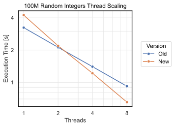

## DuckDB 1.4.0 新排序算法介绍(大幅性能提升)   
              
### 作者              
digoal              
              
### 日期              
2025-09-25              
              
### 标签              
PostgreSQL , PolarDB , DuckDB , sort , k-way merge sort , 性能提升 , 内存消耗降低 , I/O降低   
              
----              
              
## 背景      
排序是数据库里的常见操作, DuckDB 1.4.0 又重写了sort算法, 主要考虑到以下几点  
- 排序内容是否能超过内存  
- 排序时是否可以节约内存  
- 排序过程中是否可以继续从磁盘读取数据  
- 排序前是否必须先完整读取所有被排序数据  
- 排序是否能并行(充分利用cpu)  
- 比较阶段的解释开销  
  
最后看benchmark整体有3倍以上的性能提升, 最快的case性能提升达到10倍.    
  
起因是DuckDB在hash join & hash agg中使用的可溢出页面布局方案取得了非常好的效果, 此次重新设计排序也得益于此方案. 下面看看详细设计说明.   
  
以下内容翻译自: https://duckdb.org/2025/09/24/sorting-again.html  
  
# DuckDB 1.4.0 新排序算法介绍(大幅性能提升)  
  
TL;DR：四年后，我们决定再次重新设计 DuckDB 的排序实现。在这篇文章中，我们将介绍并评估新的排序实现设计。  
  
DuckDB v1.4.0 刚刚发布，其中包含对 DuckDB 排序实现的全新设计。我们四年前就[重新设计了 DuckDB 的排序功能](https://duckdb.org/2021/08/27/external-sorting.html)，这使得 DuckDB 能够并行地对超过主内存容量的数据进行排序，并进行高效的比较。这种实现方式效果很好，但从那时起，我们为更多运算符（ 例如[哈希连接](https://github.com/duckdb/duckdb/pull/4189)和[哈希聚合](https://github.com/duckdb/duckdb/pull/7931) ）实现了大于内存的查询处理，它们都使用了一种[全新改进的可溢出页面布局](https://github.com/duckdb/duckdb/pull/6998)。我们在之前的[博客文章](https://duckdb.org/2024/03/29/external-aggregation.html)中介绍了这种布局。我们决定将此布局集成到 DuckDB 的排序功能中，并彻底p重新设计了实现方式](https://github.com/duckdb/duckdb/pull/17584)。  
  
## 两阶段排序(受制于内存)  
DuckDB 使用[Morsel-Driven Parallelism](https://db.in.tum.de/~leis/papers/morsels.pdf)实现并行查询执行( 我抽空写个该论文解读文章, 关注 https://github.com/digoal/blog )。在 DuckDB 对该框架的实现中，采用了阻塞运算符（即必须读取整个输入才能输出的运算符，例如哈希聚合和排序运算符）具有以下阶段：  
- 1、Sink：线程本地积累来自管道的数据  
- 2、Combine：发出信号，通知线程完成其接收阶段  
- 3、Finalize：当所有线程都调用了Combine 时调用一次  
- 4、GetData：输出数据到下一个管道  
  
几十年来，在数据库系统中实现大于内存排序的首选方案是生成多个排序运行，然后进行归并排序( [merge sort](https://dl.acm.org/doi/pdf/10.1145/1132960.1132964) )。具体来说，[k-路归并排序](https://en.wikipedia.org/wiki/K-way_merge_algorithm)在大于内存排序期间产生的 I/O 量最低，这对性能至关重要。这种方法与 Morsel-Driven Parallelism 的并行性很好地映射：DuckDB 在Sink阶段执行 **线程本地排序** ，然后在Finalize或GetData阶段执行 **并行归并排序** 。这两种方式都已在 DuckDB v1.4.0 中进行了重新设计。在介绍新的归并设计之前，我们首先讨论新的线程本地排序实现。  
  
## 线程本地排序  
排序运行在Sink阶段以线程本地方式产生。DuckDB 的并行化方式在 v1.4.0 中没有改变：线程独立地并行生成排序运行未改变。改变的是 **物理排序实现** 。  
  
## 排序key的标准化/Normalization  
那些没有将所需类型编译到查询计划中的数据库系统（例如 DuckDB）会承受解释开销，尤其是在[排序时比较元组时](https://duckdb.org/pdf/ICDE2023-kuiper-muehleisen-sorting.pdf)。解决这个问题的一种方法是[排序键标准化](https://dl.acm.org/doi/pdf/10.1145/359863.359892)。DuckDB 的排序在 v1.4.0 之前已经使用了该功能的临时版本，但新的实现使用了通过 SQL 提供的更通用的[create_sort_key](https://github.com/duckdb/duckdb/pull/10321)函数。  
  
此函数接受任意数量的输入和排序条件，并构造一个生成指定顺序的`BLOB`字段。以下是实现`create_sort_key`的 PR 描述中的一个示例：  
```  
SELECT  
    s,  
    create_sort_key(s, 'asc nulls last') AS k1,  
    create_sort_key(s, 'asc nulls first') AS k2  
FROM  
    (VALUES ('hello'), ('world'), (NULL)) t(s);  
  
┌─────────┬───────────────┬───────────────┐  
│    s    │      k1       │      k2       │  
│ varchar │     blob      │     blob      │  
├─────────┼───────────────┼───────────────┤  
│ hello   │ \x01ifmmp\x00 │ \x02ifmmp\x00 │  
│ world   │ \x01xpsme\x00 │ \x02xpsme\x00 │  
│ NULL    │ \x02          │ \x01          │  
└─────────┴───────────────┴───────────────┘  
```  
  
由于构造的 BLOB 具有二进制可比较的特性，因此以下查询是等效的：  
```  
SELECT * FROM tbl  
ORDER BY x DESC NULLS LAST, y ASC NULLS FIRST;  
  
SELECT * FROM tbl  
ORDER BY create_sort_key(x, 'DESC NULLS LAST', y, 'ASC NULLS FIRST');  
```  
  
这解决了比较元组时的解释开销问题，因为我们现在只需要考虑比较`BLOBs`，而不是`ORDER BY`子句中的任意类型组合。  
  
## 静态整型比较  
众所周知，处理字符串比处理固定大小的类型（例如整数）慢得多。如果我们总是使用`create_sort_key`函数，即使对于整数，也会在性能方面付出很大代价。但是，如果我们知道`BLOB`结果的大小，我们可以将其转换回一个或多个无符号整数，然后改用整数比较。  
  
例如，如果我们有以下查询：  
```  
SELECT *  
FROM tbl  
ORDER BY  
    c0::INTEGER ASC NULLS LAST,  
    c1::DOUBLE ASC NULLS LAST;  
```  
  
`create_sort_key(c0::INTEGER, 'ASC NULLS LAST', c1::DOUBLE, 'ASC NULLS LAST')`得到的`BLOB`结果小于 16 个字节，因此新的排序实现将交换字节（用于大端`big-endian`整数比较），并将它们存储在两个 64 位无符号整数中。我们在 `C++` 中使用的数据结构的简化版本如下：  
```  
struct FixedSortKeyNoPayload {  
    uint64_t part0;  
    uint64_t part1;  
};  
struct FixedSortKeyPayload {  
    uint64_t part0;  
    uint64_t part1;  
    data_ptr_t payload;  
};  
```  
  
可以这样比较：  
```  
bool LessThan(const FixedSortKeyPayload &lhs, const FixedSortKeyPayload &rhs) {  
    return lhs.part0 < rhs.part0 || (lhs.part0 == rhs.part0 && lhs.part1 < rhs.part1);  
}  
```  
  
仅当选择更多列时，`payload`字段才会出现，即：  
```  
SELECT many columns  
FROM tbl  
ORDER BY a few columns;  
```  
  
如果仅选择在`ORDER BY`子句中出现的列，则不需要`payload`字段，因为 DuckDB 可以解码已标准化的sort key。  
  
## 非连续迭代  
在 v1.4.0 之前，DuckDB 使用固定大小的排序键，但其大小仅在执行查询时才可知。这需要在排序过程中动态地比较和移动排序键，这比静态编译的代码效率低得多。如上`struct`所示，DuckDB 现在使用的 C++ 代码在编译时是已知的，这使得它可以使用实现 [C++ std::iterator](http://en.cppreference.com/w/cpp/iterator/iterator.html) 接口的排序算法进行排序。这意味着 DuckDB 不再需要实现排序算法：它可以直接使用现成的 C++ 实现！  
  
C++ 提供了`std::iterator`各种数据结构的实现，例如`std::array`和`std::vector`。然而，这些数据结构要求将所有数据存储在连续的内存块中。DuckDB 默认使用 256 KiB 的页面分配（`=` 连续的内存块）。 下图所示的`FixedSortKeyPayload`是 24 字节，因此一个256 KiB 的页面只能容纳约 10k 个元组。我们希望排序后的运行结果比这更长（出于性能原因，本文不会深入讨论）。为了能够生成更长的排序运行结果，我们实现了一个`std::iterator`可以在非连续内存块上迭代的函数：  
  
DuckDB 的块迭代器  
  
    
  
虽然此迭代器非常适合顺序访问，但某些排序算法需要随机访问。在这种设计下，我们不能简单地将偏移量添加到指针来获取元组的地址。相反，我们使用`整数除法/模`来计算页面索引和页面内的偏移量，因为每页的元组数量始终相同（最后一页除外）。然而，与可用于连续内存块的简单指针算法相比，`整数除法/模`的开销并不低，因此我们使用[fastmod](https://github.com/lemire/fastmod)来降低开销。  
  
## 排序算法  
通过目前描述的组件，我们能够生成大型排序运行，这些运行可以逐页溢出到存储中，而不是以全有或全无的方式。我们结合使用三种排序算法来实现良好的排序性能和对预排序数据的高自适应性：  
- vergesort: https://github.com/Morwenn/vergesort  
- ska_sort: https://github.com/skarupke/ska_sort  
- pdqsort: https://github.com/orlp/pdqsort  
  
Vergesort 会检测并合并（几乎）已排序的数据，这大大减少了处理时间序列数据（例如，时间序列数据通常已大致按排序顺序存储）所需的工作量。如果 Vergesort 无法检测到任何样式，它会回退到 Ska 排序，该排序对排序键的前 64 位整数执行自适应[最高有效位 (MSD) 基数排序/Radix_sort](https://en.wikipedia.org/wiki/Radix_sort)。如果递归中的基数分区过小，或者数据在前 64 位整数之后未完全排序，它会回退到违反样式的[快速排序 quicksort](https://en.wikipedia.org/wiki/Quicksort)。  
  
## merging  
在 v1.4.0 之前，DuckDB 会将完全归并的数据物化。但是，使用k-路合并，可以直接从排序运行中输出排序数据块，有点像流式传输。这意味着可以在计算完全合并之前输出数据。我们以四个排序运行为例进行可视化：  
  
流式k-路合并  
  
    
  
chunk 1 可以在所有排序运行合并之前输出到下一个管道。这对`ORDER BY ... LIMIT ...`大型查询很有用。如果`LIMIT`较小，DuckDB 会使用最小堆，这比对整个输入进行排序要快得多。然而，对于较大的`LIMITs` ，最小堆方法会比完全排序后再应用`LIMIT`更糟糕。使用k-路合并，合并可以在任何时候被`LIMIT`停止，这意味着完全合并排序运行的成本永远不会产生。  
  
传统上，k-路合并是使用[tournament tree](https://en.wikipedia.org/wiki/K-way_merge_algorithm)顺序执行。然而，在现代多核CPU的支持下，这会导致性能大幅下降。问题是，我们如何并行执行？  
  
## K-路合并路径  
存在多种并行化合并排序的算法，例如DuckDB 在 v1.4.0 之前的排序算法所使用的“merge path”算法( https://arxiv.org/pdf/1406.2628 )，以及“双调合并排序” ( https://en.wikipedia.org/wiki/Bitonic_sorter )。然而，这些算法并行化的是级联的双向合并排序，而不是k-路合并排序。因此，虽然这些算法是并行的且抗倾斜的，但它们对于大于内存的排序来说并不理想，因为它们会产生更多的 I/O。  
  
对于k-路合并，并行化的选项较少。可以使用基于值的拆分( https://pages.cs.wisc.edu/~dewitt/includes/paralleldb/parsort.pdf )来规划工作。然而，很容易看出，当输入分布极度倾斜时（例如，当一半输入具有相同的值时），并行性就会失效，因为没有一个拆分值可以将工作划分为大小均匀的任务。在网上搜索后，我们找到的唯一一个抗倾斜并行k-路合并方案是一篇2014 年的学士论文( https://ae.iti.kit.edu/download/Bachelor-Thesis_Andreas_Eberle.pdf )。我们需要一种非常细粒度的方法，因此，我们将“merge path”推广到了k-路排序运行。  
  
在上图中，每个排序运行中都有一条水平线，表示每个排序运行有多少被纳入了输出块。“merge path”的总体思路，正如我们四年前关于排序的博客文章中所解释的那样( https://duckdb.org/2021/08/27/external-sorting.html )，是计算这些水平线的位置，即排序运行的交点。“merge path”可以有效地利用二分查找合并两个运行的排序。  
  
我们将此方法推广到k-路排序运行，这样我们可以选择任意的输出块大小，并计算排序运行的相交位置，以便合并时生成的块具有选定的大小。这可以实现非常细粒度的抗倾斜并行性，这在选择特定拆分值时是不可能的，因为生成的块的大小取决于数据分布。以下是k-路合并路径的伪代码：  
```  
def compute_intersections(sorted_runs, chunk_size):  
    intersections = [0 for _ in range(len(sorted_runs))]  
    while chunk_size != 0:  
        delta = ceil(chunk_size / len(sorted_runs))  
        min_idx = 0  
        min_val = sorted_runs[0][intersections[0] + delta]  
        for run_idx in range(1, len(sorted_runs)):  
            val = sorted_runs[run_idx][intersections[run_idx] + delta]  
            if val < min_val:  
                min_idx = run_idx  
                min_val = val  
        intersections[min_idx] += delta  
        chunk_size -= delta  
    return intersections  
```  
  
这已得到极大简化，因为它不考虑任何边缘情况或排序运行的越界情况。总体思路是，在`while`循环的每次迭代中，我们将一个排序运行交集的下限向上移动。这比原始“merge path”中使用的二分查找复杂度更低，但它的调用次数也更少，因为k-路合并可以在一次迭代中合并所有排序运行，而不是多次迭代。性能分析显示，此计算仅占总执行时间的 1-2%。  
  
线程可以独立计算交集，因此可以并行计算。一旦线程计算完交集，它们就可以自由地合并交集之间的数据，因为数据保证不会与其他线程的数据重叠。由于 DuckDB 的保序并行机制，合并后的块可以立即并行输出( https://github.com/duckdb/duckdb/pull/3700 )。  
  
  
## 基准测试  
那么，新的排序实现与旧版本相比表现如何？我们在我的笔记本电脑（配备 10 个线程和 64 GB 内存的 M1 Max MacBook Pro）上运行了一些实验。  
  
### 原始性能  
我们首先对原始整数排序性能进行基准测试。我们有三种类型的输入（预排序升序、预排序降序和随机排序 , 预排序指已经有一定顺序的数据类似时序数据），三种不同的大小（1000 万行、1 亿行和 10 亿行）。我们使用以下查询生成数据：  
```  
CREATE TABLE ascending10m AS  
    SELECT range AS i FROM range(10_000_000);  
  
CREATE TABLE descending10m AS  
    SELECT range AS i FROM range(9_999_999, 0, -1);  
  
CREATE TABLE random10m AS  
    SELECT range AS i FROM range(10_000_000) ORDER BY random();  
  
-- and so on for 100m and 1000m  
```  
  
对于每个表大小，我们取每个查询 5 次运行的中位数：  
```  
SELECT any_value(i) FROM (FROM ascending10m ORDER BY i);  
SELECT any_value(i) FROM (FROM descending10m ORDER BY i);  
SELECT any_value(i) FROM (FROM random10m ORDER BY i);  
-- etc. for 100m and 1000m  
```  
  
此查询使 DuckDB 评估整个排序，而不是将整个表具体化为查询结果。这使我们能够更好地隔离排序实现的性能。  
  
#### 结果  
  
Table	| Rows [Millions]	| Old [s]	| New [s]	| Speedup vs. Old [x]  
---|---|---|---|---  
Ascending	|10	|0.110	|0.033	|3.333  
Ascending	|100	|0.912	|0.181	|5.038  
Ascending	|1000	|15.302	|1.475	|10.374  
Descending	|10	|0.121	|0.034	|3.558  
Descending	|100	|0.908	|0.207	|4.386  
Descending	|1000	|15.789	|1.712	|9.222  
Random	|10	|0.120	|0.094	|1.276  
Random	|100	|1.028	|0.587	|1.751  
Random	|1000	|17.554	|6.493	|2.703  
  
这表明新实现对预排序数据具有高度的适应性：在升序/降序数据排序方面，它比旧实现快了大约 10 倍。它的原始排序性能也得到了显著提升：在对随机排序数据（10 亿）进行排序时，它的速度提高了 2 倍以上。  
  
我们还在 对数-对数 尺度上绘制结果：  
  
    
  
整数排序基准  
  
在这里，我们可以看到新的实现具有更好的扩展性：与旧实现相比，新实现的执行时间随输入大小的增加幅度较小。  
  
### 宽表测试  
第一个基准测试评估了原始排序性能。在下一个基准测试中，我们对一个宽表进行排序，即选择多个列按`ORDER BY`子句进行排序。我们使用 DuckDB 的 TPC-H 扩展生成了一张 TPC-H lineitem 表，该表包含 15 列，按`l_shipdate`列进行排序，比例因子分别为 1（约 600 万行）、10（约 6000 万行）和 100（约 6 亿行）。   
  
我们针对每个比例因子取了该查询 5 次运行的中位执行时间：  
```  
SELECT any_value(COLUMNS(*)) FROM (FROM lineitem ORDER BY l_shipdate);  
```  
  
#### 结果  
  
Table	| SF	| Old [s]	| New [s]	| Speedup vs. Old [x]  
---|---|---|---|---  
TPC-H SF 1 lineitem by l_shipdate	|1	|0.328	|0.189	|1.735  
TPC-H SF 10 lineitem by l_shipdate	|10	|3.353	|1.520	|2.205  
TPC-H SF 100 lineitem by l_shipdate	|100	|273.982	|80.919	|3.385  
  
  
我们已将内存限制设置为 30 GB，因此数据在比例因子 100 时不再适合内存。新实现在比例因子 1 和 10 时大约快 2 倍，在比例因子 100 时快 3 倍以上。这表明新的k-路合并排序减少了数据移动和 I/O，在对宽表进行排序时比旧的级联 2-路合并排序效率高得多。  
  
再次，我们在 对数-对数 尺度上绘制结果：  
  
宽表项目排序基准  
  
    
  
我们可以看到，新的实现具有更好的扩展性，特别是当数据超过主内存时。  
  
### 线程扩展  
最后，我们测试了排序实现在线程扩展方面的性能。我们使用之前创建的 1 亿个随机排序整数对表进行排序，分别使用 1、2、4 和 8 个线程。我们使用与第一个基准测试相同的数据和查询，并取 5 次运行的中位数。  
  
#### 结果  
  
Threads	| Old [s]	| New [s]	| Old Speedup vs. 1 Thread [x]	| New Speedup vs. 1 Thread [x]  
---|---|---|---|---  
1	| 3.240	| 4.234	| 1.000	| 1.000  
2	| 2.121	| 2.193	| 1.527	| 1.930  
4	| 1.401	| 1.216	| 2.312	| 3.481  
8	| 0.920	| 0.654	| 3.521	| 6.474  
  
我们可以看到，新的单线程排序性能比旧版本慢了约 30%。这是因为新的排序实现使用的是`in-place MSD radix sort`，而不是`out-of-place Least Significant Digit (LSD) radix sort`。这使得旧实现在这种工作负载下表现更佳，但代价是占用更多内存。  
  
然而，如果我们将线程数增加到 2，这个优势就消失了。在 8 个线程的情况下，旧实现的速度比 1 个线程的速度提升仅为约 3.5 倍，而新实现的速度则可达到约 6.5 倍。  
  
再次，我们在 对数-对数 尺度上绘制结果：  
  
线程扩展基准  
  
    
  
这表明新实现的并行扩展比旧实现要好得多。  
  
## 结论  
DuckDB 的新排序实现比旧排序实现性能大幅提升。它对预排序数据具有高度的自适应性，在对主内存无法容纳的数据进行排序时，I/O 消耗更少，并且通过增加线程实现更好的扩展性。  
  
如果您已升级到 v1.4.0，则可以在使用`ORDER BY`子句时享受到性能的提升。新的排序实现已集成到窗口运算符中，因此我们预计使用`OVER`子句时的性能也会有所提升。对于 v1.5.0，我们计划将新的排序实现集成到使用排序的`JOIN`操作（ 例如`ASOF JOIN` , `merge join`? ）中。  
  
## 参考
- https://db.in.tum.de/~leis/papers/morsels.pdf
- https://dl.acm.org/doi/pdf/10.1145/1132960.1132964
- https://dl.acm.org/doi/pdf/10.1145/359863.359892
- https://arxiv.org/pdf/1406.2628
- https://pages.cs.wisc.edu/~dewitt/includes/paralleldb/parsort.pdf
- https://ae.iti.kit.edu/download/Bachelor-Thesis_Andreas_Eberle.pdf
  
#### [期望 PostgreSQL|开源PolarDB 增加什么功能?](https://github.com/digoal/blog/issues/76 "269ac3d1c492e938c0191101c7238216")
  
  
#### [PolarDB 开源数据库](https://openpolardb.com/home "57258f76c37864c6e6d23383d05714ea")
  
  
#### [PolarDB 学习图谱](https://www.aliyun.com/database/openpolardb/activity "8642f60e04ed0c814bf9cb9677976bd4")
  
  
#### [PostgreSQL 解决方案集合](../201706/20170601_02.md "40cff096e9ed7122c512b35d8561d9c8")
  
  
#### [德哥 / digoal's Github - 公益是一辈子的事.](https://github.com/digoal/blog/blob/master/README.md "22709685feb7cab07d30f30387f0a9ae")
  
  
#### [About 德哥](https://github.com/digoal/blog/blob/master/me/readme.md "a37735981e7704886ffd590565582dd0")
  
  

  
