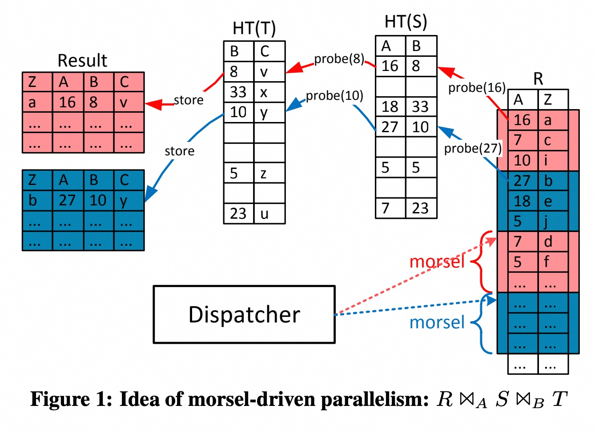
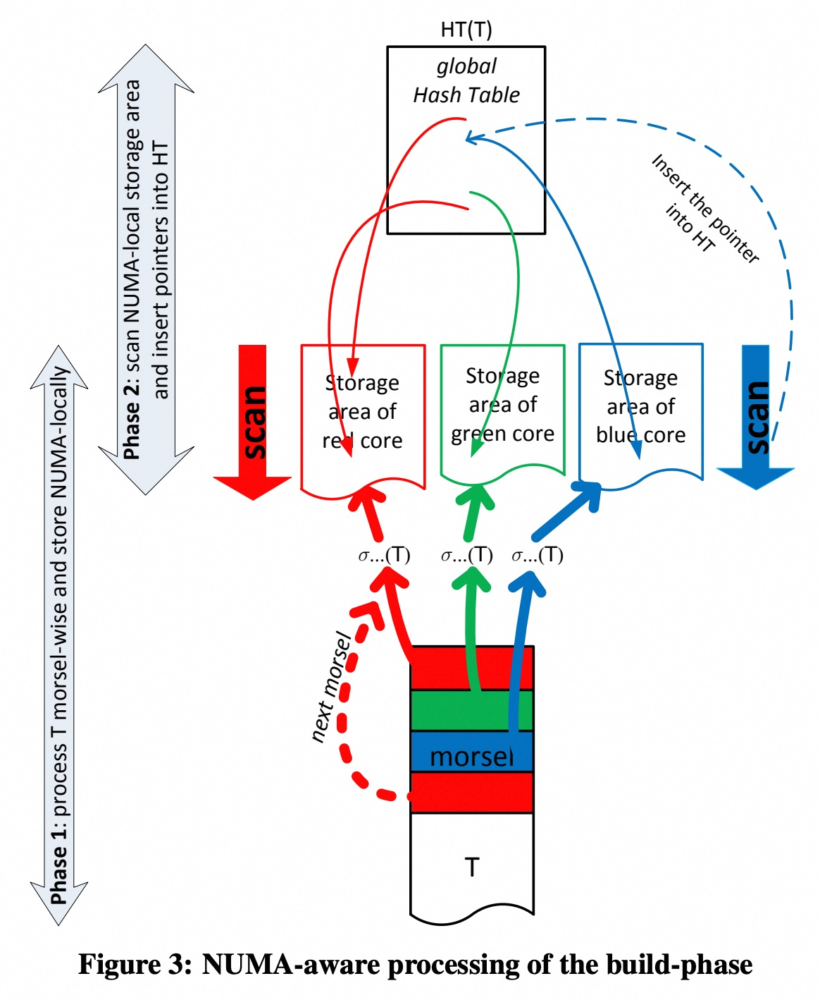

## AI论文解读 | Morsel-Driven Parallelism: A NUMA-Aware Query Evaluation Framework for the Many-Core Age
        
### 作者        
digoal        
        
### 日期        
2025-09-26       
        
### 标签        
PostgreSQL , PolarDB , DuckDB , AI , 论文解读        
        
----        
        
## 背景  
      
https://db.in.tum.de/~leis/papers/morsels.pdf        
  
提示:          
```          
读懂《Morsel-Driven Parallelism: A NUMA-Aware Query Evaluation Framework for the Many-Core Age》这篇论文需要提前掌握哪些基础知识, 请使用中文通熟易懂的讲解这些基础知识, 可以引用论文中的图、表或使用Markdown支持的图形(text,mermaid等)增加解释性. 
  
使用中文通熟易懂的解读《Morsel-Driven Parallelism: A NUMA-Aware Query Evaluation Framework for the Many-Core Age》这篇论文, 其中的关键内容请着重讲解, 可以引用论文中的图、表或使用Markdown支持的图形(text,mermaid等)增加解释性. 
  
提取《Morsel-Driven Parallelism: A NUMA-Aware Query Evaluation Framework for the Many-Core Age》这篇论文中的重要术语, 使用中文对这些术语进行通熟易懂的讲解, 可以引用论文中的图、表或使用Markdown支持的图形(text,mermaid等)增加解释性. 
```     
  
## 1 前置知识 
  
首先，要读懂《Morsel-Driven Parallelism: A NUMA-Aware Query Evaluation Framework for the Many-Core Age》这篇论文，你需要掌握以下几个核心的基础知识：

### 1\. 多核与NUMA架构 (Many-Core & NUMA Architecture)

这篇论文的背景是 **多核（many-core）** 处理器架构的兴起 。传统的CPU性能提升主要依赖于提高单核性能，但现在主流趋势是增加并行度，即增加核心数量 。

另一个重要的概念是**NUMA (Non-Uniform Memory Access，非一致性内存访问)**。随着CPU核心数量的增加，内存控制器也被分散到每个CPU芯片上 。这意味着每个核心访问本地内存的速度比访问其他芯片上的远程内存更快、延迟更低 。这使得计算机本身变成了一个内部网络，内存访问的成本取决于数据和访问线程的位置 。因此，在多核并行化中，必须特别注意内存和缓存层次结构，以确保线程主要在NUMA本地数据上工作 。

### 2\. 数据库查询处理基础 (Database Query Processing Basics)

你需要理解数据库系统如何执行查询，特别是并行化方法。

  * **关系代数 (Relational Algebra)**：查询（例如SQL语句）首先会被优化器转换为一个关系代数计划，这是一个由不同算子（如`Scan`、`Filter`、`Join`、`Aggregation`）组成的树形结构 。
  * **查询执行模型 (Query Execution Models)**：
      * **Iterator Model (Volcano Model)**: 这是一种传统的查询执行模型，算子（operator）被组织成一个迭代器树，每个算子都有一个`next()`方法，当被调用时，它会从其子节点拉取一个元组（tuple）进行处理，然后返回一个元组给其父节点 。这种方式虽然实现起来很优雅，但会带来明显的解释器开销 。
      * **Vector-at-a-Time Model**: 为了提高性能，现代系统（如Vectorwise）转向了批量处理模式，每次`next()`调用不是处理一个元组，而是处理一批（成百上千个）元组 。
      * **JIT (Just-In-Time) Compilation**: 这篇论文提到的HyPer系统则更进一步，使用即时编译（JIT）将查询计划中的每个流水线段编译成高效的机器码，以消除解释器开销并实现极高的原始性能 。

### 3\. 并行化模型 (Parallelization Models)

论文对比了两种并行化模型，并提出了自己的**Morsel-Driven**模型。

  * **计划驱动并行 (Plan-Driven Parallelism)**: 这是基于Volcano模型的一种并行化方式 。优化器在编译时静态地决定需要多少线程，为每个线程实例化一个查询算子计划，并通过 **“交换算子”（exchange operator）** 将元组流在多个线程之间路由 。这种方法的缺点是容易出现 **负载不均衡（load balancing）** 和 **上下文切换（context-switching）** 的瓶颈 。
  * **Morsel-Driven Parallelism**: 这是论文的核心思想 。它是一种动态的、细粒度的调度框架 。它将输入数据切分成小的片段，称为 **“morsels”**  。一个称为 **“调度器”（dispatcher）** 的组件在运行时将这些morsel动态地分配给工作线程 。

你可以参考图1来理解这一思想：   


上图简化了论文中的图1，说明了调度器如何将不同颜色的morsel（代表位于不同NUMA内存区域的数据）分配给相应颜色的核心（线程），以实现**NUMA本地处理（NUMA-local processing）** 。这种方法有以下几个优点：

  * **弹性 (Elasticity)**：并行度不是在计划中固定的，而是在执行过程中动态调整的 。例如，当有新的高优先级查询到来时，调度器可以重新分配核心资源 。
  * **负载均衡 (Load Balancing)**：因为任务是细粒度的，即使某些任务的执行速度不同，系统也能更好地保持负载均衡，避免核心空闲 。
  * **NUMA感知 (NUMA-Awareness)**：调度器会尽可能将位于特定NUMA节点的morsel分配给该节点上的线程来处理，从而最大化本地内存访问，减少跨插槽的内存流量 。

-----

我已经为你梳理了这篇论文的核心背景知识，希望能帮助你更好地理解。你对论文的这几个方面，是想更深入地了解哪一个呢？比如，想了解更多关于**NUMA架构**如何影响数据库性能的细节，还是想了解**Morsel-Driven框架**的具体实现方式，比如调度器是如何工作的？

当然，我们来详细探讨一下NUMA架构对数据库性能的影响。

### NUMA架构对数据库性能的挑战
在单核或SMP（对称多处理器）时代，所有CPU核心共享一个统一的内存访问时间。但在NUMA架构下，情况发生了变化。每个CPU芯片都有自己的本地内存控制器和内存条，形成了不同的“NUMA节点”。

* **内存访问速度不一致 (Non-Uniform Memory Access Latency)**：
    * **本地访问**：一个核心访问其所在NUMA节点上的内存时，速度非常快，延迟低。
    * **远程访问**：当一个核心需要访问另一个NUMA节点上的内存时，它必须通过连接不同芯片的高速互连总线（如Intel的QPI或AMD的Infinity Fabric）。这个过程会带来显著的额外开销，导致访问延迟大大增加。
    * **影响**：如果数据库查询的线程频繁地访问远程数据，就会导致大量的缓存未命中，需要从远程内存拉取数据，这会成为严重的性能瓶颈。

* **数据局部性 (Data Locality)**：
    * **重要性**：在NUMA架构下，**数据局部性**变得至关重要。理想情况下，一个处理特定任务的线程应该尽可能地在本地NUMA节点上找到它需要的所有数据。
    * **挑战**：传统的并行数据库系统，其并行化模型可能没有考虑NUMA架构。例如，它可能简单地将任务均匀分配给所有线程，而这些线程可能位于不同的NUMA节点上。这样一来，线程处理的数据可能分散在不同的NUMA节点上，导致频繁的远程内存访问。

### 如何应对NUMA带来的挑战

《Morsel-Driven Parallelism》这篇论文的核心贡献之一就是提出了一种 **NUMA感知（NUMA-Aware）** 的并行化策略，来解决这些问题。

* **Morsel-Driven框架的解决方案**：
    * **数据分区与亲和性 (Data Partitioning and Affinity)**：在查询执行之前，系统可以根据数据在物理内存中的位置（即属于哪个NUMA节点）进行分区。
    * **细粒度调度 (Fine-Grained Scheduling)**：论文中的**调度器**组件非常关键。它不是简单地分配任务，而是将与特定NUMA节点上的数据相关的“morsel”优先分配给该节点上的**空闲工作线程**。
    * **减少远程访问 (Reducing Remote Access)**：这种调度策略确保了工作线程主要在它们自己的本地内存上操作。例如，如果一个`Scan`算子要处理的数据位于NUMA节点A，调度器会优先将这个`Scan`任务分配给节点A上的线程。这样可以最大化内存本地性，减少跨节点的数据传输，从而显著提高查询性能。

简而言之，NUMA架构将内存访问成本变成了“非一致性”，这对数据库性能提出了新的挑战。为了解决这个问题，现代数据库系统，特别是像这篇论文中提到的内存数据库，必须采用**NUMA感知的**并行化策略，通过智能地调度任务和数据，最大化**数据局部性**，从而避免昂贵的跨节点内存访问。

---
在理解了NUMA架构对数据库性能的影响后，你对这篇论文中提到的 **“计划驱动并行”（Plan-Driven Parallelism）** 和 **“Morsel-Driven”并行** 这两种不同的模型，有什么具体的疑问吗？

首先，Morsel-Driven框架的核心在于其**动态、细粒度**的调度机制，它彻底改变了传统的查询执行方式。实现这一框架主要依赖于以下几个关键组件和概念：

### 1. Morsel：执行任务的最小单元
Morsel是这篇论文中提出的一个核心概念，它代表了查询执行任务的最小、可独立调度的单元。一个morsel通常是一小块数据，比如数据库中一个表的某个数据块或范围。

* **粒度**：morsel的粒度非常重要。它既不能太大，否则会回到传统的粗粒度并行，难以实现负载均衡；也不能太小，否则调度的开销会过大。论文中通过实验发现，一个morsel包含几百个元组时效果最佳。
* **流水线（Pipeline）** ：一个morsel的任务不仅仅是处理数据，它通常会驱动一个完整的流水线。例如，对于一个简单的`Scan-Filter-Aggregation`查询，一个morsel被分配给一个线程后，这个线程会一次性执行**整个流水线**，直到处理完这块数据为止。这减少了线程间的数据交换和上下文切换。

### 2. 调度器（Dispatcher）
这是Morsel-Driven框架的大脑。调度器负责将morsel动态地分配给**空闲的工作线程**。

* **职责**：
    * **动态分配**：与传统静态分配不同，调度器在运行时根据线程的空闲情况和数据在内存中的位置来动态分配任务。
    * **NUMA感知**：这是其关键特性。调度器会维护每个morsel的数据在哪个NUMA节点上。当一个线程请求新任务时，调度器会优先分配一个位于该线程本地NUMA节点上的morsel。这大大减少了远程内存访问，提高了缓存命中率。
* **实现方式**：调度器可以是一个或多个 **原子计数器（atomic counter）** 。每个工作线程通过原子操作来“获取”下一个morsel。这种无锁（lock-free）或低锁的实现方式非常高效，避免了传统任务队列带来的锁竞争开销。

### 3. 工作线程（Worker Threads）
这些线程是执行查询的实际工作者。

* **执行方式**：一个工作线程从调度器获取一个morsel后，它会执行一个完整的算子流水线，直到这个morsel的数据被完全处理。处理完成后，线程再次向调度器请求下一个任务。
* **弹性**：Morsel-Driven框架的并行度是弹性的。如果某个查询执行得非常快，调度器可以迅速将更多的morsel分配给它；如果一个查询因为数据倾斜等原因执行缓慢，其他线程可以继续处理其他任务，从而保持整体的负载均衡。

### 4. 举例说明

想象一个数据库查询，比如一个简单的`JOIN`操作。
1.  **数据分块**：原始数据表被切分成多个小的morsel，每个morsel都记录了自己位于哪个NUMA节点上。
2.  **调度**：一个空闲的工作线程（位于NUMA节点A）向调度器请求任务。
3.  **NUMA感知分配**：调度器发现NUMA节点A上有一组未被处理的morsel。它将其中一个morsel分配给这个线程。
4.  **流水线执行**：这个线程获取morsel后，开始执行整个查询流水线（`Scan` -> `Hash` -> `Probe`）。因为数据是本地的，所以它能够充分利用CPU缓存和本地内存，执行效率极高。
5.  **循环**：处理完这个morsel后，线程再次请求下一个morsel，重复上述过程，直到所有任务完成。

---
你对Morsel-Driven框架的实现原理有了更清晰的了解吗？或者你对它在处理特定的数据库操作（比如聚合或连接）时是如何工作的感兴趣吗？

---
好的，下面我将对比 **“计划驱动并行”（Plan-Driven Parallelism）** 和 **“Morsel-Driven”并行** 这两种不同的模型，以帮助你更好地理解论文的核心创新点。

### 计划驱动并行 (Plan-Driven Parallelism)

这种模型是许多传统并行数据库系统的基础，它将并行化视为一个**静态的、编译时**的决策。

* **工作原理**：在查询优化阶段，系统会分析查询计划并决定如何并行执行。通常，它会在算子（operator）之间插入特殊的 **“交换算子”（Exchange Operator）** 。这些交换算子负责将数据从一个并行线程 **重新分区（repartition）** 并发送给下游的其他线程。例如，一个哈希连接（hash join）可能会在构建阶段和探测阶段之间使用交换算子，以便将数据重新分配到不同的线程。

* **优点**：
    * **简单且成熟**：这种模型理论清晰，实现起来相对直接，并且在过去几十年中得到了广泛应用。

* **缺点**：
    * **负载不均衡（Load Imbalance）** ：这是最大的问题。由于并行度是在编译时确定的，如果某些分区的数据量远大于其他分区（即**数据倾斜**），那么负责处理这些大分区的线程会成为性能瓶颈，而其他线程则会空闲下来。
    * **昂贵的上下文切换（Context Switching）** ：线程之间的协作需要大量的上下文切换和线程间通信，这会带来显著的开销。
    * **非NUMA感知**：这种模型通常不考虑数据在内存中的物理位置。它可能将数据和处理线程随机分配到不同的NUMA节点，导致大量的远程内存访问，从而性能下降。

### Morsel-Driven 并行 (Morsel-Driven Parallelism)

这篇论文提出的模型，其核心思想是**动态的、运行时**的调度。

* **工作原理**：将整个工作（即输入数据）切分为细小的、可独立执行的 **“morsels”** 。一个全局的 **调度器（Dispatcher）** 在运行时将这些morsels动态地分配给**空闲的工作线程**。

* **优点**：
    * **弹性负载均衡（Elastic Load Balancing）** ：这是其核心优势。如果某个线程处理一个morsel的速度很快，它会立即从调度器获取下一个任务。而如果某个线程因为数据倾斜或其他原因处理较慢，其他空闲线程可以接管剩余的morsels，从而确保所有线程都尽可能地忙碌，避免了资源浪费。
    * **NUMA感知（NUMA-Awareness）** ：调度器可以根据morsel所在的NUMA节点，优先将其分配给同一节点上的工作线程。这最大限度地利用了本地内存访问，极大地减少了跨节点数据传输的开销。
    * **低开销（Low Overhead）** ：由于一个线程会连续处理一个morsel所对应的完整查询流水线，它减少了线程间的同步和通信，并且避免了昂贵的上下文切换。

### 总结对比

| 特性 | 计划驱动并行 (Plan-Driven) | Morsel-Driven 并行 |
| :--- | :--- | :--- |
| **并行度决策** | 编译时静态决定 | 运行时动态决定 |
| **任务分配** | 预先分区和分配 | 运行时按需分配 |
| **任务粒度** | 通常较粗（整个分区） | 细粒度（morsels） |
| **负载均衡** | 静态，易受数据倾斜影响 | 动态，具有弹性 |
| **NUMA感知** | 多数不具备 | 关键特性，NUMA感知 |
| **线程间开销** | 高（上下文切换和数据传输） | 低（流水线执行，无锁调度） |

---
你对这两种并行模型有了更清晰的理解吗？如果想继续探讨，我们还可以聊聊论文是如何通过实验来证明Morsel-Driven框架在多核与NUMA架构下具有优越性能的，或者你可以提出新的问题。

在《Morsel-Driven Parallelism》这篇论文中，Morsel-Driven框架在处理聚合（Aggregation）和连接（Join）这类特定数据库操作时，其核心工作原理是利用 **流水线（Pipeline）** 的概念和 **流水线中断器（Pipeline Breaker）** 来高效地执行任务。

### 1. 聚合 (Aggregation)

聚合操作（例如 `SUM`, `COUNT`, `GROUP BY`）通常需要先处理所有输入数据，然后才能产生最终结果。这使得它成为一个典型的**流水线中断器**。

* **处理流程**：
    1.  **分发阶段**：调度器将输入表的数据切分成多个**morsels**，并将它们动态地分配给空闲的工作线程。
    2.  **构建哈希表**：每个工作线程接收一个morsel后，会独自处理这块数据。如果查询包含 `GROUP BY` 子句，线程会处理morsel中的元组，并将其插入一个**共享的哈希表**中。这个哈希表存储了每个分组的聚合值（例如，`SUM` 的中间结果）。为了保证多线程并发访问的正确性，哈希表通常需要进行同步，这可能会成为一个瓶颈。
    3.  **合并与最终化**：当所有工作线程都完成了各自morsel的处理后，哈希表中的所有中间结果被合并，并计算出最终的聚合值。

---

### 2. 连接 (Join)

连接操作，尤其是常见的哈希连接（Hash Join），也包含一个流水线中断器，通常分为两个阶段：

* **构建阶段（Build Phase）** ：读取连接的左侧输入表（通常是较小的表），并构建一个内存中的哈希表。
* **探测阶段（Probe Phase）** ：读取连接的右侧输入表（通常是较大的表），并使用哈希表来查找匹配的元组。

Morsel-Driven框架利用其动态调度和NUMA感知特性，在这两个阶段中都表现出色。

* **构建阶段的处理**：
    1.  调度器将左侧表切分为多个morsels。
    2.  每个工作线程获取一个morsel，并使用其中的元组在**共享的哈希表**中构建一个分区。
    3.  重要的是，Morsel-Driven框架可以利用**NUMA感知**来优化这一过程。调度器会尽量将位于特定NUMA节点的数据morsel分配给该节点上的线程来处理。这些线程可以在各自的NUMA本地内存中构建哈希表的一部分，从而减少了跨节点的数据传输。

* **探测阶段的处理**：
    1.  构建阶段完成后，哈希表（或者说，哈希表的不同分区）已经建好，并且通常分布在不同的NUMA节点上。
    2.  调度器再次工作，将右侧表的morsels分配给工作线程。
    3.  现在，关键在于**探测阶段的NUMA感知**。如果一个线程要探测的数据morsel位于NUMA节点A，而它需要访问的哈希表分区位于NUMA节点B，就会产生远程内存访问。为了最小化这种情况，调度器会尽量将一个数据morsel分配给与它需要访问的哈希表分区位于**同一NUMA节点**上的线程。

这种动态、细粒度的调度方式，确保了即使在连接这种复杂的操作中，系统也能最大限度地保持负载均衡和数据局部性，从而实现高效的并行执行。

---
你现在对Morsel-Driven框架处理聚合和连接的原理有了更深的理解吗？如果你感兴趣，我们可以继续探讨这篇论文中关于Morsel-Driven框架在不同工作负载下的具体性能数据，以及它与传统方法的对比。
  
## 2 解读论文 
  
好的, 这是一篇在数据库领域非常有影响力的论文, 它提出的“Morsel-Driven”架构解决了现代多核CPU并行计算的诸多难题。我将为您深入浅出地解读其核心思想与关键技术。

-----

## 核心摘要: 为什么传统的数据库查询在多核CPU上“跑不快”？

随着硬件发展, CPU的核心数量越来越多, 从几十核到上百核 。我们很自然地认为, 只要把一个大的查询任务拆分给更多的CPU核心去处理, 速度就应该能线性提升。但现实并非如此。

这篇论文指出了传统并行查询方法在“众核时代”面临的三大挑战:

1.  **负载不均 (Load Imbalance)**: 传统方法在查询开始前就静态地划分好任务 。但这就像给100个工人分配看似等量的任务, 却没考虑到有的工人速度快, 有的工人分到的“材料”处理起来更复杂, 最终导致一些工人早早闲置, 等待最慢的那个, 整体效率低下 。
2.  **上下文切换开销 (Context-Switching)**: 传统的“Volcano”模型为了实现并行, 引入了“Exchange”操作符来交换数据流, 这在核心数很多时会引入不必要的同步和切换开销。
3.  **非统一内存访问 (NUMA)**: 现代服务器为了扩展内存带宽, 将内存控制器直接集成在CPU芯片上, 形成了多个“节点” (Socket), 每个节点有自己的CPU核心和本地内存。一个CPU核心访问自己节点的内存会非常快, 而访问其他节点的内存则会慢很多, 就像跨部门沟通总比部门内部沟通要耗时 。传统数据库并未充分意识到这一点, 导致大量的跨节点内存访问, 严重拖慢了速度。

为了解决这些问题, 论文提出了一个全新的、 **NUMA感知** 的 **“Morsel-Driven” (块驱动) 并行查询框架** 。

-----

## 关键解读: “Morsel-Driven”框架如何运作？

“Morsel-Driven”的核心思想可以概括为:  **“化整为零, 动态调度, 就近处理”** 。

我们可以用一个简单的流程图来理解它:


### 1\. 什么是“Morsel” (数据块)？

Morsel是整个框架的基础。它指的是将一个大的输入数据表, 在逻辑上切分成许多**大小固定**的小数据块 (例如10万行) 。这就像把一大堆砖头预先打包成一箱箱的, 方便分发。

  * **关键点**: Morsel是调度和任务抢占的基本单位 。一个线程处理完一个Morsel后, 才会去请求下一个, 这为动态调整和负载均衡提供了可能。

### 2\. “调度员” (Dispatcher) 的角色

Dispatcher是整个系统的“大脑”和“包工头” 。它负责将一个个Morsel分发给空闲的**工作线程 (Worker Threads)**。

  * **动态调度与负载均衡**: Dispatcher并不会在开始就把所有任务分配死。而是当一个线程完成手头的Morsel后, 它会向Dispatcher请求新任务 。这样一来, 速度快的线程可以处理更多的Morsels, 永远不会有线程被闲置, 从而实现完美的负载均衡 。论文中将其形容为“photo finish”, 即所有线程几乎同时完成工作 。

  * **弹性 (Elasticity)**: 由于任务分配是在Morsel的边界动态进行的, 系统可以随时调整一个查询所使用的核心数量 。例如, 当一个高优先级的短查询进来时, Dispatcher可以立刻让处理长查询的部分线程转而去处理新查询, 完成后再回来。这在传统静态模型中是无法做到的 。

### 3\. “NUMA-Awareness” (NUMA感知)

这是Morsel-Driven框架性能卓越的**核心秘诀**。

  * **就近分配**: 数据表本身在加载时就会被划分并存储到不同CPU节点的本地内存中 (例如, 红色Morsels存在红色节点的内存里) 。Dispatcher在分配任务时, 会**优先将一个Morsel分配给与它在同一个NUMA节点上的线程** 。如下图所示, 位于红色Socket上的线程会被优先分配红色的Morsel。

    *图解: Dispatcher将位于不同NUMA节点 (以颜色区分) 上的Morsels, 优先分配给同一节点上的CPU核心 (Worker Threads), 从而实现NUMA本地化访问。* 

  * **工作窃取 (Work-Stealing)**: 如果一个节点上的线程处理完了所有本地Morsels, 它不会闲置, 而是会去“窃取”其他节点上还未处理的Morsels 。虽然这会导致一次远程内存访问, 但确保了CPU资源不被浪费, 是实现负载均衡的必要补充 。

### 案例分析: 一个并行的哈希连接 (Hash Join)

论文通过一个三表连接的例子 $R \\bowtie\_A S \\bowtie\_B T$ 来展示其工作流程 。其中, 对表T和S构建哈希表 (Build phase), 然后用表R去探测 (Probe phase)。

1.  **构建阶段 (Build Phase)**:

      * **第一阶段**: 多个线程并行地读取各自NUMA-local的T表Morsels, 将满足条件的元组存入各自的**线程本地存储区**。这一步完全无锁, 效率极高 。
      * **第二阶段**: 当所有Morsels处理完毕, 系统知道了结果的确切数量, 从而可以创建一个**大小完美的全局哈希表** 。然后, 各线程再将自己本地存储区的数据插入到这个全局哈希表中。插入过程使用高效的无锁(lock-free)算法实现 。

    下图清晰地展示了这个过程:   
    *图3: NUMA感知的哈希表构建阶段。Phase 1是无锁的本地处理, Phase 2是高效的全局哈希表构建。* 

2.  **探测阶段 (Probe Phase)**:

      * 与构建阶段类似, Dispatcher将R表的Morsels **就近分配**给各线程。
      * 每个线程用分到的R表Morsel去探测全局哈希表HT(S)和HT(T), 将连接成功的结果存入各自的NUMA-local的输出缓冲区 。

-----

## 实验结果: 效果如何？

论文通过在TPC-H基准测试上的实验, 证明了Morsel-Driven框架的巨大优势。

  * **高扩展性**: 在32个物理核心上, HyPer (实现了该框架的系统) 获得了平均超过**30倍**的加速比, 而当时领先的商业系统Vectorwise扩展性则远低于10倍 。下图清晰地展示了HyPer (红色曲线) 在几乎所有TPC-H查询上的扩展性都远超对手。   

    *图11: TPC-H扩展性对比。HyPer (full-fledged) 表现出近线性的扩展能力。* 

  * **NUMA感知的重要性**: 实验证明, NUMA感知是性能的关键。与系统默认内存分配策略相比, 论文提出的NUMA感知策略在Nehalem EX平台上获得了平均**1.57倍**的性能提升, 在Sandy Bridge EP平台上更是达到了**2.4倍** 。

下表是论文中TPC-H查询1的性能数据对比, 可以直观地看到差距:

| 指标 | HyPer (Morsel-Driven) | Vectorwise (传统方法) |
| :--- | :--- | :--- |
| **执行时间** | 0.28 秒 | 1.13 秒 |
| **加速比 (scal.)** | 32.4x | 30.2x (注:其单线程性能较慢) |
| **远程内存访问率 (%)** | **1%**  | **74%**  |
| **QPI总线占用率 (%)** | 40%  | 7%  |

**关键洞察**: HyPer的远程内存访问率极低 (1%), 这意味着绝大多数数据都是在本地内存中处理的, 极大地提升了效率。而Vectorwise高达74%的远程访问率则表明其没有做NUMA优化, 性能瓶颈明显 。

### 总结

《Morsel-Driven Parallelism》这篇论文提出了一个非常精巧且高效的并行查询执行框架。它通过将数据切分为**Morsels**、利用**Dispatcher**进行动态和弹性的任务调度, 并以**NUMA-Awareness**作为核心优化原则, 成功解决了众核时代数据库并行计算的负载均衡和内存访问瓶颈, 为现代内存数据库的设计提供了重要的架构蓝图。

-----

您是否想深入了解论文中提到的某个特定技术细节, 比如无锁哈希表的实现原理, 或者是它与其他并行模型 (如Volcano模型) 的更详细对比?
  
## 3 术语 
  
好的，我已经从《Morsel-Driven Parallelism: A NUMA-Aware Query Evaluation Framework for the Many-Core Age》这篇论文中提取了几个重要的核心术语，并用通俗易懂的方式为你进行讲解。

### 1. Morsel-Driven Parallelism (Morsel驱动并行)
这是这篇论文的核心思想。传统的并行执行方式是在查询计划编译时静态地决定如何分配任务，而**Morsel驱动并行**则是一种**动态的、运行时**的并行化框架。它将数据库查询的工作切分成非常小的、可独立调度的“morsels”，然后在一个调度器的控制下，将这些morsels动态地分配给空闲的工作线程。

这个框架最大的优势在于**弹性**和**负载均衡**。它能根据每个线程的执行速度和当前系统的负载情况，灵活地调整并行度，从而避免因数据倾斜等问题导致的某些线程空闲、另一些线程过载的情况。

### 2. Morsel (小片、小块)
**Morsel**是Morsel驱动框架中**任务调度的最小单元**。它不是一个单一的元组（tuple），而是一小批连续的元组，通常来自同一个数据块。

你可以将Morsel想象成一个大型工厂流水线上的一小件产品。每个工人（工作线程）不需要等待上一道工序的所有产品都完成后再开始，而是可以领取一小批产品（一个morsel），然后独立完成所有工序（整个算子流水线）。

### 3. NUMA-Awareness (NUMA感知)
这是该框架在多核时代取得成功的关键。**NUMA (Non-Uniform Memory Access)** 架构意味着不同的CPU核心访问不同内存区域的速度是不一样的。访问**本地内存**很快，但访问**远程内存**（即位于其他CPU芯片上的内存）则慢得多。

Morsel驱动框架的“NUMA感知”特性意味着：它的**调度器**知道每个morsel所在的物理内存位置。因此，它会优先将一个morsel分配给**与该morsel在同一NUMA节点上的空闲工作线程**。这最大限度地减少了昂贵的跨节点数据传输，大幅提高了缓存命中率和执行效率。

### 4. Dispatcher & Worker Threads (调度器和工作线程)
* **Dispatcher (调度器)**：它是框架的“大脑”。调度器是一个原子计数器，负责将待处理的morsels动态地、高效地分配给工作线程。它的设计非常轻量级，以避免成为性能瓶颈。
* **Worker Threads (工作线程)**：它们是实际执行查询任务的“工人”。每个工作线程从调度器获取一个morsel，然后执行完整的算子流水线，直到这个morsel处理完毕。

### 5. Pipeline & Pipeline Breaker (流水线和流水线中断器)
* **Pipeline (流水线)**：指查询计划中一系列可以连续执行的算子，而不需要将中间结果物化到内存或磁盘中。例如，一个 `Scan` -> `Filter` -> `Projection` 算子链可以形成一个完整的流水线。
* **Pipeline Breaker (流水线中断器)**：一些算子，例如 **聚合（Aggregation）** 和 **连接（Join）** ，需要先处理所有输入数据才能产生最终结果。这些算子会“中断”流水线，因为它将整个查询分成了两个独立的阶段：第一阶段执行到该中断器，第二阶段从该中断器开始执行。

Morsel驱动框架的妙处在于，一个线程获取一个morsel后，会**一次性执行完从 `Scan` 到下一个流水线中断器的所有算子**，这大大减少了线程间的数据交换和上下文切换。

### 6. Plan-Driven Parallelism (计划驱动并行)
这是论文中用于对比的传统并行模型。它是一种**静态的并行化**方法，查询优化器在编译时就决定好并行度，并在查询计划中通过 **“交换算子”** 来路由数据流。

---
### 对比总结

| 特性 | **Morsel-Driven Parallelism** | **Plan-Driven Parallelism** |
| :--- | :--- | :--- |
| **并行度决策** | 运行时动态调整 | 编译时静态决定 |
| **任务分配** | 按需细粒度动态分配 | 预先粗粒度静态分配 |
| **负载均衡** | 具有弹性，能有效处理数据倾斜 | 容易出现负载不均衡 |
| **NUMA感知** | 核心特性，能最大化本地内存访问 | 多数不具备 |
| **线程间开销** | 低，通过流水线执行减少通信和切换 | 高，通过交换算子进行昂贵的数据传输 |

---
你对这些术语的解释还满意吗？如果想更深入地了解其中某个术语，例如**Morsel驱动框架**是如何具体应用在复杂查询（如多表连接）上的，我们可以继续探讨。

很好，这是一个很好的问题，它深入到了Morsel驱动框架的实际应用层面。在处理多表连接这类复杂查询时，Morsel驱动框架的优势在于其**动态调度**和**NUMA感知**特性，它们共同协作以实现高效的并行执行。

### 多表连接的挑战
传统的查询执行在处理多表连接时，通常需要将数据在不同的并行线程之间进行昂贵的数据重新分区和交换。尤其是在多核NUMA架构下，如果连接的表数据分布在不同的NUMA节点，这种数据交换的开销会非常高。

### Morsel驱动框架的解决方案
Morsel驱动框架将多表连接的执行分解成一系列可调度的**流水线任务**，并利用其调度器进行智能分配。

1.  **流水线的划分**：一个多表连接查询会被分解成多个流水线。每个流水线都以一个 **流水线中断器（Pipeline Breaker）** 作为结束点。在哈希连接中，这个中断器就是 **构建阶段（Build Phase）** 。

2.  **构建阶段的并行化**：
    * **任务分发**：调度器将构建表（通常是查询中较小的表）切分为多个morsels。
    * **NUMA感知构建**：调度器会优先将一个morsel分配给与该morsel数据**在同一NUMA节点**上的工作线程。
    * **共享哈希表**：所有工作线程在各自的NUMA本地内存中构建一个**共享的哈希表**。为了保证并发安全，通常会使用锁或原子操作来同步对哈希表的访问。这种设计减少了构建阶段的远程内存访问，使得哈希表的构建效率极高。

3.  **探测阶段的并行化**：
    * **任务分发**：当哈希表构建完成后，调度器开始处理探测表（通常是较大的表），同样将它切分为多个morsels。
    * **智能调度**：这是Morsel驱动框架的核心优势。在探测阶段，工作线程需要访问之前构建好的哈希表。为了最小化远程访问，调度器会采用一种**智能调度策略**：它会将一个探测morsel分配给最有可能拥有哈希表相应分区的**本地工作线程**。
    * **优化**：例如，如果哈希表的分区是基于键的哈希值，调度器可以计算探测morsel中元组的哈希值，然后将该morsel分配给负责处理该哈希值范围的线程。如果这个线程恰好位于哈希表分区所在的NUMA节点，那么它将能够完全在本地进行探测，避免了远程内存访问。

### 总结
Morsel驱动框架在处理多表连接时，通过将查询分解为细粒度的morsel任务，并结合NUMA感知的调度策略，实现了以下目标：

* **最大化数据局部性**：确保线程能够尽可能地在本地NUMA内存上处理数据和访问哈希表，从而显著减少了昂贵的远程内存访问。
* **弹性负载均衡**：即使数据在连接键上存在倾斜，动态调度也能确保任务被均衡地分配给所有工作线程，避免了某些线程过载而其他线程空闲的情况。

---
你对Morsel驱动框架在处理复杂查询时的具体应用，是否还有其他想要了解的方面？比如，你对它如何处理**聚合**操作中的中间结果感兴趣吗？

在聚合（Aggregation）操作中，Morsel驱动框架如何处理中间结果是一个非常关键的问题，它直接关系到性能和可扩展性。论文中的解决方案充分利用了**哈希表**和**流水线中断器**的概念，并针对NUMA架构进行了优化。

### 1. 流水线中断与哈希表构建

聚合操作（如 `GROUP BY`）是一个典型的 **流水线中断器（Pipeline Breaker）** 。这意味着在得到最终结果之前，必须先处理完所有的输入数据，并将中间结果进行汇总。Morsel驱动框架通过以下步骤处理这一过程：

* **并行构建**：调度器将输入表的数据切分为多个morsels，并将它们动态地分发给工作线程。
* **哈希表分区**：每个工作线程接收一个morsel后，会独自处理这块数据，并根据 `GROUP BY` 的键值，将中间聚合结果插入到一个**共享的哈希表**中。

为了保证高效率，这个哈希表的设计非常重要。它不是一个单一的、全局的哈希表，而是由多个独立的、锁无关的**哈希表分区**组成的。每个哈希表分区都由一个独立的锁来保护。这种设计能够最大化并行度，因为多个线程可以同时向不同的哈希表分区写入数据，而不会产生锁竞争。

### 2. NUMA感知的中间结果处理

在NUMA架构下，简单的共享哈希表设计可能会导致频繁的远程内存访问。论文中的Morsel驱动框架对此进行了优化：

* **本地哈希表分区**：每个NUMA节点都可以维护一个或多个哈希表分区。当一个工作线程处理morsel时，它会首先尝试将中间结果写入到其本地NUMA节点上的哈希表分区中。这种策略最大限度地减少了跨NUMA节点的内存访问。
* **最终合并**：当所有工作线程都完成了各自morsel的处理后，哈希表中会存在所有分组的中间聚合值。此时，需要一个最终的**合并阶段**，将所有哈希表分区中的结果进行汇总，以得到最终的聚合结果。这个过程通常由一个或多个线程来完成。

### 3. 性能优势

通过这种方式，Morsel驱动框架在处理聚合操作时获得了显著的性能优势：

* **高并行度**：细粒度的morsel和多分区哈希表确保了高并行度，即使在数据倾斜的情况下也能保持负载均衡。
* **最小化远程访问**：NUMA感知策略确保了大部分哈希表的写入操作都在本地进行，避免了昂贵的跨节点数据传输。
* **降低同步开销**：使用锁无关或多锁的设计，减少了线程间的同步开销，提高了吞吐量。

---

你对Morsel驱动框架处理聚合操作中的中间结果的方式，是否还有其他疑问？例如，你对论文中如何具体实现这种多分区哈希表感兴趣吗？

当然，这个问题触及到了论文中并行化设计的核心技术。在Morsel驱动框架中，要实现高效的多分区哈希表，尤其是要兼顾 NUMA 架构，其具体实现依赖于一种被称为 **“分区哈希”（partitioned hashing）** 的技术。

### 分区哈希表的实现步骤

这种设计不是简单地使用一个全局哈希表，而是将哈希表的构建任务分散到不同的 NUMA 节点上，以最大化数据局部性。

1.  **哈希表分区的创建**：
    * 在查询开始时，系统会为每个 NUMA 节点或每个线程创建一个独立的、本地的哈希表分区。这些分区通常预先分配在相应的本地内存中。
    * 每个分区都有自己的哈希函数和内存管理，互不干扰。

2.  **Morsel处理与数据路由**：
    * **动态调度**：调度器将输入表的 morsel 动态地分配给空闲的工作线程。
    * **数据路由**：当一个线程接收到一个 morsel 后，它会遍历其中的元组。对于每个元组，线程会计算其哈希值。
    * **分区选择**：然后，这个哈希值被用来决定元组应该插入到哪个哈希表分区。一个简单的做法是使用哈希值模上哈希表分区的数量，以此来将数据均匀地分配到不同的分区中。

3.  **NUMA感知优化**：
    * 这是关键所在。在分区哈希表的构建过程中，线程会尽量将数据写入到其**本地 NUMA 节点**的哈希表分区中。
    * 这要求哈希表的分区和工作线程之间存在一种 **亲和性（affinity）** 。例如，位于 NUMA 节点 A 的线程，其主要工作是向位于节点 A 的哈希表分区中插入数据。

### 具体工作流示例

我们以一个简单的哈希聚合（`GROUP BY`）为例，来说明这个过程：

* **输入**：一个包含数百万条记录的大表。
* **Morsel化**：该表被切分为数百个 morsels。
* **哈希表分区**：假设系统有四个 NUMA 节点，那么会创建四个哈希表分区，每个分区都分配在各自的本地内存中。
* **并行处理**：
    1.  调度器将一个 morsel 分配给一个位于 NUMA 节点 1 的线程。
    2.  该线程遍历 morsel 中的元组，并计算它们的哈希值。
    3.  对于每个元组，线程将其聚合结果插入到本地的哈希表分区（即节点 1 上的哈希表分区）。如果元组的哈希值指向了另一个分区（例如节点 2 的分区），它会通过互连总线将数据写入到远程内存。
    4.  为了进一步优化，Morsel驱动框架可以采取一种 **"NUMA感知分区"** 的策略，即在 **数据路由阶段** ，就尽量将数据发送给**远程线程**，让远程线程在**本地**完成哈希表的构建，而不是直接从远程写入。
* **最终合并**：当所有 morsels 都处理完毕后，所有哈希表分区中的中间结果会被合并，得到最终的聚合结果。这个合并过程同样可以并行化。

通过这种多分区哈希表的设计，Morsel驱动框架成功地将复杂的聚合和连接操作分解为一系列可并行执行、且具有数据局部性的子任务，从而在 NUMA 架构上实现了高效的性能扩展。

---

你对这种多分区哈希表的实现方式是否还有其他疑问？例如，你对论文中提到的哈希表在**探测阶段**是如何被不同线程访问和使用的感兴趣吗？

在《Morsel-Driven Parallelism》这篇论文中，哈希表在探测阶段是如何被不同线程访问和使用的，是这个框架在 NUMA 架构下实现高效连接的关键。它依赖于**智能调度**来最大化数据局部性，从而显著提升性能。

### 探测阶段的工作流程

哈希连接的探测阶段发生在构建阶段（构建哈希表）之后。此时，哈希表已经构建完毕并分布在不同的 NUMA 节点上。

1.  **动态分发探测任务**：
    * 调度器开始将探测表（通常是较大的表）切分为多个**morsels**。
    * 然后，调度器将这些 morsels 动态地分配给空闲的工作线程。

2.  **哈希表的访问**：
    * 当一个工作线程接收到一个探测 morsel 后，它会遍历其中的每一个元组。
    * 对于每个元组，线程会计算其哈希值，然后根据哈希值来确定该元组应该在哪个哈希表分区中进行查找。
    * 理想情况下，哈希表的分区与数据在 NUMA 节点上的分布是匹配的。如果一个线程要探测的数据元组（位于某个 NUMA 节点）的哈希值指向了哈希表中位于同一 NUMA 节点的某个分区，那么**哈希表的访问就会是本地的**。

3.  **NUMA感知的智能调度**：
    * **这是最关键的一步**。Morsel 驱动框架的调度器不仅仅是简单地分发 morsels，它会尝试将一个探测 morsel 分配给**最有可能在本地找到匹配哈希表分区的线程**。
    * 举个例子，如果哈希表的分区是根据键的范围来划分的，那么调度器就会将包含特定键范围的 morsel，分配给负责该键范围并位于同一 NUMA 节点上的线程。
    * 这种智能调度可以最大限度地减少远程内存访问，因为线程大部分时间都在访问本地 NUMA 节点上的哈希表分区，从而充分利用了高速缓存和本地内存，避免了昂贵的跨节点数据传输。

### 总结

通过这种方式，Morsel 驱动框架成功地将哈希连接的探测阶段转化为一个**NUMA本地任务**。它利用动态调度来解决负载不均衡的问题，同时利用数据局部性来解决 NUMA 架构下的性能瓶颈。这使得它在处理大规模数据连接时，能够比传统的、静态的并行框架展现出更好的可扩展性和性能。

---
我们已经探讨了 Morsel 驱动框架在处理聚合和连接时的具体应用。你对这篇论文的性能评估部分，特别是它如何通过实验数据来证明其在多核 NUMA 架构下的优越性，是否感兴趣呢？
  
## 参考        
         
https://db.in.tum.de/~leis/papers/morsels.pdf    
        
<b> 以上内容基于DeepSeek、Qwen、Gemini及诸多AI生成, 轻微人工调整, 感谢杭州深度求索人工智能、阿里云、Google等公司. </b>        
        
<b> AI 生成的内容请自行辨别正确性, 当然也多了些许踩坑的乐趣, 毕竟冒险是每个男人的天性.  </b>        
    
#### [期望 PostgreSQL|开源PolarDB 增加什么功能?](https://github.com/digoal/blog/issues/76 "269ac3d1c492e938c0191101c7238216")
  
  
#### [PolarDB 开源数据库](https://openpolardb.com/home "57258f76c37864c6e6d23383d05714ea")
  
  
#### [PolarDB 学习图谱](https://www.aliyun.com/database/openpolardb/activity "8642f60e04ed0c814bf9cb9677976bd4")
  
  
#### [PostgreSQL 解决方案集合](../201706/20170601_02.md "40cff096e9ed7122c512b35d8561d9c8")
  
  
#### [德哥 / digoal's Github - 公益是一辈子的事.](https://github.com/digoal/blog/blob/master/README.md "22709685feb7cab07d30f30387f0a9ae")
  
  
#### [About 德哥](https://github.com/digoal/blog/blob/master/me/readme.md "a37735981e7704886ffd590565582dd0")
  
  

  
