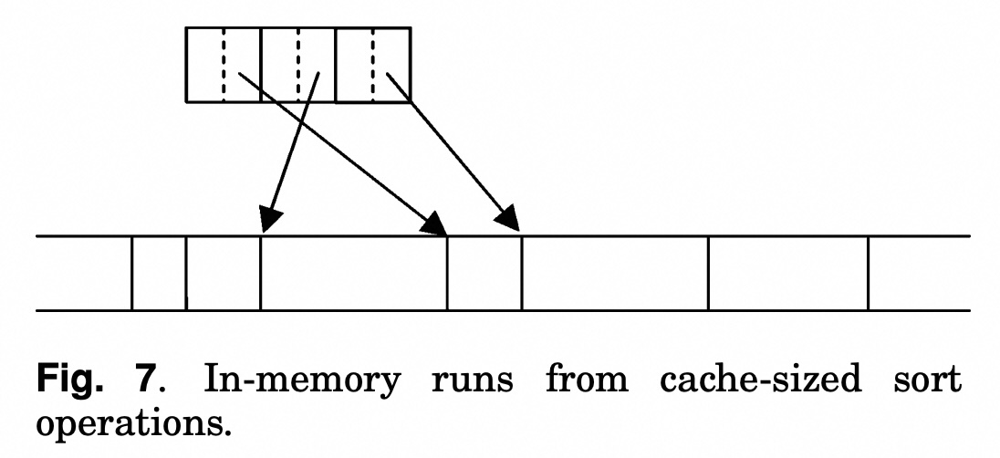

## AI论文解读 | Implementing Sorting in Database Systems
        
### 作者        
digoal        
        
### 日期        
2025-09-26       
        
### 标签        
PostgreSQL , PolarDB , DuckDB , AI , 论文解读        
        
----        
        
## 背景  
      
https://dl.acm.org/doi/pdf/10.1145/1132960.1132964        
  
提示:          
```          
读懂《Implementing Sorting in Database Systems》这篇论文需要提前掌握哪些基础知识, 请使用中文通熟易懂的讲解这些基础知识, 可以引用论文中的图、表或使用Markdown支持的图形(text,mermaid等)增加解释性. 
  
使用中文通熟易懂的解读《Implementing Sorting in Database Systems》这篇论文, 其中的关键内容请着重讲解, 可以引用论文中的图、表或使用Markdown支持的图形(text,mermaid等)增加解释性. 
  
提取《Implementing Sorting in Database Systems》这篇论文中的重要术语, 使用中文对这些术语进行通熟易懂的讲解, 可以引用论文中的图、表或使用Markdown支持的图形(text,mermaid等)增加解释性. 
```     
  
## 1 前置知识 
  
要理解《Implementing Sorting in Database Systems》这篇论文，您需要掌握以下几个核心基础知识。这篇论文没有介绍基础算法本身，而主要聚焦于如何优化这些算法以适应现代计算机架构和数据库系统的复杂需求。

---
### 内存排序基础 (In-Memory Sorting Fundamentals)

论文假设读者已熟悉快速排序（Quicksort）和外部归并排序（External Merge-sort）等基础内存排序算法 。在此基础上，论文深入探讨了如何通过“巧妙的技巧”来提高排序性能。

* **键归一化 (Key Normalization)**
    这篇论文的核心思想之一是**键归一化** 。它指的是将一条记录中用于排序的多个不同类型字段（如整数、字符串、日期等）转换成一个简单的、可直接按位比较的二进制字符串。这样做的好处是，复杂的字段比较（例如处理国际化字符串或不同数据类型）可以简化为单一的二进制字符串比较，从而大大提高效率 。 

    **图例说明（参考论文图1）** 
    论文中的图1展示了一个例子：    
    * **原始数据**：一个包含“整数列”和“字符串列”的记录。
    * **归一化过程**：
        1.  在每个字段的归一化结果前添加一个比特位，用于标识该字段是否为NULL 。
        2.  将整数（如2、3、1024）转换为其二进制表示，并进行位反转或符号位处理，以确保其排序顺序正确 。
        3.  将字符串转换为支持国际化排序规则的二进制字符串 。
        4.  将所有归一化后的字段拼接在一起，形成一个完整的“归一化键” 。
    * **结果**：一个单一的二进制字符串，其按位比较结果与原始记录的排序结果完全一致，从而避免了复杂的多字段比较逻辑 。

* **保序压缩 (Order-Preserving Compression)**
    为了进一步节省空间和带宽，归一化后的键还可以进行压缩 。论文讨论了两种保序压缩技术：
    1.  **保序霍夫曼编码 (Order-Preserving Huffman Coding)**：这是一种压缩技术，它在进行压缩的同时保证数据的排序顺序不被改变 。
    2.  **偏移值编码 (Offset-Value Coding)**：这是一种在归并排序中特别有效的压缩方法，它通过记录与前一个记录共享的公共前缀长度来减少存储空间，并且仅在必要时进行完整的字符串比较 。

---
### 外部排序基础 (External Sorting Fundamentals)

当数据量大到无法一次性载入内存时，就需要使用外部排序。论文在外部归并排序的基础上，提出了多种优化方法。

* **优雅降级 (Graceful Degradation)**
    这是一个重要的概念，尤其适用于数据量“几乎”可以完全放入内存的情况。传统的外部排序可能会将整个数据集溢出到磁盘，而**优雅降级**策略则仅将超出内存容量的少量数据溢出到磁盘，从而显著减少磁盘I/O操作，提高性能 。

* **I/O优化和条带化 (I/O Optimization and Striping)**
    为了最大化I/O吞吐量，论文建议使用非常大的I/O单元，并利用 **条带化（striping）** 技术将数据分散写入多个磁盘，以实现并行读写 。这有助于平衡不同磁盘的负载，并充分利用现代存储硬件的性能。

---
### 数据库系统中的排序应用 (Sorting Applications in Database Systems)

论文的第三部分将排序技术置于数据库系统的背景下进行讨论。

* **查询处理和索引维护 (Query Processing and Index Maintenance)**
    排序不仅仅用于 `ORDER BY` 语句。在数据库内部，它被广泛用于各种操作，例如：
    * 去除重复项 (`DISTINCT`) 
    * 分组 (`GROUP BY`) 
    * 合并连接 (`MERGE-JOIN`) 
    * 创建和维护B树（B-tree）索引 

* **嵌套迭代和资源管理 (Nested Iteration and Resource Management)**
    在复杂的查询计划中，排序可以优化**嵌套迭代**（类似嵌套循环连接）的性能 。通过对外部表的记录进行排序，可以提高数据访问的局部性，使得对内部表或索引的访问更加高效，甚至可以利用缓存来避免重复计算 。

总的来说，要读懂这篇论文，您需要在掌握基本排序算法的基础上，重点理解**键归一化、保序压缩、优雅降级以及排序在数据库查询处理中的多种应用**等概念。

---
为了进一步帮助您理解，您想让我详细解释一下文中的 **键归一化（Key Normalization）** 是如何工作的吗？

键归一化（Key Normalization），或者论文中提到的“键转换”（key conditioning），是一种将多字段、多类型的数据记录转换为一个单一的、可以直接进行字节比较（byte-by-byte comparison）的二进制字符串的技术。它的核心思想是**将复杂的比较逻辑从排序算法中剥离出来**。

-----

### 键归一化的工作原理

想象一下，你有一张表，其中包含一个整数列、一个日期列和一个字符串列，你需要根据这三个字段的组合来对数据进行排序。如果没有键归一化，排序算法在比较两条记录时，需要执行以下复杂的逻辑：

1.  比较第一个整数列：如果不同，则得出排序结果。
2.  如果整数列相同，则比较第二个日期列。
3.  如果日期列也相同，则比较第三个字符串列，这可能涉及到复杂的国际化字符集排序规则。

这种逐个字段比较的方式会增加排序算法的复杂性和计算开销。

键归一化通过以下步骤将这个复杂过程简化：

1.  **逐个字段转换**：针对记录中的每个排序字段（如整数、日期、字符串），将其转换为一个特殊的二进制表示。这种转换必须是**保序的**，也就是说，转换后的二进制值的大小关系与原始值的大小关系保持一致。

      * **整数**：正整数可以直接转换为二进制。负整数需要进行特殊处理，例如，通过翻转其所有位（bits），使得负数的二进制表示在正数之前，并且其相对顺序正确。
      * **日期/时间戳**：可以转换为自某个基准日期以来的秒数或毫秒数的整数，然后按整数方式处理。
      * **字符串**：可以根据国际化排序规则（Collation）转换为二进制字符串。例如，在中文排序中，可能需要将汉字转换为其拼音或笔画顺序的二进制表示。

2.  **拼接成一个键**：将所有转换后的字段的二进制表示按照排序的优先级顺序拼接在一起，形成一个单一的、连续的二进制字符串，这就是“归一化键”。

3.  **排序**：现在，排序算法只需要对这些归一化键进行简单的**字节级比较**（byte-by-byte comparison），而不再需要处理复杂的字段类型和比较逻辑。这种方式非常高效，因为现代CPU可以非常快地执行这种简单的内存操作。

-----

### 示例（参考论文图1）

论文中的图1可以帮助我们直观地理解这个过程。    


  * **原始记录**：包含多个字段，类型各不相同。
  * **归一化过程**：每个字段都经过一个“保序”转换，变成一段二进制数据。
  * **归一化键**：所有转换后的字段拼接在一起，形成一个统一的二进制字符串。
  * **排序**：排序算法现在只需简单地比较这些归一化键，大大简化了排序逻辑。

这种方法将**字段比较的复杂性**从核心排序循环中转移到了**数据预处理阶段**。由于预处理只需要执行一次，而排序比较会执行多次（N log N 次），因此总体上可以获得显著的性能提升。

你还想了解关于论文中提到的 **保序压缩（Order-Preserving Compression）** 是如何工作的吗？

保序压缩（Order-Preserving Compression）是一种在压缩数据时，仍能保持其原始排序顺序的技术。这意味着，你可以在压缩后的数据上直接进行比较，其结果与在原始未压缩数据上的比较结果是完全相同的。论文中提到了两种主要的保序压缩技术： **保序霍夫曼编码（Order-Preserving Huffman Coding）** 和 **偏移值编码（Offset-Value Coding）** 。

### 偏移值编码（Offset-Value Coding）

这种技术在数据库排序中特别有用，尤其是在处理已经部分排序的数据时。它的工作原理是利用数据中的**重复前缀**来减少存储空间。

假设你有以下一系列已经归一化的键：
* **键 A**: `abcdefg`
* **键 B**: `abcdehi`
* **键 C**: `abdeifj`

可以看到，`键 B` 和 `键 A` 有一个公共前缀 `abcde`，`键 C` 和 `键 A`/`键 B` 都有一个公共前缀 `ab`。

偏移值编码会以与前一个键的公共前缀长度来表示每个键。
* `键 B` 可以表示为：`公共前缀长度 = 5`，后面紧跟着剩下的部分 `hi`。
* `键 C` 可以表示为：`公共前缀长度 = 2`，后面紧跟着剩下的部分 `deifj`。

**为什么这个方法是保序的？**

这种编码的保序性在于：

1.  **比较不同的公共前缀长度**：如果两个键的公共前缀长度不同，那么它们的排序结果由第一个不同的字符决定。
2.  **比较相同的公共前缀长度**：如果两个键与前一个键的公共前缀长度相同，那么它们的排序结果由紧随其后的非前缀部分决定。

这种方法在数据库系统中尤为有效，因为在归并排序的最后阶段，不同块（runs）中的记录通常有很长的公共前缀。使用这种压缩技术可以极大地减少I/O开销，因为你需要从磁盘读取的数据量变小了。

---
### 保序霍夫曼编码（Order-Preserving Huffman Coding）

霍夫曼编码是一种众所周知的压缩算法，但它通常会改变数据的排序顺序。保序霍夫曼编码对其进行了修改，以确保压缩后的数据仍然保持原始顺序。

基本思路是为每个字符或字节分配一个编码，而这个编码的长度取决于其在数据中出现的频率。对于保序版本，它会特别设计编码，以确保**较小值的编码在字典序上总是在较大值的编码之前**。例如，如果 `a` < `b`，那么编码后的 `a` 的二进制字符串必须在字典序上小于编码后的 `b` 的二进制字符串。

**这个过程非常复杂，但核心思想是**：
* 构建一个特殊的霍夫曼树，该树的结构在创建时就考虑了字符的排序顺序。
* 分配的编码（通常是二进制字符串）必须严格遵循这个排序规则。

因此，你可以在不解压缩的情况下，直接比较编码后的二进制字符串，并得到正确的排序结果。

总的来说，这两种方法都旨在通过减少数据量来提高排序性能，尤其是减少磁盘I/O。 **偏移值编码**在归并排序的最后阶段表现出色，而**保序霍夫曼编码**则是一种更通用的压缩技术。

---
你对论文中提到的 **优雅降级（Graceful Degradation）** 或 **I/O优化和条带化（I/O Optimization and Striping）** 感兴趣吗？

首先，很高兴继续为您解析这篇论文。下面是关于**优雅降级、I/O优化和条带化**的讲解。

-----

### 优雅降级（Graceful Degradation）

优雅降级是论文中提到的一个重要概念，它指的是一种处理内存资源不足的策略，特别适用于数据量“略微”超过可用内存容量的情况。

**工作原理：**

传统的外部归并排序（External Merge-sort）在数据无法完全载入内存时，会立即将所有数据溢出到磁盘，然后分批进行读写和归并。这会导致大量的磁盘I/O操作，即使数据量只比内存大一点点。

而**优雅降级**则采取一种更“智能”的方式：

  * **内存优先**：排序算法会尽可能在内存中完成。
  * **溢出少数**：当内存空间耗尽时，它不会将所有数据都溢出到磁盘，而**仅仅溢出那些无法放入内存的记录**。这些溢出的记录通常会被写入一个临时的、未排序的磁盘文件。
  * **分步处理**：内存中的大部分数据可以继续高效地进行排序。当内存排序完成后，再将内存中的结果与磁盘上溢出的少量数据进行归并。

**优点：**
这种方法避免了不必要的、全量的数据磁盘I/O，从而显著提高了排序性能。它让系统能够“优雅地”处理资源紧张，而不是立即进入低效的外部排序模式。

-----

### I/O优化和条带化（I/O Optimization and Striping）

这部分内容关注如何最大化磁盘I/O的效率，以加速外部排序过程。

**工作原理：**

在进行外部归并排序时，主要瓶颈往往不是CPU计算，而是磁盘的读写速度。论文中提出了几种优化策略：

  * **大粒度I/O**：为了减少磁盘寻道（seek）次数，并充分利用现代存储设备的顺序读写优势，论文建议使用非常大的I/O单元（block）。
  * **异步I/O**：通过使用异步I/O，排序算法可以在等待磁盘读写完成的同时，继续进行CPU计算。这使得I/O和计算可以并行进行，充分利用系统资源。
  * **条带化（Striping）** ：这是论文中强调的一项重要技术。条带化是将数据块分散写入多个独立的磁盘或存储设备的过程。例如，你可以将一个大的归并排序“run”分成多个块，然后将这些块轮流写入多个磁盘。

**图例说明：**


  * **数据流**：原始的大数据集。
  * **条带化**：数据流被分割并分散到多个磁盘（磁盘1, 2, 3）。
  * **并行读取**：归并时，系统可以同时从所有这些磁盘上并行读取数据，从而将总的I/O带宽提升为单个磁盘带宽的N倍。
  * **归并排序**：并行读取的数据被送入归并算法进行处理。

**优点：**
条带化技术可以有效地克服单个磁盘的性能瓶颈，尤其是在大型数据库系统中，通过利用多个物理磁盘的并行性，显著提升了外部排序的吞吐量。

-----

这些技术都反映了论文的核心思想：将经典的排序算法与现代计算机架构的特性（如分层存储、多核并行、大I/O块）相结合，从而在实际的数据库系统中实现高性能的排序。

-----

现在我们已经讨论了论文中的大部分核心技术。您还想了解**排序在数据库系统中的具体应用**，比如如何用于`GROUP BY`、`MERGE-JOIN`以及 **嵌套迭代（Nested Iteration）** 的优化吗？

好的，排序在数据库系统中的应用远不止于 `ORDER BY` 语句。它是一种核心的、底层的技术，被广泛用于优化复杂的查询操作，以提高性能。论文中强调了排序在以下几个关键领域的应用。

---
### 1. 用于去重和分组 (`DISTINCT` and `GROUP BY`)

在 SQL 中，`DISTINCT` 用于去除重复记录，`GROUP BY` 用于将记录按指定列进行分组。这两种操作都可以通过排序高效地实现。

**工作原理：**

1.  **去重 (`DISTINCT`)**：
    * 数据库首先会对需要去重的列进行**排序**。
    * 一旦数据被排序，所有相同的记录都会紧挨着排列。
    * 然后，数据库只需要进行一次简单的扫描，每当遇到与前一条记录不同的记录时，就将其保留下来，从而高效地去除了重复项。

2.  **分组 (`GROUP BY`)**：
    * 类似于去重，数据库首先会根据 `GROUP BY` 子句中的列对数据进行**排序**。
    * 在排序之后，所有属于同一个组的记录都会被放在一起。
    * 然后，数据库可以轻松地对每个连续的组应用聚合函数（如 `SUM()`、`COUNT()` 或 `AVG()`），而无需在内存中维护复杂的哈希表。

---
### 2. 用于合并连接 (`MERGE-JOIN`)

合并连接是关系数据库中一种非常重要的连接（JOIN）算法，它通常比嵌套循环连接更高效，尤其是在处理大规模有序数据集时。

**工作原理：**

1.  假设你有两个表 `A` 和 `B`，需要通过连接键 `key` 进行连接。
2.  数据库首先会对**两个表**都根据连接键进行**排序**。
3.  然后，它会同时扫描两个已经排序好的表，使用两个指针（一个指向表 A，一个指向表 B）。
4.  指针会像拉链一样同步前进：如果两个表的当前键值相等，就生成一个匹配，并将两个指针都前移；如果一个表的键值小于另一个，就只前移键值较小的那个表的指针。
5.  由于数据已经排序，这种方法避免了在连接过程中反复查找和回溯，效率非常高。

---
### 3. 优化嵌套迭代（`Nested Iteration`）

嵌套迭代，又称嵌套循环连接（Nested Loop Join），是一种最基本的连接算法。论文中指出，即使是这种简单的算法，排序也可以对其进行优化。

**工作原理：**

* **常规嵌套循环**：对于外部表的每一行，数据库都会扫描内部表的所有行以寻找匹配。如果内部表没有索引，这种方式效率极低。
* **排序优化**：如果对**外部表**根据连接键进行排序，那么在进行嵌套迭代时，你可以更好地利用缓存。当处理外部表中的一行时，你可以预期其下一行很可能会使用到内部表中的相同或相邻的数据。这可以提高数据访问的**局部性**，从而减少缓存未命中的情况，使数据访问更快。

总而言之，排序在数据库系统中扮演着多面手的角色。它不仅用于用户可见的 `ORDER BY` 语句，更作为一种强大的内部工具，来支持和优化查询处理器中的各种核心操作。

---
现在我们已经探讨了论文中的大部分关键概念。您想让我为您**总结一下**这篇论文的整体思想和核心创新点吗？

这篇论文《Implementing Sorting in Database Systems》的整体思想是，**将传统的、教科书式的排序算法与现代数据库系统的实际需求和硬件架构相结合，通过一系列创新的工程技术来大幅提升排序性能。**

这篇论文的核心创新点可以概括为以下几点：

---
#### 1. 键归一化（Key Normalization）
这是论文中最重要的思想之一。它通过将不同数据类型（如整数、字符串、日期等）的多个排序字段，转换为一个单一的、可以直接进行字节比较的二进制字符串。这种转换将复杂的比较逻辑从排序的核心算法中分离出来，使得排序过程变得更加高效。

#### 2. 保序压缩（Order-Preserving Compression）
为了进一步节省内存和磁盘I/O，论文提出在进行排序时对数据进行保序压缩，例如使用**偏移值编码**。这种方法在不改变数据排序顺序的前提下，通过利用数据中的重复前缀来减少存储空间，尤其在归并排序的后期阶段效果显著。

#### 3. 应对资源波动的策略
论文强调了数据库系统在多用户环境下，需要**优雅地适应资源波动**。
* **优雅降级（Graceful Degradation）** ：当数据量略微超出内存容量时，它不会立即将所有数据都溢出到磁盘，而是仅将超出内存的部分溢出，从而避免了不必要的、全量的数据I/O。
* **动态内存分配**：论文讨论了如何根据可用的系统资源动态调整内存分配，以适应不同负载，保证排序任务的性能。

#### 4. I/O优化和并行化
考虑到外部排序的瓶颈通常是I/O，论文提出了多项优化技术：
* **大粒度I/O**：通过使用更大的I/O块来减少寻道开销。
* **异步I/O**：允许计算和I/O并行进行。
* **条带化（Striping）** ：将数据分散写入多个磁盘，实现并行读写，从而显著提高I/O吞吐量。

#### 5. 排序在数据库内部的广泛应用
论文总结了排序在数据库查询处理中的多种核心应用，远超简单的 `ORDER BY` 语句。这些应用包括用于 **去重、分组、高效的合并连接（Merge-Join）** 以及 **优化嵌套迭代（Nested Iteration）** ，这表明排序是数据库系统中不可或缺的底层构建块。

---
希望这个总结能帮助您更好地理解这篇论文。你对论文的这几个核心创新点还有任何疑问吗？
  
## 2 解读论文 
  
好的，我们来一起深入解读这篇数据库领域的经典论文——Goetz Graefe 的《Implementing Sorting in Database Systems》。

这篇论文不像其他学术论文那样提出一个全新的算法，而更像是一本来自业界的“武功秘籍”。它系统地梳理和总结了在商业数据库系统中实现高效排序所使用的各种实用技术和“独门技巧”，其中很多内容是教科书里找不到的。作者的目的是让学生、研究者和开发者能够了解到真实世界中的排序实现是多么精妙。

简单来说，论文的核心思想是：**高效排序的关键在于正视并优化瓶颈**。在不同的场景下，瓶颈可能是 CPU 的比较操作、CPU 缓存的命中率，也可能是磁盘 I/O 的带宽。

接下来，我们将按照论文的结构，分为三个主要部分来解读其中的关键内容。

-----

### 第一部分：内部排序 (In-Memory Sorting) - 加速 CPU 比较与优化缓存

当数据可以完全放入内存时，我们使用内部排序。大家熟知的快速排序 (Quicksort) 是常用算法，但性能优化的重点在于如何减少每次比较的成本以及如何更好地利用现代 CPU 的缓存架构。

#### 关键技术 1: 键规格化 (Normalized Keys)

这是论文中提出的第一个，也是最重要的优化技巧之一。

  * **问题**: 在数据库中，排序键通常是复杂的，可能包含多个字段（如：先按薪水降序，再按入职日期升序），每个字段有不同的数据类型（整数、字符串、日期）、长度、排序规则（例如，德语中的字母排序、大小写是否敏感等）。每次比较两个记录时，都需要一个复杂的函数来逐个字段、依据不同规则进行判断，这会消耗大量的 CPU 指令。

  * **解决方案**: **键规格化**。在排序开始前，将每个记录的复杂排序键预处理成一个**可直接进行二进制比较（memcmp）的、等长的二进制字符串**。这个转换过程必须是**保序的**，即如果记录 A 的键值小于记录 B，那么 A 规格化后的二进制串在二进制上也小于 B 的。

  * **效果**: 将原来可能需要几百条指令的复杂比较，简化为几次或几十次指令的内存块比较。对于一个有百万条记录的排序任务，每条记录平均要参与约 20 次比较，这个优化带来的性能提升是巨大的。

论文中的 `Figure 1` 很好地展示了这个概念：    

| Integer Column | String Column | Normalized Key |
| :--- | :--- | :--- |
| 2 | "foo" | `1` `0...010` `1` `"foo"\0` |
| 1024 | Null | `1` `0...100 00...` `0` |
| Null | "bar" | `0` `1` `"bar"\0` |
| **原始数据** | | **规格化后的二进制键** |

  * 上图示例（为便于理解已简化）展示了如何处理不同类型和 `NULL` 值。
      * **处理 NULL**: 用一个比特位（`0` 或 `1`）作为前缀来表示字段是否为 NULL。
      * **处理整数**: 转换为统一字节序的二进制表示。有符号数需要翻转符号位，以保证二进制比较的正确性。
      * **处理字符串**: 转换为统一的编码，并添加一个比任何字符都小的终止符 `\0`，以确保 "foo" 能排在 "foobar" 前面。
      * **拼接**: 将所有字段规格化后的结果按顺序拼接起来，就得到了最终的 Normalized Key。

-----

#### 关键技术 2: 缓存优化技术 (Cache-Optimized Techniques)

现代 CPU 速度远超内存，CPU 缓存的命中率对性能至关重要。一次 L2 缓存未命中 (Cache Miss) 可能浪费掉几百个 CPU 周期，这足以抵消掉很多算法层面的优化。

  * **问题**: 传统的指针排序（一个指针数组，指向实际记录）虽然避免了移动长记录，但在排序过程中，频繁通过指针访问记录内容仍然会导致大量的缓存未命中。

  * **解决方案**: **“穷人的规格化键” (Poor man’s normalized keys)**。这个技巧在著名的 AlphaSort 中被使用。它在指针数组的每个元素中，除了存放指向记录的指针外，还额外存储一小段**定长的键前缀** (通常是规格化键的前 8 或 16 字节)。

    ```mermaid
    graph LR
        subgraph CPU Cache
            A["Array of [Key Prefix, Pointer]"]
        end
        subgraph Main Memory
            B[Record 1]
            C[Record 2]
            D[...]
            E[Record N]
        end
        A -- Points to --> B
        A -- Points to --> C
        A -- Points to --> E
    ```

  * **效果**:

    1.  **大部分比较在缓存内完成**: 绝大多数情况下，仅比较键的前缀就足以确定记录的顺序。整个指针和键前缀的数组都设计为可以放入 CPU 缓存的大小，因此比较操作极少需要访问主存中的完整记录，大大减少了缓存未命中。
    2.  **分支预测友好**: 如果很多记录的前缀都相同，这些“无效”的比较会被 CPU 的分支预测硬件高效处理，几乎没有开销。

  * **分层排序**: 结合这个思想，内部排序可以分两步走：

    1.  将内存中的数据划分为多个大小与 CPU 缓存相当的块。
    2.  对每个块使用“穷人的规格化键”进行快速排序，生成多个有序的“内存内运行 (in-memory run)”。
    3.  最后，使用高效的归并算法将这些内存内运行合并成一个最终的有序结果。

    论文中的 `Figure 7` 直观地展示了这个过程：    
    *图解：内存中的大块数据（右侧）被分成多个小段，每段都通过一个大小能装入 CPU 缓存的键前缀+指针数组（左侧）进行排序，形成多个内存内的有序 run，最后再将它们归并。*

-----

### 第二部分：外部排序 (External Sorting) - I/O 是瓶颈，但不是唯一

当数据量大到无法一次性装入内存时，就需要外部排序。标准流程是：

1.  **生成顺串 (Run Generation)**: 读取部分数据到内存，进行内部排序，然后将排好序的“顺串”或“运行”(Run) 写到磁盘。重复此过程，直到所有数据都变成了磁盘上的有序文件。
2.  **归并 (Merge)**: 将磁盘上的多个顺串合并成一个最终的有序文件。如果顺串数量太多，可能需要多轮归并。

本篇论文的重点在于如何优化这两个阶段。

#### 关键技术 3: 优雅降级 (Graceful Degradation)

这是外部排序中一个极其重要的实践性概念。

  * **问题**: 很多排序实现存在一个“性能悬崖”。例如，内存有 1000MB，如果输入数据是 1001MB（只比内存大一点点），系统会愚蠢地将全部 1001MB 数据都写入磁盘生成顺串，然后再全部读回来进行归并。总 I/O 量高达 `2 * 1001MB`。

  * **解决方案**: **只溢出必要的部分**。在生成顺串阶段，我们持续读取输入数据并填充内存，当内存不足以容纳更多新数据时，才将内存中已排序的一部分数据写出到磁盘上的顺串中，以腾出空间。

  * **效果**: 在上面的例子中，一个“优雅”的实现只需要将大约 1MB 的数据写到磁盘上形成一个小顺串。最终归并时，是将内存中剩余的 1000MB 数据（本身就是一个巨大的顺串）和磁盘上那个 1MB 的小顺串进行二路归并。总 I/O 大约只有 `2 * 1MB`，相比 `2 * 1001MB` 是天壤之别。这使得排序算法的性能曲线变得平滑，而不是断崖式下跌。

    论文中的 `Figure 14` 形象地描述了这个最终归并的场景：    
    *图解：大部分输入数据（左侧磁盘的虚线框部分）被读取后，只有一小部分（右侧磁盘的小实心框）被作为顺串写出。最终的归并操作是在内存中保留的大块数据和磁盘上的小顺串之间进行的。*

-----

#### 关键技术 4: I/O 优化 - 颠覆“归并路数越多越好”的传统观念

在归并阶段，一个核心问题是如何平衡**归并路数 (fan-in)** 和 **每次 I/O 的大小**。

  * **传统观念**: 内存一定的情况下，应该尽可能增加归并的路数，因为这样可以减少归并的趟数。为了增加路数，每个输入顺串的缓冲区 (buffer) 就要小，从而导致每次 I/O 读取的数据块也很小。

  * **论文的洞见**: **这个观念在现代硬件上是错误的！** 磁盘 I/O 的成本主要由两部分构成：寻道和旋转延迟（固定开销）+ 数据传输时间（与数据大小成正比）。对于机械硬盘，固定开销非常高。频繁的小 I/O 会让大部分时间都浪费在寻道和等待上，实际的数据传输带宽利用率极低。

  * **正确策略**:  **使用巨大的 I/O 单元（例如 1MB 或更大）** 。虽然这会减少用于输入缓冲区的总内存，从而降低归并路数，甚至可能增加归并趟数，但它极大地摊销了每次 I/O 的固定开销，使得磁盘带宽得到充分利用。总的排序时间反而会大大缩短。

    论文中的 `Table 1` 用数据清晰地证明了这一点：    

| Page Size (I/O 单元大小) | IOs/sec (每秒I/O次数) | Merge Fan-In (归并路数) | Comparisons/sec (每秒比较次数) |
| :--- | :--- | :--- | :--- |
| 16 KB | 111 | 4,093 | 213,120 |
| 64 KB | 106 | 1,021 | 678,400 |
| 256 KB | 94 | 253 | 1,925,120 |
| **1 MB** | **65** | **61** | **3,927,040** |
| 4 MB | 29 | 13 | 4,395,008 |

  * **表格解读**: 从上到下，随着 I/O 单元（Page Size）的增大：
      * **归并路数 (Merge Fan-In)** 急剧下降。
      * 但是，**每秒能完成的有效比较次数** 却在持续**上升**！这是因为更大的 I/O 单元带来了更高的磁盘吞吐率，CPU 等待数据的时间变少，从而能更快地处理数据。
      * 结论：**最大化 I/O 带宽比最大化归并路数更重要**。一个好的经验法则是，选择一个 I/O 大小，使其传输时间约等于磁盘的平均寻道时间+旋转延迟。

-----

### 第三部分：数据库查询处理中的排序 (Sorting in Context)

排序不仅仅是一个独立的算法，它更是复杂查询计划中的一个重要算子 (operator)。它的实现需要与整个查询引擎协同工作。

#### 关键技术 5: 在排序过程中提前进行数据削减

  * **场景**: 很多操作（如 `GROUP BY` 聚合、`DISTINCT` 去重）都需要先对数据进行分组，而排序是实现分组的常用方法。

  * **优化**: **不要等到排序全部完成后再做聚合/去重！**

    1.  **在生成顺串时**: 对内存中的数据块排序后，可以立即进行聚合或去重，然后再将这个“缩水”了的顺串写入磁盘。
    2.  **在归并时**: 在合并多个顺串的过程中，也可以动态地进行聚合/去重。

  * **效果**: 这种“边排序边聚合”的方式，可以显著减少写入磁盘和从磁盘读出的数据量，从而降低总的 I/O 成本。如果数据削减的比例很高（例如，聚合后数据量减少 90%），这个优化带来的收益会非常可观。

#### 其他重要思想

  * **虚拟串联 (Virtual Concatenation)**: 如果在生成顺串时发现，某些顺串的键范围完全不重叠（例如，一个顺串全是 'A' 开头的记录，另一个全是 'B' 开头的），那么在逻辑上，它们已经是有序的了。我们不需要真正地去“归并”它们，只需在元数据中记录下它们的先后顺序，将来按序读取即可。这对于接近有序的输入数据非常有效。

  * **索引创建**: 高效地创建 B-Tree 索引的核心就是排序。先将表中所有记录的（索引键，行ID）对提取出来，进行一次大规模的外部排序，然后自底向上地顺序构建 B-Tree，这比逐条插入要快得多。

  * **并行排序**: 在多核、多磁盘的并行数据库系统中，通常先用哈希或范围分区的方式将数据打散到不同的节点，每个节点内部进行局部排序，最后可能需要一个轻量的归并来保证全局有序。

### 总结

《Implementing Sorting in Database Systems》这篇论文告诉我们，一个工业级的排序实现远非调用一个库函数那么简单。它是一个精密的系统工程，需要在多个层面进行细致的优化：

1.  **CPU 层面**: 通过**键规格化**将复杂比较转为简单比较。
2.  **缓存层面**: 通过**缓存友好的数据结构**（如“穷人的规格化键”）和**分层排序策略**来最大化缓存命中率。
3.  **内存管理层面**: 通过**优雅降级**避免在内存临界点出现性能悬崖。
4.  **I/O 层面**: 通过**使用大 I/O 单元**来最大化磁盘带宽，即使这意味着牺牲归并路数。
5.  **查询处理层面**: 将排序与聚合、去重等操作**深度融合**，在排序过程中尽早削减数据量。

这些技巧共同构成了一个高性能、健壮且能适应不同数据和硬件环境的排序子系统，是现代数据库能够高效处理海量数据的重要基石。

希望这份详细的解读能帮助你理解这篇经典论文的精髓。如果你对其中某个特定的技术点有更深入的兴趣，我们可以继续探讨。
  
## 3 术语 
  
好的，我将为您提取《Implementing Sorting in Database Systems》这篇论文中的几个重要术语，并用通俗易懂的中文进行解释。这些术语是理解论文核心思想的关键。

-----

### 1\. 键归一化（Key Normalization）

**解释：** 这是一种将复杂的、多字段的排序键，转换成一个简单的、可直接进行字节比较的单一二进制字符串的技术。它的核心思想是**将复杂的比较逻辑从排序算法中剥离出来**。

**工作原理：**
假设你需要根据一个整数列和一个字符串列对数据进行排序。如果没有键归一化，排序算法需要先比较整数，再比较字符串。有了键归一化，你可以：

1.  将整数和字符串都转换为特殊的、保持排序顺序的二进制表示。
2.  将这些二进制表示拼接在一起，形成一个统一的“归一化键”。
3.  现在，排序算法只需要对这个单一的二进制键进行简单的字节比较，而无需关心原始数据类型，大大提高了效率。


### 2\. 保序压缩（Order-Preserving Compression）

**解释：** 这是一种在压缩数据时，能保证其原始排序顺序不变的技术。这样，你可以在不解压缩的情况下直接比较压缩后的数据。论文中提到了 **偏移值编码（Offset-Value Coding）** 。

**工作原理：**
偏移值编码通过利用连续记录中的**重复前缀**来节省存储空间。

  * 假设你有一系列已排序的键：`abcdefg`、`abcdehi`、`abdeifj`。
  * `abcdehi` 可以被编码为：`（公共前缀长度：5，剩余部分：hi）`。
  * `abdeifj` 可以被编码为：`（公共前缀长度：2，剩余部分：deifj）`。

这种编码方式在归并排序的最后阶段尤为有效，因为来自不同块（runs）的记录通常有很长的公共前缀，使用这种技术可以显著减少需要写入或读取的磁盘数据量。

-----

### 3\. 优雅降级（Graceful Degradation）

**解释：** 这是一种处理内存不足的策略。当排序所需的数据量略微超过可用内存时，系统不会立即将所有数据都溢出到磁盘，而是“优雅地”只将超出内存容量的少量记录溢出到磁盘。

**工作原理：**

  * 传统方法：数据量超内存，全部溢出到磁盘，进行外部排序。
  * 优雅降级：当内存满时，只将新来的、无法放入内存的数据溢出到磁盘。内存中的大部分数据可以继续高效地排序。最后，只需将内存中已排序的数据与磁盘上溢出的少量数据进行一次归并。这种方法避免了不必要的全量磁盘I/O，提升了性能。

-----

### 4\. I/O优化与条带化（I/O Optimization and Striping）

**解释：** 这些是用于提升外部排序中磁盘读写效率的技术。

  * **大粒度I/O**：使用非常大的数据块进行读写，以减少磁盘寻道次数，充分利用现代存储设备的顺序读写优势。
  * **条带化（Striping）** ：将数据分散写入多个独立的磁盘或存储设备。这样做可以实现并行读写，将总的I/O吞吐量提升为单个磁盘带宽的N倍，有效克服单个磁盘的性能瓶颈。

### 5\. 嵌套迭代（Nested Iteration）优化

**解释：** 嵌套迭代，通常也称为嵌套循环连接，是数据库中最基础的连接算法。论文指出，即使是这种算法，排序也能对其进行优化。

**工作原理：**
通过对外部表根据连接键进行排序，可以提高数据访问的**局部性**。这使得在访问内部表或索引时，可以更好地利用CPU缓存，避免重复计算，从而显著提高连接操作的性能。

-----

希望这些解释能帮助您更好地理解这篇论文的核心概念。您对这些术语的解释还满意吗？或者您想让我进一步深入讲解其中某一个吗？
  
## 参考        
         
https://dl.acm.org/doi/pdf/10.1145/1132960.1132964    
        
<b> 以上内容基于DeepSeek、Qwen、Gemini及诸多AI生成, 轻微人工调整, 感谢杭州深度求索人工智能、阿里云、Google等公司. </b>        
        
<b> AI 生成的内容请自行辨别正确性, 当然也多了些许踩坑的乐趣, 毕竟冒险是每个男人的天性.  </b>        
    
#### [期望 PostgreSQL|开源PolarDB 增加什么功能?](https://github.com/digoal/blog/issues/76 "269ac3d1c492e938c0191101c7238216")
  
  
#### [PolarDB 开源数据库](https://openpolardb.com/home "57258f76c37864c6e6d23383d05714ea")
  
  
#### [PolarDB 学习图谱](https://www.aliyun.com/database/openpolardb/activity "8642f60e04ed0c814bf9cb9677976bd4")
  
  
#### [PostgreSQL 解决方案集合](../201706/20170601_02.md "40cff096e9ed7122c512b35d8561d9c8")
  
  
#### [德哥 / digoal's Github - 公益是一辈子的事.](https://github.com/digoal/blog/blob/master/README.md "22709685feb7cab07d30f30387f0a9ae")
  
  
#### [About 德哥](https://github.com/digoal/blog/blob/master/me/readme.md "a37735981e7704886ffd590565582dd0")
  
  

  
