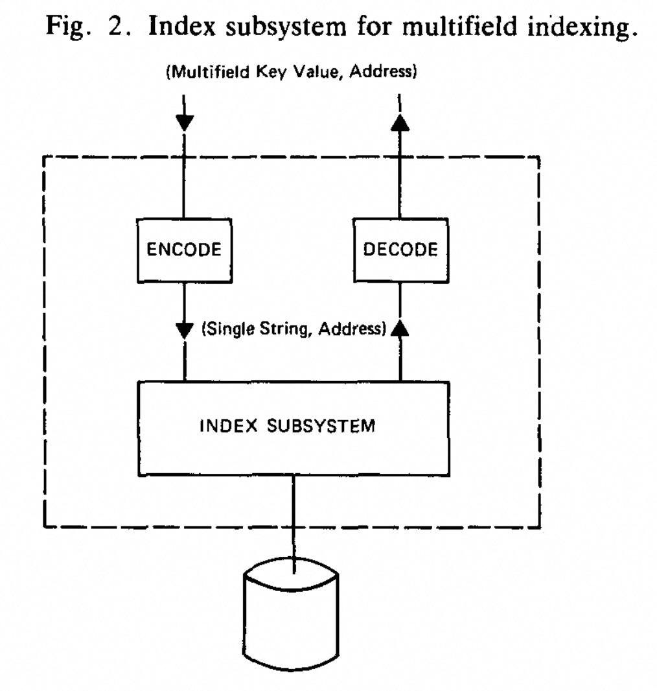
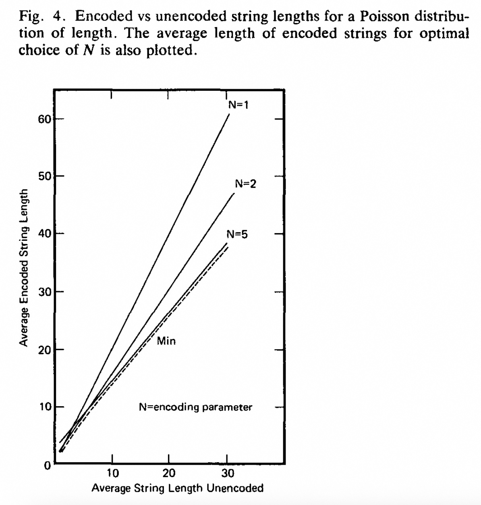
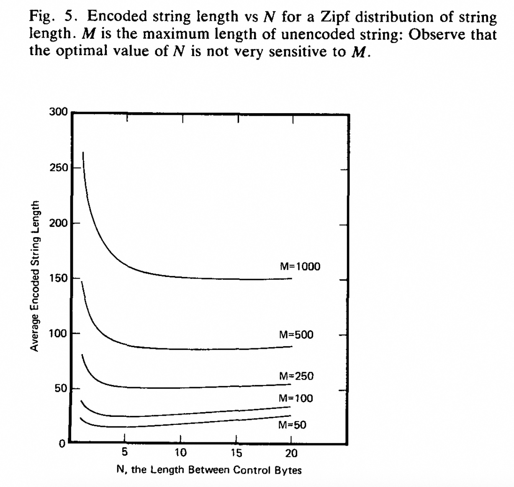
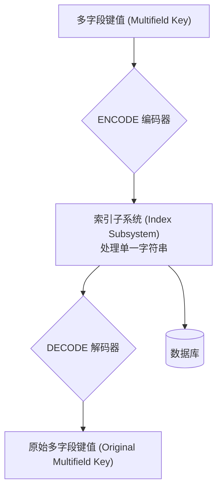
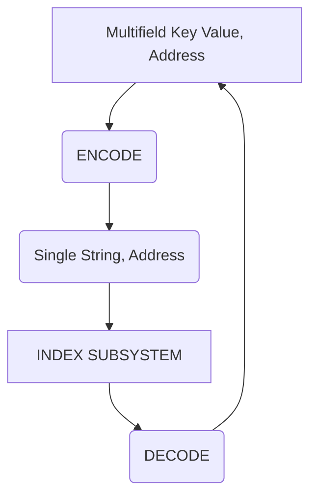

## AI论文解读 | An Encoding Method for Multifield Sorting and Indexing
        
### 作者        
digoal        
        
### 日期        
2025-09-26       
        
### 标签        
PostgreSQL , PolarDB , DuckDB , AI , 论文解读        
        
----        
        
## 背景  
      
https://dl.acm.org/doi/pdf/10.1145/359863.359892        
  
提示:          
```          
读懂《An Encoding Method for Multifield Sorting and Indexing》这篇论文需要提前掌握哪些基础知识, 请使用中文通熟易懂的讲解这些基础知识, 可以引用论文中的图、表或使用Markdown支持的图形(text,mermaid等)增加解释性. 
  
使用中文通熟易懂的解读《An Encoding Method for Multifield Sorting and Indexing》这篇论文, 其中的关键内容请着重讲解, 可以引用论文中的图、表或使用Markdown支持的图形(text,mermaid等)增加解释性. 
  
提取《An Encoding Method for Multifield Sorting and Indexing》这篇论文中的重要术语, 使用中文对这些术语进行通熟易懂的讲解, 可以引用论文中的图、表或使用Markdown支持的图形(text,mermaid等)增加解释性. 
```     
  
## 1 前置知识 
  
在读懂《An Encoding Method for Multifield Sorting and Indexing》这篇论文之前，你需要了解以下几个核心基础概念：

### 1. 数据库中的数据检索与索引
当我们需要从数据库中查找满足特定条件的记录时，最直接的方法是逐条扫描所有记录，但这效率很低。为了加快检索速度，我们通常会建立**索引** 。

* **单字段索引 (Single-field Indexing):** 这是一种最常见的索引，它在一个数据字段上建立一个有序的(值，地址)对集合 。例如，如果你有一个包含“姓氏”字段的数据库，你可以为这个字段建立一个索引，通过这个索引，你可以快速找到姓氏为“Smith”的所有记录的地址。

* **多字段检索 (Multifield Retrieval):** 当查询条件涉及多个字段时，比如“姓氏=Smith” **并且** “城市=New York” ，这就属于多字段检索。传统的做法是先对每个字段分别进行索引，得到各自的地址列表，然后对这些地址列表进行 **交集（intersection）** 操作，找出同时满足所有条件的记录 。这个方法需要额外的交集操作、存储多个索引数组，并且程序必须“意识到”它正在搜索多个字段 。

### 2. 什么是多字段索引 (Multifield Indexing)?
多字段索引是一种更高效的解决方案 。它不是为每个字段单独建立索引，而是将多个字段组合成一个“多字段键”，然后对这个组合键建立一个**单一的、有序的索引** 。

* **工作原理:** 论文指出，多字段检索和单字段检索的本质区别并不大 。只要能在索引中保持 **字典序（lexicographical ordering）** ，就可以通过扫描索引的一部分来直接回答查询 。
* **字典序:** 想象一下查字典。单词“apple”在“apricot”之前，是因为它们的前两个字母相同，但第三个字母'p'在'r'之前。多字段的字典序也是类似 。例如，城市-县对 `(Opal, Bay)` 在 `(Opal, Baylor)` 之前，因为它们第一个字段相同，但第二个字段 'Bay' 在 'Baylor' 之前。` (Opal, Baylor)` 在 `(Opala, Alameda)` 之前，因为第一个字段 'Opal' 在 'Opala' 之前 。

### 3. 为什么需要“编码”？
直接进行多字段索引的实现存在一个问题：它必须在比较时知道序列中字符串的数量和每个字符串的长度 。这意味着需要逐个字符地比较直到找到不匹配的地方 。这增加了算法的复杂性，并影响效率 。

这篇论文的核心贡献就是提出了一种**编码方案**来解决这个问题 ：

* **核心思想:** 将一个多字段的字符串序列（如 `('ABCDEF', 'XYZ')`） **编码** 成一个 **单一的、有序的字符串** 。
* **编码器的作用:** 如图2所示，在索引子系统的“前端”，一个编码器接受一个字符串序列作为输入，并将其转换成一个单字符串 。   
* **主要要求:**
    1.  **保持字典序:** 如果序列A在字典序上小于序列B，那么A的编码结果也必须小于B的编码结果 。
    2.  **处理任意长度字符串:** 编码器必须能将任意长度的字符串序列编码成一个变长字符串 。
    3.  **无保留字符:** 编码方案不能依赖于预留某些特殊符号作为控制字符，因为这些符号可能出现在数据本身中 。
* **与简单拼接的区别:** 论文指出，简单地将字符串拼接在一起，并附加长度信息是行不通的 。其原因在于，简单拼接的方案中，一个控制字符可能会与另一个字符串的数据字符进行比较，从而导致错误的排序结果 。

---

为了进一步深化对这篇论文的理解，您想了解一下文中提到的具体编码/解码方法吗？

---
文中提到的编码方法旨在将一个字符串序列转换为一个单字符串，同时确保编码后的字符串能够保持原始序列的字典序 。

### 编码过程概述
该方法的核心思想是在编码后的字符串中预留固定位置用于存放控制信息 。这些控制位置确保在比较两个编码字符串时，控制字符只会与控制字符比较，数据字符只会与数据字符比较，从而避免因比较不同类型字符而导致的排序错误 。

编码过程可以分为两个主要步骤：
1.  **对每个字符串进行编码：** 论文中详细描述了如何将一个字符串进行编码。假设有一个整数参数 $N$，你可以为序列中的每个字符串独立选择不同的 $N$ 值 。
    * 首先，将原始字符串填充二进制零（`'00'X`）以形成一个新的字符串，称为`stringp`。`stringp`的长度是 $N$ 的最小倍数 。
    * `stringp`被分成 $k$ 个长度为 $N$ 的子字符串：`stringp1`, `stringp2`, ..., `stringpk` 。
    * 然后，这些子字符串被连接起来，并在每个子字符串后附加一个控制字节 。
        * 对于除了最后一个子字符串之外的所有子字符串，附加的控制字节是十六进制的`'FF'X` 。这个值是十进制的 255，即一个全为 1 的字节 。
        * 对于最后一个子字符串，附加的控制字节是一个二进制数，表示原始字符串中未填充的字符数 。
    * 例如，要编码字符串 `'ABCDEF'`，假设 $N=4$。它被分成两部分 `'ABCD'` 和 `'EF'`。然后，`'EF'` 被填充两个零，成为 `'EF00'`。最终的编码结果是 `'ABCD' || 'FF'X || 'EF00'X || '02'X`。其中 `'02'X` 表示 `'EF'` 的原始长度是 2 。
2.  **串联所有编码后的字符串：** 最后，将序列中所有字符串的编码结果简单地串联起来，形成最终的单字符串编码 。

这种方法不仅支持升序（ascending）排序，也可以支持降序（descending）排序。对于需要降序排列的字段，只需先按照上述方法进行编码，然后对编码后的字符串进行补码（complementing）操作即可 。

---
你对这个编码方法还有哪些具体问题？例如，你是否想了解论文中提到的编码参数 $N$ 如何选择，或者它与存储开销的关系？

根据论文，选择编码参数 **$N$** 的主要目标是平衡存储开销和处理效率。这个参数决定了在编码过程中，数据字节和控制字节的间隔，直接影响了最终编码字符串的长度和冗余度 。

### 编码参数 N 与存储开销的关系
论文指出，这种编码方法的开销主要体现在两个方面：
* **填充（Padding）：** 原始字符串被填充零以使其长度成为 $N$ 的倍数 。
* **控制字符（Control Characters）：** 每隔 $N$ 个数据字符后插入一个控制字符 。

因此，**$N$** 的值越大，填充和控制字符所占的比例就越小，存储开销也越低。

---

### 最优 $N$ 值的选择
论文通过模拟不同字符串长度分布的实验，得出了以下重要结论：
* **理论最优值：** 对于给定的平均字符串长度 $L$，最优的 $N$ 值大约为 $\sqrt{2L}$ 。
* **低敏感性：** 论文的模拟实验（例如图4和图5）表明，存储开销对于 $N$ 值的变化并不敏感 。这意味着即使 $N$ 没有取到理论最优值，其对存储开销的影响也不会太大 。      
* **实际建议：** 即使平均字符串长度在很大范围内变化，选择一个单一的 $N=5$ 值通常也接近最优，是一个不错的选择 。

---

### 与其他方法的对比
论文还将这种编码方法的存储开销与另一种简单的填充（padding）方法进行了比较。如果字符串长度在0到 $2L$ 之间均匀分布，那么简单填充的平均存储开销是 $L$ 个字节 。相比之下，使用 $\sqrt{2L}$ 作为 $N$ 值进行编码的平均存储开销只有 $\sqrt{2L}$ 个字节 。
例如，如果平均字符串长度 $L=15$，那么简单填充的开销是15个字节，而编码方法的开销大约是 $\sqrt{30} \approx 6$ 个字节 。当字符串长度变化范围很大时，这种优势更为明显。例如，如果最大字符串长度是255，平均长度是15，简单填充的平均开销是240字节，而编码方法的开销仍然只有6个字节 。

---

为了更全面地理解这篇论文，你是否想进一步了解文中提到的另一种失败的编码方法（简单拼接）的具体原因？

在探讨该论文提出的成功编码方法之前，理解为什么简单的拼接方法会失败是至关重要的。论文中指出，任何简单的拼接（concatenation）方法都无法保证在所有情况下都能保留字典序，因此它无法作为多字段索引的通用解决方案 。

### 简单拼接方法失败的原因

**核心问题在于“控制字符”与“数据字符”的混淆。**
为了能够正确地解析和解码拼接后的字符串，编码过程中必须包含一些控制信息来表示每个原始字符串的长度 。然而，在简单的拼接方案中，这些控制字符可能会与另一个字符串的数据字符相邻。当系统在进行字节级别的比较时，就会出现以下情况：
* **不当的比较：** 一个编码字符串中的控制字符，可能会被拿来与另一个编码字符串中的数据字符进行比较，导致错误的排序结果 。

---

**论文中的反例证明**
论文的附录提供了一个正式的定理来证明这一点 。假设存在一个编码函数 $E$，它将字符串序列 `<s1, s2, ..., sn>` 编码为 `s1||f1(...) ||s2||f2(...) ||...`，其中 `f` 函数附加控制信息。

**证明思路：**
1.  **假设：** 假设这样的编码函数 $E$ 存在，并且可以保留字典序 。
2.  **构建反例：** 考虑一个序列 $S = \langle s1, s2, ..., sn \rangle$，其中 $s2$ 不全是零位 。其编码为 $G(S)=s1||g1(...) ||s2||g2(...) ||...$ 。
3.  **构造另一个序列：** 再构造一个序列 $T = \langle t1, t2, ..., tn \rangle$ 。
    * $t1$ 被定义为 $s1||g1(...) ||s2'$，其中 $s2'$ 是将 $s2$ 中的一个非零位设为零 。
    * $t2, ..., tn$ 可以是任意值 。
4.  **矛盾出现：**
    * 从编码结果来看， $G(T)$ 的第一个字段 `t1` 与 $G(S)$ 的第一个字段 `s1` 进行比较 。由于 $t1$ 的前缀是 $s1||g1(...) ||s2'$，而 $s2'$ 是在 $s2$ 的基础上修改了，因此 $G(T)$ 的编码结果会在字典序上排在 $G(S)$ 之前 。
    * 但是，从原始序列来看， $T$ 的第一个字段 $t1$ 包含了 $S$ 的第一个字段 $s1$ 和一部分第二个字段 $s2$ 的信息，因此 $T$ 应该在字典序上排在 $S$ 之后 。

由于 $G(T)$ 在 $G(S)$ 之前，而 $T$ 应该在 $S$ 之后，这导致了**矛盾** 。这个矛盾证明了，任何通过简单拼接和附加信息的方式来编码的函数都无法保持字典序 。因此，为了成功，编码器必须对原始字符串进行某种形式的“修改”（mutilate）或更复杂的处理 。

---

现在我们已经了解了为什么简单拼接会失败，你是否想进一步了解论文中提出的成功编码方法是如何避免这个问题的？

论文中提出的成功编码方法通过在编码字符串中预留固定位置来存放控制符号，从而有效避免了简单拼接方法中控制字符与数据字符混淆的问题 。

### 预留控制字段

这种方法的核心思想是，在编码后的字符串中，某些位置是专门为控制信息预留的，并且这些位置对于所有对应的字符串都是相同的 。这样一来，当进行字符串比较时，一个控制符号总是与另一个控制符号进行比较，而一个数据符号也总是与另一个数据符号进行比较 。这确保了排序决策的正确性，因为它消除了控制字符与数据字符之间可能发生的误比 。

### 周期性地插入控制字节

为了简化实现，论文建议将控制字段周期性地出现 。具体来说，在每隔 $N$ 个数据字符后，就会插入一个控制字节 。这个控制字节有两种可能的值 ：
* **`'FF'X`：** 用作“继续”字符，表示当前字符串还有后续部分 。
* **非`'FF'X` 的值：** 通常是一个二进制数，表示最后一个数据块中未填充的原始字符数量，用于解码 。

通过这种方式，编码过程将原始字符串序列转换为一个单一的、有组织格式的字符串，该字符串可以被传统的单字段索引机制处理，而无需考虑多字段检索所带来的额外复杂性 。

---

既然我们已经讨论了成功编码方法如何解决其前身的问题，你是否想了解更多关于该方法的实际应用场景？

根据这篇论文，这种多字段编码方法有广泛的实际应用，尤其是在需要处理多字段排序和检索的场景中。

### 数据库管理系统
该方法最直接的应用是在 **数据库管理系统（Database Management Systems, DBMS）** 中，特别是关系数据库系统。

* **高效的多字段索引:** 传统的查询需要对多个单独的索引进行交集操作，而使用这种编码方法，可以将多字段查询转换为对单个字符串索引的扫描。例如，一个查询 `field1 = constant AND field2 = constant`，在编码后可以被一个单一的索引扫描所处理，这比执行交集操作更有效率。
* **支持关系模型操作:** 在关系数据库模型中，这种方法可以用来高效地实现像 **Equi-join** 这样的操作 。Equi-join 是一种根据多个对应字段的相等性来连接两个关系的操作。通过在链接字段上建立多字段索引并扫描这些索引，可以非常高效地找到匹配的记录 。
* **优化查询:** 对于满足 `field1 = constant` 且 `field2 = constant` 等条件的一类查询，多字段索引可以显著提升性能 。
* **排序视图:** 该方法还可以提供一个关系的排序视图，这在某些数据库系统中非常有用，例如 IBM Research 的 System R 。

### 排序和数据处理
除了数据库，该方法也适用于其他需要多字段排序的场景。

* **排序包:** 它可以应用于排序软件包，对记录基于多个字段进行排序，即使这些字段的长度是可变的 。
* **分布式数据管理:** 这种编码方法在分布式系统中也有应用潜力，特别是在文件分配和管理问题中，以优化数据存储和检索 。

---

你是否想了解更多关于该论文在 IBM System R 数据库中的具体应用细节？
  
## 2 解读论文 
  
好的，我们来通俗易懂地解读这篇经典的数据库索引论文——《An Encoding Method for Multifield Sorting and Indexing》。

这篇1977年的论文解决了一个在数据库领域非常基础且重要的问题：如何高效地对多个字段（或称为“列”）同时进行排序和索引。

-----

### 论文解决了什么痛点问题？

想象一下，你有一个地址簿，里面有“城市”和“姓名”两列。现在你需要一个按“城市”字母顺序排列，在同一个城市内，再按“姓名”字母顺序排列的列表。

**传统做法的弊端：**
在数据库中，传统的做法是为“城市”和“姓名”分别建立两个独立的索引。  当你需要查询时，系统会：

1.  在“城市”索引中找到所有符合条件的记录地址。
2.  在“姓名”索引中找到所有符合条件的记录地址。
3.  对这两个地址列表进行**交集运算**，找出最终结果。 

这种方法不仅需要额外的交集计算，而且在处理多字段查询时，程序逻辑变得复杂，效率也随之下降。 

-----

### 论文的核心思想：多字段“降维”编码

作者们提出了一个非常巧妙的思路：**为什么不把多个字段（比如“城市”和“姓名”）通过一种特殊的编码方式，合并成一个单一的字符串呢？**

如果这种编码能保证原始多字段的排序关系（比如 `('北京', '张三')` 排在 `('上海', '李四')` 前面），那么编码后的单一字符串也应该保持完全相同的先后顺序。

这样一来，复杂的多字段索引问题，就转变成了简单的单字段索引问题。任何一个标准的、支持可变长度字符串的索引系统（例如B-Tree）都可以直接使用，无需任何改造。 

这个过程可以用论文中的图2来清晰地展示：   



  * **编码 (Encode)**: 将 `('Opal', 'Bay')` 这样的多字段数据转换成一个单一的长字符串。 
  * **索引 (Index)**: 索引系统只需要像处理普通字符串一样，对这个编码后的长字符串进行存储和比较。 
  * **解码 (Decode)**: 当从索引中取出数据时，再通过解码器将其恢复成原始的多个字段。 

-----

### 关键挑战：为什么不能简单地把字符串粘在一起？

你可能会想，最简单的编码不就是把两个字段直接拼接起来吗？比如把 `('A', 'B')` 变成 `'AB'`。

**论文通过一个定理证明了这种简单拼接是行不通的**。  根本原因在于，字符串的长度是可变的。考虑以下两个例子：

  * `S1 = ('A', 'BC')`
  * `S2 = ('AB', 'C')`

按照字典序，`S1` 应该排在 `S2` 前面。但如果简单拼接：

  * 编码 `S1` 得到 `'ABC'`
  * 编码 `S2` 得到 `'ABC'`

两者变得无法区分，排序关系丢失了。即使在中间加上分隔符或长度信息，也会在比较时出现“数据位”对上了“控制位”的混乱情况，导致排序错误。 

-----

### 论文提出的精妙编码方法

为了解决上述问题，作者设计了一种确保“数据位对数据位，控制位对控制位”的编码规则。 

**规则核心：**
将每个字符串分割成固定长度为 **N** 的块，并在每个块后面插入一个**控制字节**。

我们用论文中的例子来说明，假设参数 **N=4**，我们要编码 `('ABCDEF', 'XYZ')` 这两个字段：

1.  **编码第一个字段 'ABCDEF'**:

      * 长度为6，超过了N=4。先取出前4个字符 `'ABCD'`。
      * 在后面加上一个特殊的**继续符**，论文中规定为十六进制的 `'FF'`（即二进制的 `11111111`）。 
      * 处理剩下的 `'EF'`。长度为2，不足4，所以用二进制的`0`来**补足**到4位，变成 `'EF00'` (这里的0指'0'的二进制表示)。 
      * 在最后，加上一个字节，记录这最后一块中**真实数据的长度**，这里是2。所以是 `'02'`。 
      * 第一个字段编码结果：`'ABCD' || 'FF'X || 'EF00'X || '02'X`

2.  **编码第二个字段 'XYZ'**:

      * 长度为3，不足4。用`0`补足，变成 `'XYZ0'`。
      * 最后加上真实数据长度3，即 `'03'`。
      * 第二个字段编码结果：`'XYZ0'X || '03'X`

3.  **最终拼接**：
    将两个编码后的结果直接拼接，就得到了最终的单一字符串。

**为什么这样可行？**
因为通过这种方式，每 `N+1` 个字节中，第 `N+1` 个字节**永远是控制字节**。  在进行字符串比较时，系统从左到右逐字节比较：

  * 前N个字节，一定是数据对数据。
  * 第N+1个字节，一定是控制符对控制符。
    这样就完美地避免了混乱，保证了排序的正确性。 

### 方法的代价与优化

这种方法唯一的代价是增加了存储开销，因为加入了补位的0和控制字节。  论文通过数学分析和模拟（如图4和图5所示）得出结论：     

  * **开销很小**：相比于把所有字段都填充到最大可能长度的“笨办法”，这种编码方法的额外开销非常低。 
  * **参数N的选择**：理论上，最佳的 `N` 约等于 `√(2L)` (其中L是字符串的平均长度)。 
  * **实践建议**：研究发现，即使不为每种数据精确计算，选择一个适中的N（比如 **N=5**）对于绝大多数应用场景都已经接近最优了，这使得该方法非常实用。 

### 总结

这篇论文提出了一个影响深远的**多字段索引编码方案**。它通过一种“降维”思想，将复杂的多字段排序/索引问题，巧妙地转化为了一个标准的单字符串索引问题。该方法不仅解决了可变长字符串带来的排序难题，而且存储开销可控，实用性极强。它后来被应用在著名的 **System R** 数据库原型中 ，该原型是现代关系型数据库的先驱之一。

-----

现在你已经理解了这篇论文的核心思想和方法，我们可以更进一步。我可以用一个简单的Python代码片段来实际演示这个编码过程，让你更直观地看到它是如何工作的。你对此感兴趣吗？
  
## 3 术语 
  
《An Encoding Method for Multifield Sorting and Indexing》这篇论文提出了一个用于数据库和信息检索领域的重要编码方法。理解这篇论文需要掌握几个关键术语。以下是对这些术语的通俗解释：

### 1\. 多字段检索 (Multifield Retrieval)

多字段检索是指在数据库中查找满足多个字段条件的记录。例如，查找 `姓氏 = 'Smith'` 且 `城市 = 'New York'` 的所有记录。传统的解决方案是为每个字段建立单独的索引，然后对这些索引返回的地址列表进行 **交集（intersection）** 操作，以找到同时满足所有条件的记录地址 。这个方法需要额外执行交集操作，并且程序需要管理多个索引数组，这使得多字段检索与单字段检索在操作上截然不同 。

### 2\. 字典序 (Lexicographical Order)

字典序是一种基于字母顺序的排序方式。在多字段排序中，一个字符串序列 `<I1, I2, ..., In>` 在字典序上排在另一个序列 `<J1, J2, ..., Jn>` 之前，当且仅当存在一个位置 $k$，使得在所有 $j \< k$ 的位置上 $I\_j = J\_j$，并且在位置 $k$ 上， $I\_k$ 在字典序上排在 $J\_k$ 之前 。例如，城市-县对 `(Opal, Bay)` 在 `(Opal, Baylor)` 之前，因为它们的第一个字段都是 `Opal`，而第二个字段 `Bay` 在 `Baylor` 之前 。

### 3\. 多字段索引 (Multifield Index)

多字段索引是一种在多个字段上维护的**单一**索引，它能够通过保持字典序来直接回答多字段查询，无需进行交集操作 。该论文的核心思想就是通过一种特殊编码方法，将一个多字段键（一个字符串序列）转换为一个单一的、有序的字符串，从而可以使用传统的单字段索引来处理多字段索引问题 。

### 4\. 编码器与解码器 (Encoder and Decoder)

  * **编码器 (Encoder):** 论文中提出的一个子系统组件，它接收一个任意的字符串序列（即多字段键），并将其编码成一个单一的、可变长度的字符串 。该编码过程对索引机制完全透明 。
  * **解码器 (Decoder):** 编码器的逆过程，它从编码后的单字符串中恢复出原始的多字段数据 。

下图展示了编码器和解码器在整个索引子系统中的位置：   



*图2. 多字段索引的索引子系统。* 

### 5\. 编码参数 N (Encoding Parameter N)

在论文提出的编码方法中，参数 $N$ 决定了数据字节和控制字节之间的间隔。该参数可以为序列中的每个字符串独立选择 。当一个字符串被编码时，它会被填充（padding）到长度为 $N$ 的倍数，然后在每 $N$ 个字符后附加一个控制字节 。

  * **N 的作用:** $N$ 值的大小直接影响编码后字符串的长度。**N** 越大，用于填充和控制的冗余字符就越少，存储开销也越低 。论文指出，最优的 $N$ 值大约为 $\\sqrt{2L}$，其中 $L$ 是平均字符串长度，但实际应用中选择一个固定值如 $N=5$ 通常也足够接近最优 。

该编码方法通过在固定位置插入控制字节，避免了简单拼接方法中控制字符与数据字符混淆的问题 。

-----

你对这些术语的解释清楚吗？如果有任何不清楚的地方，我可以提供更详细的例子或解释。
  
## 参考        
         
https://dl.acm.org/doi/pdf/10.1145/359863.359892    
        
<b> 以上内容基于DeepSeek、Qwen、Gemini及诸多AI生成, 轻微人工调整, 感谢杭州深度求索人工智能、阿里云、Google等公司. </b>        
        
<b> AI 生成的内容请自行辨别正确性, 当然也多了些许踩坑的乐趣, 毕竟冒险是每个男人的天性.  </b>        
    
#### [期望 PostgreSQL|开源PolarDB 增加什么功能?](https://github.com/digoal/blog/issues/76 "269ac3d1c492e938c0191101c7238216")
  
  
#### [PolarDB 开源数据库](https://openpolardb.com/home "57258f76c37864c6e6d23383d05714ea")
  
  
#### [PolarDB 学习图谱](https://www.aliyun.com/database/openpolardb/activity "8642f60e04ed0c814bf9cb9677976bd4")
  
  
#### [PostgreSQL 解决方案集合](../201706/20170601_02.md "40cff096e9ed7122c512b35d8561d9c8")
  
  
#### [德哥 / digoal's Github - 公益是一辈子的事.](https://github.com/digoal/blog/blob/master/README.md "22709685feb7cab07d30f30387f0a9ae")
  
  
#### [About 德哥](https://github.com/digoal/blog/blob/master/me/readme.md "a37735981e7704886ffd590565582dd0")
  
  

  
