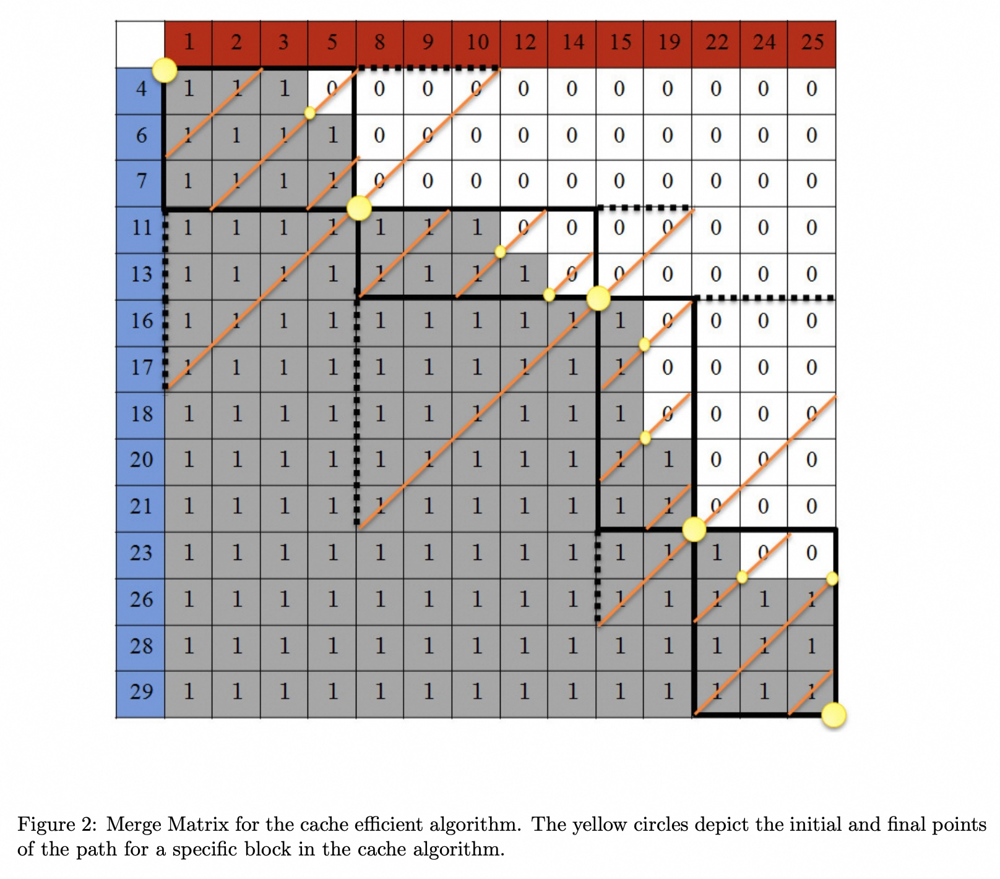

## AI论文解读 | Merge Path - A Visually Intuitive Approach to Parallel Merging
        
### 作者        
digoal        
        
### 日期        
2025-09-26       
        
### 标签        
PostgreSQL , PolarDB , DuckDB , AI , 论文解读        
        
----        
        
## 背景  
      
https://arxiv.org/pdf/1406.2628        
  
提示:          
```          
读懂《Merge Path - A Visually Intuitive Approach to Parallel Merging》这篇论文需要提前掌握哪些基础知识, 请使用中文通熟易懂的讲解这些基础知识, 可以引用论文中的图、表或使用Markdown支持的图形(text,mermaid等)增加解释性. 
  
使用中文通熟易懂的解读《Merge Path - A Visually Intuitive Approach to Parallel Merging》这篇论文, 其中的关键内容请着重讲解, 可以引用论文中的图、表或使用Markdown支持的图形(text,mermaid等)增加解释性. 
  
提取《Merge Path - A Visually Intuitive Approach to Parallel Merging》这篇论文中的重要术语, 使用中文对这些术语进行通熟易懂的讲解, 可以引用论文中的图、表或使用Markdown支持的图形(text,mermaid等)增加解释性. 
```     
  
## 1 前置知识 
  
这篇文章是关于“并行归并”算法的，它提出了一种名为“归并路径”（Merge Path）的全新、直观的并行归并方法，并基于此设计了高效的归并和排序算法。为了理解这篇论文，你需要提前掌握以下几个方面的基础知识：

### 1\. 基础数据结构与算法

  * **排序（Sorting）** : 这是最核心的基础。你需要理解什么是排序，以及一些基本的排序算法，比如归并排序（Merge Sort） 。论文中提到了归并排序是一个重要的应用场景，并解释了它的基本过程：将一个大数组不断地分成更小的子数组，直到每个子数组只有一个元素，然后将这些子数组两两归并（merge）起来，直到最终形成一个完全有序的大数组 。
  * **归并（Merging）** : 论文的重点就是并行归并。你需要理解**两个已排序数组的归并**是如何工作的。传统的归并方法是：从两个数组的开头开始，反复比较当前两个数组中最小的（未使用的）元素，然后将较小的那个元素放到结果数组中，并重复这个过程，直到所有元素都被放入结果数组 。

### 2\. 并行计算与并行算法

  * **并行计算的基本概念**: 论文讨论的是并行归并，因此你需要理解并行计算的基本原理。这包括如何将任务分配给多个处理器或线程（cores/processors/threads）以同时执行 。
  * **并行算法的挑战**: 这篇论文旨在解决并行归并中的几个关键挑战，因此了解这些挑战有助于你理解其贡献。这些挑战包括：
      * **负载均衡（Load-balancing）** : 如何确保所有处理器的工作量大致相等 。
      * **同步（Synchronization）** : 如何最小化不同线程之间的协调和通信开销 。
      * **内存访问效率（Memory access efficiency）** : 如何实现高缓存命中率并减少缓存一致性（cache-coherence）开销 。

### 3\. 论文中的核心概念

这篇论文的核心在于“归并路径”和“归并矩阵”。理解了这两个概念，就相当于理解了论文的核心思想。

#### 归并矩阵 (Merge Matrix)

想象一个二维布尔矩阵M，它的行（rows）对应数组 A 的元素，列（columns）对应数组 B 的元素。矩阵中的每个单元格 `M[i,j]` 的值是根据 `A[i]` 和 `B[j]` 的比较结果来决定的 ：

  * 如果 `A[i] > B[j]`，则 `M[i,j] = 1`。
  * 否则，`M[i,j] = 0`。

这在论文的图1（a）中得到了很好的展示。   

#### 归并路径 (Merge Path)

归并路径是一个从归并矩阵的左上角到右下角的路径，它只允许向右或向下移动。这个路径的每一个步进都代表了归并操作中的一个元素选择：

  * 如果路径向右移动一步，意味着选择了数组 B 中的一个元素 。
  * 如果路径向下移动一步，意味着选择了数组 A 中的一个元素 。

这条路径位于矩阵中“1”和“0”的边界上 。通过这条路径，归并操作被可视化为在网格上的路径遍历 。这使得将归并任务分割成独立的子任务变得非常直观，从而实现并行化 。

在论文图1(b)中，可以看到一个具体的归并路径示例。

-----

如果想更深入地了解并行计算和缓存优化，我可以提供一些关于这些概念的额外信息。

当然。关于并行计算和缓存优化，这是理解现代高性能计算的关键。结合你提供的这篇论文，我们可以更深入地探讨这两个概念。

---

### 1. 并行计算的深入理解

并行计算不仅仅是把任务分给多个处理器那么简单，它面临着许多挑战，这篇论文正是为了解决其中一些问题而设计的。

* **负载均衡 (Load Balancing)**：理想的并行算法应该让所有处理器几乎同时完成工作，而不是一个处理器忙得不可开交，而其他处理器却空闲着。在归并操作中，如果简单地将数组分成若干等份，然后让每个处理器处理一份，可能会导致某一部分的数据量很大，而另一部分的数据量很小，这就造成了负载不均衡。这篇论文的“归并路径”方法提供了一个优雅的解决方案：通过路径上的等距点来划分任务，可以确保每个处理器处理的元素数量大致相等，从而实现更好的负载均衡。

* **同步开销 (Synchronization Overhead)**：在并行任务中，不同的处理器可能需要互相通信或等待对方完成某个步骤，这个过程称为同步。频繁的同步会大大降低并行程序的性能。论文中强调，他们的归并算法是“无同步”（synchronization-free）的，这意味着一旦任务被分配给不同的处理器，它们就可以独立地执行，不需要互相等待或协调。这极大地减少了并行归并的开销，提高了效率。

* **并行编程模型**: 论文的实现基于共享内存架构（shared memory architecture），这意味着所有的处理器都访问同一个内存空间。这种模型在多核处理器上很常见，但需要特别注意如何避免数据竞争（data races）和确保内存一致性（memory consistency）。

---

### 2. 缓存优化的深入理解

现代计算机的处理器速度远超内存，为了弥补这个差距，引入了多级缓存（L1, L2, L3 cache）。缓存优化就是要设计算法，使得数据能够尽可能地在速度更快的缓存中被访问，而不是从慢速的主内存中获取。这篇论文也考虑了这一点，其方法具有“缓存高效性”（cache-efficient）。

* **局部性原理 (Principle of Locality)**：这是缓存优化的核心。局部性分为两种：
    * **时间局部性 (Temporal Locality)**：如果一个数据项在最近被访问过，那么它在未来很可能还会被访问。
    * **空间局部性 (Spatial Locality)**：如果一个数据项被访问，那么它附近的（相邻的）数据项也很有可能在不久的将来被访问。
* **缓存缺失 (Cache Miss)**：当处理器需要访问一个数据，但该数据不在缓存中时，就会发生缓存缺失。此时，处理器必须从主内存中获取数据，这会带来巨大的性能损失。
* **缓存无关算法 (Cache-Oblivious Algorithms)**：这是一种特别厉害的算法设计思想，它在设计时并不需要知道具体的缓存大小和缓存行（cache line）大小等参数，却依然能自动地利用缓存的局部性来获得高效性能。这篇论文虽然没有直接说自己是“缓存无关”的，但它的“归并路径”方法在访问数组时是连续的，天然地利用了空间局部性，从而实现了良好的缓存效率。

---

希望这些额外的细节能够帮助你更深入地理解这篇论文的技术贡献。

如果你对论文中提到的具体算法，例如它如何实现无同步归并或者具体的并行归并过程感兴趣，我可以为你深入解释。

---

### 如何实现“无同步归并”和“并行归并”

这篇论文的核心贡献在于，它将一个看似复杂的并行归并问题，通过“归并路径”的概念，巧妙地转化成了一系列可以独立执行的、无须线程间同步的子任务。

#### 1. 无同步归并的原理

传统的并行归并算法通常需要线程之间频繁地进行通信和同步，例如，当一个线程完成一个子任务后，它需要通知或等待另一个线程。这会带来巨大的开销，特别是在有大量线程的情况下。

这篇论文的“归并路径”方法之所以能实现**无同步**，其核心思想是：

* **任务划分的独立性**: 论文通过计算“归并路径”上的特定点，将整个归并任务分割成多个完全独立的子任务。
* **每个子任务的自给自足**: 每个处理器负责归并路径上的一段，这段路径对应了两个输入数组（A和B）中的一段连续子序列。处理器只需要知道它负责的子序列的起始位置和结束位置，就可以独立地执行本地的归并操作，而不需要任何其他处理器的数据或状态。

这就好比一条生产线，传统的并行方法可能需要每个工人频繁地和相邻的工人交流；而“归并路径”方法则预先精确地划分了每个工人的工作区间，一旦工作开始，每个工人就只需专注于自己的那部分，完全不需要相互等待或通信。

---

### 2. 具体的并行归并过程

整个并行归并过程可以分解为以下几个关键步骤：

**步骤1：寻找归并路径上的分区点**

首先，算法需要确定如何将归并路径分成若干段，每段对应一个处理器。假设你有 `P` 个处理器，并且输出结果的总长度是 `N`。那么，每个处理器大致需要负责 `N/P` 个元素的归并工作。

论文的核心是找到归并路径上对应于输出结果中第 `k * (N/P)` 个元素的点。这个点可以通过一种称为 **二分查找（Binary Search）** 的方法高效地在归并矩阵中找到。

**步骤2：分配子任务**

一旦找到了这些分区点，每个处理器 `p` (从 1 到 `P`) 就被分配了一个子任务。这个子任务就是将输入数组 A 和 B 中，由分区点确定的那两个子序列进行归并。

例如，处理器 1 负责归并从起始点到第一个分区点之间的元素；处理器 2 负责归并从第一个分区点到第二个分区点之间的元素，以此类推。

**步骤3：本地归并**

每个处理器拿到分配给它的子任务后，会执行一个**本地的、串行的归并**操作。由于每个子任务处理的数据量相对较小，且数据都是连续的（利用了空间局部性），这个串行归并会非常高效。

**步骤4：结果拼接**

因为归并路径上的分区点保证了每个处理器的子任务所产生的输出结果是**连续的**，因此，所有处理器完成后，它们的本地输出结果可以直接简单地按顺序拼接在一起，形成最终完全有序的数组。

---

如果你想了解论文中是如何使用**二分查找**来寻找归并路径上的分区点，我们可以进一步探讨。

理解这篇论文如何使用二分查找来寻找归并路径上的分区点，是掌握其并行归并方法精髓的关键。

### 二分查找的归并路径分区法

回想一下我们之前讨论的“归并矩阵”：一个二维网格，行代表数组A，列代表数组B。归并路径是沿着这个网格从左上到右下的唯一路径。

论文的目标是：在归并路径上，找到第 `k` 个元素的位置。这个位置决定了归并任务如何被分割。

**基本思想：**

传统的二分查找是在一个一维、有序的数组中寻找一个值。这篇论文将这个概念巧妙地扩展到了二维的归并矩阵上。

寻找归并路径上第 `k` 个元素的位置 `(i, j)`，其实就是找到一个点 `(i, j)`，它满足以下条件：

* **条件1：`i + j = k`**。这表示从矩阵的起点 `(0, 0)` 到达 `(i, j)` 点，总共走了 `k` 步。
* **条件2：`A[i]` 和 `B[j]` 的大小关系决定了路径的走向**。具体来说，当路径到达 `(i, j)` 点时，如果下一个元素是来自 `A` 数组的 `A[i+1]`，那么 `A[i+1]` 一定比 `B[j]` 小（或者等于）；如果下一个元素是来自 `B` 数组的 `B[j+1]`，那么 `B[j+1]` 一定比 `A[i]` 小。

论文将这个寻找过程转换为：找到一个索引 `i`（对应数组A），使得 `A[i]` 在归并后的结果中，正好位于第 `k` 个位置附近。

**如何使用二分查找？**

1.  **确定搜索范围**：二分查找的范围是在数组A的索引 `i` 上。初始范围是从 `0` 到 `|A|`（数组A的长度）。
2.  **选择中间点**：取当前范围的中间索引 `i_mid`。
3.  **计算对应的 `j`**：因为 `i+j` 约等于 `k`，所以可以大致估算出 `j = k - i_mid`。
4.  **进行比较**：
    * 比较 `A[i_mid]` 和 `B[j]`。
    * 如果 `A[i_mid] > B[j]`，这意味着 `A[i_mid]` 太大了，在归并路径上，`i_mid` 的位置应该更靠左（`i` 应该更小）。因此，二分查找的范围缩小到 `[0, i_mid - 1]`。
    * 如果 `A[i_mid] <= B[j]`，这意味着 `A[i_mid]` 的位置可能正确，也可能需要向右移动（`i` 应该更大）。因此，二分查找的范围缩小到 `[i_mid, |A|]`。
5.  **重复**：重复上述步骤，直到找到满足条件的 `(i, j)` 对，即找到了归并路径上第 `k` 个元素的分区点。

这个过程就像在一个巨大的、虚拟的归并矩阵中，通过一次次高效的“跳跃”，快速锁定归并路径上的一个特定点，从而避免了实际构建整个矩阵或进行完整的归并操作。

---

希望这个解释能帮助你更清楚地理解论文是如何利用二分查找来实现高效并行归并的。

如果你对论文中的其他概念，比如它如何实现高效的归并排序，或者它的性能分析感兴趣，我可以继续为你讲解。

好的，让我们来聊聊这篇论文如何将**高效的归并排序**与它的并行归并方法结合起来。

归并排序（Merge Sort）的基本思想是“分而治之”：
1.  **分解（Divide）** : 将一个大数组递归地分成两个大小相等的子数组。
2.  **解决（Conquer）** : 递归地对这两个子数组进行排序。
3.  **合并（Combine）** : 将两个已排序的子数组归并成一个完整的有序数组。

### 论文中的并行归并排序

这篇论文的贡献在于，它提供了一个**高效的“合并”步骤**。当“分解”过程到达一个设定的并行粒度后，它不再进行串行归并，而是将子数组的归并任务并行化，从而大大提升了整体的排序速度。

具体的并行归并排序流程如下：

1.  **并行分解**: 算法将输入的数组递归地分成更小的子数组，直到子数组的大小小于一个预设的阈值。
2.  **并行排序**: 对这些小到足以在单个处理器上高效排序的子数组，使用一个高效的串行排序算法（例如，经典的归并排序或快速排序）进行排序。这部分工作可以并行地在多个处理器上执行。
3.  **并行归并**: 这一步是论文的核心。一旦所有的子数组都已排序，它们会被两两归并，这个归并过程会递归地进行。在每一次归并时，论文的“归并路径”算法就会被应用，将两个已排序的子数组的归并任务划分给多个处理器，并实现**无同步归并**。
4.  **最终结果**: 通过逐级地并行归并，最终将所有已排序的子数组合并成一个完整的有序数组。

### 为什么说这很高效？

* **减少同步开销**: 如前所述，论文的归并路径方法实现了无同步归并，这显著减少了处理器之间的通信和等待时间。
* **负载均衡**: 归并路径的分区方法确保了每个处理器的工作量大致相等，避免了某些处理器过早完成任务而空闲的情况。
* **利用缓存**: 在本地进行归并时，处理器处理的是连续的数据块，这很好地利用了处理器的缓存，减少了对主内存的访问，提升了内存访问效率。

通过这种方式，论文将传统的归并排序从一个本质上是串行的算法，成功地改造为了一个高效、可扩展的并行算法，使其能够充分利用现代多核处理器的计算能力。

---

如果想更深入地了解这篇论文的性能分析，或者它与其他并行归并算法的对比，我可以为你详细解释。

这篇论文的“归并路径”算法与其他的并行归并算法相比，最大的区别在于其**直观性、无同步设计和高效的缓存利用**。论文本身也对此进行了详细的对比。

### 主要对比点

---

#### 1. 算法的直观性和易理解性

* **归并路径（Merge Path）** : 这篇论文的核心优势。它将复杂的二维归并过程转化为一条在二维网格上的简单路径。这种可视化方法让算法的逻辑和任务划分变得**极其直观**。通过找到路径上的等距点，可以自然地将任务划分为独立的、大小均衡的子任务，从而简化了并行化的设计。
* **其他传统算法**: 许多传统的并行归并算法，例如基于二分查找的方法，其并行任务划分通常是基于更抽象的数学公式或递归关系，不如“归并路径”这样有一个清晰的视觉模型。这使得它们的实现和理解可能更为复杂。

#### 2. 同步与负载均衡

* **无同步（Synchronization-free）** : 这篇论文的“归并路径”算法设计为无同步的。一旦任务被分配给不同的处理器，它们就可以完全独立地执行本地的归并操作，不需要任何线程间的通信或等待。这极大地减少了并行开销，是算法高效的关键。
* **传统算法**: 许多早期的并行归并算法需要线程之间进行频繁的同步操作。例如，在一个线程完成其部分归并后，可能需要通知或等待另一个线程才能继续。这种同步机制在多核处理器上会引入明显的性能瓶颈。

#### 3. 缓存效率

* **缓存友好（Cache-efficient）** : 论文的算法通过将数据划分成连续的、本地化的子任务，很好地利用了处理器的缓存。每个处理器在执行其本地归并时，处理的数据都在其缓存中，减少了对主内存的访问。这使得算法在实际硬件上表现出色。
* **其他算法**: 一些算法可能会导致不连续的内存访问模式，从而导致更多的缓存缺失（cache misses），降低整体性能。例如，如果任务划分不是基于数据块的连续性，那么处理器需要频繁地从主内存中获取数据，这会成为性能瓶颈。

#### 4. 算法复杂度

从计算复杂度的角度来看，这篇论文的归并路径算法与一些已有的高性能并行归并算法（例如，基于二分查找的方法）具有相似的理论复杂度。然而，论文的贡献更多在于其**直观性**和**实现上的优势**（例如，无同步和缓存效率），这些优势在实际应用中带来了显著的性能提升。

这篇论文的创新点在于提供了一种全新的视角来思考并行归并，将理论上已知的最优复杂度算法，通过一个**更易于理解和实现**的模型呈现出来，并强调了在现代多核硬件上实现高效的关键因素。

---

如果想进一步了解这篇论文的性能分析，例如它如何与著名的多核处理器归并算法进行实际性能对比，我可以为你详细解释。
  
## 2 解读论文 
  
好的，我们来通俗易懂地解读一下《Merge Path - A Visually Intuitive Approach to Parallel Merging》这篇经典论文。

这篇论文的核心贡献在于，它提出了一种非常**直观、可视化的方法**，用来解决一个经典的计算机问题：如何让多个处理器（核心）高效地协同工作，来合并两个已经排好序的数组。这种方法不仅理解起来简单，而且在实际应用中非常高效。

-----

### 核心概念：把“合并”过程画成一条路径

想象一下，我们有两个已排序的数组 A 和 B，需要将它们合并成一个大的有序数组 S。

传统的做法是，我们比较 A 和 B 的第一个元素，把较小的那个放入 S，然后重复这个过程。这个过程是**串行**的，一次只能处理一个元素，无法发挥多核处理器的威力。

论文的作者提出了一个天才般的想法：**我们可以把整个合并过程，想象成在一个二维网格上从左上角走到右下角的一条路径**。

1.  **构建合并矩阵 (Merge Matrix)**
    我们用数组 A 的元素作为网格的行，数组 B 的元素作为列，构建一个网格，这被称为“合并矩阵”。

2.  **绘制合并路径 (Merge Path)**

      * 从网格的左上角出发。
      * 在任何一个点，我们比较对应的 A 数组元素 `A[i]` 和 B 数组元素 `B[j]`。
      * 如果 `A[i]` 比较小，就意味着在最终的排序结果中，`A[i]` 应该先出现。在图上，我们就**向下走一步**。
      * 如果 `B[j]` 比较小，我们就**向右走一步**。
      * 这样一步步走下去，直到到达网格的右下角，就走出了一条唯一的路径。这条路径，就是**合并路径 (Merge Path)**。

这条路径神奇地记录了整个合并的顺序。路径上所有**向下的步伐**对应的 A 中元素，和所有**向右的步伐**对应的 B 中元素，按顺序组合起来，就是最终合并好的大数组 S。

下图（引用自论文中的 Figure 1）非常清晰地展示了这一点：   

> **图解**:
>
>   * 左侧 (a) 展示了合并矩阵的原理。矩阵中的 `1` 表示 `A[i] > B[j]`，`0` 则相反。你可以看到，"合并路径" 恰好是 `0` 和 `1` 区域的分界线。
>   * 右侧 (b) 画出了这条具体的“合并路径”（橙色线条）。例如，路径一开始就向下，因为 A[1]=17 比 B[1]=3 大，但比 B[2]=5 大... 直到 A[1]=17 小于 B[5]=22，所以路径在这里向右拐。

-----

### 并行化的关键：如何“切分”这条路径

知道了“合并路径”这个概念后，并行化的思路就变得异常清晰了。如果我们有 `p` 个处理器，我们只需要**将这条总路径平均切成 `p` 段**，然后让每个处理器负责合并自己那一小段路径所代表的数据就行了。

但是，这里有一个关键问题：**为了画出这条路径，我们似乎需要完成整个合并过程，这就回到了原点。我们如何在不知道完整路径的情况下，直接找到那 `p-1` 个切分点呢？**

这正是论文的第二个精妙之处：

**关键洞察**：合并路径上的第 `k` 个点，必然落在网格的第 `k` 条“**斜对角线**” (Cross Diagonal) 上。（这里的斜对角线指从右上到左下方向的线）。

这个洞察意味着：

  * 我们想把总长度为 `N` 的路径切成 `p` 段。
  * 那么切分点就应该在路径的第 `N/p`、`2N/p`、`3N/p`... 等位置。
  * 根据上面的洞察，这些切分点也必然在网格的第 `N/p`、`2N/p`、`3N/p`... 条斜对角线上。

因此，**寻找路径切分点的问题，就转化为了寻找“合并路径”与这几条特定“斜对角线”的交点问题**。

更棒的是，在任何一条斜对角线上，元素的比较结果（`A[i]` vs `B[j]`）是单调的。这意味着我们可以用效率极高的**二分查找 (binary search)**，在`log(N)`的时间复杂度内，迅速定位到那个交点。

最重要的是，**每个处理器可以独立地、并行地在各自负责的斜对角线上进行二分查找**，它们之间不需要任何通信，极大地提升了效率。

-----

### 更进一步：考虑缓存的“分段式”高效合并

在现代计算机中，CPU 的计算速度远快于从内存读取数据的速度。合并这种需要大量读写内存的操作，性能瓶颈往往在内存访问上。当多个核心同时疯狂读写内存时，这个问题会更加严重。这就是所谓的“**内存墙**”问题。

为了解决这个问题，论文提出了**分段式并行合并 (Segmented Parallel Merge, SPM)** 的思想。

这个思想很简单：

1.  **不一次性合并整个任务**，而是将整个“合并路径”在逻辑上切分成若干个“大段”，每个大段的长度，比如 `L`，是经过计算的，确保处理它所需要的数据（来自 A、B 的数据以及输出结果 S）能够**刚好放进 CPU 的高速缓存 (Cache)** 中。
2.  程序**依次**处理这些大段。
3.  在处理**每一个大段**时，再使用前面提到的并行方法，让 `p` 个处理器同时工作，将这个长度为 `L` 的小段路径再切成 `p` 份进行合并。

下图（引用自论文 Figure 2）示意了这个过程，黄点代表了每个大段的起点和终点。   

这样做的好处是，在处理每个大段时，所有计算都集中在高速缓存中进行，**极大地减少了对慢速主内存的访问次数**，从而显著提升了整体性能，尤其是在数据量非常大的时候。

-----

### 实验效果如何？

论文通过在不同架构（包括主流的 x86 多核系统）上的实验，证明了该算法的有效性。

  * **理想的加速比**：实验结果表明，该算法几乎可以实现**线性加速**。例如，在一个 40 核的系统上，处理 5000 万个元素时，相比单核，可以获得约 32 倍的速度提升（见下图 Figure 5(d)）。这说明算法能非常有效地利用多核资源。    
  * **缓存优化的有效性**：对比普通版和缓存优化版（Segmented），在数据量较大时（例如下图 Figure 5(b) 和 5(d)），缓存优化版的性能明显更优，证明了分段式合并策略的成功。

### 总结

总而言之，《Merge Path》这篇论文用一个简单而优美的可视化模型，解决了并行合并这个复杂问题。

  * **核心贡献**：提出了“合并路径”这一直观概念，将合并问题几何化。
  * **并行化关键**：通过在“斜对角线”上进行并行的二分查找，实现了无需通信、负载均衡的任务划分。
  * **实践价值**：提出了缓存友好的“分段式”算法，解决了内存访问瓶颈，使得算法在真实硬件上表现优异。

它不仅是一个理论上优秀的算法，更是一个在工程实践中被证明非常高效和实用的方法。

希望这个解读能帮助你更好地理解这篇论文的精髓。接下来，你更关心算法的具体实现细节，还是它在不同应用场景下的表现？
  
## 3 术语 
  
这篇论文的核心在于提出了一种新颖、直观的并行归并方法，其成功的关键在于几个核心术语和概念。以下是对这些重要术语的中文讲解，旨在帮助你通俗易懂地理解它们。

-----

### **1. 并行归并 (Parallel Merging)**

**并行归并**是指在多个处理器或线程上同时执行两个已排序数组的归并操作。

  * **传统方法**: 传统上，归并（merging）是将两个已排序的数组A和B，通过反复比较并移动较小的元素，最终组合成一个完整的有序数组C。这是一个串行过程。
  * **并行方法**: 当数组非常大时，一个处理器完成归并会很耗时。并行归并就是把这个任务拆分给多个处理器，让它们同时工作。但这会带来新的挑战，比如如何公平地分配任务（负载均衡），以及如何避免处理器之间频繁的通信和等待（同步开销）。这篇论文的“归并路径”算法正是为了解决这些挑战而设计的。

-----

### **2. 归并矩阵 (Merge Matrix)**

**归并矩阵**是一个虚拟的、二维的布尔矩阵，是理解“归并路径”的**基础**。它将两个输入数组 A 和 B 的归并操作可视化。

  * **矩阵的构成**: 矩阵的行（rows）对应数组 A 的元素，列（columns）对应数组 B 的元素。
  * **单元格的值**: 矩阵中每一个单元格 `(i, j)` 的值是根据 `A[i]` 和 `B[j]` 的大小关系来确定的。
      * 如果 `A[i] > B[j]`，则 `(i, j)` 的值为1。
      * 如果 `A[i] <= B[j]`，则 `(i, j)` 的值为0。

论文中的图1(a)展示了这个概念：   


  * `0` 和 `1` 的分界线在矩阵中形成一条路径。这条路径就是所谓的“归并路径”。

-----

### **3. 归并路径 (Merge Path)**

**归并路径**是归并矩阵中一条从左上角 `(0, 0)` 走到右下角 `(|A|, |B|)` 的特殊路径，它只允许向右或向下移动。

  * **路径的意义**: 这条路径是归并操作的**可视化表示**。
      * 路径的**向右**移动一步，表示在归并结果中选择的是数组B中的一个元素。
      * 路径的**向下**移动一步，表示在归并结果中选择的是数组A中的一个元素。
  * **如何利用**: 论文的核心思想是利用这条路径来划分并行任务。通过在归并路径上等距地选取点（例如每隔1000个元素取一个点），可以将一个大的归并任务分解为多个小的、独立的子任务，每个子任务都对应路径上的一段，并可以分配给一个独立的处理器。

-----

### **4. 无同步 (Synchronization-free)**

**无同步**是这篇论文算法的一大优势，意思是并行任务的执行**不需要处理器之间互相通信或等待**。

  * **传统挑战**: 在许多并行算法中，处理器需要频繁地同步，以确保它们正在处理正确的数据或等待其他处理器完成其部分工作。这会引入大量的性能开销。
  * **论文的解决方案**: 归并路径方法将任务划分得非常精确，每个处理器都被分配了一段明确的、独立的归并任务。一旦任务分配完成，每个处理器就可以独立地执行其本地的归并操作，不需要任何形式的同步。

-----

### **5. 缓存高效 (Cache-efficient)**

**缓存高效**是指算法设计能够充分利用现代计算机中的高速缓存（cache），从而减少对主内存的访问，提升性能。

  * **现代硬件**: 处理器速度远超主内存，因此缓存的存在是为了弥补这个差距。
  * **论文的优化**: 通过归并路径将任务划分为小而连续的数据块，处理器在进行本地归并时，数据都能够被加载到高速缓存中进行处理。这很好地利用了计算机的“空间局部性”（Spatial Locality）原理，显著提高了算法的实际运行速度。

-----

如果你想更深入地了解这篇论文中提到的并行归并排序（Parallel Merge Sort）或者它的性能分析，我很乐意为你详细解释。

关于**并行归并排序**的性能分析，这篇论文从多个角度进行了详细讨论，核心在于它如何通过“归并路径”方法在理论和实践中都表现出色。

### 理论性能分析 (Theoretical Performance Analysis)

论文的“归并路径”算法在理论上达到了与其他最优并行归并算法相当的性能。

* **计算复杂度 (Computational Complexity)**:
    * **工作量（Work）** : 衡量算法执行的总计算量。论文的并行归并算法的工作量与传统的串行归并算法类似，都是 `O(N)`，其中 `N` 是待归并的总元素数量。这意味着并行化并没有引入额外的、不必要的计算开销。
    * **跨度（Span）或深度（Depth）** : 衡量算法的最长计算路径，决定了在拥有无限处理器的情况下，算法能达到的最快运行时间。论文的算法跨度为 `O(log N)`，这是理论上可以达到的最优并行复杂度。这表明该算法具有高度的并行性。
* **算法模型**: 论文使用了并行计算中的一个重要模型—— **PRAM（Parallel Random Access Machine）** 模型，来分析其算法的理论性能。PRAM 模型假设所有处理器都可以同时、以恒定时间访问共享内存，这为分析并行算法提供了理论基准。

### 实际性能分析 (Practical Performance Analysis)

虽然理论性能很重要，但在现实世界中，算法的实际性能受到许多因素的影响，如缓存、内存访问模式、同步开销等。这篇论文的“归并路径”算法正是在这些方面表现出色，从而在实际应用中超越了许多其他算法。

* **无同步的优势**: 在多核处理器上，线程间的同步操作代价高昂。论文的算法通过其**无同步**设计，消除了这一主要的性能瓶颈。这使得它在处理器数量增加时，性能能够更好地扩展（scaling）。
* **缓存效率**: 论文指出，其算法在归并路径上划分的子任务是**缓存友好**的。每个处理器处理的数据都是连续的，这增加了缓存命中率，减少了对主内存的访问。在现代计算机体系结构中，减少内存访问延迟是提高性能的关键。
* **负载均衡**: 论文的“归并路径”方法通过在路径上等距地选取分区点，确保了每个处理器的任务量大致相等，避免了某些处理器过早完成工作而空闲的情况。完美的负载均衡是实现最佳并行性能的基础。

### 与其他算法的对比总结

| 特性 | **论文的归并路径算法** | **传统并行归并算法** |
| :--- | :--- | :--- |
| **直观性** | 极高，基于可视化的“归并路径”模型 | 相对较低，基于更抽象的数学概念 |
| **同步** | **无同步**，完全独立执行 | 通常需要频繁的线程间同步 |
| **缓存利用** | **高**，通过连续数据访问实现缓存友好 | 可能因非连续内存访问导致效率较低 |
| **可扩展性** | **高**，能很好地适应处理器数量的增加 | 受同步开销限制，可扩展性有限 |
| **理论复杂度**| 与最优算法相当 | 理论上可达到最优，但实践中受限于同步开销|

总而言之，这篇论文的并行归并排序算法在理论上是高效的，而在实践中，由于其独特的无同步和缓存友好设计，它比许多其他并行归并算法表现得更出色。

---
除了性能分析，您是否对论文中提到的**并行归并排序的实现细节**感兴趣，例如它如何处理递归的“分治”过程？

---

这篇论文中提到的**并行归并排序**的实现细节，主要体现在它如何巧妙地将传统的“分而治之”策略与“归并路径”并行化方法结合起来。它不是简单地把整个数组扔给多个处理器去排序，而是有一个精心设计的流程。

### 并行归并排序的实现流程

1.  **并行递归分解（Parallel Recursive Division）**
    * 首先，将输入的数组 A 递归地分成两个子数组。
    * 这个分解过程会一直持续下去，但不是无限制的。当子数组的大小小于一个预先设定的阈值时，算法就会停止递归分解。这个阈值通常是一个较小的常数，旨在确保每个子任务的大小适合在单个处理器上高效处理。
    * 重要的是，这个分解过程本身是并行的。两个子数组的分解任务可以被分配到不同的处理器上，并行地执行。

2.  **串行基础排序（Sequential Base Case Sorting）**
    * 当递归分解到最小的子数组（大小小于阈值）时，这些小数组会使用一个**高效的串行排序算法**进行排序。
    * 由于这些子数组很小，经典的归并排序或甚至插入排序都可能表现出色。

3.  **并行归并（Parallel Merging）**
    * 这一步是整个算法的核心。一旦最小的子数组被排序完成，它们就会被两两归并。
    * 在每一次归并时，论文的 **“归并路径”算法** 就会被调用。
    * 这个算法会计算出如何将归并任务划分为多个无同步的子任务，并将这些子任务分配给可用的处理器。
    * 每个处理器拿到它的子任务后，会执行一个**本地的、串行的归并**操作，将两个子序列合并。

4.  **结果组合（Result Combination）**
    * 由于归并路径的分区方式保证了每个处理器产生的输出是最终结果中连续的一部分，因此所有处理器完成其工作后，它们的结果可以直接简单地拼接起来，形成一个完整的、已排序的数组。

### 关键实现考量

* **阈值选择**: 设定一个合适的分解阈值至关重要。如果阈值太小，并行开销可能会超过性能收益；如果阈值太大，可能会导致负载不均衡。
* **内存分配**: 在实际实现中，需要妥善处理内存分配，例如，可以预先分配一个临时数组来存放归并结果，避免在运行时频繁地进行内存分配和回收，从而提高效率。
* **线程池管理**: 为了高效地管理处理器资源，可以使用一个线程池（thread pool），将子任务提交给线程池中的线程来执行。

这种设计使得并行归并排序既利用了**分治策略**的优雅，又通过**并行归并**解决了传统归并排序中的性能瓶颈，从而在现代多核处理器上实现了卓越的性能。

---

如果想更详细地了解论文中是如何处理不同大小的数组归并，或者作者在实现时遇到的其他具体挑战，我很乐意继续为你解答。

这篇论文在处理**不同大小的数组归并**时，其“归并路径”算法展现了出色的灵活性和高效性。它并不要求两个输入数组的大小相等，而是能够优雅地处理任意大小的归并任务。

### 核心方法：基于归并路径的并行分区

正如我们之前讨论的，论文的核心思想是利用“归并矩阵”和“归并路径”来可视化归并过程。这个模型天然地就支持不同大小的数组。

* **归并矩阵的维度**: 如果两个输入数组 A 和 B 的大小分别是 `|A|` 和 `|B|`，那么这个归并矩阵的维度就是 `|A| × |B|`。归并路径仍然是这个矩阵中从左上角 `(0, 0)` 到右下角 `(|A|, |B|)` 的一条路径。
* **路径长度**: 归并路径的长度是 `|A| + |B|`。这个总长度就是最终归并结果的元素总数。
* **并行任务划分**: 论文的并行化方法是基于归并路径的**总长度**来划分任务的。假设你有 `P` 个处理器，那么你就可以在归并路径上找到 `P-1` 个分区点，将整个路径均匀地分成 `P` 段。
    * **寻找分区点**: 第 `k` 个分区点对应于归并后结果中的第 `k * (|A| + |B|) / P` 个元素。寻找这些分区点的方法仍然是之前提到的**二分查找**，它可以快速地在虚拟的归并矩阵中定位这些点，而无需考虑两个输入数组的大小是否相等。
* **独立的子任务**: 一旦分区点被确定，每个处理器就会被分配一段归并路径，这段路径对应了两个输入数组中各自的一段连续子序列。每个处理器只负责归并其分配到的子序列，并且这些任务是**完全独立、无同步**的。

**示例：**

假设数组 A 的长度是 1000，数组 B 的长度是 5000，你有 4 个处理器。
1.  **总长度**：归并路径的总长度是 `1000 + 5000 = 6000`。
2.  **任务划分**: 6000 个元素被平均分配给 4 个处理器，每个处理器负责 `6000 / 4 = 1500` 个元素的归并。
3.  **寻找分区点**: 算法会寻找归并路径上对应于第 1500、3000 和 4500 个元素的位置。这些位置会决定每个处理器从数组 A 和 B 中各自负责的子序列范围。
4.  **本地归并**: 每个处理器拿到自己的任务后，就会对分配到的子序列进行本地归并。例如，处理器1负责归并前1500个元素，处理器2负责归并接下来的1500个元素，以此类推。

---

这种方法将归并的复杂性从处理不同大小的数组，转移到了一个更统一、更易于并行化的任务——在一条虚拟路径上寻找分区点。因此，无论输入数组的大小差异有多大，这种方法都能够有效地进行负载均衡，并实现高效的并行归并。

你是否对论文中提出的**并行归并排序**在具体编程语言（例如 C++）中的实现方式感兴趣？
  
## 参考        
         
https://arxiv.org/pdf/1406.2628    
        
<b> 以上内容基于DeepSeek、Qwen、Gemini及诸多AI生成, 轻微人工调整, 感谢杭州深度求索人工智能、阿里云、Google等公司. </b>        
        
<b> AI 生成的内容请自行辨别正确性, 当然也多了些许踩坑的乐趣, 毕竟冒险是每个男人的天性.  </b>        
    
#### [期望 PostgreSQL|开源PolarDB 增加什么功能?](https://github.com/digoal/blog/issues/76 "269ac3d1c492e938c0191101c7238216")
  
  
#### [PolarDB 开源数据库](https://openpolardb.com/home "57258f76c37864c6e6d23383d05714ea")
  
  
#### [PolarDB 学习图谱](https://www.aliyun.com/database/openpolardb/activity "8642f60e04ed0c814bf9cb9677976bd4")
  
  
#### [PostgreSQL 解决方案集合](../201706/20170601_02.md "40cff096e9ed7122c512b35d8561d9c8")
  
  
#### [德哥 / digoal's Github - 公益是一辈子的事.](https://github.com/digoal/blog/blob/master/README.md "22709685feb7cab07d30f30387f0a9ae")
  
  
#### [About 德哥](https://github.com/digoal/blog/blob/master/me/readme.md "a37735981e7704886ffd590565582dd0")
  
  

  
