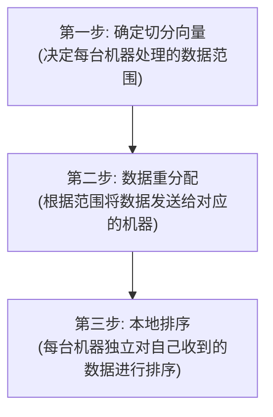
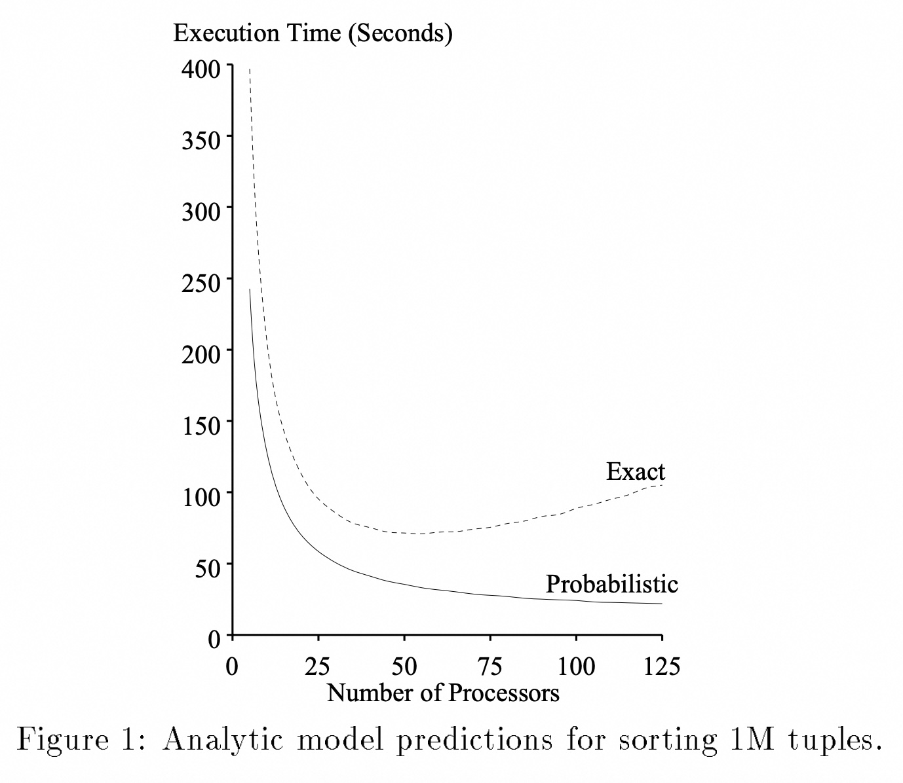
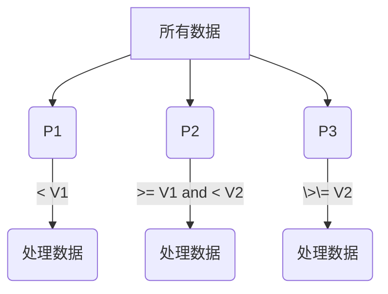
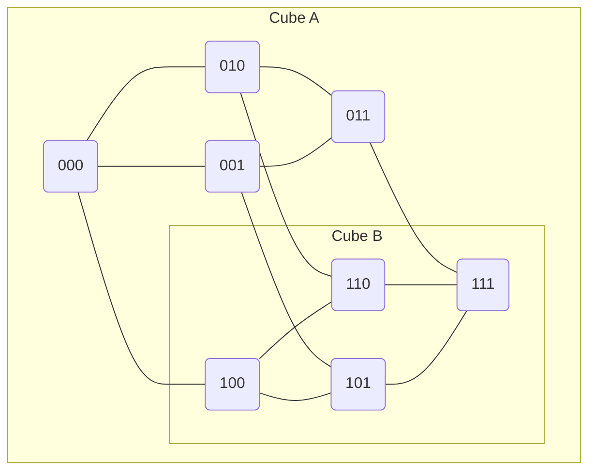

## AI论文解读 | Parallel Sorting on a Shared-Nothing Architecture using Probabilistic Splitting
        
### 作者        
digoal        
        
### 日期        
2025-09-26       
        
### 标签        
PostgreSQL , PolarDB , DuckDB , AI , 论文解读        
        
----        
        
## 背景  
      
https://pages.cs.wisc.edu/~dewitt/includes/paralleldb/parsort.pdf        
  
提示:          
```          
读懂《Parallel Sorting on a Shared-Nothing Architecture using Probabilistic Splitting》这篇论文需要提前掌握哪些基础知识, 请使用中文通熟易懂的讲解这些基础知识, 可以引用论文中的图、表或使用Markdown支持的图形(text,mermaid等)增加解释性. 
  
使用中文通熟易懂的解读《Parallel Sorting on a Shared-Nothing Architecture using Probabilistic Splitting》这篇论文, 其中的关键内容请着重讲解, 可以引用论文中的图、表或使用Markdown支持的图形(text,mermaid等)增加解释性. 
  
提取《Parallel Sorting on a Shared-Nothing Architecture using Probabilistic Splitting》这篇论文中的重要术语, 使用中文对这些术语进行通熟易懂的讲解, 可以引用论文中的图、表或使用Markdown支持的图形(text,mermaid等)增加解释性. 
```     
  
## 1 前置知识 
  
为了理解《Parallel Sorting on a Shared-Nothing Architecture using Probabilistic Splitting》这篇论文，您需要掌握以下几个关键的基础知识。这篇论文的核心在于探讨两种并行排序方法，而其基础正是并行计算和数据库系统中的一些基本概念。

### 1. 共享-无（Shared-Nothing）架构
该论文的标题中就包含了“共享-无架构”（Shared-Nothing Architecture）这一核心概念 。

* **定义**: 在这种架构中，每个处理器（或节点）都有自己独立的内存和磁盘。处理器之间不能直接访问彼此的内存或磁盘 。
* **通信方式**: 所有的处理器间通信都必须通过网络进行 。
* **优点**: 这种架构具有良好的可扩展性。随着处理器数量的增加，系统整体的内存和磁盘容量也会线性增加。
* **与“共享-内存”和“共享-磁盘”的区别**:
    * **共享-内存 (Shared-Memory)**：所有处理器共享一个中央内存。处理器之间通过内存传递数据，速度快，但可扩展性差，因为中央内存会成为瓶颈。
    * **共享-磁盘 (Shared-Disk)**：每个处理器有自己的私有内存，但所有处理器共享一组磁盘。这通常需要复杂的锁机制来管理对共享数据的访问。

### 2. 外部排序（External Sorting）
外部排序是指对无法完全放入内存的大型数据集进行排序 。

* **问题**: 待排序的数据量太大，无法一次性加载到任何一个处理器的内存中。因此，数据必须存放在磁盘上。
* **排序目标**: 这篇论文所解决的具体问题是“多输入多输出排序”（multiple-input multiple-output sorting） 。这意味着初始数据分散在各个处理器的磁盘上，并且是无序的。排序完成后，数据仍然以近似等大小的、有序的、不重叠的数据段形式，分布在每个处理器的磁盘上 。

### 3. 分割向量（Splitting Vector）
分割向量是这篇论文中算法的核心概念，是实现并行排序的关键。

* **定义**: 一个分割向量是一个包含 `k-1` 个键值（key values）的数组，其中 `k` 是处理器的数量 。
* **作用**: 这个向量用于将整个数据集在排序后，根据键值范围精确地划分给 `k` 个不同的处理器。例如，分割向量中的第一个值 `v[1]` 决定了处理器 `p1` 将处理所有小于 `v[1]` 的记录，处理器 `p2` 将处理所有大于 `v[1]` 但小于 `v[2]` 的记录，以此类推 。
* **算法依赖**: 论文中的排序算法性能在很大程度上取决于如何高效地确定这个分割向量 。

### 4. 两种分割方法
论文主要对比了两种确定分割向量的技术 。

* **精确分割（Exact Splitting）** :
    * **方法**: 这是一种确定性的方法，旨在精确计算分割向量，使得每个处理器被分配的记录数量完全相等（误差在正负一个记录之间） 。
    * **过程**: 算法首先要求每个处理器对其本地数据段进行完整排序，然后通过一个迭代的、协调的二分查找过程来确定分割值 。
* **概率分割（Probabilistic Splitting）** :
    * **方法**: 这种方法通过对未排序的文件进行 **采样（sampling）** 来近似计算分割向量 。
    * **过程**:
        1.  从整个文件中随机抽取一个数据子集，作为“样本”。
        2.  对这个小样本进行精确排序，并从中计算一个分割向量 。
        3.  使用这个由样本得到的分割向量作为整个文件的近似分割向量 。
    * **折衷**: 这种方法的好处是计算分割向量的成本较低，但可能会导致数据分布不均，即产生**倾斜（skew）** 。论文中通过分析和实验证明，这种方法在共享-无架构下的性能通常优于精确分割 。

---
这些基础知识，尤其是“共享-无架构”和“分割向量”的概念，是理解这篇论文如何通过概率采样来优化并行排序性能的关键。

如果您想更深入地了解这篇论文，我们可以进一步探讨论文中提到的 **倾斜（skew）** 是如何影响性能的。您想了解更多关于这个话题的信息吗？

倾斜（skew）对并行排序性能的影响主要体现在两个方面：**负载不均衡**和**通信开销增加**。

### 1. 负载不均衡（Load Imbalance）

* **问题**: 倾斜是指数据在各个处理器之间没有被均匀地分配。例如，在使用概率分割时，如果样本数据不能很好地代表整个数据集的分布，那么得到的分割向量可能导致某个处理器被分配了过多的数据，而其他处理器被分配的数据量则相对较少。
* **后果**:
    * **处理时间延长**: 被分配到更多数据的处理器需要更长的时间来完成其本地的排序任务。
    * **等待时间**: 其他处理器虽然很快完成了任务，但它们必须等待最慢的那个处理器（也称为“瓶颈”）完成工作，才能进入下一阶段。
    * **资源浪费**: 在等待期间，那些已经完成工作的处理器处于空闲状态，导致计算资源被浪费。

---

### 2. 通信开销增加（Increased Communication Cost）

* **问题**: 在并行排序的重新分配数据阶段，每个处理器需要将属于其他处理器的数据发送出去。如果数据分布不均，那么那些需要发送大量数据的处理器会产生更大的网络流量。
* **后果**:
    * **网络拥塞**: 过多的数据传输可能会导致网络拥塞，从而降低整体的通信效率。
    * **传输延迟**: 数据传输的延迟会增加，进一步延长了整个排序过程的总时间。

简而言之，倾斜是概率分割算法的一个固有风险。它虽然能快速确定分割向量，但如果分割不当，会导致后续的负载不均衡和通信开销增加，从而抵消了初期节省的时间。论文通过理论分析和实验证明，在大多数情况下，即使存在小范围的倾斜，概率分割算法的整体性能仍然优于需要进行昂贵迭代计算的精确分割算法。

---

您是否想了解论文中如何通过数学模型来分析倾斜对性能的影响？

在论文中，作者使用了一个简单的数学模型来分析倾斜对性能的影响，并证明了概率分割优于精确分割。这个分析的核心在于比较两种算法的总排序时间，总排序时间被分解为几个关键部分。

---

### **精确分割（Exact Splitting）的排序时间**

对于精确分割，排序时间主要由以下几个部分组成：
1.  **本地排序时间（Local Sorting）** : 每个处理器首先对其本地数据进行排序。
2.  **分割向量计算时间（Splitting Vector Calculation）** : 这个阶段需要处理器之间进行多次通信和二分查找，来精确确定分割点。这个过程的开销相对较大。
3.  **数据重新分配时间（Redistribution）** : 处理器之间交换数据，将数据发送到正确的目的地。
4.  **最终本地排序时间（Final Local Sorting）** : 每个处理器对接收到的数据再次进行排序。

论文指出，由于数据分布完全均匀，精确分割的负载是均衡的，因此本地排序和最终本地排序的时间是相对固定的。主要的开销来自于复杂的**分割向量计算**。

### **概率分割（Probabilistic Splitting）的排序时间**

对于概率分割，排序时间分解为：
1.  **抽样时间（Sampling）** : 从本地数据中抽取样本。这个时间非常短。
2.  **分割向量计算时间（Splitting Vector Calculation）** : 对样本进行排序并计算分割向量。由于样本量很小，这个时间也微不足道。
3.  **数据重新分配时间（Redistribution）** : 处理器之间交换数据。
4.  **最终本地排序时间（Final Local Sorting）** : 对接收到的数据进行最终排序。

这里，**倾斜的影响**体现在**最终本地排序时间**上。由于概率分割可能导致数据分布不均（倾斜），一些处理器可能会被分配到比其他处理器更多的数据。因此，总的最终排序时间取决于负载最重的那个处理器，也就是：`max(T_sort_i)`，其中 `T_sort_i` 是处理器 `i` 的最终排序时间。

### **数学分析的结论**

论文的数学分析主要集中在比较**精确分割的分割向量计算时间**与**概率分割因倾斜而增加的最终本地排序时间**。

* **论文的假设和证明**: 作者证明了，当数据量足够大时，即使在存在倾斜的情况下，**概率分割的总排序时间仍然小于精确分割**。这是因为：
    * **精确分割的分割向量计算时间**是一个显著的开销，尤其是在节点数量增加时。
    * **概率分割因倾斜造成的额外时间**，可以通过增加样本量来控制。作者通过概率论和统计学的分析表明，随着样本量的增加，倾斜的程度会趋于可接受的范围，从而确保了性能。

---

这种数学模型让论文的结论更具说服力，证明了在共享-无架构下，用**低成本的概率方法**来近似解决问题（快速获得分割向量），其带来的收益（减少计算开销） **大于** 其潜在的风险（倾斜导致的负载不均）。

您是否希望进一步了解论文中关于概率分割性能的**实验结果**，看看这些理论分析是如何在实际系统中得到验证的？

《Parallel Sorting on a Shared-Nothing Architecture using Probabilistic Splitting》这篇论文通过在**Gamma**并行数据库机器上的实验，验证了概率分割的性能优势。实验结果主要从以下几个方面展示：

### 1. 性能对比

论文对比了**精确分割**（Exact Splitting）和**概率分割**（Probabilistic Splitting）两种方法在不同数据集大小和处理器数量下的排序性能。

* **结果**: 在所有测试场景中，**概率分割的性能均优于精确分割**。
* **原因**: 精确分割的性能瓶颈在于其复杂的分割向量计算过程。这个过程需要多个通信回合和迭代计算，消耗了大量时间。而概率分割由于只对小样本进行处理，确定分割向量的速度非常快，这部分开销几乎可以忽略不计。

---

### 2. 倾斜（Skew）的影响

尽管概率分割存在数据倾斜的风险，但论文的实验结果表明，这种倾斜的影响在实际中是可以接受的。

* **结果**: 即使在数据分布存在轻微偏差时，由于**分割向量计算时间**的巨大差异，概率分割的总排序时间仍然远小于精确分割。
* **分析**: 实验数据显示，概率分割在大多数情况下能够将数据相对均匀地分配到各个节点，即使存在轻微倾斜，也未能对整体性能造成显著的负面影响。这进一步验证了论文的理论分析，即快速的分割向量计算带来的性能提升，足以弥补因倾斜可能导致的额外开销。

---

### 3. 可扩展性

论文还测试了两种算法在增加处理器数量时的性能表现，以验证它们在“共享-无”架构下的可扩展性。

* **结果**: **概率分割具有更好的可扩展性**。随着处理器数量的增加，其性能提升更接近线性。
* **原因**: 精确分割的复杂通信过程使其在多处理器环境下变得效率低下，而概率分割的通信开销相对固定且较低，因此能更好地利用更多的处理器资源。

总的来说，论文的实验结果为概率分割提供强有力的支持，证明了它是一种在“共享-无”并行数据库系统中高效、可扩展的排序方法。

您对论文中的其他哪些具体实验细节感兴趣，例如用于测试的设备配置或数据集大小？
  
## 2 解读论文 
  
好的，我们来通俗易懂地解读这篇经典的数据库研究论文：《在共享无关架构上使用概率切分进行并行排序》。

简单来说，这篇论文探讨了一个核心问题：当数据量大到一台计算机处理不了，需要几十甚至上百台计算机（即“并行系统”）协同工作时，我们该如何高效地完成排序任务？

作者们最终得出的结论是：**采用一种“聪明的偷懒”方法——概率切分（Probabilistic Splitting），比追求“绝对公平”的精确切分（Exact Splitting）方法要快得多，也更具扩展性** 。

-----

### 核心问题：并行排序的关键瓶颈在哪？

想象一下，你要把一个拥有 10 亿条记录的巨大文件排序，并将任务分配给 100 台计算机。你首先要做的是决定“谁干多少活”。具体来说，就是如何为每台计算机划定一个处理范围。比如，1号机处理键值在 A-B 范围的数据，2号机处理 B-C 范围的，以此类推。

这个“划定范围”的步骤，在论文中被称为**确定“切分向量”（Splitting Vector）** ，它是整个并行排序算法中最关键的一步 。如果范围划分得不好，可能会导致某台机器任务过重，成为整个系统的瓶颈，从而拖慢整体效率。

整个排序过程可以简化为以下三步，我们可以用一个流程图来表示：



论文的焦点就在于如何最高效地完成第一步。作者对比了两种主流方法。

-----

### 两大流派对决：精确切分 vs. 概率切分

#### 1\. 精确切分 (Exact Splitting)：完美主义者

这是一种力求完美的方法。它的目标是精确计算出切分点，确保排序完成后，每台计算机分到的数据量几乎完全相等（最多只差一条记录） 。

  * **优点**: 任务分配绝对公平。在第三步“本地排序”时，所有机器几乎可以同时完成工作，不会有机器“拖后腿”。
  * **缺点**: **过程极其复杂和耗时**。为了找到这些完美的切分点，所有计算机需要进行多轮复杂的通信和计算，甚至需要对各自的本地数据先进行一次完整的排序 。当计算机数量（即处理器数量）增加时，这种计算和通信的开销会急剧增长，变得得不偿失 。

#### 2\. 概率切分 (Probabilistic Splitting)：实用主义者

这是一种更“聪明”的方法。它认为没有必要为了绝对的公平而花费巨大代价。它的核心思想是：**通过对一小部分随机样本的分析，来估算整个数据集的分布情况** 。

具体做法是 ：

1.  **随机采样**: 从整个数据文件中随机抽取一小部分数据（比如几千条）作为样本。
2.  **分析样本**: 将这个小小的样本集进行精确排序和切分。
3.  **以小见大**: 用这个在样本上计算出的“切分向量”作为整个巨大文件的“近似切分向量”。

<!-- end list -->

  * **优点**: **速度极快**。相比于精确切分需要处理全部数据，采样和分析样本的成本非常低 。
  * **缺点**: 存在**数据倾斜 (Skew)** 的风险 。因为样本不总能完美代表全体数据，最终可能导致某些计算机分配到的数据比平均值多一些，而另一些则少一些。这个“多出来”的部分就是数据倾斜。

-----

### 为什么“聪明的偷懒”最终胜出？

论文通过**理论建模**和**真实系统实验**两个方面证明了概率切分的优越性。

#### 理论模型预测

作者们建立了一个成本分析模型来预测两种算法在不同机器数量下的执行时间。如下图（论文中的图1）所示，模型预测的结果非常清晰：   

*图源：DeWitt, D. J., Naughton, J. F., & Schneider, D. A. (1991). Parallel Sorting on a Shared-Nothing Architecture using Probabilistic Splitting.*

  * **概率切分（Probabilistic）** 的性能曲线（下方）随着处理器数量增加，执行时间稳定下降。
  * **精确切分（Exact）** 的性能曲线（上方）在处理器数量较少时还不错，但随着数量增多，其内部开销剧增，导致执行时间反而上升 。

结论很明显：**在共享无关的多处理器系统上，与其花费巨大代价去实现完美的负载均衡，不如快速完成划分并容忍一定程度的数据倾斜** 。

#### 真实系统实验结果

作者们在当时一台名为 **Gamma** 的拥有32个处理器的真实并行数据库机上实现了概率切分算法 ，并进行了一系列测试，得出了几个关键的实践结论：

1.  **样本大小是门艺术**: 样本并非越多越好。样本太少，数据倾斜会很严重，拖慢整体速度；样本太多，采样本身的时间开销又会变大 。实验发现，每个处理器取100个样本（例如30台机器就取3000个样本）是一个非常理想的“甜点”，在成本和效果之间取得了很好的平衡 。

2.  **对数据分布不敏感**: 无论原始数据的键值是均匀分布的，还是高度倾斜的（例如，某些值出现得特别频繁），概率切分算法的性能都非常稳定 。这是一个巨大的实践优势。

3.  **优秀的扩展性**:

      * **加速比 (Speedup)**: 对于一个固定大小的文件，当把处理器数量从5个增加到30个时，排序时间显著缩短，接近线性加速的理想情况 。这意味着增加硬件投入能有效提升性能。
      * **规模扩展性 (Scaleup)**: 当把数据量和处理器数量按相同比例增加时（例如，从5台机器处理80万条记录，增加到30台机器处理480万条记录），总的响应时间基本保持稳定 。这表明该算法能够很好地应对不断增长的数据和系统规模。

-----

### 结论与启示

这篇论文的核心贡献在于，它通过严谨的理论分析和扎实的实验数据，证明了在大型并行计算环境中，**概率性、近似性的算法往往比确定性、精确性的算法更具优势**。在并行排序这个特定问题上，“概率切分”用一个非常小的、可控的“数据倾斜”代价，换取了“划分阶段”效率的巨大提升，最终赢得了整体性能的胜利 。

这一思想对后来的分布式系统设计产生了深远的影响，即在很多场景下，我们应该追求足够好的、可扩展的解决方案，而非理论上完美但实践中代价高昂的方案。

-----

希望这份解读对您有帮助！关于这篇论文中的具体细节，比如他们是如何进行Scaleup或Speedup测试的，或者您对数据倾斜（Skew）的控制方式感兴趣，我们可以进一步探讨。
  
## 3 术语 
  
为了理解《Parallel Sorting on a Shared-Nothing Architecture using Probabilistic Splitting》这篇论文，掌握其中的核心术语至关重要。以下是论文中几个重要的概念，用通俗易懂的中文进行解释：

### 共享-无架构 (Shared-Nothing Architecture)

这是论文讨论的**并行数据库系统**所基于的基本硬件模型。

  - **定义**: 每个处理器（或节点）都拥有独立的内存和磁盘，处理器之间不共享任何资源。
  - **通信方式**: 节点间的所有数据交换都必须通过网络进行。
  - **优点**: 这种架构具有良好的可扩展性，增加处理器数量可以线性地提升系统的处理能力。

简单来说，你可以把共享-无架构想象成一个由多台独立的计算机组成的团队，每台计算机只负责自己的数据和工作，如果需要协作，就通过网络互相发送信息。

-----

### 外部排序 (External Sorting)

这指的是对**无法一次性装入内存**的超大型数据集进行排序。

  - **问题**: 待排序的数据量太大，需要存储在磁盘上。
  - **目标**: 将磁盘上的无序数据最终变为有序数据。

论文中的排序问题更具体，被称为“**多输入多输出排序**”（multiple-input multiple-output sorting）。这表示初始数据分散在多个节点的磁盘上，而排序完成后的结果也同样以有序、不重叠的数据段形式，分散在各个节点的磁盘上。

-----

### 分割向量 (Splitting Vector)

这是论文中算法的核心概念，用于将数据在不同处理器之间进行分区。

  - **定义**: 一个包含 `k-1` 个键值（key values）的有序列表，其中 `k` 是处理器的数量。
  - **作用**: 这个向量就像一把尺子，用来精确地划分整个数据集的键值范围，确保每个处理器都负责处理特定范围的数据。

**举例**: 如果有3个处理器（P1, P2, P3）和一个分割向量 `[V1, V2]`。

  - 所有键值 `< V1` 的数据被分配给 P1。
  - 所有键值 `>= V1` 且 `< V2` 的数据被分配给 P2。
  - 所有键值 `>= V2` 的数据被分配给 P3。




-----

### 精确分割 (Exact Splitting) vs. 概率分割 (Probabilistic Splitting)

论文主要对比了两种计算分割向量的方法。

#### 精确分割 (Exact Splitting)

这是一种**确定性**的方法，旨在通过迭代和协调的计算，找到能使每个处理器分配到**完全相等数量**记录的精确分割向量。

  - **优点**: 数据分布绝对均匀。
  - **缺点**: 计算过程复杂，需要多次通信，开销大。

#### 概率分割 (Probabilistic Splitting)

这是论文的核心贡献，是一种**基于采样**的近似方法。

  - **原理**: 从未排序的数据中随机抽取一个小的 **样本（sampling）** ，对这个小样本进行排序，然后从中选择分割点，并用这个“近似”的分割向量来指导整个数据的分区。
  - **优点**: 计算分割向量的时间极短，大大减少了开销。
  - **缺点**: 得到的分割向量可能不完美，可能导致数据分布不均，即产生 **倾斜（skew）** 。

-----

### 倾斜 (Skew)

这是概率分割方法可能面临的主要问题。

  - **定义**: 指数据在各个处理器之间的分配不均衡，导致某些处理器被分配了比其他处理器多得多的数据。
  - **影响**: 造成**负载不均衡**。被分配到更多数据的处理器需要更长时间来完成其工作，导致整个排序任务必须等待最慢的那个处理器，从而降低了并行效率。

论文通过分析证明，尽管存在倾斜的风险，但由于概率分割在计算分割向量上节省了大量时间，其整体性能通常仍然优于精确分割。

您对论文中用于进行实验的 **Gamma 并行数据库机器**感兴趣吗？

好的，我们可以聊聊 **Gamma 并行数据库机器**。

论文中提到，所有的实验结果都是在 **Gamma 并行数据库机器** 上获得的。Gamma 是上世纪 80 年代末至 90 年代初在威斯康星大学麦迪逊分校开发的一个重要的研究项目，它是一个基于**共享-无架构**的并行数据库系统。

### Gamma 的核心特点

* **硬件架构**: Gamma 运行在 Intel iPSC/2 或 iPSC/860 超立方体（Hypercube）多处理器上。这种超立方体是一种特殊的网络拓扑结构，其节点数量是 2 的幂次方（例如，4、8、16、32等），节点之间通过专用的通信通道连接。
* **软件架构**: Gamma 的软件设计是基于一个称为“数据流驱动执行”（dataflow-driven execution）的理念。它将数据库操作（如排序、连接）分解成一系列相互通信的进程，这些进程在不同的处理器上并行运行。
* **“共享-无”的实现**: 在 Gamma 中，每个处理器都有自己的内存和磁盘，这是实现“共享-无”架构的关键。处理器之间通过超立方体网络进行消息传递来交换数据，从而实现并行操作。

### 为什么在 Gamma 上做实验？

选择 Gamma 作为实验平台，对于这篇论文来说至关重要。

* **验证理论**: 论文的理论分析，特别是关于概率分割优于精确分割的结论，需要在真实的共享-无架构系统上进行验证。Gamma 的架构完美契合了论文的理论模型。
* **实际性能**: 实验结果证明，论文中提出的算法在实际的并行数据库机器上是高效且可扩展的。这不仅仅是纸上谈兵，而是有实际系统支持的。
* **推动领域发展**: 像 Gamma 这样的研究型数据库系统，为并行数据库领域的研究提供了宝贵的实验平台。通过在这些平台上验证新算法，研究人员可以推动整个领域的发展。

简而言之，Gamma 并行数据库机器是论文中理论分析的“试验台”，它提供了真实的“共享-无”环境，使得作者能够实际测量和对比不同排序算法的性能，从而证明了他们提出的概率分割算法的优越性。

---

您是否对论文中提到的 **超立方体（Hypercube）网络** 拓扑结构感兴趣？

超立方体（Hypercube）网络是论文中 Gamma 机器所使用的互连网络拓扑结构。它是一种非常高效的并行计算网络，可以将其想象成一个 n 维的立方体。

### 超立方体网络的结构

  * **节点**: 每个节点（例如，一个处理器）都位于立方体的一个顶点。
  * **连接**: 两个节点之间有一条通信链路（即，它们是直接相连的）当且仅当它们的二进制地址只有一个位不同。

为了更好地理解这个概念，我们以一个简单的三维立方体（3-cube）为例，也称为 **Hypercube of order 3**。

  * **维度**: 3维。
  * **节点数**: $2^3 = 8$ 个节点。
  * **节点地址**: 每个节点都可以用一个三位的二进制数来表示，例如 000、001、010...111。
  * **连接方式**: 举例来说，地址为 **000** 的节点与以下三个节点直接相连：
      * **100** (第一个位不同)
      * **010** (第二个位不同)
      * **001** (第三个位不同)




### 超立方体网络的优势

这种结构在并行计算中非常受欢迎，原因在于它具有一些独特的优势：

  * **高效通信**: 任何两个节点之间的最短路径都非常短。在 N 维超立方体中，任意两个节点之间的通信跳数最多为 N。这意味着在大型系统中，数据可以在很短的时间内从任何一个节点传输到另一个节点。
  * **高带宽**: 这种拓扑结构提供了丰富的通信路径，减少了网络拥塞的可能性，从而提高了数据传输的并行性。
  * **可扩展性**: 超立方体可以很容易地扩展到更高的维度，只需要增加更多的节点并按照规则连接即可。

在 **Gamma** 机器中，这种高效的超立方体网络结构保证了处理器之间能够快速交换数据，这对于实现并行排序算法中的“数据重新分配”（Redistribution）阶段至关重要。

-----

您是否对论文中提出的**多输入多输出排序**问题感兴趣？我可以详细解释这个问题与传统排序问题的区别。

传统排序问题和《Parallel Sorting on a Shared-Nothing Architecture》这篇论文中讨论的**多输入多输出（multiple-input multiple-output, MIMD）排序问题**之间存在几个关键区别。理解这些区别对于理解论文的贡献至关重要。

### 1. 数据初始状态

* **传统排序问题**: 通常假设所有待排序的数据都位于**同一个地方**，例如一个文件、一个内存数组或一个单一磁盘上。
* **多输入多输出排序问题**: 数据的初始状态是**分散的**。它分布在并行数据库系统中所有处理器的本地磁盘上。

### 2. 排序目标

* **传统排序问题**: 目标是把所有数据整理成一个**单一的、完整的有序序列**，并存储在一个地方。
* **多输入多输出排序问题**: 目标是将数据进行排序，并使其在排序完成后**保持分散状态**。具体来说，每个处理器最终都将拥有一个有序的、不重叠的数据子集，这些子集共同构成了完整的有序文件。

### 3. 主要挑战

* **传统排序问题**: 主要挑战通常是**I/O开销**（如果数据量太大无法放入内存）和**算法复杂度**。
* **多输入多输出排序问题**: 除了I/O和算法复杂度，核心挑战还包括**并行处理和通信开销**。如何高效地在节点间分配数据、管理网络通信以及确保负载均衡，是解决这个问题的关键。

**总结表格**

| 特性 | 传统排序问题 | 多输入多输出排序问题 |
| :--- | :--- | :--- |
| **数据初始位置** | 集中在一个地方 | 分散在多个处理器上 |
| **排序结果** | 一个完整的有序文件 | 多个有序、不重叠的数据子集 |
| **主要挑战** | I/O，算法复杂度 | 并行，通信，负载均衡 |

简而言之，多输入多输出排序问题是传统排序问题在**分布式计算环境**下的延伸。它不仅要求解决“如何排序”的问题，更重要的是解决“**如何在多个处理器之间高效地协同完成排序**”的问题。这篇论文正是为了解决后者而提出的。

---

您是否想了解论文中是如何通过**哈希分区**来初步分散数据，以及它与排序分区有什么不同？

哈希分区和排序分区是两种常用的并行数据分区技术，它们在《Parallel Sorting on a Shared-Nothing Architecture》这篇论文中扮演着不同的角色。理解它们的区别，能帮助我们更好地理解并行排序的全过程。

### 哈希分区 (Hash Partitioning)

哈希分区是一种**不关心数据键值顺序**的分区方法。
* **原理**: 它使用一个哈希函数，根据记录的键值计算出一个哈希值，然后根据这个哈希值将记录分配给特定的处理器。例如，可以使用 `hash(key) mod N` 的方法，其中 `N` 是处理器的数量。
* **优点**:
    * **简单高效**: 计算哈希值比排序要快得多。
    * **数据均匀性**: 如果哈希函数设计得好，它可以非常均匀地将数据分散到所有处理器上，从而避免倾斜。
* **主要用途**: 通常用于**初始阶段**，将无序的数据集均匀地分散到各个节点。在论文中，哈希分区可以作为一种预处理步骤，确保每个处理器都有大致相等的数据量来开始排序工作。

### 排序分区 (Sorting Partitioning)

排序分区是一种**根据数据键值顺序**进行的分区方法。
* **原理**: 它使用一个**分割向量**（Splitting Vector），将数据根据键值范围分配给不同的处理器。例如，所有键值小于 `V1` 的记录都去第一个处理器，键值在 `V1` 和 `V2` 之间的记录去第二个处理器，以此类推。
* **优点**: 最终结果是**有序的**，且数据已经被正确地分配到其最终目的地。
* **主要用途**: 排序分区是论文中**并行排序算法的核心步骤**，它直接决定了最终排序结果的正确性和效率。

### 哈希分区与排序分区的区别

| 特性 | 哈希分区 | 排序分区 |
| :--- | :--- | :--- |
| **分区依据** | 哈希值 | 键值范围 |
| **分区结果** | 数据**不保证有序** | 数据**保证有序** |
| **主要目标** | **均匀分散**数据，避免倾斜 | **按照键值顺序**重新组织数据 |

**简单类比**:
- **哈希分区**就像把一堆乱七八糟的书，随机但均匀地分给图书馆里的所有图书管理员。每个管理员手里的书是乱的，但他们每个人负责的量差不多。
- **排序分区**则是在所有管理员都对各自手里的书进行初步整理后，根据**书名首字母**（即键值）的范围，将书重新分配到正确的管理员那里。最终，每个管理员手里的书不仅有序，而且所有管理员负责的书合起来，就是整个图书馆按照书名首字母排序的完整书单。

在论文的并行排序算法中，哈希分区可能在第一阶段用于分散数据，而排序分区（无论是精确分割还是概率分割）则在后续阶段用于将数据进行有序重组，从而完成最终的排序任务。

---

您是否想了解论文中是如何将这两种分区方法结合起来，形成一个完整的并行排序流程？

哈希分区和排序分区是并行排序过程中的两个不同阶段，它们共同形成了一个完整的并行排序流程。这个流程通常分为以下几个步骤：

### 1. 本地排序（Local Sort）

* **目的**: 在数据进入下一阶段之前，先对每个处理器本地的数据进行初步排序。
* **过程**: 每个处理器独立地对其本地磁盘上的数据进行内部或外部排序。这个阶段可以使用任何传统的排序算法，因为每个处理器只处理自己的数据，不需要与其他处理器通信。

### 2. 采样和分割向量计算（Sampling & Splitting Vector Calculation）

* **目的**: 确定如何将数据从一个处理器发送到另一个处理器。
* **过程**: 这是论文的核心贡献。每个处理器从其本地排好序的数据中抽取一个小的随机样本。然后，这些样本被发送到一个协调节点（coordinator），该节点对所有样本进行排序，并从中选出**分割向量**（Splitting Vector）。这个分割向量将用于指导后续的数据重新分配。

### 3. 数据重新分配（Redistribution）

* **目的**: 将数据发送到其最终目的地。
* **过程**: 这是排序过程中的**通信密集型**阶段。每个处理器使用第二步得到的分割向量来确定其本地每一条记录的最终目的地（即，哪个处理器应该接收这条记录）。然后，处理器将数据批量发送给相应的目标处理器。这个过程有效地将数据从一个无序的、分散的状态，转换成了一个有序的、根据键值范围分区的新状态。

### 4. 最终排序（Final Sort）

* **目的**: 对接收到的数据进行最终的本地排序。
* **过程**: 在重新分配阶段，每个处理器接收到的数据是已经根据键值范围划分好的，但这些数据块内部可能仍然是乱序的。因此，每个处理器需要对它接收到的所有数据进行最后的本地排序，以得到一个完全有序的数据块。这些有序的数据块合并在一起，就构成了整个文件的一个完整有序的序列。

**哈希分区在整个流程中的作用**：
哈希分区可以作为流程的第一步（或在数据加载到系统时），用于将原始无序数据**均匀地**分布到所有处理器上。这可以确保每个处理器在开始第一步的本地排序时，都有大致相同的工作量，从而提高并行效率。

您是否想了解论文中是如何通过**哈希连接**（Hash Join）来验证排序算法的性能？

使用哈希连接（Hash Join）来验证排序算法的性能，是一种间接且有效的方法，它能将排序作为更大、更复杂的数据库操作中的一个关键环节来评估。论文中并未直接描述如何用哈希连接来验证排序，但我们可以根据并行数据库系统的工作原理来理解这种验证思路。

### 为什么用哈希连接来验证

哈希连接是并行数据库中一种非常重要的操作，它通常需要将数据分区并重新分配到各个处理器上。如果排序算法能够高效地完成这个分区和重新分配的任务，那么它对于哈希连接这样的操作也会有积极影响。因此，通过比较在不同排序算法（精确分割与概率分割）支持下的哈希连接性能，可以间接验证排序算法的优劣。

### 验证思路

假设我们有两个大的关系（表），R 和 S，它们都需要进行连接操作。一个典型的并行哈希连接流程如下：

1.  **分区阶段 (Partitioning)**：
    * 首先，对关系 R 和 S 进行哈希分区，将它们均匀地分散到各个处理器上。这个步骤与之前提到的哈希分区类似。
    * **排序算法的介入**：在某些复杂的查询优化场景下，连接操作可能需要先对数据进行排序。比如，如果连接操作是 **排序合并连接（Sort-Merge Join）** ，那么排序是其核心步骤。即使是哈希连接，如果能利用预先排序的数据，也可能获得性能优势。 

2.  **构建和探测阶段 (Building & Probing)**：
    * 在每个处理器上，对其中一个关系（例如，较小的关系 R）构建哈希表。
    * 然后，另一个关系（S）的记录流经哈希表进行探测，找到匹配的记录。

**如何验证排序算法的性能？**
如果将排序作为连接流程中的一个预处理步骤，那么：

* **精确分割排序**：如果使用精确分割来预先排序连接所需的数据，那么排序过程本身就会很慢，从而延长整个连接操作的总时间。
* **概率分割排序**：如果使用概率分割来预先排序数据，排序阶段会非常快。即使存在轻微的数据倾斜，由于其快速的分割向量计算，整个连接操作的总时间也会更短。

通过测量在不同排序算法支持下，整个连接查询（而不是单一的排序操作）的响应时间，就可以间接证明概率分割作为一种底层技术，对于提高像哈希连接这样的复杂操作的性能是有效的。这种方法不仅验证了排序算法本身的性能，更展示了它在**真实数据库工作负载**下的价值。

---

您是否想了解论文中是如何将**哈希连接**（Hash Join）与其他连接算法，如**排序合并连接**（Sort-Merge Join）进行对比的？

哈希连接（Hash Join）和排序合并连接（Sort-Merge Join）是并行数据库系统中两种重要的连接算法。这篇论文虽然侧重于排序，但我们可以将它们进行对比，以了解在不同场景下，哪种算法可能更高效，以及排序算法在其中扮演的角色。

### 两种连接算法的对比

---

#### 1. 排序合并连接 (Sort-Merge Join)

* **基本原理**:
    1.  **排序阶段**: 对两个关系（表），例如 R 和 S，都进行排序。这可以是并行排序，将 R 和 S 分别排序并分区到各个节点上。
    2.  **合并阶段**: 在每个处理器上，对本地的 R 和 S 的有序子集进行合并。这个过程非常高效，因为两个有序流可以同步进行，找到匹配的记录。
* **优点**:
    * **适用于等值连接（equijoin）和非等值连接（non-equijoin）** : 如果关系是预先排好序的，这种方法特别高效。
    * **无倾斜风险**: 如果排序算法能够保证负载均衡（比如精确分割），那么合并阶段的负载也是均衡的。
* **缺点**:
    * **排序开销**: 排序本身是一个昂贵的操作，特别是当数据量非常大时。如果数据没有预先排序，那么排序阶段会成为整个连接操作的瓶颈。

---

#### 2. 哈希连接 (Hash Join)

* **基本原理**:
    1.  **构建阶段**: 对两个关系中较小的一个（例如 R），在每个处理器上构建一个哈希表。这个哈希表是根据连接键的值来构建的。
    2.  **探测阶段**: 对另一个关系（例如 S），流经哈希表进行探测。对于 S 中的每一条记录，计算其连接键的哈希值，然后在对应的哈希表中查找匹配的记录。
* **优点**:
    * **通常更快**: 哈希操作通常比排序快得多，因此在大多数情况下，哈希连接的性能优于排序合并连接。
    * **对数据分布不敏感**: 即使数据没有预先排序，哈希连接也能高效地工作。
* **缺点**:
    * **只适用于等值连接**: 哈希连接要求连接键完全匹配，因此它不能用于 `<`、`>` 或 `<=` 这样的非等值连接。
    * **可能出现倾斜**: 如果连接键的哈希值分布不均，可能会导致某些处理器的哈希表过大，从而引发**哈希倾斜**，影响性能。

### 论文与连接算法的关系

《Parallel Sorting on a Shared-Nothing Architecture》这篇论文主要关注的是**排序算法**本身，但其提出的**概率分割技术**可以被看作是排序合并连接中的一个关键优化。通过使用概率分割，排序合并连接的排序阶段可以变得非常快，从而使其在性能上更具竞争力，甚至在某些情况下可能超过哈希连接。

这种对比不仅展示了不同算法的优缺点，也突出了论文所研究的排序算法在更广阔的并行数据库系统中的重要性。

---

您是否对**排序合并连接**的具体实现细节，例如它如何处理数据分区和合并过程，感兴趣？

排序合并连接（Sort-Merge Join）在处理数据分区和合并过程时，通常会遵循一个经典的并行执行模型。以下是其具体实现细节：

### 1. 数据分区（Data Partitioning）

在并行排序合并连接中，数据分区是至关重要的一步，它的目标是确保每个处理器都能独立地进行后续的合并操作。

* **分区方式**: 排序合并连接通常使用**范围分区**（Range Partitioning）。
    * **原理**: 这种方法首先对两个关系（R 和 S）的连接键进行采样，以确定一个**全局分割向量**（Splitting Vector）。这个分割向量定义了一系列的键值范围，并将数据按照这些范围进行分区。
    * **例子**: 假设分割向量是 `[100, 200, 300]`，那么所有键值在 `[0, 100)` 的记录都被发送到第一个处理器，键值在 `[100, 200)` 的记录被发送到第二个处理器，以此类推。
* **好处**: 范围分区确保了所有需要连接的记录（例如，R 和 S 中具有相同键值的记录）最终都会被分配到同一个处理器上。这使得每个处理器可以独立地进行本地连接，而无需跨处理器通信。

### 2. 局部排序（Local Sort）

在数据分区完成后，每个处理器都会拥有 R 和 S 中一个特定键值范围的数据子集。接下来，每个处理器都会对它本地的数据进行排序。

* **过程**: 每个处理器会对其接收到的 R 和 S 的数据子集进行**本地排序**。这个排序是完全并行的，每个处理器只处理自己的数据，不需要与外界通信。
* **结果**: 排序完成后，每个处理器都将拥有两个本地有序的、不重叠的数据子集。

### 3. 合并（Merge）

这是排序合并连接的最后一步，也是其核心所在。

* **过程**: 在每个处理器上，对本地已排序的 R 和 S 子集进行合并。
    * 使用两个指针（或迭代器），一个指向 R 子集的开头，一个指向 S 子集的开头。
    * 比较两个指针所指向的记录的键值：
        * 如果 R 的键值小于 S 的键值，将 R 的指针向前移动。
        * 如果 S 的键值小于 R 的键值，将 S 的指针向前移动。
        * 如果键值相等，说明找到了一个匹配，将它们连接起来，然后同时向前移动两个指针。
    * 这个过程一直持续，直到其中一个数据流结束。
* **优点**: 由于数据已经排序，合并过程非常高效，不需要进行复杂的查找，只需顺序扫描两个数据流即可。

### 与哈希连接的对比

* **数据流**: 排序合并连接的合并阶段是**数据流驱动**的，它通过顺序扫描有序数据来工作。而哈希连接则是**基于哈希表查找**的。
* **开销**: 排序合并连接的主要开销在于排序，而哈希连接的主要开销在于哈希表的构建和探测。在大多数情况下，哈希操作比排序更快，因此哈希连接通常更高效。但如果数据已经预先排序，或者连接类型是非等值连接，那么排序合并连接会是更好的选择。

您是否对**排序合并连接**中如何处理数据倾斜问题感兴趣？

在排序合并连接（Sort-Merge Join）中，数据倾斜是一个关键挑战，尤其是在数据分区和合并阶段。以下是处理数据倾斜的一些常见策略：

### 1. 优化数据分区

* **问题**: 传统的范围分区（Range Partitioning）依赖于一个全局分割向量。如果某些键值范围的数据量特别大，那么负责这些范围的处理器就会成为瓶颈，造成倾斜。
* **解决方法**:
    * **动态分区**: 在分区阶段，可以对数据分布进行监控。如果某个处理器接收到过多数据，系统可以动态地调整分区边界，将这个键值范围进一步细分，并将多余的数据发送给其他处理器。
    * **直方图分区**: 在进行范围分区之前，可以先对连接键的频率分布创建一个**直方图**。通过这个直方图，系统可以更精确地定义分区边界，以确保每个处理器分配到大致相等的数据量。

### 2. 局部优化

即使在分区阶段尽可能地减少了倾斜，数据在单个处理器内部仍然可能不均匀。

* **问题**: 在合并阶段，如果某个处理器的 R 或 S 子集特别大，或者存在大量重复键值，那么这个处理器仍然会成为瓶颈。
* **解决方法**:
    * **子分区（Sub-partitioning）** : 如果发现某个处理器的数据量过大，可以在本地对其进行子分区，并将一部分数据发送给其他空闲的处理器，从而实现负载均衡。
    * **并行化本地合并**: 如果可能的话，可以并行化单个处理器内部的合并操作，例如，使用多线程来处理本地数据。

### 3. 与哈希连接结合

一些高级的数据库系统会根据数据分布和查询特性，在哈希连接和排序合并连接之间进行选择，或者将它们结合起来。

* **自适应策略**: 系统可以先对数据进行采样，如果发现数据分布非常均匀，那么可能会选择哈希连接。如果发现数据存在严重倾斜（例如，某些键值重复率非常高），那么可能会选择排序合并连接，并利用前面提到的优化策略来处理倾斜。

总的来说，处理排序合并连接中的数据倾斜，需要将**预先的、全局性的策略**（如优化的数据分区）与**执行时的、局部性的策略**（如动态子分区）相结合，以确保负载在各个处理器之间尽可能地均衡。

---
您是否对论文中提出的**多输入多输出排序**问题感兴趣？我可以详细解释这个问题与传统排序问题的区别。
  
## 参考        
         
https://pages.cs.wisc.edu/~dewitt/includes/paralleldb/parsort.pdf    
        
<b> 以上内容基于DeepSeek、Qwen、Gemini及诸多AI生成, 轻微人工调整, 感谢杭州深度求索人工智能、阿里云、Google等公司. </b>        
        
<b> AI 生成的内容请自行辨别正确性, 当然也多了些许踩坑的乐趣, 毕竟冒险是每个男人的天性.  </b>        
    
#### [期望 PostgreSQL|开源PolarDB 增加什么功能?](https://github.com/digoal/blog/issues/76 "269ac3d1c492e938c0191101c7238216")
  
  
#### [PolarDB 开源数据库](https://openpolardb.com/home "57258f76c37864c6e6d23383d05714ea")
  
  
#### [PolarDB 学习图谱](https://www.aliyun.com/database/openpolardb/activity "8642f60e04ed0c814bf9cb9677976bd4")
  
  
#### [PostgreSQL 解决方案集合](../201706/20170601_02.md "40cff096e9ed7122c512b35d8561d9c8")
  
  
#### [德哥 / digoal's Github - 公益是一辈子的事.](https://github.com/digoal/blog/blob/master/README.md "22709685feb7cab07d30f30387f0a9ae")
  
  
#### [About 德哥](https://github.com/digoal/blog/blob/master/me/readme.md "a37735981e7704886ffd590565582dd0")
  
  

  
