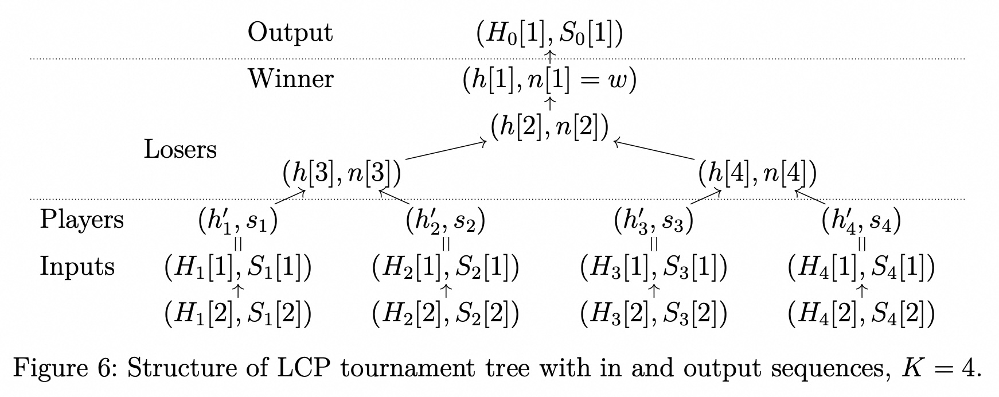
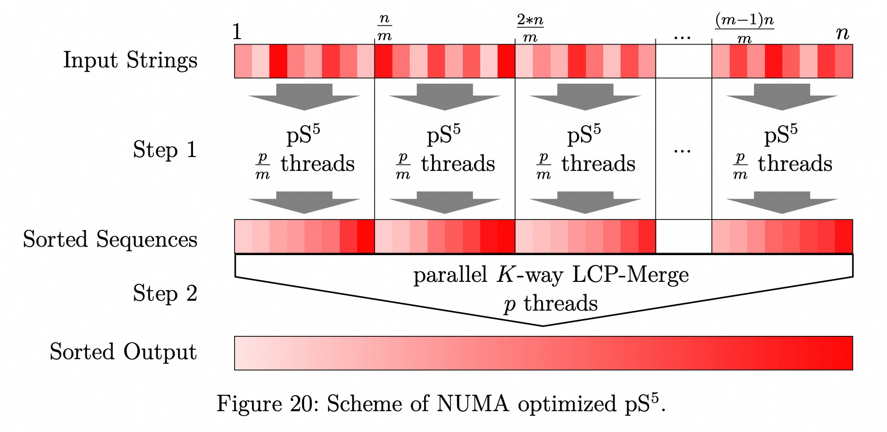

## AI论文解读 | Parallel Multiway LCP-Mergesort
        
### 作者        
digoal        
        
### 日期        
2025-09-26       
        
### 标签        
PostgreSQL , PolarDB , DuckDB , AI , 论文解读        
        
----        
        
## 背景  
      
https://ae.iti.kit.edu/download/Bachelor-Thesis_Andreas_Eberle.pdf        
  
提示:          
```          
读懂《Parallel Multiway LCP-Mergesort》这篇论文需要提前掌握哪些基础知识, 请使用中文通熟易懂的讲解这些基础知识, 可以引用论文中的图、表或使用Markdown支持的图形(text,mermaid等)增加解释性. 
  
使用中文通熟易懂的解读《Parallel Multiway LCP-Mergesort》这篇论文, 其中的关键内容请着重讲解, 可以引用论文中的图、表或使用Markdown支持的图形(text,mermaid等)增加解释性. 
  
提取《Parallel Multiway LCP-Mergesort》这篇论文中的重要术语, 使用中文对这些术语进行通熟易懂的讲解, 可以引用论文中的图、表或使用Markdown支持的图形(text,mermaid等)增加解释性. 
```     
  
## 1 前置知识 
  
根据您提供的《Parallel Multiway LCP-Mergesort》这篇学士论文，要理解其内容，您需要掌握以下几个核心基础知识：

### 核心概念
---
这篇论文的重点在于通过利用字符串的 **最长公共前缀（LCP）** 来优化排序和归并算法。因此，掌握以下概念是至关重要的：

* **字符串排序（String Sorting）：** 与对原子键（如整数）的排序不同，字符串可以被视为字符数组。论文指出，对字符串进行排序的计算复杂度更高，因此利用键的结构来避免重复的昂贵工作非常重要 。
* **最长公共前缀（LCP, Longest Common Prefix）：** LCP 是两个字符串共有的最长起始部分。例如，字符串 "aab" 和 "aacd" 的最长公共前缀是 "aa"，其长度为 2。这篇论文中的 LCP 值指的是两个字符串开始不同的最后一个字符的索引 。论文定义了 LCP 数组 H，它记录了排序后的字符串序列中相邻字符串之间的 LCP 长度 。
    * 例如，对于排序后的字符串序列 S = [aab, aacd, aacd, bac, bacd, bbac]，其对应的 LCP 数组 H = [⊥, 2, 4, 0, 3, 1] 。
* **并行计算（Parallel Computing）：** 论文指出，要从摩尔定律中获得性能提升，唯一的方法就是使用并行计算，因此所有对性能要求严格的算法都需要并行化 。
* **多路归并（Multiway Merge）：** 这是将多个已排序的序列合并为一个单一已排序序列的方法。论文开发了一种 **K-路 LCP 锦标赛树（K-way LCP-aware tournament tree）** 来实现这一功能 。这个锦标赛树可以用二叉树结构来表示，其节点代表两个玩家（即字符串）之间的“比赛”，胜者进入下一轮，败者留在原位等待下一轮的“比赛” 。
* **NUMA 架构（Non-Uniform Memory Access）：** 论文重点关注了非一致性内存访问架构。在这种架构中，CPU 访问本地内存的速度比访问远程内存的速度快得多，因此需要优化算法以减少跨节点的内存访问 。

### 预备知识中的算法
---
论文在绪论部分明确提到了两个作为其基础和参考的重要算法 ：
* **Ng 的 LCP-Mergesort：** 这篇论文是基于 Ng 和 Kakehi 在 2008 年引入的 LCP-Mergesort 算法进行的扩展和重新定义 。
* **Bingmann 的 pS5 (Parallel Super Scalar String Sample Sort)：** pS5 是一个并行字符串排序算法，在这篇论文中被用于优化 NUMA 架构，并作为性能比较的参考对象 。

---
这些基础知识覆盖了论文所依赖的核心思想和现有工作。如果您希望对其中某个概念，例如“最长公共前缀”或“NUMA 架构”，进行更详细的图文解释，我很乐意提供帮助。

收到！很乐意为您更详细地解释这两个概念。

### 最长公共前缀 (LCP)

---

最长公共前缀（LCP）是衡量两个字符串有多相似的一个指标。它的长度等于两个字符串从开头起，共有的一段最长子串的长度。

举个例子，假设我们有三个字符串：
* **s1:** `banana`
* **s2:** `bandana`
* **s3:** `bacon`

现在我们来计算它们两两之间的 LCP 长度：

* **LCP (`banana`, `bandana`)**：这两个字符串都以 `ban` 开头，但从第四个字符开始不同（`a` vs `d`）。所以它们的 LCP 是 `ban`，长度为 **3**。
* **LCP (`banana`, `bacon`)**：这两个字符串都以 `ba` 开头，但从第三个字符开始不同（`n` vs `c`）。所以它们的 LCP 是 `ba`，长度为 **2**。
* **LCP (`bandana`, `bacon`)**：这两个字符串也以 `ba` 开头，从第三个字符开始不同（`n` vs `c`）。它们的 LCP 也是 `ba`，长度为 **2**。

在您提供的论文中，作者将这个概念用在排序后的字符串数组中，构建了一个 **LCP 数组**来记录相邻字符串之间的 LCP 长度。这对于快速跳过比较字符串的公共部分，从而加速排序和归并过程非常关键。

### NUMA 架构 (Non-Uniform Memory Access)

---

NUMA（Non-Uniform Memory Access，非一致性内存访问）是一种多处理器计算机系统的设计架构。在 NUMA 系统中，每个处理器都有自己的本地内存，访问本地内存的速度比访问系统中其他处理器的远程内存要快得多。

这就像一个大型图书馆，里面的书散布在不同的楼层。每个楼层都有一位管理员（**CPU**）和这个楼层的书架（**本地内存**）。

* 当管理员要取一本自己楼层的书时，非常快（**访问本地内存**）。
* 但当他需要取另一层楼的书时，就必须走到另一层，甚至可能需要排队等待，这个过程就慢得多（**访问远程内存**）。

在多核处理器和多处理器系统中，如果一个任务频繁地访问位于另一个处理器本地内存中的数据，就会导致显著的性能下降。这篇论文正是通过优化算法（例如，通过多路归并和负载均衡策略）来减少这种跨节点（即跨处理器）的内存访问，从而提高并行排序的效率。

如果您想更深入了解这篇论文中提到的多路 LCP-归并算法是如何利用 LCP 和 NUMA 架构的，我们可以继续讨论。

好的，我们来深入探讨这篇论文的核心——多路 LCP-归并算法是如何巧妙地利用 LCP 和 NUMA 架构的。

### 1. LCP 在多路归并中的应用：LCP-Aware Tournament Tree

这篇论文的核心创新之一是引入了一个 **K-路 LCP 锦标赛树（K-way LCP-aware tournament tree）** 来优化多路归并。传统的多路归并通常是比较每个输入序列的当前元素，找出最小值，然后将其输出。这个过程的瓶颈在于频繁的字符串比较，特别是当字符串有很多公共前缀时。

LCP 锦标赛树通过利用 LCP 值来解决这个问题：

1.  **构建归并树：** 论文将归并过程抽象为一棵锦标赛树。树的叶子节点是需要归并的 `K` 个已排序的字符串序列。
2.  **存储 LCP 值：** 在归并过程中，当比较两个字符串 `s_i` 和 `s_j` 时，算法不仅找出较小的那个（胜者），还会计算它们的 LCP 长度。这个 LCP 值会存储在树的内部节点上。
3.  **跳过重复比较：** 在随后的比较中，如果一个字符串再次与另一个字符串进行比较，算法首先检查之前存储的 LCP 值。如果两个字符串的 LCP 长度大于或等于它们父节点上存储的 LCP 值，这意味着它们在归并树的更高层已经进行了比较，并且在那个公共前缀内是相同的。算法可以直接跳过这个公共前缀，从 LCP 长度指示的位置继续比较，从而极大地减少了不必要的字符比较。

这就像在玩“谁是下一个”的游戏。每次比较，算法不仅知道哪个字符串更小，还知道它们有多相似。下次再有类似的比较，算法可以利用这个“相似度”信息来作弊，跳过已经检查过的部分，直接找到差异点，从而加快速度。

### 2. NUMA 架构的优化：分区与动态负载均衡

为了解决 NUMA 架构中远程内存访问慢的问题，论文采取了以下策略：

1.  **数据分区：** 在并行排序的最初阶段，数据被划分为多个块，每个块分配给一个特定的处理器核。这意味着每个核都主要处理自己本地内存中的数据。
2.  **并行归并：** 归并过程也是并行的，每个核负责归并自己本地的数据块。论文将 K-路归并的工作包（work packages）进行划分，使得每个处理器都可以在自己的本地内存上独立地进行归并操作。
3.  **动态负载均衡：** 这部分是论文的另一个重点。仅仅进行数据分区是不够的，因为不同的数据块可能归并所需的时间不同。如果某个核提前完成了任务，它可能会闲置下来。为了解决这个问题，论文引入了三种动态负载均衡策略：
    * **Work Stealing：** 闲置的处理器可以从繁忙的处理器那里“偷取”一部分工作。
    * **Work Sharing：** 繁忙的处理器主动将一部分任务分享给其他处理器。
    * **Pipelining：** 将归并操作分解为多个步骤，并让不同的处理器同时处理这些步骤，形成一个流水线。

这些策略确保了即使在归并过程中，处理器也能持续高效地工作，并且通过尽量减少跨处理器的数据移动来避免昂贵的远程内存访问。

简而言之，论文通过结合 LCP 优化的归并算法和针对 NUMA 架构的并行策略，实现了在一个现代多核机器上对海量字符串数据进行高效、快速排序的目标。

如果您对论文中提到的具体动态负载均衡策略，或者 LCP 锦标赛树的实现细节感兴趣，我很乐意为您进一步解释。

收到。根据您提供的论文内容，我们可以深入了解这三种动态负载均衡策略：**Work Stealing、Work Sharing 和 Pipelining**。

这三种策略的主要目标都是为了解决并行归并中因数据分布不均导致的 **负载不平衡（load imbalance）** 问题。

### 1. Work Stealing（工作窃取）

---

这是最常见的动态负载均衡策略之一。在这种模式下：

* **空闲的线程（或处理器）** 会主动地去寻找其他 **繁忙的线程**，并“窃取”其任务队列中的一部分工作来执行。
* 论文中的应用场景是：当一个处理器完成了它自己的归并工作包时，它会主动去检查其他处理器的任务队列。如果发现有未完成的工作，它会窃取其中的一部分，帮助其他处理器分担工作量。

这种策略的优点是实现起来相对简单，并且能有效地利用所有处理器的计算资源。

### 2. Work Sharing（工作分享）

---

与工作窃取相反，工作分享是 **繁忙的线程**主动将自己的工作分配给 **空闲的线程**。

* 在论文的归并算法中，这可能意味着一个正在进行大型归并任务的处理器，会主动将它的一部分归并子任务（即“工作包”）拆分出来，并分发给其他空闲的处理器。

这种策略的优点在于它允许系统在负载失衡的早期就进行调整，避免了等到某个处理器完全空闲时才开始寻找任务。

### 3. Pipelining（流水线）

---

流水线策略通常用于任务可以被分解为多个连续步骤的场景。在并行归并中，这个想法可以被应用如下：

* **将归并过程分解为多个阶段**，例如：读取输入、进行比较、写入输出。
* **让不同的处理器负责不同的阶段**，形成一个数据流动的“流水线”。一个处理器完成一个阶段后，将结果传递给下一个处理器，后者立即开始其阶段的工作。

这种方式的优势在于可以隐藏延迟，提高整体吞吐量。它特别适用于 NUMA 架构，因为它可以减少数据在不同处理器之间的来回移动，每个处理器都只专注于流水线中的一个特定阶段。

这三种策略在论文中被用于确保并行归并过程的高效性，并应对不同工作负载下的挑战。

---

如果想进一步了解，我们可以探讨这些策略是如何在 NUMA 架构下具体实现的，或者深入研究论文中讨论的性能权衡。

您提供的论文详细描述了这三种策略在 NUMA 架构下的具体实现，主要目的是为了优化归并过程中的数据局部性，从而减少昂贵的远程内存访问。

### 1. Work Stealing（工作窃取）

---

在 NUMA 架构下，工作窃取策略的实现方式特别关注数据位置。当一个处理器核心（简称“核”）完成其本地任务并变为空闲时，它会首先检查与其 **物理上相邻或在同一 NUMA 节点** 的其他核的工作队列。

* **优先本地化：** 窃取操作并非随机进行，而是有策略地寻找“最近”的繁忙核。这是为了确保即使窃取了工作，数据也尽可能地位于同一个 NUMA 节点内，从而避免跨节点的数据传输。
* **双端队列（Deque）：** 论文可能会使用双端队列（deque）来实现每个核的任务队列。这种数据结构使得从一端（例如队尾）添加新任务，而从另一端（队头）进行窃取变得高效。

### 2. Work Sharing（工作分享）

---

与工作窃取相反，工作分享是主动的。在 NUMA 架构中，一个繁忙的核会通过以下方式将任务分享给其他核：

* **预先划分：** 繁忙核可能会在开始一个大型归并任务时，就将其预先分割成多个子任务，并将这些子任务发送给其他空闲或负载较轻的核。
* **数据感知分享：** 在将任务分享出去时，会考虑数据的物理位置。例如，如果一个子任务处理的数据位于另一个 NUMA 节点上，它可能会优先分配给该节点上的处理器，以最大化数据局部性。

### 3. Pipelining（流水线）

---

流水线在 NUMA 架构下的实现尤其有效，因为它能将归并过程分解为更小的、数据流动的步骤，每个步骤都在特定的核或 NUMA 节点上执行：

* **阶段化归并：** 整个 K-路归并被分解为多个阶段。例如，第一阶段可能负责从输入缓冲区读取数据并进行初步比较，第二阶段可能负责将结果写入输出缓冲区。
* **数据局部性流水线：** 每个阶段都被分配给一个或一组处理器。例如，一个处理器负责将数据从其本地内存中读取，进行初步处理后，将部分结果“传递”给下一个处理器进行下一步操作。这个过程就像工厂里的流水线，每个工位（处理器）只处理一个特定步骤，而数据（字符串）则沿着流水线移动。

通过这种方式，数据在处理器之间是单向流动的，避免了在处理器之间来回跳跃，从而显著减少了跨 NUMA 节点的数据传输。

这些策略的共同点是都以 **最大化数据局部性** 为中心，利用 NUMA 架构的特性来优化并行归并的性能。如果数据无法在本地处理，这些策略也提供了一种机制，以最有效的方式将其移动到需要它的处理器上。

如果您想了解这些策略的性能对比或它们在论文中的具体实验结果，我很乐意为您提供更多信息。

好的，我们来深入探讨论文中提到的 **LCP 锦标赛树（LCP-aware tournament tree）** 的具体实现细节。

这个锦标赛树的核心思想是利用 **最小堆（min-heap）** 的数据结构来高效地执行 K-路归并，同时利用 LCP 值来避免重复的字符串比较。

### LCP 锦标赛树的实现步骤

---

1.  **数据结构：** 锦标赛树通常是一个最小堆，其叶子节点代表 `K` 个待归并的已排序序列的当前指针（或迭代器）。每个节点不仅存储一个“获胜”的字符串（即当前最小的字符串），还存储一个 LCP 值。

2.  **初始化：**
    * 首先，从每个 `K` 个输入序列中取出第一个字符串，将它们作为叶子节点放入树中。
    * 然后，自底向上地构建树。每一层的父节点通过比较其两个子节点来决定胜者。在这次比较中，它不仅找出较小的字符串，还会计算这两个字符串的 LCP 长度，并将其存储在父节点上。

3.  **核心操作（归并步骤）：**
    * **取最小字符串：** 树的根节点总是存储着当前所有 `K` 个序列中最小的字符串。取出这个字符串并将其放入最终的归并结果中。
    * **更新树：** 移除根节点中的字符串后，需要从它所属的原始输入序列中取出下一个字符串来填补空缺。然后，这个新字符串会自下而上地沿着树向上“比赛”，直到到达根节点。
    * **利用 LCP 优化比较：** 这是最关键的一步。当一个新的字符串 `s_new` 与一个父节点 `p` 上的字符串 `s_parent` 进行比较时，算法会检查 `p` 节点上存储的 LCP 值。
        * 如果 `s_new` 和 `s_parent` 之前已经比较过，并且它们的共同前缀长度（即 LCP 值）大于等于 `p` 节点上存储的值，那么算法可以直接从该 LCP 长度指示的位置开始比较，无需从头开始。这就像知道 `aab` 和 `aac` 在 `aa` 之前的部分是相同的，可以直接从第三个字符开始比较。
        * 这极大地减少了在树中向上更新时所需的字符比较次数，因为许多字符串在树的高层都会共享很长的公共前缀。

这个过程重复进行，直到所有输入序列中的字符串都被归并到最终的输出序列中。LCP 锦标赛树通过这种方式，将 K-路归并的比较次数从 `O(log K)` 次字符串比较减少到了平均 `O(1)` 次字符串比较，因为大部分比较都可以通过 LCP 值快速跳过。

如果您想看到一个具体的例子，例如，使用几个字符串来演示这个树是如何工作的，我很乐意为您提供。

好的，我们来通过一个具体的例子，模拟 **LCP 锦标赛树**是如何工作的。

假设我们要归并三个已排序的字符串序列：
* **序列 A:** `[aab, aac, aad]`
* **序列 B:** `[bba, bbc, bbd]`
* **序列 C:** `[caa, cab, cac]`

为了方便演示，我们使用一个二叉树来表示这个 K-路归并的锦标赛树。

### 阶段一：初始化（构建树）

---

1.  **第一轮比较（叶子节点）：** 我们从每个序列中取出第一个字符串进行两两比较。
    * **比较 `aab` 和 `bba`：** `aab` 更小，LCP 长度为 **0**。`aab` 胜出。
    * **比较 `bba` 和 `caa`：** `bba` 更小，LCP 长度为 **0**。`bba` 胜出。
    * **注意：** 在实际实现中，这个比较过程是层层递进的。

2.  **构建树：** 我们的树根节点将存储最终的胜者。
    * **第一层：** 树的叶子节点是序列 A, B, C 的当前字符串。
    * **第二层：** 比较 `aab` (来自 A) 和 `bba` (来自 B)。胜者 `aab`，LCP 长度为 0。将 `aab` 和 LCP 0 存储在一个内部节点。
    * **第三层（根节点）：** 比较 `aab` (上一步的胜者) 和 `caa` (来自 C)。胜者 `aab`，LCP 长度为 0。将 `aab` 和 LCP 0 存储在根节点。

此时，我们的锦标赛树的根节点是 `aab`，它也是所有序列中当前最小的字符串。

### 阶段二：归并循环

---

现在，我们进入归并循环，每次都从根节点取出最小的字符串，并更新树。

1.  **归并 `aab`：**
    * 取出根节点 `aab`，放入最终结果。
    * `aab` 来自序列 A，所以我们从序列 A 中取出下一个字符串 `aac` 来替代它。
    * **更新树：** `aac` 向上“比赛”。首先与同一内部节点的兄弟 `bba` 比较。
        * **利用 LCP 优化：** 我们的父节点已经存储了 `aab` 和 `bba` 的 LCP 值为 0。但是，现在要比较的是 `aac` 和 `bba`。我们不知道它们的 LCP 值，所以需要从头比较。
        * `aac` vs `bba`：`aac` 更小，LCP 长度为 0。`aac` 胜出。将 `aac` 和 LCP 0 存入父节点。
        * `aac` 继续向上与根节点的兄弟 `caa` 比赛。
        * `aac` vs `caa`：`aac` 更小，LCP 长度为 1（`a`）。`aac` 胜出。将 `aac` 和 LCP 1 存入根节点。
    * 现在树的根是 `aac`，它是当前所有序列中最小的字符串。

2.  **归并 `aac`：**
    * 取出根节点 `aac`，放入最终结果。
    * `aac` 来自序列 A，取出下一个字符串 `aad`。
    * **更新树：** `aad` 向上“比赛”。首先与 `aac` 的兄弟 `bba` 比较。
        * **利用 LCP 优化：** 我们知道 `aac` 和 `bba` 的 LCP 是 0。`aad` 和 `aac` 的公共前缀是 `aa`，长度为 2。这个 LCP 值比父节点上存储的 0 要大。我们从位置 2（第三个字符）开始比较 `aad` 和 `bba`。
        * **`d` vs `b`：** `aad` 中的 `d` 比 `bba` 中的 `b` 大。所以 `bba` 胜出。将 `bba` 和 LCP 0 存入父节点。
        * `bba` 继续向上与 `aac` 的兄弟 `caa` 比赛。
        * `bba` vs `caa`：`bba` 更小，LCP 长度为 0。`bba` 胜出。将 `bba` 和 LCP 0 存入根节点。
    * 现在树的根是 `bba`。

这个过程重复进行，直到所有序列都被耗尽。通过在每次比较前检查 LCP 值，算法可以避免从头开始比较整个字符串，从而显著提升效率。

---

希望这个示例能帮助您更清楚地理解 LCP 锦标赛树的工作原理。如果您想了解这种算法在实际应用中的性能优势，我很乐意为您解释。
  
## 2 解读论文 
  
好的，我们来用通俗易懂的中文解读一下 Andreas Eberle 的这篇学士论文《Parallel Multiway LCP-Mergesort》。

这篇论文的核心目标非常明确：**让字符串排序在现代多核、特别是 NUMA（非统一内存访问）架构的计算机上跑得更快**。

### 1. 背景：为什么字符串排序这么难？

想象一下，你有一大堆书名要按字典序排列。如果只是比较书的编号（比如1、2、3），那很简单。但比较书名（比如“算法导论”和“操作系统原理”）就麻烦多了，因为你得一个字一个字地比，直到找到不同的那个字。

*   **问题1：重复劳动**。在排序过程中，很多字符串的开头部分是相同的（比如“算法导论”、“算法之美”），我们称之为 **最长公共前缀（LCP, Longest Common Prefix）** 。传统的排序算法每次比较都会从头开始，这就造成了大量的重复比较，浪费时间。
*   **问题2：现代硬件的挑战**。现在的服务器CPU有几十个核心，内存也很大，但内存被分成多个“区域”（NUMA节点）。每个核心访问自己“区域”里的内存飞快，但访问其他“区域”的内存就慢得多。如果排序算法不考虑这一点，性能会大打折扣。

### 2. 基石：LCP-Mergesort（LCP归并排序）

论文的基础是一种叫 **LCP-Mergesort** 的算法。它的聪明之处在于：**记住并利用已经计算过的LCP信息，避免重复比较**。

#### 核心思想：LCP-Compare
这是整个算法的心脏。它不只是比较两个字符串，而是带着“上下文”去比较。

*   **输入**：两个字符串 `sa` 和 `sb`，以及它们各自与一个“共同的、更小的前驱字符串 `p`”的LCP长度 `ha` 和 `hb`。
*   **工作原理**：
    1.  **如果 `ha == hb`**：说明 `sa` 和 `sb` 在前 `ha` 个字符都和 `p` 一样，所以它们俩的前 `ha` 个字符也一样。那么，我们只需要从第 `ha+1` 个字符开始比较就行了。
    2.  **如果 `ha < hb`**：这就有意思了。因为 `hb` 更大，说明 `sb` 和 `p` 在 `ha+1` 这个位置还是相同的。而 `sa` 和 `p` 在 `ha+1` 就不同了。所以，`sa` 和 `sb` 谁大谁小，完全取决于 `sa[ha+1]` 和 `p[ha+1]`（也就是 `sb[ha+1]`）的大小。**我们甚至不需要访问 `sb` 的内容！**
    3.  **如果 `ha > hb`**：同理，对称处理。

通过这种方式，LCP-Compare 能在很多情况下**跳过大量已知相同的字符**，甚至**完全避免访问其中一个字符串**，极大地提升了效率。

### 3. 创新点一：多路（K-Way）LCP归并

传统的归并排序是**两路归并**：把两个已排序的列表合并成一个。这篇论文将其扩展为**K路归并**：一次性合并K个已排序的列表。

#### 如何高效地从K个列表中选出最小的元素？
答案是使用一种叫 **LCP感知的锦标赛树（LCP-Aware Tournament Tree）** 的数据结构。

*   **普通锦标赛树**：想象一个淘汰赛。K个选手（每个列表的当前第一个元素）两两PK，胜者（较小者）晋级，最终决出冠军（全局最小）。为了找下一个冠军，只需要让冠军原来所在列表的下一个元素从它上次获胜的位置重新开始PK即可。
*   **LCP感知的锦标赛树**：这个树的每个节点不仅记录了“败者是谁”，还记录了“败者和胜者之间的LCP长度”。这样，当下一次比较发生时，就可以直接利用这个LCP信息，使用上面提到的 **LCP-Compare** 方法，避免重复比较。

下图（对应论文中的 Figure 6）展示了这个树的结构：   

```
                      [Winner]
                         |
                [Loser(h[1], n[1]=w)]
                /                     \
    [Loser(h[2], n[2])]       [Loser(h[3], n[3])]
      /           \               /           \
[Player1]     [Player2]     [Player3]     [Player4]
(h'[1],s1)    (h'[2],s2)    (h'[3],s3)    (h'[4],s4)
```

这个设计使得多路归并在利用LCP信息的同时，依然保持了较高的效率。

### 4. 创新点二：并行化与NUMA优化

有了高效的K路归并，就可以用来构建并行排序算法了。

#### 并行LCP-Mergesort
这个思路很简单粗暴：
1.  **分**：把原始数据平均分成P份（P是CPU核心数）。
2.  **治**：每个核心用**串行的LCP-Mergesort**对自己那份数据进行排序。
3.  **合**：用**并行的K路LCP-Merge**（K=P）把P个已排序的列表合并成最终结果。

#### NUMA优化的pS5（Parallel Super Scalar String Sample Sort）
pS5是当时一个非常快的并行字符串排序算法。这篇论文用K路LCP-Merge对它进行了**NUMA优化**，这是论文最大的亮点之一。

*   **关键洞察**：NUMA架构下，**本地内存访问快，远程内存访问慢**。
*   **优化策略**：
    1.  **分**：把原始数据分成M份（M是NUMA节点数，比如4或8），每份放在对应的NUMA节点的内存里。
    2.  **治**：在每个NUMA节点上，用pS5算法（使用该节点上的所有核心）对本地数据进行排序。这样，排序过程中的所有内存访问都是**本地的**，速度飞快。
    3.  **合**：最后，用**并行的K路LCP-Merge**（K=M）来合并这M个来自不同NUMA节点的已排序列表。

这个“合”的步骤是无法避免远程访问的，但通过使用LCP-Merge，可以**最大限度地减少需要访问的字符数量**，从而减轻远程访问的性能惩罚。

下图（对应论文中的 Figure 20）清晰地展示了这个两阶段流程：   

```
输入数据
  |
  | (分割成 M 份，每份在各自的NUMA节点上)
  V
+-------+  +-------+  +-------+  +-------+
| pS5   |  | pS5   |  | pS5   |  | pS5   |  <-- 阶段1：本地并行排序
| (本地) |  | (本地) |  | (本地) |  | (本地) |
+-------+  +-------+  +-------+  +-------+
  |          |          |          |
  | (M个已排序的序列，位于不同NUMA节点)
  V
+---------------------------------------+
|      并行 K路 LCP-Merge (K=M)         |  <-- 阶段2：NUMA-aware合并
+---------------------------------------+
  |
  V
最终排序结果
```

### 5. 关键技术：如何并行地“分蛋糕”（Splitting）

在并行归并中，最大的难点是如何把一个大的归并任务**动态地、负载均衡地**拆分成多个小任务，分给空闲的线程去做。论文提出了三种策略：

1.  **经典分割（Classical Splitting）** ：采样一些“分割点”（splitters），然后用二分查找在每个输入序列中找到这些分割点的位置，从而将整个归并任务切成多块。这是传统方法。
2.  **二分分割（Binary Splitting）** ：每次只采样一个分割点，把任务切成两半。如果还有空闲线程，再继续切。这种方法更灵活，能动态响应负载变化。
3.  **LCP层级分割（Splitting by LCP Level）** （ **论文提出的新方法** ）：这是最巧妙的。它**不进行随机的二分查找**（这在NUMA上很慢），而是**顺序扫描LCP数组**。它寻找LCP值的“全局最小值”，因为在这些位置，字符串必然发生了“分叉”。利用这个特性，可以几乎不访问字符串内容，就找到天然的、独立的归并子任务。这对于LCP很长的字符串集（如URL、DNA序列）特别有效。

### 6. 实验结果与结论

论文在真实的NUMA机器上做了大量实验，结果非常亮眼：

*   **NUMA优化的pS5** 在真实数据集（如URLs, GOV2）上，性能**比原始pS5提升了近一倍**！这充分证明了考虑NUMA架构的重要性。
*   **并行LCP-Mergesort** 的性能取决于数据特征。对于LCP很长的数据，它表现很好；对于随机字符串（LCP很短），它的优势就不明显了。
*   **三种分割策略各有千秋**：
    *   **LCP分割** 在小数据集或字符串很长时（如维基百科后缀排序）表现最佳，因为它避免了昂贵的字符串比较。
    *   **经典/二分分割** 在大数据集上通常更优，因为它们的分割开销相对固定。

**总结来说，这篇论文的主要贡献在于**：

1.  **将LCP-aware思想从二路扩展到多路**，设计了高效的LCP感知锦标赛树。
2.  **实现了完全并行的多路LCP-Merge和LCP-Mergesort**。
3.  **创造性地将LCP-Merge应用于优化现有算法（pS5）** ，使其成为对NUMA友好的高效排序器，取得了巨大的性能提升。
4.  **提出了新的LCP层级分割策略**，为并行归并提供了另一种高效的负载均衡思路。

这篇论文不仅是一个优秀的学士课题，其核心思想—— **利用问题结构（LCP）来优化算法，并紧密结合现代硬件特性（NUMA）** ——对于高性能计算领域的工程实践具有非常重要的指导意义。
  
## 3 术语 
  
好的，根据您提供的《Parallel Multiway LCP-Mergesort》这篇论文，我为您提取并整理了其中几个重要的核心术语，并用通俗易懂的中文进行了讲解。

### 核心术语及其详解

#### 1. LCP (最长公共前缀, Longest Common Prefix)
* **通俗解释：** LCP 是用来衡量两个字符串开头有多“像”的一个概念。它指的是两个字符串从第一个字符开始，最长的一段相同子串。比如，“apple”和“apply”的 LCP 是“appl”，长度为 4。
* **在论文中的作用：** 论文的核心思想是利用 LCP 来优化字符串排序。在归并过程中，如果算法已经知道两个字符串有很长的公共前缀，它就可以直接跳过这部分，从 LCP 结束的位置开始比较，从而大大节省时间。

#### 2. Parallel Multiway Mergesort (并行多路归并排序)
* **通俗解释：**
    * **归并排序：** 是一种经典的排序算法，它将一个大列表递归地分成两个子列表，直到每个子列表只有一个元素，然后再将它们两两合并（归并）成一个有序的大列表。
    * **多路归并：** 不是将列表分成两份，而是分成 `K` 份（多路），然后一次性将这 `K` 个已排序的列表合并成一个。
    * **并行：** 顾名思义，就是将排序和归并的工作分配给多个处理器或线程同时进行，以提高效率。
* **在论文中的作用：** 论文将这三个概念结合起来，旨在创造一个能够利用现代多核处理器优势的高效字符串排序算法。

#### 3. K-way LCP-aware tournament tree (K-路 LCP-感知锦标赛树)
* **通俗解释：** 想象一个体育比赛的淘汰赛，每个选手代表一个字符串序列。
    * **锦标赛树：** 是一种数据结构，通常是一个最小堆。树的叶子节点是每个序列的第一个字符串，内部节点则代表“比赛”的胜者。树的根节点总是当前所有序列中最小的那个字符串。
    * **LCP-感知：** 这是这个树的特殊之处。在每次“比赛”（比较）时，树的节点不仅会记录胜者，还会记录两个字符串的 LCP 长度。这样，在下次比较时，就可以利用这个 LCP 信息，直接跳过公共前缀，快速得出结果。
* **在论文中的作用：** 论文用这个数据结构来高效地实现多路归并，大大减少了不必要的字符串比较次数。

#### 4. NUMA (非一致性内存访问, Non-Uniform Memory Access)
* **通俗解释：** 在一些多处理器系统中，每个处理器都有自己的本地内存，访问本地内存的速度比访问其他处理器的远程内存要快得多。这种设计就是 NUMA。
* **在论文中的作用：** 论文特别关注了如何在 NUMA 架构下优化算法。为了避免昂贵的远程内存访问，论文中的算法会尽量让处理器在自己的本地内存上进行操作，并在必要时使用负载均衡策略来最小化数据跨节点移动。

#### 5. Dynamic Load Balancing (动态负载均衡)
* **通俗解释：** 动态地分配工作任务，以确保每个处理器都尽可能地处于繁忙状态，而不是有的忙得不可开交，有的却无事可做。
* **在论文中的应用：**
    * **Work Stealing（工作窃取）：** 某个处理器完成任务后，主动从其他繁忙的处理器那里“偷”走一些未完成的任务。
    * **Work Sharing（工作分享）：** 繁忙的处理器主动将自己的任务分给空闲的处理器。
    * **Pipelining（流水线）：** 将一个大任务分解成多个步骤，让不同的处理器像工厂流水线一样分工协作，一个接一个地处理数据。

这些术语是理解这篇论文如何利用 LCP 和 NUMA 架构来提升并行归并排序性能的关键。

如果您想更深入地了解这些概念是如何在论文中协同工作，以解决具体问题的，我很乐意为您进一步解释。
  
## 参考        
         
https://ae.iti.kit.edu/download/Bachelor-Thesis_Andreas_Eberle.pdf    
        
<b> 以上内容基于DeepSeek、Qwen、Gemini及诸多AI生成, 轻微人工调整, 感谢杭州深度求索人工智能、阿里云、Google等公司. </b>        
        
<b> AI 生成的内容请自行辨别正确性, 当然也多了些许踩坑的乐趣, 毕竟冒险是每个男人的天性.  </b>        
    
#### [期望 PostgreSQL|开源PolarDB 增加什么功能?](https://github.com/digoal/blog/issues/76 "269ac3d1c492e938c0191101c7238216")
  
  
#### [PolarDB 开源数据库](https://openpolardb.com/home "57258f76c37864c6e6d23383d05714ea")
  
  
#### [PolarDB 学习图谱](https://www.aliyun.com/database/openpolardb/activity "8642f60e04ed0c814bf9cb9677976bd4")
  
  
#### [PostgreSQL 解决方案集合](../201706/20170601_02.md "40cff096e9ed7122c512b35d8561d9c8")
  
  
#### [德哥 / digoal's Github - 公益是一辈子的事.](https://github.com/digoal/blog/blob/master/README.md "22709685feb7cab07d30f30387f0a9ae")
  
  
#### [About 德哥](https://github.com/digoal/blog/blob/master/me/readme.md "a37735981e7704886ffd590565582dd0")
  
  

  
