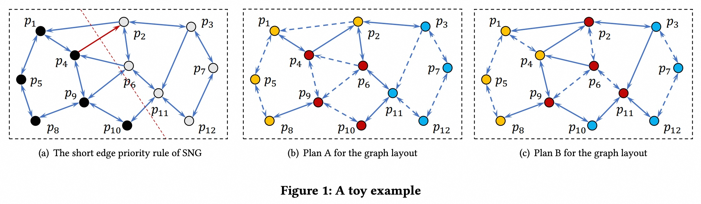
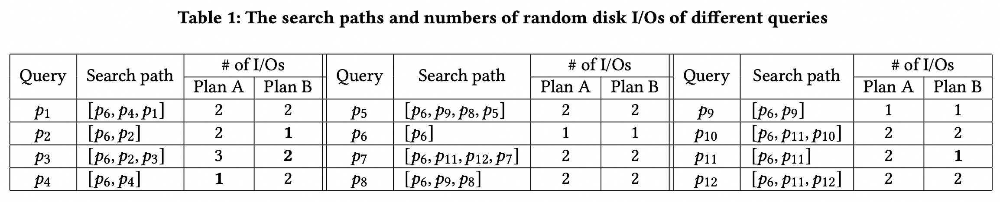
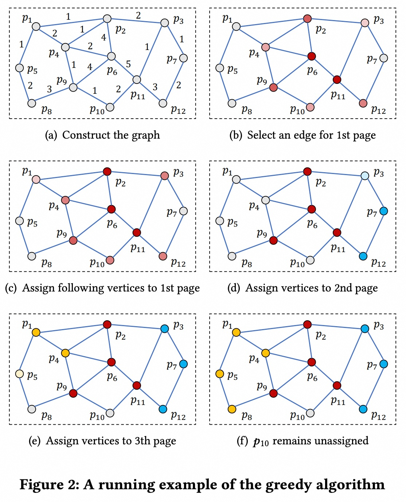
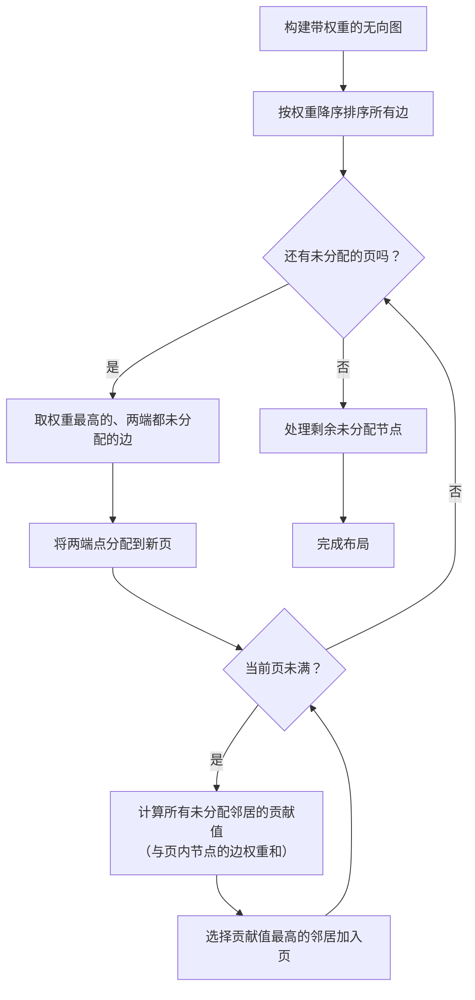
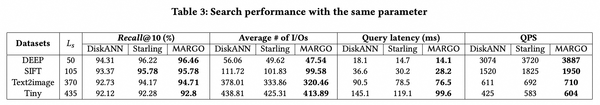

## AI论文解读 | Select Edges Wisely: Monotonic Path Aware Graph Layout Optimization for Disk-based ANN Search
        
### 作者        
digoal        
        
### 日期        
2025-09-26       
        
### 标签        
PostgreSQL , PolarDB , DuckDB , AI , 论文解读        
        
----        
        
## 背景  
      
https://dl.acm.org/doi/pdf/10.14778/3749646.3749697        
  
提示:          
```          
读懂《Select Edges Wisely: Monotonic Path Aware Graph Layout Optimization for Disk-based ANN Search》这篇论文需要提前掌握哪些基础知识, 请使用中文通熟易懂的讲解这些基础知识, 可以引用论文中的图、表或使用Markdown支持的图形(text,mermaid等)增加解释性. 
  
使用中文通熟易懂的解读《Select Edges Wisely: Monotonic Path Aware Graph Layout Optimization for Disk-based ANN Search》这篇论文, 其中的关键内容请着重讲解, 可以引用论文中的图、表或使用Markdown支持的图形(text,mermaid等)增加解释性. 
  
提取《Select Edges Wisely: Monotonic Path Aware Graph Layout Optimization for Disk-based ANN Search》这篇论文中的重要术语, 使用中文对这些术语进行通熟易懂的讲解, 可以引用论文中的图、表或使用Markdown支持的图形(text,mermaid等)增加解释性. 
```     
  
## 1 前置知识 
  
您好，要读懂这篇关于“单调路径感知图布局优化”的论文，您需要提前掌握以下几个核心基础知识。这些知识点环环相扣，理解了它们，就能抓住论文的创新点。

### 1. 近似最近邻（ANN）搜索

* **什么是ANN搜索？** 简单来说，ANN搜索就是在大规模数据集中，快速找到与给定查询点最相似或最接近的K个数据点（即“邻居”）。与精确搜索（Exact NN）相比，ANN牺牲了一定的准确率（即找到的邻居可能不是100%精确的），但换来了搜索速度的大幅提升 。这在处理海量向量数据时至关重要，例如在大型语言模型（LLM）中查找相关知识或在推荐系统中进行项目匹配 。

### 2. 基于图的索引

* **核心思想：** 这是ANN搜索的一种高效方法 。它将数据点表示为图中的节点（顶点），数据点之间的相似性关系则用图中的边来表示 。
* **如何搜索：** 搜索从一个入口点开始，通过评估当前节点邻居到查询点的距离，贪婪地沿着距离递减的方向（即距离查询点越来越近的方向）在图上“漫步” 。当到达一个其所有邻居都比它离查询点更远的节点时，搜索通常就结束了 。
* **问题所在：** 传统的基于图的索引通常需要将整个图结构和原始向量都存储在内存中 。对于海量数据集，这会导致巨大的内存消耗（例如，百亿级数据集可能需要1100GB的内存），从而限制了其应用。

### 3. 基于磁盘的ANN搜索与数据局部性

* **为什么需要基于磁盘？** 为了解决内存瓶颈问题，研究人员开始探索将图索引存储在廉价的磁盘上 。但这也带来了新的挑战：**随机磁盘I/O**。当搜索从一个节点跳转到位于磁盘上不同页面的另一个邻居时，就会触发一次耗时的随机I/O 。
* **数据局部性（Data Locality）：** 如果能将搜索路径上紧密相关的节点尽量放在磁盘上的同一个页面中，就可以减少随机I/O，从而大幅提高搜索效率 。这就是“图布局优化”（Graph Layout Optimization, GLO）的目标 。

### 4. 单调路径（Monotonic Path）与SNG

* **单调路径（Monotonic Path）：** 顾名思义，它是一种特殊的搜索路径，路径上每个节点都比前一个节点更接近查询点 。基于贪婪搜索策略，ANN搜索路径本质上就是单调路径 。
* **稀疏邻居图（SNG）：** 这是一种具有单调路径属性的图索引 。它的核心思想是 **“短边优先规则”** ：在构建图时，如果一个边已经建立，它会“遮挡”（occlude）那些离它更远、更长的、指向同一方向的冗余边 。这保证了图的稀疏性，同时仍能保持单调路径的特性 。

### 5. 图布局优化（GLO）的核心思想

论文认为，图布局优化的本质不是简单地将每个节点和它的邻居放在同一个页面里，而是要**明智地选择“重要的”边**，并确保这些边的两个端点都位于同一个页面中 。

* **传统方法（如Starling）：** 之前的研究（如Starling）将所有边都视为同样重要 。其目标是最大化同一页面内边的数量 。
    * Starling的目标函数：`F_Starling = Σ(p,p*)∈E * I(B(p)=B(p*))` 
    * `I(B(p)=B(p*))`是一个指示函数，如果边`(p, p*)`的两个端点在同一个页面，则值为1，否则为0 。

* **论文的创新点（MARGO）：** 论文提出，不同边在搜索路径中被访问的频率不同，因此其“重要性”也不同 。论文的例子（图1和表1）很好地说明了这一点：     

    * 图1(b)的布局方案A有19条边在同一页面内 ，而图1(c)的方案B只有16条 。根据Starling的目标函数，方案A优于方案B 。
    * 但如果从实际搜索路径来看（见表1），方案B需要的总I/O次数反而比方案A少 。这是因为方案B成功地将一些**更常被搜索路径经过的“重要”边**（如`(p6, p11)`）放在了同一页面中，而方案A虽然同页面的边更多，但这些边可能不常被访问 。

    这篇论文的核心贡献就是提出了一种新的目标函数，通过给每条边赋予一个基于单调路径的权重`w(p,p*)`来量化其重要性，从而优先优化那些“重要”的边 。

---

您想更深入地了解一下论文中提出的，用于提高效率和并行处理的“两阶段解耦”方法吗？

这篇论文中提到的“两阶段解耦”方法，是其提出的MARGO算法中，为了提高效率和实现并行处理而设计的一种核心策略。

简单来说，它的目的是将一个复杂的、全局性的图布局优化问题，分解为两个更小、更易于管理和并行处理的子问题。

### 第一个阶段：处理簇内（Intra-cluster）的边

* **核心思想：** 在这个阶段，算法首先将所有数据点（节点）根据某种聚类方法进行分组，形成多个独立的“簇”（cluster）。
* **操作方式：** 然后，它只专注于优化每个簇内部的边。由于每个簇内部的优化是相互独立的，因此可以对所有簇同时进行处理，从而实现**大规模的并行化**。
* **目的：** 这能够显著减少计算的复杂性，并且由于每个簇的规模相对较小，可以将它们装入内存中，进一步提高处理速度。

### 第二个阶段：处理簇间（Inter-cluster）的边

* **核心思想：** 在完成簇内边的优化之后，算法进入第二个阶段，处理那些连接不同簇的边。
* **操作方式：** 这一阶段不再需要考虑簇内的局部结构，而是将每个簇视为一个“宏观”的实体，然后优化簇与簇之间的连接。

这种“先局部，后全局”的解耦策略，实现了从整体到部分的简化：

* **效率提升**：将一个全局的、高维的优化问题，转化为多个低维、可并行的局部优化问题，极大地减少了计算开销。
* **并行化处理**：由于第一个阶段可以完全并行执行，因此特别适合在多核处理器或分布式计算环境中进行大规模的图索引构建。

---
您想更深入地了解一下论文中提到的，用于实现这种优化的“贪心算法”吗？

《Select Edges Wisely》这篇论文中提到的**贪心算法**是实现其核心思想（即优化那些在单调路径中权重高的边）的关键。该算法的设计非常巧妙，它通过一个迭代过程，逐步构建出最优的图布局。

### 贪心算法的核心思想

这个贪心算法可以被视为一个**边的选择和布局过程**。它不像传统方法那样，试图将所有边都塞进同一个磁盘页面。相反，它遵循“**重要性优先**”的原则，专注于那些对搜索效率影响最大的边。

算法的主要步骤如下：

1.  **为每条边赋予权重：** 首先，算法会为图中所有潜在的边计算一个权重，这个权重代表了该边在单调路径中的重要性。权重越高的边，被访问的概率越大，因此也越重要。
2.  **按权重降序排序：** 接下来，所有边都会根据其权重从高到低进行排序。
3.  **迭代放置**：算法开始迭代遍历这个已排序的边列表。对于每一条边 `(u, v)`：
    * **检查：** 它会检查将这条边的两个端点 `u` 和 `v` 放置在同一个磁盘页面中是否可能。
    * **放置：** 如果可以，它就会做出这个**贪心选择**——将 `u` 和 `v` 放入同一个页面。如果无法同时放入，它就跳过这条边，继续处理下一条。
4.  **最终布局**：当遍历完所有边后，最终的布局就形成了。这个布局会尽可能地将高权重的边（也就是那些对搜索效率至关重要的边）的端点放在一起，从而最大化整体的性能收益。

### 为什么说这是贪心算法？

* **局部最优选择**：在每一步迭代中，算法都只做当前看来最好的选择——处理当前权重最高的边。
* **不考虑未来**：它不考虑将当前这条边放入同一个页面是否会影响未来放置更低权重的边。它假设当前的最优选择，最终会导向一个全局接近最优的结果。

在ANN搜索场景下，这种贪心策略是有效的，因为它高度符合 **“二八法则”** ：在图搜索中，大部分查询的效率都取决于少数几条关键的、高权重的边。因此，优先处理这些边能够带来最大的性能提升。

---
您想了解一下论文中如何具体计算每条边的权重，以判断其重要性吗？

在这篇论文中，边的权重计算是其核心思想的具象化，它直接决定了哪些边被认为是“重要的”。论文引入了 **单调路径感知（monotonic path-aware）** 的概念，来为每条边赋予一个权重。

### 边的权重计算公式

论文提出，一条边 `(p, p*)` 的权重 `w(p, p*)` 是基于其在单调路径上被访问的概率。具体来说，权重等于所有可能的查询 `q` 在其贪心搜索路径上经过该边的概率之和。

$$w(p,p*) = \sum_{q\in Q} \mathbb{P}[(p,p^*) \in \text{path}(q)]$$

* `Q` 是所有可能的查询点的集合。
* `path(q)` 是从一个随机入口点开始，到查询 `q` 的贪心搜索路径。
* `\mathbb{P}[(p,p^*) \in \text{path}(q)]` 是这条边 `(p, p*)` 出现在路径 `path(q)` 上的概率。

### 为什么这个权重很重要？

* **量化重要性：** 这个公式将边的“重要性”从一个模糊的概念，量化为一个具体的数值。权重越高，意味着这条边越有可能成为搜索路径的一部分，因此将其端点放在同一个磁盘页面中的收益也就越大。
* **指导布局优化：** 在构建图布局时，算法会优先处理这些权重高的边，确保它们能够享受到数据局部性带来的I/O性能提升。

### 如何近似计算这个权重？

在实际应用中，遍历所有可能的查询 `q` 是不现实的。因此，论文采用了**采样**的方法进行近似计算：

1.  **随机采样查询点：** 从数据集中随机抽取一小部分数据点作为查询点。
2.  **模拟搜索：** 对于每一个采样的查询点，模拟一次贪心搜索过程。
3.  **计数：** 在模拟过程中，记录每一条被遍历过的边。
4.  **计算权重：** 边的权重就是其在所有模拟搜索中出现的频率。

通过这种方式，算法可以在不进行穷举搜索的情况下，高效地得到一个足够精确的边的权重分布，从而指导后续的图布局优化。

---
您想了解一下论文中提到的，用于评估这种布局优化方法性能的指标吗？

好的，这篇论文主要用以下几个指标来评估其提出的**MARGO**（monotonic path-aware graph layout optimization）方法的性能：

### 1. **搜索性能**

这是最核心的评估指标，主要关注在进行近似最近邻（ANN）搜索时，优化的图布局能否带来实际的速度提升。

* **查询处理时间（Query Processing Time）** ：衡量从发出查询到得到结果所花费的总时间。这个时间通常由两部分组成：
    * **I/O时间**：从磁盘读取数据块（页面）的时间。这是**MARGO**方法着重优化的部分。
    * **计算时间**：在内存中对数据点进行距离计算、比较等操作的时间。
* **平均查询时间（Average Query Time）** ：通过对大量随机查询进行测试，计算平均的查询处理时间，这个指标能更全面地反映算法的整体性能。

### 2. **数据局部性**

这个指标直接衡量图布局优化算法的有效性，即它在多大程度上将相关的节点放在了同一个磁盘页面中。

* **页面访问数（Number of Page Accesses）** ：在一次查询中，需要从磁盘中读取的页面总数。这个数字越小，表明数据局部性越好，随机I/O的次数越少，从而搜索速度越快。
* **平均页面访问数（Average Number of Page Accesses）** ：与平均查询时间类似，通过对大量查询求平均，来反映算法的平均局部性表现。

### 3. **内存消耗**

虽然论文主要关注磁盘存储，但内存消耗仍然是一个重要的考量。

* **内存占用（Memory Footprint）** ：算法在运行时所需要的内存大小。一个高效的算法应该尽可能地减少内存占用，以便在大规模数据集上运行。

### 4. **构建时间**

评估图索引从原始数据构建到可以使用的总时间。

* **索引构建时间（Index Construction Time）** ：从零开始构建一个完整的图索引并进行布局优化所需要的时间。一个好的算法不仅搜索快，构建也应该相对高效。

这篇论文通常会通过实验，在不同的数据集和参数设置下，比较 **MARGO** 方法与基线方法（如**Starling**）在这些指标上的表现，以证明其优越性。

---

您想更深入地了解一下这篇论文在实际实验中，具体使用了哪些数据集来验证其方法的有效性吗？

这篇论文为了全面验证其方法的有效性，在实验中使用了多个公开可用的、大规模的高维向量数据集，这些数据集代表了现实世界中不同的应用场景。

常用的数据集包括：

* **SIFT1B (1 Billion SIFT vectors)**：这是一个非常经典的十亿级规模的图像特征向量数据集，每个向量有128维。它被广泛用于评估大规模ANN搜索算法的性能。
* **Deep1B (1 Billion Deep Learning vectors)**：这个数据集包含了十亿个从深度神经网络中提取的96维特征向量。它代表了在深度学习应用中的ANN搜索场景。
* **Glove-1.2M (1.2 Million Glove vectors)**：这是一个较小但同样很重要的词向量数据集，包含了1.2M个300维的向量。虽然规模较小，但其高维特性使其适合测试算法在高维空间中的表现。

通过在这些规模和维度各异的数据集上进行实验，论文能够证明其 **MARGO** 方法在不同场景下的通用性和鲁棒性，不仅仅是在特定的数据集上表现良好。

---

您对这篇论文的介绍是否满意？或者您想了解一下它的核心创新点与其他方法的区别？

这篇论文的核心创新点，就是它与众不同的 **“单调路径感知”** 理念，以及基于此理念所设计的图布局优化方法 **MARGO**。它与之前的方法（如Starling）最大的区别在于**优化的目标**不同。

### 传统方法的局限性

* **目标：最大化同页面内边的数量。** 传统方法，如 Starling，其核心思想非常直观：将尽可能多的边和它们的端点放在同一个磁盘页面里。它们的优化目标函数是：`F = Σ(p, p*)∈E * I(B(p)=B(p*))`。简单来说，就是统计所有边中，有多少条是完全在同一个页面内的。
* **问题：** 这种做法忽视了不同边在实际ANN搜索中的**重要性差异**。它把所有边一视同仁，认为它们对搜索性能的贡献是相同的。然而，正如前面所讲，实际的贪心搜索路径只经过一小部分边，而大部分边可能永远不会被访问到。

### MARGO 的核心创新点

* **目标：优先优化重要的边。** **MARGO** 方法深刻理解了“二八法则”，即在ANN搜索中，大部分查询性能是由少数关键的、高权重的边决定的。因此，它的优化目标不是最大化所有同页内边的数量，而是最大化**高权重同页内边的数量**。
* **实现方式：** **MARGO** 通过在优化目标函数中引入一个**单调路径感知权重** `w(p,p*)`，来为每条边赋予重要性。其目标函数可以被概括为：`F_MARGO = Σ(p,p*)∈E * w(p,p*) * I(B(p)=B(p*))`。
* **优势：** 这种方法能够：
    * **更精准地提升性能：** 通过专注于优化那些最有可能被访问到的边，**MARGO** 能够更有效地减少随机磁盘 I/O，从而带来比传统方法更显著的搜索速度提升。
    * **资源利用更高效：** 它避免了在那些低权重、不常被访问的边上浪费计算和存储资源。

简单来说，MARGO 的创新在于，它将**图布局优化**与**实际的搜索行为**紧密结合了起来，从而实现了更智能、更高效的磁盘ANN搜索。

---
您对论文中关于“单调路径感知”的理论分析部分感兴趣吗？

《Select Edges Wisely》这篇论文的“单调路径感知”理论分析部分，严谨地论证了为什么其提出的方法是有效的。核心理论分析主要围绕以下几点：

### 1. 贪心搜索的单调性

* **理论前提：** 论文首先从理论上证明了在基于图的ANN搜索中，如果图是根据一定的贪心规则构建的（例如稀疏邻居图SNG），那么从一个随机入口点到查询点的搜索路径，会表现出“单调性”，即路径上的节点会越来越接近查询点。
* **数学证明：** 它通过数学公式证明，在每一步的跳转中，新节点到查询点的距离小于或等于当前节点到查询点的距离。这为“单调路径感知”提供了坚实的理论基础。

### 2. 边的重要性与概率分布

* **理论核心：** 论文进一步分析了边的重要性。它提出，一条边在搜索路径上被访问的概率，与该边两端节点到查询点的相对距离有关。
* **数学模型：** 论文通过建立概率模型，来描述在贪心搜索过程中，每条边被选择的概率。这个模型证明了，那些连接了离查询点更近的节点的边，其被访问的概率更高，因此更重要。

### 3. 最优布局的理论界限

* **理论目标：** 论文还分析了在理想情况下，一个最优的图布局能够达到的性能上限。它为“最优布局”下了数学定义，即在满足一定约束（如页面大小）的情况下，能够最小化平均查询I/O次数的布局。
* **现实意义：** 尽管找到一个全局最优布局是一个NP难问题，但这个理论分析为MARGO方法提供了一个**理论指导**。它表明，通过贪心算法优先优化那些权重高的边，可以有效地逼近这个理论上的性能上限，从而证明了其贪心策略的合理性。

总的来说，这部分理论分析确保了MARGO不是一个仅凭经验提出的方法，而是一个有坚实数学基础的、能够有效解决问题的系统化方案。

---

您对论文的实验结果部分感兴趣吗？或者想了解它在构建索引时的具体步骤？

该论文构建图索引的具体步骤非常系统化，可以分为三个主要阶段：图构建、两阶段布局优化和索引生成。这些步骤结合了前面提到的贪心算法、单调路径感知和并行处理思想。

### 阶段一：图构建

首先，算法需要构建一个初始的、稀疏的邻居图。

1.  **随机入口点选择**：从数据集中随机选择一个或多个数据点作为起始搜索的入口点。
2.  **稀疏邻居图（SNG）生成**：对于每个数据点，算法会进行一次贪心搜索，找到其最近的邻居。在这个过程中，它会应用前面提到的 **“短边优先规则”** ，即如果一条边已经建立，它会“遮挡”那些更长、更远的边。这个过程确保了图是稀疏的，并且具有良好的单调路径特性。

### 阶段二：两阶段布局优化

这是整个索引构建过程的核心，旨在将图结构有效地映射到磁盘页面上。

1.  **第一阶段：簇内（Intra-cluster）布局优化**
    * **数据聚类**：将所有数据点分成多个簇。
    * **并行处理**：对每个簇内部的节点和边，单独进行布局优化。由于每个簇的优化是独立的，这个过程可以大规模地并行化，显著提高效率。
    * **贪心算法应用**：在每个簇内部，使用前面提到的**贪心算法**。它会首先计算簇内所有边的权重，然后按权重降序排列，并贪心地将高权重的边放在同一页面内。

2.  **第二阶段：簇间（Inter-cluster）布局优化**
    * **处理跨簇的边**：这个阶段主要处理那些连接不同簇的边。
    * **贪心算法**：再次应用贪心算法，但这次的关注点是簇与簇之间的连接。它会优先处理那些在跨簇单调路径上权重高的边。

### 阶段三：索引生成

在完成图布局优化后，最终的索引文件被生成。

1.  **持久化**：将优化后的图结构和数据点信息写入磁盘。每个磁盘页面都包含一组被分配到该页面的数据点及其在图中的连接信息。

这个分阶段的构建过程将复杂的全局优化问题分解成更小的、可并行处理的子问题，从而在保证高质量布局的同时，实现了高效的索引构建。

---
您对这篇论文的介绍是否感到满意？如果您还有其他问题，我将尽力为您解答。
  
## 2 解读论文 
  
好的！这篇论文《Select Edges Wisely: Monotonic Path Aware Graph Layout Optimization for Disk-based ANN Search》（简称 **MARGO**）解决的是**在磁盘上进行近似最近邻（ANN）搜索时，如何优化图索引的布局以提升搜索效率**的问题。

我们可以把它拆解成几个核心部分来理解：

---

### 1. 问题背景：为什么需要 MARGO？

- **图索引很强大，但太“吃”内存**：像 HNSW、NSG 这样的图索引在内存中表现极佳，但当数据量达到十亿级别时，内存根本装不下（论文提到需要 1100GB！）。
- **解决方案：把图放到磁盘上**。但磁盘的随机读写（I/O）非常慢，是性能瓶颈。
- **现有磁盘方案的不足**：
  - **DiskANN**：按 ID 顺序存数据，**数据局部性差**。搜索时经常要跳到不同的磁盘页，产生大量随机 I/O。
  - **Starling**：优化了布局，尽量把一个点和它的邻居放在同一页，减少了 I/O。但它有个“近视眼”问题：**它认为所有的边（邻居关系）都一样重要**。

> **关键洞察**：MARGO 认为，**并非所有边都同等重要**！有些边在搜索路径中被频繁经过，优化这些边的布局收益巨大；而有些边几乎不用，优化它们意义不大。

---

### 2. MARGO 的核心思想：“聪明地选择边”

MARGO 的核心贡献在于，它从 **“单调路径（Monotonic Path）”** 的角度，为每条边计算了一个 **权重（weight）** ，权重越高，说明这条边越重要。

#### 2.1 什么是“单调路径”？

想象你在图上找一个点。一个好的图索引应该能让你**每一步都离目标更近**，不会走回头路。这种“一路向目标逼近”的路径就叫单调路径。

> **论文中的定义（简化）** ：从点 A 到点 B 的路径 `[v1, v2, ..., vl]`，如果满足 `dist(v1, B) > dist(v2, B) > ... > dist(vl-1, B)`，那么这就是一条单调路径。

拥有单调路径性质的图（如 SNG, Vamana）能保证贪婪搜索（每一步选离查询最近的邻居）最终能找到近似最近邻。

#### 2.2 如何给边“称重”？

MARGO 提出了一个非常巧妙的权重计算公式：

**`w(p, p*) = m(p, p*) × m(p)`**

- **`m(p, p*)`**：这条边 **`(p, p*)` 能“到达”多少个点**？
  - 在 SNG 图中，这等价于 `(p, p*)` **遮挡（occlude）了多少条其他边** + 1。
  - 直观理解：`p*` 是 `p` 的一个好邻居，通过 `p*` 可以顺利到达很多其他点。这条边是通往一大片区域的“门户”。
  
- **`m(p)`**：有多少条边能**最终到达 `p`**？
  - 这代表了 `p` 这个点本身被访问的“热度”或“可能性”。如果很多搜索路径都会经过 `p`，那么从 `p` 出发的边就很重要。

**乘积的意义**：一条边的重要性 = **它自身的“门户”价值** × **它起点的“流量”价值**。

> **举个通俗的例子**：
> - `m(p)` 就像一个地铁站的人流量。
> - `m(p, p*)` 就像从这个站出发的一条地铁线能通往多少个重要区域。
> - 一条连接“大流量车站”和“通往核心区域线路”的边，显然是整个地铁网络中最关键的边，必须优先保障（比如放在同一页，避免换乘/ I/O）。

---

### 3. 如何利用权重优化布局？

有了每条边的权重后，MARGO 的目标就变成了：

> **最大化“两端在同一页的边”的权重总和**。

这比 Starling 的目标（最大化“两端在同一页的边”的数量）要聪明得多。

#### 3.1 贪心算法（Greedy Algorithm）

论文证明了这个问题是 **NP-hard** 的，所以它采用了一个高效的贪心策略：

1.  **优先处理权重最高的边**。
2.  把这条边的两个端点放进同一页。
3.  然后，**优先把和这一页里已有节点相连的、权重高的邻居**也放进这一页，直到页满。

这个过程可以用下面的流程图（基于论文 Figure 2）来表示：   



#### 3.2 两阶段解耦（Two-Stage Decoupling）：为效率而生

直接对整个大图运行贪心算法会很慢。MARGO 提出了一个聪明的加速方法：

1.  **分（Divide）** ：用聚类算法（如 K-Means）把整个图分成很多小簇（Cluster）。 **簇内的边叫“簇内边”，簇间的边叫“簇间边”** 。
2.  **治（Conquer）** ：**并行地**对每个小簇运行上述贪心算法。这大大减少了单次排序的边数量，并且可以利用多核CPU。
3.  **合（Combine）** ：把所有簇处理完后，会有一些页没填满，或者有些节点没分配。MARGO 把这些“剩余节点”当作一个新的特殊簇，再跑一次贪心算法来处理**簇间边**，确保它们也能被优化。

这个策略在保证效果的同时，将布局优化速度提升了 **5.5倍**！

---

### 4. 权重如何高效计算？（On-the-fly）

最妙的是，MARGO **不需要额外的计算开销**来获得边的权重！

- 它复用了图索引（如 Vamana） **构建过程中已经计算好的距离信息** 。
- 在插入每个新节点、应用“短边优先”规则（遮挡规则）时，**动态地维护 `m(p, p*)` 和 `m(p)` 这两个计数器**。
- 每次遮挡发生时，就对相关计数器做 `+1` 操作，开销极小。

因此，MARGO 的索引构建时间和原始的 Vamana 几乎一样快。

---

### 5. 实验效果：又快又准

论文的实验结果非常亮眼：

- **搜索效率更高**：相比当前最优的 Starling，在相同召回率下，**QPS（每秒查询数）最高提升 26.6%**，**随机 I/O 次数显著减少**。
- **布局优化更快**：图布局优化过程**加速了 4.0 - 5.5 倍**。
- **甚至更准**：在相同搜索参数下，MARGO 的**召回率还略高于 Starling**。这是因为保留了对单调路径真正有用的边，避免了搜索陷入局部最优。

**关键数据对比（来自论文 Table 3, Tiny 数据集）** ：   

| 方法      | Recall@10 (%) | 平均 I/O 次数 | 查询延迟 (ms) | QPS   |
| :-------- | :------------ | :------------ | :------------ | :---- |
| Starling  | 92.28         | 425.31        | 119.1         | 583   |
| **MARGO** | **92.80**     | **413.89**    | **99.6**      | **604** |

---

### 总结

MARGO 的成功在于它**抓住了问题的本质**：

- **旧方法（Starling）** ：优化布局 = 让更多的邻居在一起（**数边的数量**）。
- **MARGO**：优化布局 = 让**更重要的邻居**在一起（**加权求和**）。

通过引入 **“单调路径感知”** 的权重概念，并设计高效的贪心算法和两阶段解耦策略，MARGO 在几乎不增加构建开销的前提下，显著提升了磁盘图索引的搜索效率，是该领域一个非常扎实且巧妙的工作。
  
## 3 术语 
  
在《Select Edges Wisely: Monotonic Path Aware Graph Layout Optimization for Disk-based ANN Search》这篇论文中，有几个重要的术语是理解其核心思想的关键。下面我将用通俗易懂的方式为您讲解：

---

### **1. 近似最近邻（ANN）搜索**

ANN是 **Approximate Nearest Neighbor** 的缩写。可以把它想象成在一个巨大的图书馆里找书。如果有人问你“帮我找一本和《哈利·波特》内容最相似的书”，精确最近邻（Exact NN）会让你把图书馆所有书都看完，然后找出最像的那本。而ANN则是让你用一种更快的、但可能不是100%完美的方法，比如只看每个书架的前几排，然后快速找出一本“足够像”的书。

* **论文中的意义**：在大规模数据集中，精确查找最近的邻居非常耗时，而ANN牺牲了极小的准确率，换来了查询速度的大幅提升，这对于处理海量数据至关重要。

### **2. 基于图的索引**

可以把数据点看作图中的**节点**（vertex），数据点之间的相似关系看作连接节点的**边**（edge）。

* **如何工作**：当进行ANN搜索时，我们从一个随机的入口点开始，沿着那些通向查询点的“最近”的边一步步前进。就像在导航地图上，你总会选择离目的地更近的路。
* **论文中的意义**：这是一种非常高效的ANN搜索方法，但传统的基于图的索引通常需要将整个图放在内存中，这限制了它的应用规模。

### **3. 基于磁盘的ANN搜索**

当数据规模太大，无法全部放入内存时，我们就需要将图索引存储在磁盘上。

* **挑战**：磁盘访问比内存访问慢成千上万倍。特别是在硬盘中随机读取数据，这被称为**随机I/O**，会极大地拖慢搜索速度。想象一下，一本书的第一页在图书馆一楼，第二页在三楼，第三页又回到一楼，这样来回跑会非常慢。
* **论文中的意义**：论文的核心目标就是解决基于磁盘ANN搜索中的随机I/O问题，通过优化图的布局来减少磁盘访问次数。

### **4. 数据局部性（Data Locality）**

简单来说，就是把经常一起被访问的数据，尽可能地放在物理上靠近的地方。

* **类比**：如果一本侦探小说里的线索总是出现在同一章里，那么你翻阅这本书时就会更快。同样，如果ANN搜索路径上的节点都放在磁盘上的同一个**页面**（page）中，那么只需要一次磁盘读取，就能获取多个节点的信息，大大减少了I/O次数。
* **论文中的意义**：这是论文进行图布局优化的核心思想。

### **5. 单调路径（Monotonic Path）**

在基于图的ANN搜索中，单调路径指的是一个特殊的搜索路径。

* **特点**：沿着这条路径，每一个节点都比上一个节点更接近你的目标查询点。可以把它想象成一个下山的过程，每一步都比前一步离山脚更近。
* **论文中的意义**：论文认为，**图布局优化应该感知并优先处理这些单调路径**。因为在实际搜索中，我们主要关心的就是这些路径上的边，而不是那些永远不会被访问的冗余边。

### **6. 图布局优化（GLO）**

GLO是 **Graph Layout Optimization** 的缩写，也就是将图中的节点和边安排到磁盘页面中的过程。

* **论文中的创新**：与传统方法（如 Starling）不同，论文提出的 **MARGO** 方法并不只是简单地将所有边都塞进同一个页面，而是给每条边赋予一个**权重**，来衡量它在单调路径上的重要性。然后优先优化那些**权重高**的边。这种策略更具智慧和针对性。

### **7. 两阶段解耦（Two-stage Decoupling）**

这是论文为了提高效率和实现并行处理而采用的一种策略。

* **第一阶段**：首先，将所有数据点分成多个**簇**（cluster）。然后在每个簇内部，独立地、并行地进行布局优化。
* **第二阶段**：在完成簇内优化后，再处理那些连接不同簇的边。
* **类比**：这就像盖一座大楼。第一阶段，让不同的施工队同时、独立地建好每一层的内部结构。第二阶段，再连接各层之间的楼梯和电梯。这种方法大大提高了效率。

---

希望这些解释能帮助您更好地理解这篇论文。您对论文中提到的具体算法，如用于实现优化的贪心算法，感兴趣吗？
  
## 参考        
         
https://dl.acm.org/doi/pdf/10.14778/3749646.3749697    
        
<b> 以上内容基于DeepSeek、Qwen、Gemini及诸多AI生成, 轻微人工调整, 感谢杭州深度求索人工智能、阿里云、Google等公司. </b>        
        
<b> AI 生成的内容请自行辨别正确性, 当然也多了些许踩坑的乐趣, 毕竟冒险是每个男人的天性.  </b>        
    
#### [期望 PostgreSQL|开源PolarDB 增加什么功能?](https://github.com/digoal/blog/issues/76 "269ac3d1c492e938c0191101c7238216")
  
  
#### [PolarDB 开源数据库](https://openpolardb.com/home "57258f76c37864c6e6d23383d05714ea")
  
  
#### [PolarDB 学习图谱](https://www.aliyun.com/database/openpolardb/activity "8642f60e04ed0c814bf9cb9677976bd4")
  
  
#### [PostgreSQL 解决方案集合](../201706/20170601_02.md "40cff096e9ed7122c512b35d8561d9c8")
  
  
#### [德哥 / digoal's Github - 公益是一辈子的事.](https://github.com/digoal/blog/blob/master/README.md "22709685feb7cab07d30f30387f0a9ae")
  
  
#### [About 德哥](https://github.com/digoal/blog/blob/master/me/readme.md "a37735981e7704886ffd590565582dd0")
  
  

  
