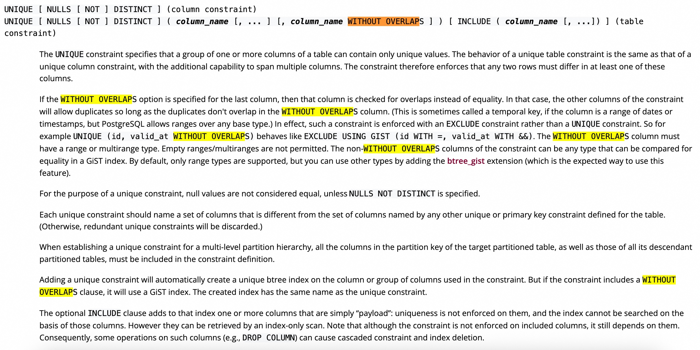
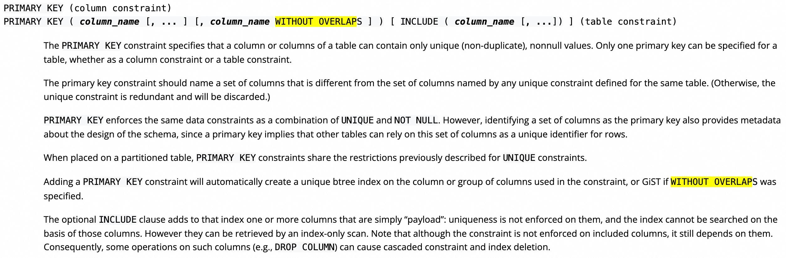
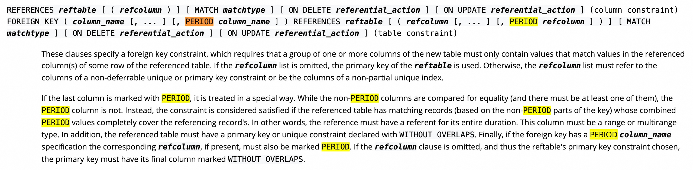

## 体验PostgreSQL 18的`WITHOUT OVERLAPS`唯一约束和`PERIOD`外键约束  
                
### 作者                
digoal                
                
### 日期                
2025-09-26                
                
### 标签                
PostgreSQL , PolarDB , DuckDB , exclude , 排它约束 , 范围类型 , GiST , WITHOUT OVERLAPS , PERIOD , 范围包含 , 范围交叉 , 空间       
                
----                
                
## 背景    
最近PG 18的新特性解读非常多, 我这就不再废话了, 有兴趣可看PG官方release notes  
- https://www.postgresql.org/about/news/postgresql-18-released-3142/  
  
不知道大家有没有注意到release notes里一个小细节:   
  
PostgreSQL 18 adds temporal constraints -- constraints over ranges -- for both PRIMARY KEY and UNIQUE constraints using the WITHOUT OVERLAPS clause, and on FOREIGN KEY constraints using the PERIOD clause.  
  
这个功能可以简单理解为唯一性的扩展, 特别是针对range类型, 可表示为不相交, 以往这样的约束需要用exclude约束来实现.  
  
另外在此基础上, 又增加了一个foreign key约束的功能, 也就是外键必须是在主键已有值覆盖的范围内. 以前要加类似的外键需要使用自定义函数和check约束来实现.  
  
详见文档: https://www.postgresql.org/docs/18/sql-createtable.html   
  
    
  
    
  
    
  
其实这个功能在17提交过, 可能被打回了. 下面列举了一些应用例子:    
- [《PostgreSQL 17 preview - 简化exclude约束用法, 对primary key,unique约束增加without overlaps可选项》](../202401/20240125_01.md)    
- [《PostgreSQL exclude 排他约束 实现 - group ID结伴功能》](../202102/20210209_01.md)    
- [《用 PostgreSQL 的排他约束(exclude)实现 - 行政区不可跨界 约束, 会议室预定时间不交叉 约束 等.》](../202102/20210208_03.md)    
- [《PostgreSQL 约束延判(unique, primary key, foreign key, exclude) - deferrable》](../201911/20191128_01.md)    
- [《PostgreSQL exclude 约束之 - 绑定一对一的关系》](../201905/20190527_01.md)    
- [《沉浸式学习PostgreSQL|PolarDB 6: 预定会议室、划分管辖区》](../202308/20230827_02.md)    
- [《会议室预定系统实践(解放开发) - PostgreSQL tsrange(时间范围类型) + 排他约束》](../201712/20171223_02.md)    
     
## 用官方镜像拉起PG 18  
细节参考 : [《大学生数据库实践课-PostgreSQL本地学习镜像的使用》](../202509/20250903_08.md)    
  
1、下载容器镜像  
```  
docker pull postgres:18-bookworm  
```  
  
2、使用镜像创建容器    
    
在宿主机创建volume, 用于存放pg18实例数据文件.   
```    
docker volume create pg18_data   
```    
  
```  
docker volume inspect pg18_data  
[  
    {  
        "CreatedAt": "2025-09-26T06:41:08Z",  
        "Driver": "local",  
        "Labels": null,  
        "Mountpoint": "/var/lib/docker/volumes/pg18_data/_data",  
        "Name": "pg18_data",  
        "Options": null,  
        "Scope": "local"  
    }  
]  
```  
    
配置几个变量, 创建容器    
```    
PG_USER="postgres"    
PG_PASSWORD="123456"    
    
docker run -d -it -p 0.0.0.0:1923:5432 --add-host=host.docker.internal:host-gateway \
  -u root -w /var/lib/postgresql -e LANG=en_US.utf8 \
  -e POSTGRES_INITDB_ARGS="-E UTF8 --locale=C --lc-ctype=en_US.utf8" \
  -v pg18_data:/var/lib/postgresql/data \
  --cap-add=SYS_PTRACE --cap-add SYS_ADMIN --privileged=true --shm-size=1g \
  -e POSTGRES_USER=$PG_USER -e POSTGRES_PASSWORD=$PG_PASSWORD \
  --name pg18 postgres:18-bookworm  
```  
    
说明:     
- `5432` 是postgres容器默认监听端口, 通过容器`-e PGPORT=...`环境变量可进行配置.     
- `-p 1923:5432` 表示将容器内的5432端口映射到宿主机的1923端口, 在宿主机上可通过本机回环地址访问容器中的数据库.    
- `--add-host=host.docker.internal:host-gateway` 让B容器可通过`host.docker.internal`域名访问A容器映射到宿主机的端口, 解决B容器有访问A容器内数据库的需求!    
- 从容器内访问宿主机, 采用域名: `host.docker.internal`    
    
3、进入容器, 变更常用配置    
```    
docker exec -ti pg18 bash    
```    
    
配置root用户bash环境变量    
```    
echo "alias ll='ls -larth'    
alias rm='rm -i'    
alias cp='cp -i'    
alias mv='mv -i'    
export PGUSER=postgres" >> /root/.bashrc    
  
# 使环境变量生效  
. /root/.bashrc    
```    
    
配置postgres用户bash环境变量    
```    
echo "alias ll='ls -larth'    
alias rm='rm -i'    
alias cp='cp -i'    
alias mv='mv -i'" >> /var/lib/postgresql/.bash_profile    
    
chown postgres:postgres /var/lib/postgresql/.bash_profile    
```    
  
4、测试PG 18举例  
  
```  
docker exec -ti pg18 bash    
  
su - postgres  
```  
  
```  
pgbench -i -s 100  
  
pgbench -M prepared -n -r -P 1 -c 4 -j 4 -T 120  
```  
  
```  
transaction type: <builtin: TPC-B (sort of)>  
scaling factor: 100  
query mode: prepared  
number of clients: 4  
number of threads: 4  
maximum number of tries: 1  
duration: 120 s  
number of transactions actually processed: 362291  
number of failed transactions: 0 (0.000%)  
latency average = 1.326 ms  
latency stddev = 5.409 ms  
initial connection time = 4.081 ms  
tps = 3016.352291 (without initial connection time)  
statement latencies in milliseconds and failures:  
         0.000           0 \set aid random(1, 100000 * :scale)  
         0.000           0 \set bid random(1, 1 * :scale)  
         0.000           0 \set tid random(1, 10 * :scale)  
         0.000           0 \set delta random(-5000, 5000)  
         0.060           0 BEGIN;  
         0.128           0 UPDATE pgbench_accounts SET abalance = abalance + :delta WHERE aid = :aid;  
         0.073           0 SELECT abalance FROM pgbench_accounts WHERE aid = :aid;  
         0.078           0 UPDATE pgbench_tellers SET tbalance = tbalance + :delta WHERE tid = :tid;  
         0.094           0 UPDATE pgbench_branches SET bbalance = bbalance + :delta WHERE bid = :bid;  
         0.070           0 INSERT INTO pgbench_history (tid, bid, aid, delta, mtime) VALUES (:tid, :bid, :aid, :delta, CURRENT_TIMESTAMP);  
         0.816           0 END;  
```  
  
## 体验PostgreSQL 18的`WITHOUT OVERLAPS`唯一约束和`PERIOD`外键约束  
接下来在18中体验一下该功能.  
```  
create extension btree_gist;  
  
create table t1 (  
  id int primary key,  
  gid int,  
  ts tsrange,   
  unique (gid, ts WITHOUT OVERLAPS)  
);  
  
create table t2 (  
  id int primary key,  
  gid int,  
  ts tsrange,  
  foreign key (gid, period ts)  
    references t1 (gid, period ts)  
);  
```  
  
满足约束的条件  
- t1 : 对于同一个GID, ts时间范围不允许相交  
- t2 : t2.gid必须在t1中已存在, 并且t2.ts必须被对应t1.gid的t1.ts包含  
  
范围类型的边界符合: `[`表示包含, `)`表示不包含.   
  
先往t1插入一些数据:  
```  
insert into t1 values (1,1,'[2025-01-01, 2025-01-02)');  
insert into t1 values (2,1,'[2025-01-02, 2025-01-03)');  
insert into t1 values (3,2,'[2025-01-02, 2025-01-03)');  
insert into t1 values (4,3,'[2025-01-02, 2025-01-04)');  
  
postgres=# select * from t1;  
 id | gid |                      ts                         
----+-----+-----------------------------------------------  
  1 |   1 | ["2025-01-01 00:00:00","2025-01-02 00:00:00")  
  2 |   1 | ["2025-01-02 00:00:00","2025-01-03 00:00:00")  
  3 |   2 | ["2025-01-02 00:00:00","2025-01-03 00:00:00")  
  4 |   3 | ["2025-01-02 00:00:00","2025-01-04 00:00:00")  
(4 rows)  
```  
  
再次插入, 与已有gid 3的ts值有时间范围交叉, 插入报错  
```  
postgres=# insert into t1 values (5,3,'[2025-01-02, 2025-01-04)');  
ERROR:  conflicting key value violates exclusion constraint "t1_gid_ts_key"  
DETAIL:  Key (gid, ts)=(3, ["2025-01-02 00:00:00","2025-01-04 00:00:00")) conflicts with existing key (gid, ts)=(3, ["2025-01-02 00:00:00","2025-01-04 00:00:00")).  
```  
  
插入t2, 只要gid对应ts在t1.gid对应t1.ts范围内, 就不会报错. 即使这个范围是跨记录的(这个真没有意想到, 我以为会报错).    
```  
insert into t2 values (1,1,'[2025-01-01 12:00:00, 2025-01-01 13:00:00)');  
insert into t2 values (2,1,'[2025-01-01 12:00:00, 2025-01-02 13:00:00)');  -- 范围跨t1的2条记录, 居然没有报错, 判断逻辑很充分  
  
  
postgres=# select * from t2;  
 id | gid |                      ts                         
----+-----+-----------------------------------------------  
  1 |   1 | ["2025-01-01 12:00:00","2025-01-01 13:00:00")  
  2 |   1 | ["2025-01-01 12:00:00","2025-01-02 13:00:00")  
(2 rows)  
```  
  
违反约束例子   
```  
postgres=# insert into t2 values (3,2,'[2025-01-01 12:00:00, 2025-01-01 13:00:00)');  
ERROR:  insert or update on table "t2" violates foreign key constraint "t2_gid_ts_fkey"  
DETAIL:  Key (gid, ts)=(2, ["2025-01-01 12:00:00","2025-01-01 13:00:00")) is not present in table "t1".  
  
postgres=# insert into t2 values (3,2,'[2025-01-02 12:00:00, 2025-01-03 13:00:00)');  
ERROR:  insert or update on table "t2" violates foreign key constraint "t2_gid_ts_fkey"  
DETAIL:  Key (gid, ts)=(2, ["2025-01-02 12:00:00","2025-01-03 13:00:00")) is not present in table "t1".  
```  
  
改成区间内即可   
```  
postgres=# insert into t2 values (3,2,'[2025-01-02 12:00:00, 2025-01-03 00:00:00)');  
INSERT 0 1  
```  
  
是不是挺有意思?    
  
除此了范围类型, 还可以用在空间类型, 大家想想在什么场景可使用? 空间栅栏? ...    
  
以前要写排他约束和自定义函数+check实现, 现在方便多了!  
  
  
      
#### [期望 PostgreSQL|开源PolarDB 增加什么功能?](https://github.com/digoal/blog/issues/76 "269ac3d1c492e938c0191101c7238216")
  
  
#### [PolarDB 开源数据库](https://openpolardb.com/home "57258f76c37864c6e6d23383d05714ea")
  
  
#### [PolarDB 学习图谱](https://www.aliyun.com/database/openpolardb/activity "8642f60e04ed0c814bf9cb9677976bd4")
  
  
#### [PostgreSQL 解决方案集合](../201706/20170601_02.md "40cff096e9ed7122c512b35d8561d9c8")
  
  
#### [德哥 / digoal's Github - 公益是一辈子的事.](https://github.com/digoal/blog/blob/master/README.md "22709685feb7cab07d30f30387f0a9ae")
  
  
#### [About 德哥](https://github.com/digoal/blog/blob/master/me/readme.md "a37735981e7704886ffd590565582dd0")
  
  

  
