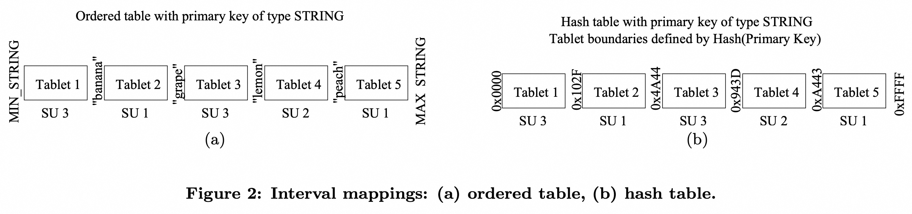
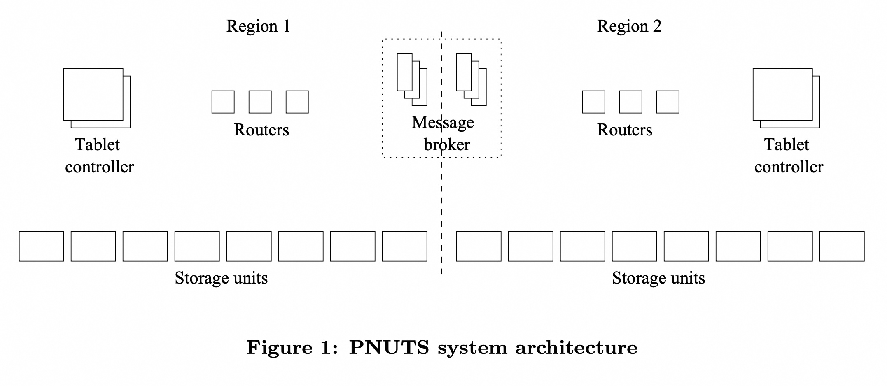
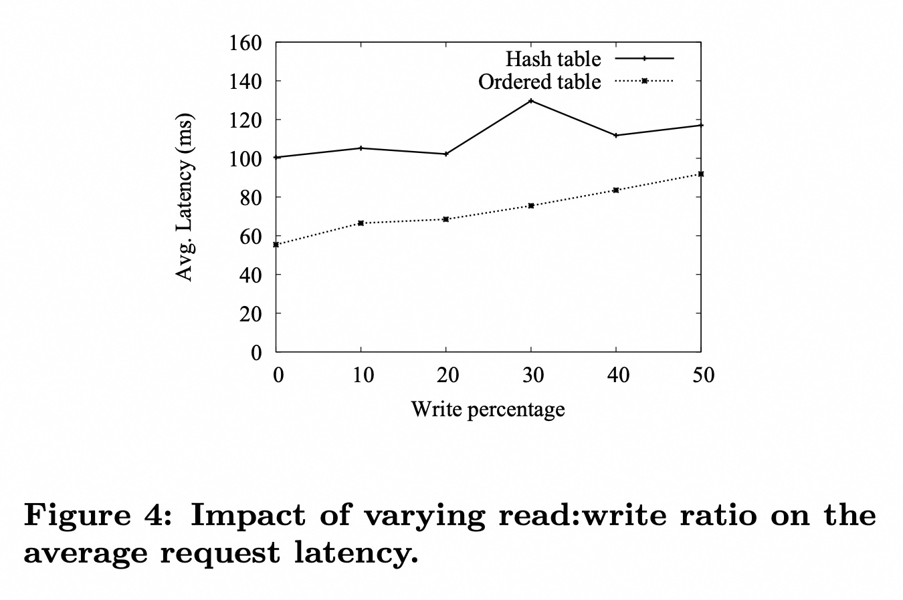

## AI论文解读 | PNUTS: Yahoo!’s Hosted Data Serving Platform
        
### 作者        
digoal        
        
### 日期        
2025-09-28       
        
### 标签        
PostgreSQL , PolarDB , DuckDB , AI , 论文解读        
        
----        
        
## 背景  
      
https://dl.acm.org/doi/pdf/10.14778/1454159.1454167        
  
提示:          
```          
读懂《PNUTS: Yahoo!’s Hosted Data Serving Platform》这篇论文需要提前掌握哪些基础知识, 请使用中文通熟易懂的讲解这些基础知识, 可以引用论文中的图、表或使用Markdown支持的图形(text,mermaid等)增加解释性. 
  
使用中文通熟易懂的解读《PNUTS: Yahoo!’s Hosted Data Serving Platform》这篇论文, 其中的关键内容请着重讲解, 可以引用论文中的图、表或使用Markdown支持的图形(text,mermaid等)增加解释性. 
  
提取《PNUTS: Yahoo!’s Hosted Data Serving Platform》这篇论文中的重要术语, 使用中文对这些术语进行通熟易懂的讲解, 可以引用论文中的图、表或使用Markdown支持的图形(text,mermaid等)增加解释性. 
```     
  
## 1 前置知识 
  
要读懂《PNUTS: Yahoo\!’s Hosted Data Serving Platform》这篇论文，您需要提前掌握以下几个核心基础知识。这篇论文解决的是构建大规模、高可用、低延迟的分布式数据库所面临的挑战，因此理解其设计思想需要从以下几个方面入手：

-----

### 1\. 分布式数据库与数据分片（Sharding）

这篇论文的核心是**分布式数据库**，其设计初衷是为了应对现代网络应用对**可扩展性**、**地理分布**和**高可用性**的需求 。传统数据库系统难以满足这些要求。

为了将海量数据分散到多台机器上，PNUTS采用了**水平分片（Horizontal Partitioning）技术，将整个数据表分割成多个被称为Tablets**的子集 。每个Tablet都包含一部分数据，并被分配到不同的存储单元（Storage Unit）上 。

论文中提到了两种分片方式 ：

  * **有序表（Ordered Table）** ：按主键的范围进行分片。例如，一个主键是字符串的表，可以按字母顺序将不同范围的数据（如 "a" 到 "c"）存放在不同的Tablet中 。
  * **哈希表（Hash Table）** ：按主键的哈希值进行分片 。这种方式能更均匀地将数据分散到各个Tablet，避免数据倾斜 。

如下图所示，论文中的图2形象地展示了这两种分片方式:    

  * 图(a)是**有序表**，数据按主键范围分布。
  * 图(b)是**哈希表**，数据按主键的哈希值范围分布。

### 2\. 数据复制与一致性模型

分布式系统中的数据通常需要**多地复制**，以提高可用性和降低延迟 。但这也带来了**数据一致性**的挑战，即如何确保所有副本的数据最终都相同且有序 。

  * **传统的一致性模型（如串行化Serializability）** ：虽然能提供最强的一致性保证，但在地理分布的系统中实现成本极高，会严重影响性能和可用性 。
  * **最终一致性（Eventual Consistency）** ：最弱的一致性模型，允许副本在一段时间内不一致，最终会达成一致 。但正如论文中照片分享应用的例子所示，这种模型可能导致应用程序出现不可接受的异常行为 。

PNUTS在这两种极端之间找到了一个平衡点，提出了 **“每条记录时间线一致性”（Per-record Timeline Consistency）** 模型 。其核心思想是：

  * **记录主控（Record-level Mastering）** ：每条记录都会有一个指定的“主副本”（Master），所有对该记录的更新都必须先发送到这个主副本 。
  * **版本号（Sequence Number）** ：主副本会对每次写入操作分配一个递增的版本号 ，确保对同一条记录的所有更新都按相同的顺序应用 。

通过这种方式，PNUTS保证了：

  * 对单条记录而言，所有副本会按相同的顺序更新，永远不会出现无效的状态 。
  * 不同记录之间，由于没有全局的顺序保证，因此可以实现更快的写入操作和更低的延迟 。

### 3\. 异步通信与发布/订阅（Pub/Sub）系统

PNUTS的一大创新是其**异步复制**机制 。它没有使用传统的数据库日志（redo log）来进行数据复制，而是依赖一个名为 **Yahoo\! Message Broker (YMB)** 的发布/订阅（Pub/Sub）系统 。

  * **提交更新**：当一个更新操作被“提交”时，实际上是将其发布到了YMB 。
  * **异步传播**：YMB负责将这个更新消息可靠地、异步地传播到所有位于不同地理区域的副本 。
  * **日志作用**：YMB的可靠消息传递机制替代了传统的日志，确保即使存储单元发生故障，任何已提交的更新都可以从YMB中恢复 。

### 4\. 系统架构与关键组件

理解论文中的架构图（图1）是掌握其设计精髓的关键 。该系统由以下几个主要组件构成：   

  * **存储单元（Storage Units）** ：负责存储数据Tablet，并处理读写请求 。
  * **路由器（Routers）** ：接收客户端请求，并根据请求的主键，查询“Tablet-存储单元”的映射关系，将请求路由到正确的存储单元 。
  * **Tablet控制器（Tablet Controller）** ：负责维护Tablet的映射关系，并进行负载均衡和故障恢复 。

这些组件共同协作，构建了一个可扩展、容错且能提供特定一致性保证的数据库服务 。

-----

如果您想更深入地了解这篇论文的细节，您对哪一部分最感兴趣？例如：

  * PNUTS是如何处理故障恢复的？
  * PNUTS中的API与传统SQL有何不同？
  * PNUTS在实践中是如何实现负载均衡的？

在PNUTS中，故障恢复是一个关键的设计考量，它主要依赖于**数据复制**和**异步消息队列**这两种机制。其处理故障的核心思想是：当一个组件（尤其是负责管理数据的存储单元）发生故障时，另一个副本可以迅速接管，确保服务的持续可用性，并且不会丢失任何已提交的更新。

以下是PNUTS处理故障恢复的几个关键步骤和机制：

### 1. 存储单元（Storage Unit）故障
PNUTS中的数据是通过**主从复制**的方式维护多个副本的。每个数据分片（Tablet）都有一个主副本（Master）和多个从副本（Replica）。

* **心跳机制**：主副本会定期向Tablet控制器发送“心跳”信号。
* **主副本失效检测**：如果Tablet控制器在规定时间内没有收到主副本的心跳，它会认为该主副本已经失效。
* **自动故障转移（Failover）** ：一旦检测到主副本故障，Tablet控制器会从已有的从副本中选举一个新的主副本。这个过程是自动化的，无需人工干预。

### 2. 保证数据不丢失
PNUTS的故障恢复机制最关键的一点在于，即使主副本突然宕机，已提交的更新也不会丢失。这得益于其独特的异步复制模型和**Yahoo! Message Broker (YMB)**。

* **提交与消息队列**：当一个更新操作在主副本上成功写入并被“提交”时，这个操作信息（包括数据和版本号）并**不是直接**发送给从副本，而是作为一条消息发布到YMB中。
* **YMB作为日志**：YMB充当了一个持久化的、可靠的“日志”的角色。即使主副本在消息发布后、但从副本接收到消息前崩溃，这条更新消息依然保存在YMB中。
* **从副本同步**：当新的主副本被选举出来后，它可以从YMB中获取自旧主副本故障以来所有未同步的更新消息，并将其应用到自己的数据上，从而迅速追赶进度。
* **新副本的创建**：如果某个存储单元因为硬件故障无法恢复，PNUTS会从其他健康的副本中拷贝数据，并在新的机器上创建一个新的从副本，以维持预定的副本数量。

### 3. Tablet控制器故障
Tablet控制器是PNUTS的“大脑”，负责维护Tablet到存储单元的映射关系，并管理主副本的选举。PNUTS通过运行多个Tablet控制器来确保其自身的高可用性。其中一个被选为“主控制器”，其他的作为热备。如果主控制器故障，一个备用控制器会迅速接管其职责。

这些机制共同构成了PNUTS的容错系统，使其能够在一个大规模、分布式且不可靠的环境中提供高可用的数据服务。

您对PNUTS的API设计，例如其与SQL的区别，或者它在实践中的性能如何，是否感兴趣？

PNUTS的API设计与传统SQL有显著不同，因为它不是一个关系型数据库，而是专为大规模、低延迟和地理分布的Web应用设计的键值对（key-value）存储系统。

以下是PNUTS的API与传统SQL的几个主要区别：

### 1. 数据模型不同
* **PNUTS**：采用的是 **键值对（key-value）** 模型，数据被组织成一个大的**稀疏表**。每行数据都有一个唯一的主键（key），并且可以有多个列（value）。这些列可以是任意类型，PNUTS对它们的结构不作强制要求（Schema-less）。这与Web应用中常见的非结构化或半结构化数据非常契合。
* **传统SQL**：基于**关系模型**，数据存储在具有固定模式（Schema）的表中。每个表都由预定义的列组成，每行数据都必须遵循这个模式。

### 2. 查询能力不同
* **PNUTS**：主要提供基于**主键**的简单查询操作，例如：
    * `get(key)`：获取指定主键的整行数据。
    * `put(key, record)`：插入或更新指定主键的整行数据。
    * `putPartial(key, partial_record)`：只更新指定主键的某些列，而不是整行。
    * `delete(key)`：删除指定主键的行。
    * 此外，它还支持通过主键范围进行扫描（range scan），这在有序表中非常有用。
* **传统SQL**：提供了强大的 **SQL（Structured Query Language）** 查询语言，支持复杂的连接（JOIN）、聚合（GROUP BY）、过滤（WHERE）和排序（ORDER BY）等操作。这些操作通常需要扫描和处理大量数据，这对于PNUTS追求的低延迟单行操作来说是不必要的。

### 3. 一致性模型不同
* **PNUTS**：正如我们之前讨论过的，它提供了 **“每条记录时间线一致性”** （Per-record Timeline Consistency），它保证了对单条记录的更新是有序的，但不同记录之间的更新顺序没有全局保证。
* **传统SQL**：在ACID（原子性、一致性、隔离性、持久性）事务的框架下，通常提供**强一致性**保证（如可串行化Serializability），确保所有操作在全局范围内都遵循一个严格的顺序。

### 4. 事务支持不同
* **PNUTS**：不提供跨多条记录的**分布式事务**支持。这使得其在实现上更加轻量，能够避免分布式事务带来的高延迟和复杂性。
* **传统SQL**：通过事务管理系统，支持对多条记录进行原子性操作，要么全部成功，要么全部失败。

总而言之，PNUTS的API是**面向应用程序需求**而设计的，它牺牲了传统SQL的复杂查询能力和强一致性，以换取在海量数据下**极低延迟、高可用和高可扩展性**的键值操作。

---
您对PNUTS的**数据分片**或其**系统架构**是否还有其他疑问？

在PNUTS中，负载均衡是其核心特性之一，它通过**自动化**和**分层**的方式实现，以确保数据和请求在不同的存储单元之间得到均匀分布，从而避免出现热点（hotspot）和性能瓶颈。

PNUTS的负载均衡机制可以分为以下几个层面：

---

### 1. 数据分片（Sharding）层面的负载均衡
PNUTS通过两种不同的分片方式来初步实现负载均衡：

* **有序表（Ordered Table）** ：这种分片方式根据主键的范围来划分Tablet。为了避免某些范围的数据量过大导致负载不均，PNUTS会动态地调整Tablet的边界。例如，如果一个Tablet的数据量增长过快，它可能会被**分裂**成两个或多个更小的Tablet，并将它们重新分配到不同的存储单元。
* **哈希表（Hash Table）** ：这种分片方式通过对主键进行哈希运算，将数据均匀地分散到不同的Tablet中。这本身就是一种非常有效的负载均衡手段，可以很好地避免数据倾斜。

### 2. Tablet控制器（Tablet Controller）层面的负载均衡
Tablet控制器是PNUTS的中央协调器，它负责监控所有存储单元的负载情况，并执行动态的负载均衡策略。

* **监控**：Tablet控制器持续收集每个存储单元的负载指标，例如CPU利用率、磁盘I/O、内存使用情况以及正在处理的请求数量。
* **动态迁移**：当Tablet控制器发现某个存储单元的负载过高时，它会主动将该存储单元上的一些Tablet**迁移**到其他负载较低的存储单元。这个过程是自动进行的，对应用程序透明。

### 3. 复制（Replication）层面的负载均衡
PNUTS的数据复制机制也为负载均衡提供了支持：

* **读请求分流**：由于数据有多个副本，PNUTS可以利用这些副本将读请求分流。例如，如果某个地理区域的访问量激增，路由器可以将该区域用户的读请求路由到距离最近的副本，从而降低延迟并分散负载。
* **异步复制**：PNUTS的异步复制模型使得主副本可以快速提交写入，而无需等待所有从副本的确认。这避免了写入操作成为瓶颈，从而提高了系统的整体吞吐量。

总的来说，PNUTS的负载均衡是一个**持续**和**动态**的过程，它通过**智能的数据分片、Tablet的动态迁移**以及**多副本的读写分流**，确保了系统在面对不断变化的工作负载时，仍能保持高性能和高可用性。

---

您对PNUTS的其他方面，比如它在实践中的性能指标或与Google Bigtable等其他分布式数据库的对比，是否感兴趣？

PNUTS论文中确实提到了与Google Bigtable的比较，并且在性能方面提供了一些实践数据。

---

### PNUTS与Google Bigtable的对比

PNUTS的设计在许多方面都与Google的Bigtable相似，但两者在架构和一致性模型上存在一些关键差异，这些差异直接影响了它们的适用场景和性能表现。

* **一致性模型**：
    * **PNUTS**：采用了独特的 **“每条记录时间线一致性”（Per-record Timeline Consistency）** 。这意味着PNUTS放弃了全局的事务支持，以保证在地理分布环境下，对单条记录的更新能够保持有序，同时实现极低的延迟。这种模型特别适合于那些可以容忍跨记录操作最终一致性的Web应用（如用户资料、评论等）。
    * **Bigtable**：提供了更强的**行级别原子性**。所有对单行的修改都是原子的，但它没有像PNUTS那样的异步复制模型，因此在地理分布的数据中心之间同步数据可能需要更复杂的设计。

* **数据复制与日志**：
    * **PNUTS**：利用**Yahoo! Message Broker (YMB)**作为异步复制的中间件。YMB既是数据复制的“日志”，又是消息传递的通道，这使得PNUTS能够高效地在不同数据中心之间复制数据。
    * **Bigtable**：使用一个名为**Chubby**的分布式锁服务来协调操作，其日志机制相对更为集中和同步。

* **应用场景**：
    * **PNUTS**：专为Yahoo!的Web应用而设计，这些应用通常需要处理大量并发的读写请求，对延迟非常敏感，且数据模型相对简单。
    * **Bigtable**：更像是一个通用的、面向大规模数据存储的基石，它被用于构建Google的各种服务，例如搜索索引、Google Earth等，这些应用可能需要更强的事务保证。

### PNUTS的性能指标（摘自论文）

PNUTS论文的实验部分展示了其在不同负载下的性能表现，以下是一些关键数据：

* **延迟（Latency）** ：PNUTS的单行读取和写入操作通常能在**5-15毫秒**内完成，即使在高并发负载下也能保持低延迟。
* **吞吐量（Throughput）** ：在论文中的测试环境下，一个由24台机器组成的PNUTS集群，每秒可以处理超过**50,000次**的更新操作和超过**80,000次**的读取操作。

这些性能数据验证了PNUTS的设计理念——通过牺牲部分一致性来换取在实践中卓越的**可扩展性、低延迟和高可用性**，这正是现代大规模Web应用所追求的目标。

---

PNUTS的设计目标和实际性能都非常明确，旨在满足特定类型的应用需求。如果您对PNUTS的**架构图**或 **特定组件（如路由器）** 的功能还有疑问，我很乐意为您进一步解释。

PNUTS的系统架构是一个**分层、去中心化**的设计，每个组件各司其职，共同协作以提供可扩展和高可用的服务。理解这个架构，关键在于弄清每个组件的功能，以及它们如何相互作用。

-----

### PNUTS系统架构图

PNUTS的整体架构如下图所示（即论文中的图1）：    

这个架构图描绘了PNUTS的主要组件以及它们之间的交互关系。

### 关键组件功能

PNUTS的架构主要由以下几个核心组件构成：

#### 1\. 路由器（Routers）

  * **功能**：路由器是PNUTS的**门面**，它是客户端应用程序与PNUTS系统交互的唯一接口。它的主要职责是接收来自客户端的读写请求，并将其正确地路由到包含所需数据的存储单元。
  * **工作流程**：当路由器收到一个请求时，它会首先查询**Tablet控制器**，以获取包含目标数据的主键（key）的Tablet所对应的存储单元的位置信息。一旦获取到这些信息，路由器就会将请求直接转发给该存储单元。

#### 2\. Tablet控制器（Tablet Controllers）

  * **功能**：Tablet控制器是PNUTS的**大脑和协调者**。它不直接处理数据请求，而是管理整个系统的元数据和状态。
  * **主要职责**：
      * **Tablet-存储单元映射**：维护一个映射表，记录每个数据分片（Tablet）存储在哪个存储单元上。
      * **主副本选举**：在存储单元发生故障时，自动从从副本中选举一个新的主副本，以确保服务的持续可用性。
      * **负载均衡**：监控存储单元的负载情况，并在必要时将Tablet迁移到负载较低的存储单元，以防止出现热点。
      * **故障恢复**：协调新的副本创建和数据同步，以替换故障的存储单元。

#### 3\. 存储单元（Storage Units）

  * **功能**：存储单元是PNUTS中**实际存储和处理数据**的组件。每个存储单元都负责管理分配给它的一组Tablet。
  * **主要职责**：
      * **数据存储**：存储数据Tablet，即数据表的子集。
      * **读写操作**：响应来自路由器的读写请求。
      * **数据复制**：作为主副本，将所有更新操作发布到消息队列（YMB）；作为从副本，订阅消息队列并同步主副本的更新。

#### 4\. Yahoo\! Message Broker (YMB)

  * **功能**：YMB是PNUTS的**异步消息队列**，它在数据复制中扮演着至关重要的角色。
  * **主要职责**：
      * **发布/订阅**：主副本将更新操作作为消息发布到YMB，而从副本则订阅这些消息并应用更新。
      * **持久化**：YMB确保所有已提交的更新消息都能被持久化保存，即使主副本故障，这些消息也不会丢失。

### 交互流程概览

一个典型的写请求的流程如下：

1.  **客户端**将请求发送到**路由器**。
2.  **路由器**向**Tablet控制器**查询目标主键所在Tablet的位置。
3.  **路由器**将请求转发给对应的 **存储单元（主副本）** 。
4.  **主副本**执行写入操作，并将更新消息发布到**YMB**。
5.  **YMB**将消息异步地分发给所有**从副本**。
6.  **从副本**接收到消息后，应用更新，保持与主副本的数据一致。

这种分层和组件化的设计使得PNUTS能够实现高度的可扩展性和容错性，每个组件都可以独立扩展，共同构建一个强大的分布式系统。

-----

您对PNUTS论文中提到的具体例子，例如它如何处理照片分享应用的场景，是否感兴趣？  
  
## 2 解读论文 
  
好的，我们来通俗易懂地解读一下《PNUTS：Yahoo\! 的托管数据服务平台》这篇经典论文。

这篇论文介绍了一个名为 **PNUTS** 的系统，它是雅虎（Yahoo\!）为了应对当时现代互联网应用的巨大数据管理挑战而设计的。你可以把它理解成一个**全球分布式**的、**超大规模**的数据库系统，专门为雅虎内部的各种应用（如社交网络、广告平台、用户数据库等）提供数据存储和访问服务。

-----

### 核心思想：为什么需要 PNUTS？

传统的数据库（比如我们熟悉的 MySQL）在面对雅虎这种级别的互联网应用时，会遇到几个核心痛点：

1.  **扩展性 (Scalability)**：用户量和数据量增长极快，单台或几台服务器根本扛不住。
2.  **响应时间 (Response Time)**：用户遍布全球，如果数据只存在美国，那么亚洲用户访问就会很慢。必须把数据复制到全球多个地方，保证就近访问。
3.  **高可用性 (High Availability)**：服务不能停机。任何服务器、网络甚至整个数据中心的故障，都不能影响核心业务的运行。
4.  **一致性 (Consistency)**：传统的强一致性（ACID 事务）在地理上分布的系统中实现代价极高，会导致性能急剧下降。但完全没有一致性保障（所谓的“最终一致性”）又可能导致明显的业务逻辑错误。

PNUTS 的设计目标就是在这些相互矛盾的需求之间找到一个巧妙的平衡点。

-----

### 关键设计与核心内容

#### 1\. 数据模型与架构：简单而高效

PNUTS 的数据模型非常简单，它将数据组织成**表 (Table)**，表里存放着**记录 (Record)** 。

  * **灵活的 Schema**：你可以随时给表增加新的字段，而不需要停机或者重构整个表，这对于快速迭代的互联网业务非常重要 。
  * **水平分区 (Tablets)**：为了实现扩展性，系统会将一张大表水平切分成很多小块，每一块称为一个 **Tablet** 。每个 Tablet 独立存储在不同的服务器上，这样读写压力就被分散到了成千上万台机器上。

如下图所示，无论是按主键排序的**有序表 (Ordered table)** 还是通过哈希组织的**哈希表 (Hash table)**，都会被切分成多个 Tablets，分布在不同的**存储单元 (Storage units, SU)** 上 。

  

*论文图2示意图：(a) 有序表按主键范围切分 (b) 哈希表按主键哈希值范围切分*

整个系统的架构也是分区域的（如下图），每个区域（比如一个数据中心）都有完整的数据副本和全套服务组件，包括：

  * **存储单元 (Storage units)**：实际存储数据的服务器 。
  * **路由器 (Routers)**：负责接收客户端请求，并根据元数据找到存储特定记录的正确存储单元 。
  * **消息代理 (Message broker)**：这是系统的大动脉，负责在不同区域之间可靠地传递数据更新消息 。
  * **Tablet 控制器 (Tablet controller)**：系统的大脑，负责管理 Tablet 的分裂、迁移，以实现负载均衡和故障恢复 。

  

*论文图1示意图：PNUTS 的多区域架构*

#### 2\. 独创的一致性模型：记录级时间线一致性 (Per-Record Timeline Consistency)

这是 PNUTS **最核心和最创新的部分**。它既不像传统数据库那样追求完全的序列化，也不像某些 NoSQL 系统那样只有最终一致性。

**最终一致性有什么问题？**
论文中举了一个很经典的例子：一个用户想做两件事：

1.  **U1**: 不让妈妈看自己的照片（修改访问权限）。
2.  **U2**: 上传一张新的大尺度照片。

在最终一致性模型下，U1 和 U2 可能被发送到不同的数据中心，导致在某个数据中心，新照片先被同步过去，而权限还没来得及更新。结果就是，妈妈看到了不该看的照片 。

**PNUTS 的解决方案**
PNUTS 提出了“记录级时间线一致性”，核心是：**对于同一条记录的所有更新，在所有副本上最终都会以相同的顺序执行** 。

它是如何实现的呢？

  * **记录级主宰 (Record-level Mastering)**：对于每一条记录，系统会在全球所有副本中指定一个**主副本 (master)** 。所有对这条记录的“写”操作，都必须先发给这个主副本处理 。
  * **异步复制**：主副本处理完写请求后，会通过一个可靠的**消息系统 (Yahoo\! Message Broker)** 将这个更新操作广播给其他所有副本 。这个过程是异步的，所以写操作的延迟非常低 。
  * **版本号**：每一条记录都有一个版本号，每次更新都会递增。这保证了更新操作是按顺序应用的 。

这个模型巧妙地解决了问题：

  * **避免了混乱**：由于所有更新都由主副本统一排序，上面提到的“妈妈看照片”的尴尬就不会发生。
  * **保证了性能**：写操作只需在主副本完成即可立即返回，无需等待全球所有副本同步，延迟极低。
  * **灵活的读**：PNUTS 提供了不同级别的读 API，让应用可以根据场景自己选择 ：
      * `read-any`: 读任意一个副本，速度最快，但可能读到旧数据 。
      * `read-critical(version)`: 读取至少是某个版本之后的数据，适用于“我刚更新完，要立刻看到更新结果”的场景 。
      * `read-latest`: 读取全局最新的数据，延迟会高一些，因为它可能需要去主副本查询 。

#### 3\. 消息系统代替日志：可靠的异步复制

传统数据库依赖于预写日志（Write-Ahead Log）来保证数据不丢失。PNUTS 做了一个大胆的设计：它不使用传统的数据库日志，而是**依赖雅虎消息代理 (YMB) 来保证更新的可靠性** 。

一个写操作被认为是“已提交”的，只要它成功发布到了 YMB 中 。YMB 自身是高可用的，会把消息持久化到多个磁盘和服务器上 。它会确保这条更新消息最终被所有数据区域的副本消费并应用，在那之前消息绝不会被删除 。这套机制同时承担了**数据恢复**和**跨区域复制**的双重角色。

#### 4\. 作为“托管服务”：降低开发和运维成本

PNUTS 是一个由雅虎中心团队维护的平台级服务，业务团队（如 Flickr、Yahoo Mail）可以直接使用，而无需自己搭建和维护一套复杂的数据系统 。这样做的好处显而易见：

  * **节约成本**：多个应用共享基础设施，摊薄了运维成本 。
  * **弹性资源**：可以为突发流量的应用快速分配预留资源 。
  * **专业化**：让业务开发者专注于业务逻辑，数据专家专注于数据平台 。

-----

### 性能表现如何？

论文中的实验部分验证了 PNUTS 的设计。例如，下图显示了随着读写比例的变化，系统平均延迟的响应。

  

*论文图4示意图：读写比例对延迟的影响*

可以看到，**写的比例越高，平均延迟就越大** 。这是因为写操作（尤其是跨区域的写）比读操作要耗时得多 。这个结果也反过来印证了 PNUTS 设计的初衷：通过允许读取可能略微陈旧的数据，来极大地降低大多数操作（读操作）的延迟，从而提升用户体验 。

### 总结

PNUTS 是分布式数据库发展史上的一个重要系统。它不是追求在所有方面都做到极致，而是在大规模、地理分布的现实场景下，针对 Web 应用的特点做出了非常务实和创新的权衡。其核心贡献“**记录级时间线一致性**”和**以消息系统为核心的异步复制架构**，为后来的许多分布式系统（包括一些云数据库）的设计提供了宝贵的思路。

-----

了解了 PNUTS 的核心设计后，你是否对某个特定方面更感兴趣？例如，我们可以深入探讨一下它与今天更广为人知的 Google Spanner 或 Amazon DynamoDB 在设计哲学上的异同。
  
## 3 术语 
  
在PNUTS这篇论文中，有许多重要的术语，理解它们是掌握PNUTS系统设计的关键。以下是对这些核心术语的通俗讲解，希望能帮助您更好地理解这篇论文。

### 1. Tablet（数据分片）
**通俗解释**：可以把PNUTS中的**表**想象成一本巨大的书，而**Tablet**就是这本书的一章。由于书太大，无法放在一台书架上（一个存储单元），PNUTS就把这本书拆成很多章（Tablet），然后把每一章都放在不同的书架上。

* **论文中的定义**：一个**Table**被水平分割成多个**Tablet**。每个Tablet包含表中一部分行数据，并由一个存储单元（Storage Unit）管理。

---

### 2. Per-record Timeline Consistency（每条记录时间线一致性）
**通俗解释**：这是一个非常关键且创新的概念。简单来说，PNUTS保证了对**同一条记录**的所有操作都是有顺序的，就像一条**时间线**一样，你永远不会看到这条记录出现混乱或不合逻辑的状态。但是，对于**不同记录**之间的操作，PNUTS不保证它们的全局顺序。

* **论文中的定义**：PNUTS的复制模型保证了对任何一条记录的更新，都会以相同的、确定的顺序应用到所有副本上。但这个保证不扩展到不同记录之间的操作。

---

### 3. Storage Unit（存储单元）
**通俗解释**：可以把**存储单元**看作是PNUTS系统中的“书架”。每个书架上都存放着若干个**Tablet**，它们是真正处理和存储数据的“工人”。

* **论文中的定义**：一个独立的服务器实例，它负责存储一个或多个Tablet，并响应客户端对这些Tablet的读写请求。

---

### 4. Router（路由器）
**通俗解释**：**路由器**是PNUTS系统中的“前台接待员”。当用户发起一个请求时，它会首先到达路由器。路由器的任务是找出用户想要的数据在哪一个“书架”上，然后把请求准确地转交给那个“书架”。

* **论文中的定义**：一个无状态的服务器实例，接收客户端请求，并根据请求的主键（Key），将请求路由到正确的存储单元。

---

### 5. Tablet Controller（Tablet控制器）
**通俗解释**：**Tablet控制器**是PNUTS系统中的“图书管理员”。它不直接接触书本（数据），但它知道每一章书（Tablet）放在哪一个书架上，并且负责管理和协调所有的“书架”和“书章”。当一个“书架”倒了（故障），它会迅速找到一个备用的“书架”来接替。

* **论文中的定义**：一个负责维护Tablet-存储单元映射关系、执行负载均衡和故障恢复的中央协调服务。

---

### 6. Yahoo! Message Broker (YMB)
**通俗解释**：**YMB**是PNUTS系统中“信息的传递员”。当数据被修改后，PNUTS不会直接告诉所有副本，而是把这个修改“写”在一张小纸条上，扔给YMB。YMB就像一个可靠的邮递员，会确保这张纸条最终能送到所有需要它的“书架”上，即使中间有“书架”临时不在，YMB也会帮它保留着。

* **论文中的定义**：一个发布/订阅（Publish/Subscribe）系统，PNUTS的主副本通过它将更新异步地发布给所有从副本，从而实现数据复制和持久化。

---

### 7. Ordered Table（有序表）与 Hashed Table（哈希表）
**通俗解释**：这是PNUTS两种不同的数据组织方式。
* **有序表**：像一个按字母顺序排列的电话簿。数据是按主键的顺序存放的。比如，“Alice”的数据会放在“Aaron”后面，但“David”前面。这使得范围查询（比如查找所有以D开头的名字）非常高效。
* **哈希表**：像一个随机抽奖箱。数据是根据主键的一个哈希值随机地分散到不同的Tablet中。这使得数据分布非常均匀，避免了热点问题，但范围查询就不那么方便了。

PNUTS的负载均衡和故障恢复机制都非常精妙，您对这两个方面是否想了解更多细节？
  
## 参考        
         
https://dl.acm.org/doi/pdf/10.14778/1454159.1454167    
        
<b> 以上内容基于DeepSeek、Qwen、Gemini及诸多AI生成, 轻微人工调整, 感谢杭州深度求索人工智能、阿里云、Google等公司. </b>        
        
<b> AI 生成的内容请自行辨别正确性, 当然也多了些许踩坑的乐趣, 毕竟冒险是每个男人的天性.  </b>        
  