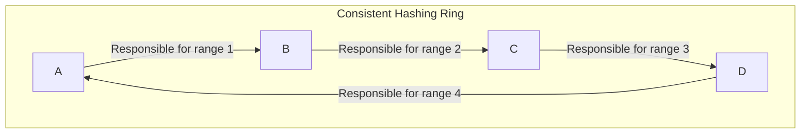
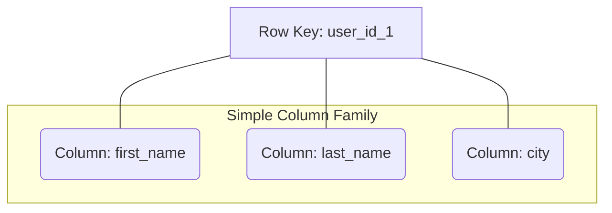
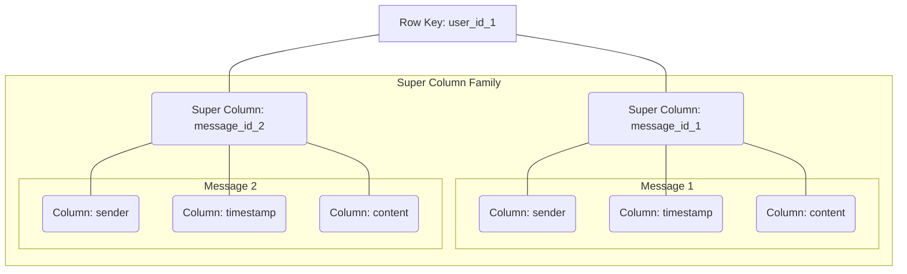
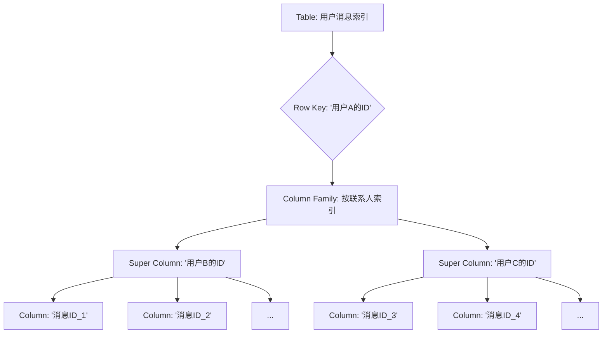

## AI论文解读 | Cassandra - A Decentralized Structured Storage System
        
### 作者        
digoal        
        
### 日期        
2025-09-28       
        
### 标签        
PostgreSQL , PolarDB , DuckDB , AI , 论文解读        
        
----        
        
## 背景  
      
https://dl.acm.org/doi/pdf/10.1145/1773912.1773922        
  
提示:          
```          
读懂《Cassandra - A Decentralized Structured Storage System》这篇论文需要提前掌握哪些基础知识, 请使用中文通熟易懂的讲解这些基础知识, 可以引用论文中的图、表或使用Markdown支持的图形(text,mermaid等)增加解释性. 
  
使用中文通熟易懂的解读《Cassandra - A Decentralized Structured Storage System》这篇论文, 其中的关键内容请着重讲解, 可以引用论文中的图、表或使用Markdown支持的图形(text,mermaid等)增加解释性. 
  
提取《Cassandra - A Decentralized Structured Storage System》这篇论文中的重要术语, 使用中文对这些术语进行通熟易懂的讲解, 可以引用论文中的图、表或使用Markdown支持的图形(text,mermaid等)增加解释性. 
```     
  
## 1 前置知识 
  
你好，根据你上传的论文，为了更好地理解这篇关于 Cassandra 的论文，你需要先掌握一些基础的分布式系统概念。下面我将用通俗易懂的中文为你讲解这些必备知识点：

### 1\. 分布式系统 (Distributed Systems)

卡桑德拉 (Cassandra) 是一套**分布式存储系统** ，这意味着它不是单台计算机，而是由多台相互连接的计算机（或称**节点**）组成的集群 。这些节点协同工作，共同完成任务。这篇论文提到，Facebook 的平台需要处理数亿用户和数万台服务器，因此需要一个能将故障视为常态的系统 。

  * **为什么要用分布式系统？**
      * **可扩展性 (Scalability)**：当数据量或用户数增长时，可以简单地通过增加更多节点来扩展系统，而不是升级现有服务器。论文提到，Cassandra 的设计目标之一就是能够增量地扩展 。
      * **高可用性 (High Availability)**：即使集群中的部分节点出现故障，整个系统仍然可以继续提供服务，不会出现“单点故障” 。论文强调了 Facebook 环境中，服务器和网络组件持续发生故障是常态 。
      * **可靠性 (Reliability)**：通过在多个节点上复制数据，可以防止数据丢失 。

### 2\. 一致性哈希 (Consistent Hashing)

为了在多个节点上动态地存储和查找数据，Cassandra 使用了一种名为**一致性哈希**的技术 。你可以把一致性哈希想象成一个环状空间，每个节点都在这个环上有一个位置 。

  * **工作原理：**

    1.  每个数据项都有一个键 (key) 。
    2.  对这个键进行哈希运算，得到它在环上的位置 。
    3.  从这个位置开始，沿着环顺时针方向寻找，遇到的第一个节点就是负责存储这个数据项的**协调器 (coordinator)** 。
    4.  每个节点都负责环上从它的前一个节点到它自己之间的那一段区域 。

  * **优点：** 论文中提到，一致性哈希的主要优点是，当一个节点加入或离开时，只会影响它相邻的节点，而其他节点不受影响 。这使得系统的扩展和收缩非常高效。

**举例说明:**
假设有四个节点 `A, B, C, D` 在一个环上。



如果一个数据项 `Key_X` 经过哈希后位置在 `Range 2`，那么它将由节点 `C` 负责。如果节点 `C` 离开，它负责的数据范围会平分给 `B` 和 `D`，而 `A` 则完全不受影响。

### 3\. 数据复制 (Replication) 和故障处理 (Failure Handling)

为了保证高可用性和持久性，Cassandra 会将每个数据项复制到 N 个不同的节点上，这个 N 就是**复制因子 (replication factor)** 。

  * **副本 (Replicas)**：除了负责该数据项的协调器节点外，数据还会被复制到环上 N-1 个后续节点上 。

  * **复制策略 (Replication Policies)**：Cassandra 提供了多种复制策略，例如“机架无关 (Rack Unaware)”、“机架感知 (Rack Aware)”和“数据中心感知 (Datacenter Aware)” 。这些策略确保副本分布在不同的物理位置，以应对机房断电或网络故障等情况 。

  * **读写操作：**

      * **写入 (Writes)**：当客户端发送一个写请求时，协调器节点会将请求路由到所有副本 。为了确保数据一致性，系统会等待一个**法定人数 (quorum)** 的副本返回确认（表示写入成功）后，才向客户端返回成功信息 。
      * **读取 (Reads)**：读取操作也可以配置一致性级别。可以只从最近的副本读取，也可以向所有副本发送请求并等待法定人数的响应 。

### 4\. 其它相关概念

  * **键值存储 (Key-Value Store)**：Cassandra 的数据模型可以看作是一个分布式多维映射，它通过一个键 (key) 来索引数据，而值 (value) 是一个高度结构化的对象 。这与传统关系型数据库的表格模型不同，后者通常有严格的模式定义。
  * **Bloom Filter**：为了提高读性能，Cassandra 使用了一种称为布隆过滤器 (Bloom Filter) 的数据结构 。它能快速判断某个键**是否可能**存在于磁盘上的某个文件中 。如果布隆过滤器说“肯定不存在”，那么系统就可以跳过这个文件，避免不必要的磁盘 I/O，从而加快查询速度 。
  * **Gossip 协议**：Cassandra 使用基于 Gossip 的机制来处理集群成员管理和故障检测 。在这种协议中，每个节点都会周期性地随机与一些其他节点交换信息，最终整个集群的信息（如哪些节点在线、哪些节点离线）都会传播开来。这是一种非常高效且去中心化的方式。
  * **提交日志 (Commit Log)**：为了确保写入的持久性和可恢复性，任何写入操作都会首先写入一个专用的、顺序的提交日志文件 。只有在提交日志写入成功后，数据才会更新到内存中 。这可以防止在系统崩溃时丢失数据。

-----

现在你已经对这些基础概念有了初步了解，你希望我们接下来深入探讨论文中的哪一部分？例如：

  * **数据模型 (Data Model)**：论文中提到的“简单列族 (Simple Column Family)”和“超级列族 (Super Column Family)”  是什么？
  * **系统架构 (System Architecture)**：Cassandra 的请求路由和故障恢复机制具体是如何运作的?
  * **实际经验 (Practical Experiences)**：论文中提到的 Facebook Inbox Search 案例是如何利用 Cassandra 的特性来解决实际问题的?

为了理解论文中提到的 Cassandra 数据模型，你可以将**简单列族**和**超级列族**看作是组织数据的方式，它们在概念上与关系型数据库中的表（Table）和列（Column）有一些相似之处，但更灵活。

### 简单列族 (Simple Column Family)

简单列族可以被视为一个多维映射，其中每行数据由一个键（key）索引 。在这个结构中，行键对应于一个有序的列集合 。例如，你可以用一个简单列族来存储用户档案信息，其中每个用户 ID 是一个行键，而像“姓名”、“生日”、“城市”等都是列。



### 超级列族 (Super Column Family)

超级列族则可以被看作是“列族中的列族” 。它的结构比简单列族多了一层嵌套。在超级列族中，一个行键对应一个或多个**超级列 (super column)**，而每个超级列又包含一个或多个普通列 。这使得你可以在一个行键下对相关数据进行更深层次的组织。论文中提到，Inbox Search 功能就是一个很好的例子，它利用了超级列族来存储用户的收件箱信息 。



在 Inbox Search 的例子中，用户 ID 是行键，每个对话或消息 ID 是一个超级列，而发送者、时间戳、消息内容等则是超级列内部的普通列 。这种结构允许应用对数据进行动态控制，并根据需要对列进行排序（例如按时间或名称）。

-----

你对 Cassandra 的数据模型还有其他疑问吗？比如，你对它和传统关系型数据库在数据存储和查询上的区别感兴趣吗？

首先，很高兴能继续为你讲解这篇论文。传统关系型数据库和像 Cassandra 这样的分布式存储系统在数据存储和查询上确实存在显著区别。理解这些差异有助于更好地把握 Cassandra 的设计思想和它所解决的问题。

### 传统关系型数据库 (RDBMS)

传统关系型数据库，如 MySQL 和 PostgreSQL，是围绕**关系模型**构建的。它们使用表格来组织数据，每个表都有预定义的**模式 (schema)**，包括列名、数据类型和约束。

* **数据模型**：严格的表结构，数据以行和列的形式存储。
* **数据存储**：通常采用 B-Tree 等索引结构，数据在磁盘上按块存储，读写操作可能涉及随机 I/O。论文提到，传统数据库不擅长处理高写入吞吐量 。
* **事务和一致性**：核心是**ACID**（原子性、一致性、隔离性、持久性）事务。RDBMS 旨在提供**强一致性 (Strong Consistency)**，即任何时刻所有用户看到的数据都是最新的。为了实现这一点，系统可能在网络分区或节点故障时停止服务 。
* **查询**：使用结构化查询语言 **SQL**，支持复杂的连接 (JOIN)、聚合 (Aggregation) 和多表查询。这为应用开发者提供了非常方便的编程模型 。

### Cassandra

Cassandra 是一种**去中心化的分布式存储系统**，其设计初衷是为了处理海量数据和高写入吞吐量，同时保持高可用性。它的设计更注重性能和可用性，而不是传统数据库的强一致性和复杂的查询能力。

* **数据模型**：论文中描述的是一种 **“分布式多维映射”** ，它不像 RDBMS 那样有严格的表模式。相反，它提供了对数据布局和格式的动态控制 。虽然在很多方面像数据库，但它不支持完整的关系数据模型 。
* **数据存储**：Cassandra 将所有写入操作都转换为**顺序写入**，从而最大化磁盘写入吞吐量 。它会先将数据写入一个专用的、顺序的**提交日志 (commit log)**，然后再更新到内存数据结构中。当内存中的数据达到一定阈值时，再批量写入磁盘，生成新的不可变的数据文件 。这种设计避免了 B-Tree 数据库实现中存在的并发问题，因为它在读写操作上几乎是**无锁 (lockless)** 的 。
* **一致性和可用性**：Cassandra 采用**最终一致性 (Eventual Consistency)** 的模型 。它允许在网络分区期间继续进行读写操作，并在网络恢复后解决冲突。这使得它具有极高的可用性，即使整个数据中心出现故障，系统也能继续运行 。
* **查询**：它的 API 非常简单，只包含 `insert`、`get` 和 `delete` 三个基本方法 。查询通常只基于行键，不支持复杂的跨表连接。

### 总结比较

| 特性 | 传统关系型数据库 (RDBMS) | Cassandra |
| :--- | :--- | :--- |
| **数据模型** | 严格的表格模式 | 灵活的、无模式的键值存储 |
| **写入** | 随机 I/O，写入吞吐量有限  | 顺序 I/O，高写入吞吐量  |
| **一致性** | 强一致性 (ACID) | 最终一致性 (Eventual Consistency) |
| **可用性** | 可能在故障时不可用  | 高可用性，故障时仍能读写 |
| **查询** | 功能强大的 SQL，支持连接 | 简单的 API，不支持复杂查询 |

这篇论文的核心思想在于，Cassandra 通过牺牲强一致性和复杂的查询能力，换取了在处理海量数据和高写入吞吐量时的卓越性能和高可用性，这正是 Facebook 这类大规模应用所需要的。

你对 Cassandra 的其他技术细节感兴趣吗？比如，它是如何通过**一致性哈希**和 **Gossip 协议**来实现去中心化的？

你好，很高兴能继续为你讲解。根据这篇论文，Cassandra 通过结合**一致性哈希**和 **Gossip 协议**，实现了完全去中心化的架构。这两个技术分别解决了不同的核心问题：一致性哈希负责**数据如何分布和定位**，而 Gossip 协议则负责**集群中节点如何相互发现和沟通**。

### 一致性哈希 (Consistent Hashing)

一致性哈希是 Cassandra 实现数据分区和请求路由的核心机制。你可以将它想象成一个巨大的环状空间。

1.  **节点定位**: 集群中的每个节点都会被分配一个随机位置，位于这个环上 。
2.  **数据定位**: 任何数据项的键（key）都会通过哈希运算，得到它在这个环上的一个位置 。
3.  **请求路由**: 要访问某个数据项时，系统会从该数据项的位置开始，沿着环顺时针方向寻找，遇到的第一个节点就是负责该键的 **协调器（coordinator）** 。这个协调器会负责处理请求。

这种设计最大的优点是**增量扩展**。当一个新节点加入或现有节点离开时，只会影响其在环上的直接相邻节点的数据分布，而不会影响整个集群的数据布局。这避免了传统哈希中节点变动导致所有数据需要重新分布的问题，从而大大提高了系统的可扩展性 。

### Gossip 协议

Gossip 协议是一种去中心化的集群成员管理机制。它解决了每个节点如何得知集群中其他节点状态的问题，从而让一致性哈希能够有效工作。

* **工作原理**: 论文中提到，Cassandra 基于一种名为 Scuttlebutt 的高效反熵（anti-entropy）Gossip 机制 。在该协议中，每个节点都会周期性地随机选择几个其他节点，并与它们交换关于集群中其他所有节点的状态信息。
* **信息传播**: 通过这种“闲聊”的方式，集群中任何一个节点的状态变化（如加入、离开或故障）都会在短时间内高效地传播到所有其他节点 。
* **故障检测**: Cassandra 还使用了基于 Gossip 的改良版“累积故障检测器”（Accrual Failure Detector），每个节点都会根据接收到的心跳消息来判断其他节点的可疑程度，而不是简单地判断其是否“在线”或“离线” 。

### 两者如何协同实现去中心化

一致性哈希提供了 **“如何”** 进行数据分布的逻辑，而 Gossip 协议则提供了实现这一逻辑所必需的 **“信息”** 。

每个 Cassandra 节点都运行着这两个模块：
* Gossip 协议确保每个节点都拥有最新的、关于集群中所有其他节点位置和状态的全局视图 。
* 利用这些信息，任何节点都可以独立地使用一致性哈希算法，为任何给定的键（key）准确地找到负责它的协调器和所有副本，而无需依赖任何中心化的服务。

这种设计使得 Cassandra 没有单点故障，每个节点都是对等的，共同承担着数据存储、路由和管理的功能，从而实现了真正的去中心化。

你对 Cassandra 的其他核心分布式系统技术，比如**故障恢复**或**本地持久化**机制感兴趣吗？

好的，根据论文内容，Cassandra 的设计包含了精巧的**本地持久化**和**故障恢复**机制，这两者紧密相连。下面我将为你详细解释。

### 本地持久化 (Local Persistence)
Cassandra 依赖于本地文件系统来持久化数据，其设计旨在最大化磁盘的写入吞吐量 。写操作遵循一个两阶段流程：

1.  **写入提交日志 (Commit Log)**：任何写入操作首先会以**顺序方式**写入专用的提交日志文件 。由于提交日志的写入是连续的，因此可以最大限度地提高磁盘性能 。这个步骤确保了数据的**持久性和可恢复性** 。
2.  **写入内存数据结构**：在成功写入提交日志后，数据才会更新到内存中的数据结构 。

当这个内存数据结构达到一定阈值时，它会被批量地**顺序写入**到磁盘上的一个新数据文件中 。为了提高读取效率，写入时还会生成索引和 **Bloom Filter** 。这些文件都是不可变的，这意味着它们一旦写入就不会被修改 。

随着时间的推移，磁盘上会存在多个数据文件。一个类似 Bigtable 的 **压缩（compaction）** 进程会在后台运行，将这些文件合并成一个大的文件，以减少磁盘 I/O 并提高查询效率 。

### 故障恢复 (Failure Recovery)
Cassandra 的故障恢复能力体现在两个层面：

1.  **单节点崩溃恢复**: 如果一个节点崩溃，当它重新启动时，可以回放提交日志中的所有操作，以重建崩溃前内存中的数据结构 。因为提交日志记录了所有写入操作，这确保了数据不会丢失。
2.  **数据副本同步**: 论文指出，一个节点的故障通常是暂时的，并不意味着需要重新平衡数据分区 。相反，当节点重新上线后，它会利用其本地和 Zookeeper 中持久化的元数据来知道自己负责哪些数据范围 。然后，系统会通过一种 **数据修复（repair）** 机制来解决可能存在的过时数据问题 。在读/写请求到达时，系统会比较不同副本的数据时间戳，如果发现某个副本的数据不是最新的，就会安排一次修复，确保所有副本的数据最终一致 。

---
论文还详细介绍了 Cassandra 如何在 Facebook 的 **Inbox Search** 应用中进行部署，并展示了其在实际生产环境中的性能数据。你对此感兴趣吗？

好的，根据论文内容，Cassandra 的请求路由机制是完全去中心化的，没有任何主节点或中心化服务来协调请求。这使得系统即使在部分节点故障的情况下也能继续运行。其路由过程主要依赖于**一致性哈希**和**Gossip 协议**。

**请求路由的工作流程如下：**

1.  **客户端发起请求**: 客户端可以向集群中的任何一个节点（通常是它连接到的第一个节点）发起读或写请求。这个节点被称为 **协调器（coordinator）** 。
2.  **协调器确定目标节点**: 协调器不会直接处理所有请求。它会使用**一致性哈希算法**，根据请求中的 **行键（row key）** 来确定哪些节点拥有该数据以及所有副本的位置。
3.  **协调器转发请求**: 协调器会根据配置的 **复制因子（replication factor）** ，将请求转发给所有相关的副本节点。
4.  **副本节点处理请求**: 副本节点收到请求后，会进行相应的读或写操作，并将结果返回给协调器。
5.  **协调器返回响应**: 协调器会等待足够数量的副本（通常是法定人数 Quorum）返回响应后，才向客户端返回最终结果。这个法定人数的策略保证了数据的一致性。

**读操作的额外步骤**

论文中还特别提到，读操作可以有不同的实现方式。一种被称为 **“Read Repair”** 的机制非常重要：

* 当协调器收到来自多个副本的读请求响应时，它会比较这些响应中的数据。
* 如果发现副本之间的数据不一致，协调器会立即向拥有过时数据的副本发送一个写入请求，用最新版本的数据进行修复。

这个过程是透明的，在后台完成，确保了数据在读取过程中得到了自动修复，从而维持了系统的数据一致性。

你对论文中提到的 **“法定人数（Quorum）”** 和 **“最终一致性（Eventual Consistency）”** 之间的关系感兴趣吗？

“法定人数”（Quorum）和“最终一致性”（Eventual Consistency）是理解 Cassandra 如何在性能和数据准确性之间取得平衡的关键概念。它们之间的关系是，**法定人数是一种实现最终一致性的策略**，它通过在读写操作时对副本数量进行严格控制，来提高一致性的强度。

### 最终一致性 (Eventual Consistency)
最终一致性是 Cassandra 的核心一致性模型。简单来说，它保证了在没有新的更新请求的情况下，所有副本最终都会收敛到同一个值。这是一种相对弱的一致性，允许系统在一段时间内存在不一致的数据状态。这样做的好处是，即使部分节点因为网络分区或故障而无法访问，系统仍然可以继续处理请求，从而实现了高可用性。

### 法定人数 (Quorum)
为了在最终一致性的基础上提供更高的一致性，Cassandra 引入了**可配置的一致性级别**，其中最常用的是“法定人数”级别。

* **写入法定人数 (Write Quorum)**：当一个写请求被发送时，协调器会等待至少 `W` 个副本成功响应后，才向客户端返回成功。
* **读取法定人数 (Read Quorum)**：当一个读请求被发送时，协调器会等待至少 `R` 个副本成功响应后，才向客户端返回数据。

这个 `W` 和 `R` 的值通常可以根据需要进行调整。论文中提到，如果 `W + R > N`（其中 `N` 是复制因子），那么一个读请求总能保证至少从一个包含了最新写入数据的副本中读取到数据。

**总结**
在 Cassandra 中，最终一致性是系统的**默认行为**，而法定人数（Quorum）是**提高一致性**的一种**可选策略**。通过正确配置 `W` 和 `R`，你可以根据应用的需求在可用性和一致性之间进行权衡：

* 如果 `W` 和 `R` 都设置为 `1`，那么系统的可用性非常高，但数据一致性最弱。
* 如果 `W + R > N`，那么你将获得比基本最终一致性更强的一致性保证，但可能会牺牲一些可用性。

你对这篇论文还有其他疑问吗？比如，你对**Bloom Filter**和**SSTable**（有序字符串表）等数据结构如何优化 Cassandra 的读性能感兴趣吗？

根据这篇论文，**Bloom Filter** 和 **SSTable**（有序字符串表）是 Cassandra 优化读性能的关键数据结构，它们通过减少不必要的磁盘 I/O 来实现高效查询。

### Bloom Filter (布隆过滤器)

布隆过滤器是一种空间高效的概率型数据结构，用于快速判断一个元素**是否可能**存在于一个集合中。

* **工作原理**: Cassandra 在每个 SSTable 文件上都关联一个布隆过滤器。当你试图读取一个特定键时，系统会首先查询对应 SSTable 的布隆过滤器。
* **读性能优化**:
    * 如果布隆过滤器显示该键**肯定不存在**，那么 Cassandra 就可以完全跳过这个 SSTable 文件，避免耗时的磁盘读取。
    * 如果布隆过滤器显示该键**可能存在**，那么系统才会去读取该 SSTable 文件。
* **优点**: 这种机制避免了大量的随机磁盘 I/O，尤其是在查询不存在的数据时，大大提高了读性能。虽然布隆过滤器存在误判的可能（即“可能存在”但实际上不存在），但这种概率可以通过配置来控制，并且它的高效性远远超过了这种误判带来的成本。

### SSTable (有序字符串表)

SSTable 是 Cassandra 持久化数据到磁盘时所使用的不可变文件格式。

* **工作原理**: Cassandra 的写操作会先在内存中进行，当内存数据达到一定量时，会被批量地**顺序写入**到磁盘上，形成一个新的 SSTable 文件。这种顺序写入的方式本身就非常高效。
* **读性能优化**:
    * **有序性**: SSTable 中的数据是按键排序的。这使得在文件中查找特定键或键范围变得非常高效，因为它可以使用类似二分查找的方式，而不是逐个扫描。
    * **索引**: 与每个 SSTable 文件一起写入的还有索引文件。这些索引记录了每个键的位置，进一步加快了查找速度。

**总结**
在 Cassandra 中，一个读请求通常会首先查询内存中的数据。如果数据不在内存中，它会遍历磁盘上的多个 SSTable 文件。在查询每个 SSTable 文件之前，它会先利用**布隆过滤器**快速排除那些肯定不包含目标键的文件。对于那些**可能包含**的 SSTable，系统会利用其**有序性**和**索引**，高效地进行**顺序 I/O** 查找，从而将查询所需的磁盘访问降到最低。

---

你对这篇论文还有其他感兴趣的部分吗？比如，它如何通过 **读修复（Read Repair）** 和 **反熵（Anti-Entropy）** 机制来解决副本之间的数据不一致问题？

读修复（Read Repair）和反熵（Anti-Entropy）是 Cassandra 解决副本数据不一致问题的两种主要机制，它们在时间上和触发方式上有所不同。

### 读修复 (Read Repair)

读修复是一种 **被动（或按需）** 的修复机制。它是在每次进行读操作时触发的，旨在确保客户端总是能获得最新数据。

* **工作原理**：当客户端发起一个读请求时，协调器会向所有拥有该数据副本的节点发送请求。当副本返回数据后，协调器会比较它们的时间戳。如果发现某个副本的数据版本落后了，协调器会立即向该副本发送一个写入请求，用最新版本的数据来更新它。
* **优点**：这种方法非常高效，因为它利用了正常的读流量来修复不一致的数据，从而不需要额外的后台进程。这确保了经常被读取的数据始终保持最新。

### 反熵 (Anti-Entropy)

反熵是一种**主动**的修复机制，它确保即使是不常访问的数据也能最终达到一致。论文提到，Cassandra 使用了一种名为 **Merkle Tree** 的数据结构来实现反熵。

* **工作原理**：每个节点都会为其所拥有的数据范围构建一个 Merkle Tree。这个树的叶子节点是每个数据的哈希值，而上层节点是其子节点的哈希值。通过比较 Merkle Tree 的根哈希值，可以快速判断两个节点的副本数据是否一致。如果根哈希值不一致，它们可以逐级向下比较，直到找到不一致的数据块，然后只传输和修复这部分数据。
* **优点**：这种方法比直接比较所有数据更高效。论文指出，反熵的目的是**持久地修复所有数据的不一致性**，而不仅仅是那些经常被读取的数据。这种机制可以定期运行，以确保整个集群的数据健康。

### 总结

* **读修复**是在**读操作时**触发的，是一种**按需修复**机制，用于解决因**并发写入**或**短暂故障**导致的不一致。
* **反熵**是一种**定期运行**的**主动修复**机制，用于发现和解决所有副本（包括不常访问的数据）中的**长期不一致**问题。

这两种机制共同协作，确保了 Cassandra 能够在保持高可用性和高性能的同时，最终实现数据的一致性。

---

你对论文中提到的 Facebook Inbox Search 案例是如何利用 Cassandra 的特性来解决实际问题的感兴趣吗？

Facebook Inbox Search 的案例是这篇论文中一个重要的实际应用，它展示了 Cassandra 如何利用其独特的设计来解决大规模分布式系统中遇到的具体问题。

### 利用 Cassandra 解决的挑战

论文提到，Inbox Search 需要处理数亿用户的消息，并支持快速、精确的搜索功能。这带来了几个核心挑战：

1.  **高写入吞吐量**：Facebook 每天产生大量的消息，所有这些消息都需要被持久化和索引。传统的数据库在处理如此高的写入量时，可能会成为性能瓶颈。
2.  **高可用性**：任何时候，用户都应该能够访问他们的收件箱，即使系统出现部分故障。Inbox Search 服务不能有单点故障。
3.  **可扩展性**：随着用户和消息数量的增长，系统需要能够轻松地通过增加服务器来扩展其容量和性能。
4.  **动态数据结构**：每个用户的收件箱都有不同的消息数量和结构，这与传统关系型数据库的固定模式不太匹配。

### Cassandra 如何解决这些问题

Cassandra 通过以下关键特性解决了上述挑战：

* **数据模型**：Inbox Search 使用了一个 **超级列族（Super Column Family）** 作为其数据模型。每个用户的 ID 是一个 **行键（row key）** ，而每个对话或消息 ID 都是一个 **超级列（super column）** 。这种结构完美地适配了收件箱的动态特性，因为每个超级列可以包含不同的子列，如发送者、时间、内容等，而无需预先定义固定的模式。
* **高写入吞吐量**：Cassandra 的**顺序写入**机制使其能够处理海量的消息写入。任何新消息都会首先追加到提交日志，然后写入内存，最终批量地顺序写入到磁盘上的 SSTable 文件。这种方式极大地减少了随机磁盘 I/O，从而提供了极高的写入吞吐量。
* **高可用性**：Cassandra 的**去中心化**架构和**多副本**机制确保了服务的高可用性。每个用户的收件箱数据都会被复制到多个节点上。即使一个或几个节点出现故障，其他副本仍然可以提供服务，保证用户可以持续访问他们的消息。
* **可扩展性**：Cassandra 的**一致性哈希**使得系统的扩展非常容易。当需要增加容量时，只需要添加新节点，这些节点会自动承担一部分数据范围，而无需对整个集群进行大规模的数据迁移。这使得 Inbox Search 能够随着用户量的增长而平滑地扩展。

---

你对论文中提到的 Cassandra 的其他方面还有疑问吗？比如，它与其他分布式系统（如 Dynamo 和 Bigtable）的设计哲学有哪些相似之处？  
  
## 2 解读论文 
  
好的，我们来一起通俗易懂地解读这篇开创性的论文——《Cassandra - 一个去中心化的结构化存储系统》。

这篇论文介绍了 **Cassandra**，一个由 Facebook（现在的 Meta）最初为解决其“收件箱搜索”功能而设计的**分布式存储系统**。想象一下，要让数亿用户能快速搜索自己的聊天记录，每天还要处理几十亿条新消息的写入，这对存储系统的要求是极其苛刻的。Cassandra 就是为了应对这种**超大规模、高写入量、且不能有单点故障**的场景而诞生的。

这篇论文的核心在于，它融合了多种成熟的分布式技术，创造出一个既能大规模扩展、又能保证高可用的系统。接下来，我们将深入探讨其中几个最关键的设计思想。

### 

-----

## 核心设计目标与理念

Cassandra 的设计初衷非常明确，就是为了解决 Facebook 面临的实际问题：

  * **极高的写入性能**：社交网络应用中，用户生成内容（如发消息、点赞）的频率远高于读取，因此系统必须能处理海量的写入请求 。
  * **高可用性与无单点故障**：在一个拥有成千上万台服务器的集群中，机器故障是常态，而不是意外 。系统必须设计成任何一台甚至一个数据中心的服务器宕机，都不会影响整体服务 。
  * **大规模可扩展性**：系统必须能够通过简单地增加普通廉价服务器（commodity hardware）来线性地提升性能和容量 。
  * **数据模型灵活**：它没有采用传统关系型数据库严格的表结构（Full Relational Data Model），而是提供了一种更简单、更灵活的数据模型，允许开发者动态控制数据的布局 。

### 

-----

## Cassandra 是如何组织数据的？—— 数据模型 (Data Model)

理解 Cassandra，首先要明白它是如何看待数据的。想象一个巨大的多维度的表格（Map），这就是 Cassandra 的基本结构 。

  * **键 (Key)**：每一行数据由一个唯一的“行键”（Row Key）来标识 。
  * **列族 (Column Family)**：相关的“列”（Column）被组织在一起，形成一个“列族”。这有点像传统数据库里的表，但要灵活得多 。
  * **超级列 (Super Column)**：为了增加数据的结构层次，Cassandra 还设计了“超级列”，你可以把它理解为“列族中的列族”，这为数据建模提供了更大的灵活性 。例如，在Facebook的收件箱搜索应用中，一个用户的ID可以作为行键，所有与他聊过天的人的ID可以作为“超级列”，而他们之间的每一条消息ID则作为“超级列”下的普通列 。
  * **排序**：Cassandra 允许对列进行排序，可以按名称或时间戳排序。这对于像消息收件箱这样需要按时间倒序显示结果的场景非常有用 。

下面是一个简化的示意图，帮助你理解这个结构：



### 

-----

## Cassandra 的“分布式”魔法 —— 系统架构 (System Architecture)

Cassandra 的强大之处在于其去中心化的分布式架构，它通过几个关键技术实现了高可用和可扩展性。

#### 1\. 数据如何分布？—— 一致性哈希 (Consistent Hashing)

为了能动态地增加或减少服务器节点而不引起大规模数据迁移，Cassandra 使用了**一致性哈希**技术 。

你可以把哈希函数的输出范围想象成一个闭环的圆环（Ring）。

  * **节点定位**：每个服务器节点（Node）通过哈希计算，被随机分配到环上的一个位置 。
  * **数据定位**：当一条数据需要存储时，它的“键”（Key）也被哈希到环上的一个位置。然后，系统会**顺时针**找到离这个位置最近的那个服务器节点，由该节点负责存储这份数据 。

这样做最大的好处是，当一个新节点加入或一个旧节点离开时，**只会影响到它在环上的相邻节点**，而不会导致整个集群的数据重新洗牌，极大地简化了集群的伸缩管理 。

#### 2\. 数据如何保证不丢失？—— 数据复制 (Replication)

为了实现高可用和数据持久性，Cassandra 不会将数据只存一份。它会将每一份数据**复制**（Replicate）到 N 个节点上，这里的 N 是一个可配置的“复制因子” 。

  * **协调者 (Coordinator)**：负责存储原始数据的那个节点被称为“协调者” 。
  * **复制策略**：协调者不仅在本地存储数据，还会将数据复制到环上顺时针方向的 N-1 个后继节点上 。Cassandra 还支持更复杂的复制策略，比如“机架感知”（Rack Aware）和“数据中心感知”（Datacenter Aware），确保数据的多个副本不会因为同一个机架或同一个数据中心断电而全部丢失 。

#### 3\. 节点间如何通信和发现彼此？—— Gossip 协议

在一个没有中心节点的分布式系统中，每个节点如何知道其他节点的存在以及它们的状态（是正常还是宕机了）？Cassandra 使用了一种名为 **Gossip** 的“流言”协议 。

就像办公室里的八卦一样，每个节点会定期随机地与另一个节点交换自己所知道的集群信息。通过这种方式，关于节点加入、离开或故障的信息会像病毒一样迅速传遍整个集群 。这种方式非常高效，且没有单点瓶颈 。

#### 4\. 如何判断一个节点“死”了？—— 故障检测 (Failure Detection)

Cassandra 采用了一种更智能的故障检测机制，叫做 **Accrual Failure Detector**（累积故障检测器）。它不像传统的心跳机制那样简单地把节点标记为“活着”或“死了”，而是输出一个“怀疑级别”（Suspicion Level）。

这个级别会根据网络延迟、节点负载等动态调整 。例如，一个节点的怀疑级别很高，可能意味着它有很大几率已经宕机了。这种方式比简单的二元判断更灵活、更准确，能更好地适应复杂的网络环境 。

### 

-----

## 实践经验与性能

论文分享了 Cassandra 在 Facebook Inbox Search 应用中的实际表现，这部分非常有价值。

  * **部署规模**：该应用部署在一个由 **150 个节点**组成的集群上，管理着超过 **50TB** 的数据，并且这些节点分布在美国东西海岸的两个数据中心 。
  * **性能数据**：论文给出了实际测量的延迟数据，展示了其出色的读取性能。

| 延迟统计 | 搜索交互 (Search Interactions) | 词条搜索 (Term Search) |
| :--- | :--- | :--- |
| **最小 (Min)** | 7.69ms | 7.78ms |
| **中位数 (Median)** | 15.69ms | 18.27ms |
| **最大 (Max)** | 26.13ms | 44.41ms |


这些毫秒级的响应时间，对于一个需要跨数据中心进行读写的超大规模分布式系统来说，是非常出色的 。

### 

-----

## 总结

总的来说，这篇论文不仅仅是介绍了一个软件，更是展示了一套解决大规模分布式存储问题的设计哲学。它通过巧妙地结合**一致性哈希、数据复制、Gossip协议和累积故障检测**等技术，构建了一个真正意义上的**去中心化、高可用、高可扩展**的存储系统。Cassandra 的成功证明了，在面对海量数据和高并发写入的挑战时，放弃传统数据库的强一致性模型，转而追求最终一致性和高可用性是一条非常有效的路径。

-----

这篇论文的核心思想对后续许多分布式数据库（NoSQL）的设计产生了深远的影响。您是对 Cassandra 的特定技术细节（比如它的写入和读取流程）感兴趣，还是想了解它与现在流行的其他分布式数据库（如 Google的Bigtable或Amazon的Dynamo）在设计理念上有何异同？
  
## 3 术语 
  
你好，很高兴为你整理并解释《Cassandra - A Decentralized Structured Storage System》这篇论文中的核心术语。理解这些术语是掌握 Cassandra 设计思想的关键。

---

### 1. 去中心化 (Decentralization)
* **通俗解释**: 像 Cassandra 这样的系统，没有一个主节点或中心化的服务器来协调所有操作。每个节点都是平等的，都可以处理客户端的请求，并且通过彼此之间的通信来保持同步。
* **论文意义**: 这种设计避免了**单点故障 (Single Point of Failure)**。即使某个节点离线，整个系统仍然可以继续工作，从而提供了极高的可用性。

### 2. 一致性哈希 (Consistent Hashing)
* **通俗解释**: 这是一种巧妙的哈希技术，可以想象成一个圆环，每个节点都位于环上的某个位置。当需要存储一个数据时，系统会计算它的哈希值，得到它在环上的位置，然后顺时针找到第一个节点来存储它。
* **论文意义**: 它解决了**分布式数据分区**的问题。当有新节点加入或旧节点离开时，只需要移动少量的数据，而不会导致整个集群的数据重新分布，这使得系统的扩展和收缩非常高效。

### 3. Gossip 协议 (Gossip Protocol)
* **通俗解释**: 就像人们闲聊一样，每个 Cassandra 节点都会周期性地随机与少数几个其他节点交换信息，比如“我知道节点 A 已经上线了”或“节点 B 已经离线了”。通过这种方式，集群中的状态信息（如节点是否存活）最终会传播到所有节点。
* **论文意义**: 这是一种去中心化的**集群成员管理**和**故障检测**机制。它能让每个节点都迅速获得集群的全局视图，而无需依赖任何中心化的服务。

### 4. 最终一致性 (Eventual Consistency)
* **通俗解释**: 这是一种数据一致性模型。它保证了如果系统在一段时间内没有新的更新请求，那么所有副本最终都会达到一致状态。也就是说，数据的不一致性是暂时的。
* **论文意义**: Cassandra 为了追求**高可用性**和**高写入吞吐量**，牺牲了传统数据库的强一致性。最终一致性允许系统在网络分区或节点故障时继续处理请求，从而保证了服务不中断。

### 5. 法定人数 (Quorum)
* **通俗解释**: “法定人数”是一种配置策略，用于在最终一致性的基础上增强一致性。它要求在一次读或写操作中，必须有 **足够数量（`W`或`R`）** 的副本节点成功响应，才能认为该操作完成。
* **论文意义**: 论文中提到，如果 **`W + R > N`**（`N`是复制因子），那么任何读请求都可以保证至少从一个最新的副本中读取数据，从而提供了比纯粹的最终一致性更强的保证。

### 6. 超级列族 (Super Column Family)
* **通俗解释**: 这是 Cassandra 早期的一种数据模型，可以看作是“列族中的列族”。它在行键下引入了额外的嵌套层级，允许你将相关的多组数据存储在一起。
* **论文意义**: 论文中以 Facebook Inbox Search 为例，展示了如何使用超级列族来存储用户的收件箱数据，其中用户 ID 是行键，每个消息 ID 是一个超级列，而消息的发送者、时间、内容等则是超级列内部的普通列，完美适配了动态、非结构化的数据。

### 7. SSTable (Sorted String Table)
* **通俗解释**: 这是一种不可变的、按键有序的数据文件格式。Cassandra 将内存中的数据批量地、顺序地写入到磁盘上，形成一个个 SSTable 文件。
* **论文意义**: 这种**顺序写入**的方式极大地提高了磁盘写入吞吐量。同时，由于数据是有序的，系统可以利用索引和**布隆过滤器**来快速查找数据，从而优化了读性能。

---

你对这些术语中哪一个最感兴趣？我们可以进一步深入探讨它在 Cassandra 架构中的具体作用，或者讨论论文中其他相关概念。
  
## 参考        
         
https://dl.acm.org/doi/pdf/10.1145/1773912.1773922    
        
<b> 以上内容基于DeepSeek、Qwen、Gemini及诸多AI生成, 轻微人工调整, 感谢杭州深度求索人工智能、阿里云、Google等公司. </b>        
        
<b> AI 生成的内容请自行辨别正确性, 当然也多了些许踩坑的乐趣, 毕竟冒险是每个男人的天性.  </b>        
  