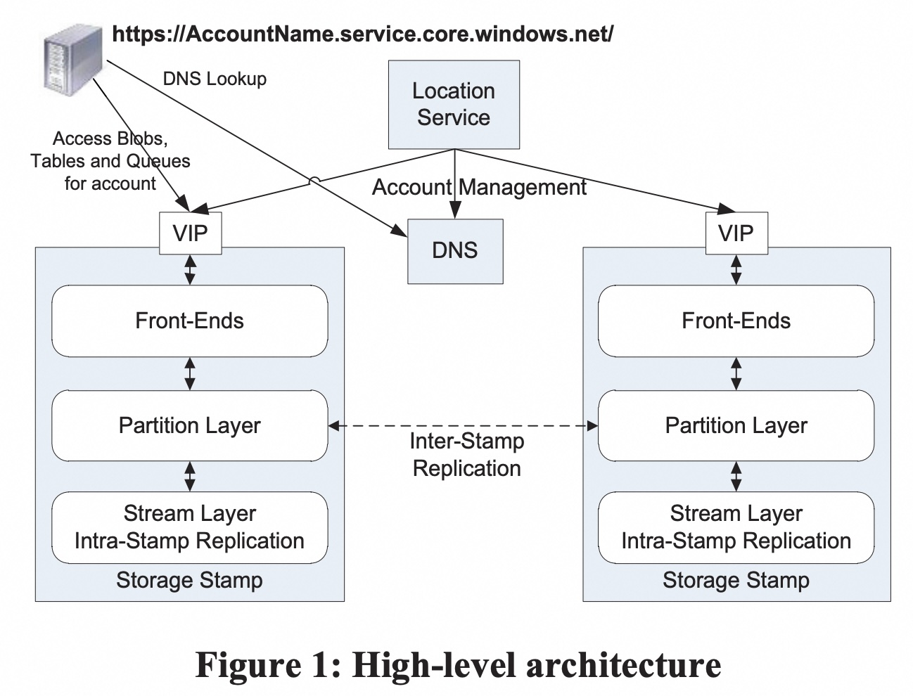
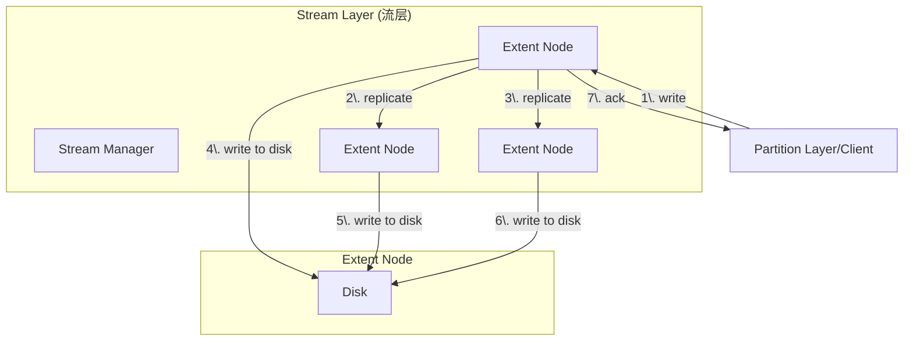
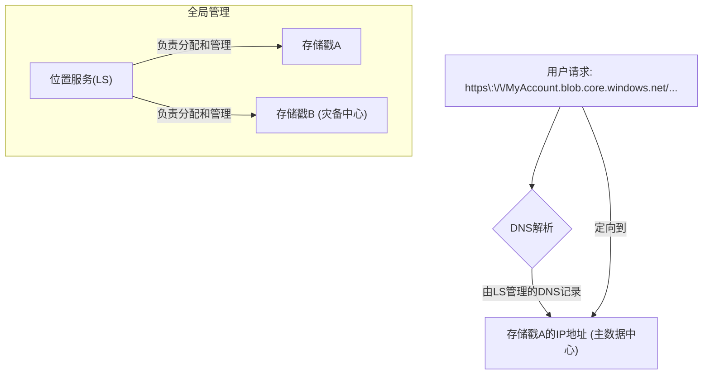
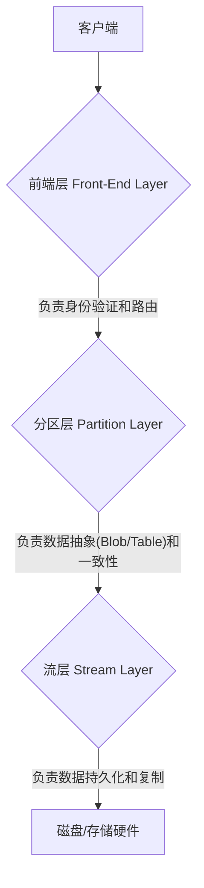

## AI论文解读 | Windows Azure Storage: A Highly Available Cloud Storage Service with Strong Consistency
        
### 作者        
digoal        
        
### 日期        
2025-09-28       
        
### 标签        
PostgreSQL , PolarDB , DuckDB , AI , 论文解读        
        
----        
        
## 背景  
      
https://dl.acm.org/doi/pdf/10.1145/2043556.2043571        
  
提示:          
```          
读懂《Windows Azure Storage: A Highly Available Cloud Storage Service with Strong Consistency》这篇论文需要提前掌握哪些基础知识, 请使用中文通熟易懂的讲解这些基础知识, 可以引用论文中的图、表或使用Markdown支持的图形(text,mermaid等)增加解释性. 
  
使用中文通熟易懂的解读《Windows Azure Storage: A Highly Available Cloud Storage Service with Strong Consistency》这篇论文, 其中的关键内容请着重讲解, 可以引用论文中的图、表或使用Markdown支持的图形(text,mermaid等)增加解释性. 
  
提取《Windows Azure Storage: A Highly Available Cloud Storage Service with Strong Consistency》这篇论文中的重要术语, 使用中文对这些术语进行通熟易懂的讲解, 可以引用论文中的图、表或使用Markdown支持的图形(text,mermaid等)增加解释性. 
```     
  
## 1 前置知识 
  
阅读《Windows Azure Storage: A Highly Available Cloud Storage Service with Strong Consistency》这篇论文需要掌握一些分布式系统和存储相关的基础知识。以下是根据论文内容，为您梳理和通俗讲解的关键基础概念，希望能帮助您更好地理解这篇论文。

-----

### 1\. 分布式系统核心概念

这篇论文的核心是构建一个大规模的分布式存储系统，因此理解一些分布式系统的基本原理是必不可少的。

#### CAP 定理（CAP Theorem）

这是分布式系统中的一个经典理论，它指出一个分布式系统无法同时满足以下三个特性，最多只能满足其中两个：

  * **一致性 (Consistency)**：所有节点在同一时间看到的数据是相同的。
  * **可用性 (Availability)**：系统必须对所有请求都做出响应，不能出现故障。
  * **分区容错性 (Partition Tolerance)**：当网络分区（节点之间无法通信）发生时，系统仍然能正常运行。

论文提到，WAS（Windows Azure Storage）系统在一个“存储戳”（Storage Stamp）内部，通过分层设计，实现了高可用性和强一致性 。这听起来似乎违背了CAP定理，但实际上，WAS是通过针对特定的故障模型进行设计来解决这个问题的 。

#### 强一致性 (Strong Consistency)

这是论文反复强调的一个关键特性 。强一致性意味着，当一个数据写入操作被确认后，任何后续的读取操作都保证能看到这个最新的数据。这与“最终一致性”（Eventual Consistency）不同，后者只保证数据最终会同步，但在短时间内，不同的节点可能会看到旧的数据。

#### 数据复制 (Data Replication)

为了保证数据的高可用性和持久性，WAS使用了两种不同的复制方式：

  * **“戳内复制” (Intra-Stamp Replication)**：在单个存储戳内部进行数据同步复制 。这是同步操作，即写入操作只有在数据成功复制到三个不同的节点后，才会向客户端返回成功 。它的主要目的是防止硬件故障导致的数据丢失，例如磁盘、节点或机架故障 。
  * **“跨戳复制” (Inter-Stamp Replication)**：在不同的地理数据中心之间进行数据异步复制 。这是异步操作，主要用于灾难恢复 。即使一个数据中心发生自然灾害，另一个数据中心仍有数据备份，可以恢复服务 。

-----

### 2\. WAS 系统架构与核心组件

论文的核心部分是描述WAS的架构。您可以参考论文中的图1来理解这个架构。   

#### 架构分层

WAS系统在一个“存储戳”内部被设计为三个层次 ，每层都有不同的职责：

1.  **前端层 (Front-End Layer)**：负责接收客户端请求，进行身份验证和授权，然后将请求路由到分区层 。
2.  **分区层 (Partition Layer)**：负责管理高层级的数据抽象（如Blob、Table、Queue），处理事务，并提供强一致性 。这个层也负责根据流量需求对数据进行负载均衡 。
3.  **流层 (Stream Layer)**：这是最底层的存储层，负责将数据块持久化到磁盘上，并在戳内进行数据复制以保证持久性 。

#### 关键服务

  * **位置服务 (Location Service)**：这是一个全局性的服务，它管理所有的存储戳 。当您创建一个新的存储账户时，位置服务会为您分配一个存储戳，并将您的账户名映射到该戳的虚拟IP地址 。
  * **存储戳 (Storage Stamp)**：一个存储戳可以理解为一个包含多个机架和存储节点的集群 。所有的数据都存储在这些戳中。

#### 核心算法：Paxos

流层的“流管理器”（Stream Manager）使用**Paxos算法** 。Paxos是一种分布式共识算法，用于在多台机器上就某个值达成共识。在这里，它被用来确保流层元数据的一致性和可靠性 。理解Paxos可以帮助您理解流管理器如何在多个节点故障的情况下保持元数据的一致性。

-----

### 3\. 数据模型与存储原理

#### Append-only System (仅追加系统)

WAS的流层是一个“仅追加系统” 。这意味着一旦数据被写入，就不能被修改或删除，只能通过追加新的数据来更新。这种设计极大地简化了复制协议和故障处理 。

#### 概念图

为了更好地理解流层，论文中给出了一个关键概念图，可以帮助您理解数据是如何存储的。



这是一个简化的流层写入流程。当客户端（分区层）发起写入请求时，它会发送给一个主节点（Primary EN）。主节点会协调将数据复制到两个辅节点（Secondary EN），并在所有三个节点都将数据成功写入磁盘后，才返回成功给客户端 。

-----

### 4\. 论文中其他重要概念

  * **Blobs（文件）、Tables（结构化存储）和 Queues（消息队列）** ：这些是WAS提供给客户的三种数据抽象 。理解它们的用途和它们在WAS架构中的映射关系是必要的。
  * **命名空间 (Namespace)**：论文详细介绍了其全局命名空间的设计，它由账户名（AccountName）、分区名（PartitionName）和对象名（ObjectName）组成 。理解这种分层命名方式如何让系统实现可扩展性。
  * **日志和日志合并树 (Log-Structured Merge-Tree)**：论文提到了使用日志文件来存储最近的操作 。这个概念与一些日志结构化文件系统或LSM树（Log-Structured Merge-Tree）有共通之处，这些技术能将随机写入转换为顺序写入，从而提高性能。

总的来说，要读懂这篇论文，您需要对分布式系统中的数据复制、一致性模型和容错机制有基本了解，并熟悉日志结构化存储和共识算法（如Paxos）等概念。

-----

希望这些基础知识能帮助您更好地理解这篇论文。您对其中提到的任何概念，例如**CAP定理**或**Paxos**，想让我再详细解释一下吗？

您好，很高兴为您详细讲解 CAP 定理和 Paxos 算法。这两个概念是理解分布式系统（包括像 WAS 这样的云存储服务）的基石。

### CAP 定理：分布式系统的“不可能三角”

CAP 定理是分布式系统领域的一个经典理论，由计算机科学家 Eric Brewer 在 2000 年提出。它指出在一个分布式系统中，你**无法同时满足**以下三个特性，最多只能选择其中两个：

* **一致性 (Consistency)**：所有节点在同一时刻看到的数据都是一致的。想象一下你在网上银行转账，如果你在手机上看到了转账成功，那么在电脑上刷新也必须立即看到账户余额减少。这就是强一致性。
* **可用性 (Availability)**：系统在面对任何非故障请求时，都必须及时给出响应。也就是说，只要系统没有完全崩溃，用户发来的请求就不能被拒绝，也不能无限期地等待。
* **分区容错性 (Partition Tolerance)**：当分布式系统中的节点因为网络故障而无法相互通信时（即发生了“网络分区”），系统仍能正常运行。网络分区是分布式系统不可避免的常态。

**为什么是“不可能三角”？**

让我们通过一个简单的例子来理解。假设你的系统有两个节点，A 和 B，数据 X 最初的值都是 10。

* **如果网络分区发生了**，A 和 B 无法通信。
* 这时，你在 A 上执行一个操作，将 X 更新为 20。
* **为了保证可用性**，A 必须立即响应你的请求，告诉你操作成功了。
* **为了保证一致性**，当你去 B 上读取 X 的值时，它也必须是 20。
* **但是**，由于网络分区，A 无法将这个更新同步到 B。你现在面临一个两难的境地：
    * **如果保证可用性（AP）** ：A 立即返回成功，但 B 的数据仍然是 10，一致性被打破。
    * **如果保证一致性（CP）** ：A 必须等待 B 的确认才能返回成功。但由于网络分区，永远等不到确认，请求就会超时，可用性被打破。

因此，在网络分区这个不可避免的现实下，我们必须在**一致性**和**可用性**之间做出权衡。WAS 论文中提到，它通过“戳内同步复制”实现了**强一致性**和**高可用性**。这是因为它将“网络分区”的范围限制在一个存储戳内部，并且通过同步复制的方式，牺牲了一部分网络分区的容错能力（当某个节点宕机时，整个复制操作会失败，但它并没有像异步系统那样让数据不一致）。

### Paxos：在“不可能三角”中实现共识

既然 CAP 定理表明我们无法同时拥有三者，那么如何在一个复杂的分布式系统中保证数据一致性呢？这就引出了像 Paxos 这样的“分布式共识算法”。

**Paxos 算法**是由 Leslie Lamport 提出的，其核心目标是让一组分布式节点，在可能出现节点故障、网络延迟或消息丢失的情况下，**就某个单一的值达成一致**。

您可以把 Paxos 想象成一个选举过程，需要选出一个“提案”（Proposal），并让所有参与者都同意这个提案。算法包含三个主要角色：

* **提议者 (Proposer)**：发起提案，并试图让大家达成一致。
* **接受者 (Acceptor)**：接收并投票给提案。
* **学习者 (Learner)**：从接受者那里学习到最终被选定的提案。

这个过程很复杂，但核心思想是：

1.  **准备阶段 (Prepare)**：提议者首先向大多数（超过半数）的接受者发出“准备”请求，询问它们是否接受过任何提案。
2.  **承诺阶段 (Promise)**：接受者回复提议者，并承诺不再接受任何编号低于当前提案的提案。
3.  **接受阶段 (Accept)**：提议者在收集到大多数接受者的承诺后，向它们发送“接受”请求，附带提案值。
4.  **最终决策 (Decision)**：如果提议者的提案被大多数接受者接受，那么这个提案就被选定了。

**Paxos 的作用**

在 WAS 论文中，Paxos 算法被用于流层（Stream Layer）的**元数据管理**。元数据，例如数据块的存储位置信息，必须在所有节点间保持强一致性。如果元数据不一致，系统就会出现混乱，甚至数据丢失。Paxos 算法确保了即使在部分节点发生故障时，系统仍然能可靠地对这些关键的元数据更新达成共识。

---

希望以上解释能够帮助您理解这两个关键概念。您对 WAS 论文中的其他部分还有疑问吗？比如它的**数据复制**或**负载均衡**机制？

---
### 数据复制（Data Replication）

在 WAS 论文中，数据复制是实现数据持久性和高可用的核心机制。论文详细描述了两种不同层面的数据复制：

#### 1. 戳内复制 (Intra-Stamp Replication)
这是 WAS 为了实现**强一致性**和**高可用性**而采用的主要复制方式。
* **复制范围**：在一个存储戳（Storage Stamp）内部，数据会被同步复制到三个独立的流节点（Stream Node），每个节点都位于不同的容错域（Fault Domain），例如不同的机架上。
* **复制方式**：同步复制。这意味着一个写入操作只有在数据成功写入到所有三个副本上并被确认后，才会向客户端返回成功。
* **容错能力**：由于数据有三个同步副本，WAS 可以容忍多达两个流节点的故障而不会丢失数据，并依然保持强一致性。论文中提到了“写操作到多数节点”（write to a majority），通常是三个节点中的两个，但这篇论文更严格，要求同步到全部三个副本。
* **持久性**：只有当数据被持久化到三个不同节点的磁盘上时，写入操作才被认为是成功的。这种设计确保了数据在短时间内不会因为硬件故障而丢失。

#### 2. 跨戳复制 (Inter-Stamp Replication)
这是为了实现**灾难恢复**而设计的异步复制机制。
* **复制范围**：数据从一个主存储戳（Primary Stamp）异步复制到另一个地理位置上独立的辅助存储戳（Secondary Stamp）。
* **复制方式**：异步复制。这意味着主存储戳在将数据写入到辅助存储戳之前，就已经向客户端返回成功了。因此，它不能保证强一致性。
* **容错能力**：当主数据中心发生自然灾害（如地震、洪水）时，辅助存储戳可以用来恢复服务。
* **一致性**：因为是异步复制，辅助存储戳的数据可能略有延迟。这意味着如果在主数据中心发生故障，辅助数据中心接管服务时，可能会有少量数据还没有同步过来，因此会损失一小部分数据。

这两个层次的复制共同保障了 WAS 服务的健壮性，一个用于**高可用**和**强一致性**，另一个用于**灾难恢复**。

---
### 负载均衡（Load Balancing）

WAS 系统需要处理海量的请求，因此有效的负载均衡机制至关重要。论文中主要提到了两种负载均衡：

#### 1. 分区层（Partition Layer）的负载均衡
* **目的**：将客户端的请求均匀地分发到不同的分区节点（Partition Node）。
* **实现**：WAS 使用了一个**虚拟的命名空间**。当一个请求到达前端层（Front-End Layer）后，它会被路由到一个分区层，然后分区层根据请求的键（如 Blob 的文件名）将请求映射到特定的分区节点。WAS 可以通过动态地将分区（Partition）移动到不同的分区节点上来实现负载均衡，这个过程是**增量式**（incremental）的。
* **工作原理**：如果一个分区节点上的负载过高，系统会自动将它所管理的分区中的部分数据“分裂”（split）出来，并将分裂出的新分区迁移到另一个负载较低的分区节点上。这个过程被称为“热点分区拆分”（hot partition splitting），它可以有效地将热点数据的负载分散开。

#### 2. 流层（Stream Layer）的负载均衡
* **目的**：将分区层的写入请求均匀地分发到不同的流节点（Stream Node）。
* **实现**：流层以“流”（stream）为单位进行管理，每个流由三个流节点组成。流层中的负载均衡主要是为了**管理流节点的容量**。当一个流节点上的负载过高或存储空间不足时，系统可以将其管理的部分流迁移到其他流节点。

简而言之，WAS 的负载均衡机制是**自适应**和**动态**的，它通过在不同的层次上移动数据（或数据分区）来实现。

---
您对这些机制有更具体的疑问吗？例如，您对 WAS 如何在不影响服务的情况下进行数据迁移感兴趣吗？

在 WAS 中，数据迁移是一个关键操作，用于实现负载均衡、故障恢复和节点维护，而且这个过程必须对客户端透明，不影响服务的持续可用性。论文虽然没有提供代码级别的细节，但描述了其核心机制，可以概括为以下几点：

### 1. 增量式迁移（Incremental Migration）

WAS 的数据迁移不是一次性移动所有数据，而是采用**增量式**的方法。
* **数据分块**：WAS 的数据被组织成称为“Extent”的块，这是流层（Stream Layer）中最小的数据单元。
* **分步复制**：当需要将一个流（Stream）从一个流节点迁移到另一个流节点时，系统会先在新的目标节点上创建这个流的副本。
* **增量同步**：在迁移过程中，任何对这个流的新写入操作都会同时写入到旧节点和新节点上。旧节点上的历史数据也会在后台逐步复制到新节点。

### 2. 元数据更新与事务（Metadata Update and Transactions）

为了确保迁移过程的原子性（要么成功，要么失败）和一致性，WAS 依赖于其分区层和流层的元数据管理。
* **原子性操作**：当流的数据完全复制到新节点后，流管理器（Stream Manager）会使用一个原子性操作来更新元数据，将流的“所有权”从旧节点转移到新节点。
* **事务性保证**：这个元数据更新操作通常是一个事务，确保在更新过程中即使出现故障，也不会导致数据丢失或不一致。

### 3. 透明性与客户端重定向（Transparency and Client Redirection）

WAS 的迁移机制对客户端是完全透明的，客户端无需感知底层数据的移动。
* **前端层代理**：客户端的请求首先到达前端层（Front-End Layer）。
* **位置服务**：前端层或分区层会查询位置服务（Location Service）来确定数据所在的分区节点或流节点。
* **重定向**：当数据被迁移到新节点后，位置服务中的元数据会相应更新。当客户端的请求再次到达时，它会被自动重定向到新的节点上，而客户端对此毫不知情。

---

总的来说，WAS 的数据迁移就像一场“隐形的搬家”。它通过在后台悄悄地复制数据，并在准备就绪后快速更新地址（元数据），从而确保服务的连续性。

您对论文中描述的这三种数据抽象——**Blobs、Tables 和 Queues**——的实现细节感兴趣吗？它们各自有什么特点，以及是如何映射到 WAS 的底层架构的？

很好，让我们来深入了解 WAS 提供的三种核心数据抽象：**Blobs**、**Tables** 和 **Queues**，以及它们是如何映射到底层存储架构的。

这三种服务的设计目的不同，因此它们在 WAS 内部的实现方式和数据模型也各不相同，但它们都建立在相同的底层流层（Stream Layer）之上。

---

### 1. Blobs (文件存储)

* **特点**: Blob 服务主要用于存储非结构化的文件数据，例如图片、视频、备份文件或日志文件等。它提供了类似于文件系统的功能，但以对象的形式进行管理。
* **数据模型**: 一个 Blob 由两个部分组成：
    1.  **Blob 数据 (Blob data)**：实际的文件内容。
    2.  **Blob 元数据 (Blob metadata)**：用户自定义的键值对，用于描述 Blob，例如文件的 MIME 类型或创建时间。
* **底层映射**: Blob 服务是直接构建在流层之上的。一个 Blob 被分解成一系列的“流”（Stream），每个流对应一个或多个底层数据块（Extent）。WAS 的分区层（Partition Layer）负责维护一个映射表，将逻辑的 Blob 名称映射到构成它的底层流。这种分块和映射的机制使得 WAS 能够轻松处理巨大的文件，并实现高效的并发读写。

### 2. Tables (结构化存储)

* **特点**: Table 服务提供了大规模、可扩展的结构化存储。它是一个 NoSQL 数据库，允许用户存储键值对形式的实体。它不提供关系数据库的复杂功能（如外键和联接），但针对海量数据的高并发读写进行了优化。
* **数据模型**: Table 服务使用一个简单的三元组来标识每个实体：`(AccountName, TableName, RowKey, PartitionKey)`。
    * **PartitionKey**：用于对数据进行分区和负载均衡。所有具有相同 PartitionKey 的实体会被存储在同一个分区中，以保证原子性。
    * **RowKey**：用于唯一标识分区内的实体。
    * **TableName**：用于区分不同的表。
* **底层映射**: 每个 Table 被划分为多个 **分区（Partition）** ，每个分区由一个或多个分区节点管理。这些分区节点又将数据持久化到底层的流层。WAS 通过将数据按 `PartitionKey` 进行哈希，将其映射到不同的分区，从而实现水平扩展。当某个分区过热（hot partition）时，系统可以自动将该分区拆分，并将数据迁移到其他分区节点，以实现负载均衡。

### 3. Queues (消息队列)

* **特点**: Queue 服务提供了一个可靠的消息传递机制，用于在分布式应用程序的不同组件之间进行异步通信。这对于解耦应用程序组件、构建可扩展的工作流和处理后台任务非常有用。
* **数据模型**: Queue 存储的是一系列消息。每条消息都有一个唯一的标识符，并且有一个超时时间。
* **底层映射**: 尽管 Queue 服务的接口是先进先出（FIFO）队列，但其底层实现也依赖于 WAS 的流层。每个队列实际上被实现为一个底层流。当一个组件将消息写入队列时，这个操作被追加到流中。当另一个组件读取消息时，它会从流中读取并标记为已处理。由于 WAS 的流层是“仅追加”（append-only）系统，这使得 Queue 的实现非常简洁高效。

---

总而言之，WAS 巧妙地在相同的底层存储原语（流层）之上，构建了三种截然不同的数据服务，以满足不同应用场景的需求。

您对这篇论文还有其他疑问吗？比如，对论文中提到的**全球命名空间**（Global Namespace）的实现方式感兴趣吗？

很高兴为您详细介绍 WAS 的全球命名空间（Global Namespace）的实现。这是 WAS 架构中一个非常重要的设计，因为它使得用户可以在全球任何地方访问自己的数据，并且保证了数据的唯一性和可寻址性。

### 全球命名空间的设计

WAS 的全球命名空间是一个**三层结构**，它由以下三个部分组成：

1.  **账号名（Account Name）** ：这是命名空间的根。当用户在 Azure 上创建一个存储账号时，系统会为其分配一个全球唯一的账号名。所有的 Blob、Table 和 Queue 服务都属于这个账号。这个账号名是公开可见的，并且构成了访问 URL 的一部分。例如：`http://[accountname].blob.core.windows.net/`
2.  **服务名（Service Name）** ：在账号名的下面是服务名，它将数据进一步划分为 Blob、Table 或 Queue 服务。
3.  **对象名（Object Name）** ：这是命名空间的最低层，用于标识具体的数据对象。对于 Blob 服务，它指的是 Blob 的名称；对于 Table 和 Queue 服务，它则包含表名、行键（RowKey）和分区键（PartitionKey）。

这种分层设计的好处在于：
* **全球唯一性**：通过确保每个账号名都是全球唯一的，WAS 能够保证每个数据对象在整个系统中都有一个独一无二的地址。
* **可寻址性**：用户可以通过一个简洁的 URL，如 `http://[accountname].blob.core.windows.net/[container]/[blobname]`，来定位和访问自己的数据。
* **可扩展性**：这种分层结构将全局命名空间管理与底层的数据存储（存储戳）解耦，使得 WAS 可以独立地扩展存储容量，而无需改变命名空间的设计。

### 全球命名空间与底层架构的映射

WAS 的全球命名空间如何与底层的物理存储（存储戳）关联起来，是其实现的关键。这个映射过程主要由一个名为 **位置服务（Location Service）** 的组件来完成。

1.  **账号与存储戳的关联**：当用户创建一个新的存储账号时，位置服务会负责为这个账号分配一个可用的**存储戳**。存储戳是 WAS 的核心存储集群，包含大量的服务器和存储设备。一个存储戳可以为多个存储账号提供服务。
2.  **DNS 解析与路由**：当客户端发起一个请求时，比如访问 `http://[accountname].blob.core.windows.net/`，DNS 服务会将这个 URL 解析为一个虚拟 IP 地址。这个虚拟 IP 地址被映射到位置服务。
3.  **位置服务的元数据查询**：位置服务会维护一个全局的元数据表，其中包含了每个账号名与它所分配的存储戳的映射关系。
4.  **请求重定向**：一旦位置服务确定了请求对应的存储戳，它就会将请求重定向到该存储戳的前端层（Front-End Layer），由前端层进一步处理具体的请求。

通过这种设计，WAS 实现了**全球范围内的可寻址性和负载均衡**。例如，如果一个存储戳的负载过高，位置服务可以分配一个新的存储戳，并将新的存储账号分配到这个新戳上，从而实现扩展。

---

希望这个解释能帮助您更深入地理解 WAS 的全球命名空间。您对论文中提到的**日志结构化存储**或**LSM-Tree**感兴趣吗？这是理解底层数据持久化机制的关键。

在《Windows Azure Storage》这篇论文中， **日志结构化存储（Log-Structured Storage）** 是一个非常核心的概念，特别是在它的底层流层（Stream Layer）中。这个概念借鉴了日志结构化文件系统（LFS）的思想，并根据分布式存储的特点进行了优化。

### 什么是日志结构化存储？

传统的存储系统，如文件系统或数据库，通常通过随机写入（Random Write）来更新数据。例如，当你要修改文件中的一个字节时，系统会找到该字节在磁盘上的位置，然后直接覆盖它。这种方式在机械硬盘时代效率很低，因为需要频繁地移动磁头。

**日志结构化存储**则完全颠覆了这种模式。它的核心思想是：**将所有的写入操作都当作日志记录，以追加（append-only）的方式顺序写入**。就像你写日记一样，新内容总是加在日记本的最后。

* **写入模式**：**只进行顺序写入**。无论是新数据、更新还是删除，都会作为一条新的日志记录追加到存储介质的末尾。
* **读取模式**：由于写入是顺序的，读取时需要通过**索引**来定位数据。这些索引通常被保存在内存中，或者以特殊的数据结构（如 LSM-Tree）保存在磁盘上。
* **空间回收（Garbage Collection）** ：因为旧版本的日志记录永远不会被覆盖，所以随着时间的推移，存储空间会被越来越多的旧数据占据。系统需要一个后台进程，定期将“活”的数据（即最新版本的数据）从旧日志段中复制到新的日志段，然后回收旧日志段的空间。这个过程也被称为“**垃圾回收**”。

### WAS 中的日志结构化存储

WAS 的流层正是采用了这种日志结构化存储的设计。

* **数据模型**：流层以“流”（Stream）为单位管理数据，每个流都是一个**仅追加**的数据结构。所有写入操作都会以追加的方式写入流中。
* **优点**：
    1.  **高效的写入性能**：所有的写入都是顺序的，极大地减少了磁盘寻道时间，非常适合机械硬盘。
    2.  **简化并发控制**：因为没有随机更新操作，多个并发写入可以简单地追加到日志末尾，避免了复杂的加锁机制。
    3.  **简化数据复制**：由于数据总是以顺序日志的形式存在，数据复制变得非常简单，只需要将日志流从一个节点复制到另一个节点即可。

---

**LSM-Tree（日志结构化合并树）** 是与日志结构化存储密切相关的一种数据结构，它常用于实现这种存储模型。它通过将随机写入转换为顺序写入来提高性能，在 WAS 的 Table 服务中，这个概念得到了应用。

您想更深入地了解 LSM-Tree 的工作原理，以及它在 WAS 中的具体应用吗？
  
## 2 解读论文 
  
好的，我们来一起深入解读这篇经典的分布式系统论文——《Windows Azure Storage: A highly Available Cloud Storage Service with Strong Consistency》。

这篇论文详细介绍了微软云存储服务（WAS）的早期架构，这是一个旨在提供海量、高可用、并且具备**强一致性**保障的云存储系统。简单来说，它就是Azure平台上处理各种数据存储需求的基石。

首先，WAS提供了三种核心的数据服务类型，以满足不同的应用场景 ：

  * **Blob (文件存储):** 用于存储非结构化数据，比如图片、视频、日志文件等。你可以把它想象成一个无限大的网络硬盘。
  * **Table (表格存储):** 一种NoSQL键值存储，用于存放结构化数据。它适合需要快速查询和大规模扩展的场景，例如用户信息、订单记录等。
  * **Queue (队列存储):** 提供可靠的消息传递服务，主要用于应用程序不同组件之间的解耦和异步通信。

-----

## 核心架构：全局视角与三层设计

WAS的整体架构设计精巧，可以从两个层面来理解：宏观的全局架构和微观的“存储戳”内部架构。

### 全局架构：位置服务与存储戳

从最高层面看，整个WAS系统由两大组件构成（见论文图1） ：   

1.  **位置服务 (Location Service, LS):** 这是整个系统的“全局大脑” 。它管理着全球所有的数据中心，负责将用户的存储账户分配到最合适的“存储戳”中，并处理跨数据中心的灾难恢复和负载均衡 。当一个新用户注册存储服务时，LS会根据用户指定的地理位置（如“华北”）和各个数据中心的负载情况，为他选择一个主数据中心 。

2.  **存储戳 (Storage Stamp):** 这是实际存储数据的工作单元，本质上是一个由10-20个机架组成的、自成体系的存储集群 。每个存储戳都部署在一个数据中心内，具备完整的存储和处理能力。用户的绝大部分读写请求，都直接发送到其账户所在的存储戳中。

我们可以用下面的流程图来简化理解这个关系：



### 存储戳内部的三层架构

每个存储戳内部，又被精心划分为三个协同工作的层次，自下而上分别是流层、分区层和前端层 。这种分层设计是实现高性能和强一致性的关键。

#### 1\. 流层 (Stream Layer) - 可靠的分布式文件系统

流层是整个架构的基石，你可以把它看作一个内部专用的、只支持 **追加写入(Append-Only)** 的分布式文件系统 。

  * **核心职责：** 负责将数据比特流持久化地存储在磁盘上，并在存储戳**内部**实现数据的**同步复制**，确保数据的高持久性 。
  * **关键概念：**
      * **流(Stream):** 类似于一个文件。
      * **区(Extent):** 是“流”的组成部分，也是数据复制的基本单位 。一个“区”通常包含多个数据块。
      * **同步复制 (Intra-Stamp Replication):** 这是实现强一致性的第一道防线。当一份数据写入时，它会被**同步地**复制到**三个**位于不同物理节点（甚至不同机架）的副本上 。只有当所有三个副本都确认写入成功后，系统才会向客户端返回成功信号 。这确保了即使发生单个节点或机架的故障，数据也绝不会丢失。
      * **密封(Sealing):** 当一个“区”的某个副本发生写入失败时，系统会立即将这个“区”在所有副本上“密封”起来，使其变为只读 。然后系统会创建一个新的“区”来处理后续的写入请求。这个机制极大地简化了故障恢复逻辑 。

#### 2\. 分区层 (Partition Layer) - 智能的数据管理核心

如果说流层是“四肢”，那么分区层就是“大脑”。它负责理解高级的数据结构（Blob、Table），并实现系统的弹性伸缩和跨数据中心的灾难恢复 。

  * **核心职责:** 管理海量对象的命名空间，提供事务处理能力，并执行**自动负载均衡**和**跨地域的异步复制**。
  * **关键概念:**
      * **对象表(Object Table):** 系统内部用来组织数据的巨大表格，例如一张表存放了所有账户的所有Blob信息 。
      * **范围分区(RangePartition):** 这是实现无限扩展的关键。系统会将巨大的“对象表”根据主键（如账户名+文件名）切分成许多个连续的、不重叠的“范围分区” 。每个分区由一个分区服务器（Partition Server）负责。
      * **自动负载均衡:** 分区层会持续监控每个分区的访问热度，并自动执行三种操作来平衡负载 ：
          * **分裂(Split):** 当某个分区访问过于频繁（成为热点）时，系统会自动将其一分为二，并将新的分区交给另一台服务器处理，从而分散压力 。
          * **合并(Merge):** 当相邻的几个分区访问量都很低时，系统会将它们合并，以减少管理开销 。
          * **移动(Load Balance):** 当某台服务器整体负载过高时，系统会将其中的一个或多个分区迁移到负载较轻的服务器上 。
      * **异步复制 (Inter-Stamp Replication):** 这是实现异地灾备的核心。当数据在主存储戳内完成同步复制后，分区层会**异步地**将这次变更复制到位于另一个地理位置的备用存储戳中 。这种设计将灾备复制移出用户请求的关键路径，保证了写入操作的低延迟 。

#### 3\. 前端层 (Front-End Layer) - 无状态的请求入口

这一层是用户请求的直接入口 。它由一群无状态的服务器组成，负责：

  * **认证与授权:** 验证用户请求的合法性。
  * **请求路由:** 根据请求的账户名和对象名，查询分区层的“分区地图”，并将请求准确地转发给负责相应“范围分区”的后台分区服务器 。

-----

## 两大复制引擎：职责分离的设计精髓

WAS设计中最精妙的一点，就是将复制机制一分为二，分别在不同层次解决不同问题。

| 特性             | 戳内复制 (Intra-Stamp Replication) | 戳间复制 (Inter-Stamp Replication) |
| ---------------- | ----------------------------------- | ----------------------------------- |
| **所在层次** | 流层 (Stream Layer)       | 分区层 (Partition Layer)  |
| **目标** | 应对硬件故障，保证数据持久性  | 实现异地灾备和数据迁移  |
| **方式** | **同步 (Synchronous)**      | **异步 (Asynchronous)**     |
| **对用户请求影响** | **在关键路径上**，影响写入延迟  | **不在关键路径上**，对写入延迟无影响  |
| **复制粒度** | 数据块/区 (Extent)          | 对象/事务 (Object)        |
| **应对场景** | 磁盘损坏、服务器宕机、机架掉电        | 地震、火灾等数据中心级别的灾难        |

这种分离设计，使得WAS可以在不牺牲写入性能的前提下，同时提供数据中心内的高持久性和跨地域的灾难恢复能力。

-----

## 设计哲学与经验教训

论文最后总结了一些宝贵的设计经验，至今仍有借鉴意义：

  * **计算与存储分离:** WAS从设计之初就将运行用户应用的计算节点和存储节点分开部署 。这使得两者可以独立扩展，互不影响，也为多租户环境提供了更好的隔离 。
  * **Append-only 的巨大优势:** 只追加、不修改的设计极大地简化了复制和故障恢复的复杂性 。同时，它天然地保留了数据的历史版本，为实现快照等功能提供了便利 。
  * **日志系统(Journaling)的性能提升:** 实践发现，在数据盘之外，为每个存储节点增加一个专用的高速日志盘（Journal Drive）能显著降低写入延迟、减少性能抖动 。因为所有的写入操作可以先快速写入日志盘后就向客户端返回成功，然后再异步地写入到最终的数据盘，避免了读写争用。
  * **对CAP理论的诠释:** CAP理论断言，一个分布式系统无法同时满足一致性（Consistency）、可用性（Availability）和分区容忍性（Partition Tolerance）。WAS声称在实践中三者兼得 ，其秘诀在于它针对**数据中心内部常见故障模型**进行了优化。系统被设计为可以容忍节点和机架级别的网络分区（这是最常见的故障），在这种情况下，通过快速的故障检测和分区迁移，依然能同时提供强一致性和高可用性 。

总而言之，这篇论文为我们展示了一个工业级的、超大规模云存储系统的完整设计蓝图。它通过精巧的分层架构、职责明确的双重复制引擎以及一系列务实的设计决策，成功地在性能、可用性、数据一致性和成本之间取得了出色的平衡。

-----

您是想深入了解其中某一个特定层面（比如流层的复制细节或分区层的负载均衡算法），还是对它与其他系统（如Google的GFS/BigTable）的对比更感兴趣呢？
  
## 3 术语 
  
好的，我将从《Windows Azure Storage》这篇论文中提取重要术语，并用通俗易懂的中文为您进行讲解。这些术语是理解 WAS 系统设计和工作原理的关键。

-----

### 1\. 系统架构与基本概念

#### **存储戳 (Storage Stamp)**

  * **通俗解释**：你可以把它想象成 WAS 的一个基本构建单元，一个独立的数据中心或大型服务器集群。每个存储戳都包含 WAS 的所有组件，并且能够独立运行。论文中的 WAS 服务就是由成百上千个这样的存储戳组成的。

#### **分层架构 (Tiered Architecture)**

  * **通俗解释**：WAS 的核心架构被设计成三层，每层都承担不同的职责，这有助于实现职责分离和可扩展性。你可以用下面的图来理解：




  * **前端层 (Front-End)**：是 WAS 的入口，负责处理客户端请求，进行身份验证和授权，并将请求分发到下一层。
  * **分区层 (Partition)**：负责管理高层级的数据抽象（如 Blob、Table），处理事务，并确保数据的强一致性。
  * **流层 (Stream)**：是最底层的存储层，负责将数据持久化到磁盘，并进行数据复制。

### 2\. 一致性与容错

#### **强一致性 (Strong Consistency)**

  * **通俗解释**：这是一项非常重要的服务承诺。它意味着当一个数据写入操作成功后，任何后续的读取操作都保证能看到这个最新的数据。这就像你去银行存钱，存完后马上查余额，肯定会看到最新的数字，而不是之前的旧数字。

#### **数据复制 (Data Replication)**

  * **通俗解释**：为了保证数据不丢失和高可用，WAS 在不同层面进行数据复制。
  * **戳内复制 (Intra-Stamp Replication)**：为了防止单个硬件故障，数据在同一个存储戳内被同步复制到三个不同的服务器上。只有当所有三个副本都成功写入后，写入操作才算成功。
  * **跨戳复制 (Inter-Stamp Replication)**：为了应对整个数据中心级别的灾难（如地震），数据会被异步复制到另一个地理位置不同的存储戳。

#### **CAP 定理 (CAP Theorem)**

  * **通俗解释**：这是一个著名的分布式系统理论，指出一个分布式系统无法同时满足**一致性**（Consistency）、**可用性**（Availability）和**分区容错性**（Partition Tolerance），最多只能满足其中两个。WAS 论文通过其同步复制机制，主要选择了在**一致性**和**可用性**上做保障，同时通过三副本设计实现了高容错。

#### **Paxos 算法**

  * **通俗解释**：这是一种非常复杂的分布式共识算法，论文中提到流层的元数据管理使用了这个算法。简单来说，Paxos 就像一个选举委员会，它确保即使有部分成员（服务器）宕机或失联，委员会中的所有成员都能就某个值（如元数据更新）达成一致。

### 3\. 数据模型与存储

#### **日志结构化存储 (Log-Structured Storage)**

  * **通俗解释**：这是一种颠覆性的存储模式，它将所有的写入操作都当作日志，**只进行顺序追加**，而不进行随机写入或修改。
  * **优点**：非常适合机械硬盘，因为顺序写入速度远高于随机写入。
  * **缺点**：需要额外的**垃圾回收**机制来回收旧版本的存储空间。

#### **仅追加系统 (Append-only System)**

  * **通俗解释**：这是日志结构化存储的一种表现形式，意味着一旦数据被写入，就不能被修改或删除，只能通过追加新的数据来更新。

#### **数据抽象 (Data Abstractions)**

  * **通俗解释**：WAS 在底层存储之上，为用户提供了三种不同的数据服务接口，以满足不同需求。
  * **Blob (文件)**：非结构化的数据存储，比如图片、视频或备份文件。
  * **Table (表格)**：高可扩展的 NoSQL 数据库，用于存储结构化数据。
  * **Queue (队列)**：消息队列服务，用于在应用的不同组件间进行异步通信。

-----

希望这些解释能帮助您更好地理解这篇论文。您对这些术语的实际应用，比如在当今的云存储服务中，还有哪些体现方式感兴趣吗？
  
## 参考        
         
https://dl.acm.org/doi/pdf/10.1145/2043556.2043571    
        
<b> 以上内容基于DeepSeek、Qwen、Gemini及诸多AI生成, 轻微人工调整, 感谢杭州深度求索人工智能、阿里云、Google等公司. </b>        
        
<b> AI 生成的内容请自行辨别正确性, 当然也多了些许踩坑的乐趣, 毕竟冒险是每个男人的天性.  </b>        
  