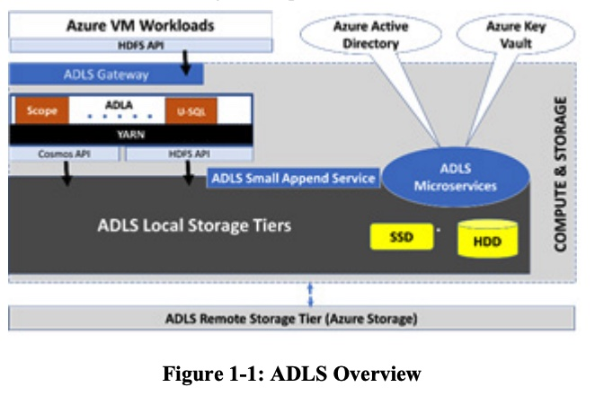
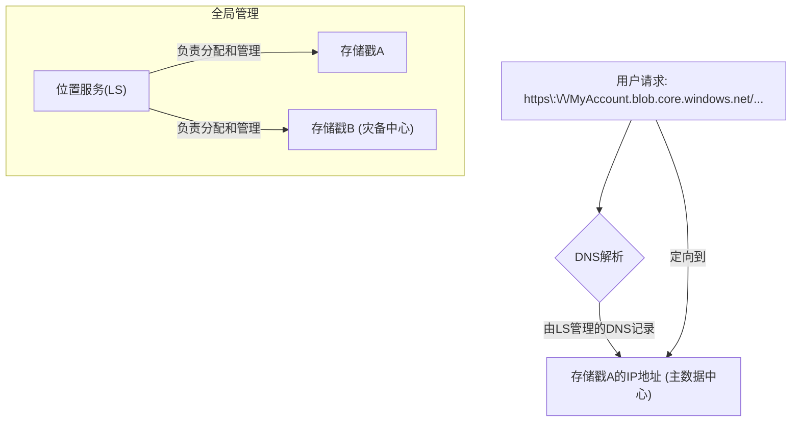
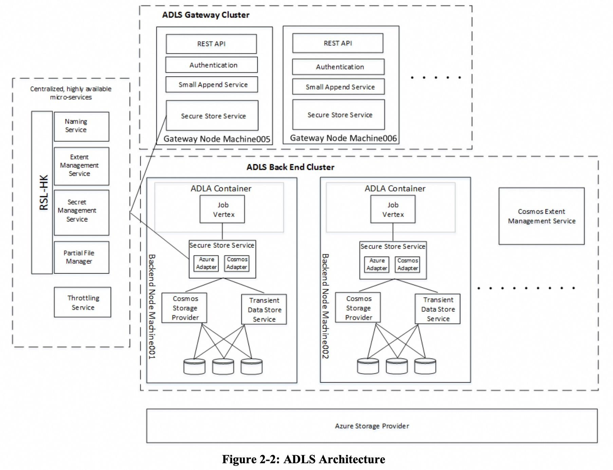
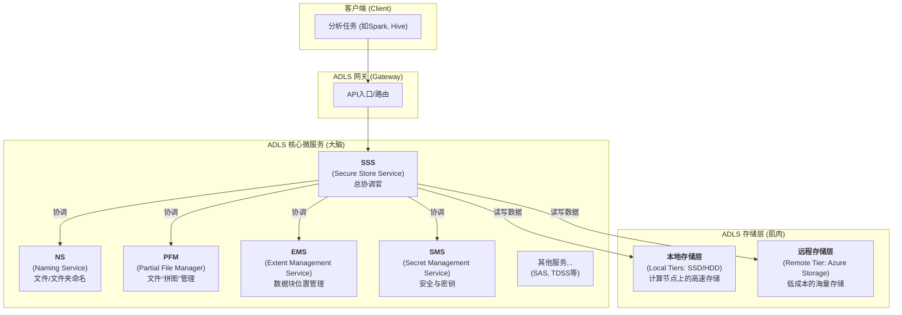
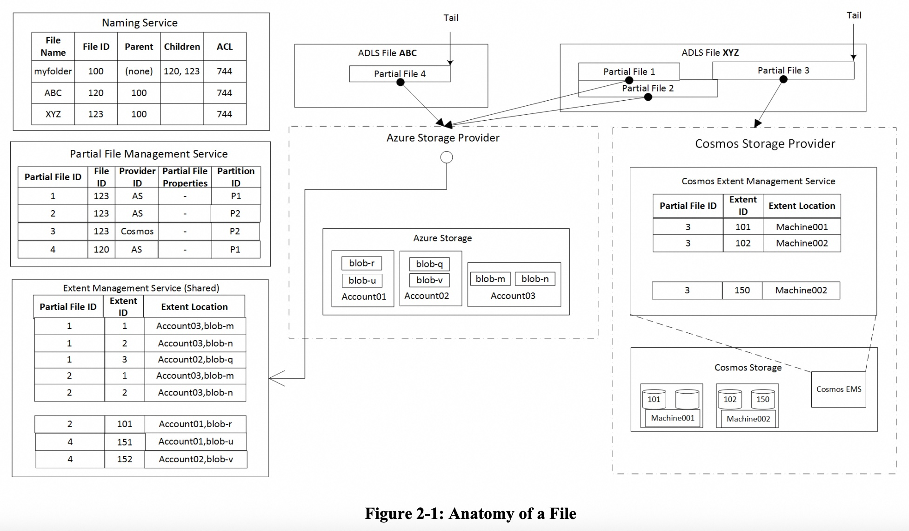
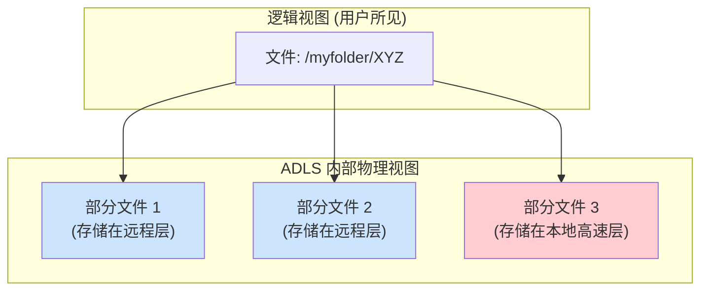
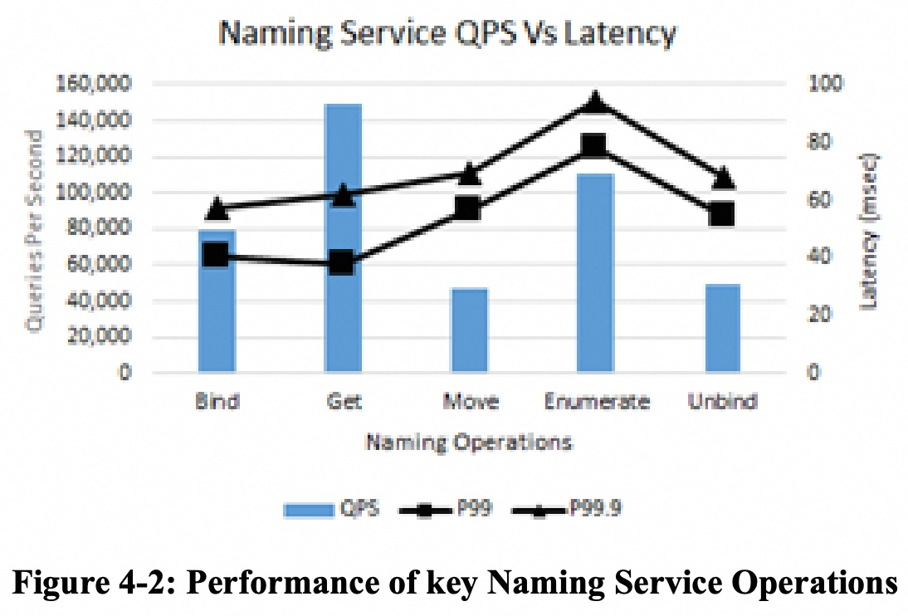
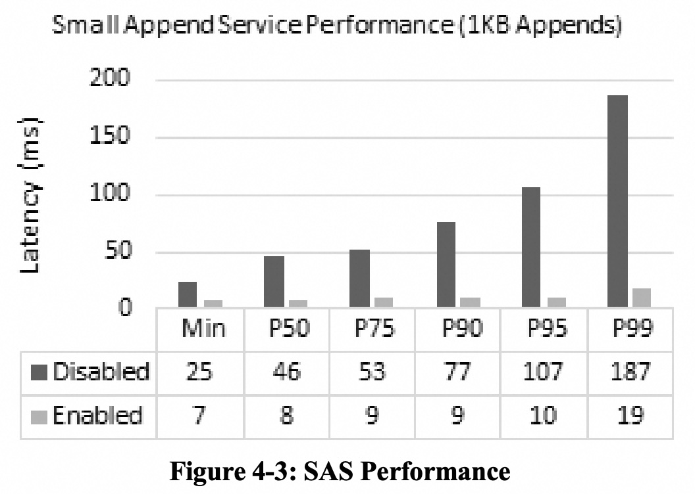

## AI论文解读 | Azure Data Lake Store: A Hyperscale Distributed File Service for Big Data Analytics
        
### 作者        
digoal        
        
### 日期        
2025-09-28       
        
### 标签        
PostgreSQL , PolarDB , DuckDB , AI , 论文解读        
        
----        
        
## 背景  
      
https://dl.acm.org/doi/pdf/10.1145/3035918.3056100        
  
提示:          
```          
读懂《Azure Data Lake Store: A Hyperscale Distributed File Service for Big Data Analytics》这篇论文需要提前掌握哪些基础知识, 请使用中文通熟易懂的讲解这些基础知识, 可以引用论文中的图、表或使用Markdown支持的图形(text,mermaid等)增加解释性. 
  
使用中文通熟易懂的解读《Azure Data Lake Store: A Hyperscale Distributed File Service for Big Data Analytics》这篇论文, 其中的关键内容请着重讲解, 可以引用论文中的图、表或使用Markdown支持的图形(text,mermaid等)增加解释性. 
  
提取《Azure Data Lake Store: A Hyperscale Distributed File Service for Big Data Analytics》这篇论文中的重要术语, 使用中文对这些术语进行通熟易懂的讲解, 可以引用论文中的图、表或使用Markdown支持的图形(text,mermaid等)增加解释性. 
```     
  
## 1 前置知识 
  
好的，我们来一起深入解读这篇经典的分布式系统论文——《Windows Azure Storage: A highly Available Cloud Storage Service with Strong Consistency》。

这篇论文详细介绍了微软云存储服务（WAS）的早期架构，这是一个旨在提供海量、高可用、并且具备**强一致性**保障的云存储系统。简单来说，它就是Azure平台上处理各种数据存储需求的基石。

首先，WAS提供了三种核心的数据服务类型，以满足不同的应用场景 ：

  * **Blob (文件存储):** 用于存储非结构化数据，比如图片、视频、日志文件等。你可以把它想象成一个无限大的网络硬盘。
  * **Table (表格存储):** 一种NoSQL键值存储，用于存放结构化数据。它适合需要快速查询和大规模扩展的场景，例如用户信息、订单记录等。
  * **Queue (队列存储):** 提供可靠的消息传递服务，主要用于应用程序不同组件之间的解耦和异步通信。

-----

## 核心架构：全局视角与三层设计

WAS的整体架构设计精巧，可以从两个层面来理解：宏观的全局架构和微观的“存储戳”内部架构。

### 全局架构：位置服务与存储戳

从最高层面看，整个WAS系统由两大组件构成（见论文图1） ：    

1.  **位置服务 (Location Service, LS):** 这是整个系统的“全局大脑” 。它管理着全球所有的数据中心，负责将用户的存储账户分配到最合适的“存储戳”中，并处理跨数据中心的灾难恢复和负载均衡 。当一个新用户注册存储服务时，LS会根据用户指定的地理位置（如“华北”）和各个数据中心的负载情况，为他选择一个主数据中心 。

2.  **存储戳 (Storage Stamp):** 这是实际存储数据的工作单元，本质上是一个由10-20个机架组成的、自成体系的存储集群 。每个存储戳都部署在一个数据中心内，具备完整的存储和处理能力。用户的绝大部分读写请求，都直接发送到其账户所在的存储戳中。

我们可以用下面的流程图来简化理解这个关系：



### 存储戳内部的三层架构

每个存储戳内部，又被精心划分为三个协同工作的层次，自下而上分别是流层、分区层和前端层 。这种分层设计是实现高性能和强一致性的关键。

#### 1\. 流层 (Stream Layer) - 可靠的分布式文件系统

流层是整个架构的基石，你可以把它看作一个内部专用的、只支持 **追加写入(Append-Only)** 的分布式文件系统 。

  * **核心职责：** 负责将数据比特流持久化地存储在磁盘上，并在存储戳**内部**实现数据的**同步复制**，确保数据的高持久性 。
  * **关键概念：**
      * **流(Stream):** 类似于一个文件。
      * **区(Extent):** 是“流”的组成部分，也是数据复制的基本单位 。一个“区”通常包含多个数据块。
      * **同步复制 (Intra-Stamp Replication):** 这是实现强一致性的第一道防线。当一份数据写入时，它会被**同步地**复制到**三个**位于不同物理节点（甚至不同机架）的副本上 。只有当所有三个副本都确认写入成功后，系统才会向客户端返回成功信号 。这确保了即使发生单个节点或机架的故障，数据也绝不会丢失。
      * **密封(Sealing):** 当一个“区”的某个副本发生写入失败时，系统会立即将这个“区”在所有副本上“密封”起来，使其变为只读 。然后系统会创建一个新的“区”来处理后续的写入请求。这个机制极大地简化了故障恢复逻辑 。

#### 2\. 分区层 (Partition Layer) - 智能的数据管理核心

如果说流层是“四肢”，那么分区层就是“大脑”。它负责理解高级的数据结构（Blob、Table），并实现系统的弹性伸缩和跨数据中心的灾难恢复 。

  * **核心职责:** 管理海量对象的命名空间，提供事务处理能力，并执行**自动负载均衡**和**跨地域的异步复制**。
  * **关键概念:**
      * **对象表(Object Table):** 系统内部用来组织数据的巨大表格，例如一张表存放了所有账户的所有Blob信息 。
      * **范围分区(RangePartition):** 这是实现无限扩展的关键。系统会将巨大的“对象表”根据主键（如账户名+文件名）切分成许多个连续的、不重叠的“范围分区” 。每个分区由一个分区服务器（Partition Server）负责。
      * **自动负载均衡:** 分区层会持续监控每个分区的访问热度，并自动执行三种操作来平衡负载 ：
          * **分裂(Split):** 当某个分区访问过于频繁（成为热点）时，系统会自动将其一分为二，并将新的分区交给另一台服务器处理，从而分散压力 。
          * **合并(Merge):** 当相邻的几个分区访问量都很低时，系统会将它们合并，以减少管理开销 。
          * **移动(Load Balance):** 当某台服务器整体负载过高时，系统会将其中的一个或多个分区迁移到负载较轻的服务器上 。
      * **异步复制 (Inter-Stamp Replication):** 这是实现异地灾备的核心。当数据在主存储戳内完成同步复制后，分区层会**异步地**将这次变更复制到位于另一个地理位置的备用存储戳中 。这种设计将灾备复制移出用户请求的关键路径，保证了写入操作的低延迟 。

#### 3\. 前端层 (Front-End Layer) - 无状态的请求入口

这一层是用户请求的直接入口 。它由一群无状态的服务器组成，负责：

  * **认证与授权:** 验证用户请求的合法性。
  * **请求路由:** 根据请求的账户名和对象名，查询分区层的“分区地图”，并将请求准确地转发给负责相应“范围分区”的后台分区服务器 。

-----

## 两大复制引擎：职责分离的设计精髓

WAS设计中最精妙的一点，就是将复制机制一分为二，分别在不同层次解决不同问题。

| 特性             | 戳内复制 (Intra-Stamp Replication) | 戳间复制 (Inter-Stamp Replication) |
| ---------------- | ----------------------------------- | ----------------------------------- |
| **所在层次** | 流层 (Stream Layer)       | 分区层 (Partition Layer)  |
| **目标** | 应对硬件故障，保证数据持久性  | 实现异地灾备和数据迁移  |
| **方式** | **同步 (Synchronous)**      | **异步 (Asynchronous)**     |
| **对用户请求影响** | **在关键路径上**，影响写入延迟  | **不在关键路径上**，对写入延迟无影响  |
| **复制粒度** | 数据块/区 (Extent)          | 对象/事务 (Object)        |
| **应对场景** | 磁盘损坏、服务器宕机、机架掉电        | 地震、火灾等数据中心级别的灾难        |

这种分离设计，使得WAS可以在不牺牲写入性能的前提下，同时提供数据中心内的高持久性和跨地域的灾难恢复能力。

-----

## 设计哲学与经验教训

论文最后总结了一些宝贵的设计经验，至今仍有借鉴意义：

  * **计算与存储分离:** WAS从设计之初就将运行用户应用的计算节点和存储节点分开部署 。这使得两者可以独立扩展，互不影响，也为多租户环境提供了更好的隔离 。
  * **Append-only 的巨大优势:** 只追加、不修改的设计极大地简化了复制和故障恢复的复杂性 。同时，它天然地保留了数据的历史版本，为实现快照等功能提供了便利 。
  * **日志系统(Journaling)的性能提升:** 实践发现，在数据盘之外，为每个存储节点增加一个专用的高速日志盘（Journal Drive）能显著降低写入延迟、减少性能抖动 。因为所有的写入操作可以先快速写入日志盘后就向客户端返回成功，然后再异步地写入到最终的数据盘，避免了读写争用。
  * **对CAP理论的诠释:** CAP理论断言，一个分布式系统无法同时满足一致性（Consistency）、可用性（Availability）和分区容忍性（Partition Tolerance）。WAS声称在实践中三者兼得 ，其秘诀在于它针对**数据中心内部常见故障模型**进行了优化。系统被设计为可以容忍节点和机架级别的网络分区（这是最常见的故障），在这种情况下，通过快速的故障检测和分区迁移，依然能同时提供强一致性和高可用性 。

总而言之，这篇论文为我们展示了一个工业级的、超大规模云存储系统的完整设计蓝图。它通过精巧的分层架构、职责明确的双重复制引擎以及一系列务实的设计决策，成功地在性能、可用性、数据一致性和成本之间取得了出色的平衡。

-----

您是想深入了解其中某一个特定层面（比如流层的复制细节或分区层的负载均衡算法），还是对它与其他系统（如Google的GFS/BigTable）的对比更感兴趣呢？

HDFS（Hadoop Distributed File System）的设计理念和工作原理可以归纳为以下几点，这有助于你更好地理解它与ADLS在论文中的对比。

---

### HDFS的核心工作原理

HDFS的设计初衷是为了处理海量数据，并提供高吞吐量的数据读写能力，尤其擅长处理大文件和流式数据访问。它的核心思想基于**主/从（Master/Slave）架构**，主要由两个核心组件构成：

**1. NameNode（主节点）**
NameNode是HDFS的大脑，它负责管理整个文件系统的**元数据**。这些元数据包括：
* **文件和目录的命名空间（Namespace）** ：比如 `/user/data/input.txt` 这样的文件路径。
* **文件到数据块（Block）的映射关系**：一个大文件会被切分成多个固定大小的数据块（默认为128MB），NameNode会记录每个文件由哪些数据块组成。
* **数据块到DataNode的映射关系**：记录每个数据块存储在哪个或哪些DataNode上。

NameNode将这些元数据保存在内存中，以提供快速访问。为了防止元数据丢失，NameNode会将元数据持久化到磁盘上，主要通过两种文件：
* **FsImage**：一个完整的元数据镜像文件，记录了文件系统的所有状态。
* **EditLog**：记录了文件系统所有的修改操作（如创建、删除文件等）。

当NameNode启动时，它会先加载FsImage，然后回放EditLog中的所有操作，以恢复到最新的文件系统状态。

**2. DataNode（从节点）**
DataNode是HDFS的真正数据存储者，它们负责管理物理磁盘上的数据块。每个DataNode会定期向NameNode发送 **心跳（Heartbeat）** 和 **数据块报告（Block Report）** ，告知NameNode自己存储了哪些数据块以及自己的健康状况。

**数据读写流程**

* **写入文件（Write）** ：
    1.  客户端向NameNode发起写入请求。
    2.  NameNode返回一个数据块列表，并告诉客户端每个数据块应该写入哪些DataNode（通常是3个副本）。
    3.  客户端将数据切分成数据块，并以**流式方式**将第一个数据块发送给指定的第一个DataNode。
    4.  这个DataNode接收到数据后，再将数据传给第二个DataNode，以此类推，直到所有副本都写入完成。
    5.  所有DataNode都成功写入后，向NameNode报告写入成功。
    6.  NameNode更新元数据，记录这个新文件及其数据块位置。

* **读取文件（Read）** ：
    1.  客户端向NameNode发起读取请求。
    2.  NameNode返回文件所有数据块的存储位置（即DataNode列表）。
    3.  客户端从离自己最近的DataNode请求数据块，以实现 **数据本地性（Data Locality）** ，减少网络传输开销。
    4.  如果一个DataNode失败，客户端会自动切换到其他存储了该数据块副本的DataNode。

---

### HDFS的挑战与ADLS的改进

尽管HDFS在处理大规模数据方面取得了巨大成功，但它也存在一些挑战，这正是ADLS在论文中试图改进的地方：

* **元数据集中化**：HDFS的NameNode是一个 **单点故障（Single Point of Failure）** ，如果它宕机，整个文件系统就不可用了。此外，NameNode的内存大小限制了整个文件系统能管理的文件数量，这在超大规模场景下是一个瓶颈。
* **小文件问题**：HDFS的大数据块设计非常适合大文件，但如果文件非常小，每个文件也会占用一个数据块，这会消耗NameNode大量的内存来存储元数据，导致效率低下。
* **计算与存储的紧密耦合**：HDFS要求计算和存储在同一集群内，这限制了资源的独立弹性伸缩。

ADLS通过采用微服务架构和将元数据管理拆分，有效地解决了HDFS在超大规模场景下的可扩展性问题。

---

如果你想更深入地了解论文中是如何对比HDFS和ADLS的，或者想讨论ADLS在哪些具体方面超越了HDFS，我可以为你提供更多信息。

与HDFS相比，《Azure Data Lake Store: A Hyperscale Distributed File Service for Big Data Analytics》这篇论文详细阐述了ADLS在多个关键方面的超越，这些改进使其更适合于现代大规模云端大数据分析工作负载。

---

### ADLS的超越之处

ADLS的设计借鉴并改进了HDFS的架构，旨在解决HDFS在超大规模、云原生环境中的一些固有局限性。主要超越之处体现在以下几个方面：

**1. 可扩展性 (Scalability)**

* **元数据管理**：HDFS使用单一的NameNode来管理所有元数据，这使得元数据存储和处理成为性能和可扩展性的瓶颈。ADLS通过采用**微服务架构**解决了这个问题。它将元数据管理拆分成多个独立的、可水平扩展的服务，例如：
    * **命名服务 (Naming Service)** 负责处理文件和目录的层级结构。
    * **扩展管理服务 (Extent Management Service)** 负责管理数据块（Extent）在存储中的位置。
    * **安全服务 (Secure Store Service)** 负责权限管理。
    这种分布式设计使得ADLS能够支持**千亿级甚至万亿级的文件**，远超HDFS单NameNode的限制。

* **存储与计算分离**：HDFS将计算（DataNode）和存储紧密耦合在一起。这意味着如果要增加存储容量，必须同时增加计算节点，反之亦然。ADLS则将存储和计算完全分离，用户可以独立地按需扩展存储容量和计算能力。这种设计极大地提高了资源的利用效率和弹性。

**2. 吞吐量和延迟 (Throughput & Latency)**

* **并行读写**：ADLS在论文中展示了其在并发读写方面的卓越性能。它支持非常高的并发度，允许多个客户端同时向同一个文件进行写操作（原子追加），这在HDFS中是难以高效实现的。这种能力对于处理流式数据和高并发分析任务至关重要。

* **多层存储 (Tiered Storage)**：ADLS可以根据数据的访问频率自动将数据移动到不同的存储层，包括高性能的SSD和成本更低的HDD。这使得用户无需手动管理数据位置，即可实现性能和成本的最佳平衡。HDFS通常只使用本地存储，无法提供这种灵活的分层能力。

**3. 安全性和兼容性 (Security & Compatibility)**

* **全面的安全模型**：ADLS提供了更强大的安全功能，包括细粒度的访问控制列表（ACLs）、加密以及与Azure Active Directory的集成。这些安全功能对于企业级大数据平台来说至关重要。
* **HDFS兼容性**：ADLS设计上兼容HDFS API，这意味着现有的Hadoop应用可以无缝地迁移到ADLS上，而无需修改代码。这大大降低了用户迁移到云端的门槛。

---

总而言之，ADLS在保持HDFS核心优势（高吞吐量、海量存储）的基础上，通过**微服务化元数据管理**、**存储计算分离**和**增强的安全模型**，解决了HDFS在超大规模云原生环境中的瓶颈，提供了更具扩展性、弹性和安全性的解决方案。

如果你对这篇论文中提到的其他技术，比如 ADLS 如何使用 Paxos 来保证元数据一致性感兴趣，我很乐意为你详细解释。

在《Azure Data Lake Store》这篇论文中，**Paxos** 被用来解决分布式文件系统中的一个核心挑战：**如何在多台服务器上维持元数据（Metadata）的强一致性，同时保证高可用性**。

简单来说，Paxos是一种**分布式共识算法**，它能让一个集群中的所有节点，即使在部分节点宕机或网络分区的情况下，也能就某个值达成一致的决定。在ADLS的架构中，它主要用于管理元数据的关键服务。

### Paxos在ADLS中的具体应用

ADLS的元数据管理服务（例如，用于维护文件路径的命名服务）并不是单点，而是由一个**多副本（multi-replica）的分布式系统**构成。每个副本都包含一份元数据。为了确保所有副本上的元数据都是同步且一致的，ADLS使用了Paxos算法。

具体工作原理如下：

1.  **处理元数据请求**: 当用户（或应用程序）需要进行元数据操作（例如创建一个新文件夹或重命名一个文件）时，请求首先会被发送到元数据服务集群中的一个主节点（Leader）。
2.  **Paxos协议**：主节点会使用Paxos协议与其他副本节点进行通信。这个协议的核心是：
    * **提议（Propose）** ：主节点提出一个要执行的操作（例如，“在路径 `/user/data` 下创建文件 `report.txt`”）。
    * **接受（Accept）** ：其他副本节点对这个提议进行投票。
    * **多数派共识**：只有当超过半数的副本节点都接受了这个提议，这个操作才会被认为是成功的。
3.  **达成一致**: 一旦达到“多数派共识”，所有副本节点都会执行这个元数据操作，从而保证它们的数据副本都是一致的。

### 为什么ADLS选择使用Paxos？

使用Paxos解决了HDFS中NameNode单点元数据管理所面临的几个关键问题：

* **高可用性**: 如果管理元数据的主节点（Leader）失败，其他副本节点可以通过Paxos选举出新的主节点，继续提供服务，从而避免了单点故障。
* **强一致性**: Paxos保证了在任何时刻，即使有多个并发请求，所有副本上的元数据状态都是一致的。这对于数据完整性和可靠性至关重要。

---

如果想深入了解，我还可以为你解释论文中提到的其他技术，比如 ADLS 是如何实现分层存储来平衡性能和成本的。

ADLS通过其独特的设计，实现了存储分层（Tiered Storage）以平衡性能和成本。这一机制使得数据可以根据其访问模式和重要性，被自动或手动地放置在不同成本和性能的存储介质上。

### ADLS的分层存储机制

ADLS的分层存储与传统文件系统完全不同，它将数据存储在**不同的硬件层级**，而不是只在一个单一的存储池中。这主要包含两个层面：

1.  **本地存储层（Local Tiers）** ：这些是与计算节点物理上紧邻的存储介质，通常是高性能的 **固态硬盘（SSD）** 。这些本地存储层用于存储 **热数据（Hot Data）** ，也就是那些被频繁访问的数据。将数据存储在本地可以最大程度地减少网络延迟，提供极低的访问延迟和高吞吐量，这对于需要快速访问数据的分析任务至关重要。
2.  **远程存储层（Remote Tiers）** ：这些是成本更低的远程存储，例如 Azure Storage。这些远程层用于存储 **冷数据（Cold Data）** ，即不常访问的数据。虽然访问延迟会比本地存储高，但其存储成本更低，适合长期归档或不活跃的数据集。

**自动分层和位置透明性**

ADLS的一个关键设计是实现了 **位置透明性（Location Transparency）** 。这意味着用户和应用程序无需关心数据具体存储在哪一层。当用户请求一个文件时，ADLS系统会自动判断数据块所在的存储层，并从相应的存储介质中检索数据。

更重要的是，ADLS通过内部策略来**自动管理数据在不同层之间的移动**。例如，如果一个文件在一段时间内没有被访问，系统可能会将其从昂贵的SSD本地存储移动到成本更低的远程存储。反之，如果一个冷数据文件突然被频繁访问，系统也会将其晋升到本地高性能存储，以优化后续的访问性能。

---

这种分层存储的设计，让ADLS能够**在不牺牲性能的前提下大幅降低总拥有成本**。它为需要高性能计算的应用（如交互式查询）提供了低延迟的访问，同时又为海量非活跃数据的存储提供了经济高效的解决方案。

如果你想更深入了解ADLS在论文中是如何实现安全性和兼容性的，我很乐意为你提供更多信息。
  
## 2 解读论文 
  
好的，我们来一起深入浅出地解读这篇关于**Azure Data Lake Store (ADLS)** 的经典论文。这篇论文系统性地介绍了微软为大数据分析构建的一个超大规模分布式文件系统的架构与设计精髓。

简单来说，**ADLS** 可以被理解为一个**为大数据时代量身定做的、无限容量的云端硬盘**。它不仅要存储海量数据（达到EB级别，即百万TB），还要为成千上万台计算机同时对这些数据进行高速并行读写提供极致性能支持。

这篇论文的核心是讲解ADLS如何通过**微服务架构、创新的元数据管理、分层存储**等关键技术，解决了传统分布式文件系统在规模、性能和运维上的诸多挑战。

-----

### 引言：ADLS是什么？为什么需要它？

在ADLS出现之前，微软内部有一个名为**Cosmos**的庞大系统，用于存储和分析全公司（如Bing、Office、Xbox等）的数据 。与此同时，开源社区的**Hadoop**及其文件系统**HDFS**成为了事实上的行业标准 。

ADLS的诞生有两个主要目标：

1.  **统一内部与外部生态**：打造一个既能承接微软内部Cosmos所有工作，又能完美兼容Hadoop生态（如Hive、Spark）的统一平台 。
2.  **解决大规模运维痛点**：Cosmos的集群规模极其庞大（单个集群超过5万台节点 ），数据迁移和资源平衡等运维工作非常痛苦 。ADLS旨在通过更先进的架构简化这些操作。

-----

### 核心设计理念与关键技术

为了实现上述目标，ADLS的设计中包含了几个非常关键和创新的理念。

#### 1\. 微服务架构 (Microservices Architecture)

ADLS摒弃了传统文件系统将所有功能耦合在一起的“单体式”设计，而是将系统拆分成了一系列各司其职、高度解耦的**微服务** 。这种架构带来了极大的灵活性和可扩展性。

我们可以通过论文中的架构图（图2-2）来理解这个体系。我为您绘制一个简化的逻辑关系图：    



  * **总协调官 (SSS)**：所有操作的入口和指挥中心，负责安全验证、请求路由，并协调其他微服务共同完成任务 。
  * **大脑集群**：一系列专门负责“记账”和“管理”的微服务，如命名服务(NS)、部分文件管理(PFM)等。它们共同维护着整个文件系统的元数据（metadata）。
  * **肌肉集群**：实际存储数据的后端节点和远程存储服务。

这种设计的最大好处是，**元数据管理（大脑）与物理数据存储（肌肉）是分离的** 。这意味着移动一个巨大的文件夹，不再需要真的去拷贝数据，只需在大脑（NS服务）里改一下记录即可，操作瞬间完成。

#### 2\. 文件的“解构”：数据到底如何存储？

这是ADLS最核心和巧妙的设计之一。一个用户眼中的普通文件，在ADLS内部被“大卸八块”以便于管理和优化。

  * **文件 (File)**：由一个或多个**部分文件 (Partial File)** 组成 。
  * **部分文件 (Partial File)**：这是一个内部概念，用户不可见。它代表文件中连续的一段数据，可以被独立地存放在任何一个存储层（如本地SSD或远程存储） 。一个文件可以由分布在不同存储层的多个“部分文件”拼接而成。
  * **Extent**：数据局部性的基本单位，用于支持并行计算 。
  * **Block**：数据块，是原子追加和并行写入的最小单位 。

我们可以参考论文中的图2-1来理解这个概念。假设我们有一个文件叫 `XYZ`，它的一部分数据经常被访问（热数据），另一部分不经常访问（冷数据）。ADLS可能会这样存储它：    



如上图所示，文件 `XYZ` 由三个“部分文件”组成 。其中`Partial File 1` 和 `2` 可能存储在成本较低的远程Azure Storage上，而经常被追加写入的尾部 `Partial File 3` 则存储在计算集群的本地高速Cosmos存储层上 。整个过程对用户是**透明的**，用户只管读写文件 `XYZ`，系统会自动管理这些数据的存放和拼接 。

#### 3\. 元数据管理的核心引擎：RSL-HK Rings

管理数万亿个文件和数据块的位置信息（元数据）是分布式文件系统最大的挑战之一。ADLS为此打造了一个名为 **RSL-HK** 的强大引擎 。

  * **RSL (Replicated State Library)**：基于**Paxos**共识算法，确保元数据在多个服务器之间强一致性、高可用地复制 。简单说，就像一个高度严谨的委员会，任何修改都要投票通过，确保数据绝对不会出错。
  * **HK (Hekaton)**：这是SQL Server的**内存优化数据库引擎** 。它使得元数据的读写操作都在内存中进行，速度快如闪电。

**RSL-HK = Paxos的可靠性 + 内存数据库的极致性能**。ADLS中几乎所有核心的元数据服务（如NS、PFM、EMS）都构建在这个引擎之上 ，从而获得了极高的吞吐量和极低的延迟。论文图4-2的数据显示，命名服务(NS)的读取操作吞吐量可以超过**14万QPS**，而99.9%的延迟都低于100毫秒 。    

#### 4\. 解决HDFS痛点：小文件追加 (Small Append)

传统HDFS对大量小文件的写入和频繁的小数据块追加操作性能不佳。这对于需要进行事务日志记录的系统（如HBase）是致命的 。

ADLS设计了**小文件追加服务 (Small Append Service, SAS)** 来专门应对这一挑战 。

  * 当SAS检测到一个文件正在被频繁地小批量写入时，它会智能地将这些写入重定向到一个临时的、基于低延迟存储的缓冲区 。
  * 这些小写入被确认后，SAS会在后台异步地将它们**合并**成更大的数据块，再写入到常规的存储层中 。

这个过程对应用完全透明 。从论文图4-3的性能对比可以看出，启用SAS后，1KB大小的追加操作延迟**降低了一个数量级**，P99延迟从187ms骤降至19ms 。   

-----

### 安全设计

作为企业级服务，ADLS在设计之初就将安全放在了至关重要的位置 。

  * **认证与授权**：与Azure Active Directory (AAD)深度集成，支持多因素认证和基于角色的访问控制(RBAC) 。同时，它也支持在文件和目录级别设置符合POSIX标准的ACL（访问控制列表），实现精细的权限管理 。
  * **数据加密**：所有数据在传输过程中和静态存储时都会被加密 。ADLS采用了一种**三层密钥**体系（MEK、DEK、BEK），即用主密钥加密数据密钥，再用数据密钥派生出块加密密钥。这不仅大大增强了安全性，也使得用户可以通过销毁主密钥来“一键擦除”所有数据 。

-----

### 论文总结

《Azure Data Lake Store》这篇论文展示了一个现代云原生分布式文件系统的设计典范。它通过将系统分解为**微服务**、引入**部分文件**和**分层存储**的抽象概念、并基于强大的**RSL-HK**元数据引擎，成功地构建了一个集**Hadoop生态兼容性、超大规模、高性能和强安全性**于一体的统一存储平台。它不仅是微软自身大数据业务的基石，也为整个行业提供了宝贵的设计经验。

-----

您对论文中的哪个特定技术最感兴趣，例如它的微服务具体是如何协同工作的、RSL-HK引擎的更多细节，还是它与HDFS等其他系统的具体差异？我可以就您感兴趣的点提供更深入的解读。
  
## 3 术语 
  
从《Azure Data Lake Store: A Hyperscale Distributed File Service for Big Data Analytics》这篇论文中，可以提炼出以下重要术语，这些术语共同构建了 ADLS 的核心架构和设计理念。

---

### 重要术语及其讲解

#### 1. 微服务架构 (Microservices Architecture)
ADLS 采用了一种模块化的微服务架构 。与传统的单一大型应用程序（单体架构）不同，它将整个文件系统功能拆解成一系列独立的、可扩展的小型服务 。这些服务包括：

* **Naming Service (命名服务, NS)**：负责管理文件的层级命名空间（例如文件路径），并将文件名映射到唯一的 ID 。
* **Partial File Management Service (部分文件管理服务, PFM)**：维护一个文件由哪些“部分文件”（partial files）组成，并追踪它们所在的存储层（storage tier）。
* **Extent Management Service (数据块管理服务, EMS)**：追踪每个数据块（extent）在存储中的物理位置 。

这种设计使得 ADLS 的每个组件都可以独立部署和扩展，从而实现了极高的可扩展性 。

#### 2. RSL-HK Ring
这是 ADLS 元数据服务的基础设施，它是一种创新的组合 。
* **RSL**：基于 **Paxos** 协议，一种分布式共识算法，用于确保元数据服务在多个副本之间实现强一致性，即使有部分节点失败也能保证高可用性 。
* **HK**：指的是 **Hekaton**，这是 SQL Server 的一种内存数据库技术，用于提供高性能的事务处理能力 。

通过结合这两种技术，ADLS 解决了传统文件系统元数据管理难以扩展的难题 。

#### 3. 分层存储 (Tiered Storage)
分层存储是 ADLS 的核心设计理念之一 。它允许数据根据其访问模式和重要性，存储在不同性能和成本的存储介质上。
* **本地存储层 (Local Tiers)**：通常是与计算节点物理位置相近的高性能 SSD 或 HDD 。用于存储频繁访问的“热数据”。
* **远程存储层 (Remote Tiers)**：位于 ADLS 集群之外的、成本更低的存储服务，例如 Azure Storage 。用于存储不常访问的“冷数据”。

ADLS 通过 **位置透明性（Tier/location transparency）** 简化了这一过程 。这意味着用户无需手动管理数据在不同存储层之间的移动，系统会根据策略自动进行 。

#### 4. 部分文件 (Partial File)
这是 ADLS 内部的一个重要概念，但对用户是不可见的 。一个 ADLS 文件在内部被表示为一系列 **无序的** “部分文件”集合 。每个部分文件是一个连续的数据块序列，并且可以被映射到不同的存储层 。这种设计使得 ADLS 能够高效地在不同存储层之间迁移和管理文件，例如，将一个文件的某一部分从本地 SSD 移动到远程存储中，而无需移动整个文件 。

---

希望这些术语的解释能够帮助你更好地理解这篇论文。如果你对 ADLS 架构的某个具体部分，例如它的安全框架或与 Azure 其他服务的集成方式感兴趣，我很乐意为你提供更多信息。
  
## 参考        
         
https://dl.acm.org/doi/pdf/10.1145/3035918.3056100    
        
<b> 以上内容基于DeepSeek、Qwen、Gemini及诸多AI生成, 轻微人工调整, 感谢杭州深度求索人工智能、阿里云、Google等公司. </b>        
        
<b> AI 生成的内容请自行辨别正确性, 当然也多了些许踩坑的乐趣, 毕竟冒险是每个男人的天性.  </b>        
  