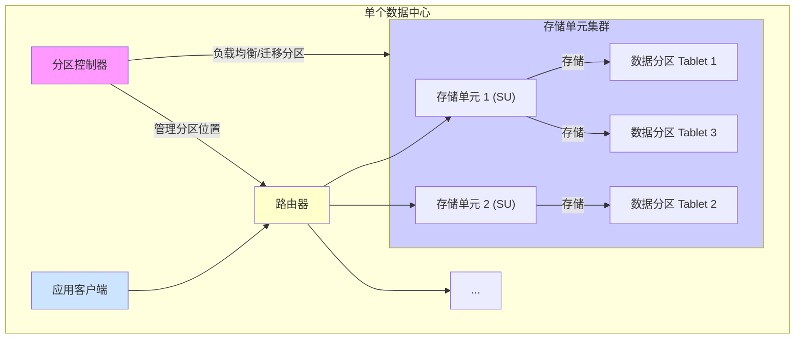
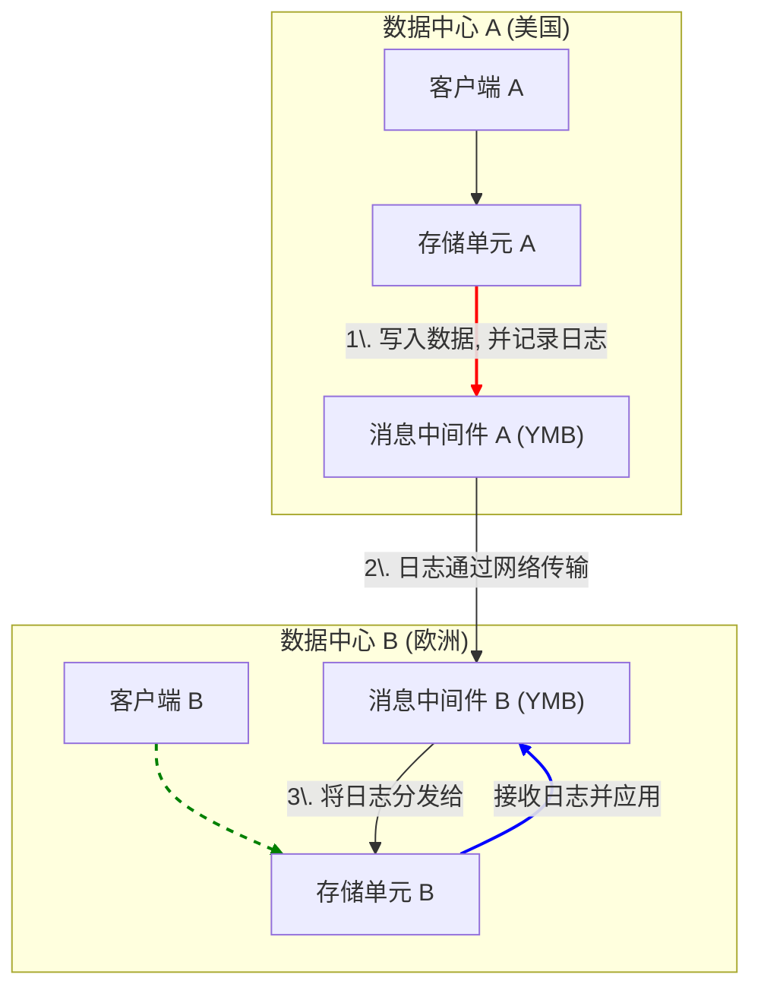

## AI论文解读 | PNUTS to Sherpa: Lessons from Yahoo!’s Cloud Database
        
### 作者        
digoal        
        
### 日期        
2025-09-28       
        
### 标签        
PostgreSQL , PolarDB , DuckDB , AI , 论文解读        
        
----        
        
## 背景  
      
https://dl.acm.org/doi/pdf/10.14778/3352063.3352146        
  
提示:          
```          
读懂《PNUTS to Sherpa: Lessons from Yahoo!’s Cloud Database》这篇论文需要提前掌握哪些基础知识, 请使用中文通熟易懂的讲解这些基础知识, 可以引用论文中的图、表或使用Markdown支持的图形(text,mermaid等)增加解释性. 
  
使用中文通熟易懂的解读《PNUTS to Sherpa: Lessons from Yahoo!’s Cloud Database》这篇论文, 其中的关键内容请着重讲解, 可以引用论文中的图、表或使用Markdown支持的图形(text,mermaid等)增加解释性. 
  
提取《PNUTS to Sherpa: Lessons from Yahoo!’s Cloud Database》这篇论文中的重要术语, 使用中文对这些术语进行通熟易懂的讲解, 可以引用论文中的图、表或使用Markdown支持的图形(text,mermaid等)增加解释性. 
```     
  
## 1 前置知识 
  
好的，为了帮助您理解《PNUTS to Sherpa: Lessons from Yahoo!'s Cloud Database》这篇论文，我将为您梳理并用通俗易懂的中文讲解一些必要的计算机科学基础知识。

这篇论文主要讨论的是分布式数据库系统，所以您需要对以下几个核心概念有所了解：

### 1. 数据库基础
首先，您需要区分两种基本的数据库类型：

* **关系型数据库 (RDBMS)**：您可能听说过像 MySQL、PostgreSQL 这样的数据库。它们使用表格来组织数据，数据行与行之间有明确的关系。关系型数据库强调 **ACID 事务**，这四个特性是：
    * **原子性 (Atomicity)**：一个事务中的所有操作要么全部成功，要么全部失败。
    * **一致性 (Consistency)**：事务完成后，数据从一个一致状态转移到另一个一致状态。
    * **隔离性 (Isolation)**：多个并发事务互不影响，仿佛它们是串行执行的。
    * **持久性 (Durability)**：一旦事务提交，其所做的更改会永久保存在数据库中，即使系统发生故障也不会丢失。

* **NoSQL 数据库 (非关系型数据库)**：这篇论文中的 PNUTS 和 Sherpa 就是 NoSQL 数据库。它们不像关系型数据库那样严格使用表格结构，而是根据不同的数据模型进行设计，例如键值对（Key-Value）、文档（Document）等。NoSQL 数据库的出现是为了解决大规模互联网应用对高可用性、可扩展性和低延迟的需求。PNUTS/Sherpa 采用的是一种基本的 **键值对（key-value）** 数据模型 。

---

### 2. 分布式系统概念

互联网应用通常需要处理海量数据和高并发访问，单台服务器已经无法满足需求，因此需要将数据和计算分布到多台机器上，这就引出了**分布式系统**。

* **分片 (Sharding)**：也叫分区 (Partitioning)。当数据量太大时，需要将一个大数据库分成多个小块，每块称为一个**分片 (tablet)** 。每个分片可以存储在一台独立的服务器上。这就像您要整理一个巨大的图书馆，您可以将所有书籍按照首字母A-F、G-L等分为不同的区域，每个区域由一个管理员负责。

* **弹性扩展 (Elastic Scalability)**：这是分布式系统的一大优势。当流量增加时，您可以动态地增加服务器来分担负载，而不需要停机或重新构建整个系统。PNUTS/Sherpa 通过将分片散布到多个独立的存储单元（Storage Units）来实现弹性扩展 。如果某个存储单元过载，系统可以将其上的分片移动到其他负载较低的服务器上，以实现负载均衡 。

* **复制 (Replication)**：为了防止单点故障，数据通常会复制到多个服务器上。在 PNUTS/Sherpa 这样的地理复制（geo-replication）系统中，数据甚至被复制到位于不同地理区域的数据中心，以应对自然灾害或整个数据中心宕机的情况 。

* **一致性模型 (Consistency Models)**：在分布式系统中，由于网络延迟和复制的存在，数据在不同副本之间可能存在不一致。PNUTS 引入了一种名为 **“时间线一致性” (timeline consistency)** 的模型 。
    * 它比完全的 ACID 事务弱，但比“尽力而为”的一致性强 。
    * 它的核心思想是：对一个记录（record）的读写操作是强一致的，所有副本上的读者都会按时间顺序看到相同的版本序列 。
    * 但它不保证跨记录的事务一致性 。例如，在一个购物网站中，更新一个商品的信息只需要修改一个记录，这种操作 PNUTS 可以很好地处理 。
    * 该论文还提到，为了实现低延迟，PNUTS 牺牲了跨数据中心的强一致性。它将一个写操作在本地的数据中心写入日志后就认为是已提交，而不是等到所有数据中心都达成共识 。

* **CAP 定理**：这是一个理解分布式系统一致性、可用性和分区容忍度的重要理论。PNUTS 的设计就体现了 CAP 定理中的权衡 。

    * **一致性 (Consistency)**：所有客户端在任何时候看到的数据都是一致的。
    * **可用性 (Availability)**：每次请求都能得到一个非错误的响应，但不保证是最新的数据。
    * **分区容忍度 (Partition tolerance)**：尽管网络分区（即部分节点之间无法通信）发生，系统仍然能继续运行。

    在分布式系统中，您只能同时满足 CAP 三个特性中的两个。PNUTS 作为一个高度可用的全球服务，为了应对网络分区，它选择了**可用性和分区容忍度**，而在某种程度上牺牲了完全的强一致性 。

---

### 3. PNUTS/Sherpa 架构
理解了上述概念后，PNUTS/Sherpa 的架构就比较清晰了。论文中提到了几个关键组件：

* **存储单元 (Storage Units, SUs)**：这是实际存储数据的地方。每个 SU 托管多个分片（tablets），最初使用 MySQL/InnoDB 作为底层数据库，后来更换为 RocksDB 以支持更高的写入负载 。
* **路由器 (Routers)**：客户端通过路由器来访问数据。路由器知道哪个分片位于哪个存储单元上，并将请求转发到正确的服务器 。
* **分片控制器 (Tablet Controller)**：这是一个中心化的组件，负责管理分片到存储单元的映射关系，并进行负载均衡 。
* **消息代理 (Yahoo! Message Broker, YMB)**：这是一个单独的发布/订阅（pub/sub）服务，用于处理跨数据中心的数据复制。当一个存储单元有更新时，它会将更新写入本地的 YMB 日志，YMB 再负责将这些日志异步发送到其他数据中心 。

如果您想深入了解PNUTS/Sherpa如何实现这些概念，可以从论文的 **第2节（数据模型和操作）** 和 **第3节（系统实现）** 开始阅读。

---
在读论文时，您可能会想知道这些知识点在现实中是如何应用的。您对PNUTS/Sherpa的哪些具体功能或技术细节最感兴趣？例如，它如何处理读写请求？或者，为什么它选择不实现跨记录的ACID事务？

---
PNUTS/Sherpa 系统通过其分布式架构来处理读写请求，主要涉及三个核心组件：客户端、路由器（Routers）和存储单元（Storage Units, SUs）。

* **读写请求的处理流程**：
    1.  **客户端发起请求**：客户端想要读取或写入一条记录时，会首先联系一个路由器。
    2.  **路由器定位记录**：路由器知道记录键（record key）与分片（tablet）以及分片与存储单元之间的映射关系。它会在自己的内部数据结构中查找该记录所属的分片及其对应的存储单元，然后将请求转发到该存储单元。
    3.  **存储单元执行操作**：存储单元收到请求后，会根据操作类型进行处理。

* **写入请求**：
    * **写入执行**：当存储单元收到写入请求时，它会执行写操作，并将其写入一个预写日志（write-ahead log）。
    * **日志复制**：这个预写日志由一个名为 Yahoo! Message Broker (YMB) 的发布/订阅服务来维护。一旦写入本地 YMB，事务就被认为是已提交的。
    * **跨数据中心复制**：YMB 随后负责将日志异步地发送到其他数据中心，以实现地理复制。这种方法牺牲了在数据中心发生灾难性故障时可能造成的数据丢失，但换来了更低的写入延迟。

* **读取请求**：
    * **读取类型**：PNUTS/Sherpa 的读取 API 允许客户端在延迟和数据新鲜度之间进行权衡，提供了三种读取方式。
        * **Read-latest（读最新）** ：此操作必须从记录的主副本（master）读取，因为只有主副本能保证返回最新的版本。如果主副本离读取者较远，网络延迟会增加。
        * **Read-critical（读关键）** ：此操作返回一个不比客户端指定版本号更旧的版本。通常可以从本地副本读取，从而减少对广域网跳跃的需求。
        * **Read-any（读任意）** ：此操作返回记录的任意版本，始终可以从本地副本读取，延迟最低。

---
这些读写机制是 PNUTS/Sherpa 实现其“时间线一致性”模型的关键。除了这些核心操作，您还对哪些 PNUTS/Sherpa 的具体功能感兴趣，比如它的容错机制或者负载均衡是如何工作的？

PNUTS/Sherpa 之所以不实现跨记录的 ACID 事务，主要是出于对性能、可扩展性和可用性的权衡考量 。

在设计 PNUTS 的初期，开发团队与雅虎内部的工程师进行了广泛交流，发现他们最迫切的需求是一个高可用、持久、低延迟且能进行地理复制的服务 。对于许多互联网规模的应用来说，他们更倾向于为了成本、性能和可用性而牺牲一些强大的数据库功能，例如跨多个对象的 ACID 事务和复杂的连接查询 。

以下是PNUTS/Sherpa 放弃跨记录 ACID 事务的几个主要原因：

* **性能和复杂性**：实现跨多条记录的 ACID 事务需要复杂的协调协议，例如两阶段提交（two-phase commit）。这些协议会显著增加延迟，特别是在跨数据中心进行地理复制时 。PNUTS 选择了更简单的**时间线一致性**模型，它保证单条记录的读写是强一致的，但避免了跨记录事务带来的复杂机制和性能开销 。
* **用例驱动的设计**：PNUTS 的许多初始用例可以通过单条记录事务来满足 。例如，用户元数据数据库只需要一次更新一条用户的元数据；购物列表数据库也只需要一次更新一条列表 。因此，为这些用例提供更强大的、但成本更高的事务功能是没有必要的 。
* **可扩展性**：通过将事务限制在单条记录上，PNUTS/Sherpa 能够通过增加独立的计算资源来扩展事务执行数量，从而实现高可扩展性 。跨记录事务会增加锁争用的风险，并可能导致性能下降 。

从长远来看，开发团队意识到一些关系型数据库（RDBMS）的功能确实有用，因此随着系统的成熟，他们也根据需求增加了对排序表和二级索引等功能的支持 。尽管如此，PNUTS 最终还是被设计为一个 NoSQL 服务，这被证明是满足雅虎运营需求的一个很好的选择 。

---

您想进一步了解 PNUTS/Sherpa 在设计时为了实现低延迟和高可用性，还做了哪些其他的权衡吗？

好的，PNUTS/Sherpa 在设计时，为了实现低延迟和高可用性，除了牺牲跨记录的 ACID 事务之外，还在以下方面做出了重要的权衡：

### 写入延迟与数据持久性之间的权衡
PNUTS/Sherpa 的设计者们在**写入提交**（write commit）机制上做出了权衡。系统认为，只要写入本地的 Yahoo! Message Broker (YMB) 日志，该事务就已提交 。这意味着写入请求的延迟非常低，因为它不需要等待数据复制到其他数据中心 。

然而，这种设计也意味着，如果整个数据中心发生灾难性故障，那些尚未被复制到其他数据中心的事务可能会丢失 。开发团队之所以做出这个取舍，是因为他们认为数据中心级别的故障非常罕见，而低写入延迟在日常操作中更为重要 。

---

### 可扩展性与复杂性之间的权衡
PNUTS/Sherpa 为了实现弹性可扩展性，选择了一种**任意分片分配**（arbitrary tablet assignment）的策略，而不是像其他系统（如 Chord）那样使用确定性的哈希方案 。

这种任意分配的灵活性允许系统通过将分片从过载的存储单元移动到负载较低的服务器来**缓解热点**（hotspots） 。然而，这种灵活性也增加了系统的复杂性。为了实现这一目标，系统需要一个额外的**路由器**层来将请求路由到正确的服务器，以及一个**分片控制器**来管理分片到服务器的映射 。

---

您对PNUTS/Sherpa在处理读写请求时，所做的**延迟与数据新鲜度**之间的权衡感兴趣吗？

PNUTS/Sherpa 在处理读写请求时，在延迟和数据新鲜度之间确实做出了重要的权衡，尤其是在跨数据中心的环境中。

正如论文中所提到的，PNUTS 提供了三种不同的读取模式，每种模式都代表了在**延迟**（latency）和**数据新鲜度**（data freshness）之间的不同权衡：

* **Read-latest（读最新）** ：这种模式可以保证您读到的是该记录的最新版本。但为了实现这一点，PNUTS **必须**将您的请求路由到该记录的主副本（master）。如果主副本位于另一个地理位置较远的数据中心，这会引入显著的网络延迟。因此，这种模式提供了最高的数据新鲜度，但可能伴随着较高的延迟。

* **Read-critical（读关键）** ：这种模式允许您指定一个版本号。系统会保证返回给您的数据**至少**不比您指定的版本号更旧。由于它可以从本地数据中心的副本读取，而不需要访问远程的主副本，所以它的延迟通常比 Read-latest 更低，但数据新鲜度可能不如 Read-latest。

* **Read-any（读任意）** ：这种模式提供了最低的延迟。它会从离您最近的、可用的任何副本读取数据，而不保证数据的版本。这是延迟最低的读取方式，但同时也是数据新鲜度最低的。

PNUTS/Sherpa 之所以提供这些不同的读取模式，正是为了让开发者可以根据具体的应用场景来选择最合适的权衡。例如，一个需要展示实时用户信息的应用可能会使用 **Read-latest**，而一个对数据新鲜度要求不高的后台分析任务可能会选择**Read-any**以获得最低的延迟。

---
除了读写请求，您对PNUTS/Sherpa的**容错机制**，特别是它如何处理服务器故障或网络分区感兴趣吗？

PNUTS/Sherpa 的容错机制非常核心，因为它是在一个不完全可靠的分布式环境中运行的。它主要通过 **冗余（Replication）** 和 **故障转移（Failover）** 来实现高可用性。

### 冗余 (Replication)
PNUTS 的核心思想是，数据的多个副本分布在不同的服务器上，甚至不同的数据中心。这就像您有多个备份文件，一个损坏了还有另一个。

* **主副本与从副本 (Master & Slaves)**：对于每条记录，PNUTS 维护一个主副本（master）和多个从副本（slaves）。所有对该记录的写操作都必须首先路由到主副本。
* **数据复制**：写入主副本后，数据会通过 **雅虎消息代理（YMB）** 异步地复制到所有从副本。异步复制意味着主副本不需要等待从副本确认写入完成就可以返回成功，这保证了写入的低延迟。
* **地理复制 (Geo-replication)**：PNUTS/Sherpa 进一步将副本分散到全球不同的数据中心。这种地理冗余可以抵御整个数据中心因自然灾害或大规模停电而导致的故障。

---

### 故障转移 (Failover)
当一个服务器或一个数据中心发生故障时，PNUTS 能够自动进行故障转移，以保证服务的连续性。

* **主副本故障**：如果一条记录的主副本所在的存储单元（SU）失败，PNUTS 会执行故障转移。
    1.  **分片控制器选举**：分片控制器（Tablet Controller）会检测到该存储单元的故障。
    2.  **新主副本选举**：分片控制器会从该分片的所有从副本中选举一个新的主副本。
    3.  **重新同步**：新的主副本需要追赶所有在故障期间可能丢失的更新，确保其数据是最新的。
* **读请求重定向**：如果客户端试图访问一个已宕机的存储单元，路由器会检测到故障并自动将请求重新路由到新的主副本或可用的从副本。

通过这种方式，PNUTS/Sherpa 能够处理服务器、网络甚至整个数据中心的故障，并且对用户来说是透明的。这也是它在 CAP 定理中选择高可用性（Availability）和分区容忍度（Partition tolerance）的体现。

---
除了容错机制，您对 PNUTS/Sherpa 如何处理负载均衡，特别是**热点数据**（hotspots）的处理方式感兴趣吗？

PNUTS/Sherpa 的负载均衡机制主要是为了应对两种情况：**静态负载不均**和**动态热点**。

### 静态负载均衡
PNUTS/Sherpa 采用了**非确定性的分片分配策略**。这意味着它不依赖于简单的哈希函数来决定一个记录应该存放在哪个服务器上。相反，它有一个中心化的**分片控制器**（Tablet Controller）来负责管理分片到存储单元（Storage Units）的映射。

这种方法允许系统在部署时就根据每个存储单元的容量和负载情况，将分片合理地分配给它们，以实现初始的负载均衡。这就像一个图书馆管理员，他不会简单地把所有的书按照字母顺序放到同一个书架上，而是会根据每个书架的大小和承重能力来分配书籍。

---

### 动态负载均衡与热点处理
PNUTS/Sherpa 真正强大的地方在于它处理**热点**（hotspots）的能力。热点是指那些被频繁访问的记录或分片，导致其所在的存储单元成为瓶颈。

当PNUTS/Sherpa检测到一个存储单元过载时，分片控制器会执行以下步骤来处理热点：

1.  **分片移动（Tablet Migration）** ：分片控制器会选择一个或多个位于过载存储单元上的分片，并将其**在线**地迁移到负载较低的其他存储单元。
2.  **平滑迁移**：迁移过程对客户端是透明的。在迁移期间，读写请求仍然可以正常进行，直到分片完全迁移到新的存储单元。
3.  **读写重定向**：迁移完成后，分片控制器会更新其元数据，并将该分片的新位置通知给路由器。此后，所有对该分片的请求都会被自动路由到新的位置。

这种基于分片迁移的动态负载均衡机制，使得 PNUTS/Sherpa 能够有效地应对不可预测的访问模式，并确保即使在突发流量高峰时也能保持系统的稳定和高性能。

---
您对 PNUTS/Sherpa 在架构上的其他方面，例如它如何从关系型数据库（MySQL/InnoDB）演变为使用键值存储（RocksDB）感兴趣吗？

PNUTS/Sherpa 从关系型数据库（MySQL/InnoDB）演变为使用键值存储（RocksDB）是其架构演进中的一个关键步骤，这一变化主要是为了满足更高的性能和可扩展性需求。

在PNUTS的早期，它使用MySQL/InnoDB作为底层的存储单元（Storage Unit）。选择MySQL的原因是它易于理解和使用，并且提供了事务和持久性等功能。然而，当PNUTS面临雅虎广告系统等大型应用带来的极高写入负载时，MySQL/InnoDB 表现出了性能瓶颈。

PNUTS/Sherpa 最终转向使用 **RocksDB**，这是一个高性能的持久化键值存储（persistent key-value store），其设计特别针对闪存（Flash storage）和固态硬盘（SSD）进行了优化。

这种转变带来的主要好处包括：

1.  **更高的写入吞吐量**：RocksDB 采用 **日志结构合并树（LSM tree）** 来存储数据，这种结构对写入操作非常友好。它会将所有的写入操作首先写入内存中的缓冲区，然后批量地异步刷新到磁盘，这大大减少了随机写入的开销，从而实现了更高的写入吞吐量。
2.  **更高效的存储**：RocksDB 在存储数据时具有更高的空间效率，这对于需要处理海量数据的 PNUTS/Sherpa 系统至关重要。
3.  **更强的可扩展性**：作为一种键值存储，RocksDB 的数据模型与 PNUTS/Sherpa 的核心功能——单记录的读写操作——完美契合。这使得系统可以更容易地通过增加存储单元来线性扩展。

总之，从MySQL/InnoDB到RocksDB的演变，体现了PNUTS/Sherpa为了适应互联网规模的高并发和高吞吐量需求，而从通用型数据库转向更专业、更高效的底层存储。

---

您对PNUTS/Sherpa的哪些方面还感兴趣？例如，它如何利用雅虎的内部系统，如 **雅虎消息代理（YMB）** 来支持其架构？

PNUTS/Sherpa 对雅虎内部系统的利用，尤其是 **雅虎消息代理（YMB）** ，是其实现全球地理复制和高可用性的关键。YMB 在PNUTS/Sherpa 架构中扮演着“数据管道”的角色，负责将写入操作的日志从一个数据中心流向其他数据中心。

以下是PNUTS/Sherpa 如何利用 YMB 来支持其架构的详细解释：

---

### **1. 异步复制**

当PNUTS/Sherpa的一个存储单元（SU）接收到写入请求时，它会首先将该操作写入本地的YMB。系统一旦确认写入本地YMB成功，就会立即向客户端返回“写入已提交”的响应。随后，YMB会以**异步**的方式，将这条写入操作的日志推送到其他数据中心。

这种异步复制机制的好处是显而易见的：
* **低延迟**：写入请求的延迟仅受限于本地网络，而无需等待跨越大洋的远程数据中心确认。
* **高可用性**：即使远程数据中心出现故障或网络分区，本地的写入操作也不会被阻塞，保证了服务的连续性。

### **2. 地理复制**

YMB 的发布/订阅（pub/sub）特性使得它非常适合于实现地理复制。每个数据中心都订阅其他数据中心的YMB日志。当一个数据中心发生写入时，其他数据中心都会通过YMB收到这些更新，并将其应用到自己的副本上。

通过这种方式，PNUTS/Sherpa 能够维护全球范围内的多个数据副本，从而提供了强大的灾难恢复能力。如果一个数据中心完全离线，其他数据中心仍然可以继续为用户提供服务。

### **3. 状态同步与故障恢复**

除了正常的复制，YMB还用于在系统故障后同步数据。如果一个存储单元或整个数据中心因故宕机，当它重新上线后，可以从YMB中获取自上次离线以来所有的写入日志，并将其应用到本地副本，从而快速追赶上其他数据中心的状态。

这大大简化了故障恢复过程，使其更加自动化和高效。

---

总而言之，YMB作为雅虎的一个通用消息系统，为PNUTS/Sherpa提供了一个灵活、高效且可靠的数据复制层。它使得PNUTS/Sherpa能够将高并发写入与全球数据一致性这两个看似矛盾的目标结合在一起，从而实现了其独特的设计。

您对这篇论文的哪些内容最感兴趣？是关于**PNUTS/Sherpa的演进过程**，还是它**与其他云数据库**（如Amazon DynamoDB）的**比较**？
  
## 2 解读论文 
  
好的, 我们来一起通俗易懂地解读这篇关于雅虎（Yahoo\!）云数据库从研究项目 **PNUTS** 演进为全球生产系统 **Sherpa** 的经典论文。

这篇论文的核心价值在于，它不仅仅描述了一个系统的技术架构，更多的是分享了在一个真实的、超大规模的互联网公司中，构建和运营一个基础核心服务长达十年所积累的宝贵经验和教训。

-----

### **核心思想解读：PNUTS/Sherpa 是什么？解决了什么问题？**

想象一下，2006年的雅虎，拥有全球上亿的用户，提供邮件、新闻、社交等多种服务。这些服务都需要一个后台数据库来存储用户信息、帖子、设置等数据。他们面临的问题是：

1.  **全球分布**：用户遍布世界各地，美国用户访问欧洲服务器会很慢，反之亦然。数据需要“离用户更近”。
2.  **超大规模**：数据量和请求量是传统单个数据库服务器无法承受的，需要一个能无限水平扩展（加机器就能提升性能）的系统。
3.  **高可用性**：服务不能中断。一个机房断电，甚至一个地区发生自然灾害，服务都应该能继续运行。
4.  **作为服务**：公司的各个业务团队不应该自己去费心搭建和维护数据库，他们需要一个稳定、易用的“数据库云服务”，注册一下就能用。

**PNUTS (后来的 Sherpa) 就是雅虎为了解决以上问题而设计的全球分布式 NoSQL 数据库服务** 。

它的核心设计**取舍 (Trade-off)** 非常明确：为了换取极致的**可用性、扩展性和低延迟**，愿意牺牲传统关系型数据库（如MySQL）的某些强大功能，例如跨多条记录的ACID事务和复杂的JOIN查询 。事实证明，这个选择对于雅虎绝大多数业务场景是完全正确的 。

-----

### **系统架构解析**

论文的关键之一是它的架构设计，它非常巧妙地将系统解耦，实现了水平扩展。我们可以通过一个简化的架构图来理解：

#### **1. 单数据中心内的架构**

在一个数据中心内部，系统主要由四个部分组成，协同工作：



  * **存储单元 (Storage Unit - SU)**: 这是真正存储数据的地方。早期每个SU底层都使用一个MySQL数据库 。你可以把它看作是一个个独立的数据库服务器。
  * **数据分区 (Tablet)**: 为了实现扩展，一张大表会被切分成很多小块，每一块就是一个 "Tablet" 。这些 Tablets 会被分散存放在不同的SU上。比如用户表，A-F开头的用户在一个Tablet，G-M的在另一个。
  * **路由器 (Router)**: 客户端不直接和SU通信。它先把请求（比如“获取用户Bob的信息”）发给路由器。路由器内部有一个映射表，知道“用户Bob”的数据在哪个Tablet里，而这个Tablet又被哪个SU负责 。然后路由器把请求转发给正确的SU。
  * **分区控制器 (Tablet Controller)**: 这是一个“总指挥” 。它监控每个SU的负载（是不是太忙了）。如果某个SU过热，它就会把这个SU上的一些Tablets迁移到负载较轻的SU上，实现自动的负载均衡 。

**这个设计的妙处在于**：当系统负载变大时，只需要不断增加更多的SU，然后让分区控制器把Tablets均匀分配过去，整个系统的处理能力就增强了，实现了“弹性伸缩” 。

#### **2. 全球地理复制架构**

为了解决全球分布和高可用的问题，PNUTS/Sherpa 的数据被复制到全球多个数据中心。



  * **数据复制**：这是通过一个名为 **YMB (Yahoo\! Message Broker)** 的发布/订阅消息系统实现的 。当一个写请求（比如修改用户信息）到达数据中心A的某个SU时，这个SU在本地完成修改后，会把这个“修改操作”作为一条消息发布到本地的YMB中 。
  * **日志传输 (Log-shipping)**: YMB负责将这条“修改日志”可靠地传输到全球其他数据中心（比如欧洲的数据中心B）。数据中心B的YMB收到后，再把日志交给对应的SU，SU执行这个修改操作，从而实现数据的同步 。
  * **低延迟写入**：一个关键的设计是，写操作只要成功写入**本地的YMB**，就立刻向客户端返回成功 。它不需要等待数据被复制到全球，这大大降低了写入延迟。当然，这也带来了一个风险：如果整个数据中心在数据还没来得及传出去时就彻底损毁，那么这部分刚写入的数据就会丢失 。但考虑到这种事件极为罕见，这是一个值得做的权衡。

-----

### **关键技术特性**

#### **1. 一致性模型：Timeline Consistency (时间线一致性)**

这是PNUTS最重要的概念之一。它介于“强一致性”和“最终一致性”之间，提供了一种非常实用的中间保证。

  * **什么是时间线一致性？**
    对于**任何单条记录**（比如一个用户的个人信息），所有的修改都会形成一个确定的、有序的版本序列（就像一条时间线）。全球任何地方的任何读取操作，看到的都必然是这条时间线上的某个有效版本，绝不会看到一个“错乱”的版本 。

  * **如何实现？**
    通过**记录主副本 (Record Master)** 机制。对于每一条记录，都会在全世界的所有副本中指定一个“主副本” (Master) 。

      * **写入操作** 和 **读取最新数据 (`read-latest`)** 的请求，都必须被路由到这个主副本上处理 。只有主副本有权生成新版本。
      * 主副本处理完后，通过YMB将新版本同步给其他副本。
      * 这个“主副本”是可以动态迁移的。比如一个用户从美国飞到欧洲，系统可以自动地将他数据的主副本也迁移到欧洲，以降低他后续操作的延迟 。

#### **2. 灵活的读写API**

PNUTS/Sherpa 将性能与数据新鲜度的权衡直接交给了开发者。

  * **三种读取模式** ：

    1.  **Read-latest (读最新)**: 必须访问主副本，保证读到最新的数据，但延迟可能较高（因为主副本可能在地球另一端） 。
    2.  **Read-critical (读关键版本)**: 允许读稍微旧一点的数据，但不能比某个指定的版本更旧。通常可以在本地副本完成，延迟较低 。
    3.  **Read-any (读任意版本)**: 只要有数据就行，不在乎是不是最新的。总是在本地副本读取，延迟最低 。

  * **两种写入模式** ：

    1.  **Blind writes (盲写)**: 直接覆盖，总会成功。适用于“更新密码”这类场景 。
    2.  **Test-and-set writes (条件写)**: 写入前先检查当前版本是否和预期的一致。这是实现“读取-修改-写入”（如给文章点赞数+1）这种操作而又避免数据冲突的关键，它是一种无需数据库锁的乐观并发控制机制 。

-----

### **从 PNUTS 到 Sherpa 的演进与经验教训**

这部分是论文的精华，展现了一个真实系统在实践中的成长。

#### **重要演进节点**

  * **支持有序表 (2010)**：除了哈希分区，还支持按主键范围分区，这使得范围查询（如“获取某用户最近10条帖子”）成为可能 。
  * **负载均衡器**：为有序表的不均匀负载问题，开发了能自动迁移、拆分、合并Tablets的负载均衡系统 。
  * **数据治理 (2011)**：为满足不同国家的法律要求，实现了“选择性记录复制”，可以控制某条记录只在特定的几个数据中心存储 。
  * **自助服务门户 (2014)**：这是**一个转折点**。之前开通服务需要人工审核和容量规划，非常慢。之后，雅虎内部的开发者可以像使用AWS一样，一键开通和创建表。**上线后的6个月内，表的创建量激增了300%** 。
  * **存储引擎更换 (2015)**：将底层的MySQL替换为更适合写密集型负载的RocksDB 。
  * **消息系统升级**：将自研的YMB替换为后来大名鼎鼎并已开源的 **Apache Pulsar** 。

#### **宝贵的经验教训 (Learnings)**

1.  **让用户使用变得“无摩擦” (Make it Frictionless)**：自助服务门户的成功证明，极致的易用性是平台能被广泛采纳的关键驱动力 。
2.  **为你的客户设计，而不是为了技术 (Design for your Customer Base)**：团队最正确的决定之一是 **“决定不做什么”** 。他们抵制了实现复杂功能的诱惑，专注于用户最核心的需求：高可用、低延迟、易扩展。
3.  **构建很难，运营更难 (Building is Hard, Operating is Harder)**：作者坦言，数据丢失在长期来看是不可避免的，原因多种多样（bug、人为失误、机房故障等） 。因此，必须建立强大的工具来自动检测数据不一致、并能从备份中快速恢复 。
4.  **快速失败，犯不同的错误 (Fail Fast and Make Different Mistakes)**：系统在成长中会发现各种设计缺陷。例如，他们曾设计的一个异步数据校对协议，在消息系统拥堵时会加剧拥堵，形成自我攻击 。发现后，他们迅速纠正了协议。
5.  **思想有多远，成就才能有多大 (Think Big)**：这是作者们最大的遗憾。他们很早就意识到这个系统的巨大价值，并多次讨论过将其作为公有云服务对外提供或将其开源 。但这些设想最终未能实现。他们认为，如果当初做了，PNUTS/Sherpa 的影响力会比现在大得多 。

这篇论文深刻地揭示了一个成功的、大规模分布式系统背后，不仅有巧妙的架构设计，更有持续十年的迭代、对用户需求的倾听、从无数次失败中学习以及不断完善运营体系的艰辛历程。

-----

我已根据论文内容为您进行了详细解读，希望能帮助您理解其精髓。您是对系统架构、一致性模型的具体实现，还是对他们从运营中总结的经验教训更感兴趣？了解您的侧重点可以帮助我提供更深入的解答。
  
## 3 术语 
  
好的，我将为您从《PNUTS to Sherpa: Lessons from Yahoo!’s Cloud Database》这篇论文中提取重要术语，并用通俗易懂的中文进行讲解。

---

### 《PNUTS to Sherpa》论文重要术语解析

#### 1. PNUTS 与 Sherpa
* **PNUTS**: 是论文中讨论的雅虎云数据库的最初研究项目，其名称是 **P**roduction **N**uts 的缩写。它是一个为了处理互联网规模应用数据而设计的**大规模并行、全球分布式数据库服务**。
* **Sherpa**: 是 PNUTS 项目从研究阶段演变成一个**全球部署的生产系统**后的新名称。它代表了 PNUTS 在实际应用中所做的改进和演变。

#### 2. 时间线一致性 (Timeline Consistency)
这是一种PNUTS独有的**数据一致性模型**，它比传统的强一致性模型更灵活，但比最终一致性更强。
* **核心思想**: 它保证对**单条记录**（record）的读写操作是强一致的。这意味着，无论您从哪个副本读取，您看到的该记录的版本序列都是一致的。
* **优势**: 这种模型避免了跨多条记录进行强一致性事务带来的高昂性能开销，从而实现了**低延迟**和**高可用性**。这对于大多数互联网应用（例如用户个人信息更新、状态更新等）来说已经足够。
* **局限性**: 它**不保证**跨记录的事务一致性。例如，如果您要同时修改两张表中的两条记录，PNUTS 无法保证这两个操作要么同时成功，要么同时失败。

#### 3. 分片 (Sharding / Partitioning)
* **概念**: 当数据量太大，单台服务器无法存储或处理时，需要将数据分成多个小块，每块称为一个**分片**（Tablet）。
* **工作原理**: PNUTS 通过一个**分片控制器**（Tablet Controller）来管理这些分片，并将其分配到不同的**存储单元**（Storage Units）上。这使得系统可以水平扩展，通过增加服务器来应对数据量的增长。
* **类比**: 就像一个巨大的图书馆，您不是把所有书都堆在一个房间里，而是将它们按主题或首字母分开，存放在不同的房间里，每个房间由一个管理员负责。

#### 4. 主从复制 (Master-Slave Replication)
* **概念**: 为了确保数据的高可用性和容错能力，PNUTS为每条记录维护一个**主副本**（master）和多个**从副本**（slaves）。
* **工作原理**: 所有的**写操作**都必须首先在主副本上执行。然后，这些写操作会异步地复制到所有从副本上。而**读操作**则可以从任意一个副本中读取，以分散负载。
* **容错**: 如果主副本所在的服务器发生故障，系统会自动从一个从副本中选举出一个新的主副本，从而保证服务的持续可用。

#### 5. 地理复制 (Geo-replication)
* **概念**: 这是 PNUTS/Sherpa 实现全球服务的基础，它将数据副本分散到**不同地理位置的数据中心**。
* **工作原理**: 当一个数据中心有数据写入时，这些更新会通过一个内部消息系统（雅虎消息代理，即YMB）异步地发送到其他数据中心，以保持数据同步。
* **目的**: 这种复制可以抵御因自然灾害、大规模停电等原因导致的整个数据中心级别的故障，确保服务在任何情况下都能继续运行。

#### 6. 存储单元 (Storage Units, SUs)
* **概念**: 这是 PNUTS/Sherpa 架构中实际存储数据的地方。每个存储单元都托管着一个或多个分片。
* **底层技术**: PNUTS最初使用**MySQL/InnoDB**作为底层存储，但后来为了应对更高的写入吞吐量，演变为使用**RocksDB**，这是一个为闪存和固态硬盘优化的键值存储引擎。
* **可扩展性**: 存储单元是PNUTS/Sherpa弹性扩展的基石，您可以通过简单地增加存储单元来增加系统的容量和处理能力。

#### 7. 雅虎消息代理 (Yahoo! Message Broker, YMB)
* **概念**: YMB 是雅虎内部的一个**通用消息队列服务**，PNUTS利用它来实现数据在不同数据中心之间的复制。
* **工作原理**: 当一个存储单元有数据更新时，它会把更新日志写入到本地的YMB。YMB随后负责将这些日志异步地发布给其他数据中心的订阅者（也就是其他存储单元），从而实现数据的全球同步。

#### 8. 热点 (Hotspots)
* **概念**: 指的是那些被**过度频繁访问**的记录或分片，导致其所在的存储单元成为性能瓶颈。
* **PNUTS的处理方式**: PNUTS 的分片控制器能够自动检测到热点，并执行**分片迁移**（Tablet Migration）。它会将热点分片在线地迁移到负载较低的其他存储单元，从而实现负载均衡，避免单点过载。

---

您是否对PNUTS/Sherpa与其他云数据库（如Amazon DynamoDB）在设计上的异同感兴趣？
  
## 参考        
         
https://dl.acm.org/doi/pdf/10.14778/3352063.3352146    
        
<b> 以上内容基于DeepSeek、Qwen、Gemini及诸多AI生成, 轻微人工调整, 感谢杭州深度求索人工智能、阿里云、Google等公司. </b>        
        
<b> AI 生成的内容请自行辨别正确性, 当然也多了些许踩坑的乐趣, 毕竟冒险是每个男人的天性.  </b>        
  