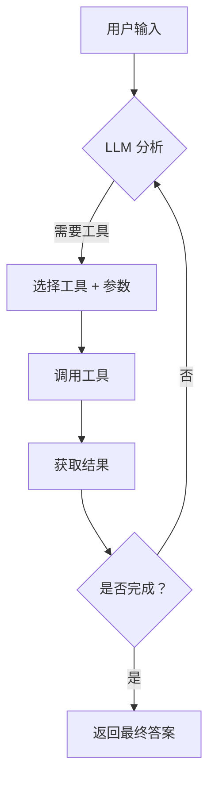
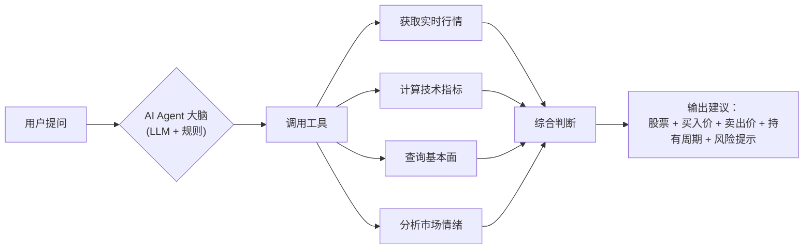

## 如何写AI Agent?
        
### 作者        
digoal        
        
### 日期        
2025-09-28        
        
### 标签        
PostgreSQL , PolarDB , DuckDB , AI Agent        
        
----        
        
## 背景  
上一篇文章已详细分析: 未来的必备技能, 要么会写AI Agent, 要么会用AI Agent!     
- [《云栖大会热词洞察: AI就绪 (AI Ready) 及其对产业生态的深远影响》](../202509/20250926_08.md)     
  
那么如何写一个AI Agent?    
  
例如如何写一个推荐股票的AI Agent? 可推荐股票, 并且推荐什么时机买入, 什么时机卖出, 适合短线操作, 做波段, 还是长线持有?     
  
# 一、如何写一个AI Agent
写一个 AI Agent（智能体）的核心思想是：**让程序不仅能执行固定指令，还能感知环境、自主决策、调用工具、记忆历史，并持续完成目标**。下面我用通俗易懂的方式，结合当前主流技术（如大模型 + 工具调用 + 记忆机制），分步骤说明如何构建一个实用的 AI Agent。

---

## 一、AI Agent 的核心组件（4 大要素）

一个典型的 AI Agent 包含以下模块：

| 模块 | 作用 | 常见实现 |
|------|------|--------|
| **大脑（Reasoning）** | 决策、规划、推理 | 大语言模型（如 Qwen、GPT、Llama） |
| **感知（Perception）** | 理解输入（文本、图像等） | LLM + 多模态模型 |
| **行动（Action）** | 调用工具、执行操作 | 函数调用（Function Calling）、API |
| **记忆（Memory）** | 存储历史、上下文、知识 | 向量数据库、短期/长期记忆 |

> ✅ 简单说：**Agent = LLM + 工具 + 记忆 + 循环控制**

---

## 二、写一个最简 AI Agent（代码示例）

假设我们要做一个“能查天气、做计算、回答问题”的 Agent。

### 步骤 1：定义工具（Tools）

```python
import math
import requests

def get_weather(city: str) -> str:
    # 模拟调用天气 API
    return f"今天 {city} 晴，25°C"

def calculate(expression: str) -> float:
    # 安全计算（仅支持简单表达式）
    try:
        return eval(expression, {"__builtins__": {}}, {"math": math})
    except:
        return "计算错误"
```

### 步骤 2：让 LLM 决定是否调用工具

使用支持 **Function Calling** 的模型（如 Qwen-Max、GPT-4、Ollama + function schema）。

```python
from qwen_agent import Agent  # 假设使用通义千问官方 Agent 框架

# 定义工具描述（供 LLM 理解）
tools = [
    {
        "name": "get_weather",
        "description": "查询某城市的天气",
        "parameters": {"city": "城市名，如'北京'"}
    },
    {
        "name": "calculate",
        "description": "计算数学表达式",
        "parameters": {"expression": "合法的数学表达式，如'2+3*4'"}
    }
]

# 创建 Agent
agent = Agent(
    model="qwen-max",
    tools=tools,
    system_prompt="你是一个智能助手，能回答问题、查天气、做计算。"
)

# 运行
response = agent.run("北京今天天气怎么样？")
print(response)  # → 调用 get_weather("北京") → 返回天气
```

> 🔧 如果不用官方框架，也可手动解析 LLM 输出的 JSON，判断是否需要调用工具。

---

## 三、进阶：加入记忆与多轮规划

### 1. **短期记忆**：用对话历史（Chat History）
```python
history = [
    {"role": "user", "content": "北京天气？"},
    {"role": "assistant", "tool_calls": [{"name": "get_weather", "args": {"city": "北京"}}]},
    {"role": "tool", "content": "今天北京晴，25°C"},
    {"role": "assistant", "content": "北京今天晴，25°C"}
]
```

### 2. **长期记忆**：用向量数据库（如 Chroma、Milvus）
- 把重要信息（如用户偏好、知识片段）存入向量库
- 每次决策前，先检索相关记忆

```python
from chromadb import Client

client = Client()
collection = client.create_collection("memory")

# 存记忆
collection.add(
    documents=["用户喜欢喝美式咖啡"],
    metadatas=[{"user_id": "123"}],
    ids=["mem1"]
)

# 查记忆
results = collection.query(query_texts=["用户喜欢什么咖啡？"], n_results=1)
```

### 3. **自主规划（ReAct / Plan-and-Execute）**
让 Agent 先写计划，再执行：

> 用户问：“帮我订明天从北京到上海的机票，预算 1000 元内。”

Agent 思考：
1. 需要知道明天的日期 → 调用 `get_current_date()`
2. 查询航班 → 调用 `search_flights("北京", "上海", "2024-06-15", max_price=1000)`
3. 如果有结果，返回；否则建议改期或加预算。

---

## 四、推荐框架（快速上手）

| 框架 | 特点 | 适合人群 |
|------|------|--------|
| **LangChain** | 功能全面，支持记忆、工具、链式调用 | 开发者 |
| **LlamaIndex** | 专注 RAG + Agent，适合知识问答 | 研究者 |
| **Qwen-Agent**（通义） | 中文友好，支持 function calling | 国内用户 |
| **AutoGen**（微软） | 多 Agent 协作，适合复杂任务 | 高级用户 |
| **Ollama + LM Studio** | 本地运行开源模型 + 工具调用 | 隐私敏感者 |

---

## 五、关键设计原则

1. **安全第一**：不要让 Agent 直接执行 `eval()`、`os.system()` 等危险操作。
2. **工具要明确**：每个工具要有清晰的输入/输出描述，方便 LLM 理解。
3. **失败要兜底**：工具调用失败时，Agent 应能解释或换策略。
4. **避免无限循环**：设置最大思考步数（如最多 5 步）。

---

## 六、一个完整流程图（ReAct 模式）



---

## 总结

写 AI Agent 的本质是：**把大模型当作“决策中心”，让它指挥各种工具完成任务**。

✅ 初学者建议：
1. 用 **Qwen-Agent** 或 **LangChain** 搭一个能查天气/计算的 demo
2. 加入 **向量数据库** 实现长期记忆
3. 尝试 **多步任务**（如“总结最近3篇关于AI的新闻”）

> 🌟 最终目标：让 Agent 像一个“数字员工”，能独立完成复杂工作。

如果你有具体场景（如客服、数据分析、游戏 NPC），我可以给出针对性架构！
  
# 二、如何写一个推荐股票的AI Agent?
要构建一个**推荐股票的 AI Agent**，能判断**买入/卖出时机**，并建议**操作风格（短线、波段、长线）**，需要融合 **金融知识、技术指标、市场数据、大模型推理能力** 和 **风险控制逻辑**。

下面我将从 **设计架构 → 核心模块 → 代码示例 → 风险提示** 四个层面，给出一个**可落地的 AI Agent 实现方案**。

---

## 一、整体架构（ReAct + 工具调用）



---

## 二、核心模块设计

### 1. **工具（Tools）定义**

| 工具名 | 功能 | 数据源 |
|--------|------|--------|
| `get_stock_price(symbol)` | 获取当前价格、52周高低 | Yahoo Finance / Tushare |
| `get_technical_indicators(symbol)` | 计算 MACD、RSI、均线、布林带 | TA-Lib / 自定义 |
| `get_fundamentals(symbol)` | 获取 PE、PB、ROE、营收增速 | 东方财富 / Tushare |
| `get_market_sentiment()` | 获取新闻情绪、资金流向 | 新浪财经 / 东方财富 API |
| `classify_trend(symbol)` | 判断趋势：上涨/震荡/下跌 | 基于均线+波动率 |

### 2. **决策逻辑（由 LLM + 规则驱动）**

- **短线（<5天）**：RSI 超卖 + 放量突破 + MACD 金叉
- **波段（1-3个月）**：处于上升通道 + 回踩均线 + 基本面稳健
- **长线（>6个月）**：低估值 + 高 ROE + 行业龙头 + 股息率 > 2%

> LLM 负责**综合解读指标**，避免硬编码规则。

---

## 三、代码实现（Python + Qwen + Tushare）

> 假设你有 Tushare token（免费注册），并安装 `qwen-agent`、`tushare`、`talib`

### 步骤 1：安装依赖
```bash
pip install qwen-agent tushare TA-Lib pandas numpy
```

### 步骤 2：定义工具

```python
import tushare as ts
import talib
import pandas as pd

ts.set_token('YOUR_TUSHARE_TOKEN')
pro = ts.pro_api()

def get_stock_price(symbol: str) -> dict:
    df = ts.get_realtime_quotes(symbol)
    return {
        "price": float(df['price'].iloc[0]),
        "high_52w": float(df['high'].iloc[0]),
        "low_52w": float(df['low'].iloc[0])
    }

def get_technical_indicators(symbol: str, days=60) -> dict:
    df = ts.pro_bar(ts_code=symbol, adj='qfq', freq='D', start_date='20240101')
    df = df.sort_index(ascending=True)
    close = df['close'].values
    rsi = talib.RSI(close, timeperiod=14)[-1]
    macd, signal, hist = talib.MACD(close)
    ma20 = talib.SMA(close, 20)[-1]
    ma60 = talib.SMA(close, 60)[-1]
    return {
        "rsi": rsi,
        "macd": macd[-1],
        "macd_signal": signal[-1],
        "ma20": ma20,
        "ma60": ma60,
        "price": close[-1]
    }

def get_fundamentals(symbol: str) -> dict:
    # 简化：假设 symbol 是 ts_code，如 '600519.SH'
    df = pro.daily_basic(ts_code=symbol, trade_date='20240614')
    if not df.empty:
        return {
            "pe": df['pe'].iloc[0],
            "pb": df['pb'].iloc[0],
            "total_mv": df['total_mv'].iloc[0]  # 亿元
        }
    return {"pe": None, "pb": None}
```

### 步骤 3：构建 Agent

```python
from qwen_agent import Agent

tools = [
    {
        "name": "get_stock_price",
        "description": "获取股票当前价格和52周高低",
        "parameters": {"symbol": "股票代码，如 '600519'"}
    },
    {
        "name": "get_technical_indicators",
        "description": "获取技术指标：RSI、MACD、均线",
        "parameters": {"symbol": "股票代码"}
    },
    {
        "name": "get_fundamentals",
        "description": "获取基本面数据：PE、PB",
        "parameters": {"symbol": "股票代码（带交易所后缀，如 '600519.SH'）"}
    }
]

system_prompt = """
你是一个专业的股票投资顾问AI，擅长结合技术面与基本面给出操作建议。
请根据工具返回的数据，回答以下问题：
1. 是否值得买入？当前是否是好时机？
2. 建议买入区间、止损位、目标卖出价。
3. 适合短线（<5天）、波段（1-3月）还是长线（>6月）？
4. 风险提示（如高估值、行业利空等）。
"""

agent = Agent(
    model="qwen-max",
    tools=tools,
    system_prompt=system_prompt
)

# 用户提问
response = agent.run("分析贵州茅台（600519）现在是否适合买入？")
print(response)
```

---

## 四、典型输出示例（模拟）

> **股票**：贵州茅台（600519）  
> **当前价**：1700 元  
> **技术面**：RSI=45（中性），MACD金叉，股价站上20日均线，但未突破60日均线。  
> **基本面**：PE=28，PB=8.5，估值偏高，但ROE>30%，行业龙头。  
> **建议**：
> - **操作风格**：**波段持有（1-2个月）**，不适合短线（波动小），长线需等待估值回调。
> - **买入区间**：1650 - 1680 元（当前可分批建仓）
> - **止损位**：1600 元（跌破60日均线）
> - **目标价**：1850 元（前高压力位）
> - **风险提示**：消费复苏不及预期、估值偏高、短期无催化剂。

---

## 五、进阶优化方向

| 方向 | 说明 |
|------|------|
| **多因子模型** | 加入资金流、北向持仓、龙虎榜数据 |
| **回测验证** | 用 `backtrader` 验证策略历史表现 |
| **风险控制** | 加入最大回撤限制、仓位建议 |
| **多股票对比** | 同时分析多个标的，推荐最优 |
| **本地部署** | 用 `Ollama + Qwen2.5-Coder` + 本地数据，避免 API 依赖 |

---

## ⚠️ 重要风险提示

> **本 AI Agent 仅用于技术演示，不构成投资建议**。  
> 股市有风险，入市须谨慎。AI 无法预测黑天鹅事件（如政策突变、财报暴雷）。  
> 建议：**AI 辅助决策 + 人工复核 + 严格止损**。

---

如果你希望我提供 **完整可运行的 GitHub 项目模板**（含 Docker 部署、Web UI），也可以告诉我！
  
## 参考
- https://www.coze.cn/open/docs/guides  
- https://www.langchain.com/langgraph  
- https://python.langchain.com/docs/tutorials/agents/  
- https://www.bilibili.com/video/BV1zuHizBE8B  
    
#### [期望 PostgreSQL|开源PolarDB 增加什么功能?](https://github.com/digoal/blog/issues/76 "269ac3d1c492e938c0191101c7238216")
  
  
#### [PolarDB 开源数据库](https://openpolardb.com/home "57258f76c37864c6e6d23383d05714ea")
  
  
#### [PolarDB 学习图谱](https://www.aliyun.com/database/openpolardb/activity "8642f60e04ed0c814bf9cb9677976bd4")
  
  
#### [PostgreSQL 解决方案集合](../201706/20170601_02.md "40cff096e9ed7122c512b35d8561d9c8")
  
  
#### [德哥 / digoal's Github - 公益是一辈子的事.](https://github.com/digoal/blog/blob/master/README.md "22709685feb7cab07d30f30387f0a9ae")
  
  
#### [About 德哥](https://github.com/digoal/blog/blob/master/me/readme.md "a37735981e7704886ffd590565582dd0")
  
  

  
