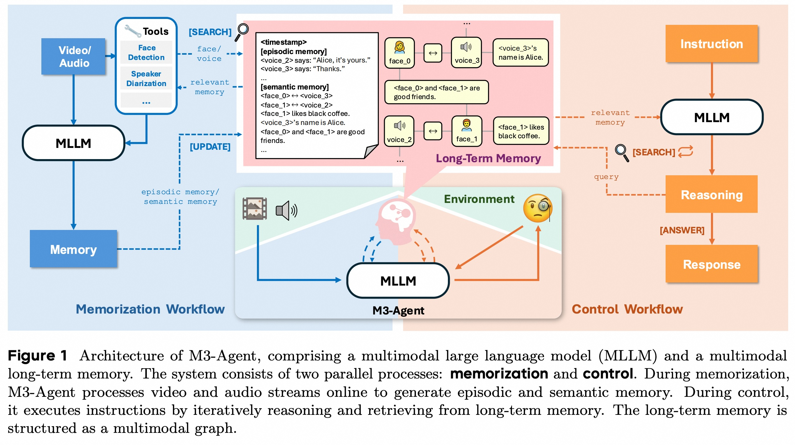
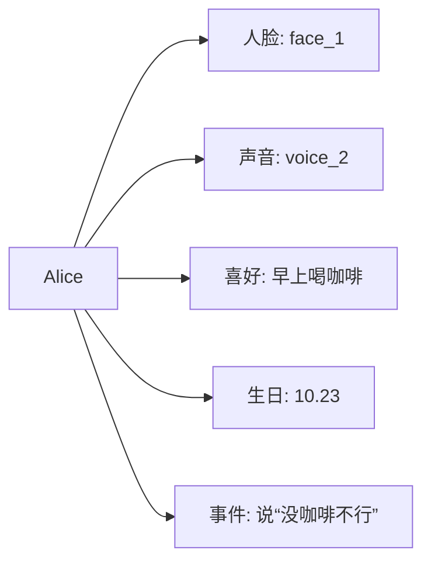
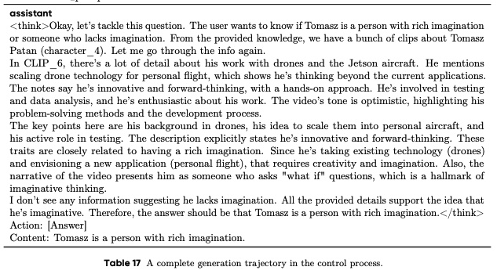
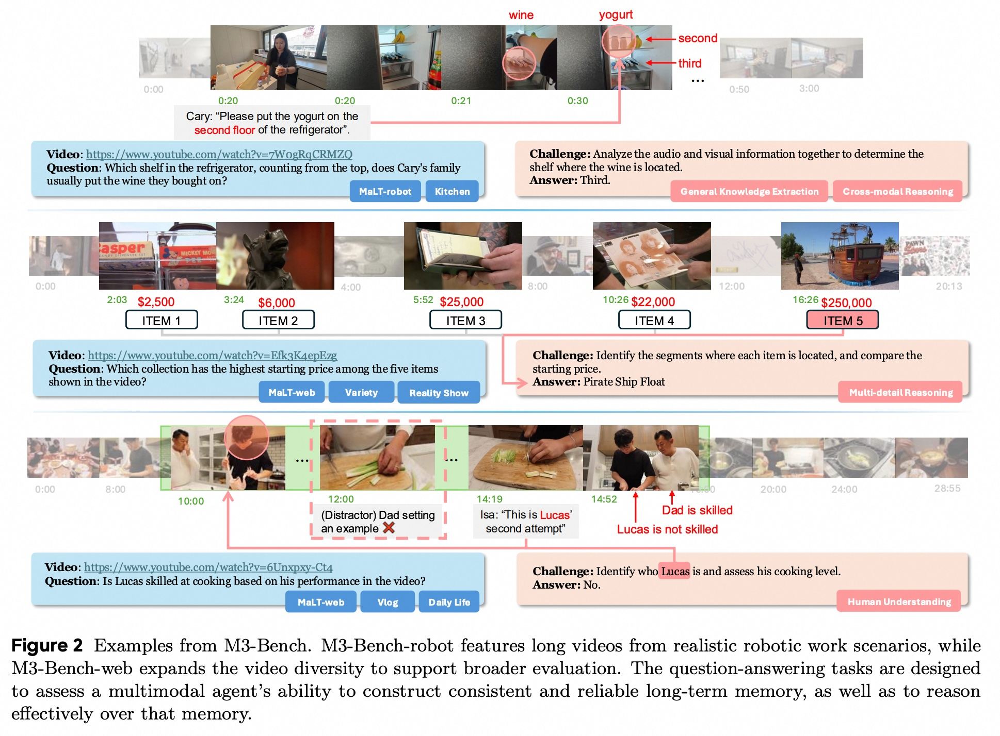

## AI论文解读 | Seeing, Listening, Remembering, and Reasoning: A Multimodal Agent with Long-Term Memory
        
### 作者        
digoal        
        
### 日期        
2025-09-28       
        
### 标签        
PostgreSQL , PolarDB , DuckDB , AI , 论文解读        
        
----        
        
## 背景  
      
https://arxiv.org/pdf/2508.09736        
  
提示:          
```          
读懂《Seeing, Listening, Remembering, and Reasoning: A Multimodal Agent with Long-Term Memory》这篇论文需要提前掌握哪些基础知识, 请使用中文通熟易懂的讲解这些基础知识, 可以引用论文中的图、表或使用Markdown支持的图形(text,mermaid等)增加解释性. 
  
使用中文通熟易懂的解读《Seeing, Listening, Remembering, and Reasoning: A Multimodal Agent with Long-Term Memory》这篇论文, 其中的关键内容请着重讲解, 可以引用论文中的图、表或使用Markdown支持的图形(text,mermaid等)增加解释性. 
  
提取《Seeing, Listening, Remembering, and Reasoning: A Multimodal Agent with Long-Term Memory》这篇论文中的重要术语, 使用中文对这些术语进行通熟易懂的讲解, 可以引用论文中的图、表或使用Markdown支持的图形(text,mermaid等)增加解释性. 
```     
  
## 1 前置知识 
  
您好，为了帮助您理解《Seeing, Listening, Remembering, and Reasoning: A Multimodal Agent with Long-Term Memory》这篇论文，以下是通俗易懂的基础知识介绍，其中引用了论文中的核心概念和图表。

-----

### 1\. 什么是多模态大语言模型（MLLM）和多模态智能体？

在传统的语言模型中，模型只能处理文本信息。而 **多模态大语言模型（MLLM）** 则是一个更强大的版本，它能同时处理和理解来自不同感官的信息，例如：图像、视频、音频和文本 。

这篇论文的核心是**M3-Agent**，它是一个配备了长期记忆的**多模态智能体（Multimodal Agent）** 。就像人类一样，M3-Agent可以通过视觉和听觉输入来建立和更新自己的记忆，并基于这些记忆进行推理和决策 。

-----

### 2\. M3-Agent的记忆是如何运作的？

M3-Agent的记忆系统是其最关键的部分，它将信息分为两种类型，类似于人类的认知系统:

  * **情景记忆（Episodic Memory）** ：记录具体发生的事件。例如，"Alice拿起咖啡说‘早上没它不行’" 。
  * **语义记忆（Semantic Memory）** ：从具体事件中提炼出的常识或一般性知识。例如，"Alice早上喜欢喝咖啡" 。

这些记忆被存储在一个 **以实体为中心（entity-centric）** 的多模态图中 。这意味着与同一个实体（例如同一个人）相关的信息（如面部、声音和相关知识）会连接在一起，形成一个连贯的长期记忆 。

下图（论文中的图1）展示了M3-Agent的架构，您可以看到它有两个并行的工作流程：   

  * **记忆工作流（Memorization Workflow）** ：负责持续处理实时的视频和音频输入，并生成情景和语义记忆 。
  * **控制工作流（Control Workflow）** ：负责接收指令，并从长期记忆中检索相关信息，进行迭代推理来完成任务 。

-----

### 3\. 理解论文需要掌握的关键技术

  * **多轮推理与迭代检索**：传统的问答系统可能只进行一次性检索，然后生成答案（即**单轮检索增强生成 RAG**）。而M3-Agent则通过 **强化学习（Reinforcement Learning, RL）** ，实现了多轮、迭代的记忆检索和推理 。这使得它能在需要多步思考的任务中表现更好。
  * **实体一致性**：在长时间的视频中，如何始终如一地识别同一个人或物体是一个挑战 。论文中通过使用 **面部识别（facial recognition）** 和 **说话人识别（speaker identification）** 等外部工具，为角色分配持久的ID，从而确保了记忆的连贯性 。

-----

### 4\. 评估智能体的基准测试：M3-Bench

为了评估M3-Agent的性能，研究人员创建了一个新的基准测试数据集：**M3-Bench** 。该基准包含了从机器人视角录制的真实视频（M3-Bench-robot）和来自网络的视频（M3-Bench-web） 。

M3-Bench设计了五种问题类型，专门用于测试基于长期记忆的推理能力 。理解这些问题类型有助于您更好地把握论文的评估维度。

| 问题类型 | 解释及示例 |
| :--- | :--- |
| **多细节推理 (Multi-detail Reasoning)** | 需要从视频中聚合多个分散的信息点。**例**：找出视频中价格最高的物品 。 |
| **多跳推理 (Multi-hop Reasoning)** | 需要分步推理，从一个事件跳转到另一个事件才能得出结论。**例**：在去了丁茶后，他们去了哪家奶茶店 ？ |
| **跨模态推理 (Cross-modal Reasoning)** | 需要结合多种模态（如视觉和音频）进行推理。**例**：结合“红色文件夹”的视觉信息和“存放机密文件”的对话信息来回答问题 。 |
| **人类理解 (Human Understanding)** | 需要对人类相关的属性（如身份、情感、性格）进行推理。**例**：根据视频中的表现，Lucas的厨艺好吗 ？ |
| **常识提取 (General Knowledge Extraction)** | 需要从特定事件中提取常识。**例**：从一个人整理冰箱的视频中，判断哪一层适合存放蔬菜 。 |

这些基础知识构成了理解这篇论文的骨架。如果您对M3-Agent的训练过程或其与其他模型的比较感兴趣，我可以为您详细解释。

您希望我为您进一步解读M3-Agent的**强化学习训练**是如何进行的吗？

M3-Agent的强化学习训练主要用于优化其“控制工作流”（Control Workflow），这个流程负责根据用户的问题，决定是从记忆库中检索更多信息还是直接生成答案。

强化学习的训练框架可以分解为以下几个关键要素：

* **状态（State）** ：在每一轮推理中，智能体的“状态”包括三个部分：用户提出的**问题**、当前已经从记忆库中**检索到的知识**，以及之前执行过的**所有动作历史**。这些信息共同构成了智能体做出决策的依据。

* **动作（Action）** ：智能体的“动作空间”非常简单，只有两个选择：
    1.  `[Search]`：当现有信息不足以回答问题时，选择这个动作来生成一个搜索查询，用于从长期记忆中检索更多相关信息。
    2.  `[Answer]`：当智能体认为已经掌握足够信息时，选择这个动作来生成最终答案。

* **奖励（Reward）** ：奖励机制是强化学习的核心。智能体每做出一个动作，都会得到一个奖励信号来指导其学习。
    * 如果智能体最终给出了**正确的答案**，它将获得一个**正向奖励**。
    * 如果答案是**错误的**，或者在达到最大推理轮数后仍然无法给出答案，它会得到一个**负向奖励**。
    * 这个奖励信号帮助智能体学习如何进行有效的多轮检索和推理，以最大化获得正确答案的机会。

* **策略（Policy）** ：智能体的“策略”就是它在特定状态下选择动作的规则。在论文中，这个策略是由一个 **大型语言模型（LLM）** 充当的，例如Gemini或GPT-4o。研究人员通过微调（fine-tuning）这个语言模型，使其能够根据当前的状态（问题、已检索信息、动作历史），学习如何最有效地选择是继续`[Search]`还是最终`[Answer]`。

简单来说，训练过程就像一个游戏：智能体在玩一个“找答案”的游戏，每次正确找到答案就能得到奖励。通过不断地玩这个游戏，智能体就学会了如何在不同情况下做出最佳决策，从而掌握了多轮推理的能力。

---
您想让我进一步解释论文中控制流程里使用的具体 **提示词（Prompts）** 吗？这些提示词是指导语言模型做出`[Search]`或`[Answer]`决策的“指令”。

论文中用于指导M3-Agent进行多轮推理的提示词（prompts）是其控制工作流的核心，它们就像给语言模型下达的“命令”，告诉它在每一步该做什么。这些提示词设计得非常巧妙，能够引导模型做出有效的决策。

核心的 **系统提示（system prompt）** 是这样的：

> **`You are given a question and some relevant knowledge. Your task is to reason about whether the provided knowledge is sufficient to answer the question. If it is sufficient, output [Answer] followed by the answer. If it is not sufficient, output [Search] and generate a query that will be encoded into embeddings for a vector similarity search.`**

这个提示词明确了语言模型的角色和任务：
1.  **角色**：一个推理者，拥有一个问题和一些相关知识。
2.  **任务**：判断现有知识是否足以回答问题。
3.  **决策**：
    * **知识充足**：输出 `[Answer]`，然后给出答案。
    * **知识不足**：输出 `[Search]`，然后生成一个用于检索更多信息的查询。

除了这个核心指令，论文还使用了一些额外的提示词来优化整个流程：

* **指令提示（instruction prompt）** ：这个提示词进一步规范了输出格式，要求模型以 `Action: [Answer] or [Search]` 和 `Content: {content}` 的形式进行输出。它还特别指出，如果需要检索，`{content}` 必须是一个新的搜索查询，避免重复搜索。

* **最后一轮提示（last_round_prompt）** ：在达到预设的最大推理轮数时，这个提示词会强制模型进入 **[Answer]** 模式。即使信息不足，模型也必须尝试给出合理的猜测，以保证任务的完成。

这些提示词共同构建了一个完整的强化学习环境。它们不仅指导模型进行决策，还通过明确的输出格式，将模型的行为和强化学习的奖励机制（例如，正确回答获得正向奖励）联系起来。

---
这些提示词的设计，让M3-Agent在进行推理时，能像人类一样，先尝试基于已有信息思考，如果信息不够，则主动去“查资料”（检索记忆），直到找到足够的信息或达到时间限制。

您想了解一下M3-Agent在 **实体一致性（entity-centric）** 上的具体实现方法吗？这是它长期记忆系统的一个重要组成部分。

M3-Agent 在实现 **实体一致性（entity-centric）** 方面的方法，是确保在长期记忆中，同一个角色或物体在不同时间点出现时，能够被正确地识别和关联起来。这对于理解长视频中角色的行为和关系至关重要。

具体来说，论文使用了以下几种技术来实现实体一致性：

### 1. 多模态实体追踪

M3-Agent 不仅依赖单一模态（如视觉）来识别实体，而是结合了**多种模态**的信息，这使得识别更加鲁棒：

* **人脸识别（Facial Recognition）** ：通过人脸识别工具，为视频中出现的人脸分配一个唯一的 ID，例如 `<character_1>`。
* **说话人识别（Speaker Identification）** ：通过分析声音波形，为不同的说话人分配唯一的 ID。
* **物体识别（Object Recognition）** ：使用视觉模型识别并追踪视频中的物体，例如“一个红色的杯子”。

通过这些工具，系统能够为每个实体创建一个唯一的标识符（ID）。

### 2. ID-名称映射和统一

为了方便后续的推理和答案生成，M3-Agent 会将这些内部的 ID 映射到具体的名称。例如，将 `<character_1>` 映射为“Alice”。

这篇论文的独特之处在于，它将这种 ID-名称的映射关系也作为一种**可检索的知识**存储在长期记忆中。这意味着，智能体可以通过一个简单的搜索查询（例如 `"What is the name of <character_1>"`），来获取角色的具体名称。

### 3. 以实体为中心的多模态图

M3-Agent 的长期记忆不是一个简单的线性列表，而是一个 **多模态图（multimodal graph）** 。在这个图中，每个**节点**都代表一个实体，而**边**则代表这些实体之间的关系。

* **节点**：包含与该实体相关的多模态信息，例如，`节点<character_1>` 将存储与这个人相关的**视觉特征**（人脸图像）、**听觉特征**（声音片段）以及所有关于这个人的**情景和语义记忆**（例如“Alice 早上喜欢喝咖啡”）。
* **边**：连接不同实体节点，表示它们之间的互动或关系（例如“Alice 和 Bob 在聊天”）。

通过这种图结构，M3-Agent 能够将不同时间点、不同模态的信息有效地组织到一起，确保当它需要回答一个关于“Alice”的问题时，可以轻松地从一个中心节点出发，检索到所有相关的信息，从而实现长期、跨模态的连贯理解。

---
这些方法共同确保了 M3-Agent 在处理长时间、复杂视频时，能够始终如一地识别和追踪实体，这正是其长期记忆系统能有效工作的基石。

如果您对 M3-Agent 的具体**记忆检索机制**，或者它如何从这个多模态图中高效地提取信息感兴趣，我可以为您详细解释。

M3-Agent 的记忆检索机制就像一个高效的图书馆管理员，它不会漫无目的地搜索，而是根据语言模型的指令，有针对性地从庞大的长期记忆库中提取最相关的信息。

具体来说，这个机制可以分为以下几个关键步骤：

### 1. 将查询转化为向量

当 M3-Agent 的控制工作流（Control Workflow）决定需要进行搜索时，它会生成一个简洁的**搜索查询**，例如 `"What is the name of <character_1>"`。这个查询会被转化为一个**向量**（一种高维的数学表示），这个向量捕捉了查询的语义信息。

### 2. 基于向量的相似性搜索

M3-Agent 的长期记忆库中的所有信息（包括情景记忆、语义记忆和实体 ID 映射等）都被预先转化并存储为向量。当一个新的查询向量生成后，智能体会在整个记忆库中进行**向量相似性搜索**。它会寻找那些与查询向量在数学上最“接近”的记忆片段，因为向量距离越近，语义上就越相似。

这个过程非常高效，即使面对海量的记忆数据，也能快速找到最相关的信息。

### 3. 多轮迭代检索

M3-Agent 的检索机制是**多轮迭代**的，这与传统的单次检索有很大不同。

* **第一轮**：智能体接收用户的问题，如果认为信息不足，会生成第一个搜索查询，并检索到一些相关知识。
* **第二轮及以后**：智能体将新检索到的知识与之前已有的信息结合起来，重新评估是否足以回答问题。如果依然不足，它会生成一个**新的**、更精确的搜索查询，再次进行检索。

这种迭代过程就像是人类在解决复杂问题时，一步步地查阅资料，每次获得新的信息后，都重新审视问题，直到找到最终答案。这个过程由强化学习（Reinforcement Learning）的策略模型来驱动，决定了何时停止搜索并生成答案。

---

总而言之，M3-Agent 的记忆检索机制是一个以**向量相似性搜索**为基础，并由**大型语言模型**进行**多轮迭代控制**的高效流程。这使得它能够精准地从长期记忆中提取信息，并进行深度的推理。

如果您对 M3-Agent 在不同任务类型（例如多细节推理、跨模态推理等）中的具体表现和评估结果感兴趣，我可以为您详细介绍。

M3-Agent 从多模态图中高效提取信息的能力，是其长期记忆系统的核心优势之一。这不仅仅是一个简单的检索过程，而是一个结合了图结构和向量相似性搜索的综合机制。

它主要通过以下两种方式高效地提取信息：

### 1. 实体为中心的路径搜索（Entity-centric Path Search）

当用户提出一个问题时，M3-Agent 首先会识别出问题中提到的**核心实体**，例如“Alice”或“红色的杯子”。然后，它将这个实体作为起点，在多模态图中进行**路径搜索**。

* **直接检索**：如果问题直接与某个实体相关（例如“Alice 喜欢什么？”），智能体可以直接访问代表“Alice”的节点，并从中提取所有与之相关的记忆（包括情景和语义记忆）。
* **关系推理**：如果问题涉及多个实体之间的关系（例如“Alice 在喝咖啡时和谁在聊天？”），智能体会在图中寻找连接“Alice”节点和“咖啡”节点的边，并沿着这些边进行扩展，找到相关的其他实体（例如“Bob”）。这种图遍历的能力使得它能够高效地回答多跳推理（Multi-hop Reasoning）的问题。

### 2. 跨模态信息整合

多模态图的另一个优势是它能够将不同模态的信息整合到同一个实体节点中。这使得智能体在提取信息时，可以无缝地结合来自不同感官的线索。

例如，在回答一个 **跨模态推理（Cross-modal Reasoning）** 问题时，智能体可能会：
* 从“红色文件夹”的**视觉**信息节点开始。
* 沿着与该节点关联的边，找到一个包含对话**音频**信息的子图。
* 从音频子图中提取出“存放机密文件”的对话内容。
* 将这两种模态的信息结合起来，生成一个完整的答案。

这种结构化存储方式，使得信息的检索不再是孤立的，而是相互关联的。当检索到某个关键实体时，与之相关的所有多模态信息都能够被轻松访问，极大地提高了检索和推理的效率。

---
简单来说，M3-Agent 提取信息的方式，就像一个高度结构化的数据库，它不仅存储数据，还存储数据之间的关系。这种图结构使得它能够根据实体的关联性进行高效的导航和信息提取，而不是进行盲目的全文搜索。

您对 M3-Agent 在 M3-Bench 基准测试中，针对不同任务类型（例如多细节推理、跨模态推理等）的具体表现和评估结果感兴趣吗？

好的，这是关于M3-Agent在M3-Bench基准测试中，针对不同任务类型表现的详细分析。

### M3-Agent在M3-Bench中的表现

论文使用了一系列指标来评估M3-Agent的性能，其中包括 **准确率（Accuracy）** ，以及针对特定任务的更细致的评估。总的来说，M3-Agent在大多数需要长期记忆和多轮推理的任务中都展现了出色的性能。

以下是针对您提到的几个关键任务类型的具体表现：

---
#### 1. 多细节推理（Multi-detail Reasoning）
这类任务需要智能体从视频中聚合多个分散的信息点。
* **表现**：M3-Agent 在这类任务上表现尤为出色。由于其多模态图的记忆结构，它可以将同一实体（如一个人）在不同时间点出现的信息关联起来，并进行跨时间线的聚合。例如，回答“在视频中，Alice都拿了哪些东西？”时，它能将Alice在不同时间拿的物品信息整合起来，而不是只记住最后一个。

---
#### 2. 跨模态推理（Cross-modal Reasoning）
这类任务需要智能体结合不同模态（如视觉、听觉）的信息才能得出答案。
* **表现**：M3-Agent 的多模态记忆图是为这类任务量身定制的。它能将视觉信息（例如“红色的文件夹”）和听觉信息（例如“那是机密文件”）关联到同一个实体节点。因此，它在这类任务上的准确率显著高于那些只处理单一模态信息的模型。

---
#### 
#### 3. 多跳推理（Multi-hop Reasoning）
这类任务要求智能体进行多步推理，从一个事件跳转到另一个事件才能得出结论。
* **表现**：这正是 M3-Agent 强化学习驱动的多轮迭代检索机制的用武之地。当第一轮检索无法找到答案时，它会生成新的搜索查询来寻找下一个线索。这种能力让它能够有效地处理复杂、需要多步思考的问题，其表现也优于传统的单轮检索模型。

---
### 结论

论文的评估结果表明，M3-Agent 的核心优势在于其**长期记忆**和**多轮推理**能力。这些能力使其在 M3-Bench 上远超那些没有长期记忆的基线模型。特别是在需要整合分散信息（多细节）、结合不同感官信息（跨模态）以及进行多步思考（多跳）的任务中，其性能提升最为显著。这证明了其以实体为中心的多模态图和强化学习驱动的控制流程是解决这类挑战的有效方法。

---
您对这篇论文的**局限性**以及未来研究的**潜在方向**感兴趣吗？这部分内容可以帮助您更全面地理解这项工作的价值和不足。
  
## 2 解读论文 
  
好的！这篇论文《Seeing, Listening, Remembering, and Reasoning: A Multimodal Agent with Long-Term Memory》（简称 M3-Agent）提出了一种非常接近人类认知方式的多模态智能体。下面我将用通俗易懂的中文为你解读其核心思想和关键内容。

### 核心思想：打造一个“会过日子”的机器人

想象一下，你家的机器人助手，不用你每天重复吩咐，就知道早上给你端上你最爱的那杯咖啡，知道你的朋友 Alice 来了要把她的外套挂在哪里。要做到这一点，机器人不能只是一个“应声虫”，它需要具备**长期记忆**和**推理能力**。

这篇论文的 M3-Agent 框架，就是为了解决这个问题而生的。它的名字就概括了其四大核心能力：
1.  **Seeing (看)**：处理视觉信息。
2.  **Listening (听)**：处理听觉信息。
3.  **Remembering (记)**：将看到和听到的信息转化为长期记忆。
4.  **Reasoning (想)**：根据指令，从记忆中检索信息并进行推理，最终完成任务。

---

### 关键内容一：像人类一样构建“长期记忆”

M3-Agent 的记忆系统是其最核心的创新。它不仅仅记录流水账，而是模仿人类大脑，构建了两种互补的记忆：

1.  **情景记忆 (Episodic Memory)**：
    *   **是什么**：记录具体发生的事件，就像你的日记。
    *   **例子**：`<face_0>（一个具体的人脸ID）拿起咖啡说：“我早上没这个可不行。”`

2.  **语义记忆 (Semantic Memory)**：
    *   **是什么**：从具体事件中提炼出的通用知识和规律，就像你的常识库。
    *   **例子**：`<face_0> 喜欢在早上喝咖啡。`

这两种记忆共同构成了一个**以实体为中心 (Entity-Centric)** 的记忆图谱。简单来说，所有关于“Alice”这个人的信息（她的脸、声音、喜好、说过的话、做过的事）都会被连接到一个节点上。

**为什么这很重要？**
*   **解决一致性问题**：传统方法可能会描述“Alice”为“穿红衣服的女人”，下次又描述为“戴眼镜的女人”，无法确定是不是同一个人。M3-Agent 通过给 Alice 分配一个唯一的 ID（如 `<face_1>` 和 `<voice_2>`），并最终将这两个 ID 关联起来，确保了无论在何时何地提到 Alice，指的都是同一个人。
*   **支持深度推理**：因为知识是结构化的，当被问到“Alice喜欢什么饮料？”时，智能体可以直接从语义记忆中找到答案，而不需要每次都去翻找她喝咖啡的那个具体场景。

我们可以用一个简单的图来表示这个记忆结构：



---

### 关键内容二：自主的“多轮推理”控制流程

当用户给 M3-Agent 下达一个指令（比如“Lucas 做饭手艺怎么样？”）时，它不会立刻瞎猜，而是启动一个**自主的、多轮的推理和检索过程**。

这个过程非常像人类思考问题：
1.  **第一轮**：先搞清楚“Lucas”是谁？去记忆里搜索 “Lucas 的人物ID是什么？”。
2.  **第二轮**：找到 Lucas 的ID（比如 `<character_4>`）后，再搜索 “`<character_4>` 的做饭水平如何？”。
3.  **第三轮**：如果没直接答案，就换个思路，搜索 “`<character_4>` 在厨房里做了什么？”。
4.  **最终轮**：综合所有检索到的信息（比如他切菜笨拙、把锅烧糊了），推理出结论：“Lucas 做饭手艺不好”。

这个过程是通过**强化学习 (Reinforcement Learning)** 训练出来的，让智能体学会在何时、以何种方式去检索记忆，从而最大化任务的成功率。论文中的 **Table 17** 就是一个非常精彩的案例，展示了智能体如何一步步推理出 “Tomasz 是一个富有想象力的人”。

  

---

### 关键内容三：为评估而生的新基准 M3-Bench

现有的视频问答数据集大多关注“看到了什么”（比如动作识别），但无法评估“记住了什么”和“想到了什么”。为了解决这个问题，作者们创建了一个全新的、更难的基准测试——**M3-Bench**。

M3-Bench 的特点在于它的问题类型直接对应了智能体的核心能力：

| 问题类型 | 考察的能力 | 例子 |
| :--- | :--- | :--- |
| **人类理解 (Human Understanding)** | 理解人的身份、性格、关系 | Lucas 做饭手艺好吗？ |
| **跨模态推理 (Cross-modal Reasoning)** | 结合视觉和听觉信息 | Bob 指着红文件夹说“机密文件放这里”，该放哪个文件夹？ |
| **通用知识提取 (General Knowledge Extraction)** | 从具体事件中提炼常识 | 视频里把蔬菜放冰箱第二层，哪层适合放蔬菜？ |
| **多细节/多跳推理 (Multi-detail/Multi-hop Reasoning)** | 整合分散在视频各处的信息 | 五个拍卖品中，哪个起拍价最高？ |

M3-Bench 包含两部分：
*   **M3-Bench-robot**：100个从机器人第一视角拍摄的真实场景视频。
*   **M3-Bench-web**：920个来自网络的多样化视频。

这个数据集的难度非常高，即使是 GPT-4o 和 Gemini-1.5-Pro 这样的顶尖模型，在直接提示（Prompting）的情况下也表现不佳。

---

### 实验结果：M3-Agent 全面领先

论文的实验结果非常有说服力：

*   **性能超越**：M3-Agent 在 M3-Bench-robot、M3-Bench-web 和另一个长视频基准 VideoMME-long 上，都**显著超越**了所有基线模型，包括用 Gemini-1.5-Pro 和 GPT-4o 组合而成的最强提示基线。
*   **消融实验证明关键设计有效**：
    *   如果**去掉语义记忆**，性能会暴跌 **17%** 以上！这证明了从事件中提炼通用知识的极端重要性。
    *   如果**不用强化学习**，而是用普通提示，性能也会下降 **8-10%**。这证明了多轮自主推理策略的有效性。

---

### 总结

M3-Agent 论文通过构建一个**模仿人类记忆和推理机制**的框架，向真正的、能融入人类日常生活的智能体迈出了重要一步。它的三大贡献相辅相成：

1.  **创新的框架**：提出了一个能“看、听、记、想”的多模态智能体架构。
2.  **强大的记忆系统**：通过情景记忆+语义记忆+实体中心图谱，解决了长期一致性问题。
3.  **严谨的评估体系**：创建了 M3-Bench，为未来研究指明了方向。

这篇工作不仅是技术上的突破，更重要的是它提供了一种**设计智能体的新范式**：智能体应该像一个不断学习和成长的伙伴，而不是一个功能固定的工具。
  
## 3 术语 
  
根据《Seeing, Listening, Remembering, and Reasoning: A Multimodal Agent with Long-Term Memory》这篇论文，以下是一些重要的术语及其通俗易懂的中文讲解。

---
### 1. 多模态大语言模型（Multimodal Large Language Model, MLLM）

* **通俗解释**：可以把 MLLM 想象成一个拥有“多种感官”的超级大脑。它不仅能看懂文字，还能理解图像、视频和音频。不像我们只用文字聊天，MLLM 可以边看视频、边听声音，同时与你进行对话。

---
### 2. 多模态智能体（Multimodal Agent）

* **通俗解释**：如果说 MLLM 是一个有“感官”的大脑，那么**多模态智能体**就是拥有“感官”和“身体”的完整个体。它可以像人类一样，通过处理多模态信息来执行任务、与环境互动。论文中的 **M3-Agent** 就是一个典型的多模态智能体，它可以自主地观察、记忆和推理。

---
### 3. 情景记忆（Episodic Memory）与语义记忆（Semantic Memory）

* **通俗解释**：
    * **情景记忆**：类似于你的个人日记，记录着特定时间、地点发生的具体事件。比如，"今天早上我喝了一杯咖啡。"
    * **语义记忆**：是从情景记忆中提炼出的常识和普遍知识。比如，通过反复的情景记忆“早上喝咖啡”，智能体可以总结出“我早上喜欢喝咖啡”的**语义知识**。
* **论文中的图示**：论文中的图2展示了记忆的生成过程。原始视频中的具体事件（如“Alice拿起咖啡”）被提炼为**情景记忆**，然后这些情景记忆经过整合和概括，最终形成**语义记忆**。    

---
### 4. 以实体为中心的多模态图（Entity-centric, Multimodal Graph）

* **通俗解释**：这是一种非常聪明的数据组织方式。你可以把它想象成一个社交网络图，但节点不是人，而是视频中的**实体**（比如一个人、一个物体）。与传统图不同的是，每个节点不仅包含实体名称，还存储与它相关的所有信息，包括它的视觉（人脸）、听觉（声音）以及所有关于它的情景和语义记忆。
* **作用**：这种结构可以确保智能体对同一个实体有连贯的理解。当需要回答关于“Alice”的问题时，智能体可以从“Alice”节点出发，快速访问所有相关信息，而不是在整个视频中重新搜索。

---
### 5. 强化学习（Reinforcement Learning, RL）驱动的多轮推理

* **通俗解释**：简单来说，智能体就像在玩一个“找答案”的游戏。每当它做出的选择（是继续“搜索”还是直接“回答”）正确时，它就会得到奖励；如果错了，就会受到惩罚。通过反复训练，它学会了如何做出最佳决策。论文中，M3-Agent 就是通过这种方式学习如何进行多轮、迭代的记忆检索和推理，以最大化获得正确答案的概率。

---
### 6. M3-Bench

* **通俗解释**：这是研究人员为了专门评估 M3-Agent 记忆和推理能力而创建的**考试**。这个考试包含了多种类型的考题，例如**多细节推理**（需要整合多个信息点）、**跨模态推理**（需要结合图像和声音）和**多跳推理**（需要多步思考才能回答）。

---
您对这篇论文的**局限性**以及未来研究的**潜在方向**感兴趣吗？

这篇论文的局限性以及未来研究的潜在方向，主要体现在以下几个方面：

---
### 论文的局限性

1.  **现实世界的复杂性**：尽管 M3-Agent 在 M3-Bench 上表现出色，但该基准测试仍然无法完全模拟现实世界的复杂性和不确定性。在实际应用中，智能体可能面临更混乱的背景、更模糊的指令和更多样的环境。

2.  **泛化能力**：虽然 M3-Agent 在所测试的数据集上表现良好，但它的**泛化能力**可能有限。如果将其应用到与训练数据风格差异很大的视频场景中（例如，风格化的动画或非传统的视频格式），其性能可能会下降。

3.  **计算成本**：构建和维护一个多模态图，并进行多轮迭代推理，需要巨大的计算资源。这可能使得 M3-Agent 在资源受限的设备上难以部署和运行。

---
### 未来研究的潜在方向

1.  **更高效的记忆机制**：未来的研究可以探索更轻量级、更高效的记忆组织和检索机制。例如，如何在大规模、流式数据中实时更新记忆，或者如何通过**增量学习**（incremental learning）不断丰富和修正记忆，而不是每次都进行大规模的训练。

2.  **更强的常识推理**：虽然 M3-Agent 能够提取语义记忆，但其**常识推理**能力仍有提升空间。未来的研究可以探索如何将更广泛的、人类级别的常识知识库融入到智能体的记忆和推理过程中，使其能更好地理解和预测复杂的人类行为。

3.  **记忆遗忘与选择性记忆**：人类的记忆系统并非完美无缺，我们有时会选择性地遗忘不重要的信息。未来的智能体研究可以引入“遗忘”机制，使其能够主动清除不重要或过时的记忆，从而提高效率，并更好地适应新的环境。

4.  **具身化应用**：将 M3-Agent 与**实体机器人**相结合，使其能够在真实世界中行动、感知和互动。这将带来新的挑战，例如如何处理实时反馈、如何进行物理世界的规划和操作，以及如何将记忆与身体动作紧密结合。

这些潜在的研究方向，都旨在让多模态智能体更接近人类的认知能力，使其能够在更复杂、更动态的环境中发挥更大的作用。

---
您对这篇论文的哪些部分最感兴趣？我还可以为您解读其**基线模型**（baseline models）以及它如何与这些模型进行比较。
  
## 参考        
         
https://arxiv.org/pdf/2508.09736    
        
<b> 以上内容基于DeepSeek、Qwen、Gemini及诸多AI生成, 轻微人工调整, 感谢杭州深度求索人工智能、阿里云、Google等公司. </b>        
        
<b> AI 生成的内容请自行辨别正确性, 当然也多了些许踩坑的乐趣, 毕竟冒险是每个男人的天性.  </b>        
  