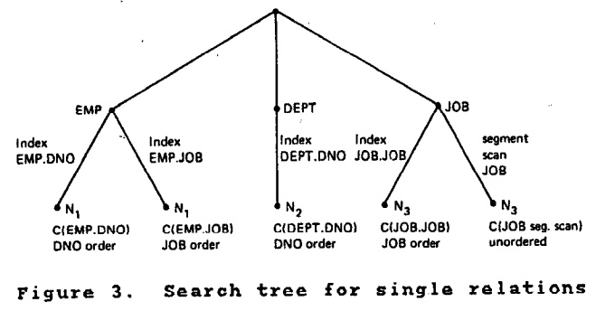

## AI论文解读 | Access Path Selection In A Relational Database Management System
        
### 作者        
digoal        
        
### 日期        
2025-09-30       
        
### 标签        
PostgreSQL , PolarDB , DuckDB , AI , 论文解读        
        
----        
        
## 背景  
      
https://dl.acm.org/doi/pdf/10.1145/582095.582099        
  
提示:          
```          
读懂《Access Path Selection In A Relational Database Management System》这篇论文需要提前掌握哪些基础知识, 请使用中文通熟易懂的讲解这些基础知识, 可以引用论文中的图、表或使用Markdown支持的图形(text,mermaid等)增加解释性. 
  
使用中文通熟易懂的解读《Access Path Selection In A Relational Database Management System》这篇论文, 其中的关键内容请着重讲解, 可以引用论文中的图、表或使用Markdown支持的图形(text,mermaid等)增加解释性. 
  
提取《Access Path Selection In A Relational Database Management System》这篇论文中的重要术语, 使用中文对这些术语进行通熟易懂的讲解, 可以引用论文中的图、表或使用Markdown支持的图形(text,mermaid等)增加解释性. 
```     
  
## 1 前置知识 
  
要读懂《Access Path Selection In A Relational Database Management System》（即著名的 **System R 优化器论文**），您需要掌握关系数据库系统中最核心的几个基础知识。这篇论文是**成本估算查询优化**领域的开山之作，它的核心在于如何将用户提出的**非过程化**查询（例如 SQL）转化为最高效的**过程化**执行计划。

以下是理解这篇论文所需的基础知识，已用通俗易懂的中文进行讲解。

-----

## 1\. 关系数据库基础 (Relational Database Fundamentals)

这篇论文的前提是您熟悉关系数据模型 。这是理解一切的基础。

### A. 关系模型 (Relational Model)

  * **概念:** 关系模型由 E.F. Codd 提出，将数据组织成**表 (Table)**，在论文中称为 **Relation（关系）** 。
      * **表（关系）** ：包含数据。
      * **行（元组）** ：表中的每一行，在论文中称为 **Tuple（元组）** 。
      * **列（属性）** ：表中的每一列，在论文中称为 **Column/Attribute（列/属性）** 。
  * **非过程化查询:** 关系模型的关键在于其查询语言（如 SQL）是**非过程化**的 。这意味着用户只说明**想要什么数据**（例如“找到所有工资高于 5000 的员工”），而**不指定如何获取**（例如“先扫描索引还是先全表扫描”） 。
  * **SQL 的作用:** 论文中的所有工作都是围绕 **SQL** 语句进行的 。优化器的任务就是为这条非过程化的 SQL 语句选择最优的**存取路径（Access Path）和连接顺序（Join Order）** 。

## 2\. 数据库物理存取路径 (Physical Access Paths)

优化器在选择最佳计划时，必须知道底层数据是如何存储的，以及有哪些不同的读取方式。

### A. 存储结构 (RSS)

System R 的底层存储系统称为 **RSS (Research Storage System)** 。数据是按 **4KB 大小的页 (Page)** 存储在磁盘上的，元组（行）存储在这些页面中 。

### B. 核心存取路径 (Access Scans)

论文提到两种主要的存取路径（Scan）方式:

1.  **Segment Scan（段扫描/全表扫描）**
      * **原理:** 顺序读取包含该关系的所有数据页，适用于没有索引或需要读取绝大部分数据的情况 。
2.  **Index Scan（索引扫描）**
      * **原理:** 通过 **B-Tree 索引**结构 ，首先定位到索引页，获取元组标识符（Tuple ID），然后再通过这些 ID 去查找并读取实际的数据元组 。索引扫描通常用于快速定位少量满足特定条件（如 `WHERE salary = 5000`）的元组。

### C. 聚簇索引 (Clustered Index)

这是一个至关重要的概念，直接影响 I/O 成本：

  * **定义:** 如果索引的顺序与数据元组在磁盘上的**物理存储顺序**基本一致，则称该索引为**聚簇索引（Clustered Index）** 。
  * **影响:**
      * **聚簇索引:** 在进行索引扫描时，能够确保每个**数据页**只被读取**一次** ，极大减少 I/O 成本。
      * **非聚簇索引 (Non-clustered Index):** 可能会导致每次读取一个元组都需要一次新的随机 I/O，即一个数据页可能被读取**多次** 。

## 3\. 查询优化核心理论 (Core Optimization Theory)

这是论文的核心内容，它将查询优化问题转化为一个数学上的**最小成本问题**。

### A. 成本模型 (The Cost Formula)

优化器选择的执行计划必须是**最小化总访问成本**的那个 。成本的计算公式是论文的基础，它将 I/O（磁盘读取）和 CPU（指令执行）结合起来 ：

$$\text{COST} = \text{PAGE FETCHES} + W \times (\text{RSI CALLS})$$

  * **PAGE FETCHES (磁盘页读取次数):** 代表 **I/O 成本**，即从磁盘读取多少数据页。这是数据库操作中最耗时的部分。
  * **RSI CALLS (元组检索次数):** 代表 **CPU 成本**（指令执行次数） 。 $\text{RSI CALLS}$ 是预测从底层存储系统 ( $\text{RSS}$ ) 返回的元组数量 。
  * $W$（权重因子）：用于调整 I/O 和 CPU 之间的相对重要性 。

### B. 统计信息与选择率 (Statistics and Selectivity)

为了计算成本，优化器需要事先知道表的特征，这些信息存储在系统目录中 。

1.  **重要统计信息**:
      * $\text{NCARD}(T)$：关系 $T$ 中的**元组总数**（行数）。
      * $\text{TCARD}(T)$：关系 $T$ 占用的**数据页总数**。
      * $\text{ICARD}(I)$：索引 $I$ 中**键值的总数**（即不重复的值有多少）。
2.  **选择率 (Selectivity Factor, $F$)**：
      * 选择率 $F$ 是一个 **估计值**，用于表示查询谓词（ $\text{WHERE}$ 子句中的条件）能筛选掉多少元组 。例如，如果 $F=0.1$，则表示满足条件的元组占总元组数的 $10\%$.
      * **如何估算 $F$ (参考 TABLE 1)**:      
          * **等值查询 ( $\text{column} = \text{value}$ ):** 如果列上有索引，则 $F = 1 / \text{ICARD}(\text{column index})$。这假定键值均匀分布 。
          * **范围查询 ( $\text{column} > \text{value}$ ):** 通常使用默认值或线性插值估算，例如默认 $F = 1/3$ 。
      * **组合谓词:** $\text{AND}$ 关系下，选择率相乘： $F(\text{pred1 AND pred2}) = F(\text{pred1}) \times F(\text{pred2})$（假定列值相互独立） 。

### C. 多表连接与动态规划 (Multi-Table Joins and Dynamic Programming)

当查询涉及多张表（ $\text{Join}$ ）时，问题会变得复杂。

1.  **连接方法 (Join Methods)（参考 Section 5）:**

      * **Nested Loops Join（嵌套循环连接）** :
          * 对**外表 (Outer Relation)** 中的每个元组，都对**内表 (Inner Relation)** 进行一次完整或部分的扫描 。
          * **成本:** $\text{Cost}\_{\text{NLJ}} = \text{Cost}\_{\text{Outer}} + \mathbf{N}\_{\text{Outer}} \times \text{Cost}_{\text{Inner}}$ 。
      * **Merge Scans Join（排序合并连接）** :
          * 要求内外表都按连接列**排序** 。然后像拉链一样同步扫描，避免内表重复扫描。
          * 如果表未排序，需要额外的**排序成本** 。

2.  **连接顺序选择 (Join Order Selection)**：

      * 如果查询涉及 $N$ 张表，理论上有 $N!$ 种连接顺序（例如 3 张表有 $3! = 6$ 种顺序） 。
      * System R 优化器使用了**动态规划 (Dynamic Programming)** 的思想，通过迭代地寻找更小集合的最优解来构建最终的最优执行计划 。
      * **核心思想:** 找到连接 $K$ 张表的最优计划后，再寻找加入第 $(K+1)$ 张表的最优解。通过这种方式，它避免了重复计算，并且只保存每个**子集**和每种**有趣顺序 (Interesting Order)** 的**最低成本**方案 。

下面是查询优化器选择计划的简化流程图，展示了从 SQL 语句到最终执行的逻辑步骤：


  
## 2 解读论文 
  
好的，我们来一起深入解读这篇数据库领域的奠基之作——《Access Path Selection in a Relational Database Management System》。这篇论文由IBM研究院的Patricia Griffiths Selinger等人于1979年发表，描述了其为实验性关系数据库System R所设计的查询优化器。这个优化器的核心思想至今仍是几乎所有主流关系型数据库（如Oracle, SQL Server, PostgreSQL, MySQL等）查询优化的基础。

### 论文核心思想：一句话概括

当用户用SQL这样的高级语言告诉数据库“**我想要什么数据**”时，用户并不关心“**如何拿到这些数据**”。这篇论文解决的就是“如何拿”的问题。它设计了一个 **基于成本的优化器（Cost-Based Optimizer, CBO）** ，通过估算各种可能的执行路径（Access Path）的“成本”，并从中选择一个成本最低的计划来执行查询。

这就好比你要从A点到B点，可以走路、坐公交、打车。优化器就像一个智能导航系统，它会根据路况（数据分布）、交通工具的速度（不同算法的效率）和价格（资源消耗），为你推荐一条综合起来“最划算”的路线。

-----

### 论文关键内容深度解读

我们将按照论文的逻辑结构，从简单到复杂，逐步解析其关键内容。

#### 1\. 优化的目标：最小化“总访问成本”

优化器如何判断哪个执行计划更好？论文提出了一个经典的成本模型公式 ：

$$\text{COST} = \text{PAGE FETCHES} + W \times (\text{RSI CALLS})$$

  * **PAGE FETCHES**: 代表I/O成本，也就是需要从磁盘读取多少个数据页。在当年，磁盘I/O是最大的性能瓶颈，所以这是成本模型中最重要的部分 。
  * **RSI CALLS**: 代表CPU成本。RSI (Research Storage Interface) 是System R的存储子系统接口，调用次数可以近似看作需要处理的元组（记录）数量 。
  * **W**: 一个可调节的权重因子，用来平衡I/O成本和CPU成本在总成本中的比重 。

**核心：** 优化器的所有决策，都是为了让这个最终的COST值最小化 。

#### 2\. 基础模块：单表查询的路径选择

在处理复杂的多表连接之前，优化器首先要能计算出访问单个表的最低成本。

##### 可用的访问路径 (Access Paths)

System R的存储子系统（RSS）提供了两种主要的扫描方式 ：

1.  **Segment Scan (段扫描)**: 相当于全表扫描，它会遍历存储着这个表的所有数据页 。成本很高，但当没有索引可用或者需要访问表中大部分数据时，这是唯一的选择。
2.  **Index Scan (索引扫描)**: 通过B-Tree索引来访问数据 。
      * 可以快速定位到满足条件的特定元组（例如 `WHERE id = 100`）。
      * 可以扫描一个范围内的元组（例如 `WHERE age BETWEEN 20 AND 30`） 。
      * 可以按照索引的顺序返回数据。

##### 关键概念：SARGable Predicates (可作为搜索参数的谓词)

不是所有的`WHERE`条件都能有效利用索引。论文提出了一个重要概念 **SARG (Search Argument)** 。只有形如 `column op value` （列-操作符-值）的简单谓词才能被下推到存储引擎（RSS）中，利用索引进行高效过滤 。例如 `SALARY > 50000` 是SARGable的，而 `ABS(SALARY) > 50000` 则不是，后者需要取出所有SALARY值计算后才能判断。

##### 核心武器：统计信息和选择因子 (Selectivity Factor)

优化器是如何知道一个查询会返回多少数据的？答案是靠**统计信息** 。System R的系统目录（Catalog）中存储了以下信息 ：

  * 每个关系（表）的元组总数 (NCARD) 。
  * 每个关系占用的物理页数 (TCARD) 。
  * 每个索引中不同键值的数量 (ICARD) 。
  * 索引占用的物理页数 (NINDX) 。

基于这些统计信息，优化器为`WHERE`子句中的每个布尔因子（通常是AND连接的条件）计算一个**选择因子 (Selectivity Factor, F)**，代表满足该条件的元组占总元组的比例 。

论文中的 **Table 1**  详细列举了不同谓词的选择因子估算方法，这里举几个例子：     

  * `column = value`:  $F \approx 1 / \text{ICARD}(\text{column\_index})$ 。 假设“城市”列有100个不同的城市，那么查询 `城市='北京'` 的选择因子就是1/100。这基于一个均匀分布的假设 。
  * `column1 = column2` (用于Join): $F \approx 1 / \max(\text{ICARD}(\text{col1\_idx}), \text{ICARD}(\text{col2\_idx}))$ 。
  * `pred1 AND pred2`: $F = F(\text{pred1}) \times F(\text{pred2})$ (假设条件独立) 。
  * `pred1 OR pred2`: $F = F(\text{pred1}) + F(\text{pred2}) - F(\text{pred1}) \times F(\text{pred2})$ 。

有了选择因子，优化器就可以估算出将要返回的元组数量（`RSICARD = NCARD * F`）和需要访问的数据页数，进而使用 **Table 2**  中的公式计算出不同访问路径的成本，并选择最低的那个。   

##### 额外考虑：有趣的顺序 (Interesting Order)

如果查询中有 `ORDER BY` 或 `GROUP BY` 子句，那么按照这些子句要求的顺序输出就是一个“有趣的顺序” 。如果某个索引扫描恰好能产生这个顺序，就可以避免一次昂贵的排序操作。因此，优化器会特别比较：

1.  **成本A**: 使用能产生“有趣顺序”的索引的成本。
2.  **成本B**: 使用成本最低的“无序”访问路径的成本 + 对结果集进行排序的成本。

最终选择成本A和成本B中更低的那个方案 。

-----

#### 3\. 核心突破：多表连接的路径选择

这是这篇论文最核心、最具开创性的部分。

##### 连接方法 (Join Methods)

System R的优化器主要考虑两种被证明在大多数情况下最优或接近最优的连接方法 ：

1.  **Nested Loops Join (嵌套循环连接)**:

      * 遍历外层表的每一行。
      * 对于外层表的每一行，扫描整个内层表，寻找匹配的行 。
      * 简单直观，但如果内层表很大，重复扫描的成本会非常高。如果内层表的连接列上有索引，则可以极大提升效率。

2.  **Merging Scans Join (归并扫描连接)**:

      * 也常被称为Sort-Merge Join。
      * **前提**：两个表都必须在连接列上是排好序的 。
      * 如果表本身没有通过索引排好序，就需要先进行显式的排序操作，并将结果存入临时表 。
      * 排序后，连接过程就像拉拉链一样，用两个指针同步扫描两个有序的表，效率非常高 。

##### 颠覆性创新：连接顺序的动态规划搜索

对于 N 个表的连接，理论上有 N\! 种连接顺序。例如 `T1 JOIN T2 JOIN T3`，可以先连接 `(T1, T2)` 再连接 `T3`，也可以先 `(T2, T3)` 再连接 `T1`。不同的连接顺序，其执行成本可能有天壤之别 。暴力枚举所有可能性在N稍大时是不可行的 。

System R优化器采用了一种**基于动态规划思想的自底向上搜索策略**来解决这个问题 。下面我们以论文中的 `EMP`, `DEPT`, `JOB` 三表连接为例来说明这个过程，可以结合论文中的Figure 3-6理解。  

**第一步：找到所有单表的最佳访问路径**

  * 计算访问`EMP`表的最低成本路径（无序、按DNO排序、按JOB排序）。
  * 计算访问`DEPT`表的最低成本路径。
  * 计算访问`JOB`表的最低成本路径。
  * 将这些成本最低的计划及其成本、输出顺序等信息保存下来。这对应论文中的 **Figure 3** 。   


**第二步：找到所有二表连接的最佳方案**

  * 遍历所有可能的二表组合，如 `(EMP, DEPT)`。
  * 对每个组合，考虑所有可能的连接方式：
      * `EMP` 作为外表，`DEPT` 作为内表（使用嵌套循环和归并扫描）。
      * `DEPT` 作为外表，`EMP` 作为内表（使用嵌套循环和归并扫描）。
  * 计算每种方式的成本，保留该组合下成本最低的计划。例如，对于 `(EMP, DEPT)` 这个组合，可能会保留一个产生DNO顺序的最低成本计划，以及一个无序的最低成本计划。
  * 对 `(EMP, JOB)` 和 `(DEPT, JOB)` 重复此过程。
  * 这一步完成后，我们就有了所有二元组的最优连接计划。这对应论文中的 **Figure 4 和 5** 。    

**第三步：找到所有三表连接的最佳方案**

  * 基于第二步的结果，构建三表连接。例如，考虑 `(EMP, DEPT)` 的最优计划，然后将其作为一个整体（外层复合关系），与 `JOB` 表（内层表）进行连接。
  * 同样，计算所有可能的连接方法和顺序的成本，例如 `((EMP,DEPT), JOB)`, `((EMP,JOB), DEPT)` 等。
  * 保留每个最终结果（例如，无序、按某个有趣顺序排序）的最低成本计划。
  * 这一步对应论文中的 **Figure 6** 。   
 
**最终决策**

  * 经过N-1轮迭代后，优化器就得到了连接所有N个表的最优计划。
  * 如果查询有 `ORDER BY`，优化器会对比：
    1.  直接产生该顺序的最优计划的成本。
    2.  无序最优计划的成本 + 最终排序的成本。
        选择两者中更便宜的那个 。

**剪枝策略**：为了减少搜索空间，优化器使用了一个重要的启发式规则：**尽量推迟笛卡尔积**。也就是说，只考虑那些内外表之间存在连接谓词（join predicate）的连接顺序 。

#### 4\. 处理复杂情况：嵌套查询 (Nested Queries)

论文最后讨论了子查询的处理 。

  * **非相关的子查询 (Non-correlated Subquery)**: 子查询不依赖于外部查询的任何值。这种子查询可以被独立计算，而且**只需计算一次**。其结果（可能是一个值或一个列表）会被物化，然后代入到外部查询中，就像一个常量一样 。

  * **相关的子查询 (Correlated Subquery)**: 子查询的 `WHERE` 条件中引用了外部查询的列值。原则上，对于外部查询的**每一行**，这个子查询都必须被重新计算一次 。这是一个巨大的潜在性能陷阱。

      * **优化**：System R优化器提出，如果外部查询的行在相关列上是排好序的，那么当新一行的相关列值与上一行相同时，就无需重新计算子查询，可以直接复用上次的结果，从而大大减少了计算量 。

### 总结与历史意义

《Access Path Selection in a Relational Database Management System》这篇论文的贡献是革命性的：

1.  **奠定了CBO的理论基石**: 首次系统性地提出了一个包含I/O和CPU的成本模型，并基于此进行路径选择 。
2.  **动态规划解决连接顺序**: 创造性地使用动态规划算法，在巨大的搜索空间中高效地找到了近似最优的多表连接顺序 。
3.  **整合多种优化技术**: 统一考虑了访问路径、连接方法、连接顺序以及“有趣顺序”，形成了一个完整的优化框架 。
4.  **统计信息的重要性**: 强调了维护准确的数据库统计信息对于优化器做出正确决策的至关重要性。

尽管现代数据库的优化器远比System R的要复杂（例如，考虑了更复杂的统计信息如直方图、更多的连接算法如Hash Join、更智能的并行处理等），但其核心思想——**基于成本估算，探索多种执行计划，并选择最优者**——完全继承自这篇40多年前的开创性论文。它成功地将用户从复杂的“如何做”中解放出来，专注于“做什么”，为关系型数据库的普及和成功立下了汗马功劳。
  
## 3 术语 
  
您好！《Access Path Selection In A Relational Database Management System》是数据库查询优化领域的奠基之作，由 System R 团队于 1979 年发表。要读懂这篇论文，掌握其核心术语至关重要。

以下是论文中几个重要的技术术语及其通俗易懂的中文讲解，并辅以图示说明。

-----

## 一、 查询优化的目标与输入

### 1\. 非过程化查询 (Non-procedural Query)

  * **英文原文:** Non-procedural Query
  * **通俗解释:** 这是指 **SQL** 这样的高级语言。用户在使用 SQL 查询数据时，只说明 **“我想要什么数据”** （例如：工资高于 5000 的员工），但 **不指定** 数据库“应该如何去获取这些数据”（例如：是先全表扫描还是用索引）。
  * **意义:** 正因为查询是“非过程化”的，数据库系统（System R）才需要一个**优化器 (Optimizer)** 来自动决定执行的“过程”，这是这篇论文诞生的根本原因。

### 2\. 存取路径 (Access Path)

  * **英文原文:** Access Path
  * **通俗解释:** 数据库从物理存储中读取数据的**具体方法或路线**。优化器的工作就是为查询选择最优的存取路径。
  * **重要类型:**
      * **Segment Scan (段扫描/全表扫描):** 顺序地读取整个表的所有数据页。适用于读取表中大部分数据，或表上没有可用索引的情况。
      * **Index Scan (索引扫描):** 利用表上的索引（如 B-Tree）来快速定位和检索满足条件的元组。适用于只读取表中一小部分数据的情况。

-----

## 二、 优化的核心机制：成本估算

### 3\. 成本函数 (The Cost Formula)

  * **英文原文:** Cost Formula / Cost Function
  * **通俗解释:** 优化器用来“衡量”和比较不同执行计划优劣的**数学公式**。它将数据库操作的开销量化为一个单一的数值（即 $\text{COST}$ ），值越小，计划越好。System R 的成本模型是基于对 I/O 成本和 CPU 成本的加权计算：

$$\text{COST} = \text{PAGE FETCHES} + W \times (\text{RSI CALLS})$$  

| 术语 | 含义 | 开销类型 |
| :--- | :--- | :--- |
| **PAGE FETCHES** | **页面读取次数**。代表 **I/O 成本**，即从磁盘读取多少个数据页。这是数据库操作中最大的开销。 | I/O |
| **RSI CALLS** | **元组检索调用次数**。代表 **CPU 成本**，即在内存中处理和检索元组所需的 CPU 指令或步骤。 | CPU |
| $W$ (Weight) | **权重因子**。用于调整 I/O 和 CPU 成本的相对重要性。 | — |

  * **意义:** 优化器通过这个公式，计算出所有可能的执行计划的 $\text{COST}$ ，然后选择 $\text{COST}$ 最低的那个。

### 4\. 选择率 (Selectivity Factor, $F$)

  * **英文原文:** Selectivity Factor

  * **通俗解释:** 这是一个**估计值**（0 到 1 之间），表示一个查询条件（谓词）能筛选出**多少比例**的元组。

      * 如果 $F=0.1$，表示大约 $10\%$ 的数据满足这个条件。
      * 如果 $F=0.001$，表示只有 $0.1\%$ 的数据满足条件，查询的效率会很高。

  * **应用 (参考 Section 4.1):** 优化器使用选择率来估计中间结果集的大小，这是计算后续操作成本的关键。例如：

      * **等值查询 ( $\text{column} = \text{value}$ ):** 如果 `column` 上有索引，通常估计 $F = 1 / \text{ICARD}(\text{column index})$ ，其中 $\text{ICARD}$ 是该列的**唯一值数量**。
      * **AND 谓词的组合:** 假设条件相互独立，则选择率相乘： $F(\text{cond1 AND cond2}) = F(\text{cond1}) \times F(\text{cond2})$ 。

-----

## 三、 多表连接策略 (Join Strategy)

### 5\. 连接方法 (Join Methods)

  * **英文原文:** Join Methods
  * **通俗解释:** System R 优化器主要考虑两种多表连接的算法。
      * **嵌套循环连接 (Nested Loops Join - NLJ):**
          * **原理:** 类似于编程中的双层循环。对外表（Outer Relation）中的每一行数据，都完整地扫描一次内表（Inner Relation）以寻找匹配项。
          * **特点:** 简单，但如果表很大且没有索引，成本非常高。
      * **合并扫描连接 (Merge Scans Join / Sort-Merge Join):**
          * **原理:** 要求连接的两个表都必须按连接键**排好序**。然后，同时“拉链式”扫描两张表，找到匹配项。
          * **特点:** 如果表已经有序，效率极高；如果表无序，则需要额外的**排序成本**。

### 6\. 动态规划 (Dynamic Programming)

  * **英文原文:** Dynamic Programming
  * **通俗解释:** 解决**多表连接顺序**问题的核心算法。假设有 $N$ 张表需要连接，理论上有 $N!$ 种连接顺序（例如 10 张表有 360 万种以上）。优化器不可能尝试所有顺序。
  * **原理:** 动态规划基于**最优子结构**。它不是直接寻找 $N$ 表的最优解，而是迭代地构建：
    1.  找到连接所有两表子集的最优解。
    2.  利用这些最优解，找到连接所有三表子集的最优解。
    3.  ...直到找到连接所有 $N$ 张表的最优解。
  * **意义:** 通过重用小集合（子集）的最优解，大大减少了需要评估的计划数量。

### 7\. 有趣的顺序 (Interesting Order)

  * **英文原文:** Interesting Order
  * **通俗解释:** 这是动态规划过程中的一个关键概念。在连接多张表时，优化器不仅要找到**最低成本**的连接计划，还要检查这个计划的结果集是否已经按某个字段**排好序**。
  * **意义:** 如果结果集已经有序，那么：
      * 它可以直接用于后续的 **Merge Scans Join**，从而避免额外的排序成本。
      * 它可以满足用户查询中 `ORDER BY` 子句的要求，从而避免最终的排序成本。
      * 因此，即使一个计划的成本不是最低的，但如果它产生了一个“有趣的顺序”，优化器也可能会保留它，因为这个顺序可能会在后续的步骤中**节省更大的成本**。

下图展示了优化器如何从动态规划中选择**最低成本**或**有趣顺序**的子集：


  
## 参考        
         
https://dl.acm.org/doi/pdf/10.1145/582095.582099    
        
<b> 以上内容基于DeepSeek、Qwen、Gemini及诸多AI生成, 轻微人工调整, 感谢杭州深度求索人工智能、阿里云、Google等公司. </b>        
        
<b> AI 生成的内容请自行辨别正确性, 当然也多了些许踩坑的乐趣, 毕竟冒险是每个男人的天性.  </b>        
    
  
#### [期望 PostgreSQL|开源PolarDB 增加什么功能?](https://github.com/digoal/blog/issues/76 "269ac3d1c492e938c0191101c7238216")
  
  
#### [PolarDB 开源数据库](https://openpolardb.com/home "57258f76c37864c6e6d23383d05714ea")
  
  
#### [PolarDB 学习图谱](https://www.aliyun.com/database/openpolardb/activity "8642f60e04ed0c814bf9cb9677976bd4")
  
  
#### [PostgreSQL 解决方案集合](../201706/20170601_02.md "40cff096e9ed7122c512b35d8561d9c8")
  
  
#### [德哥 / digoal's Github - 公益是一辈子的事.](https://github.com/digoal/blog/blob/master/README.md "22709685feb7cab07d30f30387f0a9ae")
  
  
#### [About 德哥](https://github.com/digoal/blog/blob/master/me/readme.md "a37735981e7704886ffd590565582dd0")
  
  

  
