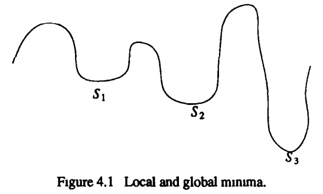
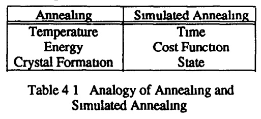
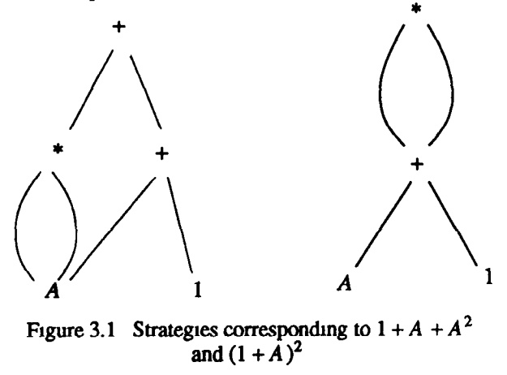
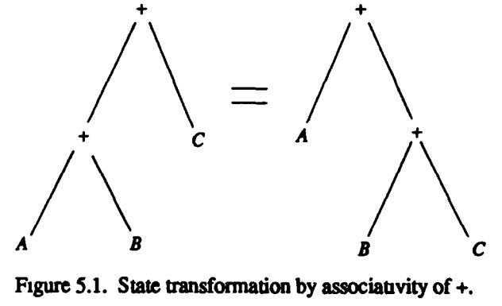
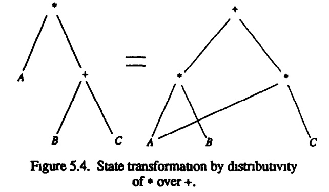
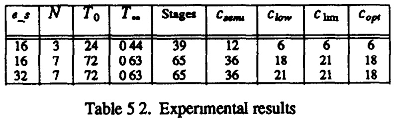
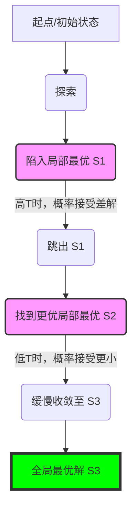

## AI论文解读 | Query Optimization By Simulated Annealing
        
### 作者        
digoal        
        
### 日期        
2025-09-30       
        
### 标签        
PostgreSQL , PolarDB , DuckDB , AI , 论文解读        
        
----        
        
## 背景  
      
https://dl.acm.org/doi/pdf/10.1145/38713.38722        
  
提示:          
```          
读懂《Query Optimization By Simulated Annealing》这篇论文需要提前掌握哪些基础知识, 请使用中文通熟易懂的讲解这些基础知识, 可以引用论文中的图、表或使用Markdown支持的图形(text,mermaid等)增加解释性. 
  
使用中文通熟易懂的解读《Query Optimization By Simulated Annealing》这篇论文, 其中的关键内容请着重讲解, 可以引用论文中的图、表或使用Markdown支持的图形(text,mermaid等)增加解释性. 
  
提取《Query Optimization By Simulated Annealing》这篇论文中的重要术语, 使用中文对这些术语进行通熟易懂的讲解, 可以引用论文中的图、表或使用Markdown支持的图形(text,mermaid等)增加解释性. 
```     
  
## 1 前置知识 
  
阅读《Query Optimization By Simulated Annealing》（基于模拟退火的查询优化）这篇论文，您需要提前掌握以下两个核心领域的知识：

1.  **数据库查询优化 (Database Query Optimization) 的基础理论。**
2.  **模拟退火算法 (Simulated Annealing) 的基本原理。**

以下将使用通俗易懂的中文进行详细解释。

---

## 1. 数据库查询优化基础知识

这篇论文针对的是传统数据库优化器难以解决的**复杂查询**和**递归查询**问题，因此需要深入理解查询优化是如何工作的，以及递归查询的代数表示方法。

### 核心概念 1: 查询优化器的目标

* **查询（Query）** : 用户用 SQL 等语言表达的数据请求。
* **访问计划/执行策略 (Access Plan/Strategy)**: 数据库执行查询的详细步骤，例如先进行哪两个表的连接（Join），使用哪种索引（Index），以及数据如何过滤和聚合。
* **成本函数 (Cost Function)**: 优化器的目标是找到**最低成本**的访问计划 。成本通常是衡量执行该计划所需的 **I/O 次数**（磁盘读写）和 **CPU 时间**的估计值 。

### 核心概念 2: 状态空间爆炸 (State Space Explosion)

在传统查询中，优化器会**穷举搜索**（Exhaustive Search）所有可能的执行计划 。

然而，当查询变得复杂时（例如涉及十几个表的连接、全局优化，或递归查询）：

* **问题**: 可行的访问计划数量会随着关系（表）的数量呈**指数级**增长 。
* **结论**: 穷举搜索在未来或复杂的数据库系统中**不可行** 。

这正是这篇论文需要引入**模拟退火**这种启发式搜索算法的根本原因 。

### 核心概念 3: 递归查询的代数模型 (Algebraic Model for Recursion)

论文将递归查询（如寻找“祖先-后代”关系）转化为一种特殊的代数形式，这是理解论文后续步骤的关键。

* **线性关系操作符 (Linear Relational Operators)**: 论文将关系操作（如连接、投影等）抽象为操作符 $A$。
* **闭半环 (Closed Semiring)**: 论文在这个代数框架内定义了操作符的**加法**（ $+$ ，对应关系代数的 **$\cup$ 集合并** ）和 **乘法** （ $\times$ ，对应操作符的**顺序应用** ）。
* **传递闭包 ( $A^{\bullet}$ )**: 递归查询的最终结果，即是求解操作符 $A$ 的**传递闭包** 。
    $$\text{A}^{\bullet} = \sum_{k=0}^{\infty} \text{A}^{k} = \text{I} + \text{A} + \text{A}^2 + \text{A}^3 + \cdots$$
    其中 $\text{I}$ 是恒等操作符（Identity）， $\text{A}^k$ 代表操作符 $\text{A}$ 连续应用 $k$ 次。

### 核心概念 4: 策略与图表示 (Strategy as a Graph)

* **策略 (Strategy)**: 计算 $A^{\bullet}$ 的一个等价代数形式，例如计算 $\text{I} + \text{A} + \text{A}^2$ 可以有多种策略，如 $(\text{I} + \text{A}) + \text{A}^2$ 或 $\text{I} + (\text{A} + \text{A}^2)$ 。
* **表示方式**: 为了区分计算顺序和避免重复计算，策略通常用**有向无环图 (Directed Acyclic Graph, DAG)** 来表示，而非简单的代数表达式 。图的叶子节点是基本操作符，其他节点是加法或乘法操作 。

---

## 2. 模拟退火算法（Simulated Annealing, SA）原理

模拟退火是一种求解大规模复杂优化问题的**概率性启发式算法**，它借鉴了物理学中的**固体退火过程**。

### 核心概念 1: 物理退火与优化问题的类比 (Analogy)

| 物理退火过程 (Annealing) | 模拟退火优化 (Simulated Annealing) |
| :--- | :--- |
| **温度 (Temperature)** | **控制参数 $T$** (随着时间降低)  |
| **能量 (Energy)** | **成本函数/代价 (Cost Function)** ( $c_A$ )  |
| **原子排布 (Crystal Formation)** | **状态/解 (State)** (即查询执行策略 $s$)  |
| **最低能量状态** | **全局最优解 (Global Minimum Cost)**  |

### 核心概念 2: 克服局部最优 (Escaping Local Minima)

传统的“贪婪”爬山算法（Hill Climbing）一旦陷入局部最优解 $S_1$，就无法找到更优的全局最优解 $S_3$。

  

**图示概念解释 (基于论文 Figure 4.1):**

想象一个山峦起伏的地形图，高度代表**成本 (Cost)**，您想找到最低谷（**全局最优解**）。

1.  **下坡 (Downhill Move)**: 如果从当前状态 $s$ 转移到邻居状态 $s'$ 导致成本**降低**（ $\Delta c \le 0$ ），则**始终接受**这个移动（像水往低处流）。
2.  **爬坡 (Uphill Move)**: 如果移动到 $s'$ 导致成本**增加**（ $\Delta c > 0$ ），模拟退火算法会**以一定的概率接受**这个“坏”移动 。这个机制帮助算法跳出当前的“小山谷”（局部最优解），去寻找更低的“大山谷”（全局最优解）。

### 核心概念 3: 概率接受准则 (Probabilistic Acceptance Criterion)

温度 $T$ 是控制爬坡概率的关键参数。

当 $\Delta c > 0$ 时，接受新状态 $s'$ 的概率 $P$ 为：

$$P = e^{-\frac{\Delta c}{T}}$$ 

* **高温度 ( $T$ 大 )**: $P$ 接近于 1。在搜索初期，温度很高，算法**更容易**接受差的解，以便在整个状态空间中进行广泛探索。
* **低温度 ( $T$ 小 )**: $P$ 接近于 0。在搜索末期，温度很低（系统“冻结”），算法**很难**接受差的解，倾向于稳定在找到的最佳解上 。

### 核心概念 4: 冷却调度 (Cooling Schedule)

算法的核心在于**缓慢地降低温度 $T$**（即 **`T = reduce(T)`** 步骤）。如果温度降得太快，算法可能会像贪婪算法一样，过早陷入局部最优解而无法逃脱。只有足够慢的冷却过程，才能保证算法最终收敛到全局最优解 。
  
## 2 解读论文 
  
好的，這就為您通俗易懂地解讀《Query Optimization By Simulated Annealing》這篇經典論文。

### 論文核心思想概覽

這篇論文提出了一種創新的方法來解決數據庫中的查詢優化問題，特別是針對未來數據庫系統中可能出現的、極其複雜的查詢場景。傳統的查詢優化器通常試圖遍歷所有可能的執行方案（稱為“訪問計畫”），從中找出成本最低的一個。但隨著查詢涉及的數據表增多、或者出現遞歸查詢（例如，在社交網絡中查找所有朋友的朋友，再朋友的朋友……），可能的執行方案數量會呈指數級爆炸式增長，使得窮舉搜索變得完全不可行 。

為了解決這個難題，作者 Yannis E. Ioannidis 和 Eugene Wong 引入了一種名為 **模擬退火（Simulated Annealing）** 的算法 。這是一種受到物理學中金屬退火過程啟發的概率性算法，非常擅長在巨大的搜索空間中尋找最優解，而無需檢查每一個可能的方案 。

-----

### 1\. 為何需要新的優化算法？問題的挑戰性

傳統的數據庫查詢（例如，在選課系統中查找某個學生選了哪些課）通常只涉及少數幾個數據表 。然而，隨著人工智能、專家系統和圖數據庫等新應用的興起，查詢的複雜性大大增加 ：

  * **查詢涉及的數據表數量劇增**：一個查詢可能需要關聯幾十甚至上百個表 。
  * **多查詢的全局優化**：系統需要同時優化一組查詢，並找到它們之間的共性以節省計算資源 。
  * **遞歸查詢的出現**：遞歸查詢相當於無限多個普通查詢的並集，其複雜度取決於數據本身，可能變得任意大 。

這些新挑戰使得訪問計畫的搜索空間變得異常龐大，傳統的窮舉搜索方法徹底失效 。

### 2\. 模擬退火算法：一種“智能”的搜索策略

模擬退火算法是一種 **概率性爬山算法（probabilistic hill climbing）** 。為了理解它，我們可以先看傳統的“爬山算法”。

  * **傳統爬山算法**：就像一個蒙著眼睛的登山者，每一步都只會朝著更高的方向（在優化問題中是“成本更低”的方向）走。這種方法的缺點是，如果走到一個局部最高點（局部最優解），它就無法下來再去尋找可能存在的、更高的全局最高點（全局最優解）。

  * **模擬退火算法**：它比傳統爬山算法更“聰明”。在開始時，它像一個被加熱到高溫的分子，充滿活力，不僅會走向成本更低的方案（下山），也有一定的概率接受成本更高的方案（上山）。這種“上山”的能力讓它有機會跳出局部最優的“小山谷”，去探索更廣闊的空間，從而找到全局最優的“珠穆朗瑪峰”。

這個過程由一個關鍵參數——**溫度（T）** 控制 。

  * **高溫時**：接受“壞”選擇的概率較高，探索範圍廣。
  * **溫度逐漸降低**：接受“壞”選擇的概率越來越低，算法逐漸穩定下來，收斂到一個最優解。
  * **溫度降至冰點**：算法基本不再接受“壞”選擇，最終鎖定找到的最優解 。

論文中的 **表 4.1** 和 **圖 4.1** 非常形象地解釋了這個過程。

| 物理退火 (Annealing) | 模擬退火 (Simulated Annealing) |
| :--- | :--- |
| 溫度 (Temperature) | 時間/控制參數 (Time) |
| 能量 (Energy) | 成本函數 (Cost Function) |
| 晶體形成 (Crystal Formation) | 狀態/解決方案 (State) |

  

表 4.1 物理退火與模擬退火的類比

下圖中， $S_1$ 和 $S_2$ 是局部最優解（小山谷），而 $S_3$ 是全局最優解（最低谷）。模擬退火算法即使到達 $S_2$，也有能力“爬”出來，最終找到 $S_3$ 。

  

圖 4.1 局部最優與全局最優示意圖

-----

### 3\. 如何將查詢優化問題“翻譯”成模擬退火模型？

為了應用模擬退火，作者們必須定義三個核心要素：**狀態空間**、**鄰居狀態** 和 **成本函數** 。

#### 3.1 狀態（State）：查詢的不同計算方式

論文將複雜的（特別是遞歸）查詢用一種代數模型來表示 。一個查詢的計算過程可以被抽象成一系列關係算子（如連接、並集）的組合。

例如，一個遞歸查詢 `P = A P ∪ Q` 的最終解可以表示為 $A^*Q$ ，其中 $A^*$ 是算子 A 的**傳遞閉包**，等於 $\sum_{k=0}^{\infty}A^{k}$ 。

一個 **狀態（State）** 就是計算這個最終結果的一種具體的代數表達式 。這些表達式在數學上是等價的，但它們的計算成本卻可能天差地別。論文中使用**有向無環圖（DAG）** 來精確表示每一個狀態（即計算策略）。

例如，計算 $1+A+A^2$ 可以有不同的策略，如下圖所示：

  

圖 3.1 左圖表示策略 $\sum_{k=0}^{2} A^{k}$，右圖表示策略 $(1+A)^2$ 

所有這些可能的計算策略（代數表達式）共同構成了模擬退火算法需要探索的 **狀態空間** 。

#### 3.2 鄰居狀態（Neighboring States）：從一種計算方式變換到另一種

算法需要一種機制從一個狀態移動到另一個狀態。這個機制就是定義“鄰居”。如果狀態 s' 可以通過對狀態 s 的圖結構進行一次微小的、符合代數法則的變換得到，那麼 s' 就是 s 的一個**鄰居狀態** 。

這些變換基於關係代數的基本定律，例如：

  * **加法結合律**: $(A+B)+C = A+(B+C)$ 
  * **乘法結合律**: $(A*B)*C = A*(B*C)$ 
  * **加法交換律**: $A+B = B+A$ 
  * **乘法對加法的分配律**: $A(B+C) = AB+AC$ 

下面的圖例直觀展示了這些變換如何改變計算策略的圖結構：

  

圖 5.1 加法結合律變換   

  
  
圖 5.4 乘法分配律變換 

模擬退火算法在運行時，會隨機選擇當前狀態的一個鄰居作為下一個候選狀態 。

#### 3.3 成本函數（Cost Function）：評估計算方式的優劣

**成本函數** 用來評估一個狀態（即一種計算策略）的執行成本 。在數據庫中，這個成本通常指 I/O 代價、CPU 計算時間等資源消耗的估算值 。論文中實現了一個簡化的成本模型，主要考慮了兩種基本操作的 I/O 成本 ：

  * **Join（連接）操作的成本**：與兩個關係的大小乘積大致成正比 。
  * **Union（並集）操作的成本**：與兩個關係的大小之和大致成正比 。

在每一步迭代中，算法會計算候選狀態與當前狀態的成本差 `Δc`，並依據這個差值和當前溫度 T 來決定是否接受這個新的狀態 。

-----

### 4\. 實驗與結果

作者們用 LISP 語言實現了一個模擬退火查詢優化器的原型 。他們進行了一些初步實驗，雖然實驗規模不大（例如，遞歸只計算3次或7次），但結果非常鼓舞人心 。

**實驗結果摘要 (基於表 5.2):**

| 遞歸次數 (N) | 初始方案成本 ( $c_{sn}$ ) | 算法找到的最終成本 ( $c_{fin}$ ) | 理論最優成本 ( $c_{opt}$ ) |
| :---: | :---: | :---: | :---: |
| 3 | 12 | 6 | 6 |
| 7 | 36 | 21 | 18 |

  

表 5.2 實驗結果簡化版

從表中可以看出：

  * 對於 N=3 的簡單情況，算法總能找到全局最優解 。
  * 對於 N=7 的更複雜情況，算法雖然沒有每次都精確地找到全局最優解（21 vs 18），但其找到的解已經非常接近最優解，並且遠遠好於傳統的初始方案（成本從36降到21）。
  * 一個重要的發現是，傳統的處理策略（如半樸素評估，semi-naive evaluation）通常是次優的 。

-----

### 5\. 論文的自我批判與未來展望

作者在論文的結尾坦誠地指出了他們當前實現的一些不足之處，並提出了改進方向：

1.  **鄰居太“近”** ：當前的狀態變換規則（如結合律、分配律）每次只能產生微小的變化，導致從一個好狀態到另一個好狀態可能需要走很長的路。未來可以考慮引入更強大的變換規則，允許“一步跳得更遠” 。
2.  **成本變化太小**：由於鄰居很“近”，狀態之間的成本差異 `Δc` 通常很小，這不利於算法的有效探索。上述的“大跳躍”變換也能緩解這個問題 。
3.  **無效移動過多**：某些變換（如交換律）不改變成本，導致算法可能長時間在一個成本不變的“高原”上徘徊。可以考慮賦予能改變成本的變換更高的選擇概率 。

### 總結

《Query Optimization By Simulated Annealing》是一篇開創性的論文，它成功地將一個強大的、源於物理學的優化算法應用到了數據庫查詢優化這一核心問題上。它不僅為解決由遞歸和查詢複雜性劇增帶來的“組合爆炸”問題提供了一條可行的道路，也證明了傳統的、確定性的優化策略在未來可能不再適用。儘管這篇論文中的實現是初步的，但其思想和框架對後來的數據庫研究，特別是隨機化優化算法的應用，產生了深遠的影響。
  
## 3 术语 
  
本次将从《Query Optimization By Simulated Annealing》论文中，提取并解释其最重要的核心技术术语和概念。

-----

## 核心技术术语解释

### 1\. 模拟退火 (Simulated Annealing, SA)

  * **定义**: 一种**概率性爬山算法 (Probabilistic Hill Climbing Algorithm)** ，借鉴了物理学中固体退火（将固体加热至熔点，再缓慢冷却，使原子达到最低能量状态）的过程 。
  * **应用**: 专门用于解决**搜索空间巨大 (large access plan spaces)**  且存在**大量局部最优解 (local minima)** 的复杂优化问题 。
  * **核心机制**: 它允许在搜索过程中，以一定的概率接受 **成本增加（“爬坡”，Uphill Moves）** 的解 。
  * **目的**: 避免像传统贪婪算法那样陷入**局部最优解 (Local Minima)**，从而更有可能找到**全局最优解 (Global Minimum)** 。

**图示：局部最优与全局最优**

论文中提到，模拟退火算法能够克服局部最优解 $S_1$ 和 $S_2$，最终找到全局最优解 $S_3$ 。



### 2\. 状态空间 (State Space) 与访问计划空间 (Access Plan Space)

  * **访问计划 (Access Plan)**: 指执行一个查询的详细步骤和算法，例如先连接哪个表、使用哪个索引 。
  * **访问计划空间**: 所有可能的查询执行计划的集合。对于涉及大量关系（表）的复杂查询或递归查询，这个空间会呈**指数级**增长，变得**极其巨大 (larger by several orders of magnitude)** 。
  * **状态空间 ( $S_A$ )**: 在模拟退火算法中，这个空间被建模为计算**传递闭包 $A^{\bullet}$** 的所有**等价代数形式 (equivalent algebraic forms)** 。每一个等价的代数形式，即一个**执行策略 (Strategy)**，就是一个状态 。

### 3\. 策略 (Strategy) 与成本函数 (Cost Function)

  * **策略 ( $s$ )**: 计算 $A^{\bullet}$ 的一个序列，包括乘法和加法操作 。
  * **图表示 (DAG)**: 为了准确地表示计算顺序，并确保重复的子表达式只被计算一次，一个策略通常用**有向无环图 (Directed Acyclic Graph, DAG)** 来表示，而不是简单的代数表达式 。
      * **深度 (Depth)**: 策略图中的最长路径长度 。
  * **成本函数 ( $c(s)$ 或 $c_A$ )**: 与每个策略 $s$ 相关联的成本估计值 。在论文的实现中，它是一个简单的 **I/O 成本模型**，主要估算连接 (Join) 和集合并 (Union) 的 I/O 耗费 。优化器的目标就是找到**最低成本**的策略 $s_0$ 。

### 4\. 概率接受准则 (Probabilistic Acceptance Criterion)

这是模拟退火算法能够跳出局部最优的关键数学公式，它控制了接受“差解”的概率。

  * **符号**:
      * $\Delta c$: 新状态 $s'$ 与当前状态 $s$ 的成本差 $(\Delta c = c(s') - c(s))$ 。
      * $T$: **温度 (Temperature)**，是算法控制探索程度的参数 。
  * **准则**:
    1.  如果 $\Delta c \le 0$（成本降低或持平），则**始终接受**新状态 $s'$ 。
    2.  如果 $\Delta c > 0$（成本增加，“爬坡”），则以以下概率 $P$ 接受新状态 $s'$:

$$P = e^{-\frac{\Delta c}{T}}$$

  * **解释**:
      * 当**温度 $T$ 很高**时（搜索初期），分母大，概率 $P$ 接近于 1，算法**容易**接受差的解，进行大范围探索。
      * 当**温度 $T$ 很低**时（搜索末期），分母小，概率 $P$ 接近于 0，算法**极难**接受差的解，从而**收敛**到最佳解。

### 5\. 闭半环 (Closed Semiring) 与 线性关系操作符 (Linear Relational Operators)

  * **背景**: 论文使用了一个代数模型来研究递归查询 。
  * **闭半环**: 是一个具有加法 ( $+$ ) 和乘法 ( $\times$ ) 两种运算的代数结构 。
      * 在论文中: **加法**对应关系代数的**集合并 ( $\cup$ )** ；**乘法**对应**操作符的顺序应用 (Composition)** 。
  * **线性关系操作符 ( $A$ )**: 论文将关系操作（如联接、投影等）抽象为一个操作符 $A$，它作用于关系 $P$ 以产生更多的元组 ( $AP \subseteq P$ ) 。
  * **传递闭包 ( $A^{\bullet}$ )**: 递归查询（如寻找“祖先”）的解，就是计算操作符 $A$ 的传递闭包:
    $$A^{\bullet} = \sum_{k=0}^{\infty}A^{k} = I + A + A^2 + A^3 + \cdots$$

### 6\. 冷却调度 (Cooling Schedule)

  * **定义**: 在模拟退火算法中，控制温度 $T$ 随时间或迭代次数下降的策略 。这是确保算法能收敛到全局最优的关键要素。
  * **参数**: 包括**初始温度 $T_0$**、**冻结判据 (Freezing Criterion)**（何时停止）和 **平衡判据 (Equilibrium Criterion)**（内循环何时退出） 。
  * **函数 `reduce(T)`**: 负责降低温度的例程 。理论研究表明，温度必须以特定的方式（足够缓慢地）降低，才能保证算法收敛到全局最优 。

### 7\. 非重复策略 (Repetition-Free Strategy)

  * **背景**: 在搜索策略空间时，需要排除那些注定是**次优 (suboptimal)** 的策略 。
  * **定义**: 如果一个策略在计算过程中，**每个代数表达式只被形成（计算）一次**，则称其为非重复策略 。
  * **意义**: 确保没有冗余计算。例如，如果一个策略先计算了 $A^2$，又通过其他方式重新得到了 $A^2$，那么它就不是非重复策略，因为包含冗余计算，效率低下 。
      * *例如*: **Naive Evaluation (朴素求值法)**，即 $(1+A)^N$ 的形式，被证明是**非重复的 (not repetition-free)**，因此是次优的 。
  
## 参考        
         
https://dl.acm.org/doi/pdf/10.1145/38713.38722    
        
<b> 以上内容基于DeepSeek、Qwen、Gemini及诸多AI生成, 轻微人工调整, 感谢杭州深度求索人工智能、阿里云、Google等公司. </b>        
        
<b> AI 生成的内容请自行辨别正确性, 当然也多了些许踩坑的乐趣, 毕竟冒险是每个男人的天性.  </b>        
    
      
#### [期望 PostgreSQL|开源PolarDB 增加什么功能?](https://github.com/digoal/blog/issues/76 "269ac3d1c492e938c0191101c7238216")
  
  
#### [PolarDB 开源数据库](https://openpolardb.com/home "57258f76c37864c6e6d23383d05714ea")
  
  
#### [PolarDB 学习图谱](https://www.aliyun.com/database/openpolardb/activity "8642f60e04ed0c814bf9cb9677976bd4")
  
  
#### [PostgreSQL 解决方案集合](../201706/20170601_02.md "40cff096e9ed7122c512b35d8561d9c8")
  
  
#### [德哥 / digoal's Github - 公益是一辈子的事.](https://github.com/digoal/blog/blob/master/README.md "22709685feb7cab07d30f30387f0a9ae")
  
  
#### [About 德哥](https://github.com/digoal/blog/blob/master/me/readme.md "a37735981e7704886ffd590565582dd0")
  
  

  
