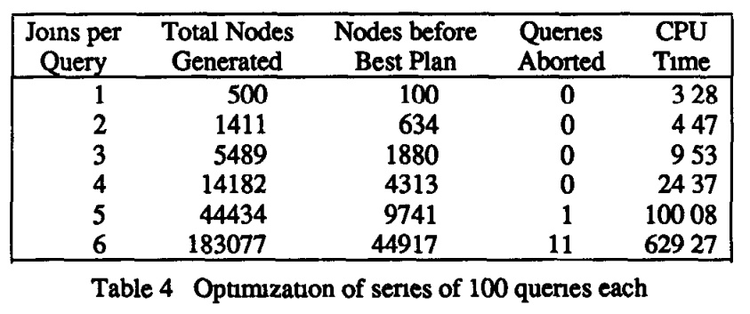

## AI论文解读 | The Exodus Optimizer Generator
        
### 作者        
digoal        
        
### 日期        
2025-09-30       
        
### 标签        
PostgreSQL , PolarDB , DuckDB , AI , 论文解读        
        
----        
        
## 背景  
      
https://dl.acm.org/doi/pdf/10.1145/38713.38734        
  
提示:          
```          
读懂《The Exodus Optimizer Generator》这篇论文需要提前掌握哪些基础知识, 请使用中文通熟易懂的讲解这些基础知识, 可以引用论文中的图、表或使用Markdown支持的图形(text,mermaid等)增加解释性. 
  
使用中文通熟易懂的解读《The Exodus Optimizer Generator》这篇论文, 其中的关键内容请着重讲解, 可以引用论文中的图、表或使用Markdown支持的图形(text,mermaid等)增加解释性. 
  
提取《The Exodus Optimizer Generator》这篇论文中的重要术语, 使用中文对这些术语进行通熟易懂的讲解, 可以引用论文中的图、表或使用Markdown支持的图形(text,mermaid等)增加解释性. 
```     
  
## 1 前置知识 
  
阅读《The EXODUS Optimizer Generator》这篇论文，您需要掌握以下几个方面的基础知识。这篇论文的核心在于**数据库查询优化**，但其目标是构建一个**可扩展的、自动生成的优化器**，因此它融合了数据库系统、关系代数和人工智能搜索算法的知识。

-----

## 1\. 数据库基础知识（Database Fundamentals）

### 1.1 EXODUS项目与可扩展数据库

  * **核心概念：** 传统数据库系统（如System R、Ingres）是针对特定数据模型（如关系模型）设计的，而 **EXODUS** (Extensible Database System) 是一个**可扩展数据库系统** 。
  * **意义：** 它的目标是帮助 **数据库实现者（DBI）** 快速构建或扩展支持新数据模型、新操作符或新存取方法（如新的索引结构）的数据库系统 。
  * **优化器的挑战：** 由于 EXODUS 不支持单一的预设数据模型，因此无法提供一个固定的通用优化器 。这篇论文介绍的优化器生成器就是解决这个问题的核心工具。

### 1.2 查询优化器的作用

  * **目的：** 查询优化器的作用是接收用户提交的查询，将其转换为**等价且成本最低**的 **存取计划（Access Plan）** ，即数据库实际执行操作的步骤 。
  * **成本模型：** 优化器需要一个**成本模型**来估算不同存取计划的执行开销（例如 I/O 成本、CPU 时间），并选择开销最低的计划 。

-----

## 2\. 查询优化的代数基础（Algebraic Core of Query Optimization）

这篇论文将查询和存取计划都抽象为 **操作符树（Operator Trees）** ，因此理解**关系代数**以及**树结构**的转换是关键 。

### 2.1 查询树与存取计划（Query Tree vs. Access Plan）

  * **查询树（Query Tree）：** 代表查询的**逻辑**结构，节点是 **操作符（Operators）** ，对应数据模型提供的原语（如`Join`、`Select`） 。
  * **存取计划（Access Plan）：** 代表查询的**物理**实现，节点是 **方法（Methods）** ，是操作符的具体实现算法（如`Hash Join`、`Nested Loops Join`） 。
  * **优化过程：** 查询优化就是**查询树的重排序**和**方法的选择** 。

#### 示例：逻辑到物理的转换（基于论文中图 1 的概念）

  

| 转换类型 | 描述 | 示例 (关系代数) |
| :--- | :--- | :--- |
| **重排序** | 应用**代数转换规则**来重新排列操作符，找到等价但可能更高效的执行顺序。 | $\text{Select}(\text{Join}(\text{A}, \text{B})) \rightarrow \text{Join}(\text{Select}(\text{A}), \text{B})$（选择下推）  |
| **方法选择** | 为每个逻辑操作符选择一个最合适的**物理实现方法**，并计算成本。 | $\text{Join} \rightarrow \text{Hash Join} / \text{Nested Loops Join}$  |

### 2.2 核心代数规则

理解以下代数规则如何影响查询效率至关重要：

1.  **连接操作符的可交换性（Join Commutativity）：** $A \bowtie B \Leftrightarrow B \bowtie A$ 。
2.  **连接操作符的结合性（Join Associativity）：** $(A \bowtie B) \bowtie C \Leftrightarrow A \bowtie (B \bowtie C)$ 。
3.  **选择下推（Selection Pushdown）：** 尽早执行过滤操作（`Select`），可以减少后续操作（如`Join`）处理的数据量，通常是重要的**启发式规则** 。

-----

## 3\. 基于规则的优化器生成与智能搜索（Rule-Based Generator and Intelligent Search）

这篇论文最具创新性的部分是其**优化器生成器**的架构和**自适应搜索策略**，这需要了解一些**人工智能（AI）搜索**和**编译原理**的概念。

### 3.1 优化器生成架构

该系统通过 **模型描述文件（Model Description File）** 来定义一个新数据模型的优化规则，然后由 **Optimizer Generator** 将其转化为可执行的 C 代码 。

以下是 EXODUS 优化器生成和运行的流程（基于论文中图 2 的概念）：

  


**模型描述文件**包含两类关键规则:

1.  **转换规则（Transformation Rules）：** 定义查询树之间的合法代数转换（如选择下推）.
2.  **实现规则（Implementation Rules）：** 定义哪些物理方法（Methods）可以实现某个逻辑操作符（Operator）.

### 3.2 自适应搜索策略（Directed Search Strategy）

为了避免 **穷举搜索（Exhaustive Search）** 带来的高昂开销，生成的优化器使用了一种 **有向搜索（Directed Search）** 策略，并引入了 **学习（Learning）** 机制 。

#### 核心数据结构：

  * **MESH：** 一个**网络结构**，用于存储和共享所有已探索的**等价查询树**及其**存取计划**的信息，避免重复计算（类似于动态规划或备忘录） 。
  * **OPEN：** 一个**优先队列**，存储所有**可能的下一步转换**。优化器总是从中选择最有“前景”的转换来执行 。

#### 学习与指导搜索（Expected Cost Factor）

  * **预期成本因子（Expected Cost Factor, $f$）：** 为每条**转换规则**关联一个因子，用于估算应用该规则后查询成本可能减少的比例。
      * 如果 $f < 1$，表示该规则是“好”的启发式（例如选择下推）。
      * 如果 $f = 1$，表示该规则是中性的（例如连接可交换性）.
  * **学习机制：** 优化器通过观察每次应用规则后的 **实际成本比率（Observed Cost Quotient, $q$ = 新成本/旧成本）** ，使用**滑动平均（Sliding Average）等方法自动调整 $f$ 的值，从而“学习”哪些规则是有效的，实现了自适应** 。

论文中使用的几何滑动平均公式之一：
$$f \leftarrow (f^K * q)^{\frac{1}{K+1}} \quad \text{（几何滑动平均）} \text{ }$$
其中 $f$ 是预期成本因子， $q$ 是当前观察到的成本比率， $K$ 是滑动平均常数。

  * **爬山法（Hill Climbing）：** 在搜索过程中，即使当前找到最优存取计划，优化器也不会立即停止，而是会继续探索**预期成本改进**在一个特定倍数（**Hill Climbing Factor**，典型值 1.01 到 1.5）内的转换，以确保不会错过更好的、可能需要先经过一个局部高成本状态才能达到的**全局最优**计划 。
  
## 2 解读论文 
  
好的，我们来一起解读这篇经典的数据库领域论文——《The EXODUS Optimizer Generator》。这篇论文介绍了为 EXODUS 可扩展数据库系统设计的查询优化器生成器。

### **核心思想**

想象一下，每当出现一种新的数据库模型（比如图数据库、文档数据库），我们是不是都得从头写一个极其复杂的查询优化器？这太费劲了！EXODUS 项目的目标就是简化这个过程。这篇论文的核心思想是： **我们不直接编写优化器，而是创建一个“优化器的生成器”** 。

数据库开发者（DBI）只需要提供新数据模型的一些“规则”，比如有哪些操作（算子）、这些操作有哪些实现方式（方法）、操作之间如何等价变换等。然后，这个生成器就能自动“生成”一个为这个新模型量身定制的高效查询优化器。

-----

### **关键内容深度解析**

#### **1. 问题的提出：为什么需要优化器生成器？**

传统的查询优化器是为特定的数据模型和数据库系统“写死的” 。比如，关系型数据库的优化器知道什么是“连接”（join）、“选择”（select），也知道实现连接有“嵌套循环”、“哈希连接”等方法 。

但是，EXODUS 项目旨在支持各种新型数据模型 ，比如对象数据库、地理信息数据库等。这些模型有全新的操作和数据类型（例如，地图数据中的“包含”、“相交”等操作）。为每一种新模型都重写一个优化器是不现实的。因此，他们提出了一个绝妙的构想：将优化器中**通用的部分**（如搜索算法）和**与特定模型相关的部分**（如操作规则、代价模型）分离开来 。优化器生成器就负责将这些与模型相关的规则，转换成一个可执行的优化器程序 。

#### **2. 设计与架构：如何生成一个优化器？**

生成器的工作流程可以用下图（基于论文中的 Figure 2）来概括：   


**数据库开发者（DBI）** 的核心工作是编写 **模型描述文件** 。这个文件主要包含：

  * **声明部分 (Declaration Part)**：定义数据模型有哪些**算子 (operators)** 和**方法 (methods)** 。算子是逻辑操作，比如关系代数中的 `join` 。方法是实现算子的具体算法，比如 `hash_join`、`loops_join` 。
  * **规则部分 (Rule Part)**：这是最关键的部分，包含两类规则。
      * **转换规则 (Transformation Rules)**：定义了查询树如何进行逻辑上的等价变换 。比如，著名的“连接交换律” `join(A, B) <-> join(B, A)` 。这些规则告诉优化器有哪些可以探索的查询重写路径。
      * **实现规则 (Implementation Rules)**：定义了一个逻辑算子可以由哪些具体的物理方法来实现 。例如，`join(A, B) by hash_join(A, B)` ，表示 `join` 算子可以用 `hash_join` 方法实现。

当 DBI 完成这个文件后，**优化器生成器**会读取它，并自动生成对应的 C 语言代码。这些代码与一些由 DBI 编写的辅助函数（如代价估算函数、属性计算函数 ）以及生成器自带的库函数一起编译链接，最终形成一个专门用于该数据模型的优化器 。

#### **3. 优化器的工作原理：MESH 和 OPEN**

生成的优化器在工作时，核心是两个数据结构：**MESH** 和 **OPEN** 。

  * **MESH**：这是一个网络状的数据结构，用于存储所有在优化过程中探索过的等价查询树和对应的访问计划 。它的巧妙之处在于**共享节点** 。如下图（基于论文 Figure 3 和 Figure 4）所示，当一个查询树经过转换规则（例如，将 `select` 下推）变成一个新的形态时，对于没有变化的部分，MESH 会直接复用旧树的节点，只为变化的部分创建新节点。这极大地节省了内存空间，并避免了重复计算 。     

      * *初始查询树*: `select(join(A, join(B, C)))`
      * *转换1 (select下推)*: `join(select(A), join(B, C))`
      * *转换2 (join交换律)*: `join(join(B, C), select(A))`

    在这些转换中，子树 `join(B, C)` 和 `select(A)` 会被不同的上层节点共享。

  * **OPEN**：这是一个**优先队列**，存放了所有“当前可以执行的转换操作” 。优化器每一步都会从 OPEN 中选择一个“最有希望的”转换来执行。

优化过程是一个循环 ：

1.  从 OPEN 中选择一个最有前途的转换。
2.  将这个转换应用到 MESH 中对应的查询树上，生成一个新的查询树形态。
3.  为新生成的节点选择代价最低的实现方法，并估算其成本。
4.  检查这个新的查询树形态，发现所有可以应用于它的新转换，并将这些新转换加入到 OPEN 中。
5.  循环此过程，直到 OPEN 为空或满足其他停止条件。

#### **4. 核心亮点：智能的搜索策略与学习机制**

如果只是盲目地应用所有规则，那很快就会陷入“组合爆炸”的困境，比穷举搜索好不了多少。这篇论文的另一大亮点是其**智能的、带学习功能的搜索策略**。

  * **期望代价因子 (Expected Cost Factor)**：为了决定从 OPEN 中先选哪个转换，系统为每条转换规则关联了一个“期望代价因子” $f$ 。这个因子的含义是：如果应用该规则前的代价是 $c$，那么应用后的期望代价就是 $c \times f$ 。

      * 如果一个规则是很好的启发式规则（比如下推选择操作），它的 $f$ 应该小于 1。
      * 如果一个规则是中性的（比如连接交换律），它的 $f$ 应该约等于 1。
      * 优化器会优先选择那个能带来最大期望代价降低（即 $c \times (1-f)$ 最大）的转换。

  * **学习与自我调整**：最妙的是，这个期望代价因子 $f$ 不是由人来设定的，而是**优化器自己学习和调整的** ！每当优化器应用一次规则，它会计算出实际的代价变化比率 $q = \frac{新代价}{旧代价}$，然后用这个实际观察到的值 $q$ 来更新该规则的期望因子 $f$ 。论文中探讨了多种平均方法，如几何滑动平均等 。这种机制使得优化器能够从过去的经验中学习，自动适应不同的查询负载和数据分布。

  * **爬山法 (Hill Climbing)**：为了避免搜索范围过大，优化器还采用了一种“爬山”策略 。它会设定一个“爬山因子”，只有当一个转换带来的期望代价改善在当前最优代价的一定比例之内时，才会去尝试它 。这有效裁剪了那些看起来不太可能产生好结果的搜索路径。

#### **5. 实验与结果**

为了验证效果，研究者们生成了一个针对关系模型的优化器，并进行了大量实验。

  * **与穷举搜索的对比**：
    如下表（基于论文 Table 2）所示，对于那些穷举搜索可以完成的338个查询，该优化器生成的访问计划的代价（Sum of Estimated Execution Costs）与穷举搜索找到的最优解非常接近（9837 vs 9637，仅差约2%）。但其花费的 CPU 时间和内存（由 Total Nodes Generated 体现）则要少几个数量级 。这证明了其搜索策略的高效性。   

| 搜索策略 (Hill Climbing Factor) | 生成的总节点数 | 找到最优计划前的节点数 | 估算执行代价总和 | CPU 时间 (秒) |
| :--- | :--- | :--- | :--- | :--- |
| **1.01** | 4309 | 1813 | 9837 | 5.0 |
| **1.05** | 5277 | 2002 | 9833 | 6.2 |
| **穷举搜索 (∞)** | 80380 | 7754 | 9637 | 87.0 |

  * **处理复杂查询的能力**：
    实验还测试了处理包含多个连接的复杂查询的能力。如下表（基于论文 Table 4），随着查询中连接数量的增加，虽然优化时间和所需节点数会显著增长，但其增长速度远低于连接树可能组合数的指数级增长( $8^N$ )，证明了 MESH 共享节点机制的有效性 。   

| 每个查询的Join数 | 生成的总节点数 | Queries Aborted | CPU 时间 (秒) |
| :--- | :--- | :--- | :--- |
| 1 | 500 | 0 | 3.28 |
| 3 | 5489 | 0 | 9.53 |
| 6 | 183077 | 11 | 629.27 |

  * **左深树 vs. 茂密树 (Left-deep vs. Bushy Trees)**：
    论文还比较了只考虑左深连接树（大多数传统优化器的选择）和考虑更复杂的茂密树的性能差异。结果显示，对于复杂查询，只考虑左深树的优化速度要快得多，但可能会错过代价更低的茂密树执行计划 。

### **结论与意义**

《The EXODUS Optimizer Generator》这篇论文最重要的贡献在于：

1.  **证明了优化器的核心搜索逻辑与特定数据模型的规则是可以分离的**，从而实现了优化器的“可生成”和“可扩展”。
2.  **提出了一套完整的、基于规则的优化器生成框架**，从模型描述到代码生成，再到内部高效的运行机制（MESH和OPEN）。
3.  **设计了一种智能的、带自学习功能的搜索策略**，通过动态调整期望代价因子，使优化器能够自我改进，在巨大的搜索空间中快速找到接近最优的查询计划。

这项工作为后续的可扩展数据库、联邦数据库以及如何将AI思想应用于系统软件领域提供了重要的思路和实践基础，是数据库查询优化领域一座里程碑式的丰碑。
  
## 3 术语 
  
《The EXODUS Optimizer Generator》这篇论文的核心在于如何**自动生成**一个高效的数据库查询优化器，而不是手动编写。因此，其重要术语主要围绕**优化器架构、规则定义**和**智能搜索**这三个方面。

以下是论文中的重要术语及其通俗易懂的中文讲解：

-----

## 1\. 核心系统与目标

| 术语（英文/中文） | 通俗讲解 |
| :--- | :--- |
| **EXODUS Extensible Database System** (EXODUS 可扩展数据库系统) | 这是一个宏大的数据库研究项目。传统数据库只能处理特定类型的数据（如关系型数据），而 **EXODUS** 的目标是提供一个**工具包/框架**，让程序员可以轻松地为新的数据模型（如面向对象、科学数据）快速搭建一个**定制化**的数据库系统。 |
| **Optimizer Generator** (优化器生成器) | 本论文的主角。由于 EXODUS 支持各种不同的数据模型和操作，无法使用一个固定的优化器。这个**生成器**就是通过读取一份**描述文件**（定义新系统的规则），**自动地**生成一个专门用于该新系统的、可执行的查询优化器。它实现了**数据库即插即用**的目标。 |

-----

## 2\. 查询的逻辑与物理表示

在优化过程中，查询会被表示成树结构。理解这些树的区别是理解优化的基础。

| 术语（英文/中文） | 概念解释 | 示例 |
| :--- | :--- | :--- |
| **Query Tree** (查询树) | 也称为**逻辑计划**。它代表了用户查询的**逻辑**结构，节点是抽象的**操作符 (Operator)**，只关心“要做什么”（如连接两个表）。 | 逻辑操作符：`Join` (连接)、`Select` (选择)。|
| **Access Plan** (存取计划) | 也称为**物理计划**。它是优化器选择的最终执行方案，代表了**物理**实现，节点是操作符的具体**方法 (Method)**，关心“具体怎么做”（如用哪种算法实现连接）。 | 物理方法：`Hash Join` (哈希连接)、`Nested Loops Join` (嵌套循环连接)。|
| **Cost Function** (成本函数) | 一种估算一个**存取计划**执行开销的数学公式。优化器用它来量化比较不同计划的**优劣**。它通常计算 I/O 成本（读写磁盘的开销）和 CPU 成本。| $\text{Cost}(\text{Plan}) = C_{I/O} \times \text{I/O Steps} + C_{CPU} \times \text{CPU Steps}$ |

### 逻辑到物理的转换（查询优化）

查询优化就是将**查询树**通过规则转换为**等价**的、**成本最低**的**存取计划**。


-----

## 3\. 规则与描述

优化器生成器需要一个 **模型描述文件（Model Description File）** 来定义一个新数据库系统的优化知识。

| 术语（英文/中文） | 概念解释 |
| :--- | :--- |
| **Transformation Rules** (转换规则) | 定义了查询树之间的**等价代数转换**。它们用于改变查询的执行顺序，以寻找更高效的逻辑计划。这些规则通常是**可逆**的。 | **示例：** $A \bowtie B \equiv B \bowtie A$（连接可交换性）；**选择下推**（将过滤操作推到连接之前，提前减少数据量）。 |
| **Implementation Rules** (实现规则) | 定义了**逻辑操作符**如何映射到具体的**物理执行方法**。它们通常是**不可逆**的，因为一旦选择了一个物理方法，查询就从逻辑层面进入了物理层面。 | **示例：** 逻辑操作符 `Join` 可以由 `Nested Loops Join`、`Hash Join` 或 `Sort Merge Join` 等**物理方法**实现。 |

-----

## 4\. 智能搜索与学习机制

由于查询计划空间巨大，优化器不能穷举所有可能。EXODUS 引入了智能搜索策略。

| 术语（英文/中文） | 概念解释 |
| :--- | :--- |
| **Search Strategy** (搜索策略) | 优化器探索所有可能查询计划的过程。EXODUS 采用的是一种 **有向搜索（Directed Search）** ，它结合了**启发式**搜索和**学习**机制，避免了传统的**穷举搜索**（Exhaustive Search）。 |
| **MESH** | 论文中提出的一个核心数据结构。它是一个**网络**，用来存储和共享所有已发现的**等价查询子表达式**及其对应的**最低成本**。它的作用类似于**动态规划**中的“备忘录”，避免对同一个子查询重复优化。 |
| **Expected Cost Factor ( $f$ )** (预期成本因子) | 一种**学习机制**的核心参数。它与每条**转换规则**相关联，用于预测应用这条规则后，查询的**成本期望会如何变化**。 |
| **学习机制：** 优化器会观察每次应用规则后的**实际成本比率**（新成本/旧成本），并使用**几何滑动平均**等方法自动调整 $f$ 的值。 $f < 1$ 意味着这条规则通常会**降低**成本（是“好”的规则），优化器会更倾向于使用它。 |
| **Hill Climbing Factor** (爬山因子) | 一种用于**逃离局部最优**的参数。即使优化器找到了当前成本最低的计划，它也不会立即停止，而是会继续探索那些**预期成本改进**在一定比例（例如 $\times 1.1$）范围内的转换。这使得优化器可以“爬过”一个短期内成本较高的状态，去寻找**全局最优**的计划。 |
  
## 参考        
         
https://dl.acm.org/doi/pdf/10.1145/38713.38734    
        
<b> 以上内容基于DeepSeek、Qwen、Gemini及诸多AI生成, 轻微人工调整, 感谢杭州深度求索人工智能、阿里云、Google等公司. </b>        
        
<b> AI 生成的内容请自行辨别正确性, 当然也多了些许踩坑的乐趣, 毕竟冒险是每个男人的天性.  </b>        
    
      
#### [期望 PostgreSQL|开源PolarDB 增加什么功能?](https://github.com/digoal/blog/issues/76 "269ac3d1c492e938c0191101c7238216")
  
  
#### [PolarDB 开源数据库](https://openpolardb.com/home "57258f76c37864c6e6d23383d05714ea")
  
  
#### [PolarDB 学习图谱](https://www.aliyun.com/database/openpolardb/activity "8642f60e04ed0c814bf9cb9677976bd4")
  
  
#### [PostgreSQL 解决方案集合](../201706/20170601_02.md "40cff096e9ed7122c512b35d8561d9c8")
  
  
#### [德哥 / digoal's Github - 公益是一辈子的事.](https://github.com/digoal/blog/blob/master/README.md "22709685feb7cab07d30f30387f0a9ae")
  
  
#### [About 德哥](https://github.com/digoal/blog/blob/master/me/readme.md "a37735981e7704886ffd590565582dd0")
  
  

  
