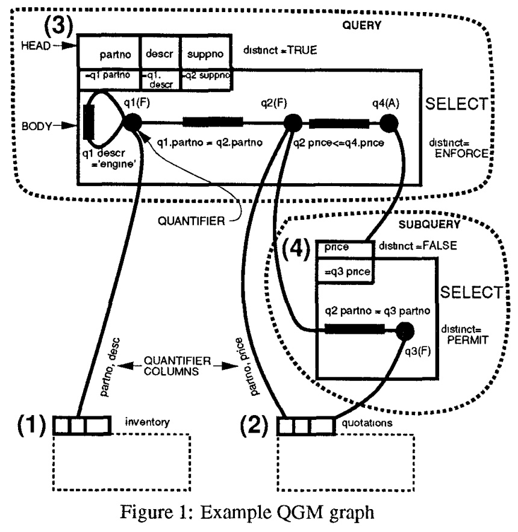

## AI论文解读 | Extensible/Rule Based Query Rewrite Optimization In Starburst
        
### 作者        
digoal        
        
### 日期        
2025-09-30       
        
### 标签        
PostgreSQL , PolarDB , DuckDB , AI , 论文解读        
        
----        
        
## 背景  
      
https://dl.acm.org/doi/pdf/10.1145/141484.130294        
  
提示:          
```          
读懂《Extensible/Rule Based Query Rewrite Optimization In Starburst》这篇论文需要提前掌握哪些基础知识, 请使用中文通熟易懂的讲解这些基础知识, 可以引用论文中的图、表或使用Markdown支持的图形(text,mermaid等)增加解释性. 
  
使用中文通熟易懂的解读《Extensible/Rule Based Query Rewrite Optimization In Starburst》这篇论文, 其中的关键内容请着重讲解, 可以引用论文中的图、表或使用Markdown支持的图形(text,mermaid等)增加解释性. 
  
提取《Extensible/Rule Based Query Rewrite Optimization In Starburst》这篇论文中的重要术语, 使用中文对这些术语进行通熟易懂的讲解, 可以引用论文中的图、表或使用Markdown支持的图形(text,mermaid等)增加解释性. 
```     
  
## 1 前置知识 
  
阅读《Extensible/Rule Based Query Rewrite Optimization In Starburst》这篇论文，您需要提前掌握以下三个核心领域的基础知识。

这篇论文的核心在于介绍一种在传统数据库执行计划优化**之前**执行的、基于规则的查询**转换**过程，其目标是让原始的查询结构不再影响最终的执行效率。

---

## 1. 关系数据库基础与 SQL 语义

理解论文首先要对现代关系数据库（RDBMS）的工作方式有一个扎实的认识。

### 1.1 SQL 声明式查询与执行效率
* **声明性 (Declarative)**：用户通过 **SQL** 告诉数据库“想要什么”（结果集），而不是“如何获取”数据（执行步骤）。
* **性能差异**：论文的一个核心观点是，即使是逻辑上**等价**的两个 SQL 语句，如果表达方式不同（例如使用了复杂的子查询或视图），也可能导致执行性能相差**几个数量级** 。
    * *例如，一个看似“过程化”的查询，可能会迫使传统的优化器选择次优的执行路径* 。

### 1.2 视图与子查询
* **理解复杂结构**：论文处理的复杂查询结构主要包括 **视图（Views）** 和 **嵌套子查询（Nested Subqueries）** 。您需要了解它们在 SQL 中是如何定义的，以及在查询执行中通常是如何被处理的（例如，子查询常被执行为**嵌套循环连接**，限制了优化空间 ）。

### 1.3 重复元组的处理（Duplicates/DISTINCT）
* **语义准确性**：在 SQL 中，数据表默认是允许重复元组（Duplicates）的。正确处理 `DISTINCT`（去重）是数据库优化的难点，也正是本文重写规则（如 `SELMERGE`）能否正确执行的关键所在 。
    * *需要了解：当查询涉及 `JOIN` 或 `UNION/INTERSECT` 时，对重复元组的处理逻辑* 。

---

## 2. 查询优化理论与阶段划分

这篇论文提出了对传统查询优化流程的改进，因此需要理解传统的优化模型。

### 2.1 传统查询优化的两阶段模型
传统的优化过程通常只有**一个**阶段，即“执行计划优化”（Plan Optimization）。

| 优化阶段 | 目标/作用 |
| :--- | :--- |
| **阶段一：查询重写 (Query Rewrite)** *(论文核心)* | 优化查询**表达式**本身。将复杂的、受限的查询（如包含视图或子查询）转换为等价的、更简单的、更易于优化的形式。 |
| **阶段二：执行计划优化 (Plan Optimization)** | 优化查询**执行**。选择具体的 **存取路径 (Access Methods)**、**连接顺序 (Join Orders)** 和 **连接方法 (Join Methods)** 。 |

### 2.2 重写优化的主要目标和启发式规则
* **主要目标**：
    1.  尽可能将查询转换为**单个 `SELECT` 运算符** 。
    2.  执行自然启发式优化，例如 **谓词下推（Predicate Pushdown）** ：将过滤条件（`WHERE` 子句）尽可能早地应用到数据源上，以减少中间结果集的大小 。
* **视图合并 (View Merge) / 子查询展开 (Subquery Unnesting)**：这是重写规则最重要的工作之一（对应核心规则 `SELMERGE`），目的是消除查询块之间的限制，从而允许执行计划优化器在所有基础表之间自由选择最佳的连接顺序 。

---

## 3. Starburst 的内部模型与规则系统

这部分是理解论文中规则如何工作的关键，需要了解 Starburst 数据库系统的两个内部机制。

### 3.1 查询图模型（QGM, Query Graph Model）
QGM 是 Starburst 内部用于表示复杂 SQL 查询的抽象数据结构 。所有重写规则都直接操作这个图模型。

#### QGM 的主要组成部分：

* **Box（盒子）** ：代表一个查询块（Query Block），例如主查询、子查询或视图定义。每个 Box 都有一个 **头部（Head）** （描述输出表）和一个 **主体（Body）** （描述操作）。
* **Quantifier（量词）** ：图中的圆点（如 `q1`, `q2`），代表查询中引用的表变量（如 `FROM` 子句中的表别名）。量词有不同类型 ：
    * `F` (FROM)：来自 `FROM` 子句。
    * `E` (EXISTS/IN/SOME/ANY)：来自**存在量词**子查询 。
    * `A` (ALL)：来自**全称量词**子查询 。

#### 论文配图示例 (Figure 1)： 

  

图 1 展示了一个包含子查询的 SQL 的 QGM 表示。
* **Box (3)** 是主查询（`SELECT` 框）。
* **Box (4)** 是子查询（`SUBQUERY` 框）。
* **Quantifier (`q1`, `q2`)** 在 Box (3) 中代表表 `inventory` 和 `quotations` 。
* **连线上的标签**（如 `q1.partno = q2.partno`）代表连接谓词 。

### 3.2 基于生产规则的系统 (Production Rule Engine)
Starburst 的查询重写是通过一套**生产规则**（Production Rules）来执行的。您需要理解这种系统的运作模式：

* **规则结构**：每条规则都是一个 **“条件-动作”（Condition-Action）** 对 。
    * **条件（Condition）** ：检查 QGM 的结构是否符合某种模式（例如，一个 `SELECT` Box 正在引用另一个 `SELECT` Box）。
    * **动作（Action）** ：如果条件满足，则执行 QGM 转换（即重写查询，例如执行 **`SELMERGE`** 规则）。
* **规则依赖与触发（Rule Dependencies）** ：重写过程不是线性的，规则之间存在复杂的依赖关系。一条规则的执行（动作）可能会使得另一条规则的条件得到满足，从而触发新的转换 。

#### 论文配图示例 (Figure 2)：

  

图 2 展示了规则之间的触发交互：
* 例如，执行 **`DISTPDTO`**（Distinct Pushdown To）规则可以触发 **`SELMERGE`** 规则，最终实现视图合并 。
* 这体现了系统通过分解复杂的重写逻辑到一系列小的、可验证的规则中 。

> **总结：** 要读懂这篇论文，您需要将一个 SQL 语句视为一个 QGM 图，然后将查询重写理解为一系列由规则引擎驱动的、对这个 QGM 图的**图转换操作**，其核心目的是消除嵌套结构和谓词限制，为后续的计划优化提供最大的自由度。
  
## 2 解读论文 
  
好的，這就為您通俗易懂地解讀這篇關於 Starburst 資料庫中查詢重寫優化的經典論文。

### 論文核心思想概覽

這篇名為《Starburst 中可擴展的/基於規則的查詢重寫優化》的論文，介紹了 IBM Almaden 研究中心的 Starburst 資料庫系統中一個創新的查詢優化階段——**查詢重寫 (Query Rewrite)** 。

傳統資料庫的查詢優化，通常只有一個叫做「計畫優化 (plan optimization)」的階段 ，主要工作是決定如何最高效地執行一個查詢，比如選擇哪個索引、決定表連接的順序等 。

而 Starburst 在此之前增加了一個「查詢重寫」階段 。它的核心目標有兩個：

1.  **讓查詢更具聲明性**：使用者寫的 SQL 看似「聲明式」（告訴資料庫**想要什麼**），但有時寫法會「綁架」資料庫，迫使它選擇一個很差的執行計畫 。查詢重寫會把這種「隱含了執行步驟」的查詢，轉換成等價但更通用的形式，給後續的計畫優化器更多選擇空間 。
2.  **應用公認的優化捷徑**：有些優化方法是業界公認有效的，比如「謂詞下推 (predicate push-down)」，即儘早過濾掉不需要的數據 。查詢重寫可以更通用、更廣泛地應用這些捷徑 。

作者的信念是：**查詢重寫是現代資料庫查詢優化不可或缺的一步** 。因為它能確保，使用者用不同方式寫出的、邏輯上等價的查詢，最終都能有同樣高效的性能，性能差異甚至可以達到**數個數量級** 。

-----

### 關鍵技術一：查詢圖模型 (QGM)

為了方便地對查詢進行分析和變換，Starburst 並不直接操作 SQL 字串，而是將其轉換為一個內部資料結構——**查詢圖模型 (Query Graph Model, QGM)** 。QGM 是一種功能強大且易於管理查詢的圖形化表示方法 。

讓我們透過論文中的一個例子來理解 QGM（圖 1）。   

**查詢範例**：查詢那些報價比所有其他供應商都低的零件和供應商資訊。

```sql
SELECT DISTINCT q1.partno, q1.descr, q2.suppno
FROM inventory q1, quotations q2
WHERE q1.partno = q2.partno AND ql.descr='engine'
  AND q2.price < ALL (SELECT q3.price 
                       FROM quotations q3
                       WHERE q2.partno=q3.partno);
```

**對應的 QGM 圖**：


*（這是一個簡化的 Mermaid 圖，旨在模擬論文圖 1 的結構）*

**圖解說**：

  * **Box (方框)**：每個查詢或子查詢都表示為一個 Box 。圖中有 4 個 Box，分別代表 `inventory` 表、`quotations` 表、主查詢和子查詢 。
  * **Head 和 Body**：每個 Box 都有一個 `head` 和 `body` 。`head` 描述該 Box 輸出的數據長什麼樣（比如有哪些欄位，是否需要去重 `distinct=TRUE`）。`body` 則描述了如何計算出這些數據 。
  * **Quantifier (量詞)**：Body 中的小黑點代表「量詞」，可以理解為遍歷某個數據表的變數 。例如 `q1` 遍歷 `inventory` 表，`q4` 則代表 `ALL` 子查詢 。
  * **謂詞 (邊)**：連接量詞的邊代表了 `WHERE` 條件中的過濾和連接謂詞 。

QGM 的設計讓複雜的查詢結構一目了然，為後續基於規則的自動重寫提供了極大的便利。

-----

### 關鍵技術二：一套保證合併的重寫規則

論文的核心貢獻是提出了一套重寫規則，它們協同工作，目標是盡可能地將多個查詢塊（Box）合併成**單一的 `SELECT` 塊** 。因為單一的 `SELECT` 塊（只包含連接、過濾、投影）是傳統關聯式資料庫最擅長優化的形式，優化器可以自由地選擇連接順序和方法 。

以下是幾個關鍵的重寫規則：

#### 1\. **SELMERGE (SELECT Merge)**: 合併 SELECT 塊

這是最重要的規則，目標是將一個查詢塊（如下層 Box）合併到引用它的查詢塊（上層 Box）中 。例如，將視圖（View）的定義合併到主查詢中。

  * **優化效果**：合併後，原本被視圖割裂的表，現在可以在一個查詢裡自由地重排連接順序，從而找到更優的執行計畫 。
  * **案例（論文 Example 1）** ：一個查詢引用了一個帶有去重 (`DISTINCT`) 操作的視圖 。
      * **重寫前**：資料庫必須先完整計算視圖的結果（包含排序去重），然後再跟主查詢的表進行連接。
      * **重寫後**：通過 `SELMERGE` 規則，視圖被合併，查詢變成了一個三表連接。計畫優化器可以利用主查詢中的過濾條件 `itm.itemn > '01' AND itm.itemn < '20'` 提前過濾數據，極大地減少了計算量 。
      * **性能提升**：如論文表 3 所示，CPU 時間從 **20分34秒** 縮短到 **1.1秒**，提升了約 **1100 倍**；總耗時從 **24分19秒** 縮短到 **7.2秒**，提升了約 **200 倍** 。   

#### 2\. **EtoF (Existential to FROM)**: 將 `EXISTS/IN` 子查詢轉為 FROM 連接

這個規則將 `WHERE` 子句中的存在性子查詢（`EXISTS` 或 `IN`）轉換為等價的 `FROM` 子句中的表連接 。

  * **優化效果**：子查詢通常被當作一個固定的「篩子」，外層查詢的每一行都要用這個篩子過濾一遍，這是一種巢狀迴圈 (Nested-Loop) 的執行方式 。轉換為連接後，優化器就可以自由選擇更高效的連接演算法，如哈希連接 (Hash Join) 或合併排序連接 (Sort-Merge Join) 。
  * **案例（論文 Example 4）** ：一個 `SELECT * FROM itp WHERE itp.itemn IN (...)` 的查詢 。
      * **重寫前**：典型做法是掃描 `itp` 表，對每一行數據，都去子查詢裡檢查是否存在。
      * **重寫後**：查詢被轉換為 `SELECT DISTINCT itp.* FROM itp, itl WHERE itp.itemn = itl.itemn AND ...` 。這使得優化器可以先掃描 `itl` 表（如果它更小或有索引），再與 `itp` 表連接。
      * **性能提升**：如論文表 10 所示，CPU 時間從 **88分鐘** 縮短到 **2分42秒**，提升了約 **32 倍**；總耗時從 **91分鐘** 縮短到 **6分24秒**，提升了約 **14 倍** 。    

#### 3\. **INT2EXIST (INTERSECT to EXISTS)**: 將 `INTERSECT` 轉為 `EXISTS`

這個規則將集合交集操作 `INTERSECT` 轉換為帶有 `EXISTS` 子查詢的 `SELECT` 查詢 。

  * **優化效果**：傳統的 `INTERSECT` 實現通常需要對所有輸入數據進行排序，然後再合併，效率不高 。轉換後，可以利用前面提到的 `EtoF` 規則將其進一步變為表連接，從而可以使用更多高效的連接方法（如利用索引的巢狀迴圈連接）。
  * **案例（論文 Example 5）** ：找出兩個查詢結果的交集 。
      * **重寫後**：查詢變為一個表與另一個表的連接查詢，並進行去重 。如果連接的欄位上有索引，性能會大幅提升。
      * **性能提升**：如論文表 12 所示，CPU 時間從 **9.65秒** 縮短到 **0.42秒**，總耗時從 **13.92秒** 縮短到 **1.77秒**，性能提升顯著 。   

除了上述規則，還有一系列輔助規則，如 **`DISTPU` (Distinct Pull-up)** 用於推斷查詢結果天然就是唯一的，**`ADDKEYS` (Add Keys)** 用於在不改變語義的情況下添加主鍵以方便去重等 。這些規則相互觸發、協同工作，最終使得 `SELMERGE` 規則能夠在盡可能多的場景下被應用。論文的圖 2 展示了這些規則之間複雜的觸發關係 。   

-----

### 關鍵技術三：可擴展的規則引擎

為了管理和執行這些重寫規則，Starburst 設計了一個靈活的規則引擎 。這個引擎有幾個重要特點：

1.  **任意複雜的規則**：規則本身是用 C 語言寫的函數，可以直接操作 QGM 的內部資料結構，實現任意複雜的邏輯轉換 。
2.  **上下文機制**：引擎在執行時會維護一個「上下文」，比如當前正在分析的 Box 或 Quantifier 。這讓規則的編寫可以非常「局部化」，只需關心當前上下文，簡化了規則的設計 。
3.  **規則分類與衝突解決**：規則被分成了不同的類別（rule classes），可以為每個類別設定不同的執行策略（如按順序執行或按優先順序執行）。這在「數據驅動」的靈活性和「過程式」的可控性之間取得了很好的平衡 。
4.  **保證終止**：引擎有一個計數器，確保規則執行不會陷入死迴圈 。這也要求每條規則的執行都必須是一個原子操作，即執行完後 QGM 必須是合法且等價的 。

這個規則引擎的設計非常成功，它不僅支持了論文中提到的優化，還為後續添加更多、更複雜的優化規則（如 Magic Sets 轉換）提供了堅實的基礎，體現了 Starburst 系統「可擴展性」的核心設計目標 。

-----

### 總結

這篇論文的貢獻是開創性的：

  * 它**首次**在一個完整的關聯式資料庫系統中，系統性地、有機地融入了查詢重寫作為一個獨立的優化階段 。
  * 它提出了一套**通用且強大**的重寫規則，並證明了這些規則能帶來數量級的性能提升，解決了許多當時商業資料庫無法優化的複雜查詢。
  * 它設計了一個**靈活、可擴展**的規則引擎，不僅成功應用於查詢重寫，也為後來的資料庫系統設計提供了寶貴的經驗。

直到今天，論文中提出的許多查詢重寫思想，如子查詢解巢 (unnesting)、視圖合併等，已經成為主流資料庫優化器的標準功能。這篇論文無疑是資料庫查詢優化領域一座重要的里程碑。
  
## 3 术语 
  
这篇论文介绍的“查询重写”机制是数据库优化领域的一个重要里程碑。为了帮助您通俗易懂地理解其核心思想和实现机制，我将提取并讲解以下重要术语：

-----

## 1\. 核心概念：查询优化的两阶段论

### 1.1 查询重写 (Query Rewrite)

  * **通俗讲解：** 数据库处理用户提交的 SQL 查询时，首先进行的一项 **“化繁为简”** 的预处理工作。
  * **作用：** 用户的 SQL 语句可能写得很复杂（例如使用了多层视图或嵌套子查询），但逻辑上它们可以被改写成更简单、更“平坦”的等价形式。查询重写就是在**不改变查询结果**的前提下，将复杂的 SQL 结构转换为更容易让传统优化器找到最佳执行路径的形式。
  * **核心目标：** **提升优化空间。** 避免复杂的查询结构（如子查询）在早期就限制了后续的执行计划选择。

### 1.2 执行计划优化 (Plan Optimization)

  * **通俗讲解：** 这是传统的、主流的数据库优化阶段，发生在查询重写**之后**。
  * **作用：** 专门负责**物理执行层面**的决策。例如：
      * 决定使用哪个 **索引** 来访问数据表（存取路径）。
      * 决定多个表之间**连接 (Join)** 的**顺序**。
      * 决定使用哪种连接**算法**（例如嵌套循环连接、哈希连接）。
  * **与重写的关系：** 查询重写负责提供一个**最优的查询表达式**，而执行计划优化负责在这个表达式上找到**最优的物理执行方法**。

| 对比维度 | 查询重写 (Query Rewrite) | 执行计划优化 (Plan Optimization) |
| :--- | :--- | :--- |
| **阶段** | 先于执行计划优化 | 后于查询重写 |
| **目标** | 优化**查询表达式/结构** | 优化**物理执行路径** |
| **操作对象** | 抽象的查询图模型 (QGM) | 具体的连接顺序和访问方法 |

-----

## 2\. Starburst 的实现机制

### 2.1 查询图模型 (QGM, Query Graph Model)

  * **通俗讲解：** Starburst 数据库内部用来表示用户 SQL 语句的**抽象数据结构**。你可以把它想象成 SQL 语句的“**流程图**”。
  * **作用：** 规则引擎不能直接在 SQL 文本上操作，它需要一个统一的、结构化的表示方法。QGM 将复杂的嵌套查询分解为独立的组件，以便规则可以精确地定位和修改它们。

#### QGM 结构示例 (简化概念图)：


  * **Box（查询块）：** 图中的 `Q1`、`Q2`，代表 `SELECT`、`SUBQUERY`、`VIEW` 等。
  * **Quantifier（量词）：** 代表查询中使用的表或视图的引用。
  * **边（连接）：** 连接线代表表与表、查询块与查询块之间的连接关系或操作。

### 2.2 生产规则引擎 (Production Rule Engine)

  * **通俗讲解：** 一个自动化的“**规则执行系统**”。它就像一个数据库优化专家，遵循预设的规则对 QGM 进行反复检查和修改，直到不能再优化为止。
  * **结构：** 每条生产规则都遵循 **“条件-动作” (Condition-Action)** 的模式：
      * **条件 (Condition)：** 检查 QGM 中是否存在某种模式（例如：“发现一个主查询嵌套了一个子查询”）。
      * **动作 (Action)：** 如果条件满足，则对 QGM 执行转换（例如：“将子查询的内容合并到主查询中”）。
  * **可扩展性 (Extensibility)：** 规则引擎是**可扩展**的。数据库设计者或管理员可以根据需要添加、修改或删除规则，以适应新的查询类型或优化技巧，这也是论文标题中 **Extensible (可扩展)** 的体现。

-----

## 3\. 关键的重写转换规则

### 3.1 视图合并/子查询展开 (View Merging/Subquery Unnesting)

  * **论文核心规则：** `SELMERGE`
  * **通俗讲解：** 这是重写阶段**最重要**的转换之一。它的目标是**消除查询的嵌套限制**。
      * 想象你有一个视图 `V`，主查询 `Q` 又 `JOIN` 了 `V`。在没有合并的情况下，优化器必须先处理完 `V`，再用结果去连接 `Q`。
      * **合并后：** `V` 的定义会被直接展开、融合到主查询 `Q` 中，所有表都“平摊”出来。优化器现在可以在所有底层表之间自由地选择最佳连接顺序，从而大幅提高效率。

#### 简化示例：视图合并前后的变化

| 视图合并前 (限制连接) | 视图合并后 (优化自由) |
| :---: | :---: |
| Q: `SELECT * FROM T1 JOIN V` | Q: `SELECT * FROM T1 JOIN T2 JOIN T3` |
| V: `SELECT * FROM T2 JOIN T3` | （所有表同时考虑连接顺序） |
| **优化限制：** 必须先连接 T2 和 T3。 | **优化自由：** 可以是 (T1 JOIN T2) JOIN T3 或其他最佳顺序。 |

### 3.2 谓词下推 (Predicate Pushdown)

  * **通俗讲解：** **“尽早过滤数据”** 的原则。
  * **作用：** 将位于查询后端的过滤条件（`WHERE` 子句）向前移动，推到数据源（表）或连接操作的附近。
  * **性能提升：** 如果在读取数据时就应用过滤条件，可以大大减少需要传输、处理和存储的中间结果集大小，从而显著提升性能。

### 3.3 DISTINCT 下推 (DISTINCT Pushdown)

  * **论文核心规则：** `DISTPDTO` (Distinct Pushdown To)
  * **通俗讲解：** 对 `SELECT DISTINCT`（去重）操作进行优化。
  * **作用：** 检查能否将 `DISTINCT` 操作从查询的末尾**推到查询的更深层**（例如，推到视图内部）。在某些情况下，提前执行去重可以显著减少需要参与后续连接操作的数据量，但必须小心确保推下推后不改变查询的最终语义（即结果集是否包含重复行）。
  
## 参考        
         
https://dl.acm.org/doi/pdf/10.1145/141484.130294    
        
<b> 以上内容基于DeepSeek、Qwen、Gemini及诸多AI生成, 轻微人工调整, 感谢杭州深度求索人工智能、阿里云、Google等公司. </b>        
        
<b> AI 生成的内容请自行辨别正确性, 当然也多了些许踩坑的乐趣, 毕竟冒险是每个男人的天性.  </b>        
    
      
#### [期望 PostgreSQL|开源PolarDB 增加什么功能?](https://github.com/digoal/blog/issues/76 "269ac3d1c492e938c0191101c7238216")
  
  
#### [PolarDB 开源数据库](https://openpolardb.com/home "57258f76c37864c6e6d23383d05714ea")
  
  
#### [PolarDB 学习图谱](https://www.aliyun.com/database/openpolardb/activity "8642f60e04ed0c814bf9cb9677976bd4")
  
  
#### [PostgreSQL 解决方案集合](../201706/20170601_02.md "40cff096e9ed7122c512b35d8561d9c8")
  
  
#### [德哥 / digoal's Github - 公益是一辈子的事.](https://github.com/digoal/blog/blob/master/README.md "22709685feb7cab07d30f30387f0a9ae")
  
  
#### [About 德哥](https://github.com/digoal/blog/blob/master/me/readme.md "a37735981e7704886ffd590565582dd0")
  
  

  
