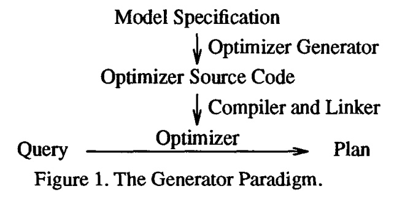
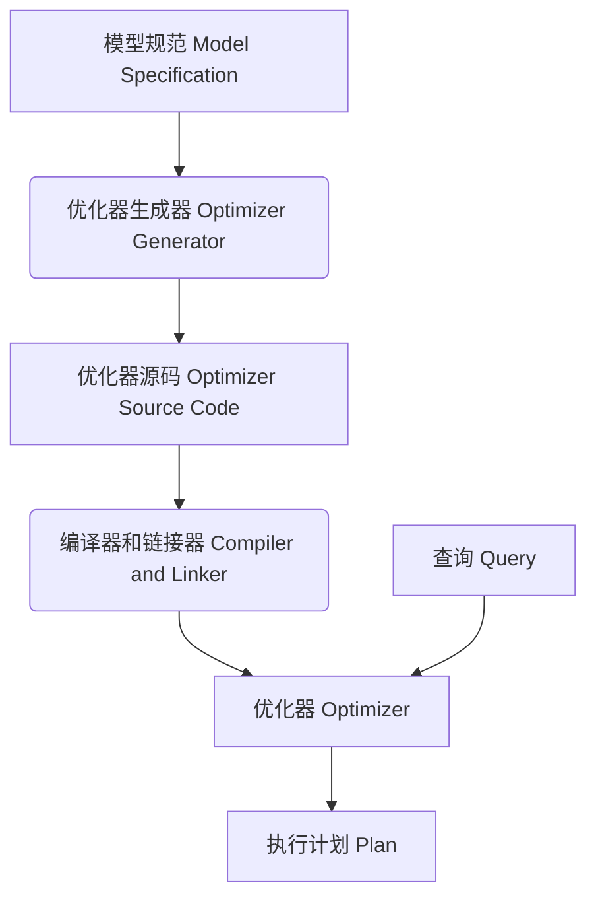
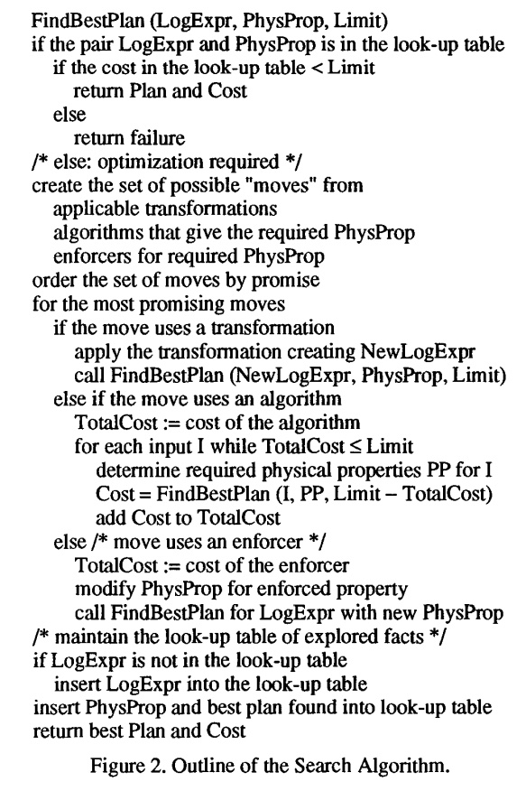
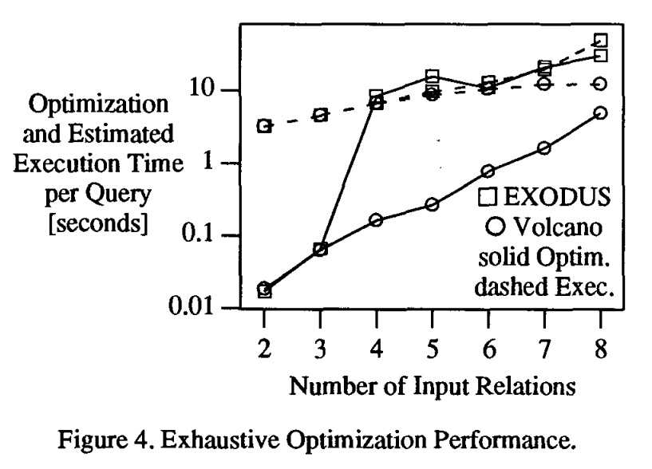
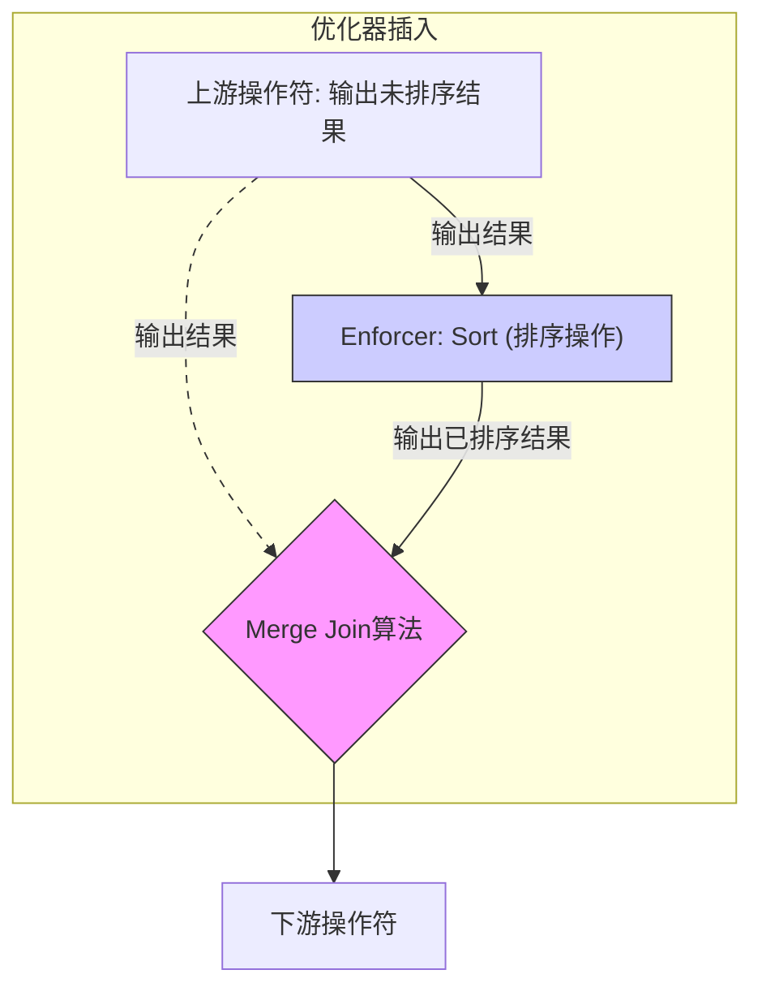

## AI论文解读 | The Volcano Optimizer Generator- Extensibility And Efficient Search
        
### 作者        
digoal        
        
### 日期        
2025-09-30       
        
### 标签        
PostgreSQL , PolarDB , DuckDB , AI , 论文解读        
        
----        
        
## 背景  
      
https://www.seas.upenn.edu/~zives/03s/cis650/P209.PDF        
  
提示:          
```          
读懂《The Volcano Optimizer Generator- Extensibility And Efficient Search》这篇论文需要提前掌握哪些基础知识, 请使用中文通熟易懂的讲解这些基础知识, 可以引用论文中的图、表或使用Markdown支持的图形(text,mermaid等)增加解释性. 
  
使用中文通熟易懂的解读《The Volcano Optimizer Generator- Extensibility And Efficient Search》这篇论文, 其中的关键内容请着重讲解, 可以引用论文中的图、表或使用Markdown支持的图形(text,mermaid等)增加解释性. 
  
提取《The Volcano Optimizer Generator- Extensibility And Efficient Search》这篇论文中的重要术语, 使用中文对这些术语进行通熟易懂的讲解, 可以引用论文中的图、表或使用Markdown支持的图形(text,mermaid等)增加解释性. 
```     
  
## 1 前置知识 
  
这是一篇关于数据库查询优化器生成工具的论文，名为《The Volcano Optimizer Generator: Extensibility and Efficient Search》。要理解这篇论文，你需要掌握以下几个核心基础概念，我会用通俗易懂的中文来为你解释：

---

## 1. 数据库查询优化（Query Optimization）

**核心概念：** 数据库管理系统（DBMS）在执行用户提交的查询（例如 SQL 语句）之前，不会直接执行用户写的语句。相反，它会先找到一个最高效的执行方案（或称“计划”）。这个寻找最佳方案的过程就叫**查询优化**。

**通俗理解：** 就像你要从A地到B地，查询优化器就是你的导航系统。它会根据实时路况（数据量、索引等）为你计算出多条可能的路线（查询执行计划），然后选出预计耗时最短的那一条。

**论文中的体现：**
* 用户输入一个 **Query** (查询) 。
* **Optimizer** (优化器) 的目标是为这个查询生成一个最优化的 **Plan** (执行计划) 。
* 优化涉及**操作符的重排**（reordering operators）和**选择实现算法**（selecting implementation algorithms）。

---

## 2. 代数（Algebra）与查询表示

**核心概念：** 数据库查询（如 `SELECT ... WHERE ...`）在优化器内部会被转换成一种 **代数表达式（Algebra Expression）** 。这种表达式由一系列操作符（如连接、投影、选择等）构成，通常表示为一棵树。

**论文中的双重代数：**
Volcano 优化器生成器引入了两种代数，这是理解论文的关键：
1.  **逻辑代数（Logical Algebra）：**
    * **作用：** 表达查询的**含义**，与具体实现无关 。
    * **操作符：** 如 `Join`（连接），`Select`（选择）。
    * **例子：** 逻辑上，两个表的连接（Join）可以写成 `R Join S`。

2.  **物理代数（Physical Algebra / Algebra of Algorithms）：**
    * **作用：** 表达查询的**具体实现算法**和物理执行细节 。
    * **操作符（算法）：** 如 `Merge-Join`（归并连接）、`Hybrid Hash Join`（混合哈希连接）、`File Scan`（文件扫描）。
    * **例子：** `R Join S` 这个逻辑操作可以由 `Merge-Join(R, S)` 或 `Hybrid Hash Join(R, S)` 来实现 。

**优化过程：** 优化本质上就是将 **逻辑代数表达式（Query）** 映射成**最优的物理代数表达式（Plan）** 。

---

## 3. 规则（Rules）机制

**核心概念：** 优化器使用一套预定义的**规则**来进行查询转换和算法选择。

**论文中的两种规则：**
1.  **转换规则（Transformation Rules）：**
    * **目的：** 在**逻辑代数**层面，将一个表达式转换为**等价**的另一个表达式 。
    * **例子：** 关系代数中的**连接交换律**：`A Join B` 等价于 `B Join A` 。
    * **作用：** 改变操作符的顺序或结构，为后续的物理实现提供更多选择。

2.  **实现规则（Implementation Rules）：**
    * **目的：** 将一个**逻辑操作符**映射到具体的**物理算法** 。
    * **例子：** 逻辑上的 `Join` 操作可以由物理上的 `Merge-Join` 或 `Hybrid Hash Join` 来实现 。
    * **作用：** 确定执行计划中的具体算法。

---

## 4. 属性（Properties）与 Enforcers

**核心概念：** 优化器需要考虑中间结果的各种特征，这些特征就是“属性”。

**论文中的两种属性：**
1.  **逻辑属性（Logical Properties）：**
    * **作用：** 描述表达式结果的**逻辑特征**，与算法无关 。
    * **例子：** 结果的 **模式（Schema）** 、预期的**大小（Expected Size）** 。

2.  **物理属性（Physical Properties）：**
    * **作用：** 描述表达式结果的**物理特征**，依赖于具体的算法 。
    * **例子：** 结果集的 **排序顺序（Sort Order）** 、 **分区状态（Partitioning）** 、**压缩状态（Compression Status）** 。

**Enforcers（强制执行器）：**
* **概念：** 物理代数中的一种特殊操作符 。
* **作用：** 它们的逻辑目的不是操作数据（如Join），而是**强制满足**下游算法所需的**物理属性** 。
* **例子：** `Sort`（排序）操作符。如果一个算法需要一个已排序的输入，但上游没有提供，优化器可以插入一个 `Sort` **Enforcer**来满足这个要求 。

---

## 5. 成本模型（Cost Model）与动态规划（Dynamic Programming）

**核心概念：** 优化器必须有一套机制来评估和比较不同执行计划的优劣。

**成本（Cost）：**
* **作用：** 衡量一个查询计划的“好坏”。
* **特点：** 在 Volcano 中，成本被抽象为一个 **抽象数据类型（ADT）** ，可以是一个简单的数字（如估计的耗时），也可以是一个结构（如 CPU 时间和 I/O 计数）。

**动态规划（Dynamic Programming, DP）：**
* **作用：** 一种高效的搜索算法，用于找到最优解 。
* **原理：** 通过**存储和重用子问题的最优解**来避免重复计算 。
* **在优化中的应用：** 在查询优化中，它用于确保：如果一个大的查询计划是最优的，那么它的任何一个子查询（subexpression）也必须是最优的 。Volcano 使用的是一种叫 **“定向动态规划（directed dynamic programming）”** 的算法，它结合了 **自顶向下（top-down）** 、 **目标导向（goal-oriented）** 的搜索策略和动态规划 。

---

## 6. 生成器范式（Generator Paradigm）

**核心概念：** Volcano 不是一个优化器，而是一个**优化器生成器**。它能根据输入，自动生成一个完整的优化器程序。

**生成过程（图 1. The Generator Paradigm）:**

  

1.  **Model Specification（模型规格）：** 优化器实现者提供关于数据模型、逻辑代数、物理代数和优化规则的详细描述 。
2.  **Optimizer Generator（优化器生成器）：** Volcano 工具读取这些规格，并将其翻译成优化器的源代码 。
3.  **Optimizer Source Code（优化器源代码）：** 翻译后的代码 。
4.  **Compiler and Linker（编译器和链接器）：** 将生成的代码以及其他数据库管理系统软件（如成本函数、执行引擎）编译链接在一起 。
5.  **Optimizer（优化器）：** 最终生成的、可运行的优化器程序 。
6.  **运行时：** 当一个 **Query**（查询）进入时，**Optimizer**（优化器）运行并生成一个 **Plan**（执行计划）。

这个范式使得数据库开发者无需从零开始编写复杂的搜索算法，只需要提供数据模型相关的规则和函数，就能快速构建一个新的优化器 。
  
## 2 解读论文 
  
好的，我们来一起通俗易懂地解读这篇数据库领域的经典论文——《The Volcano Optimizer Generator: Extensibility and Efficient Search》。

这篇论文介绍了一个名为 “Volcano” 的**优化器生成器**。你可以把它理解成一个“制造工厂”，它的产品不是普通的商品，而是数据库系统中最核心、最复杂的部分之一——**查询优化器**。

查询优化器的任务是，当用户输入一条查询指令（比如 SQL 语句）后，它能聪明地找出执行这条查询的成百上千种方式中，成本最低、速度最快的那一种方案（即“执行计划” Plan）。Volcano 的目标就是让构建一个这样聪明的优化器变得更简单、更灵活，并且效率极高。

-----

### 核心思想：优化器“工厂”模式

在了解 Volcano 的具体设计之前，我们先通过论文中的图1来理解它的工作模式，即“生成器范式”（The Generator Paradigm）。   



  * **模型规范 (Model Specification)**: 这是数据库开发者编写的“图纸”。图纸上定义了数据库的数据模型、有哪些操作（比如连接、选择、排序）、执行这些操作的具体算法以及优化规则等。
  * **优化器生成器 (Optimizer Generator)**: 这就是 Volcano “工厂”。它读取这份图纸。
  * **优化器源码 (Optimizer Source Code)**: 工厂根据图纸，自动生成优化器的 C 语言源代码。
  * **编译器和链接器 (Compiler and Linker)** : 将生成的源代码编译成一个可执行的优化器模块 。
  * **优化器 (Optimizer)** : 这就是最终的产品。当数据库系统运行时，用户输入一条**查询 (Query)** ，这个优化器就会接收它，并经过高效的搜索和计算，最终输出一个最优的**执行计划 (Plan)** 。

这种模式最大的好处是**可扩展性 (Extensibility)**。当需要支持新的数据类型、新的算法，或者新的优化规则时，开发者只需要修改“图纸”（模型规范），然后让 Volcano 工厂重新生成一遍优化器即可，而无需从头手动编写整个复杂的搜索算法 。

-----

### 关键设计一：逻辑与物理代数的清晰分离

Volcano 的一个创举是严格区分了两种“代数”：

1.  **逻辑代数 (Logical Algebra)**: 描述 **“做什么”** 。它由一些概念性的操作符组成，比如“连接两个表”、“从表中选择符合条件的行”。这些操作符只关心数据的逻辑关系，不关心具体如何实现 。
2.  **物理代数 (Physical Algebra)**: 描述 **“怎么做”** 。它由具体的执行算法组成，比如“使用哈希连接算法”、“使用归并排序连接算法”、“通过索引扫描来选择行” 。

**优化的过程，本质上就是把一个逻辑代数表达式（用户查询），转换成一个与之等价且成本最低的物理代数表达式（执行计划）** 。

这种分离带来了巨大的灵活性。开发者可以独立地添加新的逻辑操作，或者为已有的逻辑操作发明新的物理实现算法，两者互不干扰 。

-----

### 关键设计二：强大而高效的搜索算法

找到了所有可能的执行计划后，如何快速从中选出最好的一个？这是优化器面临的核心挑战。Volcano 的搜索算法是其成功的关键，论文称之为 **“有向动态规划” (Directed Dynamic Programming)** 。

它巧妙地结合了三种技术：

1.  **动态规划 (Dynamic Programming)**: 这是借鉴自经典 System R 优化器的思想 。基本原理是“分而治之”并“记住结果”。在寻找一个复杂查询（例如 `A join B join C`）的最优计划时，它会先找出所有子查询（如 `A join B`）的最优计划并把结果缓存起来。当计算更复杂的计划时，可以直接利用这些已存的“最优子计划”，避免了大量重复计算 。

2.  **目标导向的搜索 (Goal-Oriented Search)**: 这是 Volcano 对传统动态规划的重大改进。传统的优化器是“自底向上”的，会盲目地生成所有可能的子计划。而 Volcano 是 **“自顶向下”** 的 ，它带着一个明确的“目标”去搜索。这个目标就是 **物理属性 (Physical Properties)** ，例如“我需要一个按 `user_id` 排序的结果” 。

      * 这个目标会指导整个搜索过程。比如，为了得到一个排序的连接结果，优化器会优先考虑那些能直接产生有序结果的算法（如归并连接 Merge-Join）。
      * 它只会探索那些 **“有希望”** 满足最终目标的子计划，从而避免了在无用路径上的搜索，大大提升了效率 。

3.  **分支界定剪枝 (Branch-and-Bound Pruning)**: 这是一种经典的优化技巧。一旦优化器找到了一个完整的执行计划，它就算出了一个成本（比如 100 毫秒）。这个成本就成了一个“上限” (Limit) 。在后续的搜索中，如果某个正在构建的“半成品”计划的成本已经超过了 100 毫秒，那么这条路就没必要再走下去了，可以直接“剪掉”，从而节省了大量的搜索时间 。

论文中的图2简要勾勒了这个名为 `FindBestPlan` 的核心搜索算法流程：

  

*图2：搜索算法纲要* 

**算法流程简介**：

1.  **查表**：首先检查备忘录（一个哈希表），看看“针对某个逻辑表达式，要求某个物理属性”的这个任务之前是否已完成。如果已找到最优计划并且其成本低于当前上限，直接返回结果 。
2.  **生成“可选动作”** ：如果没有现成结果，就找出所有可能的实现路径 ：
      * **应用转换规则**：比如把 `(A join B) join C` 变成 `A join (B join C)` 。
      * **应用算法**：看看哪个物理算法能满足要求的物理属性（如 Merge-Join 可以产生排序结果） 。
      * **应用“强制转换器” (Enforcer)**：如果没有任何算法能直接满足属性，就使用一个“转换”操作，比如先用 Hash-Join（结果无序），再加一个明确的 Sort 操作来满足排序要求 。
3.  **递归探索**：对每个“可选动作”进行成本估算，并递归调用 `FindBestPlan` 来优化其输入子节点。在递归时，会把当前成本从上限中减去，实现分支界定剪枝 。
4.  **记录结果**：将本次找到的最优计划和成本存入备忘录，供后续使用 。

-----

### 性能对比：远超前代的飞跃

论文最有说服力的部分，就是将 Volcano 与其前身——**EXODUS 优化器生成器**进行了性能对比。

  

*图4：穷举优化性能对比* 

上图（图4）的结果一目了然：

  * **优化时间 (实线)**: Y 轴是对数坐标，意味着两条线之间的差距是巨大的。对于一个8个关系的复杂查询，Volcano 的优化时间（圆点 O）比 EXODUS（方块 □）快了**一个数量级**（约10倍） 。EXODUS 的性能在查询复杂度增加后迅速恶化，因为它在无效的搜索和重复计算上浪费了太多时间 。
  * **计划质量 (虚线)**: 对于复杂查询，Volcano 找到的执行计划（虚线 O）的预估执行时间也明显优于 EXODUS（虚线 □） 。这得益于 Volcano 对物理属性（如排序顺序）更系统、更充分的探索和利用。

**总而言之，Volcano 不仅生成优化器的效率更高，生成的优化器本身也更聪明，能找到更好的执行计划** 。

-----

### 总结

《The Volcano Optimizer Generator》这篇论文的贡献是里程碑式的，它不仅提出了一个高度可扩展的优化器构建框架，更重要的是，它设计了一套非常高效且智能的搜索算法——**有向动态规划**。

通过**逻辑与物理代数的分离**、**目标导向的搜索策略**以及**高效的动态规划与剪枝技术**，Volcano 解决了一直以来困扰可扩展数据库的难题：如何在提供灵活性的同时，保证极致的查询优化性能。它的思想深刻影响了后续许多商业和开源数据库系统的查询优化器设计。
  
## 3 术语 
  
这篇论文的核心在于介绍一种革命性的方法来构建数据库优化器——**优化器生成器 (Optimizer Generator)**。以下是理解这篇论文最重要的术语及其通俗解释：

-----

## 1\. 核心架构与设计理念

### 优化器生成器 (Optimizer Generator)

  * **英文原文：** Optimizer Generator
  * **通俗讲解：** Volcano 本身不是一个查询优化器，而是一个 **制造优化器的“工厂”** 。
  * **作用：** 数据库设计者只需提供关于数据模型、操作符和优化规则的**规格说明书**，Volcano 就能自动生成一个完整的、可运行的优化器程序。这极大地简化了开发新数据库或扩展现有数据库的工作。

### 可扩展性 (Extensibility)

  * **英文原文：** Extensibility
  * **通俗讲解：** 很容易增加新的功能或适应新的环境。
  * **体现：** 在传统优化器中，如果你想支持一种新的连接算法（比如支持分布式连接），可能需要修改核心代码。但在 Volcano 生成的优化器中，你只需添加一条新的**规则**和一个新的**物理操作符**，优化器就能自动识别并使用它。

-----

## 2\. 查询表示与转换

查询优化过程涉及两种不同层次的代数表示。

### 逻辑代数 (Logical Algebra)

  * **英文原文：** Logical Algebra
  * **通俗讲解：** 描述一个查询 **“要做什么”** 。它只关心查询的 **语义（含义）** ，不关心具体如何执行。
  * **操作符示例：** $\text{Join}$ （连接）、 $\text{Select}$ （选择）、 $\text{Project}$ （投影）。
  * **例子：** “把表 A 和表 B 连接起来”，这只是一个**逻辑要求**。

### 物理代数 / 算法代数 (Physical Algebra / Algebra of Algorithms)

  * **英文原文：** Physical Algebra / Algebra of Algorithms
  * **通俗讲解：** 描述一个查询 **“如何执行”** 。它关心的是实现逻辑操作的具体 **算法** 和物理细节。
  * **操作符示例：** $\text{Hash Join}$（哈希连接）、 $\text{Merge Join}$（归并连接）、 $\text{File Scan}$（文件扫描）。
  * **例子：** 实现“把表 A 和表 B 连接起来”这个逻辑要求，可以选择用 $\text{Hash Join}$ 或 $\text{Merge Join}$。

-----

## 3\. 优化规则与机制

规则是驱动优化的核心“引擎”。

### 转换规则 (Transformation Rules)

  * **英文原文：** Transformation Rules
  * **通俗讲解：** **保持逻辑等价**的前提下，将一个查询表达式**转换为**另一个不同结构（但结果相同）的表达式。
  * **目的：** 为优化器寻找最优执行路径创造更多的可能性。
  * **例子：** 关系代数中的**连接交换律** ( $\text{A Join B} \Leftrightarrow \text{B Join A}$ )，以及**连接顺序重排**。

### 实现规则 (Implementation Rules)

  * **英文原文：** Implementation Rules
  * **通俗讲解：** 将一个**逻辑操作符**映射到**一个或多个物理算法**。这是从“做什么”到“怎么做”的关键一步。
  * **例子：** 逻辑 $\text{Join} \Rightarrow \text{Hash Join}$ 或 逻辑 $\text{Join} \Rightarrow \text{Merge Join}$。

-----

## 4\. 属性与执行要求

### 物理属性 (Physical Properties)

  * **英文原文：** Physical Properties
  * **通俗讲解：** 执行计划中**中间结果集**所具有的**物理特征**。一个物理操作符可能要求它的输入数据具备某些物理属性。
  * **重要性：** 它是优化搜索的重要限制条件和成本来源。
  * **示例：** **排序顺序** ( $\text{Sort Order}$ )、**数据分区状态** ( $\text{Partitioning}$ )。
  * **举例：** $\text{Merge Join}$ 算法要求它的两个输入表必须是**已排序**的。 $\text{Hash Join}$ 则没有这个要求。

### 强制执行器 (Enforcer)

  * **英文原文：** Enforcer
  * **通俗讲解：** 一种特殊的物理操作符，它被插入到执行计划中，**专门用于满足下游操作符所需的物理属性**。
  * **功能：** 它本身不改变数据的逻辑内容，只是改变其物理表示（如排序）。
  * **示例：** $\text{Sort}$（排序）操作符。
  * **场景：** 如果 $\text{Merge Join}$ 需要一个已排序的输入，但上游操作符提供的是未排序的结果，优化器就会插入一个 $\text{Sort}$ **Enforcer**。

**【Enforcer 示例图】**



-----

## 5\. 搜索策略

### 成本模型 (Cost Model)

  * **英文原文：** Cost Model
  * **通俗讲解：** 用于**量化评估**一个查询执行计划“好”或“坏”的数学模型。
  * **作用：** 优化器通过计算不同计划的成本，来决定哪个是 **最优的（Lowest Cost）** 。
  * **内容：** 可以是简单的估计 I/O 次数，也可以是更复杂的、考虑 CPU 时间、网络延迟等多种因素的抽象数据类型。

### 动态规划 (Dynamic Programming, DP)

  * **英文原文：** Dynamic Programming
  * **通俗讲解：** 一种高效的搜索算法。其核心思想是： **“最优解由最优子解构成”** 。
  * **应用：** 优化器不会重复计算同一个子查询的最佳执行计划。它会把已找到的最佳子计划及其成本 **存储起来（Memoization/备忘录化）** ，需要时直接调用。

### 目标导向搜索 (Goal-Directed Search)

  * **英文原文：** Goal-Directed Search
  * **通俗讲解：** 一种搜索策略，优化器在搜索时是**有目的性**的。
  * **特点：** 它不是盲目地生成所有可能的计划，而是根据当前操作符（目标）所需的**物理属性**，**有针对性地**对输入（子表达式）进行优化。例如，如果目标需要一个**已排序**的输入，它会优先寻找能提供已排序结果的子计划，或者考虑插入一个 $\text{Sort}$ **Enforcer**。

Volcano 的高效性正来源于将 **动态规划** 的最优性保证，与 **目标导向搜索** 和 **分支限界（Branch-and-Bound）** 的裁剪能力结合起来，从而在庞大的搜索空间中快速找到最优解。
  
## 参考        
         
https://www.seas.upenn.edu/~zives/03s/cis650/P209.PDF    
        
<b> 以上内容基于DeepSeek、Qwen、Gemini及诸多AI生成, 轻微人工调整, 感谢杭州深度求索人工智能、阿里云、Google等公司. </b>        
        
<b> AI 生成的内容请自行辨别正确性, 当然也多了些许踩坑的乐趣, 毕竟冒险是每个男人的天性.  </b>        
    
      
#### [期望 PostgreSQL|开源PolarDB 增加什么功能?](https://github.com/digoal/blog/issues/76 "269ac3d1c492e938c0191101c7238216")
  
  
#### [PolarDB 开源数据库](https://openpolardb.com/home "57258f76c37864c6e6d23383d05714ea")
  
  
#### [PolarDB 学习图谱](https://www.aliyun.com/database/openpolardb/activity "8642f60e04ed0c814bf9cb9677976bd4")
  
  
#### [PostgreSQL 解决方案集合](../201706/20170601_02.md "40cff096e9ed7122c512b35d8561d9c8")
  
  
#### [德哥 / digoal's Github - 公益是一辈子的事.](https://github.com/digoal/blog/blob/master/README.md "22709685feb7cab07d30f30387f0a9ae")
  
  
#### [About 德哥](https://github.com/digoal/blog/blob/master/me/readme.md "a37735981e7704886ffd590565582dd0")
  
  

  
