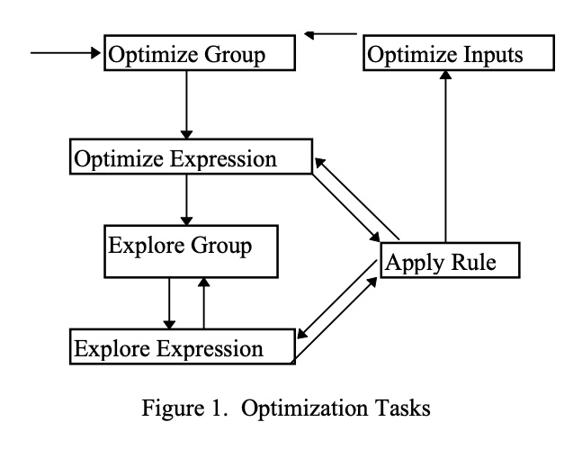
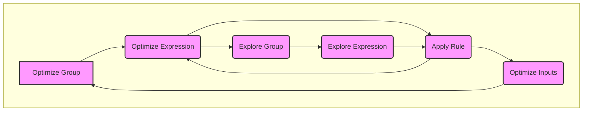
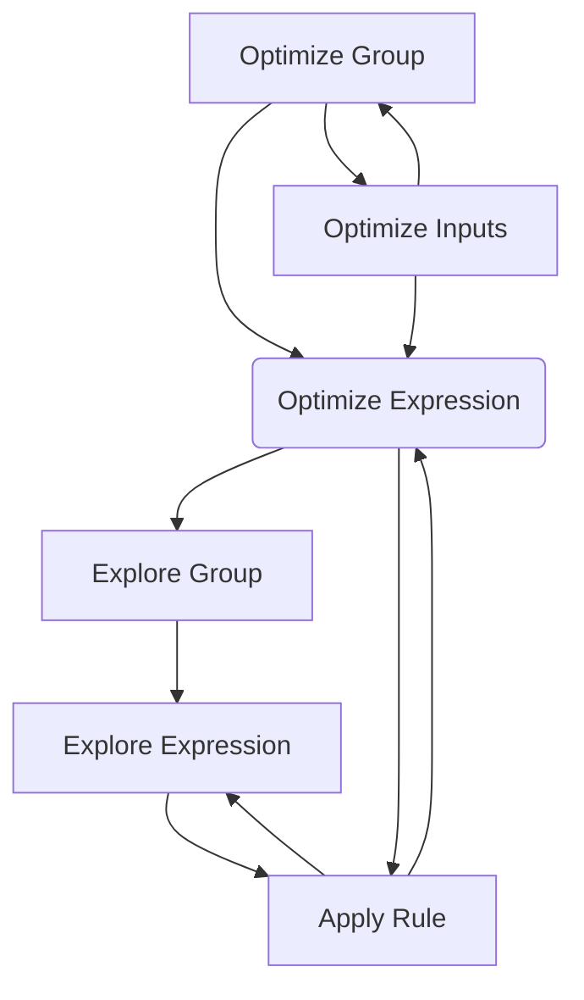

## AI论文解读 | The Cascades Framework for Query Optimization
        
### 作者        
digoal        
        
### 日期        
2025-10-01       
        
### 标签        
PostgreSQL , PolarDB , DuckDB , AI , 论文解读        
        
----        
        
## 背景  
      
https://www.csd.uoc.gr/~hy460/pdf/CascadesFrameworkForQueryOptimization.pdf        
  
提示:          
```          
读懂《The Cascades Framework for Query Optimization》这篇论文需要提前掌握哪些基础知识, 请使用中文通熟易懂的讲解这些基础知识, 可以引用论文中的图、表或使用Markdown支持的图形(text,mermaid等)增加解释性. 
  
使用中文通熟易懂的解读《The Cascades Framework for Query Optimization》这篇论文, 其中的关键内容请着重讲解, 可以引用论文中的图、表或使用Markdown支持的图形(text,mermaid等)增加解释性. 
  
提取《The Cascades Framework for Query Optimization》这篇论文中的重要术语, 使用中文对这些术语进行通熟易懂的讲解, 可以引用论文中的图、表或使用Markdown支持的图形(text,mermaid等)增加解释性. 
```     
  
## 1 前置知识 
  
阅读《The Cascades Framework for Query Optimization》这篇论文，您需要对**数据库系统**、 **查询处理（Query Processing）** 、以及 **查询优化（Query Optimization）** 的基本概念有清晰的理解。

下面将使用通俗易懂的中文，并引用论文中的概念，为您讲解这些基础知识。

---

## 1. 数据库基础 (Database Fundamentals)

首先，您需要了解数据库管理系统（DBMS）是如何运作的。

* **数据库查询 (Database Query):** 简单来说，就是向数据库提出的一个请求，通常用 **SQL** 语言表达，目的是获取或修改数据。
* **查询处理 (Query Processing):** 这是将用户提交的查询语句（如 `SELECT * FROM Orders WHERE ...`）转化为数据库可以执行的步骤集合（即**执行计划**）的整个过程。
* **查询执行计划 (Query Execution Plan):** 想象一下，您想从家到超市，有步行、骑车、开车等多种方式，每种方式都有不同的路线和耗时。一个查询执行计划就是完成一个查询任务的**具体步骤和操作顺序**，它指定了如何访问数据（如全表扫描还是索引查找）、如何连接表（如嵌套循环连接、哈希连接）等等。

## 2. 查询优化器的核心任务 (The Core Mission of the Query Optimizer)

查询优化器是数据库的心脏之一，它的任务是为同一个查询找到**最优的执行计划**。

* **等价逻辑表达式 (Equivalent Logical Expressions):** 一个查询有很多种逻辑上等价的表达方式。例如，两个表的连接顺序（A Join B 和 B Join A）或者谓词（`WHERE` 子句）的放置位置（先过滤再连接，还是先连接再过滤）都可以改变，但结果不变。优化器的工作就是**枚举**这些等价的表达形式。
* **逻辑操作符 vs. 物理操作符 (Logical vs. Physical Operators):**
    * **逻辑操作符：** 描述“要做什么”的操作。例如，一个**Join**（连接）操作符，它只描述了两个表需要连接起来。
    * **物理操作符（或算法）：** 描述“如何去做”的操作。例如，实现 Join 这个逻辑操作，可以用**Nested Loops Join**（嵌套循环连接）、**Hash Join**（哈希连接）或**Sort-Merge Join**（排序合并连接）等不同的物理操作符。
    * **Cascades的特点：** 论文提到一个改进，即一个操作符可以**同时是逻辑的和物理的**，例如用于谓词（predicates）的操作符 。这意味着一些简单的操作（如单记录的谓词过滤）可能不需要区分逻辑和物理实现。
* **成本估算 (Cost Estimation):** 不同的执行计划有不同的成本（如执行时间、I/O 次数、CPU 消耗）。优化器会为每个候选计划估算一个成本，并选择**成本最低**的那个计划。论文中提到了 **`COST`** 类，用于封装执行成本 。

## 3. 动态规划与记忆化 (Dynamic Programming and Memorization)

Cascades 框架继承了其前辈（EXODUS 和 Volcano）的核心优化技术：

* **动态规划 (Dynamic Programming):** 优化器不会为整个复杂的查询树重新计算每个子查询的最佳计划。它通过**自底向上**的方式，先找到所有子查询的最优解，然后利用这些最优解来构建更大查询的最优解。
* **记忆化/备忘录 (Memorization - The "Memo" Structure):** 优化器会将已经计算过的**等价逻辑表达式集合**以及它们的**最佳计划**存储在一个内部结构中，这被称为 **"Memo" 结构** 。如果优化器再次遇到一个已经优化过的子查询，它会直接从 Memo 中取出结果，避免重复计算 。

## 4. Cascades框架的关键概念 (Key Concepts of the Cascades Framework)

Cascades 与 Volcano 最大的区别在于搜索策略的控制和动态化。

### 4.1. 优化任务 (Optimization Tasks)

Cascades 将优化过程分解为一系列面向对象的 **“任务”（Tasks）** 。这些任务对象被收集在一个 **任务结构（Task Structure）** 中，目前的实现是 LIFO 栈（后进先出栈），但设计上可以支持更灵活的结构甚至并行搜索 。

任务的主要类型包括：

| 任务类型 | 任务目标 | 核心作用 |
| :--- | :--- | :--- |
| **Optimize Group** | 为等价表达式组找到最佳物理计划 。 | 负责实现**动态规划**和**记忆化**，避免重复优化相同目标 。 |
| **Optimize Expression** | 为单个表达式找到最佳物理计划 。 | 负责**传递性地应用规则**（转换规则和实现规则）。 |
| **Explore Group/Expression** | **仅按需**生成与特定 **模式（Pattern）** 匹配的等价逻辑表达式 。 | 这是 Cascades 与 Volcano 的主要区别。它避免了像 Volcano 那样在优化前**穷举**所有逻辑表达式，从而更有效率 。 |
| **Apply Rule** | 实际应用一条规则，创建新的表达式 。 | 负责绑定规则模式、创建替代表达式、将其整合到 Memo 中，并触发后续优化或探索任务 。 |
| **Optimize Inputs** | 对一个物理操作符的输入子树进行优化，并计算成本 。 | **唯一一个会多次活动的任务** 。它在优化一个物理计划时，会按顺序优化每个输入，并利用已知的成本进行 **剪枝（Pruning）** 。 |

论文中图 1 展示了这些任务之间的调用关系：

   
  
$$\text{Figure 1. Optimization Tasks}$$

$$\text{Optimize Group} \rightarrow \text{Optimize Expression} \rightarrow \text{Explore Group} \rightleftharpoons \text{Explore Expression} \rightleftharpoons \text{Apply Rule}$$

$$\text{Optimize Group} \leftarrow \text{Optimize Inputs}$$

$$\text{Optimize Expression} \leftarrow \text{Optimize Inputs}$$

$$\text{Apply Rule} \rightarrow \text{Optimize Expression}$$

### 4.2. 规则 (Rules)

规则是优化器中表达优化知识的核心，它定义了如何将一种表达式形式（**antecedent，即"before"-pattern**）转换成另一种形式（**consequent，即替代 substitute**）。

* **转换规则 (Transformation Rules):** 将一个逻辑表达式变成另一个等价的逻辑表达式（如 Join 的顺序交换）。
* **实现规则 (Implementation Rules):** 将一个逻辑表达式变成一个物理执行计划（如将 Join 逻辑操作变成 Hash Join 物理操作）。
* **规则作为对象 (Rules as Objects):** 在 Cascades 中，规则本身是对象，可以在运行时创建 。
* **Promise 和 Condition 函数 (Promise and Condition Functions):** 这两个函数为优化过程提供了 **指导（Guidance）** ，以控制搜索空间 。
    * **Promise (承诺) 函数:** 在探索开始前调用，评估一条规则**可能**有多大用处，返回一个实数值（如 0 到 1.0），用于对规则进行排序或排除 。
    * **Condition (条件) 函数:** 在模式匹配成功后调用，执行更精确的检查，返回一个布尔值（是或否），以确定规则是否**真正**适用 。

### 4.3. Enforcers (执行器/强制器)

* **Enforcers（强制器/执行器）:** 是一些特殊的物理操作符，用于保证或“强制”所需的**物理属性** 。最典型的例子是 **Sort**（排序）操作 。
* **Cascades的改进：** 在 Volcano 中，Enforcers 是特殊的操作符，不出现在规则中 。在 Cascades 中，Enforcers（如 Sort）是**常规的操作符**，并通过**显式的规则**（Enforcer Rules）插入到执行计划中 。例如，一个 Enforcer Rule 会在需要排序的连接（如 Merge-Join）输入端插入一个 Sort 操作 。
  
## 2 解读论文 
  
好的，我们来一起通俗易懂地解读这篇数据库查询优化领域的经典论文——《The Cascades Framework for Query Optimization》。

这篇论文由 Goetz Graefe 撰写，介绍了一个名为 **Cascades** 的、全新的、可扩展的查询优化器框架。这个框架的设计旨在解决其前辈 EXODUS 和 Volcano 优化器生成器中的诸多不足 ，并最终成为了微软 SQL Server 和 Tandem NonStop SQL 等商业数据库产品的优化器基础 。

简单来说，查询优化的目标就是把用户写的 SQL 查询语句，转换成一个数据库内部执行起来最高效的计划（Plan）。Cascades 框架不做具体的优化决策，而是提供一套强大的规则和算法引擎，让数据库开发者（论文中称为 DBI）可以方便地定义自己的算子、规则和成本模型，来构建一个高性能的优化器。

-----

### 核心思想：为什么需要 Cascades？

在 Cascades 之前，作者已经开发了 EXODUS 和 Volcano 这两个优化器生成器 。它们虽然引入了基于规则的优化、逻辑与物理算子分离等重要概念，但在实际应用中暴露出了一些问题 。例如，对查询中谓词（Predicate，如 `WHERE a > 10`）的处理非常笨拙 ，规则的表达能力有限，并且搜索策略不够灵活。

Cascades 的目标就是克服这些缺点，它继承了动态规划（Dynamic Programming）和备忘录（Memoization）的核心思想 ，并引入了以下几个关键性的创新和改进。

### 关键内容精讲

#### 1\. 核心搜索算法：基于“任务”的灵活调度

Cascades 的优化过程不再是写死的函数调用流程，而是由一系列“任务”（Tasks）驱动的 。每个待办的优化工作，比如“优化一个表达式”或“应用一条规则”，都会被封装成一个任务对象 。

这样做最大的好处是**灵活性**。所有任务都放在一个栈里（LIFO，后进先出），但理论上可以随时对任务进行重排序，从而实现非常灵活的启发式搜索 。

论文的图1清晰地展示了这些任务之间的关系：    



  * **Optimize Group (优化组)** : 核心入口。一个“组”代表了一堆逻辑上等价的查询表达式（比如 `A join B` 和 `B join A` 就在同一个组里）。这个任务的目标就是为整个组找到成本最低的执行计划 。这里会进行**动态规划**，如果这个组在同样的目标下（如成本上限、物理属性要求）已经被优化过，就直接返回之前的结果，避免重复工作 。
  * **Explore Group (探索组)** : 这是 Cascades 相较于 Volcano 的一个重大改进 。Volcano 会在优化前，把所有可能的逻辑等价表达式全部生成出来，非常耗时 。而 Cascades 则是**按需探索**（on demand） 。只有当一条规则需要某个特定模式的表达式作为输入时，才会触发 Explore 任务去生成匹配该模式的等价表达式 。这大大减少了不必要的计算。
  * **Apply Rule (应用规则)** : 这是实际执行“变换”的地方。当找到一个匹配规则模式的表达式后，这个任务就会应用规则，生成一个新的表达式（可能是逻辑的，也可能是物理的执行计划） 。
  * **Optimize Inputs (优化输入)** : 当生成一个物理执行计划（比如嵌套循环连接）后，需要递归地去为它的子节点（输入）寻找最优计划 。这个任务负责协调这个过程，并计算总成本 。

#### 2\. 数据结构与接口的革新

Cascades 非常注重框架的**可扩展性**，为数据库开发者（DBI）提供了一套清晰、抽象的 C++ 接口 。

  * **算子（Operators）不再严格区分逻辑与物理**

      * 在之前的系统中，逻辑算子（如 `Join`）和物理算子（如 `Hash Join`, `Merge Join`）是完全分开的 。
      * Cascades 打破了这个限制，一个算子可以**同时是逻辑和物理的** 。这有什么用呢？最典型的例子就是谓词（Predicate）。一个简单的过滤条件，在逻辑层面它是一个表达式，在物理执行时它也是一个可以直接执行的操作。这种设计大大简化了对谓词等元素的操作和规则定义 。

  * **规则（Rules）本身就是对象**

      * 规则不再是写死的代码或配置文件，而是可以动态创建和管理的对象 。
      * **Enforcer Rules (强制规则)**: 这是个非常优雅的设计。比如，一个归并连接（Merge Join）需要它的两个输入都是排好序的。在 Volcano 中，这是特殊逻辑。但在 Cascades 中，这可以通过一条普通的“强制规则”来实现：如果需要排序属性，就插入一个 `Sort` 算子 。这使得优化器逻辑更加统一和干净 。
      * **Function Rules (函数规则)**: 对于一些用声明式规则难以表达的复杂转换（例如，把一个复杂的 `AND/OR` 谓词拆分成多个部分），Cascades 允许 DBI 直接提供一个函数来完成这个转换 。这给予了开发者极大的灵活性 。

#### 3\. 搜索过程的引导与控制 (Guided Search)

虽然 Cascades 可以进行穷尽搜索以保证找到最优解，但穷举的代价很高。因此，它提供了一套机制来“引导”搜索过程，提前剪枝。

  * **Promise (承诺值)**: 每条规则都有一个 `promise` 函数 。在应用一条规则前，优化器会调用这个函数来评估这条规则在当前情况下“有多大希望”能带来一个好的计划 。返回值越高，优化器就越优先尝试它 。这是一种启发式信息，可以极大地提高优化效率。
  * **Guidance (引导结构)**: 规则在应用后，可以创建一个 `GUIDANCE` 对象，并把它传递给后续的任务 。这个对象可以携带上下文信息，用来指导后续的优化决策。例如，可以用它来实现“某些规则只应用一次”的逻辑（如 `A join B -> B join A`，再应用就回去了） ，或者实现分阶段的优化策略 。

### 相比前代产品 (EXODUS/Volcano) 的主要优势总结

| 特性 | EXODUS / Volcano | Cascades 框架 |
| :--- | :--- | :--- |
| **逻辑表达式生成** | 优化前，穷尽生成所有等价形式  | 按需生成，在规则需要时才去探索  |
| **算子定义** | 严格区分逻辑算子和物理算子  | 算子可同时是逻辑和物理的，简化谓词等处理  |
| **属性强制** | 内置特殊逻辑（如排序）  | 通过“强制规则”统一处理，更加模块化  |
| **复杂转换** | 依赖声明式规则，处理复杂谓词很麻烦  | 支持“函数规则”，DBI可直接编写代码完成复杂转换  |
| **规则系统** | 静态的规则集合 | 规则是对象，可以在运行时创建和管理  |
| **搜索控制** | 相对固定 | 基于“任务”的灵活调度，可通过 Promise 和 Guidance 进行启发式引导  |

### 结论

Cascades 框架是查询优化器发展史上的一个里程碑。它不仅仅是一个实现，更是一套包含了深刻设计哲学和工程实践的体系结构。通过将**优化过程任务化、规则对象化、算子统一化**，并结合**按需探索**和**启发式引导**的搜索策略，它成功地构建了一个既高效又极具扩展性的查询优化框架 。这使得它能够被成功应用于顶级的商业数据库系统中，并深刻影响了后续查询优化器的设计。
  
## 3 术语 
  
这篇论文介绍了 **Cascades** 查询优化框架，它在继承了 **EXODUS** 和 **Volcano** 优点的基础上，解决了它们的许多不足 。

要理解 Cascades，掌握以下几个核心术语至关重要：

-----

## Cascades 框架的核心机制

### 1\. 动态规划与记忆化 (Dynamic Programming and Memorization)

  * **记忆化 (Memorization) / Memo 结构**：
      * **通俗解释**：优化器为了避免重复工作，会把已经优化过的查询子树及其结果存储在一个内部结构中，这个结构被称为 **Memo**。想象它是一个“备忘录”或“缓存” 。
      * **核心作用**：这是实现**动态规划**的关键 。当一个子查询的优化目标（例如：要求成本低于某个限制）之前已经完成过，优化器会直接返回之前找到的最佳计划，从而大幅提高效率 。
      * **论文提及**：Cascades 沿用了 EXODUS 和 Volcano 的动态规划和记忆化机制 。

### 2\. 操作符 (Operators)

  * **逻辑操作符 (Logical Operators)**：
      * **通俗解释**：描述“要做什么”的抽象操作，例如：**Join**（连接）、**Select**（选择） 。它们定义了查询的**语义**。
  * **物理操作符 (Physical Operators)**：
      * **通俗解释**：描述“如何实现”的**具体算法**，例如：**Nested Loops Join**（嵌套循环连接）、**Hash Join** 。它们定义了查询的**执行方式**。
  * **逻辑/物理混合操作符**：
      * **Cascades 的改进**：Cascades 框架允许一个操作符**同时是逻辑的和物理的** 。
      * **例子**：像 **谓词（Predicates）** 这种作用于单条记录的操作（在 System R 中被称为 **"sargable"** ），可以直接被建模为一个同时具有逻辑和物理属性的操作符，简化了优化规则的编写 。

### 3\. 规则 (Rules)

  * **规则（Rules）** ：
      * **通俗解释**：优化器的知识库，定义了如何将一种表达式结构（**antecedent，即“before”-pattern**，前件）转换成另一种结构（**consequent，即替代 substitute**，后件） 。在 Cascades 中，规则是**对象**，可以在运行时创建 。
      * **转换规则**：将一个逻辑表达式转换为**另一个等价的逻辑表达式**（如调整 Join 顺序）。
      * **实现规则**：将一个逻辑表达式转换为一个**物理执行计划**（如将 Join 逻辑操作变为 Hash Join 物理操作）。
  * **Function Rules (函数规则)**：
      * **通俗解释**：一种特殊的规则类型，它的转换过程不是由一个简单的替代模式定义，而是由**数据库实现者（DBI）提供的一个函数**来执行 。
      * **核心用途**：适用于那些**用规则集很难或效率低下**的复杂、确定性的转换，例如将一个复杂的 Join 谓词拆分并推送到左右输入端 。它结合了 **TREE-OP** 操作符，允许 DBI 提供的函数操作**任意深度和复杂的子树** 。

### 4\. Enforcers (强制器/执行器)

  * **Enforcers (强制器/执行器) / Glue Operators (粘合操作符)**：
      * **通俗解释**：用于**强制**（保证）特定**物理属性**的物理操作符，最常见的例子是 **Sort**（排序）操作 。
      * **Cascades 的改进**：与 Volcano 不同，Enforcers 在 Cascades 中是**常规的操作符**，并通过 **显式的规则（Enforcer Rules）** 插入到计划中 。例如，一个 Enforcer Rule 会在 Merge-Join 的输入端检查是否需要 Sort 。

-----

## 5\. 搜索算法与任务分解 (Search Algorithm and Task Decomposition)

Cascades 的搜索算法被分解为一系列面向对象的 **“任务”（Tasks）** 。

  * **任务对象 (Task Objects)**：

      * **通俗解释**：优化过程中的每一个待完成的步骤都被封装为一个对象，而不是一个简单的函数调用 。这极大地增强了 **搜索算法的灵活性和启发式指导（Heuristic Guidance）** 能力 。
      * **任务结构**：这些任务被收集在一个任务结构中（目前实现为 LIFO 栈），可以非常容易地被**重新排序**，实现灵活的启发式引导 。

  * **Optimize 任务 (优化任务) vs. Explore 任务 (探索任务)**：

      * **Optimize Group/Expression**：目的是找到**最佳的物理执行计划** 。
      * **Explore Group/Expression**：这是一个 **Volcano** 中没有的**全新概念** 。
          * **通俗解释**：它的目的是**按需（on demand）生成与特定规则模式匹配的所有等价逻辑表达式** 。
          * **核心区别**：Volcano 会在优化前**穷举**所有等价逻辑表达式 。Cascades 则是在 Optimize 任务需要时才触发 Explore 任务，**只生成有用的逻辑表达式**，从而提高效率 。

  * **任务流图 (Optimization Tasks Flow)**：

      * 下图展示了主要的任务及其调用关系 ：




> **图例：**  
>
>   * `Optimize Group` (优化组)：动态规划的入口。
>   * `Explore Group` (探索组)：按需生成逻辑等价表达式。
>   * `Apply Rule` (应用规则)：实际执行转换或实现，并创建新表达式。
>     * `Optimize Inputs` (优化输入)：优化物理计划的子树，负责紧密的 **剪枝 (Pruning)** 。

### 6\. 指导/引导 (Guidance)

  * **Guidance (指导/引导)**：
      * **通俗解释**：用于在规则应用和搜索过程中传递 **启发式（heuristics）** 信息的数据结构 。
      * **核心作用**：它捕获了关于**搜索过程**的知识，允许数据库实现者（DBI）控制搜索的方向和顺序 。例如，它可用于将规则集划分为 **模块（modules）** ，并按顺序调用它们 。
  * **Rule-specific Guidance (规则特定指导)**：
      * **Cascades 的改进**：允许对特定的规则进行搜索指导，例如，指定某些交换律规则只能被应用**一次** 。
  
## 参考        
         
https://www.csd.uoc.gr/~hy460/pdf/CascadesFrameworkForQueryOptimization.pdf    
        
<b> 以上内容基于DeepSeek、Qwen、Gemini及诸多AI生成, 轻微人工调整, 感谢杭州深度求索人工智能、阿里云、Google等公司. </b>        
        
<b> AI 生成的内容请自行辨别正确性, 当然也多了些许踩坑的乐趣, 毕竟冒险是每个男人的天性.  </b>        
      
#### [期望 PostgreSQL|开源PolarDB 增加什么功能?](https://github.com/digoal/blog/issues/76 "269ac3d1c492e938c0191101c7238216")
  
  
#### [PolarDB 开源数据库](https://openpolardb.com/home "57258f76c37864c6e6d23383d05714ea")
  
  
#### [PolarDB 学习图谱](https://www.aliyun.com/database/openpolardb/activity "8642f60e04ed0c814bf9cb9677976bd4")
  
  
#### [PostgreSQL 解决方案集合](../201706/20170601_02.md "40cff096e9ed7122c512b35d8561d9c8")
  
  
#### [德哥 / digoal's Github - 公益是一辈子的事.](https://github.com/digoal/blog/blob/master/README.md "22709685feb7cab07d30f30387f0a9ae")
  
  
#### [About 德哥](https://github.com/digoal/blog/blob/master/me/readme.md "a37735981e7704886ffd590565582dd0")
  
  

  
